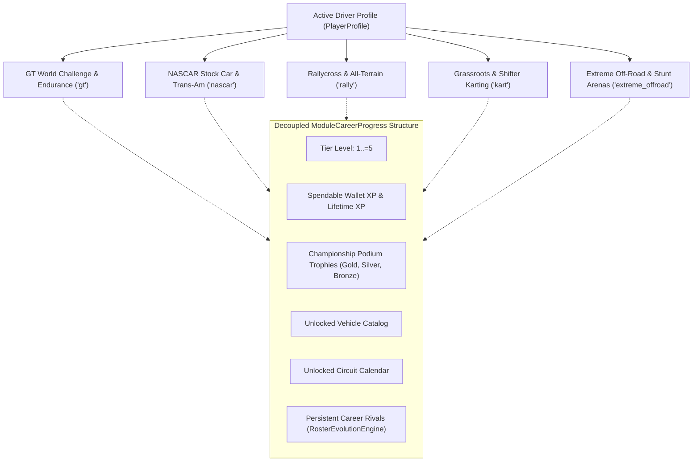
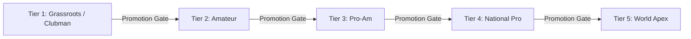

# Career Progression, Points Systems & Economy Reference 🏆🏁

Welcome to the definitive technical and gameplay reference manual for the **TdRace** career architecture. This document details the progression lifecycle across all five motorsport disciplines, including tournament points matrices, mathematical experience point (XP) formulas, tier promotion criteria, vehicle acquisition economics, starter rosters, and circuit unlocking calendars.

---

## 🏎️ 1. Career Architecture & Modality Decoupling

In **TdRace**, career progression is tracked independently for each of the five core motorsport disciplines. Progression in one discipline operates within its own sandbox and never alters car unlocks, circuit availability, wallet XP balances, or championship standings in another:



### Persistence Schema
Progression is backed by local SQLite storage in the `profile_module_progress` table managed by `HallOfFameDb`:

```rust
pub struct ModuleCareerProgress {
    pub profile_id: i64,
    pub module_id: String,           // "gt", "nascar", "rally", "kart", "extreme_offroad"
    pub xp: u64,                     // Spendable wallet balance for purchasing cars
    pub lifetime_xp: u64,            // Cumulative career experience points earned
    pub level: u32,                  // Active tier level (1..=5)
    pub unlocked_cars: Vec<String>,  // Owned / unlocked car model identifiers
    pub unlocked_tracks: Vec<String>,// Unlocked circuit slugs
    pub visited_tracks: Vec<String>, // Tracks completed at least once (exploration bonus)
    pub completed_events: Vec<String>,
    pub trophies_gold: u32,          // 1st place championship finishes
    pub trophies_silver: u32,        // 2nd place championship finishes
    pub trophies_bronze: u32,        // 3rd place championship finishes
    pub career_rivals: Vec<CareerRivalEntry>,
    pub active_championship: Option<ChampionshipSession>,
}
```

---

## 📊 2. Championship Points Systems

Multi-round tournaments and career cups compute driver standings after each round using `PointSystem::points_for_position`. **TdRace** supports four authentic motorsport scoring presets and fully custom matrices:

| Position | FIA Standard | MotoGP | Classic Arcade | NASCAR Cup |
| :---: | :---: | :---: | :---: | :---: |
| **1st** | **25** | **25** | **10** | **40** |
| **2nd** | **18** | **20** | **6** | **35** |
| **3rd** | **15** | **16** | **4** | **34** |
| **4th** | **12** | **13** | **3** | **33** |
| **5th** | **10** | **11** | **2** | **32** |
| **6th** | **8** | **10** | **1** | **31** |
| **7th** | **6** | **9** | 0 | **30** |
| **8th** | **4** | **8** | 0 | **29** |
| **9th** | **2** | **7** | 0 | **28** |
| **10th** | **1** | **6** | 0 | **27** |
| **11th** | 0 | **5** | 0 | **26** |
| **12th** | 0 | **4** | 0 | **25** |
| **13th** | 0 | **3** | 0 | **24** |
| **14th** | 0 | **2** | 0 | **23** |
| **15th** | 0 | **1** | 0 | **22** |
| **16th–35th** | 0 | 0 | 0 | $37 - \text{pos}$ |
| **36th+** | 0 | 0 | 0 | **1** |
| **Bonus Points** | **+1 pt** for Fastest Lap (if in P1–P10) | None | None | **+10 pts** for Stage Win / Fastest Lap |

### Scoring Variants & Regulations
- **FIA Standard** (`PointSystem::FiaStandard { fastest_lap_bonus: bool }`): Standard Formula 1 and FIA GT World Challenge scoring. The fastest lap bonus is only credited if the driver finishes inside the top 10 positions.
- **MotoGP** (`PointSystem::MotoGp`): Deep top-15 points distribution encouraging mid-pack battles.
- **Classic Arcade** (`PointSystem::ClassicArcade`): Nostalgic 6-place scoring with steep drop-offs from podium spots.
- **NASCAR Cup** (`PointSystem::NascarCup { stage_win_bonus: bool }`): Authentic 40-driver field progression where every finishing spot yields points. Setting `stage_win_bonus: true` awards $+10$ points to the driver clocking the fastest lap of the round.
- **Custom Matrix** (`PointSystem::Custom(Vec<u32>)`): Declarative list of point values defined per series in TOML.

---

## 💰 3. Experience Points (XP) Economy

Experience Points represent both a driver's career prestige (`lifetime_xp`) and spendable currency (`xp`) used in the **Garage** to purchase higher-tier machinery.

### 1. Distance-Based Lap XP
Lap rewards are directly proportional to real-world track length:

$$\text{per\_lap\_xp} = \text{round\_to\_10}\left(\frac{L_{\text{track\_meters}}}{10.0}\right)$$

$$\text{lap\_xp} = \text{per\_lap\_xp} \times N_{\text{completed\_laps}}$$

*Example*: On *Spa-Francorchamps* ($7,004\,\text{m}$), each lap yields $\text{round\_to\_10}(700.4) = 700\,\text{XP}$. A 3-lap sprint yields $2,100\,\text{XP}$.

### 2. Race Completion Bonus
Completing all scheduled laps awards an instant finish bonus that duplicates the earned lap XP:

$$\text{completion\_bonus} = \text{lap\_xp}$$

*Example*: On the Spa-Francorchamps 3-lap sprint, finishing the race awards an additional $+2,100\,\text{XP}$, bringing the baseline race award to $4,200\,\text{XP}$.

### 3. First-Time Circuit Exploration Bonus
To incentivize exploring new venues, the first time a circuit is finished in a discipline, a large bonus is credited based on current career tier:

$$\text{first\_time\_bonus}(\text{tier}) = \text{round\_to\_10}(\text{tier} \times 250\,\text{XP})$$

| Career Tier | First-Time Bonus |
| :---: | :---: |
| **Tier 1** | **$+250\text{ XP}$** |
| **Tier 2** | **$+500\text{ XP}$** |
| **Tier 3** | **$+750\text{ XP}$** |
| **Tier 4** | **$+1,000\text{ XP}$** |
| **Tier 5** | **$+1,250\text{ XP}$** |

Upon award, the circuit slug is committed to `visited_tracks`, ensuring it is only claimed once per discipline.

### 4. Total Race XP Award
The total XP awarded to the wallet at the finish line is:

$$\text{total\_race\_xp} = \text{lap\_xp} + \text{completion\_bonus} + \text{first\_time\_bonus}$$

```rust
self.active_career_progress.add_xp(total_xp);
// Automatically updates spendable xp and cumulative lifetime_xp
```

---

## 🎖️ 4. Tier Advancement & Promotion Gates

Every motorsport discipline features **5 distinct career tiers**:



### The Dual Promotion Gate Criteria
Advancing from `level` to `level + 1` requires meeting **both** mandatory criteria checked in `ModuleCareerProgress::can_advance_tier`:

1. **Championship Podium Finish**:
   The player must have placed in the top 3 of at least one completed championship season in that discipline:
   $$\text{trophies\_gold} + \text{trophies\_silver} + \text{trophies\_bronze} \ge 1$$
2. **Spendable Wallet XP Target**:
   The player must possess sufficient spendable XP balance to cover the entry vehicle of the next tier:
   $$\text{xp} \ge \text{car\_cost}(\text{level} + 1) = (\text{level} + 1) \times 1,000\,\text{XP}$$

### Promotion Matrix

| Advancement | Min Podium | Spendable XP Target | Content Unlocked |
| :---: | :---: | :---: | :--- |
| **Tier 1 $\to$ Tier 2** | $\ge 1$ Podium | **$2,000\text{ XP}$** | 3 Tier 2 Circuits, Tier 2 Starter Vehicle, Tier 2 AI Roster |
| **Tier 2 $\to$ Tier 3** | $\ge 1$ Podium | **$3,000\text{ XP}$** | 3 Tier 3 Circuits, Tier 3 Starter Vehicle, Tier 3 AI Roster |
| **Tier 3 $\to$ Tier 4** | $\ge 1$ Podium | **$4,000\text{ XP}$** | 3 Tier 4 Circuits, Tier 4 Starter Vehicle, Tier 4 AI Roster |
| **Tier 4 $\to$ Tier 5** | $\ge 1$ Podium | **$5,000\text{ XP}$** | 3 Tier 5 Circuits, Tier 5 Starter Vehicle, Tier 5 AI Roster |
| **Tier 5** | Max | — | *Pinnacle Reached (World Endurance Apex)* |

### Execution Mechanics in the Career Hub
When both conditions are satisfied, the **Career Hub UI** highlights:

`PROMOTION READY! PRESS [P] TO ADVANCE TIER`

Pressing **`[P]`** executes `ModuleCareerProgress::advance_tier()`:
- `level` increments to the new tier.
- `sync_unlocks_for_level()` unlocks three new authentic venues for that tier.
- `RosterEvolutionEngine::evolve_roster()` advances AI rival skills and introduces new high-tier opponents.
- The state is persisted immediately to SQLite.

> [!NOTE]
> Advancing your tier **does not deduct** the target XP from your wallet! It verifies that your wallet balance is large enough to afford a new car. You still retain your XP to choose which vehicle to buy in the Garage.

---

## 🚗 5. Car Acquisition & Garage Economy

Vehicles are gated by tier and purchased in the **Interactive Garage** (`GameState::Garage`) using spendable XP.

### 1. Vehicle Pricing Formula
The purchase price of any vehicle is strictly governed by its homologated category tier:

$$\text{car\_cost}(\text{tier}) = \text{tier} \times 1,000\,\text{XP}$$

| Category Tier | Vehicle Purchase Price |
| :---: | :---: |
| **Tier 1** | **$1,000\text{ XP}$** |
| **Tier 2** | **$2,000\text{ XP}$** |
| **Tier 3** | **$3,000\text{ XP}$** |
| **Tier 4** | **$4,000\text{ XP}$** |
| **Tier 5** | **$5,000\text{ XP}$** |

### 2. Free Starter Cars per Discipline
Drivers receive authentic entry machinery immediately upon starting or promoting to a tier:

| Discipline | Tier 1 Starter | Tier 2 Starter | Tier 3 Starter | Tier 4 Starter | Tier 5 Starter |
| :--- | :--- | :--- | :--- | :--- | :--- |
| **GT Challenge** | `gt_toyota_supra_gt4`<br>`gt4_clubsport` | *(Buy via Garage)* | *(Buy via Garage)* | *(Buy via Garage)* | *(Buy via Garage)* |
| **NASCAR** | `nascar_monte_carlo_ss` | `nascar_super_late_model` | `nascar_arca_chevy_ss` | `nascar_silverado_truck` | `nascar_corvette_ta1` |
| **Rallycross** | `rally_peugeot_208_rally4` | `rally_audi_s1_wrx` | `rally_audi_sport_quattro_s1`| `rally_toyota_hilux_dakar`| `rally_robby_gordon_sst` |
| **Karting** | `kart_crg_hero_60` | `kart_tony_kart_racer_ok` | `kart_birel_art_kz2` | `kart_honda_mean_mower` | `kart_anderson_cs250` |
| **Extreme Off-Road**| `offroad_sand_rail_buggy` | `offroad_ford_bronco_dr` | `offroad_arctic_hilux_at44`| `offroad_pro4_unlimited_chevy`| `offroad_bigfoot_monster_truck`|

### 3. Purchasing Eligibility Rules
Purchasing a car through `ModuleCareerProgress::buy_car` enforces three invariants:
1. `!is_car_unlocked(car_id)`: Vehicle must not already be in the driver's garage.
2. `self.level >= car.tier`: Driver must have unlocked the vehicle's tier.
3. `self.xp >= car_cost(car.tier)`: Driver must hold sufficient spendable XP.

Executing the purchase subtracts the cost from spendable `xp` while preserving `lifetime_xp`.

---

## 🗺️ 6. Circuit Unlock Schedules

Each motorsport discipline features **5 default starter tracks** in Tier 1, followed by **3 additional tracks unlocked per tier**:

```
Tier 1: 5 tracks (Starter Calendar)
Tier 2: +3 tracks (8 total unlocked)
Tier 3: +3 tracks (11 total unlocked)
Tier 4: +3 tracks (14 total unlocked)
Tier 5: +3 tracks (17 total unlocked)
```

### Full Circuit Gating Directory

#### 🏎️ Gran Turismo & Endurance (`gt`)
- **Tier 1 (5 circuits)**: `red_bull_ring`, `zandvoort`, `nurburgring_gp`, `portimao_gp`, `montreal`
- **Tier 2 (3 circuits)**: `monza`, `silverstone`, `catalunya`
- **Tier 3 (3 circuits)**: `spa`, `cota`, `bahrain`
- **Tier 4 (3 circuits)**: `suzuka`, `interlagos`, `bathurst`
- **Tier 5 (3 circuits)**: `le_mans_sarthe`, `monaco`, `marina_bay`

#### 🏁 NASCAR Stock Car (`nascar`)
- **Tier 1 (5 circuits)**: `martinsville_speedway`, `bristol_motor_speedway`, `eldora_speedway`, `bowman_gray_stadium`, `lucas_oil_irp`
- **Tier 2 (3 circuits)**: `charlotte_motor_speedway`, `darlington_raceway`, `north_wilkesboro_speedway`
- **Tier 3 (3 circuits)**: `iowa_speedway`, `watkins_glen_nascar`, `road_america`
- **Tier 4 (3 circuits)**: `indianapolis_motor_speedway`, `pocono_raceway`, `chicago_street_course`
- **Tier 5 (3 circuits)**: `daytona_superspeedway`, `talladega_superspeedway`, `phoenix_raceway`

#### 🌲 Rallycross & All-Terrain (`rally`)
- **Tier 1 (5 circuits)**: `holjes_rx`, `lydden_hill`, `mettet_rx`, `dreux_rx`, `blyton_rx`
- **Tier 2 (3 circuits)**: `hell_rx`, `loheac_rx`, `silverstone_rx`
- **Tier 3 (3 circuits)**: `estering_rx`, `montalegre_rx`, `riga_rx`
- **Tier 4 (3 circuits)**: `nyirad_rx`, `kouvola_rx`, `killarney_rx`
- **Tier 5 (3 circuits)**: `catalunya_rx`, `yas_marina_rx`, `essay_rx`

#### ⚡ Karting & Micro-Racers (`kart`)
- **Tier 1 (5 circuits)**: `lonato`, `genk`, `wackersdorf`, `laval_kart`, `whilton_mill`
- **Tier 2 (3 circuits)**: `sarno`, `kristianstad`, `seven_laghi`
- **Tier 3 (3 circuits)**: `pfi`, `franciacorta`, `ampfing`
- **Tier 4 (3 circuits)**: `zuera`, `silverstone_national_kart`, `le_mans_kart`
- **Tier 5 (3 circuits)**: `portimao_kart`, `valencia_kart`, `campillos`

#### 🚜 Extreme Off-Road & Stunt Arenas (`extreme_offroad`)
- **Tier 1 (5 circuits)**: `sahara_dune_crossing`, `dirt_figure_eight`, `atacama_sand_basin`, `glamis_dunes`, `crandon_short_course`
- **Tier 2 (3 circuits)**: `red_rock_canyon`, `mud_slough_arena`, `baja_500_desert_scrub`
- **Tier 3 (3 circuits)**: `arctic_frozen_lake`, `alpine_snow_ridge`, `rovaniemi_ice_ring`
- **Tier 4 (3 circuits)**: `supercross_stadium_arena`, `gravel_quarry_chasm`, `louisiana_mud_swampland`
- **Tier 5 (3 circuits)**: `monster_colosseum`, `glacier_crest_pass`, `stunt_city_megastructure`

---

## 🤖 7. AI Competitor Roster Evolution

When advancing between tiers, career AI opponents dynamically progress via the `RosterEvolutionEngine`:

1. **Roster Retention**: High-performing AI rivals are retained across seasons, preserving fierce driver rivalries.
2. **Skill Advancement**: Veteran competitors improve their execution competence, braking threshold precision, and top speed consistency to match the driver's new tier.
3. **Probabilistic Churn**: Underperforming competitors are retired or demoted, and fresh competitors sampled from the **72-character global driver database** are promoted into the tier.
4. **Style Integrity**: Rivals retain their inherent tactical driving styles (`Smooth`, `Aggressive`, `Tenacious`, `Calculating`, `Bold`, `Balanced`), ensuring varied on-track battles.

---

## 🛠️ 8. Developer Testing & Cheat Codes

For rapid engineering validation, the engine provides built-in development overrides:

- **Bypass Progression Checks (`--dev`)**: Launching with `--dev` instructs `is_car_unlocked` and `is_track_unlocked` to return `true` unconditionally, granting immediate access to all 25 categories and 96 circuits.
- **Direct Tier Startup (`--tier <1-5>`)**: Overrides the initial Garage and Career Hub tier selection on launch.
- **Headless Testing**: Integration suites in `crates/tdrace-app/tests/profile_tests.rs` execute isolated in-memory SQLite instances to verify promotion gates and transactions in microseconds.
