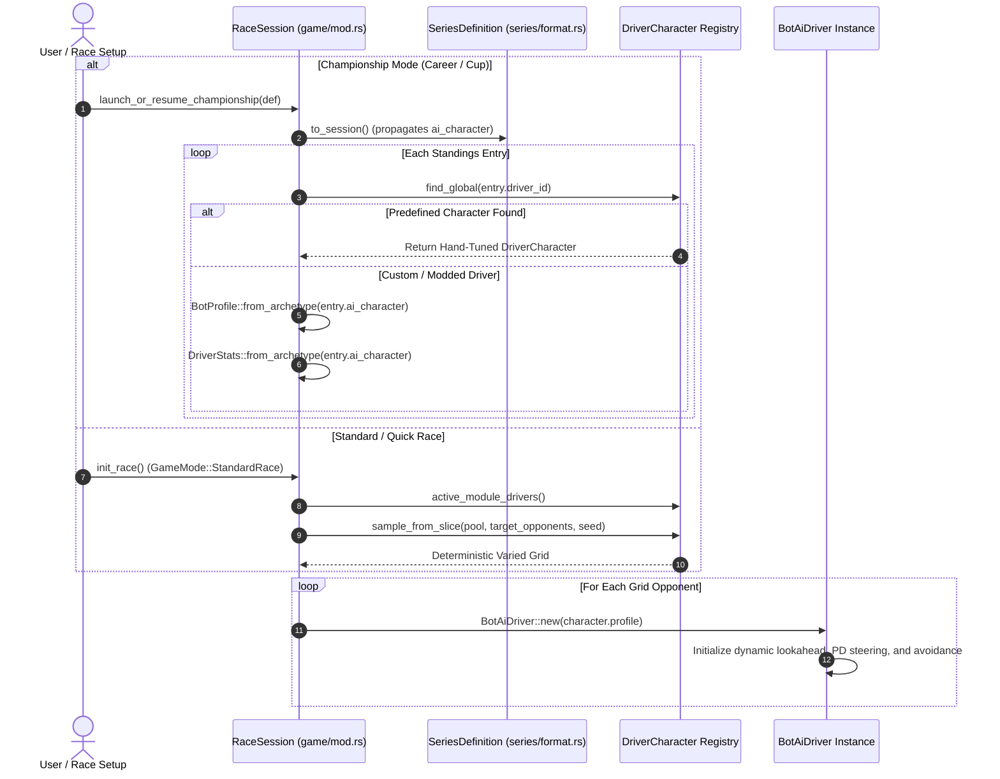

# AI Driving Archetypes & Predefined Character Behaviors 🏁🤖

## 1. Architectural Overview

The AI racing intelligence in **TdRace** operates on a **dual-layer architecture**:
1. **Orthogonal Behavioral System (`DrivingStyle` & `DriverTier`)**: Two independent, orthogonal axes that compose deterministically into closed-loop steering, braking, pacing, and collision-avoidance control laws (`BotProfile`) and telemetry dossier ratings (`DriverStats`):
   - **Driving Style (6 Styles)**: Tactical philosophy, racecraft line preference, and risk tolerance (`Smooth`, `Aggressive`, `Tenacious`, `Calculating`, `Bold`, `Balanced`).
   - **Experience & Quality (5 Tiers)**: Execution competence, physical limit exploitation, braking accuracy, and lap-to-lap consistency (`Tier 1: Rookie` through `Tier 5: Legend`).
   - Multiplying these gives **30 distinct behavioral profiles**.
2. **Predefined Driver Characters (`DriverCharacter`)**: A roster of **72 unique, hand-crafted competitors** spanning all 6 motorsport modules. Rather than generic clones, each character possesses specialized, hand-tuned parameters reflecting their lore, driving background, and vehicular discipline while mapping to an authentic style and experience tier.

```mermaid
flowchart TD
    subgraph Dimension 1: Driving Styles [6 Driving Styles]
        S1[Smooth: Precision & Momentum]
        S2[Aggressive: Late Braking & Divebombs]
        S3[Tenacious: Inside Line Defense]
        S4[Calculating: Draft & Gap Exploitation]
        S5[Bold: Drift Angles & Curb Hopping]
        S6[Balanced: Adaptable All-Rounder]
    end

    subgraph Dimension 2: Experience Tiers [5 Performance Tiers]
        T1[Tier 1: Rookie - Grassroots & High Variance]
        T2[Tier 2: Amateur - Clubman & Safe Padding]
        T3[Tier 3: Contender - National & Assertive]
        T4[Tier 4: Pro - Factory & Threshold Braking]
        T5[Tier 5: Legend - World Champion & Limit Exploitation]
    end

    subgraph Composite Engine [30 Runtime Profiles]
        CE[BotProfile::from_style_and_quality]
    end

    subgraph Handcrafted Rosters [72 Handcrafted Driver Characters]
        R1[12 Classic Heritage Drivers]
        R2[12 GT World Challenge Drivers]
        R3[12 NASCAR Stock Car Drivers]
        R4[12 Rally & Rallycross Drivers]
        R5[12 Karting Drivers]
        R6[12 Extreme Off-Road Drivers]
    end

    subgraph Runtime Execution [Game Modes & Sessions]
        G1[Standard Quick Race: Seeded Sampling]
        G2[Championship / Career: TOML ai_style + ai_tier]
        G3[Series Editor: Automated Archetype Classifier]
        G4[Fallback: Legacy ai_character Mapping]
    end

    Dimension 1: Driving Styles --> Composite Engine
    Dimension 2: Experience Tiers --> Composite Engine
    Composite Engine --> Handcrafted Rosters
    Handcrafted Rosters --> Runtime Execution
```

---

## 2. The AI Controller Physics Model

AI bot behaviors are calculated at 60 Hz in [`BotAiDriver::compute_controls`](../../crates/tdrace-app/src/ai/mod.rs#L225) using dynamic track spline projections and vehicle state vectors. Seven primary parameters govern their driving style:

### Parameter Reference Matrix

| Parameter | Type / Range | Physical Meaning in Simulation | Low Value Effect | High Value Effect |
| :--- | :---: | :--- | :--- | :--- |
| **`lookahead_time`** | $0.20 \dots 0.55\,\text{s}$ | Dynamic waypoint projection horizon ($d_{\text{lookahead}} = v \cdot t_{\text{lookahead}}$). | Reactive, sharp apex turning, tighter cornering radius. | Anticipatory, smooth radius smoothing, stable high-speed tracking. |
| **`speed_factor`** | $0.80 \dots 1.15\times$ | Corner entry and apex target speed multiplier against curvature limit. | Conservative corner entry, early lift-off. | Aggressive entry, pushing tires to limits of lateral grip saturation. |
| **`steering_kp`** | $1.5 \dots 3.5$ | Proportional gain for heading error correction ($\delta_P = k_p \cdot \Delta\theta$). | Relaxed, gradual steering inputs; less twitchy. | Snappy, immediate turn-in; aggressive trajectory adjustments. |
| **`steering_kd`** | $0.03 \dots 0.12$ | Derivative damping gain on angular yaw velocity ($\delta_D = k_d \cdot \dot{\theta}$). | Prone to oversteer slides and high slip-angle drifting. | Highly damped, disciplined yaw stabilization, countersteer catch. |
| **`brake_margin`** | $0.80 \dots 1.45\times$ | Multiplier on calculated stopping distance ($d_{\text{stop}} \cdot \text{margin}$). | Late-braking divebombs, high risk of corner overshooting. | Early, safe braking zones; clean and stable corner entry. |
| **`aggression`** | $0.20 \dots 1.00$ | Overtaking eagerness, draft lock, and inside-line contest probability. | Passive, yields racing line easily, avoids door-to-door combat. | Relentless divebombs, forces passes, closes doors firmly. |
| **`avoidance_distance`**| $3.5 \dots 12.0\,\text{m}$ | Proximity safety bubble radius for dynamic obstacle avoidance. | Tight, wheel-to-wheel tolerance; comfortable in crowded packs. | Large defensive safety buffer; gives wide berth to rivals. |

---

## 3. Orthogonal Driving Styles & Quality Tiers

Rather than conflating experience with driving philosophy, the simulation engine composes **6 pure styles** with **5 quality levels** (matching motorsport vehicle Tiers 1–5).

### 3.1 The 6 Pure Driving Styles

| Style | Tactical Lore & Driving Philosophy | Base `lookahead` | Base `steering_kp` | Base `steering_kd` | Base `brake` | Base `aggression` | Base `avoidance` | Speed Multiplier |
| :--- | :--- | :---: | :---: | :---: | :---: | :---: | :---: | :---: |
| **`smooth`** | Precision Pilot: Minimum scrub, liquid-smooth inputs, tire preservation. | $0.40\,\text{s}$ | $2.30$ | $0.08$ | $1.02\times$ | $0.70$ | $6.5\,\text{m}$ | $1.01\times$ |
| **`aggressive`** | Divebomber / Brawler: Late brakes, forces inside passes, door-to-door pressure. | $0.32\,\text{s}$ | $2.50$ | $0.05$ | $0.90\times$ | $0.95$ | $5.0\,\text{m}$ | $1.02\times$ |
| **`tenacious`** | Defender / The Wall: Defensive line holding, inside lane lock, hard to pass. | $0.42\,\text{s}$ | $2.20$ | $0.08$ | $1.05\times$ | $0.82$ | $6.0\,\text{m}$ | $0.99\times$ |
| **`calculating`** | Strategist: Slipstream drafting, tactical patience, gap exploitation. | $0.39\,\text{s}$ | $2.40$ | $0.07$ | $1.00\times$ | $0.75$ | $6.5\,\text{m}$ | $1.00\times$ |
| **`bold`** | Drift Renegade: High slip angles, curb hopping, loose rear-end rotation. | $0.31\,\text{s}$ | $2.70$ | $0.04$ | $0.88\times$ | $0.92$ | $5.2\,\text{m}$ | $1.01\times$ |
| **`balanced`** | All-Rounder: Adaptable baseline across mixed surfaces and weather conditions. | $0.38\,\text{s}$ | $2.10$ | $0.07$ | $1.05\times$ | $0.65$ | $7.0\,\text{m}$ | $0.98\times$ |

### 3.2 The 5 Experience & Quality Tiers

| Tier | Enum Variant | Motorsport Ladder Level | `pace_limit` | `brake_padding` | `avoidance_padding` | `consistency` | `composure` |
| :---: | :--- | :--- | :---: | :---: | :---: | :---: | :---: |
| **T1** | **`Rookie`** | Grassroots / Cadet / Novice | $0.88\times$ | $+0.22\times$ | $+2.5\,\text{m}$ | $0.60$ | $0.50$ |
| **T2** | **`Amateur`** | Regional Clubman / Gentleman Driver | $0.92\times$ | $+0.14\times$ | $+1.5\,\text{m}$ | $0.72$ | $0.65$ |
| **T3** | **`Contender`** | National Series / Semi-Pro Contender | $0.96\times$ | $+0.07\times$ | $+0.8\,\text{m}$ | $0.83$ | $0.78$ |
| **T4** | **`Pro`** | Factory GT3 / NASCAR Regular / Veteran | $1.00\times$ | $+0.00\times$ | $+0.0\,\text{m}$ | $0.93$ | $0.90$ |
| **T5** | **`Legend`** | World Champion / Multi-Title "Alien" | $1.04\times$ | $-0.03\times$ | $-0.5\,\text{m}$ | $0.99$ | $0.98$ |

### 3.3 Runtime Composition Formulas (`BotProfile`)

```rust
let speed_factor = (quality.pace_limit * style.speed_multiplier).clamp(0.80, 1.15);
let brake_margin = (style.base_brake + quality.brake_padding).clamp(0.80, 1.45);
let avoidance_distance = (style.base_avoidance + quality.avoidance_padding).clamp(3.5, 12.0);
let lookahead_time = (style.base_lookahead * (0.80 + 0.20 * quality.consistency)).clamp(0.20, 0.55);
let steering_kd = style.base_kd * (0.75 + 0.25 * quality.consistency);
```

### 3.4 Visible Rating Attributes (`DriverStats`)

Generated for player dossiers, starting grids, and championship standings:

| Metric | Primary Driving Factor | Formula / Dynamic Behavior |
| :--- | :--- | :--- |
| **Pace & Speed** | `DriverQuality.pace_limit` | $0.70 + (\text{pace\_limit} - 0.85) \cdot 1.5$ (Rookie: $\sim 0.75$, Legend: $\sim 0.99$) |
| **Aggression** | `DrivingStyle.aggression` | Reflects style risk appetite ($0.65 \dots 0.96$) |
| **Precision** | `DriverQuality.consistency` | Scaled by tier consistency ($0.60 \dots 0.99$) modulated by style precision |
| **Defense** | `DrivingStyle.base_defense` | Modified by tier composure ($0.50 \dots 0.98$) |

### 3.5 Legacy Archetype Backwards Compatibility

Legacy TOML series with `ai_character = "..."` seamlessly map to the orthogonal system:
- `"smooth"` $\to$ `DrivingStyle::Smooth` + `DriverTier::Pro`
- `"aggressive"` / `"brawler"` $\to$ `DrivingStyle::Aggressive` + `DriverTier::Pro`
- `"tenacious"` / `"defender"` $\to$ `DrivingStyle::Tenacious` + `DriverTier::Pro`
- `"calculating"` / `"tactical"` $\to$ `DrivingStyle::Calculating` + `DriverTier::Pro`
- `"fast"` / `"pro"` / `"hotlap"` $\to$ `DrivingStyle::Smooth` + `DriverTier::Legend`
- `"balanced"` / `"club"` $\to$ `DrivingStyle::Balanced` + `DriverTier::Contender`
- `"strategic"` / `"draft"` $\to$ `DrivingStyle::Calculating` + `DriverTier::Pro`
- `"bold"` / `"drift"` $\to$ `DrivingStyle::Bold` + `DriverTier::Pro`
- `"rookie"` / `"cautious"` $\to$ `DrivingStyle::Balanced` + `DriverTier::Rookie`


---

## 4. Handcrafted Driver Characters & Archetype Mapping

Every driver character across all 6 motorsport modules (72 competitors in total) is hand-tuned to embody one of the 6 pure driving styles (`Smooth`, `Aggressive`, `Tenacious`, `Calculating`, `Bold`, `Balanced`), exactly 2 drivers per style in each module. Predefined characters carry no level/experience tier (`DriverTier` is decoupled from characters), ensuring that casual races, quick races, and multiplayer roster fillings operate cleanly without legacy fallbacks or artificial handicap tiers. Minor differences in parameters ensure that every racer feels distinct.

### 4.1 Classic Heritage Module (12 Drivers)

| Driver | Driving Style | Hand-Tuned Profile Highlights | Hand-Tuned Stats (Spd / Agg / Prc / Def) | Tactical Lore & Driving Specialty |
| :--- | :---: | :--- | :---: | :--- |
| **Silvia Tanaka** | **`Smooth`** | `lookahead: 0.40`, `brake: 1.02`, `speed: 1.02` | $0.96$ / $0.72$ / $0.98$ / $0.88$ | Former open-wheel champion whose surgical precision carves through chicanes. |
| **Marco Rossi** | **`Aggressive`** | `lookahead: 0.32`, `brake: 0.88`, `aggression: 0.95` | $0.98$ / $0.98$ / $0.92$ / $0.88$ | Wheel-to-wheel brawler braking at the absolute last millisecond into hairpins. |
| **Kenji Sato** | **`Bold`** | `steering_kd: 0.04`, `brake: 0.92`, `speed: 1.03` | $0.95$ / $0.92$ / $0.94$ / $0.82$ | Touge drift maestro executing controlled sideways slides around apexes. |
| **Elena Frost** | **`Calculating`** | `lookahead: 0.40`, `avoidance: 7.0`, `brake: 1.05` | $0.96$ / $0.76$ / $0.98$ / $0.92$ | Ice-cold circuit calculator who waits for mistakes and executes clean passes. |
| **Jax Reed** | **`Aggressive`** | `speed: 1.04`, `aggression: 0.92`, `brake: 0.95` | $0.97$ / $0.95$ / $0.90$ / $0.86$ | High-energy street racer diving deep into chicanes with sharp steering. |
| **Leo Bianchi** | **`Balanced`** | `lookahead: 0.38`, `speed: 1.00`, `brake: 1.04` | $0.94$ / $0.85$ / $0.94$ / $0.90$ | Karting prodigy with smooth inputs and adaptable multi-surface balance. |
| **Viktor Sterling** | **`Tenacious`** | `defense: 0.98`, `lookahead: 0.42`, `damping: 0.08` | $0.94$ / $0.88$ / $0.94$ / $0.98$ | Defends inside lines with an iron fist; virtually unpassable on corner entry. |
| **Maya Lin** | **`Smooth`** | `speed: 1.04`, `precision: 0.98`, `avoidance: 6.2` | $0.97$ / $0.80$ / $0.98$ / $0.88$ | High-downforce specialist finding extra grip where other drivers slip. |
| **Damon Clark** | **`Tenacious`** | `aggression: 0.92`, `brake: 0.98`, `steering_kp: 2.7` | $0.95$ / $0.92$ / $0.92$ / $0.95$ | Muscle-car heavy footer relying on horsepower and stubborn defense. |
| **Chloe Laurent** | **`Calculating`** | `precision: 0.98`, `speed: 1.02`, `lookahead: 0.40` | $0.95$ / $0.80$ / $0.97$ / $0.92$ | Endurance racer maintaining rhythmic, calculated pacing and race strategy. |
| **Hiroshi Takahashi** | **`Balanced`** | `speed: 1.03`, `brake: 1.00`, `steering_kp: 2.8` | $0.96$ / $0.88$ / $0.95$ / $0.90$ | Time-attack record setter balancing optimal tire traction on high-speed sweeps. |
| **Zane Holland** | **`Bold`** | `steering_kd: 0.04`, `brake: 0.89`, `aggression: 0.94` | $0.95$ / $0.94$ / $0.88$ / $0.82$ | Renegade stunt driver sliding sideways through transitions and hairpins. |

---

### 4.2 GT World Challenge & Endurance (12 Drivers)

| Driver | Driving Style | Hand-Tuned Profile Highlights | Hand-Tuned Stats (Spd / Agg / Prc / Def) | Tactical Lore & Driving Specialty |
| :--- | :---: | :--- | :---: | :--- |
| **Max Hunter** | **`Aggressive`** | `speed: 1.05`, `aggression: 0.88`, `avoidance: 6.0` | $0.99$ / $0.92$ / $0.98$ / $0.95$ | 4-time champion renowned for relentless pace and surgical late-braking overtakes. |
| **Charles Laurent** | **`Smooth`** | `speed: 1.06`, `lookahead: 0.38`, `brake: 0.98` | $0.98$ / $0.86$ / $0.97$ / $0.90$ | Scuderia virtuoso with unmatched single-lap hot-lap qualifying pace. |
| **Fernando Toro** | **`Tenacious`** | `defense: 0.97`, `lookahead: 0.40`, `aggression: 0.90` | $0.96$ / $0.90$ / $0.96$ / $0.97$ | Relentless defending veteran who places his car to make passing impossible. |
| **Sophia Becker** | **`Calculating`** | `precision: 0.99`, `lookahead: 0.41`, `brake: 1.02` | $0.97$ / $0.82$ / $0.99$ / $0.94$ | German endurance master calculating tire degradation and executing textbook lines. |
| **Liam Vance** | **`Calculating`** | `speed: 1.03`, `aggression: 0.85`, `avoidance: 5.8` | $0.96$ / $0.88$ / $0.95$ / $0.92$ | Master of slipstream pack racing, fuel management, and late-race charges. |
| **George Speed** | **`Balanced`** | `speed: 1.02`, `brake: 1.01`, `precision: 0.95` | $0.95$ / $0.86$ / $0.95$ / $0.93$ | Methodical British racer renowned for consistency across wet and dry tracks. |
| **Takumi Sato** | **`Smooth`** | `speed: 1.05`, `steering_kp: 2.8`, `brake: 0.97` | $0.98$ / $0.90$ / $0.96$ / $0.90$ | Super GT champion with sensational corner entry speed and tire management. |
| **Lewis Vance** | **`Tenacious`** | `speed: 1.05`, `precision: 0.99`, `avoidance: 6.2` | $0.98$ / $0.86$ / $0.99$ / $0.94$ | Multi-title legend whose unyielding positioning and racecraft fend off all rivals. |
| **Lando Vance** | **`Balanced`** | `lookahead: 0.39`, `speed: 1.04`, `precision: 0.97` | $0.97$ / $0.85$ / $0.97$ / $0.92$ | Versatile all-round simulator specialist using adaptive lines to maintain momentum. |
| **Oscar Rocket** | **`Bold`** | `speed: 1.04`, `steering_kp: 2.7`, `brake: 0.95` | $0.96$ / $0.89$ / $0.95$ / $0.90$ | Ice-calm young star fearless in high-speed sweeps like Eau Rouge and 130R. |
| **Carlos Wolf** | **`Aggressive`** | `speed: 1.04`, `aggression: 0.92`, `brake: 0.96` | $0.96$ / $0.92$ / $0.94$ / $0.93$ | Hard-charging fighter who forces rivals onto dirty track lines. |
| **Pierre Gascon** | **`Bold`** | `speed: 1.03`, `avoidance: 5.9`, `precision: 0.94` | $0.95$ / $0.88$ / $0.94$ / $0.91$ | Audacious overtaker making daring lunges during restarts. |

---

### 4.3 NASCAR Stock Car & Oval (12 Drivers)

| Driver | Driving Style | Hand-Tuned Profile Highlights | Hand-Tuned Stats (Spd / Agg / Prc / Def) | Tactical Lore & Driving Specialty |
| :--- | :---: | :--- | :---: | :--- |
| **Dale Vance** | **`Aggressive`** | `aggression: 0.98`, `avoidance: 4.8`, `brake: 0.95` | $0.98$ / $0.98$ / $0.93$ / $0.96$ | Feared black #3 legend. Master of bumper taps, draft locks, and intimidation. |
| **Chase Gordon** | **`Calculating`** | `lookahead: 0.38`, `precision: 0.97`, `brake: 0.99` | $0.98$ / $0.88$ / $0.97$ / $0.91$ | Precision road course virtuoso and aerodynamic drafting master. |
| **Richard Pettyfield** | **`Smooth`** | `defense: 0.98`, `precision: 0.96`, `lookahead: 0.39` | $0.96$ / $0.89$ / $0.96$ / $0.98$ | 200-win patriarch running the high line with unmatched pack defense. |
| **Rowdy Busch** | **`Aggressive`** | `avoidance: 4.6`, `aggression: 0.97`, `brake: 0.94` | $0.97$ / $0.97$ / $0.90$ / $0.92$ | Raw aggression and divebombs into turn 1 in superspeedway shootouts. |
| **Jimmie Johnson** | **`Calculating`** | `precision: 0.99`, `lookahead: 0.40`, `brake: 1.01` | $0.96$ / $0.86$ / $0.99$ / $0.95$ | Seven-time champion renowned for surgical consistency and tire preservation. |
| **Tony Stewart** | **`Bold`** | `avoidance: 4.9`, `steering_kp: 2.8`, `brake: 0.96` | $0.96$ / $0.95$ / $0.94$ / $0.93$ | Dirt track and short-track brawler sliding the high line at Bristol. |
| **Bobby Allison** | **`Tenacious`** | `defense: 0.94`, `precision: 0.95`, `lookahead: 0.37` | $0.95$ / $0.91$ / $0.95$ / $0.94$ | Alabama Gang leader with nerves of steel in 3-wide door-to-door packs. |
| **Bubba Wallace** | **`Balanced`** | `lookahead: 0.36`, `speed: 1.02`, `brake: 0.98` | $0.95$ / $0.93$ / $0.93$ / $0.92$ | Electrifying superspeedway ace using draft pushes to catapult into the lead. |
| **Joey Logano** | **`Balanced`** | `lookahead: 0.35`, `speed: 1.03`, `defense: 0.97` | $0.96$ / $0.96$ / $0.94$ / $0.97$ | Two-time Cup champion famed for ruthless blocking maneuvers and restart mastery. |
| **Bill Elliott** | **`Smooth`** | `speed: 1.04`, `precision: 0.97`, `brake: 1.02` | $0.98$ / $0.84$ / $0.97$ / $0.91$ | Record-holder for fastest qualifying speed ever at Talladega (212.809 mph). |
| **Cale Yarborough** | **`Bold`** | `aggression: 0.96`, `avoidance: 5.0`, `speed: 1.03` | $0.96$ / $0.96$ / $0.92$ / $0.95$ | Tough-as-nails charger who battles wheel-to-wheel to the checkered flag. |
| **Rusty Wallace** | **`Tenacious`** | `aggression: 0.93`, `defense: 0.94`, `steering: 2.7` | $0.95$ / $0.93$ / $0.95$ / $0.94$ | Aggressive short-track and road course warrior with high-downforce braking mastery. |

---

### 4.4 Rallycross & All-Terrain (12 Drivers)

| Driver | Driving Style | Hand-Tuned Profile Highlights | Hand-Tuned Stats (Spd / Agg / Prc / Def) | Tactical Lore & Driving Specialty |
| :--- | :---: | :--- | :---: | :--- |
| **Johan Vance** | **`Calculating`** | `speed: 1.05`, `precision: 0.98`, `lookahead: 0.38` | $0.99$ / $0.92$ / $0.98$ / $0.95$ | Multi-time champion dominating mixed surfaces with surgical joker lap timing. |
| **Mattias Storm** | **`Aggressive`** | `speed: 1.04`, `avoidance: 5.0`, `steering_kp: 2.9` | $0.98$ / $0.94$ / $0.96$ / $0.92$ | Thunderous launches and aggressive dirt slides on rallycross circuits. |
| **Timmy Hansenfield** | **`Calculating`** | `lookahead: 0.37`, `precision: 0.97`, `brake: 1.00` | $0.97$ / $0.90$ / $0.97$ / $0.93$ | World RX champion renowned for surgical overtaking and momentum conservation. |
| **Kevin Hansenfield** | **`Tenacious`** | `defense: 0.89`, `aggression: 0.95`, `avoidance: 5.1` | $0.96$ / $0.95$ / $0.93$ / $0.89$ | Junior Euro RX prodigy with unyielding Scandinavian flicks and rapid reflexes. |
| **Niclas Gron** | **`Balanced`** | `lookahead: 0.36`, `speed: 1.03`, `brake: 0.99` | $0.96$ / $0.91$ / $0.95$ / $0.91$ | Second-generation Finnish master unyielding on fast gravel sweeps and high jumps. |
| **Anton Mark** | **`Tenacious`** | `defense: 0.96`, `speed: 1.02`, `brake: 0.98` | $0.95$ / $0.93$ / $0.92$ / $0.96$ | Euro RX champion celebrated for ruthless defensive lines and hairpin braking. |
| **Timo Scheider** | **`Smooth`** | `precision: 0.96`, `lookahead: 0.39`, `brake: 1.01` | $0.94$ / $0.88$ / $0.96$ / $0.94$ | Two-time touring car champion bringing precise tarmac composure to dirt tracks. |
| **Sebastien Loebfield** | **`Smooth`** | `precision: 0.98`, `speed: 1.05`, `lookahead: 0.38` | $0.98$ / $0.93$ / $0.98$ / $0.95$ | Nine-time rally champion with peerless geometry and car control on any surface. |
| **Petter Solbergfield** | **`Bold`** | `speed: 1.04`, `aggression: 0.96`, `steering_kp: 2.8` | $0.97$ / $0.96$ / $0.94$ / $0.91$ | "Hollywood" showman whose blistering sideways slides ignite every stadium. |
| **Ken Blaster** | **`Bold`** | `steering_kd: 0.07`, `speed: 1.04`, `aggression: 0.97` | $0.96$ / $0.97$ / $0.93$ / $0.90$ | Stunt drifting maestro famous for smoke-filled AWD slides and fearless jumps. |
| **Andreas Bakkerud** | **`Aggressive`** | `speed: 1.03`, `aggression: 0.94`, `brake: 0.97` | $0.96$ / $0.94$ / $0.95$ / $0.92$ | Norwegian powerhouse with aggressive apex-hugging lines and explosive launches. |
| **Reinis Nitissfield** | **`Balanced`** | `speed: 1.03`, `avoidance: 5.2`, `brake: 0.99` | $0.95$ / $0.91$ / $0.96$ / $0.93$ | Youngest Euro RX champion in history with cold-blooded calculated overtakes. |

---

### 4.5 Karting & Micro-Racers (12 Drivers)

| Driver | Driving Style | Hand-Tuned Profile Highlights | Hand-Tuned Stats (Spd / Agg / Prc / Def) | Tactical Lore & Driving Specialty |
| :--- | :---: | :--- | :---: | :--- |
| **Marco Armani** | **`Aggressive`** | `steering_kp: 3.2`, `avoidance: 4.4`, `speed: 1.05` | $0.98$ / $0.92$ / $0.96$ / $0.92$ | Tony Kart factory prodigy whose aggressive turn-in dominates cadet karting. |
| **Lucas Vance** | **`Calculating`** | `lookahead: 0.32`, `precision: 0.98`, `brake: 1.00` | $0.97$ / $0.86$ / $0.98$ / $0.94$ | "The Professor" calculating slipstream drafts and tire scrub through chicanes. |
| **Alex Rossi** | **`Bold`** | `steering_kp: 3.1`, `avoidance: 4.6`, `brake: 0.99` | $0.97$ / $0.94$ / $0.94$ / $0.90$ | Birel ART ace leaping over apex curbs and fighting tooth-and-nail in hairpins. |
| **Sofia Lind** | **`Smooth`** | `precision: 0.99`, `lookahead: 0.33`, `brake: 1.01` | $0.96$ / $0.78$ / $0.99$ / $0.91$ | Kosmic Racing prodigy with unmatched qualifying consistency and apex clipping. |
| **Finn Korhonen** | **`Tenacious`** | `defense: 0.89`, `aggression: 0.88`, `steering_kp: 3.0` | $0.96$ / $0.88$ / $0.95$ / $0.89$ | Sodi Kart talent who carries high corner speed and defends firmly in damp weather. |
| **Leo Dupont** | **`Calculating`** | `lookahead: 0.32`, `speed: 1.02`, `avoidance: 4.8` | $0.95$ / $0.84$ / $0.96$ / $0.93$ | Energy Corse tactical racer stalking rivals and pouncing with instant acceleration. |
| **Mateo Silva** | **`Bold`** | `avoidance: 4.6`, `steering_kp: 2.9`, `brake: 0.99` | $0.95$ / $0.90$ / $0.93$ / $0.90$ | Parolin Motorsport racer known for lightning reflexes and daring outside passes. |
| **Dante Moretti** | **`Aggressive`** | `speed: 1.03`, `steering_kp: 3.1`, `aggression: 0.93` | $0.96$ / $0.93$ / $0.94$ / $0.91$ | Italian junior prodigy with aggressive curb-hopping lines and tire preservation. |
| **Marta Santos** | **`Tenacious`** | `defense: 0.93`, `precision: 0.97`, `brake: 1.00` | $0.96$ / $0.89$ / $0.97$ / $0.93$ | Spanish kart champion known for razor-sharp late braking and defensive placement. |
| **Kenzo Yamamoto** | **`Smooth`** | `precision: 0.98`, `speed: 1.03`, `lookahead: 0.33` | $0.95$ / $0.82$ / $0.98$ / $0.94$ | Suzuka kart specialist with silky smooth steering inputs and minimal scrub. |
| **Liam Callaghan** | **`Balanced`** | `speed: 1.02`, `steering_kp: 3.1`, `aggression: 0.95` | $0.95$ / $0.95$ / $0.92$ / $0.92$ | Irish veteran who thrives in tight chicanes and high-contact hairpins. |
| **Charlie Webb** | **`Balanced`** | `speed: 1.02`, `precision: 0.96`, `avoidance: 4.8` | $0.94$ / $0.87$ / $0.96$ / $0.92$ | British Superkart contender known for explosive acceleration out of slow corners. |

---

### 4.6 Extreme Off-Road & Stunt Arenas (12 Drivers)

| Driver | Driving Style | Hand-Tuned Profile Highlights | Hand-Tuned Stats (Spd / Agg / Prc / Def) | Tactical Lore & Driving Specialty |
| :--- | :---: | :--- | :---: | :--- |
| **Wyatt Cole** | **`Bold`** | `speed: 1.04`, `steering_kp: 2.8`, `brake: 0.98` | $0.97$ / $0.95$ / $0.92$ / $0.90$ | "Dust Devil" jumping sand dunes and riding berm walls with throttle wide open. |
| **Jaxson Rivera** | **`Balanced`** | `speed: 1.05`, `precision: 0.96`, `avoidance: 5.5` | $0.98$ / $0.92$ / $0.96$ / $0.92$ | Baja King reading whoops, rhythm sections, and rough washboards at high velocity. |
| **Astrid Lindholm** | **`Smooth`** | `precision: 0.99`, `lookahead: 0.40`, `brake: 1.02` | $0.95$ / $0.88$ / $0.99$ / $0.94$ | "Ice Queen" executing pinpoint drift transitions across frozen lakes and snowbanks. |
| **Bubba Beauregard** | **`Tenacious`** | `defense: 0.96`, `avoidance: 4.8`, `aggression: 0.98` | $0.93$ / $0.98$ / $0.88$ / $0.96$ | Deep South swamp buggy veteran powering through bottomless clay ruts and mud pits. |
| **Travis McGrath** | **`Bold`** | `steering_kp: 2.9`, `avoidance: 5.0`, `brake: 0.97` | $0.96$ / $0.96$ / $0.94$ / $0.88$ | Freestyle stunt icon and stadium supercross pioneer airing out jumps. |
| **Roxie Vance** | **`Calculating`** | `lookahead: 0.37`, `precision: 0.97`, `brake: 1.01` | $0.94$ / $0.90$ / $0.97$ / $0.95$ | Red Rock canyon crawler picking surgical apex placement through broken bedrock. |
| **Sven Lindqvist** | **`Tenacious`** | `defense: 0.93`, `lookahead: 0.38`, `speed: 1.03` | $0.95$ / $0.91$ / $0.95$ / $0.93$ | Rovaniemi ice ring champion with unmatched throttle feathering in blinding snow. |
| **Cruz Morales** | **`Aggressive`** | `speed: 1.03`, `steering_kp: 2.8`, `aggression: 0.97` | $0.95$ / $0.97$ / $0.91$ / $0.89$ | Gravel quarry daredevil launching vertical drops and riding high gravel berms. |
| **Dakota Black** | **`Aggressive`** | `speed: 1.03`, `steering_kp: 2.7`, `aggression: 0.95` | $0.95$ / $0.95$ / $0.93$ / $0.94$ | Appalachian rock-crawling daredevil whose brute-force line choices conquer granite shelves. |
| **Colton Haze** | **`Balanced`** | `speed: 1.03`, `steering_kp: 2.8`, `precision: 0.94` | $0.95$ / $0.94$ / $0.94$ / $0.91$ | Nevada desert raider famous for wide-open jumps across dry lakebeds. |
| **Elise Roux** | **`Smooth`** | `precision: 0.98`, `speed: 1.04`, `lookahead: 0.38` | $0.96$ / $0.89$ / $0.98$ / $0.93$ | French rally-raid pioneer with exceptional suspension feel on mountain ridges. |
| **Diego Valdez** | **`Calculating`** | `speed: 1.04`, `avoidance: 5.2`, `brake: 0.99` | $0.96$ / $0.93$ / $0.95$ / $0.94$ | Mexican SCORE champion who masters high-speed whoops and riverbed boulder hops. |

---

## 5. Runtime Resolution & Lifecycle



### Deterministic Seeded Grid Sampling
In quick race modes, identical first-$N$ sequential grids are prevented by [`DriverCharacter::sample_from_slice`](../../crates/tdrace-app/src/ai/driver.rs#L825). A 64-bit Linear Congruential Generator (LCG) shuffles the module driver pool deterministically according to the race session seed:

$$s_{k+1} = (s_k \cdot 6364136223846793005 + 1) \pmod{2^{64}}$$

This guarantees:
1. **Diversity**: Every race session rolls a fresh permutation of drivers.
2. **Determinism**: Replaying a race with the same seed reconstitutes the exact same opponent grid and starting order.
3. **Identity Preservation**: Each competitor retains their authentic bio, favorite cars, paint livery, and specialized `BotProfile`.
