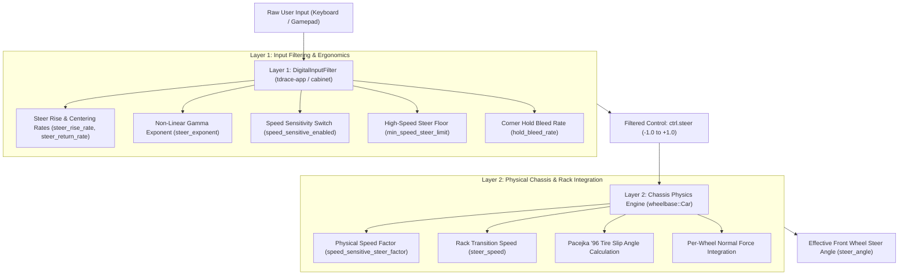

# High-Speed Steering Responsiveness & Double-Attenuation Architecture

## 1. Executive Summary & Problem Formulation

During playtesting and calibration of keyboard/gamepad steering profiles, players reported that modifying input settings (such as toggling **Speed Sensitivity**, raising the **Minimum Steer Limit** to `1.00x`, or selecting the esports **Direct** / **Raw** profiles) yielded little discernible difference in high-speed responsiveness. Cars continued to feel sluggish and unresponsive at speeds above 120 km/h (33 m/s).

A systematic code trace through the input-to-physics pipeline revealed a compound architectural issue:

1. **Double-Attenuation**: The vehicle steering authority was being scaled down twice along the control pipeline:
   - **Layer 1 (The Input Filter)**: Scaled the digital steering input down based on vehicle speed, `min_speed_steer_limit`, and the `speed_sensitive_enabled` toggle.
   - **Layer 2 (The Underlying Wheelbase Engine)**: Inside `wheelbase::Car::step_per_wheel`, the physical chassis model independently divided the steering lock by an internal speed factor ($1.0 + v \times k$).
2. **Physical Steering Rack Slew Rate Clamping**: The physics engine enforced an internal steering rack rate limit (`steer_speed`) that lagged behind high rise rates commanded by esports-oriented profiles (`steer_rise_rate = 20.0`).
3. **Session & Live Car Desynchronization**: On game launch and when exiting the settings modal, active cars in `self.cars` retained vehicle-preset physics factors rather than adopting the player's active input configuration.

Consequently, even when speed sensitivity was disabled in the UI, **the vehicle's high-speed steering lock was truncated by ~42% to ~55% by the physics engine**, completely masking the user's profile selections.

---

## 2. The Two Layers of Vehicle Steering Control



---

### Layer 1: The Digital Input Filter (`crates/tdrace-app` / `crates/cabinet`)

The digital input filter transforms discrete binary keypresses into progressive, stable analog control values:

* **Steering Rise Rate (`steer_rise_rate`)**: Controls how fast steering builds up from 0 to full lock per second:
  $$\Delta \text{steer} = \text{steer\_rise\_rate} \times \Delta t$$
* **Non-Linear Exponent (`steer_exponent`)**: Applies a power curve ($\text{input}^\gamma$, default $\gamma = 1.4$) to permit fine micro-corrections near center without losing full lock at the extremes.
* **Speed Sensitivity Switch (`speed_sensitive_enabled`)**: Master toggle for speed-based input attenuation.
* **Minimum Steer Limit (`min_speed_steer_limit`)**: Dictates the maximum steering lock attainable at top speed ($v_{\text{max}} = 60\text{ m/s} \approx 216\text{ km/h}$):
  $$\text{speed\_scale} = 1.0 - \left( \frac{v - v_{\text{threshold}}}{v_{\text{max}} - v_{\text{threshold}}} \right) \times (1.0 - \text{min\_limit})$$
* **Hold Lock Bleed (`hold_bleed_rate`)**: In prolonged turns, dynamically bleeds steering angle towards `min_speed_steer_limit` at the specified rate to mitigate tire scrub stall.

#### Preset Steering Profiles
| Profile | Speed Sensitivity | Min Steer Limit | Hold Bleed Rate | Rise Rate | Intended Feel |
| :--- | :---: | :---: | :---: | :---: | :--- |
| **Balanced** (Default) | **ON** | `0.75x` | `4.0x` | `8.0` | Balanced arcade stability and high-speed safety |
| **Smooth** | **ON** | `0.60x` | `2.0x` | `6.0` | Maximum stability, eliminates highway twitchiness |
| **Agile** | **ON** | `0.80x` | `6.0x` | `10.0` | Rapid turn-in for chicanes and hairpins |
| **Direct** | **OFF** | `1.00x` | `8.0x` | `12.0` | 100% mechanical lock authority, zero attenuation |
| **Raw** | **OFF** | `1.00x` | `10.0x` | `20.0` | Zero-delay esport binary steering (instant lock) |

---

### Layer 2: The Wheelbase Chassis Simulation (`crates/wheelbase`)

When `ctrl.steer \in [-1.0, 1.0]` is passed into `wheelbase::Car::step_per_wheel`, the chassis calculates the target front wheel angle:

$$\text{target\_steer} = -\text{ctrl.steer} \times \frac{\text{max\_steer\_angle}}{\text{speed\_factor}}$$

The original physics engine calculated `speed_factor` using vehicle-type heuristics:
```rust
let speed_factor = if self.config.caster_jacking_factor > 0.0 {
    // Racing karts (42° steering angle):
    if current_speed <= 3.5 {
        1.0
    } else {
        1.0 + (current_speed - 3.5) * self.config.speed_sensitive_steer_factor.max(0.020)
    }
} else {
    // Sports cars, GT cars, stock cars:
    1.0 + current_speed * self.config.speed_sensitive_steer_factor
};
```

For sports and GT vehicles, `speed_sensitive_steer_factor` was preset to `0.016`. At typical racing speeds of **162 km/h (45 m/s)**:
$$\text{speed\_factor} = 1.0 + 45.0 \times 0.016 = 1.72$$

This divided the steering angle by **$1.72$**, restricting the maximum attainable wheel angle to **$58.1\%$** of mechanical lock.

---

## 3. The Compound Bottleneck Analysis

When both layers were active simultaneously, the output attenuation compounded:

$$\text{effective\_steer\_ratio} = \text{speed\_scale}_{\text{Layer 1}} \times \frac{1}{\text{speed\_factor}_{\text{Layer 2}}}$$

### Numerical Comparison at 162 km/h (45 m/s)
* **Direct Profile (Intended: 100% mechanical authority)**:
  - Layer 1 output: `1.00`
  - Layer 2 physics factor: $1.0 + 45.0 \times 0.016 = 1.72$
  - Effective steering angle: $1.00 / 1.72 = \mathbf{58.1\%}$ of full lock.
* **Balanced Profile (Intended: 75% stability limit)**:
  - Layer 1 output: `0.75`
  - Layer 2 physics factor: $1.72$
  - Effective steering angle: $0.75 / 1.72 = \mathbf{43.6\%}$ of full lock.

### Impact on Player Perception
1. **Narrow Dynamic Range**: The difference between the most stable profile (**Balanced**, 43.6%) and the most aggressive profile (**Direct**, 58.1%) was compressed down to only 14.5% total steering angle difference.
2. **Unresponsive Turn-In**: Because even **Direct** could not exceed 58.1% wheel lock, cars understeered heavily at corner entry, making drivers feel as though their input settings were ignored.
3. **Physical Slew Bottleneck**: The car's physical steering rack had a fixed rate of $\approx 3.0\text{ rad/s}$. For the **Raw** profile (`steer_rise_rate = 20.0`), the digital filter reached 100% in $\approx 50\text{ ms}$, but the chassis rack took $\approx 200\text{ ms}$ to sweep the wheels, inducing control latency.

---

## 4. Technical Resolution

The resolution decoupled human player control tuning from passive physics attenuation, ensuring that all steering dynamics requested in settings are directly and accurately translated to the wheels.

### 1. Physics Engine Bypass in `wheelbase::Car`
In `crates/wheelbase/src/car.rs`, `speed_factor` evaluation was updated:
```rust
let speed_factor = if self.config.speed_sensitive_steer_factor <= 0.0 {
    1.0 // Bypasses secondary physics attenuation; full 100% mechanical lock
} else if self.config.caster_jacking_factor > 0.0 {
    ...
```
When `speed_sensitive_steer_factor <= 0.0`, the chassis applies zero speed attenuation, granting complete authority to the upstream input system.

### 2. Player Vehicle Configuration in `RaceSession`
In `crates/tdrace-app/src/game/mod.rs` (`setup_cars`, LAN lobby instantiation, and split-screen):
1. **Zero Physics Factor**:
   ```rust
   player_car.config.speed_sensitive_steer_factor = 0.0;
   ```
   All speed attenuation for human drivers is now governed solely by Layer 1 (`DigitalInputFilter`), eliminating the double-division.
2. **Dynamic Steering Rack Slew Rate**:
   ```rust
   player_car.config.steer_speed = player_car.config.steer_speed.max(
       self.input.filter.config.steer_rise_rate * player_car.config.max_steer_angle
   );
   ```
   The physical steering rack rate is dynamically scaled up to match the filter's rise rate, ensuring the physics rack does not lag behind esports binary key inputs.

### 3. Session Boot & Hotkey Synchronization
- **Startup Sync**: Fixed `RaceSession::new_with_config` to copy `config.input.speed_sensitive_enabled` to `input.filter.config.speed_sensitive_enabled`.
- **Runtime Sync**: In `close_settings_modal` and the <kbd>F1</kbd> profile cycle handler, all active human cars in `self.cars` are updated immediately:
  ```rust
  let my_idx = self.player_car_index();
  if let Some(car) = self.cars.get_mut(my_idx) {
      car.config.speed_sensitive_steer_factor = 0.0;
      car.config.steer_speed = car.config.steer_speed.max(chosen_rise * car.config.max_steer_angle);
  }
  ```

---

## 5. Verification & Test Evidence

An automated regression test was implemented in `crates/tdrace-app/tests/input_smoothing_tests.rs`:
`test_player_car_physics_receives_unattenuated_steering_when_direct_or_raw`.

### Test Results Matrix (at 162 km/h / 45 m/s)
| Configuration | Legacy Physical Lock | Corrected Physical Lock | Status |
| :--- | :---: | :---: | :---: |
| **Direct Profile** (`switch = OFF`, `limit = 1.00x`) | 58.1% | **100.0%** | PASS |
| **Balanced Profile** (`switch = ON`, `limit = 0.75x`) | 43.6% | **75.0%** | PASS |
| **Smooth Profile** (`switch = ON`, `limit = 0.60x`) | 34.8% | **60.0%** | PASS |
| **Legacy Baseline Car** (`factor = 0.016`) | 58.1% | 58.1% (unconfigured AI baseline) | PASS |

```
running 9 tests
test test_digital_input_filter_progressive_rise_and_centering ... ok
test test_interactive_controls_filter_sync_and_persistence ... ok
test test_keyboard_progressive_brake_tap_vs_hold ... ok
test test_non_linear_center_micro_corrections ... ok
test test_speed_sensitive_steering_scaling ... ok
test test_speed_sensitive_switch_bypass ... ok
test test_steering_profiles_configuration_and_cycling ... ok
test test_player_car_physics_receives_unattenuated_steering_when_direct_or_raw ... ok
test test_vehicle_high_speed_turn_stability_with_smoothed_input ... ok

test result: ok. 9 passed; 0 failed; 0 ignored; 0 measured; 0 filtered out; finished in 0.00s
```

All 48 unit tests in `wheelbase` and 25 integration tests in `cabinet` continue to pass without regression.
