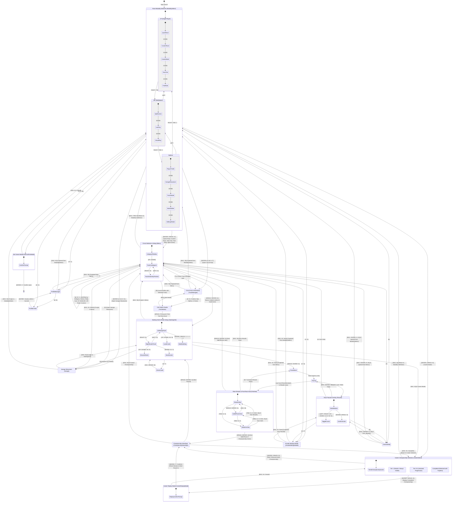

# TdRace Screen Architecture & Navigation Schema

This document provides a comprehensive reference for all user interface screens, state machines, transitions, and user inputs across the **TdRace** motorsport platform. It is formatted with both visual state machine diagrams and structured schemas for human developers and autonomous AI agents.

---

## 1. State Machine Navigation Diagram



---

## 2. Machine-Readable Screen Registry Schema (JSON)

For AI agents and automated testing frameworks, the screen catalog is formalized below:

```json
{
  "$schema": "https://json-schema.org/draft/2020-12/schema",
  "title": "TdRaceScreenRegistry",
  "type": "object",
  "properties": {
    "screens": {
      "type": "array",
      "items": {
        "type": "object",
        "required": ["state_id", "title", "category", "allowed_transitions", "input_shortcuts"],
        "properties": {
          "state_id": { "type": "string" },
          "title": { "type": "string" },
          "category": { "type": "string", "enum": ["Hub", "Menu", "Race", "Editor", "Profile", "Overlay"] },
          "parameters": { "type": "array", "items": { "type": "string" } },
          "allowed_transitions": {
            "type": "array",
            "items": {
              "type": "object",
              "required": ["target_state", "trigger"],
              "properties": {
                "target_state": { "type": "string" },
                "trigger": { "type": "string" },
                "description": { "type": "string" }
              }
            }
          },
          "input_shortcuts": { "type": "object", "additionalProperties": { "type": "string" } }
        }
      }
    }
  }
}
```

---

## 3. Screen Specifications & Navigation Catalog

### 3.1. Grand Hub (`GameState::ModuleSelect` - Retired / Legacy)
* **Purpose**: Historical platform entry point. Retired from the primary app boot lifecycle and navigation flow in Spec 066. The application now boots directly into `GameState::ModalitySelect`. Kept in the codebase for backward compatibility.
* **State Struct**: `GameState::ModuleSelect { selected_idx: usize }`
* **Components**:
  - Header with branding & Profile badge banner.
  - 5 Motorsport Module cards with titles, neon accent tags, descriptions, and active icons.
  - Active profile quick status.
  - Exit application confirmation dialog modal (`show_exit_confirm`).
  - Arcade Settings Modal (`settings_modal` overlay for Audio, Display Resolution, Window Mode, CRT scanlines, and Driver Assists).
* **Navigation & Shortcuts**:

| Key / Input | Action | Target / Result |
| :--- | :--- | :--- |
| `Up` / `Down` / `W` / `S` / `D-pad` | Select module | Changes `selected_idx` (0: Classic, 1: Rally, 2: Kart, 3: GT, 4: NASCAR) |
| `Enter` / `Space` / Gamepad `A` | Confirm module | Transitions to `GameState::ModalitySelect` configured for selected module |
| `X` | Open Settings Modal | Opens `ArcadeSettingsModal` overlay |
| `P` / Gamepad `Y` | Open Profile Manager | Transitions to `GameState::ProfileManager` |
| `N` / Gamepad `X` | Create Profile | Transitions to `GameState::ProfileCreate` |
| `K` | Controls Help | Transitions to `GameState::ControlsHelp(false)` |
| `Escape` / Gamepad `B` | Exit Game | Opens exit confirmation modal |

---

### 3.2. Race Modality Selection (`GameState::ModalitySelect`)
* **Purpose**: Primary platform entry point and modality selection stage separating Single Player (Quick Race, Custom Race, Career Mode, Time Trial, Free Ride), Multiplayer (2P Split Screen, LAN, Cloud), and Options (Player Profile, Garage Showroom, Track Studio, Series Editor, Settings) before circuit selection.
* **State Struct**: `GameState::ModalitySelect { category: ModalityCategory, selected_idx: usize, modal: Option<ModalityModal> }`
* **Components**:
  - Top Breadcrumbs: Active motorsport branding and profile summary badge.
  - Centered Category Tabs: `[ 1. SINGLE PLAYER ]`, `[ 2. MULTIPLAYER ]`, and `[ 3. OPTIONS ]`.
  - Translucent Glass Modality Cards: Displaying title, badge tag, description, and selection highlight.
  - Exit Application Confirmation Modal: Invoked on `[ESC]` / Gamepad `[B]` at root level (`UniversalConfirmModal::quit_game()`).
  - In-Development Notification Modal: Informational dialog for LAN and Cloud online play.
* **Navigation & Shortcuts**:

| Key / Input | Action | Target / Result |
| :--- | :--- | :--- |
| `Left` / `Right` / `Tab` / `1` / `2` / `3` / Gamepad `LB`/`RB` | Switch Category | Cycles across Single Player (1P), Multiplayer (MP), and Options |
| `Up` / `Down` / `W` / `S` / Gamepad `D-pad Y` | Navigate Cards | Selects card within active category |
| `Enter` / `Space` / Gamepad `A` | Confirm Selection | Casual Single Player & Split Screen -> `GameState::Menu`<br>Career Mode -> `GameState::CareerSelect`<br>Options -> `ProfileManager`, `Garage`, `TrackManager`, `SettingsModal` |
| `G` | Garage Showroom | Opens full-screen Garage showroom -> `GameState::Garage` |
| `T` | Circuit Catalogue | Opens Circuit Catalogue & Manager -> `GameState::TrackManager` |
| `P` / Gamepad `Y` | Profile Manager | Opens `GameState::ProfileManager` |
| `X` / `O` | Settings Modal | Opens `ArcadeSettingsModal` overlay |
| `Escape` / Gamepad `B` | Exit Game / Dismiss | Dismisses modal if open, otherwise opens Universal Exit Confirmation Modal |

---

### 3.3. Track & Setup Menu (`GameState::Menu`)
* **Purpose**: Circuit selection from a unified catalog containing official presets and user-created custom circuits, expanded vector map preview, telemetry analysis, and personal best lap timing records. In casual modes, features dynamic motorsport category filtering.
* **State Struct**: `GameState::Menu`
* **Components**:
  - **Left Column (Circuit Catalog)**:
    - **Category Filter Bar**: Neon category filter pills (`[ ALL ]`, `[ CLASSIC ]`, `[ RALLY ]`, `[ KART ]`, `[ GT ]`, `[ NASCAR ]`, `[ OFF-ROAD ]`, `[ CUSTOM ]`) navigable via `Q` / `E` or `<` / `>` or direct keys `1..=8`. Filters the displayed circuit list dynamically. Selecting and launching any circuit automatically synchronizes the engine's active motorsport module context to match that circuit's discipline.
    - **Filter Pill Bar**: Two neon filter tabs (`[ PRESETS [P] ]`, `[ CUSTOM [C] ]`) with live track counters.
    - **Circuit List**: Catalog list displaying either official motorsport presets or user-created custom circuits according to active filters. In the `[ CUSTOM ]` view, a dedicated **Track Manager [T]** entry is included to open the track management and organization hub. Custom circuits are distinguished by a golden `CUSTOM CIRCUIT` badge.
  - **Right Column Top (Circuit Dossier & Geometry Preview)**: Expanded full vector track layout preview (curbs, surface materials, checkpoints, start/finish direction arrow) + Circuit overview & classification tags (scale, country, closed circuit / sprint stage). When the **Track Manager [T]** entry is highlighted, this panel renders the Circuit Studio & Workshop overview with quick actions.
  - **Right Column Bottom (Circuit Timing & Telemetry Grid)**: Personal best lap record (`format_lap_time`), best race time / circuit completion, and 4-chip telemetry specifications grid (track length, track width, race laps & timing gates, grid capacity & off-track surface).
* **Navigation & Shortcuts**:

| Key / Input | Action | Target / Result |
| :--- | :--- | :--- |
| `Q` / `E` / `<` / `>` / `1..=8` | Filter by Category | Filters catalog by registered motorsport discipline (`ALL`, `CLASSIC`, `RALLY`, `KART`, `GT`, `NASCAR`, `OFF-ROAD`, `CUSTOM`) |
| `Left` / `Right` / `A` / `D` / `Tab` / Gamepad `D-pad X` | Toggle Filter Tab | Switches catalog filter between `[ PRESETS ]` and `[ CUSTOM ]` |
| `Up` / `Down` / `W` / `S` / Gamepad `D-pad Y` | Navigate Catalog | Scrolls circuit list within the active filter category |
| `Space` / `Enter` / Gamepad `A` | Confirm Selection | If circuit selected: synchronizes module context & loads circuit -> `GameState::StartingGrid`<br>If Track Manager selected: opens `GameState::TrackManager` |
| `T` | Open Track Manager | Directly opens Track Manager hub -> `GameState::TrackManager` |
| `C` | Clone Circuit | Duplicates highlighted preset or custom circuit into custom storage |
| `E` | Launch CAD Studio | Loads highlighted circuit into Track CAD Editor -> `GameState::TrackEditor` |
| `P` / Gamepad `Y` | Profile Manager | Opens `GameState::ProfileManager` |
| `X` / `O` | Open Settings Modal | Opens `ArcadeSettingsModal` overlay |
| `K` | Controls Help | Opens `GameState::ControlsHelp(false)` |
| `Escape` / `G` / Gamepad `B` | Return to Modality | Transitions back to Modality Selection -> `GameState::ModalitySelect` |

---

### 3.3. Starting Grid & Roster Setup (`GameState::StartingGrid`)
* **Purpose**: Two-panel pre-race setup screen displaying player profile, circuit telemetry, game mode selector, vehicle specifications, and full driver roster or shadow car telemetry.
* **State Struct**: `GameState::StartingGrid`
* **Components**:
  - **Left Panel (Race & Vehicle Setup Cards)**:
    1. *Game Mode Selector Card (Card 0)*: Switch between the 4 supported game modes with title, status tag, and mode description:
       - **Standard Race**: Competitive grid race where all drivers use the circuit's predefined car.
       - **Experimental Race**: Multi-car grid race where all drivers use the user-specified vehicle model.
       - **Time Trial**: Solo session racing against personal best time rendered as a dynamic shadow car. Allows changing car.
       - **Free Ride**: Solo open practice to freely test the circuit and vehicle handling. Allows changing car.
    2. *Vehicle Selection & Specs Card (Card 1)*:
       - Car model switcher `[Enter / Space / < / > ]` (enabled in `Experimental Race`, `Time Trial`, and `Free Ride`).
       - Enforced predefined lock badge (in `Standard Race`).
       - 4 Performance stat bars (`SPEED`, `ACCEL`, `GRIP`, `DRIFT` with exact percentages).
       - 4 Mechanical specs chips (Drivetrain, Mass, Top Speed, Downforce).
    3. *Grid Configuration Card (Card 2)*:
       - Bot count modifier `[Enter / Space / + / - ]` for grid races.
       - Solo telemetry & personal best benchmark record for Time Trial / Free Ride.
    4. *Launch Race Action Button (Card 3)*:
       - High-visibility green action button `[Enter / Space / Click]` to start the 3-2-1 race countdown immediately.
  - **Right Panel (Starting Grid & Driver Roster)**:
    - *In Standard & Experimental Race*: Full starting grid lineup (P1 through P8) with position badges, driver names, aliases, liveries, car models, and qualifying times.
    - *In Time Trial*: Live player driver row (P1) + Personal Best Shadow Car row with ghost benchmark lap time.
    - *In Free Ride*: Solo driver practice slot with telemetry and tuning tips.
* **Navigation & Shortcuts**:

| Key / Input | Action | Target / Result |
| :--- | :--- | :--- |
| `Left` / `Right` / `A` / `D` / Gamepad `D-pad X` | Switch Panel Focus | Switches active focus between **Left Setup Panel** and **Right Starting Grid Roster** |
| `Up` / `Down` / `W` / `S` / Gamepad `D-pad Y` (Left Panel) | Navigate Setup Cards | Moves active selection between Game Mode (0), Vehicle Specs (1), Bot Count (2), and Launch Race Button (3) |
| `Enter` / `Space` / `[` / `]` / `+` / `-` (Cards 0–2) | Modify Active Card | Modifies the currently selected setting (cycles mode on Card 0, changes car on Card 1, changes bots on Card 2) |
| `Enter` / `Space` / Mouse Click (Card 3) | Launch Race Button | Starts 3-2-1 countdown -> `GameState::Countdown(3.5)` |
| `Up` / `Down` / `W` / `S` / Gamepad `D-pad Y` (Right Panel) | Browse Driver Roster | Moves selection cursor through starting grid slots (P1 to P8) |
| `Enter` / `D` / Gamepad `Y` (Right Panel) | Open Driver Dossier | Opens Driver Dossier for highlighted driver -> `GameState::DriverCards` |
| `Space` / Gamepad `Start` / Gamepad `A` (Global) | Launch Race | Starts 3-2-1 countdown -> `GameState::Countdown(3.5)` |
| `Tab` / Gamepad `X` | Quick Mode Cycle | Direct shortcut to cycle game modes |
| `Escape` / Gamepad `B` | Return to Menu | Transitions back to `GameState::Menu` |

---

### 3.4. Race Countdown (`GameState::Countdown`)
* **Purpose**: Cinematic 3-2-1 race start countdown with active engine throttle revving and camera alignment.
* **State Struct**: `GameState::Countdown(f32)` (Starts at 3.5 seconds)
* **Components**:
  - Center display countdown lights / numerals (3, 2, 1, GO!).
  - Audio SFX: low frequency beeps on 3, 2, 1; high frequency start tone on GO.
  - Real-time engine audio synthesis responding to player throttle revs on grid.
* **Navigation**: Automatically transitions to `GameState::Racing` when remaining timer reaches `<= 0.0`.

---

### 3.5. Race Simulation (`GameState::Racing`)
* **Purpose**: Active 120 Hz fixed-step motorsport simulation gameplay.
* **State Struct**: `GameState::Racing`
* **Components**:
  - Multi-car 2D physics simulation with tire friction circles and split-mu surface dynamics.
  - Dynamic spring-arm camera tracking with velocity zoom.
  - Telemetry HUD: Speedometer (km/h & digital gauge), Tachometer / Gear indicator, Lap timer & best lap delta, Sector split comparison, Minimap, Position tracker.
  - Particle & Audio FX: Tire smoke, surface dust, skidmark trails, water splash hazards, collision sparks, synthetic engine sounds.
* **Navigation & Shortcuts**:

| Key / Input | Action | Target / Result |
| :--- | :--- | :--- |
| `Escape` / `Pause` / Gamepad `Start` | Pause Game | Transitions to `GameState::Paused` |
| Complete `total_laps` | Finish Race | Transitions to `GameState::Finished` |

---

### 3.6. Race Paused (`GameState::Paused`)
* **Purpose**: In-game overlay to pause simulation, adjust driver assists, check audio, or resume/abort race.
* **State Struct**: `GameState::Paused`
* **Components**:
  - Translucent dimmed backdrop.
  - Glass card with interactive Resume Race & Exit Race action buttons with keyboard/gamepad focus outlines.
  - Driver assists profile selector (`Arcade`, `Sport`, `Pro`).
  - Audio status indicator.
  - Arcade Settings Modal (`settings_modal` overlay for Audio, Display Resolution, Window Mode, CRT scanlines, and Driver Assists).
* **Navigation & Shortcuts**:

| Key / Input | Action | Target / Result |
| :--- | :--- | :--- |
| `Left` / `Right` / `Up` / `Down` / `A` / `D` / `W` / `S` | Toggle Button Cursor | Toggles focus outline between **[Resume Race]** (0) and **[Exit Race]** (1) |
| `Enter` / `Space` / Gamepad `A` | Confirm Highlighted Button | Executes highlighted action (Resumes race or Quits to menu) |
| `O` / Gamepad `Y` | Open Settings Modal | Opens `ArcadeSettingsModal` overlay |
| `Escape` / `Pause` / Gamepad `Start` | Resume Race | Transitions to `GameState::Racing` |
| `E` / Gamepad `B` | Exit Race | Stops audio loops -> Transitions to `GameState::Menu` |
| `K` | Controls Help | Opens `GameState::ControlsHelp(true)` |

---

### 3.7. Race Results, Hall of Fame & Telemetry Statistics (`GameState::Finished`)
* **Purpose**: Session completion stage presenting final standings, circuit best records, career progression awards, Hall of Fame leaderboard, and granular stunt/lap telemetry.
* **State Struct**: `GameState::Finished`
* **Internal Sub-Views (`FinishedScreenView`)**:
  - `FinishedScreenView::Results`: Podium standings table (Position, Driver Name, Car, Total Race Time, Best Lap Time, Delta to Leader, Career XP / Achievement badges).
  - `FinishedScreenView::HallOfFame`: High score and best lap records leaderboard for the completed circuit.
  - `FinishedScreenView::Statistics`: Detailed telemetry metrics table breaking down individual lap sector times, personal bests, top speed (km/h & m/s), total drift score, drift count, jump count, total air time, and max acrobatic combo.
* **Navigation & Shortcuts**:

| Key / Input | Action | Target / Result |
| :--- | :--- | :--- |
| `Space` / `Enter` / Gamepad `A` (in `Results`) | Advance to Leaderboard | Transitions view to `FinishedScreenView::HallOfFame` |
| `Space` / `Enter` / Gamepad `A` (in `HallOfFame`) | Return to Menu / Advance | If single race: returns to Track Selection Menu -> `GameState::Menu`<br>If championship active: advances to `GameState::ChampionshipStandings` |
| `R` / Gamepad `Y` | Restart Race | Immediately restarts the race session with current circuit and vehicle -> `GameState::Countdown(3.5)` |
| `Tab` / `S` / Gamepad `X` | Toggle Statistics | Toggles between current view (`Results` or `HallOfFame`) and `FinishedScreenView::Statistics` |
| `Escape` / Gamepad `B` (in `Statistics`) | Back to Previous View | Returns to origin view (`Results` or `HallOfFame`) |
| `Escape` / Gamepad `B` (in `HallOfFame`) | Back to Results | Returns to `FinishedScreenView::Results` |
| `Escape` / Gamepad `B` (in `Results`) | Return to Menu | Transitions back to `GameState::Menu` |

---

### 3.8. Championship Standings (`GameState::ChampionshipStandings`)
* **Purpose**: Multi-round season tournament progress (e.g. GT World Challenge 4-Round Season).
* **State Struct**: `GameState::ChampionshipStandings`
* **Components**:
  - Driver championship points table (1st: 25pts, 2nd: 18pts, 3rd: 15pts, etc.).
  - Season calendar progress (Current round vs total rounds, track names).
* **Navigation & Shortcuts**:

| Key / Input | Action | Target / Result |
| :--- | :--- | :--- |
| `Space` / `Enter` / Gamepad `A` | Advance to Next Round | Loads next round track -> Transitions to `GameState::StartingGrid` |
| `Escape` / Gamepad `B` | Abandon Championship | Resets championship session -> Transitions to `GameState::CareerSelect` (if Career Mode) or `GameState::Menu` |

---

### 3.8.1. Gran Turismo Career Hub (`GameState::CareerHub`)
* **Purpose**: Intermediate career command hub for the Gran Turismo active career, displaying pilot identity, career XP wallet, trophy cabinet, tier advancement gates, active vehicle specifications, and a customizable championship calendar.
* **State Struct**: `GameState::CareerHub { selected_tier: u32, selected_slot: usize, calendar_tracks: Vec<String>, showing_standings: bool }`
* **Components**:
  - **Pilot Identity & XP Wallet**: Top header banner featuring driver country flag, name, alias callsign, spendable XP balance, and gold/silver/bronze championship trophy counts.
  - **Tier Selector Tab Bar**: 5 career tiers (Tier 1 GT4 Clubman, Tier 2 GT3 European, Tier 3 GT2 Power, Tier 4 Le Mans Heritage, Tier 5 Hypercar Apex). Allows replaying lower unlocked tiers for XP/trophies.
  - **Career Status & Promotion Panel**: Shows tier clearance status, podium finish requirement, target XP advancement gate, progress bar, and active promotion button `[P]`.
  - **Assigned Vehicle & Class Spec**: Assigned car model for the selected tier, horsepower, weight, top speed, drivetrain, unlock status, and direct link to the Garage Showroom `[G]`.
  - **Championship Calendar (5 -> 7 -> 9 -> 10 -> 12)**:
    - 3 mandatory headline tracks per tier (5 in Tier 1) pinned in slots 1–3.
    - Customizable optional slots (e.g., 4 slots in Tier 2, 6 in Tier 3, 7 in Tier 4, 9 in Tier 5) that can be swapped using `<` / `>` among previously unlocked tracks.
  - **Live Standings Overlay**: Toggleable side-by-side championship points table `[TAB]` when a season is in progress.
* **Navigation & Shortcuts**:

| Key / Input | Action | Target / Result |
| :--- | :--- | :--- |
| `Left` / `Right` / `Q` / `E` / `LB` / `RB` / `1..=5` / Mouse | Switch Tier Tab | Selects previous / next unlocked tier tab (`1` to `5`) when Tabs are focused |
| `Up` / `Down` / `W` / `S` / D-Pad / Sticks | Shift Focus / Slot Navigation | `Down` moves focus to Calendar slots; `Up` moves up through slots; `Up` from slot 0 returns focus to Tabs |
| `<` / `>` / `[` / `]` / `Left` / `Right` (when Calendar slot focused) | Swap Optional Circuit | Cycles through eligible tracks for swappable optional slots (Tiers 2+) |
| `Space` / `Enter` / Gamepad `A` | Start / Resume Championship Cup | Launches tier cup with current calendar -> `GameState::StartingGrid` |
| `Tab` / `S` / Gamepad `Y` | Toggle Live Standings | Toggles season standings overlay view |
| `P` | Advance Career Tier | Promotes pilot to next tier when XP and podium requirements are satisfied |
| `G` | Inspect in Garage | Opens Garage Showroom for the assigned car -> `GameState::Garage` |
| `X` / Gamepad `X` | Reset Cup Progress | Resets active unfinished championship season to customize calendar anew |
| `Escape` / Gamepad `B` | Back to Modalities | Returns to discipline modality selector -> `GameState::ModalitySelect` |

---

### 3.8.2. Career Championship Selection (`GameState::CareerSelect`)
* **Purpose**: Unified multi-discipline championship career selector across all registered motorsport categories (GT World Challenge, NASCAR Cup, Rallycross, Karting, Extreme Off-Road, Classic Heritage).
* **State Struct**: `GameState::CareerSelect { selected_idx: usize }`
* **Tier-Gated Championship Presentation**:
  - **Tier 1 (Rookie / Grassroots)**: Always visible and unlocked across all registered categories on any profile.
  - **Tier 2–5 (Progressive Advancement)**: Dynamically revealed as the player unlocks higher tiers in individual categories or overall profile progression.
  - **Tier 0 (Heritage Endgame Series)**: (e.g. Rally Group B Masters) Gated until Tier 5 is reached or previously completed.
  - **Completed Championships**: Retained permanently in the catalog with a `[COMPLETED]` badge, earned podium trophies (`🏆 GOLD`, `🥈 SILVER`, `🥉 BRONZE`), and finish points.
  - **Active Championship**: Pulsing indicator showing active season progress (e.g. `ROUND 2 OF 5`), driver standing, and next round circuit.
* **Responsive Scrolling Viewport**: Auto-scrolling viewport clamping ensures the selected championship card remains visible and centered during browsing.
* **Replay Safety & Trophy Preservation**: Pressing Enter on a completed championship opens a confirmation modal (`UniversalConfirmModal`) before resetting active session progress for round 1. Lifetime trophies and Hall of Fame records are strictly preserved.
* **Navigation & Shortcuts**:

| Key / Input | Action | Target / Result |
| :--- | :--- | :--- |
| `Up` / `Down` / `W` / `S` / Mouse Scroll | Navigate Championships | Moves selection cursor across visible championship cards with auto-scrolling viewport |
| `Enter` / `Space` / Gamepad `A` | Start / Resume / Replay | If `[NEW]`: Starts season -> `GameState::ChampionshipStandings`<br>If `[IN PROGRESS]`: Resumes season -> `GameState::ChampionshipStandings`<br>If `[COMPLETED]`: Opens Career Replay Confirmation Modal |
| `Escape` / Gamepad `B` | Return to Modality | Returns to Modality Selection -> `GameState::ModalitySelect` |

---

### 3.9. Controls & Assists Help (`GameState::ControlsHelp`)
* **Purpose**: Comprehensive controller, keyboard, and driving aids reference guide.
* **State Struct**: `GameState::ControlsHelp(bool)` (`from_paused: bool`)
* **Components**:
  - Full keyboard mapping diagrams (Steering, Throttle, Brake, Handbrake, Camera, Boost).
  - Gamepad layout diagrams (Analog sticks, Triggers, Face buttons).
  - Driver assists interactive switcher (`Arcade`, `Sport`, `Pro`).
* **Navigation & Shortcuts**:

| Key / Input | Action | Target / Result |
| :--- | :--- | :--- |
| `H` / Gamepad Assist Toggle | Cycle Assists | Cycles assists mode (`Arcade` -> `Sport` -> `Pro`) |
| `Escape` / `Enter` / `K` / Gamepad `B` | Close Help | Returns to `GameState::Paused` (if `from_paused`) or `GameState::Menu` |

---

### 3.10. Driver Dossier Cards (`GameState::DriverCards`)
* **Purpose**: Full-screen inspectable driver profiles and AI opponent character dossier.
* **State Struct**: `GameState::DriverCards(DriverCardsOrigin)` (`Menu`, `StartingGrid`, or `Paused`)
* **Components**:
  - Driver character vector portrait & livery color badge.
  - Driver bio, racing pedigree, country flag, and preferred car.
  - AI Behavior metrics (Aggression, Cornering Speed, Overtake Tendency, Mistake Frequency).
* **Navigation & Shortcuts**:

| Key / Input | Action | Target / Result |
| :--- | :--- | :--- |
| `Left` / `Right` / `A` / `D` / `D-pad` | Browse Drivers | Cycles previous/next driver card |
| `Escape` / `Space` / `Enter` / Gamepad `B` | Close Dossier | Returns to origin (`StartingGrid`, `Menu`, or `Paused`) |

---

### 3.11. Profile Manager (`GameState::ProfileManager`)
* **Purpose**: Multi-profile management, career history, and statistics dashboard.
* **State Struct**: `GameState::ProfileManager { selected_idx: usize }`
* **Components**:
  - Profile list with active badge indicator.
  - Comprehensive career statistics (Races won, podiums, win rate, best laps per track, total drift score).
  - Profile deletion confirmation.
* **Navigation & Shortcuts**:

| Key / Input | Action | Target / Result |
| :--- | :--- | :--- |
| `Up` / `Down` / `W` / `S` / `D-pad` | Select Profile | Changes highlighted profile and loads career history |
| `Enter` / `Space` / Gamepad `A` | Set Active Profile | Saves active profile to SQLite database |
| `N` / Gamepad `X` | Create New Profile | Transitions to `GameState::ProfileCreate { editing_id: None, ... }` |
| `E` | Edit Profile | Transitions to `GameState::ProfileCreate { editing_id: Some(id), ... }` |
| `Delete` / `Backspace` / `X` | Delete Profile | Deletes profile (unless only 1 profile remains) |
| `Escape` / Gamepad `B` | Close Manager | Returns to previous screen (`ModuleSelect` or `Menu`) |

---

### 3.12. Profile Editor & Livery Customizer (`GameState::ProfileCreate`)
* **Purpose**: Create or edit player driver name, callsign alias, nationality, and vehicle livery colors.
* **State Struct**: `GameState::ProfileCreate { editing_id, field_idx, input_name, input_alias, country_idx, livery_idx, cursor_timer }`
* **Components**:
  - Name text input field with blinking cursor.
  - Callsign alias text input field.
  - Country flag selector.
  - Livery palette color picker with real-time vector car preview.
* **Navigation & Shortcuts**:

| Key / Input | Action | Target / Result |
| :--- | :--- | :--- |
| `Tab` / `Up` / `Down` | Switch Field | Cycles Name -> Alias -> Country -> Livery |
| `Left` / `Right` | Change Selection | Cycles through Country flags or Livery colors |
| `Enter` / Gamepad `A` | Save Profile | Writes to SQLite -> Transitions to `GameState::ProfileManager` |
| `Escape` / Gamepad `B` | Cancel | Discards changes -> Transitions to `GameState::ProfileManager` |

---

### 3.13. Circuit Hub & Workshop (`GameState::TrackManager`)
* **Purpose**: Browse and manage official presets and custom circuits by motorsport discipline, clone tracks, configure module availability, and edit circuit metadata.
* **State Struct**: `GameState::TrackManager { active_tab: TrackManagerTab, module_filter: ModuleFilter, selected_idx: usize, modal: TrackManagerModal }`
* **Motorsport Module Tabs**:
  - `CLASSIC`: Standard arcade & sports car circuits (e.g. Classic Grand Prix, Oval Speedway).
  - `RALLY`: Dirt courses, dunes, and off-road stages (e.g. Oasis Rally, Outlaw Pass).
  - `KARTING`: Tight technical hairpins, indoor arenas, and sprint tracks (e.g. Kart Arena).
  - `GT WORLD CHALLENGE`: High-speed endurance circuits, chicanes, and grand prix courses.
* **Circuit Catalog Layout**:
  - In each discipline category, official built-in presets appear first, followed by custom circuits belonging to that category.
  - Custom circuits can belong to one or more motorsport disciplines.
  - New circuits (`[N]`) and cloned circuits (`[C]`) are automatically initialized into the active discipline.
* **Navigation & Shortcuts**:

| Key / Input | Action | Target / Result |
| :--- | :--- | :--- |
| `Left` / `Right` / `A` / `D` / Gamepad `D-pad X` / `Tab` | Switch Module Tab | Cycles active discipline (`Classic` ⇄ `Rally` ⇄ `Karting` ⇄ `GT World Challenge`) |
| `1` / `2` / `3` / `4` | Direct Module Jump | Directly selects Classic (1), Rally (2), Karting (3), or GT World Challenge (4) |
| `Up` / `Down` / `W` / `S` / Gamepad `D-pad Y` | Select Track | Highlights circuit in catalog list |
| `Enter` / `Space` / Gamepad `A` | Race Track | Starts race session on the highlighted circuit |
| `E` / Gamepad `X` | Open in CAD Studio | Opens track in vector spline designer (`GameState::TrackEditor`) |
| `C` | Clone Circuit | Duplicates selected circuit for current discipline and opens in CAD Studio |
| `N` | New Circuit | Creates new prototypical custom track in the active discipline |
| `I` | Edit Metadata | Opens modal to edit track name and description |
| `P` / Gamepad `Y` | Assign Categories | Opens multi-select modal to assign custom circuit across one or more categories |
| `Backspace` / `Delete` | Remove Track | Removes track from the active category |
| `Escape` / Gamepad `B` | Return to Menu | Transitions back to `GameState::Menu` |

---

### 3.14. CAD Spline Studio (`GameState::TrackEditor`)
* **Purpose**: In-game vector track designer and CAD spline creation suite.
* **State Struct**: `GameState::TrackEditor`
* **Components**:
  - Vector spline node canvas with bezier tangent handles.
  - Surface zoning tool (Asphalt, Dirt, Sand, Water, Ice hazard painting).
  - Track elevation & overpass bridge extrusion tool.
  - Jump ramp, obstacle, and checkpoint gate placement tools.
  - Live track validation inspector (identifies self-intersections, missing finish lines, overlapping grid slots).
  - Property inspector (right card, [spec 086](../../specs/086_compact_track_studio_inspector_with_unified_single_and_multiselection_editing.md)): collapsible sections in a clipped, scrollable body; compact controls (`[-] bar [+]` steppers, surface dropdown with colour swatches, segmented and L/R toggles); Duplicate / Delete fixed at the bottom. One item or many items of a kind show the same controls; differing values show "Mixed" or "—". The wheel scrolls the card and changes a slider only after that slider is clicked; a press without a drag on a slider opens text entry; hovering a control shows its shortcut.
* **Navigation & Shortcuts**:

| Key / Input | Action | Target / Result |
| :--- | :--- | :--- |
| `Space` / `P` | Test Drive Track | Launches full Time Trial race with default car -> `GameState::StartingGrid` (returns to Studio on exit) |
| `1` - `0`, `-` | Tool Selection | Selects active drawing/editing tool (11 tools) |
| `Ctrl+S` / `S` | Save Track | Serializes track to JSON |
| `Escape` | Exit Studio | Returns to `GameState::TrackManager` (with unsaved changes prompt if dirty) |

---

### 3.15. Arcade Settings Modal (`ArcadeSettingsModal`)
* **Purpose**: Comprehensive arcade cabinet preferences overlay configuring Audio, Controls, Display, and Gameplay options.
* **Host Screens**: Accessible from `GameState::ModuleSelect` (`X` / `O`), `GameState::Menu` (`X` / `O`), and `GameState::Paused` (`O` / Gamepad `Y`).
* **Category Tabs**:
  - `AUDIO`: Master Volume, Music Volume, SFX Volume, UI Sounds Volume, Audio Output (Unmuted / Muted).
  - `CONTROLS`: Left Stick Deadzone, Analog Trigger Deadzone, Steering Sensitivity, Steering Exponent.
  - `DISPLAY`: Screen Resolution presets (720p to 4K, 21:9 Ultrawide, Steam Deck 16:10), Display Mode (Windowed / Fullscreen), UI Scaling, CRT Scanlines, Color Theme.
  - `GAMEPLAY`: Assist Profile (`Arcade`, `Sport`, `Pro`), Speedometer Unit (`km/h`, `mph`), Ghost Replay Shadow Car.
* **Unsaved Changes Protection**:
  - Automatically captures baseline settings snapshot upon entry.
  - If settings are unmodified, `Escape` / Gamepad `B` exits immediately without prompting.
  - If settings are modified and `Escape` / Gamepad `B` is pressed, opens `UnsavedSettingsModal` asking whether to:
    - **[SAVE & EXIT]** (`S` / `Enter`): Applies all settings to session/audio/display/gamepad and saves to disk.
    - **[QUIT & LOSE]** (`Q` / `D`): Drops uncommitted modifications and closes modal.
    - **[CANCEL]** (`Escape` / Gamepad `B`): Dismisses confirmation dialog and stays in settings.
* **Navigation & Shortcuts**:

| Key / Input | Action | Target / Result |
| :--- | :--- | :--- |
| `Left` / `Right` / `A` / `D` / Gamepad `D-pad X` (Tab Bar focused) | Switch Category | Changes active category tab (`AUDIO` ⇄ `CONTROLS` ⇄ `DISPLAY` ⇄ `GAMEPLAY`) |
| `Tab` / `Shift+Tab` / `Q` / `E` / `PageUp` / `PageDown` | Global Category Cycle | Cycles category tabs from any row |
| `Down` / `S` / `Enter` / `Space` / Gamepad `A` (Tab Bar focused) | Enter Category Options | Shifts focus down into the active category's settings (Row 0) |
| `Up` / `W` (Row 0) | Return to Tab Bar | Moves focus back up to the Category Tab Bar |
| `Left` / `Right` / `A` / `D` (Setting row focused) | Adjust Setting Value | Steps slider or changes dropdown selection |
| `Up` / `Down` / `W` / `S` (Settings rows) | Navigate Rows | Moves through setting widgets and bottom action buttons |
| `Left` / `Right` (Bottom button row) | Select Bottom Button | Toggles between **[RESTORE DEFAULTS]** and **[SAVE & CLOSE]** |
| `Enter` / `Space` / Gamepad `A` (Bottom row) | Execute Action | Restores default preferences or saves and closes modal |
| `Escape` / Gamepad `B` | Exit Settings | If clean: closes immediately. If dirty: opens Unsaved Changes modal |

---

### 3.16. Garage Showroom (`GameState::Garage`)
* **Purpose**: Vehicle inspection showroom providing dual-view graphics (2D lateral profile & top-down turntable), vehicle historical dossier, real-world engineering specifications, performance radar, and live engine rev audio testing.
* **State Struct**: `GameState::Garage(GarageOrigin)`
  - `GarageOrigin::ModalitySelect`: Opened from Race Modality Selection (Category 3 or `G`). Returns to `GameState::ModalitySelect`.
  - `GarageOrigin::Menu`: Opened from Track & Setup Menu (`G`). Returns to `GameState::Menu`.
  - `GarageOrigin::StartingGrid`: Opened from Starting Grid setup (`G`). Returns to `GameState::StartingGrid`.
* **Components**:
  - **Showroom Stage**: 2D Lateral profile vector model with brake calipers, spoke alloys, rim detailing, and polished floor mirror reflection; toggleable (`Tab` / Gamepad `X`) to Top-Down 360° turntable view.
  - **Historical Dossier Panel**: Motorsport lineage, championship titles, technical innovations, and manufacturer heritage.
  - **Engineering Telemetry Panel**: Weight (kg), F/R weight balance, BHP, Torque (Nm), Top Speed (km/h & mph), 0-100 km/h sprint, Downforce ($C_l \cdot A$), Braking force (N), and electronic assists.
  - **Performance Radar**: Hexagonal comparative stat chart (Speed, Acceleration, Grip, Drift, Braking, Downforce).
  - **Audio Rev Sampler**: Interactive engine throttle revving audio stage with animated tachometer, exhaust backfires, and glowing brake calipers.
* **Navigation & Shortcuts**:

| Key / Input | Action | Target / Result |
| :--- | :--- | :--- |
| `Q` / `E` / Gamepad `LB` / `RB` | Switch Category | Cycles motorsport class (GT4, GT3, GT2, GT1, Hypercar, F1, Rally, Kart, Stock Car, Sand Rail) |
| `A` / `D` / `Left` / `Right` | Cycle Vehicle | Cycles authentic real-world car models in active category |
| `Tab` / Gamepad `X` | Toggle Dual-View | Swaps between 2D Lateral Profile and Top-Down Turntable view |
| `Space` / Gamepad `RT` (Hold) | Rev Engine | Plays dynamic engine rev audio, moves tachometer, animates exhaust backfires & brake heat glow |
| `L` / Gamepad `Y` | Cycle Livery | Cycles factory race liveries and sponsor colorways |
| `Enter` / Gamepad `A` | Select Vehicle | Confirms vehicle selection and returns to origin screen (`ModalitySelect`, `Menu`, or `StartingGrid`) |
| `Escape` / Gamepad `B` | Return to Origin | Exits Garage without changing vehicle -> returns to origin screen (`ModalitySelect`, `Menu`, or `StartingGrid`) |

---

## 4. Game Modes & Vehicle Allocation Schema

The system supports six distinct operational game modes selectable from the pre-race setup screen:

```json
{
  "game_modes": [
    {
      "mode_id": "StandardRace",
      "title": "Standard Race",
      "tag": "PREDEFINED CAR • GRID",
      "description": "All drivers compete using the circuit's official predefined car.",
      "allows_car_change": false,
      "has_bots": true,
      "has_ghost": false,
      "is_time_attack": false,
      "grid_allocation": "Player and all AI bots enforced to circuit's predefined car"
    },
    {
      "mode_id": "Career",
      "title": "Career Mode",
      "tag": "5-TIER CAMPAIGN • XP & UNLOCKS",
      "description": "5-tier GT championship campaign with XP, level progression, and car/circuit unlocks.",
      "allows_car_change": false,
      "has_bots": true,
      "has_ghost": false,
      "is_time_attack": false,
      "grid_allocation": "Full championship driver roster with standings and season points"
    },
    {
      "mode_id": "ExperimentalRace",
      "title": "Experimental Race",
      "tag": "CUSTOM CAR SPEC • MULTI-CAR",
      "description": "All drivers compete using the car model specified by the player.",
      "allows_car_change": true,
      "has_bots": true,
      "has_ghost": false,
      "is_time_attack": false,
      "grid_allocation": "Player and all AI bots use user-selected car model"
    },
    {
      "mode_id": "SplitScreen",
      "title": "2P Split Screen",
      "tag": "LOCAL 2-PLAYER • KEYS VS GAMEPAD",
      "description": "2 simultaneous local players competing head-to-head (P1 on Keyboard vs P2 on Gamepad).",
      "allows_car_change": true,
      "has_bots": true,
      "has_ghost": false,
      "is_time_attack": false,
      "grid_allocation": "2 human drivers + remaining AI grid slots"
    },
    {
      "mode_id": "TimeTrial",
      "title": "Time Trial",
      "tag": "VS GHOST SHADOW CAR",
      "description": "Race against your personal best time shown as a shadow car.",
      "allows_car_change": true,
      "has_bots": false,
      "has_ghost": true,
      "is_time_attack": true,
      "grid_allocation": "1 human driver + dynamic interpolated shadow car"
    },
    {
      "mode_id": "FreeRide",
      "title": "Free Ride",
      "tag": "SOLO PRACTICE & TUNING",
      "description": "Solo open practice to freely test the circuit and vehicle handling.",
      "allows_car_change": true,
      "has_bots": false,
      "has_ghost": false,
      "is_time_attack": true,
      "grid_allocation": "1 human driver (unlimited practice session, zero traffic)"
    }
  ]
}
```

---

## 5. Modal Overlays Summary

| Modal Name | Host Screen | Trigger Input | Dismiss Input | Purpose |
| :--- | :--- | :--- | :--- | :--- |
| **Exit Confirm Dialog** | `ModalitySelect`, `ModuleSelect` | `Escape` / Gamepad `B` | `Escape` / `N` / Gamepad `B` | Prevents accidental application close |
| **Career Replay Confirmation** | `CareerSelect` | `Enter` / Gamepad `A` (on completed card) | `Escape` / `N` / Gamepad `B` | Guards against accidental reset of completed championship session; confirms replay starting at round 1 while preserving earned trophies |
| **Arcade Settings Modal** | `ModalitySelect`, `Menu`, `Paused` | `X` / `O` (Modality/Menu), `O` / Gamepad `Y` (Paused) | `Escape` / Gamepad `B` / Click Save/Cancel | Full cabinet arcade settings modal: Master/Music/SFX volume, audio output mute, screen resolution presets (720p to 4K, 21:9 Ultrawide, Steam Deck 16:10), display mode (Windowed / Fullscreen), UI scaling, CRT scanline presets, vehicle shadows, color themes, and driving assists |
| **Unsaved Settings Confirmation** | `ArcadeSettingsModal` | `Escape` / Gamepad `B` (when settings modified) | `S` (Save & Exit), `Q` / `D` (Quit & Discard), `Escape` (Cancel) | Guards against accidental loss of modified audio, display, or control preferences |
| **Coming Soon Modal** | `ModalitySelect` | `Enter` / Gamepad `A` on LAN / Cloud cards | `Escape` / `Enter` / Gamepad `A` / `B` | Informs user that LAN and Cloud online multiplayer formats are in active development |
| **Edit Track Metadata** | `TrackManager` | `I` (on custom track) | `Enter` (save) / `Escape` (cancel) | Edits circuit title and description |
| **Select Module Promotion** | `TrackManager` | `P` / Gamepad `Y` | `Enter` / Gamepad `A` (confirm) / `Escape` / `B` (cancel) | Promotes track or adds/removes module distribution |
| **Delete Track Modal** | `TrackManager` | `Delete` / `Backspace` | `Y` (confirm) / `N` / `Escape` (cancel) | Confirms custom track file deletion |
| **Leaderboard Name Input Modal** | `Finished` (in Hall of Fame) | Automatic upon high score / record | `Enter` (submit) / `Escape` (skip) | Records 3-letter arcade driver callsign initials into persistent database |

