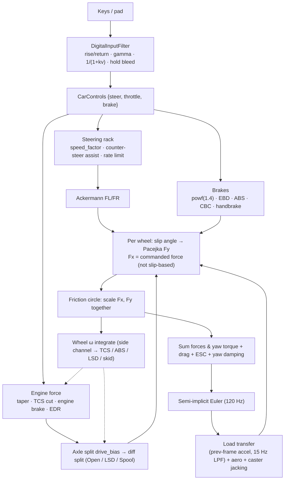
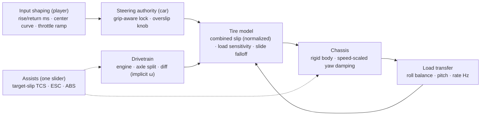

# Vehicle Dynamics Review & Tunable Handling Model

> **Implemented by [Spec 042](../../specs/042_vehicle_dynamics_rebuild_and_simplified_handling_settings.md).**
> The spec's implementation notes record where the build differs from this proposal: the
> authority formula, human-only grip-aware steering, the rear axle ratios, the ESC sideslip
> term, and the restated gates. Current knobs are in the
> [tuning guide](vehicle_handling_tuning_guide.md).

Reviewed: `docs/engineering/high_speed_steering_responsiveness_and_double_attenuation.md`,
`crates/wheelbase/src/{car.rs,tire.rs,config.rs}`, `crates/cabinet/src/input/filter.rs`,
`crates/tdrace-app/src/{game/mod.rs,catalog/mod.rs,ai/mod.rs}` at `a7ea21e`.

## 0. TL;DR

1. **The steering map is non-monotonic at speed.** At 162 km/h a held input of 0.3 spins the
   car and 1.0 plows straight on. Yaw rate goes up and then *down* as input grows. No profile
   setting can feel right on top of that. Speed sensitivity was not the root problem. The root
   problem is that steering authority is defined as **wheel angle**. It should be defined as
   **front slip angle**.
2. **Profile settings are mostly inert by construction.** `min_speed_steer_limit` never binds
   below 60 m/s. `hold_bleed_rate` restores full lock in 0.1–0.5 s. Most of the input range sits
   on the saturated part of the tire curve. So all profiles produce nearly the same force.
3. **The per-wheel / differential work (540b13b, 8d87b82) added three regressions** that hit
   keyboard drivers directly:
   - TCS now fires on **97 % of corner-exit frames** (was 65 %). Exit speed drops 12 %.
   - Engine braking moved **100 % onto the rear axle** for RWD (was ≥35 % front). Lift-off
     slides grow.
   - Car grip tuning (`cfg.tire.*`, catalog grip stat) **no longer reaches the tires**. Change
     measured: 0 %.
4. **Bots are immune to these regressions.** The AI lifts throttle in proportion to steer
   (`ai/mod.rs:674`) and steers analog near peak slip. A keyboard driver holds W and taps to
   full lock. The new model punishes exactly that.

Measured evidence is in §3.4. The proposed fix order is in §6.

---

## 1. Comprehension & System Architecture

### 1.1 Core approach

- **Input layer** (`cabinet::input::filter::DigitalInputFilter`): rate-limits digital keys
  (rise/return), applies a gamma curve, and scales steering by `1/(1+k·v)` with a floor and a
  hold-bleed back to 1.0. Throttle and brake get rise-rate ramps only.
- **Chassis** (`wheelbase::Car::step_per_wheel`): single rigid body, 3 DOF (x, y, yaw), plus a
  heuristic vertical/airborne channel. Semi-implicit Euler at a fixed 120 Hz
  (`game/mod.rs:756`).
- **Tires**: lateral force is a Pacejka '96-style curve of slip angle, blended to a slide
  plateau past a hard-coded 0.22 rad. Longitudinal force is **not** a tire curve. It is the
  commanded drive/brake force. Both are clipped together by a per-wheel friction circle.
- **Wheels**: each wheel integrates its own ω. But ω does not feed back into Fx. It only feeds
  TCS, ABS, skid telemetry, thermal and the LSD.
- **Drivetrain**: `drive_bias` front/rear split. Then a per-axle differential: Open (50/50),
  LimitedSlip (ramp + preload, driven by Δω), Spool (split by μ·Fz, then ω averaged).
- **Assists**: TCS, ESC (yaw torque), ABS/EBD/CBC, counter-steer assist, engine-drag reduction.
  All run inside the physics step with fixed magic thresholds.

### 1.2 Data flow



The dotted lines are the problem. Wheel spin feeds back into **assists and the diff**. It does not
feed back into **tire force**. So the new wheel model adds interventions without adding traction
physics.

---

## 2. Critical Analysis & Inconsistencies

### 2.1 Report vs implementation

| # | Report says | Code does | Impact |
|---|---|---|---|
| R1 | `speed_scale` is linear from a threshold speed to 60 m/s, ending at `min_limit`. | `1/(1+k·v)`, floored at `min_limit` (`filter.rs:285`). | Floor never binds: Balanced 0.81 @60 m/s (floor 0.75), Smooth 0.68 (0.60), Agile 0.85 (0.80). **The "Minimum Steer Limit" slider does nothing in the game's speed range.** |
| R2 | Hold bleed moves steering "towards `min_speed_steer_limit`". | It moves towards **1.0** (full lock) (`filter.rs:287`). | Opposite intent. After 1/rate s (0.25 s Balanced) every profile is at full lock. |
| R3 | Balanced exponent = 1.4. | Balanced = 1.25. 1.4 is Smooth (`filter.rs:131,143`). | Doc drift. |
| R4 | Rack rate ≈ 3.0 rad/s. | `sports_car` 5.5, classic GT 7.0 (`config.rs:601`, `classic.rs:29`). | Latency numbers in §3 of the report are overstated. |
| R5 | Goal: "100 % mechanical lock at 162 km/h". | Achieved. | **Wrong target.** 0.68 rad at 45 m/s is 3.4× the angle the front tire can use (≈0.20 rad incl. kinematic). See §3.4-A. |
| R6 | Regression test proves responsiveness. | Test checks the **wheel angle**, not the vehicle response. | A car can pass the test and still be undriveable. |
| R7 | Settings sync to live cars. | `steer_speed = steer_speed.max(rise·lock)` (`game/mod.rs:1386,4100,4129,5557,8575`). | Ratchet: moving from Raw back to Smooth never slows the rack again. |

### 2.2 Physics & stability

**P1 — Steering authority in the wrong unit (root cause).** Front force depends on slip angle.
Slip angle ≈ δ − (β + a·r/v). The useful δ at speed is `L/R_min + α_peak`, and
`R_min = v²/(μ·g_eff)`. At 45 m/s that is ≈0.20 rad. The full input range maps to 0–0.68 rad.
So above ~30 % input the front tire is past peak. The response is non-monotonic
(§3.4-A). With rear drive and full throttle, the rear saturates first at mid inputs, so the car
spins. At full input the front saturates first, so the car plows. Neither speed-sensitivity
layer fixed this. Each layer only shifted which part of the curve you land on.

**P2 — No tire load sensitivity.** `D = μ·Fz·peak_d` and B/C/E do not depend on Fz
(`tire.rs:148-151`). Force is linear in Fz. So lateral load transfer does **not** change the
axle's total grip, and `weight_transfer_lateral` has almost no effect on balance. In a real
car, and in every good arcade model, the roll-stiffness split is *the* balance knob.

**P3 — Fx is demand-based, not slip-based.** `fx_demand` = drive/brake command
(`car.rs:1152-1175`). The friction circle then scales Fx **and** Fy by the same factor
(`tire.rs:188-191`). A full-throttle command in a corner cuts rear lateral force in proportion
to the drive force requested, not to the slip that actually happens. In parallel the wheel ω
spins up against the leftover capacity (`car.rs:1191-1192`) and trips TCS. **Double penalty:**
the circle cuts Fy, and TCS cuts torque.

**P4 — Wheel integrator is ad hoc and stiff.** `step_rotation` snaps ω to the rolling speed in
the "normal regime" (`tire.rs:406-409`). It uses fixed recovery torques of 3500/2000 N·m
(`tire.rs:392-398`) and resets above 50 kN·m (`tire.rs:336`). With a real slip-based Fx, the
wheel time constant is τ ≈ I·v/(r²·Cσ). That is ≈22 ms at 45 m/s and ≈2.5 ms at 5 m/s. The
second value is below dt = 8.3 ms, so explicit integration is unstable at low speed. The
proposal below uses an implicit update.

**P5 — Spool yaw moment has the wrong sign.** Spool drive is split by μ·Fz (`car.rs:482-495`),
so the loaded **outside** wheel pushes more. That gives a yaw moment *into* the turn (torque
vectoring). A real spool forces equal ω. The inside wheel over-speeds and pushes. The outside
wheel drags. The yaw moment is *out of* the turn (understeer). Kart caster jacking lifts the
inside rear to cancel it. It does not reverse it.

**P6 — LSD is mostly inert.** The locking torque acts on `Δω_slip` (`car.rs:517-530`). But ω
snaps to kinematic in normal rolling. So Δω_slip ≈ 0 and the LSD behaves as an open diff until
a wheel is already spinning. `power_lock` and `coast_lock` therefore do not shape
corner-exit balance. That is their whole purpose.

**P7 — Engine braking regressed.** Before 540b13b coast torque was split
`0.35 + 0.30·drive_bias` to the front. Now it follows `drive_bias` (`car.rs:954-955`). So it is
100 % rear on RWD, ≈2.3 kN constant (`0.12 × 1.85 × m·g`, `car.rs:918-923`). That is ≈48 % of
static rear grip per wheel. EDR then cuts it when |ω| > 0.15 rad/s (`car.rs:905-910`). A 200 m
corner at 45 m/s already has ω = 0.22. So the rear gets a large brake torque on entry that turns
off once the car rotates. That feels random.

**P8 — Binary "is cornering" gates.** ABS lateral reserve (`car.rs:1081-1118`), TCS
(`car.rs:874`) and CBC switch on at |steer| > 0.02. Braking with steer 0.05 stops 19 % longer
than steer 0.00 (§3.4-D). Keyboard steering is always 0 or rising, so brake force jumps every
time a key is touched.

**P9 — ESC target floor.** `max_physical_yaw_rate = max(μ·g/v, 0.60)` (`car.rs:1331`). Above
≈16 m/s the floor wins, so the grip-limit term is dead at racing speeds. ESC then relies only on
the sign heuristics at lines 1336-1338.

**P10 — Unit mismatch in TCS.** One `tcs_slip_threshold` (0.18) is compared to a slip **ratio**
(`car.rs:888`) and to a slip **angle in radians** (`car.rs:882`).

**P11 — Minor numerical notes.**
- Load transfer uses last frame's acceleration through `α = dt·15` (`car.rs:1426`). This is
  fine at fixed dt. Use `1 − e^(−dt/τ)` so it stays correct if dt ever changes.
- Low-speed slip-angle regularization `max(|v|, 2.5)` plus a Fy blend below 3 m/s
  (`car.rs:1010,1178`) is sound. Keep it.
- `speed_sq` is computed twice (`car.rs:731,783`).
- Thermal and wear multipliers scale the Fy demand but not the `max_friction` cap
  (`tire.rs:475-477` vs `car.rs:1019`). With `peak_d ≥ ~0.95` the thermal bonus gets clipped.

### 2.3 Design bottlenecks (tunability)

**T1 — Two sources of truth for tires.** `CarConfig.tire` and `wheels[i].tire_model`. Physics
reads only the second. `catalog::to_car_config` writes the grip stat into `cfg.tire.peak_d`
(`catalog/mod.rs:160`) and never resyncs. Measured effect of 1.0 → 1.3: **0 %** (was +40 %).
The same staleness hits `brake_bias` and `drive_torque_factor`. So FWD/AWD catalog cars keep
rear-drive `drive_torque_factor`, and TCS and the engine governor watch the wrong wheels
(`car.rs:845-850,876-879`).

**T2 — Magic constants in the step.** Examples: 0.22 peak slip (`tire.rs:160`, not derived from
B/C/E; the real peak is 0.186 rad for defaults and 0.13 rad for B = 13.5); 1.85 engine-brake
boost; 0.72/0.65/0.35/0.20 ABS reserves; 0.82 and 0.75 EBD limits; 0.60 ESC floor; 0.15/0.08
EDR thresholds. None are in `CarConfig`, so a designer cannot reach them.

**T3 — Balance has no single knob.** Understeer/oversteer comes from CG position, LSD, engine
brake share, EBD limits, ABS reserves, ESC and counter-steer assist. Each one works through a
different hidden gate.

**T4 — Player feel and car physics are mixed.** Speed sensitivity lives in both layers.
`RaceSession` patches `speed_sensitive_steer_factor` and `steer_speed` on live cars in five
places.

---

## 3. Code Quality & Algorithmic Issues

### 3.1 Bugs (fix regardless of redesign)

| ID | Location | Bug | Fix |
|---|---|---|---|
| B1 | `catalog/mod.rs:147-161` | `drive_bias` / `peak_d` / brake written after `wheels` were built. Wheels stay stale. | Call `cfg.sync_wheels_from_axles()` at the end of `to_car_config`. Long-term: see §5.6. |
| B2 | `car.rs:954-955` | Coast torque 100 % rear on RWD (regression). | Restore a per-axle share as a config field (`engine_brake_front_share`). |
| B3 | `game/mod.rs` ×5 | `steer_speed.max(..)` ratchet. | Store the base rack rate. Recompute from the base each time. |
| B4 | `car.rs:482-495` | Spool yaw moment sign inverted. | Remove the grip-share split. Couple ω implicitly (§5.4). |
| B5 | `car.rs:882,888` | One threshold for slip angle (rad) and slip ratio. | Split into `tcs_slip_ratio` and `tcs_slip_angle`. |
| B6 | `car.rs:1331` | ESC 0.60 rad/s floor disables the grip limit above 16 m/s. | Floor at low speed only: `max(μg/v, 0.6·(1 − smoothstep(8, 16, v)))`. |
| B7 | `filter.rs:285-287` | Floor never binds. Bleed goes to full lock. | Replace the layer (§5.1). |

### 3.2 Frame-rate / dt dependencies

- Physics runs at a fixed 120 Hz, so there is no live dt bug. These parts assume dt stays small
  and would drift if it changed: the `dt·15` filter, the `max_stable_force` LSD bound (∝ 1/dt),
  and the ESC gain `I·10·(1+v/20)` (stable only while `45·strength·dt < 2`).
- `DigitalInputFilter::update` is rate-based and dt-correct.

### 3.3 Efficiency

- Wheel offsets and the world transform are recomputed for wheels 0 and 2 inside the diff
  coupling branch (`car.rs:1208-1235`). Cache them from the first pass.
- `surface_mus` and average μ/drag are computed twice (`car.rs:938-951,1309-1310`).
- `atan2`/`sin`/`cos` per wheel are fine at 120 Hz × ~20 cars.

### 3.4 Measured A/B evidence

Harness (throwaway, not committed): `CarConfig::sports_car()` with the player overrides (`speed_sensitive_steer_factor = 0`,
`steer_speed = 8·lock`), 120 Hz, asphalt. "old" = `540b13b^` (pre per-wheel), "new" = `a7ea21e`.

**A. Steering sweep at 45 m/s, W held (keyboard style), 2 s hold** (sideslip > 0.3 rad = spin):

| steer | old yaw / β | new yaw / β |
|---|---|---|
| 0.1 | 0.195 / 0.130 | 0.237 / 0.121 |
| 0.2 | 0.251 / 0.425 | 0.199 / 0.423 |
| 0.3 | 0.223 / 0.402 | 0.513 / **0.735** |
| 0.5 | 0.175 / 0.389 | 0.390 / **0.529** |
| 1.0 | 0.046 / 0.319 | 0.241 / 0.097 |

Both models: the usable band is 0–0.15 input. The new model spins harder in the 0.3–0.5 band,
which is where a key tap passes through.

**B. Lift-off mid-corner** (40 m/s, steer 0.25, throttle 1 s then 0): peak β old 0.705 → new
**0.772** rad. ESC frames 116 → **142**.

**C. Corner exit** (20 m/s, steer 0.4, W held 2 s): TCS active 156 → **232 of 240** frames.
Exit speed 20.7 → **18.2 m/s** (−12 %).

**D. Braking 40 → 10 m/s**: steer 0.00: old 70.9 m → new 74.3 m. Steer 0.05: 87.7 m → 88.5 m.
Touching steer costs +19 % distance in both.

**E. Grip tuning `cfg.tire.peak_d` 1.0 → 1.3** at 30 m/s: old 1.016 → 1.424 g (+40 %). New
1.214 → 1.214 g (**0 %**).

---

## 4. Why settings feel inert and bots got harder

- Every profile ends at full lock within 0.25 s of holding a key (bleed). Full lock at speed is
  deep past the tire peak. So Balanced, Agile, Direct and Raw converge to the same saturated
  force after a short transient.
- The differences that survive are 50–125 ms of rise time. Those are below what most players
  notice through a saturated tire.
- The AI steers analog, near peak slip, and lifts throttle when steering. It never enters the
  TCS / lift-off / plow zones. A keyboard driver lives in them.

---

## 5. Proposed Architecture

Principle: **one layer owns each effect, and every knob is expressed in a unit the player
feels.** The input layer shapes *timing*. The car shapes *authority and balance*. Assists are
one slider.



### 5.1 Grip-aware steering authority (replaces both speed-sensitivity layers)

Map full input to the angle that puts the front tire at `overslip × α_peak`. Low speed keeps
full mechanical lock. The response becomes monotonic at every speed. Profiles differ by a
visible amount (the overslip value and the timing).

```rust
/// Largest useful road-wheel angle at this speed.
/// kinematic angle for the grip-limited radius + usable front slip angle.
fn steer_authority(&self, speed: f32, mu: f32, overslip: f32) -> f32 {
    let g_eff = 9.81 + self.config.downforce_coefficient * speed * speed / self.config.mass;
    let r_min = (speed * speed / (mu * g_eff)).max(0.5);
    let kinematic = (self.config.wheelbase / r_min).atan();
    let grip_limit = kinematic + overslip * self.config.tire.peak_slip_angle();
    // Full mechanical lock below ~6 m/s, grip-aware above ~14 m/s.
    let w = smoothstep(6.0, 14.0, speed);
    let lock = self.config.max_steer_angle;
    (lock * (1.0 - w) + grip_limit.min(lock) * w).max(0.0)
}

// in step_per_wheel, replacing speed_factor:
let authority = self.steer_authority(self.state.speed, avg_front_mu, self.config.handling.steer_overslip);
let mut target_steer = -clamped_ctrl.steer * authority;
```

`overslip` guide: 0.85 = safe (never past peak), 1.0 = on the limit, 1.3 = can provoke a slide.
Rotation with the rear still comes from throttle, lift and trail-braking. That is where it should
come from.

### 5.2 Tire: combined slip on a normalized slip vector, with load sensitivity

```rust
pub struct TireModel {
    pub peak_slip_angle_deg: f32,   // designer: where grip peaks (8–12°)
    pub peak_slip_ratio: f32,       // designer: 0.08–0.15
    pub slide_grip: f32,            // grip falloff past peak, 0.6 (snappy) – 1.0 (flat)
    pub falloff_width: f32,         // how fast it falls, in multiples of peak (1.0–3.0)
    pub load_sensitivity: f32,      // 0 = linear, 0.1–0.25 = realistic
    pub power_slide: f32,           // 0..1: how much wheelspin steals lateral grip (1 = physical)
}

impl TireModel {
    /// Normalized curve: 0 at s=0, 1 at s=1 (peak), falls to slide_grip.
    fn shape(&self, s: f32) -> f32 {
        if s <= 1.0 { (s * (2.0 - s)).max(0.0) }        // smooth rise, zero slope at peak
        else {
            let t = ((s - 1.0) / self.falloff_width).min(1.0);
            1.0 - (1.0 - self.slide_grip) * t * t * (3.0 - 2.0 * t)
        }
    }

    pub fn force(&self, slip_ratio: f32, slip_angle: f32, fz: f32, fz_nom: f32, mu: f32) -> (f32, f32) {
        if fz <= 0.0 { return (0.0, 0.0); }
        let sx = slip_ratio / self.peak_slip_ratio;
        let sy = slip_angle.tan() / self.peak_slip_angle_deg.to_radians().tan();
        let s = (sx * sx + sy * sy).sqrt();
        if s < 1e-6 { return (0.0, 0.0); }
        // Load sensitivity: heavily loaded tires get less grip per newton.
        let mu_eff = mu * (1.0 - self.load_sensitivity * (fz / fz_nom - 1.0)).clamp(0.5, 1.3);
        let f_max = mu_eff * fz;
        let f = f_max * self.shape(s);
        let fx = f * sx / s;      // force opposes the slip direction (physical combined slip)
        let mut fy = f * sy / s;
        // Arcade knob: power_slide < 1 lets lateral grip survive wheelspin / lock-up.
        if self.power_slide < 1.0 {
            let fy_pure = f_max * self.shape(sy.abs()) * sy.signum();
            let budget = (1.0 - (self.power_slide * fx / f_max).powi(2)).max(0.0).sqrt();
            let fy_arcade = fy_pure * budget;
            if fy_arcade.abs() > fy.abs() { fy = fy_arcade; }
        }
        (fx, fy)
    }
}
```

The force direction follows the slip direction, so wheelspin and lock-up erode lateral grip
naturally. There is no proportional clip of a *commanded* force. `power_slide = 1` is the
physical friction circle. Lower values keep more lateral grip under wheelspin (arcade). Load
sensitivity makes the roll balance knob in §5.5 actually move the balance.
`CarConfig.tire.peak_slip_angle()` in §5.1 is `peak_slip_angle_deg.to_radians()`.

### 5.3 Implicit wheel spin (stable at 120 Hz down to 0 m/s)

```rust
/// Linearized backward-Euler step of I·dω/dt = T_drive − T_brake − r·Fx(σ).
fn step_wheel(w: &mut WheelAssembly, t_drive: f32, t_brake: f32, fx0: f32, c_sigma: f32, v_long: f32, dt: f32) {
    let r = w.config.tire_radius;
    let i = w.config.rotational_inertia;
    let v_ref = v_long.abs().max(1.0);              // same regularization as the slip definition
    let k = r * r * c_sigma / v_ref;               // d(r·Fx)/dω
    let omega_free = w.angular_velocity + dt * (t_drive - r * fx0) / i;
    let mut omega = w.angular_velocity + (omega_free - w.angular_velocity) / (1.0 + dt * k / i);
    // Brake: can stop the wheel, never reverse it.
    let brake_dw = dt * t_brake / (i + dt * k);
    omega = if omega > 0.0 { (omega - brake_dw).max(0.0) } else { (omega + brake_dw).min(0.0) };
    w.angular_velocity = omega;
}
```

`c_sigma` = the slope of Fx vs slip ratio at the current point (≈ `2·μ·Fz/peak_slip_ratio` near
zero). Delete the "snap to kinematic" regime and the fixed recovery torques.

### 5.4 Differentials as ω couplings

```rust
/// Open: equal torque. LSD: locking torque from preload + ramp, capped by what equalizes ω.
/// Spool: full lock. All implicit, so there is no dt-dependent stability clamp.
fn diff_couple(d: DifferentialType, t_in: f32, wl: &mut f32, wr: &mut f32, il: f32, ir: f32, dt: f32) -> (f32, f32) {
    // Coupling term only; the tire torques enter the same implicit wheel step (§5.3).
    let half = 0.5 * t_in;
    let dw = *wl - *wr;
    // Torque difference (T_R − T_L) that zeroes Δω this step.
    let t_equalize = 2.0 * dw / (dt * (1.0 / il + 1.0 / ir));
    let t_lock = match d {
        DifferentialType::Open => 0.0,
        DifferentialType::Spool => t_equalize.abs(),
        DifferentialType::LimitedSlip { power_lock, coast_lock, preload_nm } => {
            let ramp = if t_in >= 0.0 { power_lock } else { coast_lock };
            preload_nm + ramp * t_in.abs()
        }
    };
    let t_x = t_equalize.clamp(-t_lock, t_lock);              // from fast wheel to slow wheel
    (half - 0.5 * t_x, half + 0.5 * t_x)
}
```

This uses the kinematic Δω directly. A locked diff in a corner therefore produces the correct
understeer moment. `power_lock` becomes a real "throttle oversteer/understeer on exit" knob.

### 5.5 Load transfer with roll balance

```rust
let lt_lat = m * a_lat * h / track;                       // total lateral transfer
let lt_front = lt_lat * cfg.handling.roll_balance;        // 0.5 neutral; >0.5 = more understeer
let lt_rear  = lt_lat - lt_front;
let lt_long  = m * a_long * h / wheelbase;
// Filter with a physical time constant instead of dt*15:
let a = 1.0 - (-dt * cfg.handling.weight_transfer_hz * std::f32::consts::TAU).exp();
self.state.acceleration_local += (accel_now - self.state.acceleration_local) * a;
```

### 5.6 One source of truth for configuration

Keep axle-level fields as the only designer inputs: tire, brake bias, drive bias, per-axle
tire overrides. Derive `wheels[]` in a single `CarConfig::finalize()`. Call it after every
builder, catalog mutation and deserialization. Add a debug assert in `Car::new` that
`wheels == derived(config)`.

### 5.7 Assists as one slider

`assist_level ∈ [0,1]` sets TCS target slip (`lerp(0.30, 0.10)`), ESC gain, ABS target slip and
counter-steer strength. Replace every binary `is_cornering` with a continuous lateral
utilization `u = |Fy| / (μ·Fz)`. Example: ABS longitudinal cap = `μFz·sqrt(1 − (k·u)²)`.

---

## 6. Designer & Player Tuning Parameters

### 6.1 Car handling (designer, per car)

| Parameter | Range | Feel | Physical meaning |
|---|---|---|---|
| `grip` | 0.6–1.6 | Overall cornering g | μ scale |
| `roll_balance` | 0.35–0.65 | **Oversteer ↔ understeer** (main knob) | Front share of lateral load transfer |
| `peak_slip_angle_deg` | 6–14 | Sharp vs lazy turn-in | Tire peak |
| `slide_grip` | 0.6–1.0 | Snappy vs forgiving past the limit | Post-peak μ ratio |
| `falloff_width` | 1–3 | How suddenly grip goes | Curve width past peak |
| `load_sensitivity` | 0–0.25 | How much balance knobs bite | Tire μ(Fz) |
| `weight_transfer_hz` | 2–10 | Lazy vs twitchy weight shifts | Suspension time constant |
| `power_lock` / `coast_lock` | 0–0.8 | Exit oversteer / entry stability | LSD ramps |
| `engine_brake_front_share` | 0.2–0.6 | Lift-off oversteer (low = more) | Coast torque axle split |
| `brake_bias` | 0.5–0.75 | Trail-brake rotation (low = more) | Front brake share (honored) |
| `high_speed_stability` | 0–1 | Calm at 200 km/h | Yaw damping ∝ v |
| `power_slide` | 0.3–1 | Low = lateral grip survives wheelspin | 1 = physical friction circle |

### 6.2 Player controls (per player; each value changes the car audibly)

| Parameter | Smooth | Balanced | Sharp | Raw |
|---|---|---|---|---|
| `steer_overslip` (§5.1) | 0.85 | 1.00 | 1.15 | 1.30 |
| `steer_rise_ms` (0→full) | 220 | 140 | 90 | 40 |
| `steer_return_ms` | 150 | 100 | 70 | 40 |
| `center_exponent` | 1.5 | 1.3 | 1.1 | 1.0 |
| `throttle_ramp_ms` | 250 | 150 | 80 | 0 |
| `keyboard_traction_help` | 0.8 | 0.5 | 0.2 | 0 |

`keyboard_traction_help` gives the keyboard the same advantage the AI already has: scale
throttle by `1 − help·max(0, u_rear − 0.8)/0.2`. Remove `speed_sensitive_enabled`,
`min_speed_steer_limit` and `hold_bleed_rate`, because §5.1 replaces them.

---

## 7. Plan & Verification Gates

Every step lands behind a "feel regression" test in `crates/wheelbase/tests/`, not a wheel-angle
assertion.

| Step | Change | Gate (automated) |
|---|---|---|
| 1 | Bugs B1–B3, B5 (config sync, engine-brake split, ratchet, TCS units) | Grip 1.0→1.3 moves lat g ≥ 25 %. Corner-exit TCS ≤ 50 % of frames. Lift-off β ≤ old (0.705). |
| 2 | §5.1 grip-aware steering. Delete both speed-sensitivity layers. | Yaw rate monotonic in steer 0→1 at 10/25/45 m/s. Overslip 0.85 vs 1.30 differ ≥ 15 % in peak yaw. |
| 3 | §5.7 continuous gates (ABS/TCS/CBC) | Braking distance changes < 3 % between steer 0.00 and 0.05. |
| 4 | §5.2–5.4 tire / wheel / diff | No NaN or blow-up from 0–70 m/s, full throttle and full brake. LSD power_lock 0→0.8 changes exit yaw ≥ 10 %. Spool gives an understeer moment. |
| 5 | §5.5–5.6 roll balance + `finalize()` | roll_balance 0.40 vs 0.60 flips the understeer-gradient sign. |
| 6 | Re-tune AI `mu`/`brake_margin` vs the new model | Lap-time spread: T1 bot vs scripted keyboard driver (`input/simulation.rs`) within target band. |
