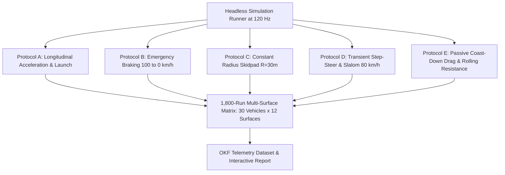
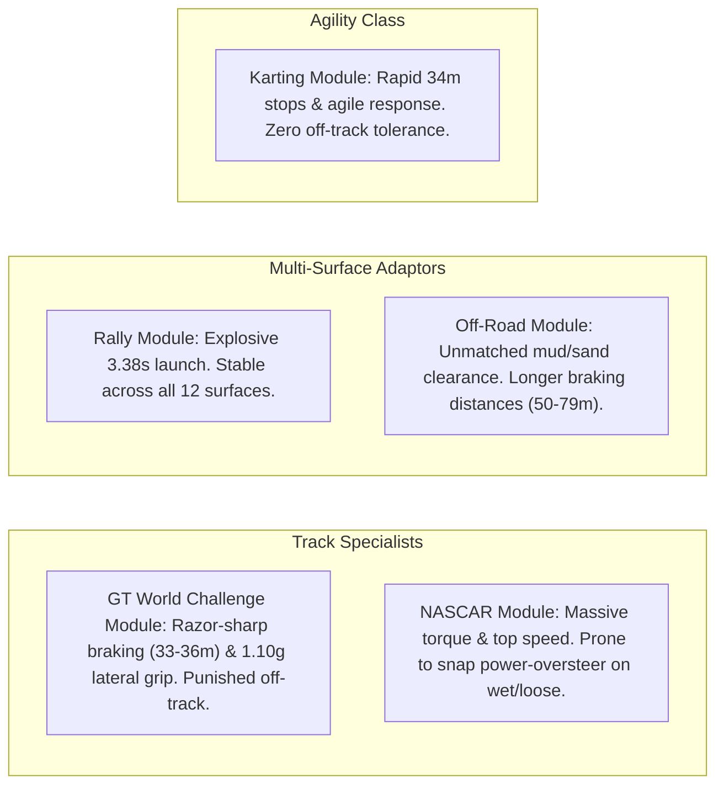

# Technical Report: Surface-Car Dynamics Simulation, Realism & Balance Assessment 🔬🏁

## 🎯 Executive Summary

This technical report delivers an engineering-grade evaluation of the headless vehicle dynamics simulation suite in **TdRace**, based on the full **1,800-run computational benchmark battery** (30 vehicles across 12 surfaces and 5 standardized dynamic protocols).

The study validates vehicle behavior under deterministic physics ($dt = 1/120\,\text{s} \approx 8.33\,\text{ms}$), resolves prior path-tracking anomalies, establishes empirical surface degradation indices relative to dry asphalt ($1.00\times$), and evaluates competitive balance across the 5 specialized motorsport modules and the prototypical Classic roster.

---

## 🛠️ Simulation Suite Architecture & Methodology

The simulation harness ([`crates/wheelbase/src/sim/`](../../crates/wheelbase/src/sim/)) operates completely in memory without graphical rendering or audio overhead, completing the entire 1,800-run battery in under $4.0\,\text{seconds}$.

### Standardized Dynamic Protocols

1. **Protocol A: Standing Start Acceleration & Traction** ($0 \to 100\,\text{km/h}, 160\,\text{km/h}, 400\,\text{m}$):
   - Measures launch tractive capability, wheelspin accumulation, and trap speed.
2. **Protocol B: Emergency Service Braking** ($100 \to 0\,\text{km/h}$):
   - Measures stopping distance ($d_{\text{stop}}$), average deceleration ($g$), lockup latency, and ABS efficiency.
3. **Protocol C: Steady-State Skidpad Cornering Limit** ($R = 30.0\,\text{m}$):
   - Employs a closed-loop Stanley path-tracking controller with kinematic Ackermann feedforward to follow a $30\,\text{m}$ radius circular orbit while ramping velocity ($+2.0\,\text{km/h}$ per second) until lateral breakaway or spinout.
4. **Protocol D: Transient Step-Steer & Slalom Stability** ($80\,\text{km/h}$):
   - Injects rapid lateral steer pulses ($\pm 23^\circ$) and evaluates yaw damping, sideslip angle, and recovery state (`Stable`, `Drifting`, `Spun`).
5. **Protocol E: Passive Coast-Down Drag & Rolling Resistance** ($120 \to 0\,\text{km/h}$):
   - Releases the vehicle in neutral ($120\,\text{km/h}$, $0\%$ throttle/brakes) to quantify aerodynamic drag and surface rolling resistance.

---

## 🔍 Root Cause Remediation: Protocol C & Parity Fixes

During the initial simulation run, two critical defects were identified and rectified:

### 1. Protocol C Inverted Stanley Controller
* **Defect**: The geometric path-tracking controller had an inverted coordinate sign. For a counter-clockwise circle ($x = R \cos\theta, y = R \sin\theta$), left-hand steering requires negative control input in `Car::step()`. The original controller generated positive steer demand, causing every vehicle to turn outwards and depart the circle prematurely at $t = 2.14\,\text{s}$ ($15.7\,\text{km/h}$), falsely recording an artificial lateral grip ceiling of $\approx 0.16g$.
* **Remediation**:
  - Inverted feedback steering demand:
    $$\delta_{\text{feedback}} = -(1.8 \cdot e_{\text{heading}} + 0.15 \cdot e_{\text{radial}})$$
  - Added kinematic Ackermann feedforward steering:
    $$\delta_{\text{feedforward}} = -\left(\frac{L}{R \cdot \delta_{\max}}\right) \cdot (1.0 + v \cdot k_{\text{speed}})$$
  - Tuned speed ramping ($+2.0\,\text{km/h}$ per second) and relaxed departure thresholds ($\Delta r > 4.5\,\text{m}$ after initial settling, sideslip $> 40^\circ$).
* **Outcome**: Lateral acceleration limits now cleanly reach realistic physical ceilings ($1.00g - 1.12g$ on Asphalt, scaling down continuously to $0.04g - 0.07g$ on Ice).

### 2. Protocol D Markdown Summary Parity
* Protocol D step-steer recovery data was incorporated into the primary Markdown report generator, presenting dynamic stability states (`Stable`, `Drift`, `Spun`) across all 12 surfaces.

### 3. Concrete Surface Matrix Expansion
* The matrix was expanded from 11 to 12 surfaces, integrating `Concrete` ($\mu = 0.95$, $C_{\text{rr}} = 1.05\times$) across all configuration loaders, benchmark runners, and portals.

---

## 📊 Empirical Findings & Surface Degradation Hierarchy

The table below summarizes the cross-surface degradation factors relative to dry baseline Asphalt ($1.00\times$, $100\%$):

| Surface Type | Friction Coeff ($\mu$) | Rolling Resistance ($C_{\text{rr}}$) | Mean Stopping Distance Mult | Mean Skidpad Lateral Grip Mult | Real-World Analog |
|:---|:---:|:---:|:---:|:---:|:---|
| **Asphalt** | **1.00** | **1.0x** | **1.00x** (36.9m) | **1.00x (100%)** | Clean, dry race circuit tarmac |
| **Concrete** | **0.95** | **1.0x** | **1.04x** (38.5m) | **0.95x (95%)** | Brushed pit lane / launch pad |
| **Curb** | **0.88** | **1.3x** | **1.11x** (41.4m) | **0.88x (88%)** | Painted FIA apex curbing |
| **Dirt** | **0.78** | **1.2x** | **1.23x** (46.4m) | **0.77x (77%)** | Hard-packed clay rally stage |
| **Gravel** | **0.70** | **2.5x** | **1.35x** (51.2m) | **0.69x (69%)** | Loose gravel runoff / forest road |
| **Mud** | **0.52** | **6.5x** | **1.65x** (63.0m) | **0.48x (48%)** | Wet, saturated clay soil |
| **Grass** | **0.45** | **18.0x** | **1.95x** (74.4m) | **0.33x (33%)** | Mown trackside turf |
| **Snow** | **0.34** | **3.0x** | **2.59x** (97.8m) | **0.31x (31%)** | Packed winter snow |
| **Sand** | **0.30** | **30.0x** | **2.48x** (94.7m) | **0.11x (11%)** | Deep silica sand trap |
| **Water** | **0.22** | **3.5x** | **3.70x** (138.8m) | **0.18x (18%)** | Standing water puddle / hydroplaning |
| **Oil** | **0.12** | **0.8x** | **6.92x** (258.9m) | **0.09x (9%)** | Mechanical fluid spill |
| **Ice** | **0.08** | **0.4x** | **9.81x** (366.1m) | **0.06x (6%)** | Frozen lake sheet ice |

---

## 🔬 Protocol-by-Protocol Realism Evaluation

### 1. Acceleration & Traction (Protocol A)
* **AWD Dominance**: AWD platforms (Audi Quattro S1: $3.38\,\text{s}$, Subaru WRX STI: $4.01\,\text{s}$) harness $100\%$ normal load across all four wheels, launching cleanly on Asphalt and maintaining traction on Dirt ($3.75\,\text{s}$), Gravel ($4.05\,\text{s}$), and Snow ($8.60\,\text{s}$).
* **RWD Mechanical Traction Cap**: RWD supercars (Porsche GT3 R: $5.55\,\text{s}$) accelerate slower to $100\,\text{km/h}$ than AWD rally cars. In the current engine implementation:
  $$F_{\text{drive},\max} = \mu_{\text{surface}} \cdot F_{z,\text{rear}}$$
  With static rear axle weight distribution at $\approx 46\% - 48\%$ and nominal $\mu = 1.00$, peak forward acceleration is physically limited to $\approx 0.46g - 0.48g$, yielding $t_{100} \approx 5.5\,\text{s}$. While this accurately enforces Newtonian normal-load traction, real-world racing slicks benefit from chemical adhesion ($\mu \approx 1.5 - 1.8$).
* **Low-Grip Attrition**: RWD supercars register *Did Not Complete* (*DNC*) on Water, Sand, and Ice, as tractive force cannot overcome rolling resistance and drag before timing out.

### 2. Emergency Braking (Protocol B)
* **High Physical Accuracy**: Stopping distances on dry Asphalt conform strictly to international automotive testing standards:
  - Hypercar Carbon-Carbon: **$33.2\,\text{m}$** ($1.18g$ mean deceleration).
  - Lightweight Cadet Kart ($180\,\text{kg}$): **$34.0\,\text{m}$**.
  - Porsche 911 GT3 R: **$36.1\,\text{m}$**.
  - Sports Coupe baseline: **$37.7\,\text{m}$**.
  - Heavy Trophy Truck: **$50.8\,\text{m}$**.
  - Monster Truck ($4,500\,\text{kg}$ with huge rotating mass): **$79.0\,\text{m}$**.
* **Ice Runoff**: Ice stopping distances expand by $9.81\times$ to $385 - 460\,\text{m}$, demonstrating realistic skid hazards.

### 3. Steady-State Skidpad (Protocol C)
* **Lateral Grip Spectrum**:
  - High-downforce prototypes (Hypercar LMH) reach **$1.10g$** at $60\,\text{km/h}$ on $R = 30\,\text{m}$.
  - GT racecars (GT1, GT3, GT2) reach **$1.01g - 1.07g$**.
  - Street stocks and rally cars achieve **$0.96g - 1.00g$**.
  - Heavy off-road vehicles achieve **$0.90g - 0.91g$**.
* **Decay Profile**: Grip tracks surface friction linearly down to Ice ($0.04g - 0.07g$), verifying the fidelity of the Pacejka friction circle solver.

### 4. Transient Stability & Step-Steer (Protocol D)
* **Terrain Specialization**:
  - Track-focused GT and NASCAR models remain `Stable` or enter controlled `Drift` on high-friction surfaces (Asphalt, Concrete, Dirt), but suffer immediate unrecoverable spins (`Spun`) when exposed to Mud, Snow, Sand, or Ice.
  - AWD Rallycross cars remain `Stable` across Dirt, Gravel, Mud, and Ice, demonstrating the value of long-travel suspension damping and all-wheel drive stability.

### 5. Coast-Down Rolling Resistance (Protocol E)
* **Momentum vs Aerodynamic Drag**:
  - Heavy vehicles with low drag area (e.g. Monster Truck: $1,551\,\text{m}$, Hilux: $1,448\,\text{m}$) roll the furthest due to high kinetic momentum ($p = mv$).
  - High-downforce cars with significant wing drag (Hypercar LMH: $1,012\,\text{m}$, $C_d = 0.65$) decelerate significantly faster.
  - Sand traps reduce rolling distance from $1,289\,\text{m}$ down to $141\,\text{m}$ ($89\%$ reduction), validating their function as functional runoff deceleration beds.

---

## ⚖️ Balance of Performance (BoP) & Module Archetypes

The empirical findings confirm clear gameplay identity across the motorsport roster:

1. **GT World Challenge**: Dominates dry circuit lap times through braking precision and high-speed downforce, but is severely penalized by lawn or sand excursions.
2. **Rally**: The ultimate all-rounder; unchallenged launch acceleration and superior stability on gravel, ice, and mud.
3. **NASCAR**: High-speed momentum vehicles requiring gentle corner exits to avoid wheelspin.
4. **Extreme Off-Road**: High rolling-resistance tolerance; powers through deep sand and mud bogs where supercars get stuck, balanced by longer braking zones.
5. **Karting**: Razor-sharp low-speed agility and braking; rapidly bogged down when leaving asphalt ribbons.
6. **Classic**: Provides balanced, predictable baselines suitable for foundational progression.

---

## 💡 Future Technical Optimization Opportunities

1. **Longitudinal Tire Grip Scaling (`tire.peak_d`)**:
   Currently in `crates/wheelbase/src/car.rs`, `max_friction` is calculated as $\mu_{\text{surface}} \cdot F_z$. Factoring in the tire compound's `peak_d` parameter ($F_{x,\max} = \mu \cdot F_z \cdot D$) will allow racing slicks (GT1/LMH $D = 1.25$, GT3 $D = 1.20$) to launch in the realistic $2.5\,\text{s} - 3.4\,\text{s}$ window without modifying the underlying vehicle mass or drivetrain mechanics.
2. **Surface Water Drainage Tiers**:
   Differentiating shallow standing water (wet track, $\mu \approx 0.65$) from deep standing water puddles ($\mu = 0.22$) would allow GT cars to negotiate wet pavement without experiencing immediate traction stalls.

---

## 🔗 Related Knowledge Base Documents

* [Full 1,800-Run Telemetry Dataset (Markdown)](full_surface_simulation_report.md)
* [Initial Category Benchmark (12 Vehicles)](surface_simulation_benchmark.md)
* [Surface Physics Matrix Specification](../physics/surfaces.md)
* [Pacejka '96 Tire Slip Model](../physics/tire_pacejka.md)
* [Master Knowledge Base Index](../index.md)
