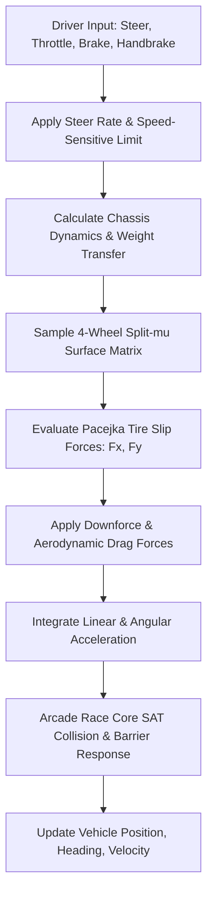

# Physics & Vehicle Simulation Architecture 🔬🏎️

The simulation physics in **TdRace** are engineered within the zero-dependency [`crates/wheelbase`](../../crates/wheelbase) and [`crates/arcade-race-core`](../../crates/arcade-race-core) Rust crates. Designed to balance high-refresh rate simulation ($\ge 4.0\text{M steps/sec}$) with authentic vehicle dynamics, the simulation features non-linear tire curves, dynamic chassis weight transfer, split-$\mu$ surface sampling, and rigid-body barrier collisions.

---

## 🧭 Core Physical Subsystems

| Subsystem | Document Reference | Key Mathematical Levers |
| :--- | :--- | :--- |
| **Vehicle Dynamics** | [vehicle_dynamics.md](vehicle_dynamics.md) | Center of gravity (CG), wheelbase, track width, pitch/roll weight transfer, aerodynamic downforce ($C_l \cdot A \cdot v^2$), air drag ($C_d \cdot A \cdot v^2$). |
| **Tire & Slip Curves** | [tire_pacejka.md](tire_pacejka.md) | Pacejka '96 Magic Formula ($B, C, D, E$), slip angle ($\alpha$), longitudinal slip ratio ($\kappa$), progressive drift breakaway, handbrake friction reduction. |
| **Surface Interactions** | [surfaces.md](surfaces.md) | 11 surface types ($\mu = 0.08 \dots 1.00$), rolling resistance multipliers ($1.0\times \dots 30.0\times$), aerodynamic/viscous surface drag, particle emitters. |
| **Walls & Barriers** | [walls_barriers.md](walls_barriers.md) | 4 barrier collision models: Concrete, Steel Armco, Tire Wall, Curb Wall with restitution coefficients ($e = 0.10 \dots 0.45$) and friction damping. |
| **Powertrain & Drivetrain** | [powertrain.md](powertrain.md) | Engine force output, drive bias ($0.0$ pure RWD, $0.5$ 50/50 AWD, $1.0$ pure FWD), top speed terminal limiter, and future multi-speed transmissions. |

---

## ⚡ Integration Pipeline & Update Cycle

Vehicle state is integrated at a fixed 60 Hz time-step ($dt = 1/60 \approx 0.01667\text{ s}$):

To dive deeper into any physical domain, select from the references above or return to the [Master Index](../index.md).
