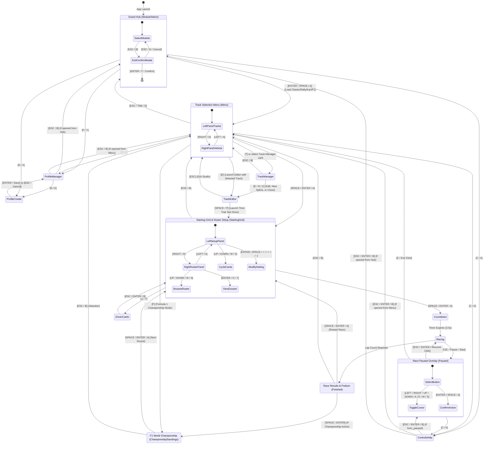

# TdRace Screen Architecture & Navigation Schema

This document provides a comprehensive reference for all user interface screens, state machines, transitions, and user inputs across the **TdRace** motorsport platform. It is formatted with both visual state machine diagrams and structured schemas for human developers and autonomous AI agents.

---

## 1. State Machine Navigation Diagram



---

## 2. Machine-Readable Screen Registry Schema (JSON)

For AI agents and automated testing frameworks, the screen catalog is formalized below:

```json
{
  "$schema": "https://json-schema.org/draft/2020-12/schema",
  "title": "TdRaceScreenRegistry",
  "type": "object",
  "properties": {
    "screens": {
      "type": "array",
      "items": {
        "type": "object",
        "required": ["state_id", "title", "category", "allowed_transitions", "input_shortcuts"],
        "properties": {
          "state_id": { "type": "string" },
          "title": { "type": "string" },
          "category": { "type": "string", "enum": ["Hub", "Menu", "Race", "Editor", "Profile", "Overlay"] },
          "parameters": { "type": "array", "items": { "type": "string" } },
          "allowed_transitions": {
            "type": "array",
            "items": {
              "type": "object",
              "required": ["target_state", "trigger"],
              "properties": {
                "target_state": { "type": "string" },
                "trigger": { "type": "string" },
                "description": { "type": "string" }
              }
            }
          },
          "input_shortcuts": { "type": "object", "additionalProperties": { "type": "string" } }
        }
      }
    }
  }
}
```

---

## 3. Screen Specifications & Navigation Catalog

### 3.1. Grand Hub (`GameState::ModuleSelect`)
* **Purpose**: Primary platform entry point. Allows choosing motorsport disciplines (Classic Arcade, WRC Rally, Sprint Karting, Formula 1).
* **State Struct**: `GameState::ModuleSelect { selected_idx: usize }`
* **Components**:
  - Header with branding & Profile badge banner.
  - 4 Motorsport Module cards with titles, neon accent tags, descriptions, and active icons.
  - Active profile quick status.
  - Exit application confirmation dialog modal (`show_exit_confirm`).
* **Navigation & Shortcuts**:

| Key / Input | Action | Target / Result |
| :--- | :--- | :--- |
| `Up` / `Down` / `W` / `S` / `D-pad` | Select module | Changes `selected_idx` (0: Classic, 1: Rally, 2: Kart, 3: F1) |
| `Enter` / `Space` / Gamepad `A` | Confirm module | Transitions to `GameState::Menu` configured for selected module |
| `P` / Gamepad `Y` | Open Profile Manager | Transitions to `GameState::ProfileManager` |
| `N` / Gamepad `X` | Create Profile | Transitions to `GameState::ProfileCreate` |
| `C` / `K` | Controls Help | Transitions to `GameState::ControlsHelp(false)` |
| `Escape` / Gamepad `B` | Exit Game | Opens exit confirmation modal |

---

### 3.2. Track & Setup Menu (`GameState::Menu`)
* **Purpose**: Circuit selection, vector map preview, telemetry analysis, and predefined car specifications.
* **State Struct**: `GameState::Menu`
* **Components**:
  - **Left Column**: Scrollable list of available circuits + dedicated "Circuit Hub & Workshop" card (`TrackManager`).
  - **Right Column Top (Circuit Dossier)**: Full vector track layout preview (curbs, surface materials, checkpoints, start/finish direction arrow) + Circuit specs (length, laps, checkpoints, grid slots).
  - **Right Column Bottom (Vehicle Specifications)**: Predefined car class tag, vehicle title, handling description, 4 neon performance rating bars (`SPEED`, `ACCEL`, `GRIP`, `DRIFT` with exact percentages), and engineering specs (Drivetrain, Mass, Top Speed, Downforce).
* **Navigation & Shortcuts**:

| Key / Input | Action | Target / Result |
| :--- | :--- | :--- |
| `Left` / `Right` / `A` / `D` / Gamepad `D-pad X` | Switch Column Focus | Switches between **Circuit Catalog** (Left Column) and **Vehicle Selection** (Right Column) |
| `Up` / `Down` / `W` / `S` / Gamepad `D-pad Y` | Navigate Active Column | When Left Column active: scrolls track list<br>When Right Column active: cycles selectable vehicle models |
| `Space` / `Enter` / Gamepad `A` | Start Race flow | If circuit selected: loads track -> `GameState::StartingGrid`<br>If Track Manager card selected: -> `GameState::TrackManager` |
| `T` | Track Manager | Opens `GameState::TrackManager` |
| `E` | Launch CAD Studio | Loads selected circuit into `GameState::TrackEditor` |
| `F` | Start Championship | Launches Championship mode (e.g. F1 World Championship) |
| `P` / Gamepad `Y` | Profile Manager | Opens `GameState::ProfileManager` |
| `C` / `K` | Controls Help | Opens `GameState::ControlsHelp(false)` |
| `Escape` / `Tab` / `G` / Gamepad `B` | Return to Hub | Transitions back to `GameState::ModuleSelect` |

---

### 3.3. Starting Grid & Roster Setup (`GameState::StartingGrid`)
* **Purpose**: Two-panel pre-race setup screen displaying player profile, circuit telemetry, game mode selector, vehicle specifications, and full driver roster or shadow car telemetry.
* **State Struct**: `GameState::StartingGrid`
* **Components**:
  - **Left Panel (Race & Vehicle Setup Cards)**:
    1. *Game Mode Selector Card (Card 0)*: Switch between the 4 supported game modes with title, status tag, and mode description:
       - **Standard Race**: Competitive grid race where all drivers use the circuit's predefined car.
       - **Experimental Race**: Multi-car grid race where all drivers use the user-specified vehicle model.
       - **Time Trial**: Solo session racing against personal best time rendered as a dynamic shadow car. Allows changing car.
       - **Free Ride**: Solo open practice to freely test the circuit and vehicle handling. Allows changing car.
    2. *Vehicle Selection & Specs Card (Card 1)*:
       - Car model switcher `[Enter / Space / < / > ]` (enabled in `Experimental Race`, `Time Trial`, and `Free Ride`).
       - Enforced predefined lock badge (in `Standard Race`).
       - 4 Performance stat bars (`SPEED`, `ACCEL`, `GRIP`, `DRIFT` with exact percentages).
       - 4 Mechanical specs chips (Drivetrain, Mass, Top Speed, Downforce).
    3. *Grid Configuration Card (Card 2)*:
       - Bot count modifier `[Enter / Space / + / - ]` for grid races.
       - Solo telemetry & personal best benchmark record for Time Trial / Free Ride.
    4. *Launch Race Action Button (Card 3)*:
       - High-visibility green action button `[Enter / Space / Click]` to start the 3-2-1 race countdown immediately.
  - **Right Panel (Starting Grid & Driver Roster)**:
    - *In Standard & Experimental Race*: Full starting grid lineup (P1 through P8) with position badges, driver names, aliases, liveries, car models, and qualifying times.
    - *In Time Trial*: Live player driver row (P1) + Personal Best Shadow Car row with ghost benchmark lap time.
    - *In Free Ride*: Solo driver practice slot with telemetry and tuning tips.
* **Navigation & Shortcuts**:

| Key / Input | Action | Target / Result |
| :--- | :--- | :--- |
| `Left` / `Right` / `A` / `D` / Gamepad `D-pad X` | Switch Panel Focus | Switches active focus between **Left Setup Panel** and **Right Starting Grid Roster** |
| `Up` / `Down` / `W` / `S` / Gamepad `D-pad Y` (Left Panel) | Navigate Setup Cards | Moves active selection between Game Mode (0), Vehicle Specs (1), Bot Count (2), and Launch Race Button (3) |
| `Enter` / `Space` / `[` / `]` / `+` / `-` (Cards 0–2) | Modify Active Card | Modifies the currently selected setting (cycles mode on Card 0, changes car on Card 1, changes bots on Card 2) |
| `Enter` / `Space` / Mouse Click (Card 3) | Launch Race Button | Starts 3-2-1 countdown -> `GameState::Countdown(3.5)` |
| `Up` / `Down` / `W` / `S` / Gamepad `D-pad Y` (Right Panel) | Browse Driver Roster | Moves selection cursor through starting grid slots (P1 to P8) |
| `Enter` / `D` / Gamepad `Y` (Right Panel) | Open Driver Dossier | Opens Driver Dossier for highlighted driver -> `GameState::DriverCards` |
| `Space` / Gamepad `Start` / Gamepad `A` (Global) | Launch Race | Starts 3-2-1 countdown -> `GameState::Countdown(3.5)` |
| `Tab` / Gamepad `X` | Quick Mode Cycle | Direct shortcut to cycle game modes |
| `Escape` / Gamepad `B` | Return to Menu | Transitions back to `GameState::Menu` |

---

### 3.4. Race Countdown (`GameState::Countdown`)
* **Purpose**: Cinematic 3-2-1 race start countdown with active engine throttle revving and camera alignment.
* **State Struct**: `GameState::Countdown(f32)` (Starts at 3.5 seconds)
* **Components**:
  - Center display countdown lights / numerals (3, 2, 1, GO!).
  - Audio SFX: low frequency beeps on 3, 2, 1; high frequency start tone on GO.
  - Real-time engine audio synthesis responding to player throttle revs on grid.
* **Navigation**: Automatically transitions to `GameState::Racing` when remaining timer reaches `<= 0.0`.

---

### 3.5. Race Simulation (`GameState::Racing`)
* **Purpose**: Active 120 Hz fixed-step motorsport simulation gameplay.
* **State Struct**: `GameState::Racing`
* **Components**:
  - Multi-car 2D physics simulation with tire friction circles and split-mu surface dynamics.
  - Dynamic spring-arm camera tracking with velocity zoom.
  - Telemetry HUD: Speedometer (km/h & digital gauge), Tachometer / Gear indicator, Lap timer & best lap delta, Sector split comparison, Minimap, Position tracker.
  - Particle & Audio FX: Tire smoke, surface dust, skidmark trails, water splash hazards, collision sparks, synthetic engine sounds.
* **Navigation & Shortcuts**:

| Key / Input | Action | Target / Result |
| :--- | :--- | :--- |
| `Escape` / `Pause` / Gamepad `Start` | Pause Game | Transitions to `GameState::Paused` |
| Complete `total_laps` | Finish Race | Transitions to `GameState::Finished` |

---

### 3.6. Race Paused (`GameState::Paused`)
* **Purpose**: In-game overlay to pause simulation, adjust driver assists, check audio, or resume/abort race.
* **State Struct**: `GameState::Paused`
* **Components**:
  - Translucent dimmed backdrop.
  - Glass card with interactive Resume Race & Exit Race action buttons with keyboard/gamepad focus outlines.
  - Driver assists profile selector (`Arcade`, `Sport`, `Pro`).
  - Audio status indicator.
* **Navigation & Shortcuts**:

| Key / Input | Action | Target / Result |
| :--- | :--- | :--- |
| `Left` / `Right` / `Up` / `Down` / `A` / `D` / `W` / `S` | Toggle Button Cursor | Toggles focus outline between **[Resume Race]** (0) and **[Exit Race]** (1) |
| `Enter` / `Space` / Gamepad `A` | Confirm Highlighted Button | Executes highlighted action (Resumes race or Quits to menu) |
| `Escape` / `Pause` / Gamepad `Start` | Resume Race | Transitions to `GameState::Racing` |
| `E` / Gamepad `B` | Exit Race | Stops audio loops -> Transitions to `GameState::Menu` |
| `C` / `K` | Controls Help | Opens `GameState::ControlsHelp(true)` |

---

### 3.7. Race Results & Podium (`GameState::Finished`)
* **Purpose**: Session completion screen showing final standings, lap records, career awards, and Hall of Fame.
* **State Struct**: `GameState::Finished`
* **Components**:
  - Podium standings table (Position, Driver Name, Car, Total Race Time, Best Lap Time, Delta to Leader).
  - Career XP / achievement badges earned.
  - Hall of Fame leaderboard records card.
* **Navigation & Shortcuts**:

| Key / Input | Action | Target / Result |
| :--- | :--- | :--- |
| `Space` / `Enter` / Gamepad `A` | Restart / Next Race | If single race: re-initializes race -> `GameState::StartingGrid`<br>If championship: -> `GameState::ChampionshipStandings` |
| `Left` / `Right` / `A` / `D` / `Tab` / Gamepad `X` | Toggle Hall of Fame | Switches between podium results table and all-time Hall of Fame leaderboard |
| `Escape` / Gamepad `B` | Return to Menu | Transitions to `GameState::Menu` |

---

### 3.8. Championship Standings (`GameState::ChampionshipStandings`)
* **Purpose**: Multi-round season tournament progress (e.g. FIA Formula 1 World Championship 4-Round Season).
* **State Struct**: `GameState::ChampionshipStandings`
* **Components**:
  - Driver championship points table (1st: 25pts, 2nd: 18pts, 3rd: 15pts, etc.).
  - Season calendar progress (Current round vs total rounds, track names).
* **Navigation & Shortcuts**:

| Key / Input | Action | Target / Result |
| :--- | :--- | :--- |
| `Space` / `Enter` / Gamepad `A` | Advance to Next Round | Loads next round track -> Transitions to `GameState::StartingGrid` |
| `Escape` / Gamepad `B` | Abandon Championship | Resets championship session -> Transitions to `GameState::Menu` |

---

### 3.9. Controls & Assists Help (`GameState::ControlsHelp`)
* **Purpose**: Comprehensive controller, keyboard, and driving aids reference guide.
* **State Struct**: `GameState::ControlsHelp(bool)` (`from_paused: bool`)
* **Components**:
  - Full keyboard mapping diagrams (Steering, Throttle, Brake, Handbrake, Camera, Boost).
  - Gamepad layout diagrams (Analog sticks, Triggers, Face buttons).
  - Driver assists interactive switcher (`Arcade`, `Sport`, `Pro`).
* **Navigation & Shortcuts**:

| Key / Input | Action | Target / Result |
| :--- | :--- | :--- |
| `H` / Gamepad Assist Toggle | Cycle Assists | Cycles assists mode (`Arcade` -> `Sport` -> `Pro`) |
| `Escape` / `Enter` / `C` / `K` / Gamepad `B` | Close Help | Returns to `GameState::Paused` (if `from_paused`) or `GameState::Menu` |

---

### 3.10. Driver Dossier Cards (`GameState::DriverCards`)
* **Purpose**: Full-screen inspectable driver profiles and AI opponent character dossier.
* **State Struct**: `GameState::DriverCards(DriverCardsOrigin)` (`Menu`, `StartingGrid`, or `Paused`)
* **Components**:
  - Driver character vector portrait & livery color badge.
  - Driver bio, racing pedigree, country flag, and preferred car.
  - AI Behavior metrics (Aggression, Cornering Speed, Overtake Tendency, Mistake Frequency).
* **Navigation & Shortcuts**:

| Key / Input | Action | Target / Result |
| :--- | :--- | :--- |
| `Left` / `Right` / `A` / `D` / `D-pad` | Browse Drivers | Cycles previous/next driver card |
| `Escape` / `Space` / `Enter` / Gamepad `B` | Close Dossier | Returns to origin (`StartingGrid`, `Menu`, or `Paused`) |

---

### 3.11. Profile Manager (`GameState::ProfileManager`)
* **Purpose**: Multi-profile management, career history, and statistics dashboard.
* **State Struct**: `GameState::ProfileManager { selected_idx: usize }`
* **Components**:
  - Profile list with active badge indicator.
  - Comprehensive career statistics (Races won, podiums, win rate, best laps per track, total drift score).
  - Profile deletion confirmation.
* **Navigation & Shortcuts**:

| Key / Input | Action | Target / Result |
| :--- | :--- | :--- |
| `Up` / `Down` / `W` / `S` / `D-pad` | Select Profile | Changes highlighted profile and loads career history |
| `Enter` / `Space` / Gamepad `A` | Set Active Profile | Saves active profile to SQLite database |
| `N` / Gamepad `X` | Create New Profile | Transitions to `GameState::ProfileCreate { editing_id: None, ... }` |
| `E` | Edit Profile | Transitions to `GameState::ProfileCreate { editing_id: Some(id), ... }` |
| `Delete` / `Backspace` / `X` | Delete Profile | Deletes profile (unless only 1 profile remains) |
| `Escape` / Gamepad `B` | Close Manager | Returns to previous screen (`ModuleSelect` or `Menu`) |

---

### 3.12. Profile Editor & Livery Customizer (`GameState::ProfileCreate`)
* **Purpose**: Create or edit player driver name, callsign alias, nationality, and vehicle livery colors.
* **State Struct**: `GameState::ProfileCreate { editing_id, field_idx, input_name, input_alias, country_idx, livery_idx, cursor_timer }`
* **Components**:
  - Name text input field with blinking cursor.
  - Callsign alias text input field.
  - Country flag selector.
  - Livery palette color picker with real-time vector car preview.
* **Navigation & Shortcuts**:

| Key / Input | Action | Target / Result |
| :--- | :--- | :--- |
| `Tab` / `Up` / `Down` | Switch Field | Cycles Name -> Alias -> Country -> Livery |
| `Left` / `Right` | Change Selection | Cycles through Country flags or Livery colors |
| `Enter` / Gamepad `A` | Save Profile | Writes to SQLite -> Transitions to `GameState::ProfileManager` |
| `Escape` / Gamepad `B` | Cancel | Discards changes -> Transitions to `GameState::ProfileManager` |

---

### 3.13. Circuit Hub & Workshop (`GameState::TrackManager`)
* **Purpose**: Manage approved circuits, create custom tracks from templates, promote user drafts, and edit circuit metadata.
* **State Struct**: `GameState::TrackManager { active_tab: TrackManagerTab, module_filter: ModuleFilter, selected_idx: usize, modal: TrackManagerModal }`
* **Tabs**:
  - `Main`: Official validated motorsport circuits.
  - `Drafts`: User-created and in-progress custom circuits.
  - `Templates`: Starter circuits (Oval, Technical, Sprint, Rally).
* **Navigation & Shortcuts**:

| Key / Input | Action | Target / Result |
| :--- | :--- | :--- |
| `Left` / `Right` / `A` / `D` / Gamepad `D-pad X` | Switch Workshop Tab | Changes active tab between **[Promoted Circuits]** (`Main`) and **[Drafts Workshop]** (`Drafts`) |
| `Up` / `Down` / `W` / `S` / Gamepad `D-pad Y` | Select Track | Highlights circuit in catalog list |
| `M` / `F` / `[` / `]` | Cycle Module Filter | Filters catalog by motorsport module (`All`, `Classic`, `Rally`, `Kart`, `F1`) on `Main` tab |
| `1` / `2` / `Tab` | Direct Tab Jump | Directly selects Main (1) or Drafts (2) |
| `E` | Open in CAD Studio | Opens track spline in `GameState::TrackEditor` |
| `C` | Clone Circuit | Clones selected circuit into Drafts with "(clone)" suffix and opens in CAD Studio |
| `N` | New Draft Track | Creates new draft track in Drafts workshop |
| `I` | Edit Metadata | Opens modal to edit track name and description |
| `P` / Gamepad `Y` | Promote / Configure Modules | Opens motorsport module promotion menu to promote track or add/remove modules |
| `Ctrl+P` | Demote Track | Demotes track from approved catalog back to Drafts workshop |
| `Escape` / Gamepad `B` | Return to Menu | Transitions back to `GameState::Menu` |

---

### 3.14. CAD Spline Studio (`GameState::TrackEditor`)
* **Purpose**: In-game vector track designer and CAD spline creation suite.
* **State Struct**: `GameState::TrackEditor`
* **Components**:
  - Vector spline node canvas with bezier tangent handles.
  - Surface zoning tool (Asphalt, Dirt, Sand, Water, Ice hazard painting).
  - Track elevation & overpass bridge extrusion tool.
  - Jump ramp, obstacle, and checkpoint gate placement tools.
  - Live track validation inspector (identifies self-intersections, missing finish lines, overlapping grid slots).
* **Navigation & Shortcuts**:

| Key / Input | Action | Target / Result |
| :--- | :--- | :--- |
| `Space` / `P` | Test Drive Track | Launches full Time Trial race with default car -> `GameState::StartingGrid` (returns to Studio on exit) |
| `1` - `8` | Tool Selection | Selects active drawing/editing tool |
| `Ctrl+S` / `S` | Save Track | Serializes track to JSON |
| `Escape` | Exit Studio | Returns to `GameState::Menu` (with unsaved changes prompt if dirty) |

---

## 4. Game Modes & Vehicle Allocation Schema

The system supports four distinct operational game modes selectable from the pre-race setup screen:

```json
{
  "game_modes": [
    {
      "mode_id": "TimeTrial",
      "title": "Time Trial",
      "tag": "VS GHOST SHADOW CAR",
      "description": "Race against your personal best time shown as a shadow car.",
      "allows_car_change": true,
      "has_bots": false,
      "has_ghost": true,
      "is_time_attack": true,
      "grid_allocation": "1 human driver + dynamic interpolated shadow car"
    },
    {
      "mode_id": "FreeRide",
      "title": "Free Ride",
      "tag": "SOLO PRACTICE & TUNING",
      "description": "Solo open practice to freely test the circuit and vehicle handling.",
      "allows_car_change": true,
      "has_bots": false,
      "has_ghost": false,
      "is_time_attack": true,
      "grid_allocation": "1 human driver (unlimited practice session, zero traffic)"
    },
    {
      "mode_id": "StandardRace",
      "title": "Standard Race",
      "tag": "PREDEFINED CAR • GRID",
      "description": "All drivers compete using the circuit's official predefined car.",
      "allows_car_change": false,
      "has_bots": true,
      "has_ghost": false,
      "is_time_attack": false,
      "grid_allocation": "Player and all AI bots enforced to circuit's predefined car"
    },
    {
      "mode_id": "ExperimentalRace",
      "title": "Experimental Race",
      "tag": "CUSTOM CAR SPEC • MULTI-CAR",
      "description": "All drivers compete using the car model specified by the player.",
      "allows_car_change": true,
      "has_bots": true,
      "has_ghost": false,
      "is_time_attack": false,
      "grid_allocation": "Player and all AI bots use user-selected car model"
    }
  ]
}
```

---

## 5. Modal Overlays Summary

| Modal Name | Host Screen | Trigger Input | Dismiss Input | Purpose |
| :--- | :--- | :--- | :--- | :--- |
| **Exit Confirm Dialog** | `ModuleSelect` | `Escape` / Gamepad `B` | `Escape` / `N` / Gamepad `B` | Prevents accidental application close |
| **Hall of Fame Overlay** | `Finished` | `Tab` / Gamepad `X` | `Tab` / Gamepad `X` | Toggles all-time leaderboard records vs session podium |
| **Edit Track Metadata** | `TrackManager` | `I` (on custom track) | `Enter` (save) / `Escape` (cancel) | Edits circuit title and description |
| **Select Module Promotion** | `TrackManager` | `P` / Gamepad `Y` | `Enter` / Gamepad `A` (confirm) / `Escape` / `B` (cancel) | Promotes track or adds/removes module distribution |
| **Delete Track Modal** | `TrackManager` | `Delete` / `Backspace` | `Y` (confirm) / `N` / `Escape` (cancel) | Confirms custom track file deletion |

