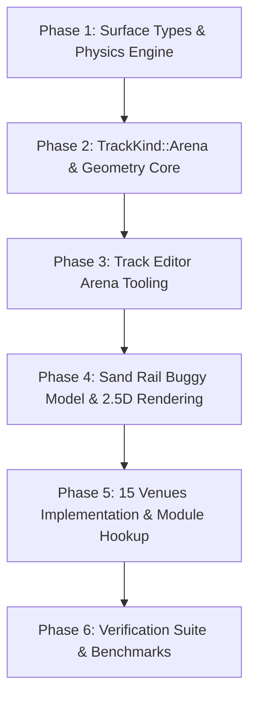

# Specification: Extreme Off-Road & Stunt Arenas Module

**Document Status:** PROPOSED  
**Author:** Antigravity Pairing Assistant & Engineering Team  
**Date:** September 17, 2026  
**Primary Target Crates:**  
1. [`crates/wheelbase`](file:///home/mario/workspace/games/tdrace/crates/wheelbase) (Pacejka Dirt/Mud/Ice Physics, Sand Rail Buggy Chassis, 2.5D Long-Travel Jump Ballistics)  
2. [`crates/arcade-race-core`](file:///home/mario/workspace/games/tdrace/crates/arcade-race-core) (Arena Spatial Topology, Enclosure Walls, Whoops Rhythm Arrays, Arena-Aware Validation)  
3. [`crates/tdrace-app`](file:///home/mario/workspace/games/tdrace/crates/tdrace-app) (Track Editor Arena Tools, Stunt Scoring, Sand Rail 2.5D Rendering, Extreme Off-Road Module)  

---

## 1. Executive Summary & Vision

### 1.1 Scope & Mission
This specification defines the complete architectural, physical, geometric, and tooling foundation for a brand-new game module: **"Extreme Off-Road & Stunt Arenas"**.

While previous modules in **TdRace** (Grand Prix, GT World Challenge, Rallycross, Sprint Karts, NASCAR Cup) focus on traditional circuit ribbon racing, this module expands the simulation horizon into **extreme terrain dynamics, rhythm whoops, big-air jump ballistics, and open stunt arenas**.

```
┌────────────────────────────────────────────────────────────────────────────────────────┐
│                     EXTREME OFF-ROAD & STUNT ARENAS ARCHITECTURE                      │
├────────────────────────────────────────────────────────────────────────────────────────┤
│                                                                                        │
│   ┌───────────────────────────┐                      ┌───────────────────────────┐    │
│   │     Sand Rail Buggy       │                      │     Track Editor & Core   │    │
│   │ • 300 BHP Turbo Flat-4    │                      │ • TrackKind::Arena Model  │    │
│   │ • Ultralight 590 kg RWD   │                      │ • Arena Floor & Wall Tool │    │
│   │ • 2.5D Long-Travel Damping│                      │ • Whoops Rhythm Generator │    │
│   │ • Procedural Cage & Flag  │                      │ • Multi-Tier Stunt Ramps  │    │
│   └─────────────┬─────────────┘                      └─────────────┬─────────────┘    │
│                 │                                                  │                  │
│                 └─────────────────────────┬────────────────────────┘                  │
│                                           ▼                                           │
│                 ┌───────────────────────────────────────────────────┐                 │
│                 │           15 High-Octane Venues Catalog           │                 │
│                 │   (8 Desert/Gorge/Snow Circuits + 7 Arenas)       │                 │
│                 └───────────────────────────────────────────────────┘                 │
│                                                                                        │
└────────────────────────────────────────────────────────────────────────────────────────┘
```

### 1.2 Core Pillars
1. **The Hero Vehicle (Sand Rail Buggy)**: A 300 BHP, pure RWD, ultra-lightweight ($590\,\text{kg}$) chromoly tubular spaceframe buggy engineered for vicious acceleration on loose surfaces, high-altitude jump launches, and agile Scandinavian flicks.
2. **The Arena Breakthrough**: Breaking the 1D spline ribbon paradigm of traditional racing tracks by introducing first-class support for **enclosed 2D arena fields**, open drivable floors, perimeter barrier hulls, rhythm sections (whoops), multi-tier stunt kickers, and non-linear target gates.
3. **Terrain Physics Expansion**: First-class handling and particle mechanics for `Mud` (deep viscous drag) and `Snow` (low friction, high rooster-tail powder) alongside upgraded `Sand`, `Dirt`, and `Ice`.
4. **15 Diverse Motorsport Venues**: Spanning blistering Saharan dunes, Arctic ice sheets, indoor supercross stadiums, quarry precipices, bayou mud sloughs, and vertical urban stunt megastructures.

---

## 2. Vehicle Dynamics: The Sand Rail Buggy

### 2.1 Mechanical & Mathematical Specifications

The Sand Rail Buggy is built on an exposed chromoly spaceframe chassis with rear-engine weight bias and massive trailing-arm suspension travel.

```
                  ┌──────── Rooftop 4-Pod LED Lightbar
                  │
             ┌────┴────┐     Whip Antenna & Pennant ──┐
       /═════│ [O O O] │═════\                        │
      /      └─────────┘      \                       │
     /    ┌───────────────┐    \                      │
    │     │  Driver Cage  │     │                     │
    │     └───────────────┘     │                     │
 ┌──┴──┐                     ┌──┴──┐                 ┌┴┐
 │FRONT│                     │REAR │═════════════════│*│ (Safety Pennant)
 │TIRE │                     │TIRE │ [Flat-4 Engine] └─┘
 └──┬──┘                     └──┬──┘ [Dual Stingers]
    \                           /
     \═════════════════════════/ (Tubular Chromoly Spaceframe)
```

#### Core Physical Parameters
* **Curb Weight ($m$):** $590.0\,\text{kg}$ (Ultralight racing spaceframe; no heavy body panels or glass).
* **Yaw Moment of Inertia ($I_z$):** $720.0\,\text{kg}\cdot\text{m}^2$. Exceptionally low rotational inertia allows immediate turn-in and agile yaw rotations under throttle modulation.
* **Dimensions:**
  * Wheelbase ($L$): $2.40\,\text{m}$.
  * Track Width ($W$): $1.75\,\text{m}$ (Wide footprint provides high lateral rollover resistance).
  * Center of Gravity to Front Axle ($l_f$): $1.44\,\text{m}$ ($60\%$ rear weight bias).
  * Center of Gravity to Rear Axle ($l_r$): $0.96\,\text{m}$ ($40\%$ front weight bias).
  * Center of Gravity Height ($h_{\text{cg}}$): $0.46\,\text{m}$.
* **Powertrain & Propulsion:**
  * **Engine Rating:** 300 BHP ($\approx 224\,\text{kW}$) naturally aspirated or turbocharged flat-four boxer engine.
  * **Max Engine Force ($F_{\text{drive,max}}$):** $8,800\,\text{N}$ at low-to-mid speeds, producing an explosive power-to-weight ratio of $\approx 508\,\text{BHP/tonne}$.
  * **Drive Layout:** Pure Rear-Wheel Drive (`drive_bias: 0.0`), featuring locked/spool differential simulation that locks rear wheel speeds for high-speed sand roosting.
  * **Top Speed ($v_{\text{max}}$):** $55.5\,\text{m/s}$ ($\approx 200.0\,\text{km/h}$ / $124.3\,\text{mph}$).
* **Steering & Chassis Assists:**
  * **Max Steer Angle ($\delta_{\text{max}}$):** $0.75\,\text{rad}$ ($\approx 43.0^\circ$).
  * **Steering Rack Speed:** $8.5\,\text{rad/s}$ (Ultra-responsive steering input).
  * **Counter-Steer Assist Multiplier:** $1.55$ (Facilitates wide-open throttle Scandinavian flicks and slide recovery).
* **Brakes:**
  * Max Brake Force: $11,500\,\text{N}$.
  * Handbrake Force: $8,200\,\text{N}$ (Locks rear paddle tires immediately to initiate tight hairpin spins).
* **Aerodynamics:**
  * Downforce Coefficient ($C_L \cdot A$): $0.35$ (Minimal body downforce).
  * Air Drag Area ($C_d \cdot A$): $0.88$ (Exposed tubular cage, tires, and driver increase aerodynamic drag).

### 2.2 Suspension & 2.5D Jump Ballistics

The sand rail employs long-travel bypass coilover dampers ($>550\,\text{mm}$ wheel travel in real-world terms):

```rust
pub struct OffRoadSuspensionParams {
    /// Compression spring rate (N/m).
    pub spring_rate: f32, // 28,000 N/m (Soft compliance over washboards)
    /// Rebound damping coefficient.
    pub rebound_damping: f32, // 3,400 N·s/m
    /// Bottom-out hydraulic bump-stop threshold.
    pub bump_stop_travel: f32, // 0.45 m
    /// Landing impact dissipation ratio (prevents violent bouncing).
    pub landing_absorption_factor: f32, // 2.5x vs standard GT
}
```

1. **Airborne Pitch & Roll Leveling:** When airborne ($z > 0$), a gentle gyroscopic leveling torque assists the driver in keeping the chassis horizontal before touchdown:
   $$\tau_{\text{level}} = -k_p \cdot \theta_{\text{pitch}} - k_d \cdot \omega_y$$
2. **Landing Compliance:** On landing impact, the vertical velocity impulse $v_z$ is attenuated by $65\%$ in the suspension stage, completely eliminating the violent bounce-skipping typical of stiff touring cars.

### 2.3 Tire Friction & Surface Interaction (`TireConfig`)

Equipped with rear paddle sand scoops and front directional grooved tires:
* **Pacejka Parameters:**
  * Stiffness Factor $B = 8.2$ (High compliance sidewalls).
  * Shape Factor $C = 1.35$.
  * Peak Friction $D = 1.12$ on loose surfaces.
  * Curvature Factor $E = -0.15$.
* **Loose Surface Synergy:**
  * Deep Sand Drag Penalty: Attenuated by $70\%$ (paddle tires convert loose sand into forward thrust).
  * Drift Slide Friction ($\mu_{\text{slide}}$): $0.94$ (Extremely predictable, controllable high-slip drift angle).

### 2.4 Visual & Audio Archetype

#### Procedural 2.5D Rendering Pipeline (`VehicleVisualType::SandRail`)
Located in [`crates/tdrace-app/src/render/car.rs`](file:///home/mario/workspace/games/tdrace/crates/tdrace-app/src/render/car.rs):
1. **Exposed Chromoly Cage:** Multi-segment tubular roll cage rendered with metallic tubular shading and primary livery highlights.
2. **Oversized Wheels:** High-profile knobby front tires and wide paddle rear tires with colored beadlock rings.
3. **Powertrain Details:** Rear-mounted boxer engine block, cooling fan shroud, and dual upswept exhaust stingers emitting backfire flashes.
4. **Dynamic Whip Antenna:** A flexible fiberglass whip antenna mounted on the rear cage that deflects backwards proportional to chassis velocity ($-\mathbf{v} \cdot 0.04$), waving a high-visibility fluorescent pennant flag.
5. **Rooftop Off-Road Lightbar:** 4 high-output round LED pods mounted across the top brow of the roll cage.
6. **Driver Figure:** Visible driver wearing a full-face off-road helmet, tinted goggles, and racing harness.

#### Audio Profile (`EngineAudioProfile::sand_rail_boxer`)
* Base tone: Raspy, high-revving 4-cylinder boxer engine with straight-cut dog-box transmission gear whine.
* Backfire pops on overrun/deceleration.
* Distinct mechanical suspension compression thud when landing from jump ramps.

---

## 3. The Arena Paradigm & Track Editor Innovations

### 3.1 Architectural Limitations of Current Circuit Tracks

Currently, `arcade-race-core` models tracks around a 1D parametric Catmull-Rom spline $\mathbf{r}(s)$:
1. **1D Ribbon Restriction:** Road surfaces are only rendered and sampled within a narrow corridor $[-\frac{W(s)}{2}, \frac{W(s)}{2}]$ around the centerline. Outside this ribbon, points fall into off-track background terrain with punishing drag.
2. **Wall Intersection Errors:** The track validator checks whether walls intrude into the spline ribbon (`ERR_WALL_INTRUDES_TRACK`) or cross the centerline (`ERR_WALL_CROSSES_TRACK`). In a multi-directional arena, walls must enclose the entire field, which causes false positives.
3. **Sequential Checkpoints:** The timing system expects vehicles to cross planar gates in monotonic arc-length order $s_0 < s_1 < \dots < s_n$. Freestyle stunt arenas and multi-directional demolition derbies do not possess a single monotonic progression line.

---

### 3.2 Innovation 1: The Dual-Topology Domain Model (`TrackKind`)

We introduce a first-class topological distinction between traditional closed/point-to-point circuits and open arenas:

```rust
/// Topological classification of a racing venue.
#[derive(Debug, Clone, PartialEq, Serialize, Deserialize)]
#[serde(rename_all = "snake_case")]
pub enum TrackKind {
    /// Traditional 1D continuous spline ribbon with extruded drivable width.
    Circuit,
    /// Bounded 2D open enclosure with fully playable interior floor.
    Arena {
        /// Polygon vertices defining the perimeter boundary enclosure.
        boundary_hull: Vec<Vec2>,
        /// Primary surface type across the entire arena floor (e.g. Dirt, Mud, Ice).
        floor_surface: SurfaceType,
        /// Perimeter barrier specification enclosing the arena.
        perimeter_barrier: BarrierType,
        /// Optional navigation/pathfinding graph for AI drivers.
        nav_nodes: Vec<ArenaNavNode>,
    },
    /// Hybrid venue: A stadium bowl enclosing both a defined rhythm track and open infield.
    Hybrid {
        boundary_hull: Vec<Vec2>,
        floor_surface: SurfaceType,
        perimeter_barrier: BarrierType,
        mainline_spline: TrackSpline,
    },
}
```

#### Surface Resolution in Arenas
Inside [`Track::sample_surface(point: Vec2)`](file:///home/mario/workspace/games/tdrace/crates/arcade-race-core/src/track/mod.rs#L117-L160):
1. If the point lies inside an active `JumpRamp` or above-track `SurfaceZone`, return that surface.
2. If `track.kind` is `TrackKind::Arena` and the point lies within `boundary_hull`:
   - Return `floor_surface` (no off-track drag penalties).
3. If `track.kind` is `TrackKind::Hybrid`:
   - Test spline projection first; if off the ribbon but within `boundary_hull`, sample `floor_surface`.
4. Fall back to global `default_surface`.

---

### 3.3 Innovation 2: Arena Enclosure & Floor Boundary Tool

Added to the Track Editor as `EditorToolType::ArenaFloor` (`[9]`):
* **Polygon Placement:** Click to place perimeter boundary vertices or drag out standard geometric templates (Stadium Oval, Rounded Rectangle, Supercross Hexagon).
* **Automatic Barrier Wall Generation:** Automatically synthesizes connected `WallBarrier` segments along the perimeter hull with outward-facing normals and proper corner mitering.
* **Floor Infill Rasterization:** Infill polygon meshes automatically generate ground graphics without requiring hand-drawn surface zones.

---

### 3.4 Innovation 3: Whoops & Rhythm Section Generator

Whoops are a fundamental element of Supercross and off-road racing: a rhythmic series of 6 to 18 washboard dirt moguls ($0.6\,\text{m} - 1.2\,\text{m}$ height, spaced $3.5\,\text{m} - 5.0\,\text{m}$ apart).

```
                      Whoops Rhythm Profile
   Height (m)
     1.0 │      /\          /\          /\          /\
     0.5 │     /  \        /  \        /  \        /  \
     0.0 └───~/────\──────/────\──────/────\──────/────\──────
         |<─ λ ─>| (3.5m - 5.0m Wavelength)
```

Added as `EditorToolType::WhoopSection`:
1. The designer clicks a **Start Point** and **End Point** vector $\mathbf{v}$.
2. The generator computes:
   $$N = \left\lfloor \frac{\|\mathbf{v}\|}{\lambda} \right\rfloor$$
3. Synthesizes a contiguous array of directional micro-ramps with launch and landing slopes:
   - Launch angle: $+16^\circ$ incline.
   - Peak height: $0.85\,\text{m}$.
   - Landing angle: $-18^\circ$ transition.
4. Vehicles skimming whoops at high velocity experience rapid suspension cycling; failing to carry speed causes the front bumper to dive into the trough ("casing the whoop").

---

### 3.5 Innovation 4: Multi-Tier Stunt Ramps & Step-Ups

Added as `EditorToolType::StuntRamp`:
* **Supercross Double / Triple Jump Pair:**
  * Designer places the launch kicker.
  * The editor projects the ballistic trajectory envelope based on nominal approach speed $v_0$ and launch angle $\theta$:
    $$x(t) = v_0 \cos(\theta) t, \quad z(t) = v_0 \sin(\theta) t - \frac{1}{2} g t^2$$
  * Automatically suggests the optimal placement for the sloped down-ramp landing tabletop.
* **Monster Colosseum Mega-Kicker:** High-launch $45^\circ$ kicker ($4.5\,\text{m}$ platform elevation) designed for maximum arena airtime and aerial spins.
* **Wall-Ride & Quarter-Pipe Berms:** Steeply banked curved barrier sections ($>45^\circ$ bank angle) where centrifugal force holds the vehicle against the vertical perimeter.

---

### 3.6 Innovation 5: Interactive Crush Props & Stunt Scoring Targets

* **Crush Cars (`ObstacleShape::CrushCar`):**
  * Deformable obstacle prop representing a row of scrap sedans.
  * When a vehicle lands on top of a crush car with vertical momentum $m \cdot v_z > 3,500\,\text{N}\cdot\text{s}$, the prop model compresses vertically by $60\%$, emits a metallic crush crunch sound FX, and awards Stunt Points.
* **Aerial Target Rings (`CheckpointKind::AerialRing`):**
  * Glowing neon stunt rings suspended at elevation $z > 3.0\,\text{m}$ in mid-air over major jump gaps.
  * Flying through the ring triggers audio chimes and applies a score multiplier.

---

### 3.7 Innovation 6: Arena-Aware Validation Engine

The circuit validator in [`crates/arcade-race-core/src/track/validation.rs`](file:///home/mario/workspace/games/tdrace/crates/arcade-race-core/src/track/validation.rs) is updated with arena-specific rules:

```rust
pub fn validate_arena_rules(track: &Track, hull: &[Vec2]) -> Vec<TrackValidationError> {
    let mut diagnostics = Vec::new();
    
    // 1. Perimeter hull must be closed and have at least 3 vertices
    if hull.len() < 3 {
        diagnostics.push(TrackValidationError::error(
            "ERR_ARENA_INVALID_HULL",
            "Arena perimeter boundary must contain at least 3 vertices.",
        ));
    }

    // 2. Starting grid positions must be strictly contained within the arena hull
    for (i, pose) in track.grid_positions.iter().enumerate() {
        if !point_in_polygon(pose.position, hull) {
            diagnostics.push(TrackValidationError::error(
                "ERR_GRID_OUTSIDE_ARENA",
                format!("Starting grid slot #{} is located outside the arena boundary.", i + 1),
            ));
        }
    }

    // 3. Wall barriers defining the perimeter must not have open gaps > 4.0m
    // 4. Stunt jump ramps must have clear landing zones free of rigid concrete obstacles
    diagnostics
}
```

---

## 4. Extended Terrains: `Mud` & `Snow`

To authentically support venues like *Mud Slough Arena*, *Louisiana Swampland*, *Arctic Frozen Lake*, and *Alpine Snow Ridge*, we formalize two new surface types in `crates/wheelbase/src/surface.rs`:

```rust
pub enum SurfaceType {
    Asphalt,
    Dirt,
    Curb,
    Grass,
    Sand,
    Water,
    Oil,
    Ice,
    /// Deep viscous mud: high rolling resistance, low lateral slide friction, heavy spray plumes.
    Mud,
    /// Loose / packed snow: moderate rolling resistance, low traction, powder roost trails.
    Snow,
}
```

### Physical Multipliers Table
| Surface | Friction ($\mu$) | Rolling Resistance Multiplier | Surface Drag Multiplier | Visual FX Particle Type |
|---|---|---|---|---|
| **Asphalt** | $1.00$ | $1.0\times$ | $1.0\times$ | Black Tire Smoke & Skid Marks |
| **Dirt** | $0.78$ | $1.2\times$ | $1.1\times$ | Brown Dust & Dirt Clods |
| **Sand** | $0.30$ | $30.0\times$ | $4.5\times$ | Fine Yellow Sand Spray |
| **Ice** | $0.08$ | $0.4\times$ | $0.9\times$ | Ice Scratch Scuffs & Sparkle |
| **Mud (NEW)** | **$0.52$** | **$6.5\times$** | **$3.2\times$** | **Heavy Brown Mud Spray & Roost Plumes** |
| **Snow (NEW)**| **$0.34$** | **$3.0\times$** | **$1.6\times$** | **White Powder Snow Roost & Trenches** |

---

## 5. Venue Catalog: 15 Circuits & Arenas

The module features 15 meticulously designed venues spanning high-speed desert circuits, extreme hillclimbs, and enclosed stunt arenas.

---

### Category A: Desert & Canyon Circuits

#### 1. Sahara Dune Crossing *(Cruce de dunas rápidas)*
* **Classification:** High-Speed Desert Sprint Circuit (`TrackKind::Circuit`).
* **Length:** $2,150\,\text{m}$ | **Default Laps:** 3.
* **Surface Composition:** Compacted sand road ribbon ($80\%$), loose dunes ($20\%$).
* **Signature Design:**
  * Rolling sand dune topography with three progressive crest jumps launching cars into sweeping downhill landings.
  * Ultra-wide $16\,\text{m}$ track width encouraging multi-car side-by-side sliding.
  * Off-track sand traps with undulating desert scrub.

#### 2. Dirt Figure Eight *(Trazado en ocho con saltos y peraltes)*
* **Classification:** Stadium Cross-Over Action Circuit (`TrackKind::Circuit` or `Hybrid`).
* **Length:** $850\,\text{m}$ | **Default Laps:** 5.
* **Surface Composition:** Hard-packed clay dirt (`SurfaceType::Dirt`).
* **Signature Design:**
  * Classic intersecting figure-8 layout with an at-grade high-risk intersection danger zone.
  * Twin $18^\circ$ high-banked outer clay berms that allow drivers to carry full throttle around the carousels.
  * Central tabletop launch ramps positioned $35\,\text{m}$ prior to the cross-over intersection.

#### 3. Atacama Sand Basin *(Cuenca desértica de alta velocidad)*
* **Classification:** Hyper-Speed Desert Ring (`TrackKind::Circuit`).
* **Length:** $2,650\,\text{m}$ | **Default Laps:** 3.
* **Surface Composition:** Dried salt flat crust ($\mu=0.92$) transitioning into powdery fesh-fesh dunes.
* **Signature Design:**
  * Blistering top-speed sections where the Sand Rail Buggy reaches its $200\,\text{km/h}$ terminal velocity.
  * Parabolic sweeping turns with zero barrier fences; blowing dust storms reduce visibility on the back straight.

#### 4. Red Rock Canyon *(Cañón de roca roja y caminos rotos)*
* **Classification:** Technical Gorge Circuit (`TrackKind::Circuit`).
* **Length:** $1,580\,\text{m}$ | **Default Laps:** 3.
* **Surface Composition:** Red sandstone bedrock, broken gravel washboards, loose shale.
* **Signature Design:**
  * Narrow $8.0\,\text{m}$ corridor enclosed by sheer vertical red rock cliffs (`BarrierType::Concrete`).
  * Hairpin switchbacks requiring hard handbrake initiation.
  * Jagged boulder obstacles lining the track edges.

#### 5. Baja 500 Desert Scrub *(Trazado abierto de matorrales y baches whoops)*
* **Classification:** Open Desert Endurance Course (`TrackKind::Circuit`).
* **Length:** $3,100\,\text{m}$ | **Default Laps:** 2.
* **Surface Composition:** Desert hardpack, dry wash sand riverbeds, washboard ruts.
* **Signature Design:**
  * Three dedicated 12-bump **Whoops Rhythm Sections** testing suspension timing and throttle feathering.
  * Sandy creek bed crossings with deep water splash puddles.
  * Saguaro cactus and scrub obstacles punishing wide corner cuts.

---

### Category B: Mud, Swampland & Quarry Venues

#### 6. Mud Slough Arena *(Arena trabada con surcos profundos de barro)*
* **Classification:** Enclosed Mud Bog Arena (`TrackKind::Arena`).
* **Dimensions:** $140\,\text{m} \times 105\,\text{m}$ oval stadium bowl.
* **Surface Composition:** Deep viscous mud (`SurfaceType::Mud`), standing murky water troughs.
* **Signature Design:**
  * Enclosed arena surrounded by heavy tractor-tire perimeter walls (`BarrierType::TireWall`).
  * Concentric mud sludge ruts creating variable grip channels; central clay mound with twin kickers.
  * Wheelspin mud roost plumes that dynamically test traction and throttle modulation.

#### 7. Gravel Quarry Chasm *(Cantera industrial de grava con caídas verticales)*
* **Classification:** Multi-Tier Industrial Quarry Circuit (`TrackKind::Circuit`).
* **Length:** $1,720\,\text{m}$ | **Default Laps:** 3.
* **Surface Composition:** Crushed limestone gravel, loose scree slopes.
* **Signature Design:**
  * 4-tier terrace descent with vertical $7\,\text{m}$ cliff drop-offs.
  * Stepped industrial steel conveyor ramps bridging excavation pits.
  * Static Caterpillar haul truck obstacles and loose gravel runoffs.

#### 8. Louisiana Mud Swampland *(Fosa profunda de barro y terreno empantanado)*
* **Classification:** Bayou Swampland Circuit (`TrackKind::Circuit`).
* **Length:** $1,420\,\text{m}$ | **Default Laps:** 3.
* **Surface Composition:** Swamp mud, stagnant bayou water (`SurfaceType::Water`), wet cypress boardwalks.
* **Signature Design:**
  * Twisting course weaving through Spanish moss cypress trees.
  * Deep water troughs that severely bog down vehicle velocity if entered off-line.
  * Narrow, slippery wooden boardwalk pier bridges with missing side guardrails.

---

### Category C: Arctic & Mountain Ice Circuits

#### 9. Arctic Frozen Lake *(Gran placa helada deslizante con bancos de nieve)*
* **Classification:** Ice Speedway & Drift Arena (`TrackKind::Hybrid`).
* **Dimensions:** $240\,\text{m} \times 160\,\text{m}$ frozen lake expanse.
* **Surface Composition:** Polished blue ice (`SurfaceType::Ice`, $\mu=0.08$), soft snowbanks.
* **Signature Design:**
  * Expansive open ice sheet where lateral grip is nearly zero.
  * Flanked by deformable snowbanks that catch errant vehicles without catastrophic structural damage.
  * Pendulum drift chicanes where momentum transfer is the only method to rotate the chassis.

#### 10. Alpine Snow Ridge *(Subida de montaña helada sub-cero)*
* **Classification:** Point-to-Point Snow Hillclimb (`TrackKind::Circuit`).
* **Length:** $1,850\,\text{m}$ | **Default Laps:** 1 (Sprint).
* **Surface Composition:** Compacted snow (`SurfaceType::Snow`), black ice patches.
* **Signature Design:**
  * $12\%$ uphill gradient ascending a jagged alpine mountain crest.
  * Unprotected sheer drop-offs along the outer cliffs; narrow single-lane rock tunnels.
  * Demands surgical throttle control to maintain climbing traction without spinning out.

#### 11. Rovaniemi Ice Ring *(Circuito de hielo finlandés con chicanes de nieve)*
* **Classification:** Traditional Nordic Ice Circuit (`TrackKind::Circuit`).
* **Length:** $1,250\,\text{m}$ | **Default Laps:** 4.
* **Surface Composition:** Groomed lake ice with packed snow berms.
* **Signature Design:**
  * High-speed perimeter ice sweepers illuminated by night floodlights.
  * Technical snowbank chicane complexes that reward rhythmic Scandinavian flick entries.

#### 12. Glacier Crest Pass *(Paso helado en cresta con acantilados)*
* **Classification:** Extreme Mountain Knife-Edge Ridge (`TrackKind::Circuit`).
* **Length:** $1,980\,\text{m}$ | **Default Laps:** 2.
* **Surface Composition:** Glacial blue ice, hard windblown firn snow.
* **Signature Design:**
  * Terrifying knife-edge ridge carved atop an active glacier.
  * Crevasse gap jumps over bottomless ice chasms; zero safety barriers along $90\%$ of the track.
  * High crosswinds and extreme penalty for losing control.

---

### Category D: Monumental Arenas & Stunt Megastructures

#### 13. Supercross Stadium Arena *(Estadio con triples saltos y sección de whoops)*
* **Classification:** Indoor Supercross Stadium (`TrackKind::Hybrid`).
* **Dimensions:** $160\,\text{m} \times 115\,\text{m}$ domed football stadium.
* **Surface Composition:** Premium indoor clay (`SurfaceType::Dirt`).
* **Signature Design:**
  * 6-lane winding rhythm course with $22^\circ$ banked bowl turns.
  * Two massive **Supercross Triple Jumps** (kicker launch with steep downslope landing table).
  * 14-bump washboard whoops section right in front of the stadium grandstands.

#### 14. Monster Colosseum *(Estadio monumental con rampas gigantes y zonas de aplastamiento)*
* **Classification:** Demolition Stunt Arena (`TrackKind::Arena`).
* **Dimensions:** $190\,\text{m} \times 140\,\text{m}$ monumental arena.
* **Surface Composition:** Crushed clay floor, concrete barrier perimeter.
* **Signature Design:**
  * Central car-crush pyramid with interactive crushable junk cars.
  * Twin $45^\circ$ monster kickers designed for maximum aerial hangtime.
  * Fire-spitting pyrotechnic towers at the perimeter corners.

#### 15. Stunt City Megastructure *(Arena de acrobacias urbanas con saltos en bucle y rampas elevadas)*
* **Classification:** Multi-Level Vertical Stunt Playground (`TrackKind::Arena`).
* **Dimensions:** $220\,\text{m} \times 170\,\text{m}$ urban plaza.
* **Surface Composition:** Polished concrete, steel ramp surfaces, safety netting.
* **Signature Design:**
  * Full 360-degree vertical loop-the-loop stunt ramp (requires $\ge 120\,\text{km/h}$ entry speed).
  * Quarter-pipe wallrides mounted against skyscraper facades.
  * High-altitude rooftop gap jumps with floating aerial target rings.

---

## 6. Module Integration: `ExtremeOffRoadModule`

The module is implemented in [`crates/tdrace-app/src/module/extreme_offroad.rs`](file:///home/mario/workspace/games/tdrace/crates/tdrace-app/src/module/extreme_offroad.rs) implementing `GameModule`:

```rust
pub struct ExtremeOffRoadModule;

impl GameModule for ExtremeOffRoadModule {
    fn id(&self) -> &'static str { "extreme_offroad" }
    fn title(&self) -> &'static str { "EXTREME OFF-ROAD & STUNT ARENAS" }
    fn subtitle(&self) -> &'static str { "Baja Deserts, Ice Lakes, Supercross Triples & Stunt Arenas" }
    
    fn theme(&self) -> ModuleTheme {
        ModuleTheme {
            primary_accent: Color::new(1.0, 0.40, 0.05, 1.0),   // Baja Danger Orange
            secondary_accent: Color::new(0.15, 0.85, 1.0, 1.0), // Electric Cyan / Ice Blue
            header_badge: "EXTREME OFF-ROAD & STUNT ARENAS",
            background_tint: Color::new(0.08, 0.05, 0.03, 0.98),
        }
    }

    fn vehicles(&self) -> Vec<VehicleModelDefinition> {
        vec![
            VehicleModelDefinition {
                id: "sand_rail_buggy",
                name: "Apex Sand Rail Buggy",
                tag: "300 BHP RWD ULTRALIGHT",
                description: "Ultralight chromoly spaceframe buggy with 300 BHP turbo boxer engine, long-travel suspension, and paddle sand tires.",
                config: ExtremeOffRoadModule::car_sand_rail(),
                visual_type: VehicleVisualType::SandRail {
                    cage_style: 1,
                    lightbar: true,
                    whip_flag: true,
                },
                stats: (0.84, 0.96, 0.82, 0.98),
                default_schemes: vec![
                    CarColorScheme::from_index(3), // Baja Danger Orange / White
                    CarColorScheme::from_index(1), // Electric Cyan / Black
                    CarColorScheme::from_index(5), // Neon Yellow / Raw Chromoly
                ],
            }
        ]
    }

    fn default_vehicle_id(&self) -> &'static str { "sand_rail_buggy" }
    fn default_off_track_surface(&self) -> SurfaceType { SurfaceType::Dirt }
    
    fn tracks(&self) -> Vec<TrackDefinition> { /* 15 track generators */ }
    fn default_track_id(&self) -> &'static str { "sahara_dunes" }
    
    fn drivers(&self) -> Vec<DriverCharacter> { /* Off-road driver roster */ }
    fn supported_game_modes(&self) -> Vec<TournamentFormat> {
        vec![
            TournamentFormat::Championship,
            TournamentFormat::TimeAttack,
            TournamentFormat::Elimination,
        ]
    }
    
    fn audio_profile(&self) -> EngineAudioProfile {
        EngineAudioProfile::sand_rail_boxer()
    }
}
```

---

## 7. Phased Implementation Roadmap



### Phase 1: Core Physics & Terrain Types (`crates/wheelbase`)
1. Extend `SurfaceType` with `Mud` and `Snow`.
2. Implement friction, rolling resistance, and viscous drag curves for the new surfaces.
3. Add `CarConfig::sand_rail()` preset with 300 BHP, RWD, and long-travel jump compliance.
4. Unit test: Verify that landing impact deceleration does not exceed chassis bottoming thresholds.

### Phase 2: Arena Spatial Model (`crates/arcade-race-core`)
1. Add `TrackKind` enum to `Track` (`Circuit`, `Arena`, `Hybrid`).
2. Update `Track::sample_surface` to support polygon arena boundary infill.
3. Update `validate_track` to support arena perimeter hull closure and bypass 1D spline restrictions for arenas.
4. Unit test: Create headless `Arena` track with zero waypoints and verify 0 validation errors.

### Phase 3: Track Editor Arena Tooling (`crates/tdrace-app/src/editor`)
1. Add `EditorToolType::ArenaFloor` for drawing perimeter enclosures.
2. Add `EditorToolType::WhoopSection` for generating sinusoidal washboard micro-ramp arrays.
3. Add `EditorToolType::StuntRamp` for ballistic jump-and-landing pairs.
4. Implement crush car props and mid-air stunt targets.

### Phase 4: Sand Rail Buggy Rendering & Audio (`crates/tdrace-app`)
1. Add `VehicleVisualType::SandRail` variant.
2. Implement procedural 2.5D renderer in `render/car.rs`: chromoly cage, knobby/paddle tires, rear boxer engine, dynamic whip antenna.
3. Add `EngineAudioProfile::sand_rail_boxer()` in `module/mod.rs`.

### Phase 5: Venues Catalog & Module Registration
1. Implement the 15 track generators in `crates/arcade-race-core/src/track/presets.rs`.
2. Implement `ExtremeOffRoadModule` in `crates/tdrace-app/src/module/extreme_offroad.rs`.
3. Register module in `crates/tdrace-app/src/module/mod.rs` and main game menu.

### Phase 6: Verification Suite
* **Unit Tests:** `cargo test --workspace`.
* **Track Diagnostics:** Ensure all 15 venues pass `validate_track` with 0 validation errors.
* **Physics Performance:** Benchmark simulation steps ($\ge 4.0\text{M steps/sec}$).
* **Gymnasium RL:** Ensure Python Gymnasium environments load the new module smoothly.

---

## 8. Success Criteria
- [ ] Sand Rail Buggy has accurate 300 BHP RWD physics with zero sand-drag penalty and soft jump damping.
- [ ] Track editor allows creating open arenas without requiring a 1D centerline spline.
- [ ] All 15 circuits and arenas compile, render, and pass validation checks.
- [ ] New `Mud` and `Snow` surfaces behave with distinct, physically plausible slip and drag characteristics.
- [ ] 100% test pass rate across `wheelbase`, `arcade-race-core`, and `tdrace-app`.
