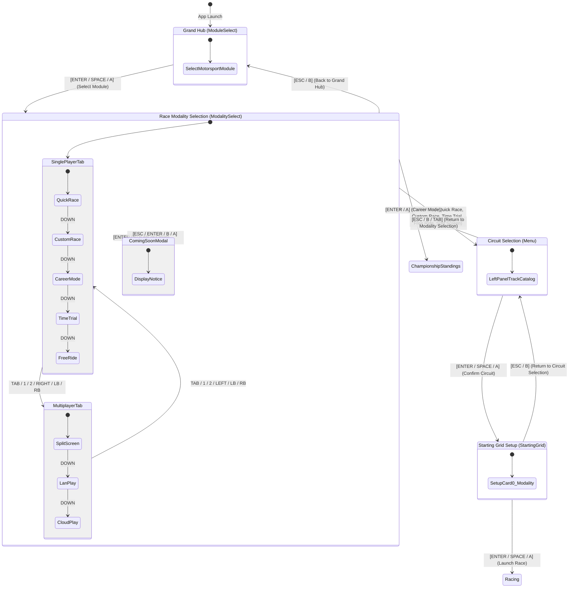

# Specification: Race Modality Selection & Interface Flow Restructuring

**Document Version:** 1.0.0  
**Status:** Approved  
**Author:** TdRace Architecture Team  

---

## 1. Context and Problem Statement

Following the introduction of the GT Career Mode progression system, players experienced UX friction in the interface flow:
Previously, the flow was:
`Grand Hub (Module Selection)` -> `Circuit Selection (Menu)` -> `Circuit Setup & Racing Options (Starting Grid)`

This forced players to pick an individual circuit before choosing what kind of racing session they wanted to play (e.g. Quick Race vs Custom Race vs Career Mode vs Split Screen). Career mode felt hidden or awkward to access, and multiplayer options were not clearly separated from single-player sessions.

This specification defines the new architecture inserting a dedicated **Race Modality Selection** stage between the **Grand Hub** and **Circuit Selection**.

---

## 2. Updated Navigation Flow

### 2.1 State Machine Diagram

---

## 3. Modality Categories and Session Configurations

### 3.1 Single Player Tab
1. **Quick Race (`ModalityItem::QuickRace`)**:
   - `game_mode`: `GameMode::StandardRace`
   - `free_car_selection`: `false` (uses predefined car for track)
   - `is_time_attack`: `false`
   - Description: "Jump straight into the action with the official predefined car and standard grid."

2. **Custom Race (`ModalityItem::CustomRace`)**:
   - `game_mode`: `GameMode::ExperimentalRace`
   - `free_car_selection`: `true` (unrestricted vehicle selection)
   - `is_time_attack`: `false`
   - Description: "Configure your car model, opponent bot count, and customized racing setup."

3. **Career Mode (`ModalityItem::CareerMode`)**:
   - `game_mode`: `GameMode::Career`
   - Direct gateway to the motorsport championship campaign (e.g., 5-tier GT Championship).
   - Description: "Embark on a structured multi-tier motorsport championship campaign."

4. **Time Trial (`ModalityItem::TimeTrial`)**:
   - `game_mode`: `GameMode::TimeTrial`
   - `free_car_selection`: `true`
   - `is_time_attack`: `true`
   - `num_bots`: `0`
   - Description: "Solo benchmark session against the clock and your personal best shadow."

5. **Free Ride (`ModalityItem::FreeRide`)**:
   - `game_mode`: `GameMode::FreeRide`
   - `free_car_selection`: `true`
   - `is_time_attack`: `true`
   - `num_bots`: `0`
   - Description: "Open practice session with no opponent pressure or lap timers."

### 3.2 Multiplayer Tab
1. **2P Split Screen (`ModalityItem::SplitScreen`)**:
   - `game_mode`: `GameMode::SplitScreen`
   - `free_car_selection`: `true`
   - `is_time_attack`: `false`
   - Description: "Local head-to-head split-screen racing on a single display."

2. **LAN Multiplayer (`ModalityItem::LanPlay`)**:
   - Status: *In Development*
   - Interactivity: Displays informational modal explaining LAN protocol in development.

3. **Cloud Online (`ModalityItem::CloudPlay`)**:
   - Status: *In Development*
   - Interactivity: Displays informational modal explaining worldwide matchmaking and lobbies in development.

---

## 4. UI Design & Visual System

- **Pill Tabs**: Top centered category selector (`[ 1. SINGLE PLAYER ]`, `[ 2. MULTIPLAYER ]`) with neon highlights and tab hints.
- **Glass Cards**: Vertical list of translucent glass cards with 1px border accents, category icon, title, description, and tags (`OFFICIAL`, `CUSTOMIZABLE`, `CHAMPIONSHIP`, `SOLO`, `LOCAL`, `COMING SOON`).
- **Cursor Focus**: Neon cyan highlight glow and `▶` chevron indicator for keyboard/gamepad navigation.
- **Footer Hints**: Clear controller & keyboard hints:
  - `[W/S / UP/DOWN]` Navigate
  - `[TAB / 1 / 2]` Switch Tab
  - `[ENTER / SPACE]` Select
  - `[ESC]` Back to Grand Hub

---

## 5. Starting Grid Card 0 Refinement

In `StartingGrid`, Card 0 previously allowed cycling through game modes. In the restructured architecture:
- Card 0 reflects the chosen modality prominently (e.g. `RACING MODALITY: QUICK RACE [PRESET]` or `RACING MODALITY: CUSTOM RACE [CUSTOMIZABLE]`).
- For quick race, vehicle selection remains locked to track official vehicle.
- For custom race, vehicle selection is freely adjustable.
