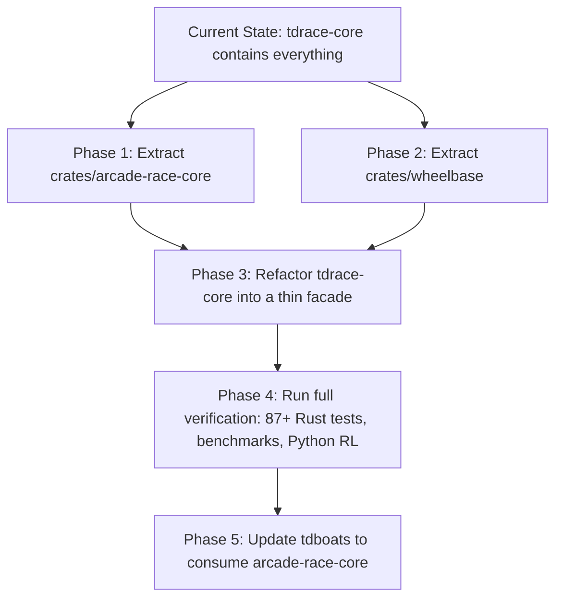

# Specification: Modular Motorsport Architecture
## Standalone Engines: `wheelbase` & `arcade-race-core`

**Document Status:** PROPOSED  
**Author:** Antigravity Pairing Assistant  
**Date:** September 13, 2026  
**Primary Target Crates:**  
1. `crates/wheelbase` (Wheeled Vehicle Dynamics & Tire Physics)  
2. `crates/arcade-race-core` (Course Geometry, SAT Collisions, Checkpoints & Perception)  

---

## 1. Executive Summary

This specification establishes the modular architecture for extracting two reusable, independent Rust engine crates from [`crates/tdrace-core`](file:///home/mario/workspace/games/tdrace/crates/tdrace-core):

1. **`wheelbase`**: A dedicated 2D/2.5D wheeled vehicle physics engine implementing 4-wheel (car/kart/truck) and 2-wheel (motorbike) Pacejka tire dynamics, dynamic weight transfer, chassis assists, and jump ballistics. Completely independent of tracks, splines, or circuit rules.
2. **`arcade-race-core`**: A course geometry, collision, timing, and perception engine implementing 2D continuous SAT OBB collision resolution, Catmull-Rom course splines, directional checkpoint gates, sector timing, racing LIDAR raycasting, and headless scanline rasterization. Completely independent of vehicle-specific propulsion models.

### Target Multi-Game Ecosystem

```
                                  ┌───────────────────────────────────────────────┐
                                  │                    cabinet                    │
                                  │   (2D Arcade Shell, Scaler, Audio, Gamepad)   │
                                  └───────────────────────┬───────────────────────┘
                                                          │
                                  ┌───────────────────────┴───────────────────────┐
                                  │               arcade-race-core                │
                                  │  • 2D Continuous SAT OBB & Wall Collisions    │
                                  │  • Catmull-Rom Splines & Course Ribbons       │
                                  │  • Directional Checkpoints & Sector Timing    │
                                  │  • 32-Beam Racing LIDAR Raycasting            │
                                  │  • Headless Software RGB Scanline Rasterizer  │
                                  └───────────────┬───────────────────────┬───────┘
                                                  │                       │
                                  ┌───────────────┴───────────┐           │
                                  │         wheelbase         │           │
                                  │ • Pacejka Tire Slip Model │           │
                                  │ • Dynamic Weight Transfer │           │
                                  │ • ABS, TCS, ESC Assists   │           │
                                  │ • 4-Wheel & 2-Wheel Bikes │           │
                                  │ • 2.5D Jump Ballistics    │           │
                                  │ • SurfaceSampler Trait    │           │
                                  └───────────┬───────────────┘           │
                                              │                           │
                                              ▼                           ▼
                 ┌────────────────────────────────────────┐  ┌────────────────────────────┐
                 │                tdrace                  │  │          tdboats           │
                 │      (Top-Down Arcade Motorsport)      │  │  (F1 Tunnel-Hull Hydrodyn) │
                 │ Uses: arcade-race-core + wheelbase     │  │ Uses: arcade-race-core +   │
                 │                                        │  │       hydrodynamics        │
                 └────────────────────────────────────────┘  └────────────────────────────┘
                                     │
                                     ▼ (Future Games)
                 ┌────────────────────────────────────────┐  ┌────────────────────────────┐
                 │                tdbikes                 │  │        tdopenworld         │
                 │     (Superbike / Motocross 2D)         │  │ (2D Top-Down Heist / City) │
                 │ Uses: arcade-race-core + wheelbase     │  │ Uses: wheelbase alone      │
                 │       (Motorbike model)                │  │ (Tilemap SurfaceSampler,   │
                 │                                        │  │  no circuit splines!)      │
                 └────────────────────────────────────────┘  └────────────────────────────┘
```

---

## 2. Module 1: `crates/wheelbase` Specification

### 2.1 Scope & Mission
`wheelbase` is a pure-math, zero-dependency 2D/2.5D vehicle dynamics simulation engine. It models how wheeled chassis interact with solid surfaces via rubber tire friction, suspension weight distribution, and driver control inputs.

### 2.2 Dependencies
```toml
[package]
name = "wheelbase"
version = "0.1.0"
edition = "2021"
description = "Deterministic 2D/2.5D Pacejka vehicle dynamics, weight transfer, and chassis assists for cars and motorbikes"

[dependencies]
glam = { version = "0.29", features = ["serde"] }
serde = { version = "1.0", features = ["derive"], optional = true }
serde_json = { version = "1.0", optional = true }

[features]
default = ["serde"]
serde = ["dep:serde", "dep:serde_json"]
```

### 2.3 Architecture & Module Layout
```
crates/wheelbase/
├── Cargo.toml
└── src/
    ├── lib.rs                  # Primary facade & re-exports
    ├── surface.rs              # SurfaceProperties & SurfaceSampler trait
    ├── tire/
    │   ├── pacejka.rs          # Magic formula lateral & longitudinal slip
    │   ├── slip.rs             # Kinematic slip angle and slip ratio equations
    │   └── camber.rs           # Camber thrust calculation for rounded motorcycle tires
    ├── dynamics/
    │   ├── weight_transfer.rs  # Pitch (squat/dive) and lateral chassis roll
    │   ├── assists.rs          # ABS, TCS, and ESC torque vectoring
    │   ├── aero.rs             # Aerodynamic drag, downforce, and drafting wake factor
    │   └── jumps.rs            # 2.5D vertical ballistic jump simulation
    └── vehicle/
        ├── controls.rs         # VehicleControls (throttle, steer, brake, handbrake, lean)
        ├── car.rs              # 4-Wheel Double-Track Vehicle (Car, Kart, Stock, Formula)
        ├── bike.rs             # 2-Wheel Single-Track Vehicle (Sportbike, Motocross)
        ├── config.rs           # CarConfig, BikeConfig presets
        └── telemetry.rs        # WheelTelemetry, drift scoring, wheelie/stoppie status
```

### 2.4 Core Trait: `SurfaceSampler`
`wheelbase` completely decouples vehicle physics from terrain representation:

```rust
/// Physical material and elevation properties of a terrain contact patch.
#[derive(Debug, Clone, Copy, PartialEq, Serialize, Deserialize)]
pub struct SurfaceProperties {
    /// Friction coefficient multiplier (1.0 = baseline dry asphalt, 0.3 = wet grass, 0.1 = ice).
    pub friction: f32,
    /// Rolling resistance / drag multiplier (1.0 = smooth road, 3.5 = deep sand trap).
    pub rolling_resistance: f32,
    /// Base ground elevation in meters (z >= 0.0) directly beneath the contact point.
    pub elevation: f32,
    /// Cross-slope road banking angle in degrees (+ = right side elevated).
    pub bank_angle: f32,
    /// Lateral right vector in world space used for banking gravity resolution.
    pub track_right: Vec2,
}

/// World terrain interface providing surface attributes to vehicles.
pub trait SurfaceSampler {
    fn sample_surface(&self, world_pos: Vec2) -> SurfaceProperties;
}
```

### 2.5 Vehicle Models Supported
1. **`Car` (4-Wheel Double-Track)**:
   - 4 independent contact patches (`FrontLeft`, `FrontRight`, `RearLeft`, `RearRight`).
   - Dynamic weight transfer: longitudinal pitch ($\Delta F_{z,\text{long}} = \frac{m \cdot a_x \cdot h}{L}$) and lateral roll ($\Delta F_{z,\text{lat}} = \frac{m \cdot a_y \cdot h}{W}$).
   - Speed-sensitive Ackermann steering attenuation.
   - ABS, TCS, and ESC stability assists.
2. **`Motorbike` (2-Wheel Single-Track)**:
   - 2 in-line contact patches (`Front`, `Rear`).
   - Dynamic lean angle calculation ($\tan \phi = \frac{v^2}{R \cdot g}$) and rider counter-steering response.
   - Camber thrust force from rounded tire profile ($F_{\text{camber}} \approx C_\gamma \cdot \phi$).
   - Pitch weight transfer triggering **Wheelie** ($F_{z,\text{front}} \le 0$) and **Stoppie** ($F_{z,\text{rear}} \le 0$).
   - Crash state machine: Lowside (loss of lateral grip while banked) and Highside (abrupt lateral snap).

---

## 3. Module 2: `crates/arcade-race-core` Specification

### 3.1 Scope & Mission
`arcade-race-core` provides all reusable geometric, spatial, collision, timing, and sensory infrastructure required to build 2D/2.5D racing games. It is vehicle-agnostic: cars, boats, motorbikes, or hovercraft can race on its courses and interact with its colliders.

### 3.2 Dependencies
```toml
[package]
name = "arcade-race-core"
version = "0.1.0"
edition = "2021"
description = "2D course geometry, continuous SAT collision solver, sector gates, and racing LIDAR"

[dependencies]
glam = { version = "0.29", features = ["serde"] }
serde = { version = "1.0", features = ["derive"], optional = true }
serde_json = { version = "1.0", optional = true }

[features]
default = ["serde"]
serde = ["dep:serde", "dep:serde_json"]
```

### 3.3 Architecture & Module Layout
```
crates/arcade-race-core/
├── Cargo.toml
└── src/
    ├── lib.rs                  # Re-exports collision, course, timing, perception, rasterizer
    ├── collision/
    │   ├── obb.rs              # Oriented Bounding Box (center, half_extents, angle)
    │   ├── sat.rs              # Separating Axis Theorem continuous collision detection
    │   ├── wall.rs             # Segment / Polyline / Barrier collision responses
    │   └── impulse.rs          # Restitution, angular momentum transfer, glancing bounce
    ├── course/
    │   ├── spline.rs           # Catmull-Rom spline curves with arc-length parameterization
    │   ├── ribbon.rs           # Variable-width track ribbon, curbs, and runoff polygons
    │   ├── surface_zone.rs     # Surface polygon zones (sand traps, oil slicks, water puddles)
    │   ├── validation.rs       # Linting (self-intersections, minimum width, continuity)
    │   └── presets.rs          # Standard test circuits (GP, Oval, Drift Park, Kart Arena)
    ├── timing/
    │   ├── checkpoint.rs       # Directional checkpoint gates, normal validation
    │   ├── sector.rs           # Sector split timing and personal best benchmarks
    │   └── lap.rs              # Anti-cheat sequence validation and lap counter
    ├── perception/
    │   ├── lidar.rs            # Fast 32-beam raycaster against track walls and opponent OBBs
    │   └── raycast.rs          # Core 2D ray-segment and ray-OBB intersection tests
    └── rasterizer/
        ├── scanline.rs         # Pure CPU RGB top-down scanline rasterizer (10,000+ FPS)
        └── buffer.rs           # Zero-allocation frame buffer for headless AI observations
```

### 3.4 Key Primitives & Interfaces

#### A. Continuous SAT OBB Collision Solver
```rust
#[derive(Debug, Clone, Copy, PartialEq, Serialize, Deserialize)]
pub struct Obb2D {
    pub center: Vec2,
    pub half_extents: Vec2,
    pub angle: f32,
}

#[derive(Debug, Clone, Copy, PartialEq)]
pub struct CollisionContact {
    pub normal: Vec2,
    pub penetration: f32,
    pub point: Vec2,
}

/// Tests and resolves collision between two oriented bounding boxes.
pub fn collide_obb_obb(a: &Obb2D, b: &Obb2D) -> Option<CollisionContact>;

/// Tests and resolves collision between an OBB and a static barrier line segment.
pub fn collide_obb_segment(obb: &Obb2D, p1: Vec2, p2: Vec2) -> Option<CollisionContact>;
```

#### B. Course Ribbon & Surface Sampler Bridge
`arcade-race-core` natively provides an adapter bridging its `CourseRibbon` and `SurfaceZone`s into `wheelbase::SurfaceSampler`:

```rust
pub struct CourseSurfaceBridge<'a> {
    pub ribbon: &'a CourseRibbon,
    pub zones: &'a [SurfaceZone],
    pub base_friction: f32,
    pub off_track_friction: f32,
}

impl<'a> SurfaceSampler for CourseSurfaceBridge<'a> {
    fn sample_surface(&self, world_pos: Vec2) -> SurfaceProperties {
        // 1. Check custom surface zones (puddles, oil slicks, sand traps)
        // 2. Query distance to spline ribbon centerline
        // 3. Compute curb / road / off-track grass properties, banking angle & elevation
    }
}
```

---

## 4. How the Games Will Consume These Crates

### 4.1 `tdrace` (Top-Down Car Racing)
- **Uses**: `arcade-race-core` (track splines, timing gates, barriers, SAT, LIDAR) + `wheelbase` (`Car` 4-wheel dynamics) + `cabinet` (UI & audio) + `tdrace-app` (Macroquad rendering).
- **Result**: Core physics and tracks are completely decoupled from game-specific UI and rendering.

### 4.2 `tdboats` (F1 Powerboat Racing)
- **Uses**: `arcade-race-core` (water course splines, buoys/gates, SAT collision between hulls, marine LIDAR, software rasterizer) + **`hydrodynamics`** (its own catamaran sponson planing and trim solver) + `cabinet`.
- **Result**: Eliminates the duplicate `sat.rs`, `spline.rs`, `checkpoint.rs`, and `lidar/` currently copied in `tdboats`.

### 4.3 Future Game 1: `tdbikes` (Superbike / Motocross 2D)
- **Uses**: `arcade-race-core` (tracks, timing, barriers) + `wheelbase` (`Motorbike` single-track model with lean angles and wheelies) + `cabinet`.
- **Result**: Ready to build with zero new physics engine development.

### 4.4 Future Game 2: `tdopenworld` (Top-Down Urban Heist / Driving)
- **Uses**: `wheelbase` (`Car` model) + a simple 2D tilemap `SurfaceSampler`.
- **Result**: Zero overhead; does not need to pull in circuit splines or checkpoint timing from `arcade-race-core`.

---

## 5. Phased Migration Plan



### Phase 1: Scaffold `crates/arcade-race-core`
1. Create `crates/arcade-race-core` with minimal dependencies (`glam`, optional `serde`).
2. Move SAT OBB collision (`sat.rs`, `wall.rs`, `obb.rs`).
3. Move Catmull-Rom splines, course geometry, and track presets.
4. Move checkpoint gates, sector timing, and anti-cheat validation.
5. Move 32-beam LIDAR raycaster and software scanline rasterizer.
6. Verify unit tests inside `arcade-race-core`.

### Phase 2: Scaffold `crates/wheelbase`
1. Create `crates/wheelbase` with minimal dependencies (`glam`, optional `serde`).
2. Implement `SurfaceProperties` and `SurfaceSampler` trait.
3. Move Pacejka tire models, dynamic weight transfer, ABS/TCS/ESC assists, and 2.5D jump ballistics.
4. Provide 4-wheel `Car` and 2-wheel `Motorbike` models.
5. Implement `CourseSurfaceBridge` adapter in `arcade-race-core` implementing `SurfaceSampler`.

### Phase 3: Bridge `tdrace-core`
1. Add `wheelbase` and `arcade-race-core` as dependencies in `crates/tdrace-core/Cargo.toml`.
2. Re-export types in `tdrace-core::lib` to guarantee **zero breaking changes** for `tdrace-app` and `tdrace-py`.

### Phase 4: Verification Suite
- `cargo test --workspace`: Verify all unit and integration tests pass.
- `cargo bench`: Verify pure-Rust simulation throughput stays $\ge 4.0\text{M steps/sec}$ and SAT checks stay $\ge 22\text{M checks/sec}$.
- `pytest tests/python/`: Verify all 54+ Gymnasium compliance tests pass.

---

## 6. Success Criteria
- [ ] `wheelbase` has zero course/track/spline dependencies.
- [ ] `arcade-race-core` has zero 4-wheel Pacejka/chassis dependencies.
- [ ] Both crates build with `--no-default-features` (independent of serde).
- [ ] Full deterministic replay (`.tdr`) compatibility is maintained.
- [ ] Both crates are documented with clean Rust doc comments ready for independent crates.io publishing.
