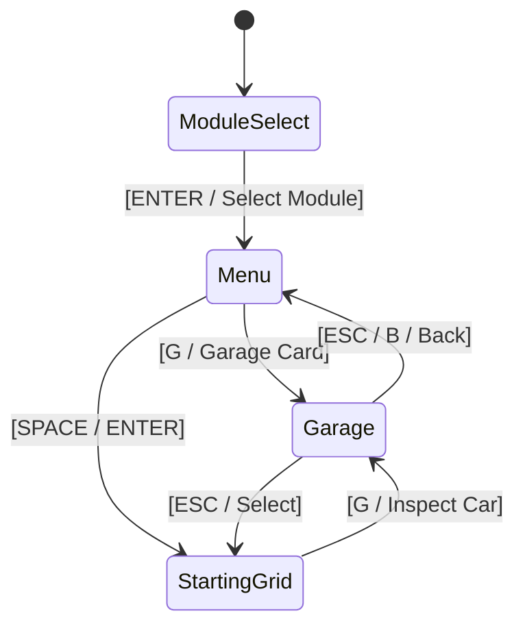

# Specification: Real-World Vehicle Rosters, Physics Balance & Interactive Garage

**Document Status:** PROPOSED  
**Author:** Antigravity Pairing Assistant & Core Motorsport Engineering Team  
**Date:** September 18, 2026  
**Primary Target Crates:**  
1. [`crates/wheelbase`](../crates/wheelbase) (Physics Parameters, Pacejka Dynamics, Dynamic Weight Distribution, Chassis Assists)  
2. [`crates/tdrace-app`](../crates/tdrace-app) (Vehicle Catalog, Dual-View Topdown & Lateral 2D Rendering, Garage Showroom Screen, Audio Profiles)  
3. [`crates/cabinet`](../crates/cabinet) (Screen Navigation, UI Themes, Input Mapping, Audio Synth)  

---

## 1. Executive Summary & Migration Vision

### 1.1 Scope & Motivation
Until now, **TdRace** has utilized prototypical vehicle archetypes to represent competitive classes—for example, a single generic *"420 BHP GT4 Clubsport"*, a *"600 BHP GT3 Evo Racer"*, an *"AWD Turbo Rally"*, or a *"125cc Shifter Kart"*. While these generic archetypes served well for establishing initial vehicle dynamics in `crates/wheelbase`, motorsport culture thrives on the distinct identities, mechanical architectures, acoustic signatures, and histories of iconic, real-world machines.

This specification establishes the roadmap and architectural standards for migrating the entire platform from prototypical benchmarks to **authentic real-world motorsport models across every racing category**.

```
┌────────────────────────────────────────────────────────────────────────────────────────┐
│               MIGRATION: PROTOTYPICAL ARCHETYPES ➔ AUTHENTIC REAL-WORLD MODELS          │
├────────────────────────────────────────────────────────────────────────────────────────┤
│                                                                                        │
│   BEFORE: Prototypical Archetype                   AFTER: Authentic Differentiated Roster│
│   ┌─────────────────────────────┐                  ┌─────────────────────────────────┐ │
│   │ 420 BHP GT4 Clubsport       │                  │ • Porsche 718 Cayman GT4 RS     │ │
│   │ (Generic 1300 kg, RWD, 420N)│  ──────────────► │ • BMW M4 GT4 (G82)              │ │
│   │                             │                  │ • Aston Martin Vantage AMR GT4  │ │
│   └─────────────────────────────┘                  │ • Toyota GR Supra GT4 EVO       │ │
│                                                    └─────────────────────────────────┘ │
│   ┌─────────────────────────────┐                  ┌─────────────────────────────────┐ │
│   │ 600 BHP GT3 Evo Racer       │                  │ • Porsche 911 GT3 R (992)       │ │
│   │ (Generic 1260 kg, RWD, 600N)│  ──────────────► │ • Ferrari 296 GT3               │ │
│   │                             │                  │ • BMW M4 GT3                    │ │
│   └─────────────────────────────┘                  │ • Lamborghini Huracán GT3 EVO2  │ │
│                                                    └─────────────────────────────────┘ │
│                                                                                        │
│   PLUS: Dual 2D Graphics Engine & Interactive Garage                                   │
│   • Accurate Model-Specific Top-Down Silhouette Rendering                              │
│   • High-Fidelity 2D Lateral (Side-Profile) Vector Showroom Rendering                 │
│   • Interactive Garage: Vehicle Lineage Dossier, Spec Radars, Rev Audio Sampler       │
│                                                                                        │
└────────────────────────────────────────────────────────────────────────────────────────┘
```

### 1.2 Core Architectural Goals
1. **Model Differentiations & Nuances**: Rather than identical clones under a class skin, vehicles within a category will feature nuanced differences based on their real-world mechanical configurations:
   - Engine layout (Front-engine vs Mid-engine vs Rear-engine) influencing polar moment of inertia and corner turn-in vs exit traction.
   - Powertrain delivery (Naturally Aspirated high-rev linear torque vs Twin-Turbo punchy midrange).
   - Aerodynamic balance (High-downforce cornering bias vs low-drag straight-line velocity).
2. **Balance of Performance (BoP)**: Equalization mathematics ensuring competitive parity within each class so no single car dominates, allowing player preference and driving style to determine the winner.
3. **Dual Visual Representation Engine**:
   - **Accurate Topdown 2D Vector Model**: Model-specific body outlines, front splitters, dive planes, side cooling ducts, canopy shapes, and rear wing profiles during live gameplay.
   - **Larger, High-Fidelity 2D Lateral (Side-Profile) Vector Model**: Detailed side silhouette, brake calipers with temperature heat glow, vented discs, spoke alloys, cockpit cage, racing liveries, and showroom floor mirror reflections.
4. **The Interactive Garage & Showroom**: A dedicated inspection screen (`GameState::Garage`) providing interactive 2D side/top-down viewing, vehicle history and racing pedigree, detailed engineering specs (weight, speed, accel, grip, drift, braking, torque, downforce), and a sound stage engine rev sampler.
5. **Clear Category Progression**: A structured motorsport career ladder moving progressively through tiers of performance, downforce, and mechanical demand.

---

## 2. Vehicle Catalog & Research by Category

Every category in the game is populated by 3 to 4 iconic real-world models. Each vehicle's physical parameterization traces directly to official technical regulations (SRO, FIA, ACO, IMSA, WIK, CIK-FIA).

```
CATEGORIES PROGRESSION LADDER:
[Tier 1: KZ2 Shifter Karts / Club Tuners]
                   ▼
[Tier 2: GT4 Clubsport / Spec Rallycross]
                   ▼
[Tier 3: WRC Rally1 / Trans-Am TA1 / NASCAR Cup]
                   ▼
[Tier 4: FIA GT3 Evo / SRO GT2 Biturbo]
                   ▼
[Tier 5: 90s GT1 Le Mans Legends]
                   ▼
[Tier 6: LMH & LMDh Le Mans Hypercars]
                   ▼
[Tier 7: Formula 1 Turbo-Hybrid Open-Wheel]
```

---

### 2.1 Category: GT4 Clubsport (Tier 2 Entry GT)
*Baseline Regulation: 420–450 BHP, ~1,300–1,380 kg, Rear-Wheel Drive, Gentle Aerodynamics ($C_l \cdot A \approx 0.85$), ABS & Traction Control.*

```
            GT4 CLUBSPORT COMPARATIVE SILHOUETTES (LATERAL)
            
   Porsche 718 Cayman GT4 RS:
      ___/‾‾‾‾‾\____
   ==[    Mid-Engine \___]===_ [Swan-Neck Wing]
    (O)                 (O)

   BMW M4 GT4 (G82):
        ____/‾‾‾‾\___
   ====[ Long Hood \_]===_ [Endplate GT Wing]
    (O)                 (O)
```

#### 1. Porsche 718 Cayman GT4 RS Clubsport
* **Manufacturer & Origin:** Porsche Motorsport (Weissach, Germany).
* **Powertrain:** 4.0-liter naturally aspirated flat-6 (derived from the 911 GT3 Cup), 500 BHP @ 9,000 RPM, 450 Nm torque. Mid-engine rear-wheel drive.
* **Chassis & Mass:** 1,320 kg dry. Mid-engine layout yields 44% Front / 56% Rear weight distribution. Wheelbase: 2.48 m.
* **Handling Personality:** Highly agile mid-engine rotation, razor-sharp turn-in responsiveness, high mechanical grip in chicanes, slight oversteer breakaway under trail-braking.
* **Historical Pedigree:** Introduced in 2022 as the ultimate evolution of the mid-engine Cayman platform, dominating SRO GT4 America and Nürburgring Langstrecken-Serie (NLS).

#### 2. BMW M4 GT4 (G82)
* **Manufacturer & Origin:** BMW M Motorsport (Munich, Germany).
* **Powertrain:** 3.0-liter M TwinPower Turbo inline-6 (S58), 430–550 BHP (BoP dependent), 650 Nm torque. Front-mid engine rear-wheel drive.
* **Chassis & Mass:** 1,380 kg. 51% Front / 49% Rear weight distribution. Long wheelbase: 2.86 m.
* **Handling Personality:** Massive low-to-mid RPM torque shove out of hairpins, rock-solid stability over high-speed curbs, slightly heavier front-end turn-in requiring disciplined trail-braking.
* **Historical Pedigree:** Customer racing stalwart debuted for the 2023 season, capturing manufacturer championships worldwide with unmatched reliability and straight-line punch.

#### 3. Aston Martin Vantage AMR GT4
* **Manufacturer & Origin:** Aston Martin Racing / Prodrive (Banbury, UK).
* **Powertrain:** 4.0-liter twin-turbo AMG-derived V8, 470 BHP, 630 Nm torque. Front-mid engine, rear transaxle RWD.
* **Chassis & Mass:** 1,370 kg. Perfect 50% Front / 50% Rear weight distribution. Wheelbase: 2.71 m.
* **Handling Personality:** Beautifully neutral balance, extremely predictable breakaway characteristics, gentle on rear tires over long stints.
* **Historical Pedigree:** Multiple-time British GT and IMSA Michelin Pilot Challenge champion, renowned for balanced ergonomics and endurance durability.

#### 4. Toyota GR Supra GT4 EVO
* **Manufacturer & Origin:** Toyota Gazoo Racing Europe (Cologne, Germany).
* **Powertrain:** 3.0-liter single twin-scroll turbo inline-6 (B58), 430 BHP, 650 Nm torque. Front-mid engine RWD.
* **Chassis & Mass:** 1,300 kg (lightest in GT4 class). 48% Front / 52% Rear weight distribution. Short wheelbase: 2.47 m.
* **Handling Personality:** Outstanding low-weight braking deceleration, quick change-of-direction in slow switchbacks, lively rear end under power on corner exit.
* **Historical Pedigree:** Developed specifically from grassroots customer feedback, achieving over 100 podium finishes worldwide since its EVO upgrade in 2023.

---

### 2.2 Category: FIA GT3 Evo (Tier 4 Benchmark GT)
*Baseline Regulation: 550–600 BHP, ~1,250–1,290 kg, Rear-Wheel Drive, High Aerodynamic Downforce ($C_l \cdot A \approx 2.10$), Carbon-Ceramic Brakes, Motorsport ABS & Multi-Map TC.*

#### 1. Porsche 911 GT3 R (992)
* **Manufacturer & Origin:** Porsche Motorsport (Weissach, Germany).
* **Powertrain:** 4.2-liter naturally aspirated water-cooled flat-6, 565 BHP @ 9,250 RPM, 520 Nm torque. Rear-engine rear-wheel drive.
* **Chassis & Mass:** 1,250 kg. Rear-biased 39% Front / 61% Rear weight distribution. Wheelbase: 2.51 m.
* **Handling Personality:** Unrivaled mechanical traction exiting slow hairpins due to rear-engine weight over drive wheels; trail-braking induces natural pivot into apex; sensitive to front-end lift over crests.
* **Historical Pedigree:** Victorious at the 24 Hours of Nürburgring, 24 Hours of Spa, and 12 Hours of Sebring; the gold standard of rear-engine endurance engineering.

#### 2. Ferrari 296 GT3
* **Manufacturer & Origin:** Ferrari Competizioni GT / Oreca (Maranello, Italy).
* **Powertrain:** 3.0-liter 120° "Hot-V" twin-turbo V6, 600 BHP @ 8,000 RPM, 712 Nm torque. Mid-rear engine rear-wheel drive.
* **Chassis & Mass:** 1,265 kg. 44% Front / 56% Rear weight distribution. Wheelbase: 2.60 m.
* **Handling Personality:** Exceptional aerodynamic downforce balance ($C_l \cdot A = 2.20$), razor-sharp front-axle turn-in bite, instant turbo boost response with zero lag, lower polar inertia than front-engine rivals.
* **Historical Pedigree:** Won the 24 Hours of Nürburgring outright on its debut season in 2023, followed by landmark victories at the 2024 24 Hours of Daytona.

#### 3. BMW M4 GT3
* **Manufacturer & Origin:** BMW M Motorsport (Munich, Germany).
* **Powertrain:** 3.0-liter P58 M TwinPower Turbo inline-6, 590 BHP, 700 Nm torque. Front-mid engine rear-wheel drive.
* **Chassis & Mass:** 1,300 kg. 50% Front / 50% Rear weight distribution. Wheelbase: 2.91 m (longest in GT3).
* **Handling Personality:** Master of high-speed sweeping corners (e.g. Blanchimont, 130R); absorbs harsh curb strikes with immense compliance; higher mass requires earlier braking in slow hairpins.
* **Historical Pedigree:** Captured the 2022 DTM Championship and 2023 24 Hours of Spa, revered by drivers for its forgiving high-speed platform.

#### 4. Lamborghini Huracán GT3 EVO2
* **Manufacturer & Origin:** Squadra Corse Lamborghini (Sant'Agata Bolognese, Italy).
* **Powertrain:** 5.2-liter naturally aspirated 90° V10, 585 BHP @ 8,750 RPM, 550 Nm torque. Mid-rear engine rear-wheel drive.
* **Chassis & Mass:** 1,270 kg. 42% Front / 58% Rear weight distribution. Wheelbase: 2.62 m.
* **Handling Personality:** Pure naturally aspirated throttle modulation without turbo surge, distinctive roof-scoop ram-air high-speed acceleration, high lateral mechanical grip.
* **Historical Pedigree:** Multiple Rolex 24 at Daytona class winner; famed for its dramatic styling, roof air intake, and spine-tingling V10 exhaust howl.

---

### 2.3 Category: SRO GT2 Biturbo (Tier 4 Straight-Line Missiles)
*Baseline Regulation: 640–707 BHP, ~1,350–1,400 kg, Rear-Wheel Drive, Moderate Aerodynamics ($C_l \cdot A \approx 1.40$), Top Speeds exceeding 325 km/h.*

#### 1. Porsche 911 GT2 RS Clubsport
* **Powertrain:** 3.8-liter twin-turbo flat-6, 700 BHP @ 7,000 RPM, 750 Nm torque. Rear-engine RWD.
* **Mass & Top Speed:** 1,390 kg, 330 km/h top speed.
* **Personality:** Savage straight-line acceleration; requires smooth throttle discipline to avoid wheelspin on corner exit; lower downforce means higher slide angles at speed.

#### 2. Maserati MC20 GT2
* **Powertrain:** 3.0-liter twin-turbo 90° V6 "Nettuno" with pre-chamber combustion, 621 BHP, 730 Nm torque. Mid-engine RWD.
* **Mass & Top Speed:** 1,360 kg, 326 km/h top speed.
* **Personality:** Ultra-low center of gravity carbon tub, sharp mid-engine direction changes, high top-end boost.

#### 3. KTM X-Bow GT2
* **Powertrain:** 2.5-liter Audi 5-cylinder turbo, 600 BHP, 720 Nm torque. Mid-engine RWD.
* **Mass & Top Speed:** 1,025 kg (Canopy prototype-style ultralight), 318 km/h top speed.
* **Personality:** Featherweight agility in a high-horsepower class; out-brakes all other GT2 competitors while giving up top-end draft speed.

---

### 2.4 Category: 90s GT1 Le Mans Legends (Tier 5 Analog Icons)
*Baseline Regulation: 600–650 BHP, ~950–1,150 kg, Pure RWD, Extreme Aerodynamics ($C_l \cdot A \approx 2.60$), Zero Electronic Driving Aids (Pure Analog Mechanical Mastery).*

#### 1. Porsche 911 GT1-98
* **Powertrain:** 3.2-liter water-cooled twin-turbo flat-6, 550 BHP, 630 Nm torque. Carbon-fiber monocoque chassis, mid-engine RWD.
* **Mass / Top Speed:** 950 kg, 332 km/h.
* **Pedigree:** Outright overall victor at the 1998 24 Hours of Le Mans. Pure analog driving nirvana with high downforce.

#### 2. McLaren F1 GTR 'Longtail'
* **Powertrain:** 6.0-liter naturally aspirated BMW S70/2 60° V12, 600 BHP @ 7,500 RPM, 650 Nm torque. Mid-engine central seating position.
* **Mass / Top Speed:** 915 kg, 336 km/h.
* **Pedigree:** Iconic long rear bodywork engineered for Le Mans Mulsanne Straight stability; glorious 12-cylinder acoustic roar.

#### 3. Mercedes-Benz CLK GTR
* **Powertrain:** 6.0-liter naturally aspirated AMG M120 60° V12, 630 BHP, 730 Nm torque. Mid-engine RWD.
* **Mass / Top Speed:** 1,000 kg, 330 km/h.
* **Pedigree:** Undefeated champion of the 1997 FIA GT Championship, commanding immense mechanical grip and aerodynamic road presence.

---

### 2.5 Category: LMH & LMDh Le Mans Hypercars (Tier 6 Hybrid Prototypes)
*Baseline Regulation: 670–700 BHP ICE + 268 BHP Front/Rear MGU Hybrid Boost, ~1,030 kg, Active/Advanced Ground-Effect Aero ($C_l \cdot A \approx 3.10$).*

#### 1. Ferrari 499P LMH
* **Powertrain:** 3.0-liter 120° twin-turbo V6 ICE + 200 kW front axle electric MGU (e-AWD above activation speed threshold).
* **Mass / Aero:** 1,030 kg, $C_l \cdot A = 3.15$.
* **Pedigree:** Back-to-back 24 Hours of Le Mans overall winner in 2023 and 2024; cutting-edge hybrid torque vectoring.

#### 2. Porsche 963 LMDh
* **Powertrain:** 4.6-liter twin-turbo 90° V8 (derived from the 918 Spyder) + Bosch standard hybrid system, 670 BHP, RWD.
* **Mass / Aero:** 1,030 kg, $C_l \cdot A = 3.05$.
* **Pedigree:** 2024 IMSA WeatherTech GTP and FIA WEC world championship powerhouse.

#### 3. Toyota GR010 Hybrid LMH
* **Powertrain:** 3.5-liter twin-turbo V6 + front-axle electric motor generator, e-AWD.
* **Mass / Aero:** 1,040 kg, $C_l \cdot A = 3.20$.
* **Pedigree:** 5-time Le Mans winning team pedigree, renowned for bulletproof endurance reliability in wet conditions.

---

### 2.6 Category: Formula 1 Turbo Hybrid (Tier 7 Apex Open-Wheel)
*Baseline Regulation: 1,050 BHP (1.6L V6 Turbo + MGU-K + MGU-H), 798 kg minimum mass, Extreme Aerodynamics ($C_l \cdot A \approx 3.40$), Top Speed 350+ km/h.*

#### 1. Red Bull Racing RB20
* **Powertrain:** Honda RBPT 1.6L V6 Turbo Hybrid, 1,050 BHP.
* **Aero & Handling:** Unmatched floor ground-effect venturi downforce, exceptional high-speed front-end bite, low drag efficiency with DRS open.

#### 2. Ferrari SF-24
* **Powertrain:** Ferrari 066/12 1.6L V6 Turbo Hybrid, 1,045 BHP.
* **Aero & Handling:** Outstanding low-speed mechanical traction, compliant ride over curbs in chicanes, high peak braking deceleration.

#### 3. McLaren MCL38
* **Powertrain:** Mercedes-AMG 1.6L V6 Turbo Hybrid, 1,050 BHP.
* **Aero & Handling:** Superior aerodynamic balance across diverse ambient temperatures, high cornering speed in medium-to-fast sweepers.

---

### 2.7 Other Motorsport Categories in the Expanded Roster

| Category | Real-World Models Included | Distinguishing Mechanical Architecture |
| :--- | :--- | :--- |
| **WRC Rally1** | Toyota GR Yaris Rally1, Hyundai i20 N Rally1, Ford Puma Rally1 | 1.6L Turbo + 100 kW Hybrid, 50:50 Mechanical AWD, Long-Travel Suspension |
| **Group B Rally** | Audi Sport Quattro S1 E2, Lancia Delta S4, Peugeot 205 T16 Evo 2 | 500+ BHP Turbo / Twin-charged monsters, wild turbo lag, loose surface slides |
| **Shifter Karts** | Tony Kart Racer 401 (TM KZ-R1), CRG Road Rebel, Birel ART CRY30 | 125cc 2-stroke, 6-speed sequential, direct 1:1 steering rack, 180 kg w/ driver |
| **NASCAR Cup** | Chevrolet Camaro ZL1 Next-Gen, Ford Mustang Dark Horse, Toyota Camry XSE | 5.9L Pushrod V8 (850 BHP), 1,260 kg, quick-ratio steering, superspeedway draft |
| **Trans-Am TA1** | TA1 Dodge Challenger, TA1 Ford Mustang Road Racer | Spaceframe chassis, 850 BHP NA V8, high-mount carbon wing, road-course brakes |
| **Extreme Off-Road**| Class 1 Sand Car LS3 (800 BHP), Buckshot X-2R Buggy, Can-Am Maverick R | Tubular chromoly frame, 30" suspension travel, paddle tires, jump dampening |
| **Classic Tuner** | Nissan Silvia S15 Spec-R Drift, Toyota GR Supra Formula Drift (2JZ) | High steering lock (50°+), progressive rear slip breakaway, snappy counter-steer |

---

## 3. Engineering Parameters & Balance of Performance (BoP)

### 3.1 Physical Parameter Levers (`CarConfig`)
Each vehicle is defined using the existing `CarConfig` model from `crates/wheelbase/src/config.rs`:

```rust
pub struct CarConfig {
    pub mass: f32,                          // Chassis + driver mass (kg)
    pub inertia: f32,                       // Yaw polar moment of inertia (kg * m^2)
    pub wheelbase: f32,                     // Distance between front & rear axles (m)
    pub track_width: f32,                   // Width between left & right tires (m)
    pub cg_to_front: f32,                   // Distance from CG to front axle (lf)
    pub cg_to_rear: f32,                    // Distance from CG to rear axle (lr)
    pub cg_height: f32,                     // Center of gravity height above ground (m)
    
    pub max_engine_force: f32,              // Peak forward longitudinal force (N)
    pub max_brake_force: f32,               // Peak hydraulic braking force (N)
    pub handbrake_force: f32,               // Handbrake locking force on rear axle (N)
    pub brake_bias: f32,                    // Brake torque distribution (e.g. 0.60 = 60% Front)
    pub drive_bias: f32,                    // Drivetrain split (0.0 = RWD, 0.5 = AWD, 1.0 = FWD)
    pub top_speed_mps: f32,                 // Maximum terminal velocity (m/s)
    
    pub max_steer_angle: f32,               // Maximum wheel steering lock (rad)
    pub steer_speed: f32,                   // Rate of steering angle onset (rad/s)
    pub steer_return_speed: f32,            // Self-aligning caster return rate (rad/s)
    pub counter_steer_assist: f32,          // Arcade counter-steer stability assist
    
    pub air_drag_coefficient: f32,          // Aerodynamic drag area (Cd * A)
    pub downforce_coefficient: f32,         // Speed-squared vertical aero load (Cl * A)
    pub weight_transfer_longitudinal: f32,  // Pitch: squat under accel / dive under braking
    pub weight_transfer_lateral: f32,       // Roll: lateral chassis roll in corners
    
    pub tire: TireConfig,                   // Pacejka Magic Formula slip parameters
    pub assists: DriverAssistsConfig,       // ABS, Traction Control, ESC torque vectoring
}
```

---

### 3.2 Balance of Performance (BoP) Methodology

In real-world SRO and FIA championships, Balance of Performance (BoP) equalizes disparate engine displacements, aspiration types, and chassis weights using:
1. **Ballast Adjustment ($\Delta m$):** Adding or subtracting mass in 10–25 kg increments.
2. **Air Restrictor / Boost Curve Scaling ($\gamma_{\text{power}}$):** Scaling `max_engine_force` by $\pm 3\%$.
3. **Rear Wing Angle & Ride Height Restrictions:** Adjusting `downforce_coefficient` ($C_l \cdot A$) and `air_drag_coefficient` ($C_d \cdot A$).

#### Mathematical Parity Formula
To ensure competitive lap time parity on standard benchmark circuits (Monza, Spa, Silverstone) while preserving authentic car characteristics:

$$\text{Lap Time Sensitivity} \approx \frac{\partial T}{\partial m} \cdot \Delta m + \frac{\partial T}{\partial F_{\text{eng}}} \cdot \Delta F_{\text{eng}} + \frac{\partial T}{\partial C_l} \cdot \Delta C_l$$

Where:
- Mass Penalty: $+20\,\text{kg} \approx +0.15\,\text{s}$ per lap.
- Engine Force Bonus: $+100\,\text{N} \approx -0.12\,\text{s}$ per lap.
- Downforce Bonus: $+0.10\,C_l \approx -0.18\,\text{s}$ per lap on technical tracks, $+0.05\,\text{s}$ penalty on high-speed straights due to induced drag.

#### Tuning Principle: "Asymmetric Strengths"
Cars are intentionally engineered with distinct tactical advantages:
- **Rear-Engine (Porsche 911):** High traction coefficient out of slow corners ($+5\%$ longitudinal grip), higher trail-braking agility, but sensitive to high-speed rear snap if unsettled over curbs.
- **Mid-Engine (Ferrari 296, Cayman GT4):** Lowest yaw polar inertia ($I_z$), razor-sharp turn-in, superior mid-corner steady-state lateral G, higher rear tire thermal degradation over long stints.
- **Front-Engine (BMW M4, Aston Martin Vantage):** Longest wheelbase and highest stability over curbs, unmatched straight-line torque, but slightly pushy (understeer) in tight hairpins.

---

### 3.3 Comparative Specification Tuning Matrix (Sample GT4 & GT3)

| Model | Mass (kg) | F/R Bias | Engine Force (N) | Top Speed | Brake Force (N) | Downforce $C_l$ | Cornering Stiffness $B$ |
| :--- | :---: | :---: | :---: | :---: | :---: | :---: | :---: |
| **Porsche 718 Cayman GT4 RS** | 1,320 | 44/56 | 7,300 | 276 km/h (76.7 m/s) | 18,500 | 0.88 | 12.8 |
| **BMW M4 GT4 (G82)** | 1,380 | 51/49 | 7,600 | 280 km/h (77.8 m/s) | 18,000 | 0.82 | 12.4 |
| **Aston Martin Vantage GT4** | 1,370 | 50/50 | 7,500 | 278 km/h (77.2 m/s) | 18,200 | 0.84 | 12.6 |
| **Toyota GR Supra GT4 EVO** | 1,300 | 48/52 | 7,250 | 274 km/h (76.1 m/s) | 18,800 | 0.86 | 13.0 |
| **Porsche 911 GT3 R (992)** | 1,250 | 39/61 | 9,400 | 296 km/h (82.2 m/s) | 22,500 | 2.15 | 13.5 |
| **Ferrari 296 GT3** | 1,265 | 44/56 | 9,600 | 301 km/h (83.6 m/s) | 22,200 | 2.20 | 13.8 |
| **BMW M4 GT3** | 1,310 | 50/50 | 9,750 | 304 km/h (84.4 m/s) | 21,800 | 2.05 | 13.2 |
| **Lamborghini Huracán GT3** | 1,270 | 42/58 | 9,550 | 299 km/h (83.1 m/s) | 22,300 | 2.18 | 13.6 |

---

## 4. Dual-View Graphics & Visual Design Pipeline

To elevate TdRace's presentation to modern arcade simulation standards, every car model will feature two synchronized procedural vector representations:
1. **Model-Specific Top-Down Live Gameplay Representation**: Rendered in the race engine with distinctive silhouettes.
2. **High-Fidelity 2D Lateral (Side-Profile) Representation**: Rendered in the Garage and vehicle inspection screens.

```
┌────────────────────────────────────────────────────────────────────────────────────────┐
│                        DUAL-VIEW GRAPHICS RENDERING PIPELINE                           │
├────────────────────────────────────────────────────────────────────────────────────────┤
│                                                                                        │
│   1. LIVE TOP-DOWN 2D/2.5D (Live Racing & Replays)                                     │
│      • Model silhouette: Long front hood (BMW) vs compact mid-cockpit (Ferrari/Porsche)│
│      • Aerodynamics: Exact rear wing span, swan-neck mounts, dive planes, louvers      │
│      • Dynamic FX: Dynamic tire steering, chassis roll/dive offset, drop shadows       │
│                                                                                        │
│   2. HIGH-FIDELITY 2D LATERAL PROFILE (Garage Showroom & Dossier)                      │
│      • Detailed wheel rims, tire sidewall lettering, and visible brake calipers        │
│      • Caliper heat glow: Procedural emissive heat gradient based on braking/rev tests│
│      • Cockpit: Roofline arc, A/B/C pillars, tinted greenhouse, roll cage lattice      │
│      • Aero & Livery: Splitter profile, side skirts, rear diffuser fins, sponsor plates│
│      • Stage Polish: Ground mirror reflections, spotlight ambient drop shadow          │
│                                                                                        │
└────────────────────────────────────────────────────────────────────────────────────────┘
```

---

### 4.1 Model-Specific Top-Down Rendering (`render_car.rs`)
The live racing renderer will be upgraded from generic visual buckets (`VehicleVisualType::TouringGT`) to specific body silhouette geometries:

```rust
/// Detailed visual silhouette and aerodynamic configuration for top-down rendering.
#[derive(Debug, Clone, PartialEq, Serialize, Deserialize)]
pub struct ModelSilhouetteConfig {
    pub nose_taper: f32,                // Front nosecone taper ratio (0.0..1.0)
    pub hood_length_ratio: f32,         // Ratio of front hood to total chassis length
    pub cockpit_length_ratio: f32,      // Length of roof and greenhouse
    pub rear_deck_ratio: f32,           // Rear deck length (short in 911, long in TA1)
    pub front_splitter_extension: f32,  // Forward protrusion of aerodynamic splitter
    pub dive_planes: u8,                // Number of front bumper canards / dive planes (0..4)
    pub hood_louvers: bool,             // Cooling vents on front hood
    pub roof_scoop: bool,               // Central ram-air roof scoop (Huracán GT3, Rally1)
    pub side_intakes: bool,             // Mid-engine side air intake scoops (Ferrari 296, Cayman)
    pub rear_wing_type: RearWingStyle,  // SwanNeck, PedestalMount, Ducktail, BiPlane, TA1
    pub diffuser_strakes: u8,           // Visible rear undertray diffuser channels (0..6)
}

#[derive(Debug, Clone, Copy, PartialEq, Eq, Serialize, Deserialize)]
pub enum RearWingStyle {
    None,
    DucktailBlade,
    PedestalGT,
    SwanNeckGT,
    HighMountTA1,
    DualElementPrototype,
    OpenWheelBiPlane,
}
```

---

### 4.2 High-Fidelity 2D Lateral Profile Rendering Engine (`render/lateral.rs`)

The new module `crates/tdrace-app/src/render/lateral.rs` provides dedicated 2D side-profile rendering.

```
                 HIGH-FIDELITY 2D LATERAL VIEW ANATOMY
                 
                        Roof Arc / Carbon Canopy
                          .------------------.
                         /   [Tinted Glass]   \
           Front Hood   /    [Roll Cage Bar]   \    Rear Deck & Swan Wing
        .--------------'                        `------.====.
       /                                                \   |
  .---' [Headlight]                                      `--|-- [Diffuser]
 [Splitter]     ( O )                              ( O )
             [Front Alloy]                      [Rear Alloy]
             [Brake Caliper]                    [Brake Caliper]
 ~~~~~~~~~~~~~~~~~~~~~~~~~~~~~~~~~~~~~~~~~~~~~~~~~~~~~~~~~~~~~~~~~~~~~~~~~
                 [Mirror Ground Floor Reflection]
```

#### Key Rendering Stages:
1. **Showroom Stage & Ambient Shadows**:
   - Polished showroom tile gradient with an ambient occlusion shadow directly beneath the tires and chassis bottom.
   - Mirror floor reflection: The chassis profile is rendered vertically flipped below the ground line with linear alpha falloff ($1.0 \to 0.0$) and subtle vertical blur.
2. **Wheels & Running Gear**:
   - Low-profile racing slick tires with dual sidewall white brand lettering.
   - High-detail alloy rims (5-spoke, Y-spoke, or center-lock BBS mesh).
   - Slotted/drilled carbon-ceramic brake rotor with visible multi-piston monobloc brake caliper.
   - **Interactive Rev/Braking Glow**: When the user presses `[SPACE]` to rev the engine or test brakes in the Garage, the brake rotor glows dynamically from dark charcoal to intense red-orange (`Color::new(1.0, 0.35, 0.05, glow_intensity)`).
3. **Chassis Body Silhouette & Livery**:
   - Parametric Bézier/polyline contour matching each specific car's profile (long low nose of Ferrari 296 vs upright muscular hood of BMW M4 vs curved teardrop of Porsche 911).
   - Side racing stripes, door number rondel, and contrast mirror caps.
   - Aerodynamic side skirts, front splitter blade, rear diffuser fins, and swan-neck wing endplates.
4. **Cockpit & Interior**:
   - Dark tinted greenhouse glass with reflective gloss gradient.
   - Visible tubular steel roll cage diagonal braces behind driver window net.

---

## 5. The Interactive Garage & Showroom (`GameState::Garage`)

### 5.1 Screen Architecture & UI Layout
The Garage is accessible from the **Grand Hub / Module Select Menu**, the **Track Selection Menu**, and the **Starting Grid**.

```
┌──────────────────────────────────────────────────────────────────────────────────────────────────┐
│  GARAGE SHOWROOM  │  CATEGORY: FIA GT3 EVO  [◄ Q / E ►]  │  VEHICLE: FERRARI 296 GT3  [◄ A / D ►]   │
├─────────────────────────────────────────────────────────────┬────────────────────────────────────┤
│                                                             │  SPECIFICATION TELEMETRY           │
│  [2D LATERAL VIEW (ACTIVE)]  [TOP-DOWN VIEW (TAB)]          │  Engine: 3.0L 120° Twin-Turbo V6   │
│                                                             │  Power:  600 BHP @ 8,000 RPM       │
│                                                             │  Torque: 712 Nm @ 5,500 RPM        │
│                  /‾‾‾‾‾‾‾‾\____                             │  Weight: 1,265 kg (44% F / 56% R)  │
│          _______/  Canopy  \   \____                        │  Top Speed: 301 km/h (83.6 m/s)    │
│    __===[ Ferrari 296 GT3   \_______]====_  [Wing]          │  0-100 km/h: 2.8s                  │
│   ( O )================================( O )                │  Aero:   Cl 2.20 / Cd 0.64         │
│                                                             │  Brakes: Carbon-Ceramic (22.2 kN)  │
│   ~~~~~~~~~~~~~~~~~~~~~~~~~~~~~~~~~~~~~~~~~~                ├────────────────────────────────────┤
│   [Floor Mirror Reflection & Ambient Shadow]                │  PERFORMANCE RADAR (HEX)           │
│                                                             │  Speed:  ██████████░ 94%           │
│  [SPACE: Rev Engine]  [L: Cycle Livery]  [I: Inspect Zoom]  │  Accel:  ██████████  96%           │
├─────────────────────────────────────────────────────────────┤  Grip:   █████████░  95%           │
│  HISTORICAL DOSSIER & RACING PEDIGREE                       │  Drift:  █████░░░░░  52%           │
│  Debuted in 2023 succeeding the legendary 488 GT3. Powered  │  Brake:  █████████░  93%           │
│  by a revolutionary 120° 'Hot-V' twin-turbo V6. Claimed     │  Aero:   █████████░  94%           │
│  historic outright victory at the 2023 24 Hours of Nürburg- ├────────────────────────────────────┤
│  ring and 2024 24 Hours of Daytona.                         │  [ENTER] SELECT FOR RACE           │
└─────────────────────────────────────────────────────────────┴────────────────────────────────────┘
```

---

### 5.2 Core Garage Features

#### 1. Dual-View Mode Toggle (`[TAB]` / `[X]` button)
- **2D Lateral View (Default)**: Inspect the car's sleek side silhouette, rim design, brake calipers, and ground reflections.
- **Top-Down Inspection View**: Swaps the showroom stage to an overhead turntable view where the car can be rotated 360° using the left/right arrow keys or gamepad stick, showing the exact racing model.

#### 2. Vehicle Lineage & Historical Dossier
Each vehicle includes a curated motorsport dossier written by racing enthusiasts:
- Year of introduction and competition debut.
- Major championship achievements (Le Mans, Nürburgring 24h, Spa 24h, Daytona).
- Engineering innovations (e.g. 120° Hot-V layout, swan-neck aero efficiency, dry-sump flat-6).

#### 3. Deep Telemetry & Engineering Specs Panel
Displays real physical metrics alongside normalized 0–100% comparative ratings:
- **Mass & Distribution:** Weight in kg, F/R weight balance percentage.
- **Powertrain:** Engine displacement, cylinder configuration, aspiration, maximum BHP, peak torque (Nm).
- **Speed & Acceleration:** Top speed in km/h and mph, simulated 0-100 km/h sprint time.
- **Aerodynamics:** Downforce coefficient ($C_l \cdot A$) and aerodynamic drag ($C_d \cdot A$).
- **Braking & Assists:** Max deceleration force (N), carbon vs steel rotor specification, ABS/TC assistance levels.
- **Handling & Drift:** Tire slip angle threshold, drift slide friction, cornering grip rating.

#### 4. Sound Stage Engine Rev Sampler (`[SPACE]` / Gamepad Right Trigger)
- Holding `[SPACE]` initiates dynamic engine revving audio via the modular audio synthesizer (`crates/tdrace-app/src/audio`).
- Revving modulates the tachometer needle on the showroom HUD and causes procedural exhaust pops, backfire flames, and glowing brake calipers.

#### 5. Livery & Customization Carousel (`[L]` / Gamepad `[Y]`)
- Cycle through factory competition liveries, classic heritage schemes, and sponsor decals in real time.

---

### 5.3 Navigation State Machine Integration
The Garage is integrated directly into the `cabinet` screen navigation schema:



- **From Main Menu:** Pressing `[G]` or selecting the dedicated "GARAGE SHOWROOM" card transitions into `GameState::Garage`.
- **From Starting Grid:** Pressing `[G]` allows the player to inspect their opponent's or their own car's specs and dossier before starting the race.
- **Car Selection Confirmation:** Pressing `[ENTER]` in the Garage equips the selected vehicle for the active tournament or quick race.

---

## 6. Implementation Milestones

### Milestone 1: Data Model & Vehicle Catalog Expansion
- [ ] Define `RealCarModelDefinition` struct with fields for historical dossier, detailed powertrain metrics, BoP parameters, and visual configurations.
- [ ] Create catalog modules for all 11 categories:
  - `crates/tdrace-app/src/catalog/gt4.rs`
  - `crates/tdrace-app/src/catalog/gt3.rs`
  - `crates/tdrace-app/src/catalog/gt2.rs`
  - `crates/tdrace-app/src/catalog/gt1.rs`
  - `crates/tdrace-app/src/catalog/hypercar.rs`
  - `crates/tdrace-app/src/catalog/f1.rs`
  - `crates/tdrace-app/src/catalog/rally.rs`
  - `crates/tdrace-app/src/catalog/kart.rs`
  - `crates/tdrace-app/src/catalog/stock.rs`
  - `crates/tdrace-app/src/catalog/offroad.rs`
- [ ] Implement Balance of Performance (BoP) calibration formulas.

### Milestone 2: 2D Lateral Profile Rendering Engine
- [ ] Create `crates/tdrace-app/src/render/lateral.rs`.
- [ ] Implement procedural chassis side contours, wheel alloys, brake calipers, and tires.
- [ ] Implement mirror floor reflections and drop shadow shaders.
- [ ] Add dynamic brake caliper glow and exhaust flame particle effects during engine revving.

### Milestone 3: Model-Specific Top-Down Rendering Upgrades
- [ ] Enhance `render_car_with_visual_type` in `render/car.rs` to consume `ModelSilhouetteConfig`.
- [ ] Render distinct front nosecones, hood louvers, roof scoops, and swan-neck vs ducktail rear wings.

### Milestone 4: The Interactive Garage Screen
- [ ] Implement `crates/tdrace-app/src/ui/garage.rs`.
- [ ] Wire `GameState::Garage` into `crates/tdrace-app/src/game/mod.rs`.
- [ ] Implement category/car navigation (`[Q]`/`[E]` for category, `[A]`/`[D]` for car).
- [ ] Wire sound stage rev testing using `AudioManager`.
- [ ] Add hexagonal performance radar chart and historical dossier view.

### Milestone 5: Verification & Balance Validation
- [ ] Automated regression tests verifying all vehicle configurations yield deterministic physics.
- [ ] Lap time parity benchmark simulation validating BoP across test circuits.

---

## 7. Verification & Acceptance Criteria (Pseudo-Gherkin)

### Scenario 1: Category & Vehicle Navigation in Garage
- [ ] **Given** the player is on the Main Menu or Starting Grid
- [ ] **When** the player presses the `[G]` key or selects "GARAGE SHOWROOM"
- [ ] **Then** the screen transitions smoothly to `GameState::Garage` displaying the active category and vehicle
- [ ] **When** the player presses `[E]` or `[Q]`
- [ ] **Then** the category shifts (e.g. from GT4 Clubsport to FIA GT3 Evo) and the vehicle list updates
- [ ] **When** the player presses `[A]` or `[D]`
- [ ] **Then** the vehicle cycles through authentic models (e.g., Porsche 911 GT3 R ➔ Ferrari 296 GT3 ➔ BMW M4 GT3)

### Scenario 2: Dual-View Mode & Interactive Inspection
- [ ] **Given** the player is inspecting a vehicle in the Garage
- [ ] **When** the screen is in 2D Lateral View
- [ ] **Then** the car is drawn with detailed side contours, brake calipers, spoke alloys, and showroom floor reflections
- [ ] **When** the player presses `[TAB]`
- [ ] **Then** the viewport toggles to the Top-Down turntable inspection view, matching live gameplay rendering
- [ ] **When** the player holds `[LEFT]` or `[RIGHT]` in turntable view
- [ ] **Then** the vehicle rotates smoothly through 360 degrees

### Scenario 3: Engine Rev Sampler & Brake Glow
- [ ] **Given** the player is in the Garage Showroom
- [ ] **When** the player presses and holds `[SPACE]` (or Gamepad Right Trigger)
- [ ] **Then** the engine audio revs toward the vehicle's authentic redline (e.g. 9,250 RPM for 911 GT3 R, 8,000 RPM for 296 GT3)
- [ ] **And** the tachometer needle animates, exhaust backfire sparks appear, and brake rotors visually heat up to an emissive orange glow

### Scenario 4: Balance of Performance & Handling Differentiation
- [ ] **Given** a multi-car race in the FIA GT3 Evo class (Porsche 911 GT3 R vs Ferrari 296 GT3 vs BMW M4 GT3)
- [ ] **When** driven by AI or player on benchmark circuits (Monza, Spa)
- [ ] **Then** their lap times remain within a $\pm 0.35\,\text{s}$ BoP parity window
- [ ] **And** telemetry confirms the Porsche exhibits higher slow-corner exit traction, the Ferrari exhibits higher mid-corner lateral grip, and the BMW exhibits higher curb stability and straight-line speed

### Scenario 5: Career Progression & Unlocks
- [ ] **Given** a new player profile at Career Level 1
- [ ] **When** entering the Garage or Championship Mode
- [ ] **Then** Entry classes (KZ2 Karts, GT4 Clubsport, Rally) are unlocked
- [ ] **And** Advanced classes (GT3, GT2, GT1, Hypercar, F1) display progressive career level unlock badges
