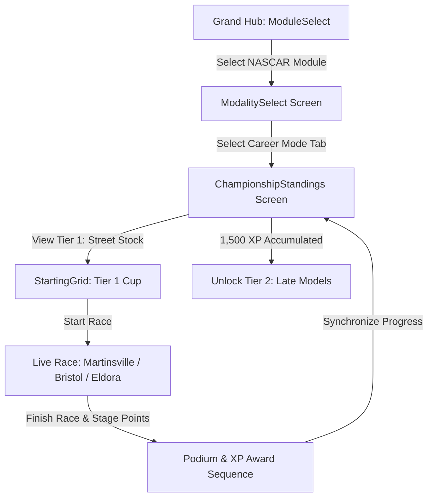

# Feature Spec: NASCAR & Trans-Am TA1 Career Mode 🏁

A comprehensive 5-tier American stock car and silhouette GT career mode in **TdRace**. Spanning local short-track bullrings, clay dirt ovals, intermediate D-ovals, road courses, downtown street tracks, and high-banked superspeedways, this progression teaches players the core disciplines of American closed-cockpit motorsport: inertia control in heavy rear-wheel-drive machines, lateral slip management on high banking, multi-car aerodynamic pack drafting, and raw unassisted 850 BHP spaceframe road racing.

---

## 🗺️ User Flow & Interface Design

### 1. Interface Navigation & Screen Flow
The NASCAR career integrates directly into `GameState::ModalitySelect` and `GameState::ChampionshipStandings`:



### 2. Visual & Audio Theming
- **Palette**: Golden Yellow primary accent (`Color::new(1.0, 0.82, 0.08, 1.0)`), Daytona Blue secondary accent (`Color::new(0.06, 0.42, 0.92, 1.0)`).
- **HUD Stage Indicators**: Real-time stage lap indicators rendering `STAGE 1`, `STAGE 2`, and `FINAL STAGE` with green banner animations on stage completions.
- **Drafting Tunnel Effect**: Blue wind-slipstream streaks rendered behind lead vehicles when trailing inside the $15.0\,\text{m}$ drafting envelope.
- **Sound Profile**: Deep pushrod V8 rumble (`EngineAudioProfile::nascar_v8`) transitioning to high-revving side boom-tube acoustics for Trans-Am TA1.

---

## ⚙️ Backend Models & API Endpoints

### 1. SQLite Data Schema & Career Progress
Career state is persisted in SQLite via `ModuleCareerProgress` in [`crates/tdrace-app/src/profile/mod.rs`](../crates/tdrace-app/src/profile/mod.rs):

```rust
pub struct ModuleCareerProgress {
    pub profile_id: i64,
    pub module_id: String, // "nascar"
    pub xp: u64,
    pub level: u32,        // 1..=5
    pub unlocked_cars: Vec<String>,
    pub unlocked_tracks: Vec<String>,
    pub completed_events: Vec<String>,
    pub trophies_gold: u32,
    pub trophies_silver: u32,
    pub trophies_bronze: u32,
    pub updated_at: String,
}
```

### 2. Campaign Launch Endpoint & Session Struct
Implemented in [`crates/tdrace-app/src/game/mod.rs`](../crates/tdrace-app/src/game/mod.rs):
```rust
impl GameApp {
    /// Launches a NASCAR Career Championship Cup for the given tier (1..=5).
    pub fn start_nascar_career_tier(&mut self, tier: u32) {
        let (cup_name, track_ids, car_id) = match tier {
            1 => (
                "Street Stock Grassroots Invitational (Tier 1)",
                vec!["martinsville".to_string(), "bristol".to_string(), "eldora_dirt".to_string()],
                "chevy_monte_carlo_ss",
            ),
            2 => (
                "Late Model Short Track Shootout (Tier 2)",
                vec!["charlotte".to_string(), "darlington".to_string(), "iowa_speedway".to_string()],
                "super_late_camaro",
            ),
            3 => (
                "ARCA Menards Road & Oval Tour (Tier 3)",
                vec!["watkins_glen".to_string(), "sonoma".to_string(), "road_america".to_string()],
                "arca_chevy_ss",
            ),
            4 => (
                "Craftsman Truck National Series (Tier 4)",
                vec!["richmond".to_string(), "daytona".to_string(), "chicago_street".to_string()],
                "silverado_truck",
            ),
            _ => (
                "Trans-Am TA1 Pinnacle Championship (Tier 5)",
                vec!["talladega".to_string(), "indianapolis".to_string(), "cota_gp".to_string()],
                "corvette_c7_ta1",
            ),
        };
        // Initializes ChampionshipSession with PointSystem::NascarCup { stage_win_bonus: true }
    }
}
```

---

## 🛡️ Security & Role-Based Access Controls (RBAC)

### 1. Career License Gating & Profile Integrity
- **Tier 1 (Street Stock)**: Unlocked by default for all profiles (`xp >= 0`).
- **Tier 2 (Late Model)**: Requires Career Level 2 (`xp >= 1,500`).
- **Tier 3 (ARCA Menards)**: Requires Career Level 3 (`xp >= 3,500`).
- **Tier 4 (Craftsman Truck)**: Requires Career Level 4 (`xp >= 6,500`).
- **Tier 5 (Trans-Am TA1)**: Requires Career Level 5 (`xp >= 10,000`).
- **Dev Mode Bypass**: When `dev_mode: true` is set in configuration, all tiers, tracks, and vehicles are unlocked for testing without modifying saved profile progress.

---

## 1. 5-Tier Vehicle Hierarchy & Prototypical Engineering Specs

Each tier features 3 iconic American machines calibrated with authentic weight distributions, engine force outputs, aerodynamic drag profiles, and tire compliance.

```
                     STOCK CAR & TRUCK SILHOUETTES (LATERAL 2D)
                     
    Tier 1 Street Stock (Monte Carlo / Dart / Mustang):
       _________/‾‾‾‾‾\_________
     =[   Heavy Notchback Trunk ]=
       (O)                   (O)

    Tier 4 Craftsman Truck (Silverado / F-150 / Tundra):
       __________/‾‾‾‾|________
     =[ High Cab   Flat Bed    ]=
       (O)                   (O)

    Tier 5 Trans-Am TA1 (Corvette C7 / TA1 Mustang / Challenger):
         _____/‾‾‾‾\____       [High GT Wing]
     ===[ Low Slung Hood \_]==_  |‾|
       (O)                  (O)  |_|
```

### 1.1 Tier 1: Street Stock V8 (Grassroots Stock Racing)
* **Design Philosophy:** Entry-level grassroots stock car built on production steel chassis with roll cages. Heavy mass and modest mechanical grip teach momentum conservation, weight transfer, and controlled bumper contact.
* **Core Physics:**
  * Power: $450\,\text{BHP}$ ($335\,\text{kW}$) naturally aspirated pushrod V8 ($5.7\,\text{L}$).
  * Curb Weight ($m$): $1,420.0\,\text{kg}$ | Yaw Moment of Inertia ($I_z$): $2,100.0\,\text{kg}\cdot\text{m}^2$.
  * Layout: Front-engine, Rear-Wheel Drive (`drive_bias: 0.0`), spool rear axle (locked differential).
  * Top Speed ($v_{\text{max}}$): $55.0\,\text{m/s}$ ($\approx 198\,\text{km/h}$).
  * Steering Lock: $0.65\,\text{rad}$ ($37.2^\circ$) | Steering Rack Speed: $6.0\,\text{rad/s}$.
  * Aerodynamics: $C_d \cdot A = 0.92$, Downforce $C_L \cdot A = 0.20$ (Negligible aero grip).
  * Tire Setup: Bias-ply grooved slick ($B = 6.8$, $C = 1.30$, $D = 0.98$, $E = -0.22$, $\mu_{\text{slide}} = 0.86$).
* **Prototypical Vehicles:**
  1. **Chevrolet Monte Carlo Street Stock:** Classic 1980s G-body notchback silhouette, heavy rear pendulum momentum, forgiving recovery under power oversteer.
  2. **Ford Mustang Street Stock:** Fox-body derived stock car, slightly shorter wheelbase ($2.56\,\text{m}$), quicker yaw response into corner entry.
  3. **Dodge Dart Street Stock:** High low-end torque Chrysler 360 V8, planted straight-line drive, requires earlier braking into tight bullring turns.

### 1.2 Tier 2: Late Model / Super Late Model (Short-Track Specialist)
* **Design Philosophy:** Purpose-built lightweight tubular perimeter spaceframe. Fiberglass body panels, offset chassis setup (left-side weight bias for ovals), and wide sticky slicks deliver high lateral cornering G-forces.
* **Core Physics:**
  * Power: $550\,\text{BHP}$ ($410\,\text{kW}$) aluminum V8 engine.
  * Curb Weight ($m$): $1,220.0\,\text{kg}$ | Yaw Moment of Inertia ($I_z$): $1,650.0\,\text{kg}\cdot\text{m}^2$.
  * Weight Distribution: $48\%$ Front / $52\%$ Rear (Oval offset: $56\%$ Left bias).
  * Top Speed ($v_{\text{max}}$): $64.0\,\text{m/s}$ ($\approx 230\,\text{km/h}$).
  * Steering Lock: $0.60\,\text{rad}$ ($34.4^\circ$) | Steering Rack Speed: $7.2\,\text{rad/s}$.
  * Aerodynamics: Asymmetrical rear spoiler blade ($C_d \cdot A = 0.85$, $C_L \cdot A = 0.65$).
  * Tire Setup: Radial racing slick ($B = 8.2$, $C = 1.35$, $D = 1.15$, $E = -0.15$, $\mu_{\text{slide}} = 0.94$).
* **Prototypical Vehicles:**
  1. **Late Model Stock Car (LMSC):** Spec crate V8, steel perimeter frame, rigid platform rewarding surgical apex lines.
  2. **Super Late Model - Chevy Camaro Body:** Wedge-nose fiberglass body, high front-end bite, lively corner-exit throttle rotation.
  3. **Super Late Model - Ford Mustang / Toyota Camry Body:** High downforce decklid spoiler configuration, superior stability on high-speed intermediate ovals.

### 1.3 Tier 3: ARCA Menards Series (Heavy High-Horsepower Stock)
* **Design Philosophy:** High-power steel chassis mirroring NASCAR Gen-6 platform. Acts as the critical pedagogical bridge from short-tracks to high-speed superspeedway pack drafting and technical road racing.
* **Core Physics:**
  * Power: $650\,\text{BHP}$ ($485\,\text{kW}$) Ilmor 396 cubic-inch ($6.5\,\text{L}$) V8.
  * Curb Weight ($m$): $1,480.0\,\text{kg}$ | Yaw Moment of Inertia ($I_z$): $2,250.0\,\text{kg}\cdot\text{m}^2$.
  * Top Speed ($v_{\text{max}}$): $78.0\,\text{m/s}$ ($\approx 280\,\text{km/h}$ in solo trim; $295\,\text{km/h}$ in draft).
  * Slipstream Multiplier: $1.35\times$ drafting speed bonus inside $15.0\,\text{m}$ wake corridor.
  * Steering Lock: $0.52\,\text{rad}$ ($29.8^\circ$) | Steering Rack Speed: $6.8\,\text{rad/s}$.
  * Aerodynamics: $C_d \cdot A = 0.78$, $C_L \cdot A = 0.85$.
* **Prototypical Vehicles:**
  1. **Chevrolet SS ARCA:** Proven Gen-6 steel body, stable aerodynamic balance in multi-car draft lines.
  2. **Toyota Camry ARCA:** Aggressive front splitter airflow routing, exceptional straight-line acceleration out of road course hairpins.
  3. **Ford Fusion ARCA:** Low-drag nose profile engineered for high top-end speed on long drafting straights.

### 1.4 Tier 4: NASCAR Craftsman Truck Series (Aero Brick & Bumping)
* **Design Philosophy:** Full-sized silhouette pickup trucks built over rigid spaceframe chassis. Flat frontal area ("brick aerodynamics") generates enormous trailing turbulence and makes bump-drafting and pack cooperation mandatory for victory.
* **Core Physics:**
  * Power: $700\,\text{BHP}$ ($522\,\text{kW}$) carbureted/EFI $5.86\,\text{L}$ pushrod V8.
  * Curb Weight ($m$): $1,540.0\,\text{kg}$ | Yaw Moment of Inertia ($I_z$): $2,420.0\,\text{kg}\cdot\text{m}^2$.
  * Top Speed ($v_{\text{max}}$): $82.0\,\text{m/s}$ ($\approx 295\,\text{km/h}$ drafting).
  * Wake Drag Envelope: Huge $25\,\text{m}$ turbulent wake; trailing vehicles gain $+18\%$ acceleration while suffering $-15\%$ front downforce ("aero-loose" condition).
  * Aerodynamics: High frontal drag ($C_d \cdot A = 1.05$), vertical bed spoiler ($C_L \cdot A = 0.70$).
* **Prototypical Vehicles:**
  1. **Chevrolet Silverado RST Truck:** Broad-shoulder front fascia, resilient front bumper reinforcement for aggressive bump drafting.
  2. **Ford F-150 Truck:** High-downforce cab spoiler wicker, responsive mid-corner rotation on technical D-ovals and street tracks.
  3. **Toyota Tundra TRD Pro Truck:** High torque curve between $4,500$–$7,200\,\text{RPM}$, lightning restarts on double-file grid launches.

### 1.5 Tier 5: Trans-Am TA1 (Pinnacle American Silhouette GT)
* **Design Philosophy:** The ultimate evolution of American pushrod racing: purist spaceframe chassis, carbon-composite bodywork, $850\,\text{BHP}$ naturally aspirated monster engines, huge carbon rear wings, wide tires, and zero traction control or ABS.
* **Core Physics:**
  * Power: $850\,\text{BHP}$ ($634\,\text{kW}$) overhead-valve V8 ($8,800\,\text{RPM}$).
  * Curb Weight ($m$): $1,250.0\,\text{kg}$ | Yaw Moment of Inertia ($I_z$): $1,580.0\,\text{kg}\cdot\text{m}^2$.
  * Power-to-Weight Ratio: $680\,\text{BHP/tonne}$ ($0$–$100\,\text{km/h}$ in $2.7\,\text{s}$).
  * Top Speed ($v_{\text{max}}$): $90.0\,\text{m/s}$ ($\approx 324\,\text{km/h}$).
  * Aerodynamics: Large carbon front splitter, floor tunnel diffuser, high-mount rear GT wing ($C_L \cdot A = 1.85$, $C_d \cdot A = 0.72$).
  * Assists: 100% Raw (`DriverAssistsConfig::raw()`).
* **Prototypical Vehicles:**
  1. **Chevrolet Corvette C7 TA1:** Low center of gravity ($h_{\text{cg}} = 0.38\,\text{m}$), mid-front engine transaxle balance, massive lateral cornering speed.
  2. **Ford Mustang TA1:** High straight-line punching power, side-exhaust boom-tube acoustics, rewards trail-braking deep into technical chicanes.
  3. **Dodge Challenger TA1:** Wide-track stance, imposing visual presence, supreme high-speed stability through superspeedway high banks.

---

## 2. 15-Venue Championship Calendar (3 per Tier)

```
                      NASCAR & TRANS-AM 15-VENUE CALENDAR
                      
[Tier 1: Short Ovals & Dirt]
 ├─ Martinsville Speedway (0.526 mi Paved Paperclip)
 ├─ Bristol Motor Speedway (0.533 mi Concrete High-Bank 28°)
 └─ [NUEVO] Eldora Speedway (0.500 mi Clay Dirt Oval 24°)
 
[Tier 2: Intermediate & High-Speed Short Ovals]
 ├─ Charlotte Motor Speedway (1.500 mi Quad-Oval 24°)
 ├─ Darlington Raceway (1.366 mi Asymmetric "Lady in Black" 25°)
 └─ [NUEVO] Iowa Speedway (0.875 mi D-Oval Progressive Banking 12°-14°)
 
[Tier 3: Historic Road Courses & Technical Turns]
 ├─ Watkins Glen International (3.400 mi High-Speed Esses & Bus Stop)
 ├─ Sonoma Raceway (2.520 mi Technical Elevation Drops & Carousel)
 └─ [NUEVO] Road America (4.048 mi Long Natural Terrain & Canada Corner)
 
[Tier 4: National D-Ovals & Concrete Street Canyons]
 ├─ Richmond Raceway (0.750 mi Technical D-Oval 14°)
 ├─ Daytona International Speedway (2.500 mi Tri-Oval High Bank 31°)
 └─ [NUEVO] Chicago Street Course (2.200 mi Downtown Grant Park 90° Turns)
 
[Tier 5: Pinnacle Superspeedways & Modern GP]
 ├─ Talladega Superspeedway (2.660 mi Monster Superspeedway 33°)
 ├─ Indianapolis Motor Speedway (2.500 mi Historic Rectangular Brickyard 9°)
 └─ [NUEVO] Circuit of the Americas / COTA (3.426 mi Modern GP Aero Test)
```

### 2.1 Tier 1 Venues: Grassroots Bullrings & Dirt
1. **Martinsville Speedway:** The classic "Paperclip" ($846\,\text{m}$, $12^\circ$ concrete corners, asphalt straights). Heavy curb-hopping and brake-cooling management.
2. **Bristol Motor Speedway:** "The Last Great Colosseum" ($858\,\text{m}$, $28^\circ$ steep banking). Extreme compression at corner entries; continuous bumper rubbing across two racing grooves.
3. **Eldora Speedway *(NUEVO)***:
   * **Location & Pedigree:** Rossburg, Ohio. Tony Stewart's legendary $0.5$-mile clay dirt oval ($804\,\text{m}$, $24^\circ$ banking).
   * **Surface Physics:** Deformable clay dirt (`SurfaceType::Dirt`, $\mu = 0.72$).
   * **Racing Dynamic:** Drivers must pitch the Street Stock sideways early, steering with throttle wheelspin against the outside retaining cushion.

### 2.2 Tier 2 Venues: Intermediate D-Ovals
1. **Charlotte Motor Speedway:** 1.5-mile quad-oval ($2,414\,\text{m}$, $24^\circ$ banking). Wide multi-groove track allowing high/low line crossover passes.
2. **Darlington Raceway:** 1.366-mile egg-shaped oval ($2,198\,\text{m}$, Turns 1-2 at $25^\circ$, Turns 3-4 at $23^\circ$). Narrow groove hugging the outside retaining wall ("Darlington Stripe").
3. **Iowa Speedway *(NUEVO)***:
   * **Location & Pedigree:** Newton, Iowa. The "Fastest Short Track on the Planet" ($1,408\,\text{m}$, $7/8$-mile D-shaped oval).
   * **Geometry & Banking:** Progressive compound banking ($12^\circ$ bottom lane to $14^\circ$ upper lane, $10^\circ$ frontstretch tri-oval).
   * **Racing Dynamic:** Delivers constant pack side-by-side action where the high-momentum outside line battles the short-distance inside curb.

### 2.3 Tier 3 Venues: Classic Natural Road Courses
1. **Watkins Glen International:** 5.4 km road course. Uphill Esses, Inner Loop bus-stop chicane, and the high-speed Carousel.
2. **Sonoma Raceway:** 4.05 km California hillside road course. Dramatic $49\,\text{m}$ elevation changes, blind crests, and Turn 11 hairpin.
3. **Road America *(NUEVO)***:
   * **Location & Pedigree:** Elkhart Lake, Wisconsin. North America's premier 4.048-mile ($6,515\,\text{m}$) natural-terrain road course with 14 turns.
   * **Geometry & Landmarks:** Long high-speed frontstraight, the sweeping right-hand Carousel, the terrifying full-throttle Kink, and Canada Corner heavy braking zone.
   * **Racing Dynamic:** Tests the ARCA car's top-end speed, brake fade resistance from $270\,\text{km/h}$, and aerodynamic platform stability over undulating crests.

### 2.4 Tier 4 Venues: National D-Ovals & Concrete Canyons
1. **Richmond Raceway:** 0.75-mile D-shaped asphalt oval ($1,207\,\text{m}$, $14^\circ$ banking). Blends the close combat of a short-track with intermediate speeds.
2. **Daytona International Speedway:** 2.5-mile tri-oval ($4,023\,\text{m}$, $31^\circ$ high banks, $18^\circ$ tri-oval). High-density pack slipstreaming and restrictor-plate physics.
3. **Chicago Street Course *(NUEVO)***:
   * **Location & Pedigree:** Grant Park, Downtown Chicago, Illinois. Historic first street race in NASCAR Cup history ($3,540\,\text{m}$, 12 turns).
   * **Geometry & Hazards:** 90-degree street intersections, uneven city pavement crowns, drainage covers, and concrete K-rail canyon walls with zero runoff.
   * **Racing Dynamic:** Forces drivers to maneuver heavy $1,540\,\text{kg}$ pickup trucks through tight $90^\circ$ urban street corners with high risk of pileups.

### 2.5 Tier 5 Venues: Pinnacle Superspeedways & Modern GP
1. **Talladega Superspeedway:** 2.66-mile monster tri-oval ($4,281\,\text{m}$, $33^\circ$ banking). The fastest closed circuit in motorsport; multi-car draft lines exceeding $320\,\text{km/h}$.
2. **Indianapolis Motor Speedway:** 2.5-mile historic rectangular speedway ($4,023\,\text{m}$, $9.2^\circ$ shallow banking, Yard of Bricks). High-speed flat entry demanding precise braking points.
3. **Circuit of the Americas (COTA) *(NUEVO)***:
   * **Location & Pedigree:** Austin, Texas. FIA Grade 1 world-class 3.426-mile ($5,513\,\text{m}$) road course with 20 turns.
   * **Geometry & Highlights:** Blistering $41\,\text{m}$ uphill climb into the blind Turn 1 hairpin, rapid Maggots-Becketts style Esses (Turns 3-6), and a $1.2\,\text{km}$ backstraight.
   * **Racing Dynamic:** Pushes the Trans-Am TA1's $850\,\text{BHP}$ engine and full aerodynamic package to its absolute physical limits.

---

## 3. Career Progression & Scoring Rules

### 3.1 Career Progression & Unlock Requirements

| Career Level | Category | Tier Name | Required XP | Car Unlocks | Circuit Unlocks |
| :--- | :--- | :--- | :--- | :--- | :--- |
| **Level 1** | Street Stock | **Dirt & Short Track Novice** | $0\,\text{XP}$ (Starter) | `chevy_monte_carlo_ss`, `ford_mustang_ss`, `dodge_dart_ss` | `martinsville`, `bristol`, `eldora_dirt` |
| **Level 2** | Late Model | **Intermediate Oval Pro** | $1,500\,\text{XP}$ | `late_model_stock`, `super_late_camaro`, `super_late_mustang` | `charlotte`, `darlington`, `iowa_speedway` |
| **Level 3** | ARCA Menards | **National Stock Contender** | $3,500\,\text{XP}$ | `arca_chevy_ss`, `arca_toyota_camry`, `arca_ford_fusion` | `watkins_glen`, `sonoma`, `road_america` |
| **Level 4** | Craftsman Truck | **Truck Series Masters** | $6,500\,\text{XP}$ | `silverado_truck`, `f150_truck`, `tundra_truck` | `richmond`, `daytona`, `chicago_street` |
| **Level 5** | Trans-Am TA1 | **Apex Trans-Am Champion** | $10,000\,\text{XP}$ | `corvette_c7_ta1`, `mustang_ta1`, `challenger_ta1` | `talladega`, `indianapolis`, `cota_gp` |

### 3.2 NASCAR Stage Racing & Scoring Rules
In accordance with NASCAR regulations, every career race is partitioned into **3 Stages**:
1. **Stage 1 (25% Distance):** Top 5 finishers receive bonus points ($5, 4, 3, 2, 1$) and $+50\,\text{XP}$.
2. **Stage 2 (50% Distance):** Top 5 finishers receive bonus points ($5, 4, 3, 2, 1$) and $+50\,\text{XP}$.
3. **Stage 3 / Final Race Finish:** Full championship points awarded:
   * 1st: $40\,\text{pts}$ ($+350\,\text{XP}$, Gold Trophy)
   * 2nd: $35\,\text{pts}$ ($+220\,\text{XP}$, Silver Trophy)
   * 3rd: $34\,\text{pts}$ ($+180\,\text{XP}$, Bronze Trophy)
   * 4th–8th: $33\,\text{pts}$ down to $29\,\text{pts}$ ($+100\,\text{XP}$).
* **Overtime / Green-White-Checkered:** If a yellow caution or collision occurs with $<2$ laps remaining, a 2-lap green-white-checkered shootout is triggered.

---

## 4. AI Rival Roster & Behavioral Tuning

| Driver ID | Name & Nickname | Car & Team | Aggression | Drafting Discipline | Signature Move |
| :--- | :--- | :--- | :--- | :--- | :--- |
| `dale_vance` | **Dale "The Intimidator" Vance** | #3 Black Stock Car | $0.98$ | $0.95$ | Aggressive bumper rattle, forces inside wedge |
| `chase_gordon` | **Chase "Rainbow" Gordon** | #24 DuPont Splatter | $0.85$ | $0.92$ | Master of high-line momentum and late road braking |
| `richard_pettyfield` | **Richard "The King" Pettyfield** | #43 Petty Blue Charger | $0.78$ | $0.98$ | Smooth superspeedway line, slingshot timing |
| `rowdy_busch` | **Rowdy "Wild Thing" Busch** | #18 Monster Green Truck | $0.96$ | $0.88$ | Ruthless three-wide passes, high risk over curbs |
| `tony_smoke` | **Tony "Smoke" Stewartson** | #14 Dirt Special | $0.92$ | $0.90$ | Clay slide master at Eldora and road course specialist |

---

## 🧪 Verification & Acceptance Criteria

### Automated Tests
- Command to run workspace unit tests: `cargo test --package tdrace-app --test profile_tests`
- Command to run physics tests: `cargo test --package wheelbase`

### Manual Acceptance Criteria (Pseudo-Gherkin)

- **Scenario: Level 1 Player enters Dirt & Short Track Novice Cup**
  - [ ] **Given** the player has a new profile with "nascar" module selected
  - [ ] **When** the player navigates to Career Mode
  - [ ] **Then** Tier 1 "Street Stock V8" is unlocked with 0 XP
  - [ ] **And** the available cars are "chevy_monte_carlo_ss", "ford_mustang_ss", and "dodge_dart_ss"
  - [ ] **And** the championship calendar consists of "martinsville", "bristol", and "eldora_dirt"
  - [ ] **And** Tiers 2, 3, 4, and 5 are locked behind XP gates

- **Scenario: Drafting slipstream provides acceleration boost on superspeedways**
  - [ ] **Given** the player is racing a Tier 3 ARCA or Tier 4 Truck at "daytona_superspeedway"
  - [ ] **When** the player trails within 15 meters behind an AI vehicle
  - [ ] **Then** the player's engine force receives a 1.35x slipstream multiplier
  - [ ] **And** the aerodynamic drag is reduced by 22%
  - [ ] **And** trailing speed increases beyond the solo top-speed limit

- **Scenario: Winning Tier 1 unlocks Tier 2 Late Models**
  - [ ] **Given** the player completes Tier 1 with at least 1,500 XP and a podium trophy
  - [ ] **When** the career progress synchronizes with SQLite database
  - [ ] **Then** player career level increases to 2
  - [ ] **And** "charlotte", "darlington", and "iowa_speedway" are unlocked in the track registry
  - [ ] **And** Late Model and Super Late Model vehicles become selectable

---

## 🔗 Traceability & Codebase Mapping

### Created/Modified Files
- `[ ]` `crates/tdrace-app/src/module/nascar.rs` -> Implements NASCAR module vehicles, themes, and tracks.
- `[ ]` `crates/tdrace-app/src/profile/mod.rs` -> Governs `ModuleCareerProgress` and unlock synchronization.
- `[ ]` `crates/tdrace-app/src/game/mod.rs` -> Launches `start_nascar_career_tier` campaign cups.
- `[ ]` `crates/wheelbase/src/surface.rs` -> Models clay dirt surface friction and banking normal forces.

### Verification Assertions
- `crates/tdrace-app/src/module/nascar.rs` references `specs/001_nascar_career_mode.md`.

### Beads Epic Mapping
- Governed by active parent Epic `tdrace-j3io` (*Fulfill Spec 001: NASCAR & Trans-Am TA1 Career Mode*).
