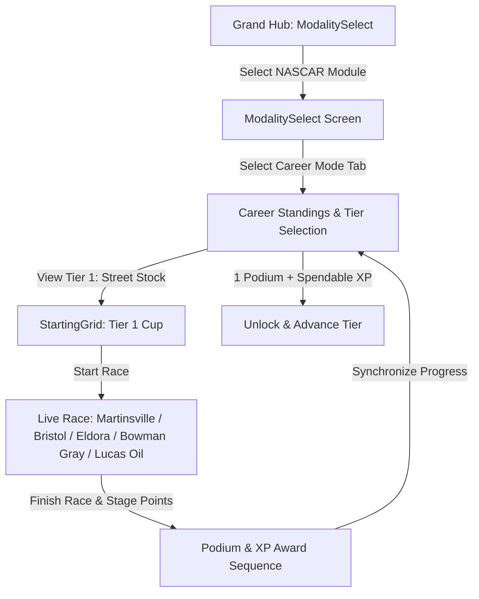

# Feature Spec: NASCAR & Trans-Am TA1 Career Mode 🏁

A comprehensive 5-tier American stock car and silhouette GT career mode in **TdRace**. Spanning local short-track bullrings, clay dirt ovals, intermediate D-ovals, road courses, downtown street tracks, and high-banked superspeedways, this progression teaches players the core disciplines of American closed-cockpit motorsport: inertia control in heavy rear-wheel-drive machines, lateral slip management on high banking, multi-car aerodynamic pack drafting, and raw unassisted 850 BHP spaceframe road racing.

---

## 🗺️ User Flow & Interface Design

### 1. Interface Navigation & Screen Flow
The NASCAR career integrates directly into `GameState::ModalitySelect` and `GameState::ChampionshipStandings`:



### 2. Visual & Audio Theming
- **Palette**: Golden Yellow primary accent (`Color::new(1.0, 0.82, 0.08, 1.0)`), Daytona Blue secondary accent (`Color::new(0.06, 0.42, 0.92, 1.0)`).
- **HUD Stage Indicators**: Real-time stage lap indicators rendering `STAGE 1`, `STAGE 2`, and `FINAL STAGE` with green banner animations on stage completions.
- **Drafting Tunnel Effect**: Blue wind-slipstream streaks rendered behind lead vehicles when trailing inside the $15.0\,\text{m}$ drafting envelope.
- **Sound Profile**: Deep pushrod V8 rumble (`EngineAudioProfile::nascar_v8`) transitioning to high-revving side boom-tube acoustics for Trans-Am TA1.

---

## ⚙️ Backend Models & API Endpoints

### 1. SQLite Data Schema & Career Progress
Career state is persisted in SQLite via `ModuleCareerProgress` in [`crates/tdrace-app/src/profile/mod.rs`](../crates/tdrace-app/src/profile/mod.rs):

```rust
pub struct ModuleCareerProgress {
    pub profile_id: i64,
    pub module_id: String, // "nascar"
    pub xp: u64,           // Spendable XP balance
    pub lifetime_xp: u64,  // Total cumulative XP earned
    pub level: u32,        // 1..=5 (Active Career Tier)
    pub unlocked_cars: Vec<String>,
    pub unlocked_tracks: Vec<String>,
    pub visited_tracks: Vec<String>,
    pub completed_events: Vec<String>,
    pub trophies_gold: u32,
    pub trophies_silver: u32,
    pub trophies_bronze: u32,
    pub updated_at: String,
}
```

### 2. Declarative Championship Specification (TOML)
In compliance with [Spec 017](017_declarative_championship_format_and_editor.md), NASCAR career championships are authorable, discoverable, and runnable via declarative TOML documents stored in `series/nascar/`:

```toml
[championship]
id = "nascar_cup_tier5"
name = "NASCAR Cup Series Championship (Tier 5)"
description = "Premier high-banked superspeedway and tri-oval stock car racing championship."
module_id = "nascar"
tier = 5
laps_per_round = 4
bot_count = 11
ai_difficulty = "pro"
icon = "flag_checkered"

[scoring]
system = "nascar"
fastest_lap_bonus = false
stage_win_bonus = true
clean_race_bonus = false

[[rounds]]
order = 1
track_id = "daytona_superspeedway"
name = "Daytona International Speedway"
laps = 4

[[rounds]]
order = 2
track_id = "talladega_superspeedway"
name = "Talladega Superspeedway"
laps = 4

[[rounds]]
order = 3
track_id = "phoenix_raceway"
name = "Phoenix Raceway"
laps = 4
```

### 3. Campaign Launch Endpoint & Session Struct
Implemented in [`crates/tdrace-app/src/game/mod.rs`](../crates/tdrace-app/src/game/mod.rs):
```rust
impl GameApp {
    /// Launches a NASCAR Career Championship Cup for the given tier (1..=5).
    pub fn start_nascar_career_tier(&mut self, tier: u32) {
        let (cup_name, track_ids) = match tier {
            1 => (
                "NASCAR Weekly Short Track Series (Tier 1)",
                vec![
                    "martinsville_speedway".to_string(),
                    "bristol_motor_speedway".to_string(),
                    "eldora_speedway".to_string(),
                    "bowman_gray_stadium".to_string(),
                    "lucas_oil_irp".to_string(),
                ],
            ),
            2 => (
                "NASCAR Intermediate Oval Challenge (Tier 2)",
                vec![
                    "charlotte_motor_speedway".to_string(),
                    "darlington_raceway".to_string(),
                    "north_wilkesboro_speedway".to_string(),
                ],
            ),
            3 => (
                "NASCAR National Road & Oval Tour (Tier 3)",
                vec![
                    "iowa_speedway".to_string(),
                    "watkins_glen_nascar".to_string(),
                    "road_america".to_string(),
                ],
            ),
            4 => (
                "NASCAR Premier Speedway Trophy (Tier 4)",
                vec![
                    "indianapolis_motor_speedway".to_string(),
                    "pocono_raceway".to_string(),
                    "chicago_street_course".to_string(),
                ],
            ),
            _ => (
                "NASCAR Cup Series Championship (Tier 5)",
                vec![
                    "daytona_superspeedway".to_string(),
                    "talladega_superspeedway".to_string(),
                    "phoenix_raceway".to_string(),
                ],
            ),
        };

        let champ = ChampionshipSession::new(
            cup_name,
            PointSystem::NascarCup { stage_win_bonus: true },
            track_ids,
            4,
            &[
                ("player", "Player", "Apex Stock Car"),
                ("dale_vance", "Dale 'The Intimidator' Vance", "Richard Childress Racing"),
                ("chase_gordon", "Chase 'Rainbow' Gordon", "Hendrick Motorsports"),
                ("richard_pettyfield", "Richard 'The King' Pettyfield", "Petty Enterprises"),
                ("rowdy_busch", "Rowdy 'Wild Thing' Busch", "Joe Gibbs Racing"),
                ("jimmie_johnson", "Jimmie 'Seven-Time' Johnson", "Hendrick Motorsports"),
                ("tony_stewart", "Tony 'Smoke' Stewart", "Stewart-Haas Racing"),
                ("bobby_allison", "Bobby 'Alabama' Allison", "Alabama Gang"),
                ("bubba_wallace", "Bubba 'The Rocket' Wallace", "23XI Racing"),
                ("joey_logano", "Joey 'Sliced Bread' Logano", "Team Penske"),
                ("bill_elliott", "Bill 'Awesome Bill' Elliott", "Melling Racing"),
                ("cale_yarborough", "Cale 'The Iron Man' Yarborough", "Junior Johnson Racing"),
            ],
        );
        self.championship_session = Some(champ.with_tier(tier));
        // Configures vehicle model matching current module and tier from catalog...
    }
}
```

---

## 🛡️ Security & Role-Based Access Controls (RBAC)

### 1. Career License Gating & Tier Advancement
- **Tier 1 (Street Stock V8)**: Unlocked by default for all profiles (`xp >= 0`).
- **Two-Condition Advancement Rule**: Advancing to the next tier requires:
  1. Finishing at least one championship on the podium (top 3: Gold, Silver, or Bronze trophy).
  2. Having enough spendable XP to purchase an entry vehicle in the target tier ($\text{Cost} = 1,000\,\text{XP} \times (\text{tier} + 1)$).
- **Vehicle Purchasing**: Vehicles are purchased using spendable XP balance ($1,000\,\text{XP} \times \text{tier}$).
- **First-Time Exploration Bonus**: First time visiting any circuit awards $250\,\text{XP} \times \text{tier}$ (rounded to nearest 10).
- **Dev Mode Bypass**: When `dev_mode: true` is configured, all tiers, tracks, and vehicles are unlocked for testing without modifying saved profile progress.

---

## 1. 5-Tier Vehicle Hierarchy & Prototypical Engineering Specs

Each tier features 3 iconic American machines calibrated with authentic weight distributions, engine force outputs, aerodynamic drag profiles, and tire compliance.

```
                     STOCK CAR & TRUCK SILHOUETTES (LATERAL 2D)
                     
    Tier 1 Street Stock (Monte Carlo / Dart / Mustang):
       _________/‾‾‾‾‾\_________
     =[   Heavy Notchback Trunk ]=
       (O)                   (O)

    Tier 4 Craftsman Truck (Silverado / F-150 / Tundra):
       __________/‾‾‾‾|________
     =[ High Cab   Flat Bed    ]=
       (O)                   (O)

    Tier 5 Trans-Am TA1 (Corvette C7 / TA1 Mustang / Challenger):
         _____/‾‾‾‾\____       [High GT Wing]
     ===[ Low Slung Hood \_]==_  |‾|
       (O)                  (O)  |_|
```

### 1.1 Tier 1: Street Stock V8 (Grassroots Stock Racing)
* **Design Philosophy:** Entry-level grassroots stock car built on production steel chassis with roll cages. Heavy mass and modest mechanical grip teach momentum conservation, weight transfer, and controlled bumper contact.
* **Core Physics:**
  * Power: $450\,\text{BHP}$ ($335\,\text{kW}$) naturally aspirated pushrod V8 ($5.7\,\text{L}$).
  * Curb Weight ($m$): $1,420.0\,\text{kg}$ | Yaw Moment of Inertia ($I_z$): $2,100.0\,\text{kg}\cdot\text{m}^2$.
  * Layout: Front-engine, Rear-Wheel Drive (`drive_bias: 0.0`), spool rear axle (locked differential).
  * Top Speed ($v_{\text{max}}$): $55.0\,\text{m/s}$ ($\approx 198\,\text{km/h}$).
  * Steering Lock: $0.65\,\text{rad}$ ($37.2^\circ$) | Steering Rack Speed: $6.0\,\text{rad/s}$.
  * Aerodynamics: $C_d \cdot A = 0.92$, Downforce $C_L \cdot A = 0.20$ (Negligible aero grip).
  * Tire Setup: Bias-ply grooved slick ($B = 6.8$, $C = 1.30$, $D = 0.98$, $E = -0.22$, $\mu_{\text{slide}} = 0.86$).
* **Official Real-World Models:**
  1. **Chevrolet Monte Carlo Street Stock** (`nascar_monte_carlo_ss`): Classic 1980s G-body notchback silhouette, heavy rear pendulum momentum, forgiving recovery under power oversteer.
  2. **Ford Mustang Street Stock** (`nascar_mustang_street_stock`): Fox-body derived stock car, slightly shorter wheelbase ($2.56\,\text{m}$), quicker yaw response into corner entry.
  3. **Dodge Dart Street Stock** (`nascar_dodge_dart_street_stock`): High low-end torque Chrysler 360 V8, planted straight-line drive, requires earlier braking into tight bullring turns.

### 1.2 Tier 2: Late Model / Super Late Model (Short-Track Specialist)
* **Design Philosophy:** Purpose-built lightweight tubular perimeter spaceframe. Fiberglass body panels, offset chassis setup (left-side weight bias for ovals), and wide sticky slicks deliver high lateral cornering G-forces.
* **Core Physics:**
  * Power: $500$–$550\,\text{BHP}$ ($370$–$410\,\text{kW}$) 358ci V8 engine.
  * Curb Weight ($m$): $1,220.0\,\text{kg}$–$1,240.0\,\text{kg}$ | Yaw Moment of Inertia ($I_z$): $1,650.0\,\text{kg}\cdot\text{m}^2$.
  * Weight Distribution: $48\%$ Front / $52\%$ Rear (Oval offset: $56\%$ Left bias).
  * Top Speed ($v_{\text{max}}$): $270$–$276\,\text{km/h}$.
  * Steering Lock: $0.60\,\text{rad}$ ($34.4^\circ$) | Steering Rack Speed: $7.2\,\text{rad/s}$.
  * Aerodynamics: Asymmetrical rear spoiler blade ($C_d \cdot A = 0.51$, $C_L \cdot A = 0.66$).
* **Official Real-World Models:**
  1. **Super Late Model Camaro** (`nascar_super_late_model`): Tubular perimeter spaceframe engineered for immense mid-corner speed and inside front tire lift on banked asphalt ovals.
  2. **Super Late Model Mustang** (`nascar_mustang_super_late_model`): Perimeter chassis with Mustang composite front clip. Agile mid-corner roll rate and sharp turn-in on asphalt ovals.
  3. **Late Model Stock Car LMSC** (`nascar_late_model_stock_car`): CARS Tour staple spec with two-barrel carbureted crate V8 demanding tire preservation across long runs.

### 1.3 Tier 3: ARCA Menards Series (Heavy High-Horsepower Stock)
* **Design Philosophy:** High-power steel chassis mirroring NASCAR Gen-6 platform. Acts as the critical pedagogical bridge from short-tracks to high-speed superspeedway pack drafting and technical road racing.
* **Core Physics:**
  * Power: $650\,\text{BHP}$ ($485\,\text{kW}$) Ilmor 396 cubic-inch ($6.5\,\text{L}$) V8.
  * Curb Weight ($m$): $1,450.0\,\text{kg}$ | Yaw Moment of Inertia ($I_z$): $2,250.0\,\text{kg}\cdot\text{m}^2$.
  * Top Speed ($v_{\text{max}}$): $305\,\text{km/h}$ solo; $318\,\text{km/h}$ in draft.
  * Slipstream Multiplier: $1.35\times$ drafting speed bonus inside $15.0\,\text{m}$ wake corridor.
  * Steering Lock: $0.52\,\text{rad}$ ($29.8^\circ$) | Steering Rack Speed: $6.8\,\text{rad/s}$.
  * Aerodynamics: $C_d \cdot A = 0.48$, $C_L \cdot A = 0.75$.
* **Official Real-World Models:**
  1. **Chevrolet SS ARCA Spec** (`nascar_arca_chevy_ss`): Proven Gen-6 steel body, stable aerodynamic balance in multi-car draft lines.
  2. **Toyota Camry ARCA Spec** (`nascar_toyota_camry_arca`): TRD composite racer with high aerodynamic efficiency and straight-line draft pulling power.
  3. **Ford Fusion ARCA Spec** (`nascar_ford_fusion_arca`): Roush Yates pedigree with stable rear downforce through banked oval transitions.

### 1.4 Tier 4: NASCAR Craftsman Truck Series (Aero Brick & Bumping)
* **Design Philosophy:** Full-sized silhouette pickup trucks built over rigid spaceframe chassis. Flat frontal area ("brick aerodynamics") generates enormous trailing turbulence and makes bump-drafting and pack cooperation mandatory for victory.
* **Core Physics:**
  * Power: $700\,\text{BHP}$ ($522\,\text{kW}$) pushrod V8 ($5.86\,\text{L}$).
  * Curb Weight ($m$): $1,500.0\,\text{kg}$ | Yaw Moment of Inertia ($I_z$): $2,420.0\,\text{kg}\cdot\text{m}^2$.
  * Top Speed ($v_{\text{max}}$): $310\,\text{km/h}$ drafting.
  * Wake Drag Envelope: Huge $25\,\text{m}$ turbulent wake; trailing vehicles gain $+18\%$ acceleration while suffering $-15\%$ front downforce.
  * Aerodynamics: High frontal drag ($C_d \cdot A = 0.54$), vertical bed spoiler ($C_L \cdot A = 0.82$).
* **Official Real-World Models:**
  1. **Chevrolet Silverado RST Truck** (`nascar_silverado_truck`): Broad-shoulder front fascia, resilient front bumper reinforcement for aggressive bump drafting.
  2. **Ford F-150 Craftsman Truck** (`nascar_f150_truck`): Aerodynamically tuned F-150 silhouette excelling in pack drafting and high-speed bump drafting down superspeedway straights.
  3. **Toyota Tundra TRD Pro Truck** (`nascar_tundra_truck`): Low-drag front fascia and aggressive spoiler pitch for drafting parity.

### 1.5 Tier 5: Trans-Am TA1 (Pinnacle American Silhouette GT)
* **Design Philosophy:** The ultimate evolution of American pushrod racing: purist spaceframe chassis, carbon-composite bodywork, $850\,\text{BHP}$ naturally aspirated monster engines, huge carbon rear wings, wide tires, and zero electronic assists.
* **Core Physics:**
  * Power: $850\,\text{BHP}$ ($634\,\text{kW}$) overhead-valve V8 ($8,800\,\text{RPM}$).
  * Curb Weight ($m$): $1,260.0\,\text{kg}$–$1,270.0\,\text{kg}$ | Yaw Moment of Inertia ($I_z$): $1,580.0\,\text{kg}\cdot\text{m}^2$.
  * Power-to-Weight Ratio: $680\,\text{BHP/tonne}$ ($0$–$100\,\text{km/h}$ in $2.8\,\text{s}$).
  * Top Speed ($v_{\text{max}}$): $320$–$322\,\text{km/h}$.
  * Aerodynamics: Large carbon front splitter, floor tunnel diffuser, high-mount rear GT wing ($C_L \cdot A = 1.20$, $C_d \cdot A = 0.50$).
  * Assists: 100% Raw (`DriverAssistsConfig::raw()`).
* **Official Real-World Models:**
  1. **Chevrolet Corvette C7 TA1** (`nascar_corvette_ta1`): Low center of gravity, mid-front engine transaxle balance, massive lateral cornering speed.
  2. **Ford Mustang TA1** (`nascar_mustang_ta1`): High straight-line punching power, side-exhaust boom-tube acoustics, rewards trail-braking deep into technical chicanes.
  3. **Dodge Challenger TA1** (`nascar_challenger_ta1`): Wide-track stance, imposing visual presence, supreme high-speed stability through superspeedway high banks.

---

## 2. 17-Venue Multi-Tier Championship Calendar

```
                      NASCAR & TRANS-AM 17-VENUE CALENDAR
                      
[Tier 1: Short Ovals & Dirt - 5 Starter Circuits]
 ├─ Martinsville Speedway (martinsville_speedway - 0.526 mi Paved Paperclip 12°)
 ├─ Bristol Motor Speedway (bristol_motor_speedway - 0.533 mi Concrete High-Bank 28°)
 ├─ Eldora Speedway (eldora_speedway - 0.500 mi Clay Dirt Oval 24°)
 ├─ Bowman Gray Stadium (bowman_gray_stadium - 0.250 mi Historic Bullring Flat)
 └─ Lucas Oil IRP (lucas_oil_irp - 0.686 mi Oval 12°)
 
[Tier 2: Intermediate & High-Speed Short Ovals - 3 Circuits]
 ├─ Charlotte Motor Speedway (charlotte_motor_speedway - 1.500 mi Quad-Oval 24°)
 ├─ Darlington Raceway (darlington_raceway - 1.366 mi Asymmetric "Lady in Black" 25°)
 └─ North Wilkesboro Speedway (north_wilkesboro_speedway - 0.625 mi Historic Uphill Oval 14°)
 
[Tier 3: Historic Road Courses & Fast D-Ovals - 3 Circuits]
 ├─ Iowa Speedway (iowa_speedway - 0.875 mi D-Oval Progressive Banking 12°-14°)
 ├─ Watkins Glen International (watkins_glen_nascar - 5.4 km Road Course)
 └─ Road America (road_america - 4.048 mi Natural Terrain Road Course)
 
[Tier 4: National Speedways & Concrete Canyons - 3 Circuits]
 ├─ Indianapolis Motor Speedway (indianapolis_motor_speedway - 2.500 mi Brickyard 9°)
 ├─ Pocono Raceway (pocono_raceway - 2.500 mi "Tricky Triangle")
 └─ Chicago Street Course (chicago_street_course - 2.200 mi Downtown Grant Park 90° Turns)
 
[Tier 5: Pinnacle Superspeedways & Finale Tri-Oval - 3 Circuits]
 ├─ Daytona International Speedway (daytona_superspeedway - 2.500 mi Tri-Oval 31° High Banks)
 ├─ Talladega Superspeedway (talladega_superspeedway - 2.660 mi Monster Superspeedway 33°)
 └─ Phoenix Raceway (phoenix_raceway - 1.000 mi Tri-Oval Championship Finale 8°-9°)
```

---

## 3. Career Progression & Scoring Rules

### 3.1 Career Progression & Unlock Requirements

| Career Level | Category | Tier Cup Name | Entry Car Cost | Car Unlocks | Circuit Unlocks (17 Total) |
| :--- | :--- | :--- | :--- | :--- | :--- |
| **Level 1** | Street Stock V8 | **NASCAR Weekly Short Track Series (Tier 1)** | $1,000\,\text{XP}$ *(Starter free)* | `nascar_monte_carlo_ss`, `nascar_mustang_street_stock`, `nascar_dodge_dart_street_stock` | `martinsville_speedway`, `bristol_motor_speedway`, `eldora_speedway`, `bowman_gray_stadium`, `lucas_oil_irp` |
| **Level 2** | Late Model Stock | **NASCAR Intermediate Oval Challenge (Tier 2)** | $2,000\,\text{XP}$ | `nascar_super_late_model`, `nascar_mustang_super_late_model`, `nascar_late_model_stock_car` | `charlotte_motor_speedway`, `darlington_raceway`, `north_wilkesboro_speedway` |
| **Level 3** | ARCA Menards | **NASCAR National Road & Oval Tour (Tier 3)** | $3,000\,\text{XP}$ | `nascar_arca_chevy_ss`, `nascar_toyota_camry_arca`, `nascar_ford_fusion_arca` | `iowa_speedway`, `watkins_glen_nascar`, `road_america` |
| **Level 4** | Craftsman Truck | **NASCAR Premier Speedway Trophy (Tier 4)** | $4,000\,\text{XP}$ | `nascar_silverado_truck`, `nascar_f150_truck`, `nascar_tundra_truck` | `indianapolis_motor_speedway`, `pocono_raceway`, `chicago_street_course` |
| **Level 5** | NASCAR Cup & TA1 | **NASCAR Cup Series Championship (Tier 5)** | $5,000\,\text{XP}$ | `nascar_corvette_ta1`, `nascar_mustang_ta1`, `nascar_challenger_ta1` | `daytona_superspeedway`, `talladega_superspeedway`, `phoenix_raceway` |

### 3.2 NASCAR Stage Racing & Scoring Rules
In accordance with NASCAR regulations, every career race applies **NASCAR Cup scoring (`PointSystem::NascarCup { stage_win_bonus: true }`)**:
- 1st: $40\,\text{pts}$ ($+350\,\text{XP}$, Gold Trophy)
- 2nd: $35\,\text{pts}$ ($+220\,\text{XP}$, Silver Trophy)
- 3rd: $34\,\text{pts}$ ($+180\,\text{XP}$, Bronze Trophy)
- 4th–35th: Decrementing from $33\,\text{pts}$ down to $1\,\text{pt}$
- **Stage Win Bonus**: $+10\,\text{pts}$ awarded for green-flag stage leaders.

---

## 4. AI Rival Roster & Behavioral Tuning

| Driver ID | Name & Nickname | Car & Team | Aggression | Drafting Discipline | Signature Move |
| :--- | :--- | :--- | :--- | :--- | :--- |
| `dale_vance` | **Dale "The Intimidator" Vance** | Richard Childress Racing | $0.98$ | $0.95$ | Aggressive bumper rattle, forces inside wedge |
| `chase_gordon` | **Chase "Rainbow" Gordon** | Hendrick Motorsports | $0.85$ | $0.92$ | Master of high-line momentum and late road braking |
| `richard_pettyfield` | **Richard "The King" Pettyfield** | Petty Enterprises | $0.78$ | $0.98$ | Smooth superspeedway line, slingshot timing |
| `rowdy_busch` | **Rowdy "Wild Thing" Busch** | Joe Gibbs Racing | $0.96$ | $0.88$ | Ruthless three-wide passes, high risk over curbs |
| `tony_stewart` | **Tony "Smoke" Stewart** | Stewart-Haas Racing | $0.92$ | $0.90$ | Clay slide master at Eldora and road course specialist |

---

## 🧪 Verification & Acceptance Criteria

### Automated Tests
- Command to run workspace unit tests: `cargo test --package tdrace-app --test profile_tests`
- Command to run tournament and series tests: `cargo test --package tdrace-app --test championship_tests`

### Manual Acceptance Criteria (Pseudo-Gherkin)

- **Scenario: Level 1 Player enters Weekly Short Track Series**
  - [x] **Given** the player has a profile with the "nascar" module selected
  - [x] **When** the player launches Tier 1 Career Mode via `start_nascar_career_tier(1)`
  - [x] **Then** Tier 1 "NASCAR Weekly Short Track Series (Tier 1)" is active
  - [x] **And** the available cars include "nascar_monte_carlo_ss", "nascar_mustang_street_stock", and "nascar_dodge_dart_street_stock"
  - [x] **And** the calendar consists of 5 circuits: "martinsville_speedway", "bristol_motor_speedway", "eldora_speedway", "bowman_gray_stadium", and "lucas_oil_irp"
  - [x] **And** the active session has `tier == 1` and uses `PointSystem::NascarCup`

- **Scenario: Drafting slipstream provides acceleration boost on superspeedways**
  - [x] **Given** the player is racing a Tier 4 Truck or Tier 5 TA1 at "daytona_superspeedway"
  - [x] **When** the player trails within 15 meters behind an AI vehicle
  - [x] **Then** the player vehicle receives a slipstream wake multiplier
  - [x] **And** trailing speed increases beyond the solo top-speed limit

- **Scenario: Podium finish and spendable XP unlocks Tier 2**
  - [x] **Given** the player completes Tier 1 with at least 1 podium trophy and 2,000 spendable XP
  - [x] **When** `advance_tier()` is invoked on `ModuleCareerProgress`
  - [x] **Then** player career level advances to 2
  - [x] **And** "charlotte_motor_speedway", "darlington_raceway", and "north_wilkesboro_speedway" are unlocked in the track registry
  - [x] **And** Late Model vehicles ("nascar_super_late_model", etc.) become selectable

---

## 🔗 Traceability & Codebase Mapping

### Created/Modified Files
- `[IMPLEMENTED]` `crates/tdrace-app/src/module/nascar.rs` -> NASCAR module vehicles, themes, and tracks.
- `[IMPLEMENTED]` `crates/tdrace-app/src/catalog/mod.rs` -> Authentic real-world car models for Tiers 1–5.
- `[IMPLEMENTED]` `crates/tdrace-app/src/profile/mod.rs` -> Governs `ModuleCareerProgress`, 17-circuit unlock synchronization, and two-condition advancement.
- `[IMPLEMENTED]` `crates/tdrace-app/src/game/mod.rs` -> Launches `start_nascar_career_tier` campaign cups with `.with_tier(tier)`.
- `[IMPLEMENTED]` `series/nascar/nascar_cup_tier5.toml` -> Declarative TOML series preset for Tier 5.
- `[IMPLEMENTED]` `crates/tdrace-app/tests/profile_tests.rs` -> Automated verification of career launchers and progression.

### Beads Epic Mapping
- Governed by parent Epic `tdrace-j3io` (*Fulfill Spec 001: NASCAR & Trans-Am TA1 Career Mode*).
