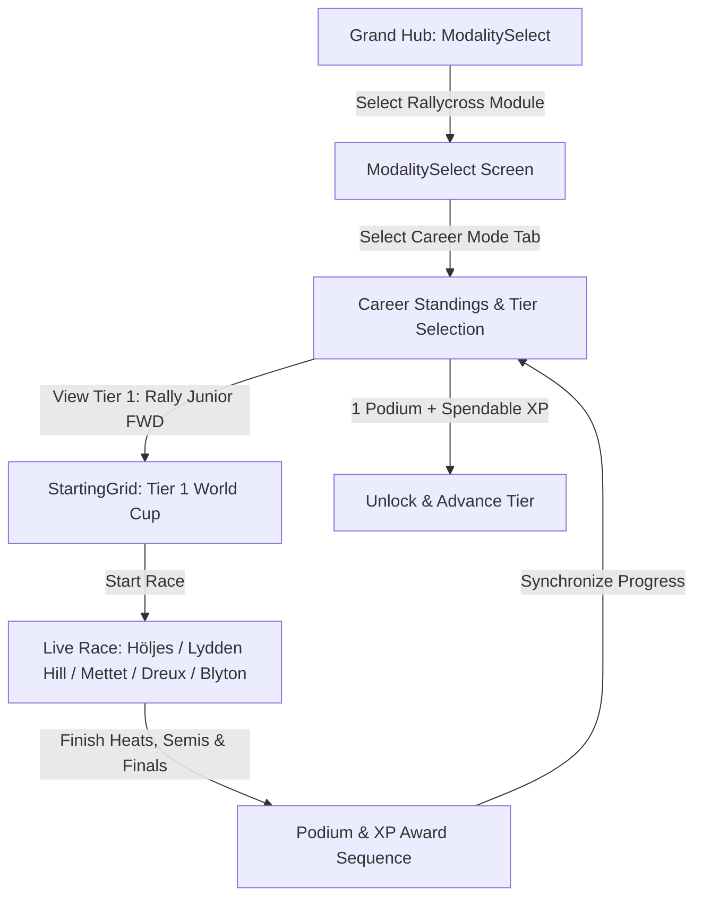

# Feature Spec: Rallycross & All-Terrain World Cup Career Mode 🏆

The **Rallycross & All-Terrain World Cup Career Mode** models the progression from grassroots front-wheel-drive rally hatchbacks to ferocious 600+ BHP mixed-surface monsters, desert raid beasts, and stadium jumping trucks in **TdRace**. Combining tarmac grip, loose gravel drifting, mud spray, and massive jump launch ramps, this career model develops lift-off oversteer, anti-lag boost management, tactical Joker Lap execution, and long-travel suspension dynamics over extreme terrains.

---

## 🗺️ User Flow & Interface Design

### 1. Interface Navigation & Screen Flow
The Rallycross career integrates into `GameState::ModalitySelect` and `GameState::ChampionshipStandings`:



### 2. Visual & Audio Theming
- **Palette**: Dirt Rally Orange primary accent (`Color::new(1.0, 0.55, 0.15, 1.0)`), Desert Sand Yellow secondary accent (`Color::new(0.95, 0.85, 0.20, 1.0)`).
- **HUD Joker Indicator**: Renders `JOKER: REQUIRED` in bright red until taken, switching to `JOKER: COMPLETED` in high-visibility neon green.
- **Surface Particles**: Generates gravel rooster tails, muddy wheel spray, and anti-lag exhaust backfire sparks.
- **Sound Profile**: Aggressive turbocharged anti-lag pops and sequential dog-ring transmission gear whine.

---

## ⚙️ Backend Models & API Endpoints

### 1. SQLite Data Schema & Career Progress
Career state is persisted in SQLite via `ModuleCareerProgress` in [`crates/tdrace-app/src/profile/mod.rs`](../crates/tdrace-app/src/profile/mod.rs):

```rust
pub struct ModuleCareerProgress {
    pub profile_id: i64,
    pub module_id: String, // "rally"
    pub xp: u64,           // Spendable XP balance
    pub lifetime_xp: u64,  // Total cumulative XP earned
    pub level: u32,        // 1..=5 (Active Career Tier)
    pub unlocked_cars: Vec<String>,
    pub unlocked_tracks: Vec<String>,
    pub visited_tracks: Vec<String>,
    pub completed_events: Vec<String>,
    pub trophies_gold: u32,
    pub trophies_silver: u32,
    pub trophies_bronze: u32,
    pub updated_at: String,
}
```

### 2. Declarative Championship Specification (TOML)
In compliance with [Spec 017](017_declarative_championship_format_and_editor.md), Rallycross career championships are authorable, discoverable, and runnable via declarative TOML documents stored in `series/rally/`:

```toml
[championship]
id = "rally_world_cup"
name = "World RX Supercar Challenge (Tier 2)"
description = "High-octane mixed-surface sprint racing featuring asphalt, dirt, and joker lap tactics."
module_id = "rally"
tier = 2
laps_per_round = 4
bot_count = 7
ai_difficulty = "standard"
icon = "dirt"

[scoring]
system = "fia"
fastest_lap_bonus = true
stage_win_bonus = false
clean_race_bonus = false

[[rounds]]
order = 1
track_id = "hell_rx"
name = "Lånkebanen Hell RX"
laps = 4

[[rounds]]
order = 2
track_id = "loheac_rx"
name = "Circuit de Lohéac"
laps = 4

[[rounds]]
order = 3
track_id = "silverstone_rx"
name = "Silverstone RX"
laps = 4
```

### 3. Campaign Launch Endpoint & Session Struct
Implemented in [`crates/tdrace-app/src/game/mod.rs`](../crates/tdrace-app/src/game/mod.rs):
```rust
impl GameApp {
    /// Launches a Rallycross Career Championship Cup for the given tier (1..=5).
    pub fn start_rally_career_tier(&mut self, tier: u32) {
        let (cup_name, track_ids) = match tier {
            1 => (
                "Rallycross Grassroots Cup (Tier 1)",
                vec![
                    "holjes_rx".to_string(),
                    "lydden_hill".to_string(),
                    "mettet_rx".to_string(),
                    "dreux_rx".to_string(),
                    "blyton_rx".to_string(),
                ],
            ),
            2 => (
                "World Rallycross Challenge (Tier 2)",
                vec![
                    "hell_rx".to_string(),
                    "loheac_rx".to_string(),
                    "silverstone_rx".to_string(),
                ],
            ),
            3 => (
                "Group B Masters Series (Tier 3)",
                vec![
                    "estering_rx".to_string(),
                    "montalegre_rx".to_string(),
                    "riga_rx".to_string(),
                ],
            ),
            4 => (
                "Dakar Rally Raid Trophy (Tier 4)",
                vec![
                    "nyirad_rx".to_string(),
                    "kouvola_rx".to_string(),
                    "killarney_rx".to_string(),
                ],
            ),
            _ => (
                "Stadium Super Trucks World Series (Tier 5)",
                vec![
                    "catalunya_rx".to_string(),
                    "yas_marina_rx".to_string(),
                    "essay_rx".to_string(),
                ],
            ),
        };

        let champ = ChampionshipSession::new(
            cup_name,
            PointSystem::FiaStandard { fastest_lap_bonus: true },
            track_ids,
            4,
            &[
                ("player", "Player", "Apex Rally Team"),
                ("johan_vance", "Johan Vance", "KMS Motorsport"),
                ("mattias_storm", "Mattias Storm", "EKS RX"),
                ("timmy_hansenfield", "Timmy Hansenfield", "Hansen Motorsport"),
                ("kevin_hansenfield", "Kevin Hansenfield", "Hansen Motorsport"),
                ("niclas_gron", "Niclas Gron", "GRX Taneco"),
                ("anton_mark", "Anton Mark", "GCK Motorsport"),
                ("timo_scheider", "Timo Scheider", "All-Inkl Racing"),
            ],
        );
        self.championship_session = Some(champ.with_tier(tier));
        // Configures vehicle model matching current module and tier from catalog...
    }
}
```

---

## 🛡️ Security & Role-Based Access Controls (RBAC)

### 1. Career License Gating & Tier Advancement
- **Tier 1 (Rally Junior FWD)**: Unlocked by default for all profiles (`xp >= 0`).
- **Two-Condition Advancement Rule**: Advancing to the next tier requires:
  1. Finishing at least one championship on the podium (top 3: Gold, Silver, or Bronze trophy).
  2. Having enough spendable XP to purchase an entry vehicle in the target tier ($\text{Cost} = 1,000\,\text{XP} \times (\text{tier} + 1)$).
- **Vehicle Purchasing**: Vehicles are purchased using spendable XP balance ($1,000\,\text{XP} \times \text{tier}$).
- **First-Time Exploration Bonus**: First time visiting any circuit awards $250\,\text{XP} \times \text{tier}$ (rounded to nearest 10).
- **Dev Mode Bypass**: When `dev_mode: true` is configured, all tiers, tracks, and vehicles are unlocked for testing without modifying saved profile progress.

---

## 1. 5-Tier Vehicle Hierarchy & Prototypical Engineering Specs

```
                     RALLYCROSS & ALL-TERRAIN SILHOUETTES (LATERAL 2D)
                     
    Tier 1 Rally Junior FWD (Peugeot 208 / Fiesta / Clio):
         ___/‾‾‾‾\___
      ==[ FWD Hatch  \_]===
        (O)           (O)

    Tier 4 Rally Raid T1+ (Hilux T1+ / RS Q e-tron / Hunter):
           ______/‾‾‾‾\_______   [Massive 37" Tires]
       ===[ Raised Skid-plate ]===
         ( O )             ( O )

    Tier 5 Stadium Super Truck (SST V8 / Robby Gordon Spec):
           _____/‾‾‾‾|______
       ===[ High CG Roll Bar ]=== [Long-Travel Dual Shocks]
         ( O )             ( O )
```

### 1.1 Tier 1: Rally Junior FWD (Grassroots Hot Hatch)
* **Design Philosophy:** Production-based lightweight front-wheel-drive hot hatches. With modest horsepower and no rear drive, drivers must master braking into corners to provoke rear-end rotation (lift-off oversteer) before pinning the throttle.
* **Core Physics:**
  * Power: $210\,\text{BHP}$ ($157\,\text{kW}$) $1.2\,\text{L}$ Turbo 3-cylinder / $1.6\,\text{L}$ 16V.
  * Curb Weight ($m$): $1,080.0\,\text{kg}$ | Yaw Moment of Inertia ($I_z$): $1,250.0\,\text{kg}\cdot\text{m}^2$.
  * Drive Layout: Front-Wheel Drive (`drive_bias: 1.0`), mechanical plated limited-slip differential.
  * Top Speed ($v_{\text{max}}$): $52.0\,\text{m/s}$ ($\approx 187\,\text{km/h}$).
  * Steering Rack Speed: $8.2\,\text{rad/s}$ (Rapid counter-steer response).
  * Tires: Mixed-surface rally gravel/tarmac tires ($B = 7.2$, $C = 1.35$, $D = 1.02$, $E = -0.16$).
* **Official Real-World Models:**
  1. **Peugeot 208 Rally4** (`rally_peugeot_208_rally4`): Crisp front-end turn-in bite, high agility through tight gravel hairpins.
  2. **Ford Fiesta Rally4** (`rally_fiesta_rally4`): Punchy turbo low-end boost, progressive rear-end breakaway on asphalt.
  3. **Renault Clio Rally4** (`rally_clio_rally4`): Ultra-stable chassis over crests, forgiving curb compliance.

### 1.2 Tier 2: WRC / RX Turbo Supercar (Modern Rallycross Benchmark)
* **Design Philosophy:** Custom tubular/monocoque all-wheel-drive supercars. Equipped with aggressive anti-lag systems (ALS), locked differentials, and sequential 6-speed gearboxes, achieving $0$–$100\,\text{km/h}$ in under $2.3\,\text{seconds}$.
* **Core Physics:**
  * Power: $380\,\text{BHP}$ ($283\,\text{kW}$) $1.6$–$2.0\,\text{L}$ Turbocharged I4 with ALS ($550$–$560\,\text{Nm}$ torque).
  * Curb Weight ($m$): $1,230.0\,\text{kg}$–$1,240.0\,\text{kg}$ | Yaw Moment of Inertia ($I_z$): $1,450.0\,\text{kg}\cdot\text{m}^2$.
  * Drive Layout: All-Wheel Drive (`drive_bias: 0.50` 50/50 split), spool center lock.
  * Top Speed ($v_{\text{max}}$): $220$–$224\,\text{km/h}$.
  * Aerodynamics: High-downforce rally bi-plane rear wing ($C_L \cdot A = 1.10$–$1.15$).
* **Official Real-World Models:**
  1. **Hyundai i20 RX Supercar** (`rally_hyundai_i20_rx`): Short wheelbase, razor-sharp rotation into ninety-degree dirt switches.
  2. **Volkswagen Polo RX Supercar** (`rally_polo_rx`): Exceptional launch traction off the grid; planted stability on abrasive tarmac.
  3. **Audi S1 EKS RX Supercar** (`rally_audi_s1_rx`): Aggressive Quattro torque delivery, high curb-skipping tolerance.

### 1.3 Tier 3: Group B Beast (1980s Homologation Monsters)
* **Design Philosophy:** Mid-engine and front-engine spaceframe homologation specials from the golden era. Explosive boost thresholds, large turbo lag, and massive rooster tails.
* **Core Physics:**
  * Power: $530$–$550\,\text{BHP}$ ($395$–$410\,\text{kW}$) twin-charged/turbocharged monster ($8,500\,\text{RPM}$).
  * Curb Weight ($m$): $890.0\,\text{kg}$–$1,090.0\,\text{kg}$ | Yaw Moment of Inertia ($I_z$): $1,180.0\,\text{kg}\cdot\text{m}^2$.
  * Power-to-Weight Ratio: Up to $618\,\text{BHP/tonne}$ ($0$–$100\,\text{km/h}$ in $2.5\,\text{s}$ on dirt).
  * Assists: 100% Raw (`DriverAssistsConfig::raw()`).
* **Official Real-World Models:**
  1. **Audi Sport Quattro S1 E2** (`rally_audi_sport_quattro_s1`): Iconic 5-cylinder warble, massive front snowplow splitter and tall rear wing.
  2. **Peugeot 205 T16 EVO 2** (`rally_peugeot_205_t16`): Mid-engine balance, explosive mid-range punch, agile Scandinavian flicks.
  3. **Lancia Delta S4** (`rally_lancia_delta_s4`): Supercharged and turbocharged twin-boost layout, ferocious low-and-high RPM response.

### 1.4 Tier 4: All-Terrain Rally Raid T1+ (Cross-Country Dakar Spec)
* **Design Philosophy:** Purpose-built Dakar and Baja endurance prototypes designed to conquer broken terrain, washboard whoops, mud, and sand dunes. Features heavy reinforced spaceframes, 37-inch tires, and $350\,\text{mm}$ of wheel travel.
* **Core Physics:**
  * Power: $450\,\text{BHP}$ ($335\,\text{kW}$) Twin-Turbo V6 or electric dual-MGU drivetrain.
  * Curb Weight ($m$): $2,000.0\,\text{kg}$–$2,100.0\,\text{kg}$ | Yaw Moment of Inertia ($I_z$): $3,100.0\,\text{kg}\cdot\text{m}^2$.
  * Ground Clearance: $0.35\,\text{m}$ | Suspension Travel: $350\,\text{mm}$ bypass dampers.
  * Top Speed ($v_{\text{max}}$): $170$–$175\,\text{km/h}$ governed for desert raid regulations.
* **Official Real-World Models:**
  1. **Toyota GR DKR Hilux T1+** (`rally_toyota_hilux_t1_plus`): Dakar conqueror, massive 37-inch tires and 350mm suspension travel.
  2. **Audi RS Q e-tron Dakar** (`rally_audi_rs_q_etron`): Electric torque vectoring across dual MGU axles, conquering dunes without gear changes.
  3. **Prodrive Hunter T1+** (`rally_prodrive_hunter_t1`): Ian Callum designed long-travel chassis with exceptional high-speed sand stability.

### 1.5 Tier 5: Stadium Super Truck / SST (High-Flying V8 Brawler)
* **Design Philosophy:** 650 BHP V8 tube-chassis trucks competing on courses with oversized metal jumps. High center of gravity causes dramatic body roll, frequent 3-wheel cornering, and spectacular aerial launches.
* **Core Physics:**
  * Power: $650\,\text{BHP}$ ($485\,\text{kW}$) naturally aspirated Chevrolet LS3 V8.
  * Curb Weight ($m$): $1,350.0\,\text{kg}$ | Yaw Moment of Inertia ($I_z$): $1,850.0\,\text{kg}\cdot\text{m}^2$.
  * Center of Gravity Height ($h_{\text{cg}}$): $0.78\,\text{m}$ (Substantial body roll up to $14^\circ$).
  * Drive Layout: Pure Rear-Wheel Drive (`drive_bias: 0.0`) with locked spool rear differential.
  * 3-Wheel Cornering: Inside front tire lifts off the ground under maximum lateral cornering load.
* **Official Real-World Models:**
  1. **Stadium Super Truck V8** (`rally_sst_super_truck`): Spec tube-frame chassis, fiberglass pickup shell, roaring side-exhaust.
  2. **Robby Gordon SST Spec** (`rally_sst_robby_gordon`): Signature orange livery, soft sway-bar compliance for 3-wheel apex cornering.
  3. **Traxxas Edition SST Spec** (`rally_sst_traxxas_edition`): King shock package soaking up violent jump landings.

---

## 2. 17-Venue Multi-Tier Championship Calendar

```
                  RALLYCROSS & ALL-TERRAIN 17-VENUE CALENDAR
                  
[Tier 1: Grassroots Rally Academy - 5 Starter Circuits]
 ├─ Höljes Motorstadion (holjes_rx - 1.210 km 60% Tarmac 40% Gravel "Magic Weekend")
 ├─ Lydden Hill Circuit (lydden_hill - 1.170 km 60% Tarmac 40% Chalk/Gravel Birthplace of RX)
 ├─ Circuit Jules Tacheny (mettet_rx - 1.149 km 61% Tarmac 39% Dirt Technical)
 ├─ Circuit de Dreux (dreux_rx - 1.050 km French Rallycross Classic)
 └─ Blyton Park RX (blyton_rx - 1.100 km Technical UK Airfield Proving Ground)
 
[Tier 2: Mixed Ovals & Rapid RX - 3 Circuits]
 ├─ Hell RX / Lånkebanen (hell_rx - 1.019 km 63% Tarmac 37% Gravel Downhill Plunge)
 ├─ Circuit de Lohéac (loheac_rx - 1.150 km 33% Tarmac 67% Loose Dirt Crowd Favorite)
 └─ Silverstone RX (silverstone_rx - 0.972 km 60% Tarmac 40% Gravel Wing Arena)
 
[Tier 3: Historic Proving Grounds - 3 Circuits]
 ├─ Estering Buxtehude (estering_rx - 0.952 km 60% Tarmac 40% Dirt Hairpin Flick)
 ├─ Pista de Montalegre (montalegre_rx - 1.050 km High Altitude Turbo Test)
 └─ Biķernieki Complex / Riga RX (riga_rx - 1.295 km High-Grip Banked Jump Complex)
 
[Tier 4: Broken Terrain & Red Earth - 3 Circuits]
 ├─ Nyirád Racing Center (nyirad_rx - 1.220 km 48% Tarmac 52% Red Bauxite Clay)
 ├─ Kouvola Tykkimäki RX (kouvola_rx - 1.350 km Fast Nordic Sweepers & Elevation)
 └─ Killarney International RX (killarney_rx - 1.067 km Table Mountain Ocean Switchback)
 
[Tier 5: Monumental Stadiums & All-Terrain Extremes - 3 Circuits]
 ├─ Barcelona-Catalunya RX (catalunya_rx - 1.125 km 67% Tarmac 33% Gravel Stadium Bowl)
 ├─ Yas Marina RX Arena (yas_marina_rx - 1.100 km Floodlit Desert Launch Kickers)
 └─ Circuit des Ducs / Essay RX (essay_rx - 1.115 km Historic French Technical Arena)
```

---

## 3. Career Progression & Scoring Rules

### 3.1 Career Progression & Unlock Requirements

| Career Level | Category | Tier Cup Name | Entry Car Cost | Car Unlocks | Circuit Unlocks (17 Total) |
| :--- | :--- | :--- | :--- | :--- | :--- |
| **Level 1** | Rally Junior FWD | **Rallycross Grassroots Cup (Tier 1)** | $1,000\,\text{XP}$ *(Starter free)* | `rally_peugeot_208_rally4`, `rally_fiesta_rally4`, `rally_clio_rally4` | `holjes_rx`, `lydden_hill`, `mettet_rx`, `dreux_rx`, `blyton_rx` |
| **Level 2** | WRC / RX Supercar | **World Rallycross Challenge (Tier 2)** | $2,000\,\text{XP}$ | `rally_hyundai_i20_rx`, `rally_polo_rx`, `rally_audi_s1_rx` | `hell_rx`, `loheac_rx`, `silverstone_rx` |
| **Level 3** | Group B Beast | **Group B Masters Series (Tier 3)** | $3,000\,\text{XP}$ | `rally_audi_sport_quattro_s1`, `rally_peugeot_205_t16`, `rally_lancia_delta_s4` | `estering_rx`, `montalegre_rx`, `riga_rx` |
| **Level 4** | Rally Raid T1+ | **Dakar Rally Raid Trophy (Tier 4)** | $4,000\,\text{XP}$ | `rally_toyota_hilux_t1_plus`, `rally_audi_rs_q_etron`, `rally_prodrive_hunter_t1` | `nyirad_rx`, `kouvola_rx`, `killarney_rx` |
| **Level 5** | Stadium Super Truck | **Stadium Super Trucks World Series (Tier 5)** | $5,000\,\text{XP}$ | `rally_sst_super_truck`, `rally_sst_robby_gordon`, `rally_sst_traxxas_edition` | `catalunya_rx`, `yas_marina_rx`, `essay_rx` |

### 3.2 Tournament Rules & Scoring System
Each Tier Cup consists of a realistic World RX weekend progression with standard championship points (`PointSystem::Standard` or FIA RX progression):
- 1st: $25\,\text{pts}$ ($+350\,\text{XP}$, Gold Trophy)
- 2nd: $18\,\text{pts}$ ($+220\,\text{XP}$, Silver Trophy)
- 3rd: $15\,\text{pts}$ ($+180\,\text{XP}$, Bronze Trophy)
- 4th: $12\,\text{pts}$ ($+100\,\text{XP}$)
- 5th: $10\,\text{pts}$ ($+80\,\text{XP}$)
- 6th: $8\,\text{pts}$ ($+60\,\text{XP}$)

#### Mandatory Joker Lap Rule
- Every driver **must take the Joker Lap exactly once** during each race heat/final.
- Failing to take the Joker Lap before crossing the finish line incurs an automatic **30-second time penalty**.
- The HUD renders a dynamic Joker status indicator: `JOKER: REQUIRED` (Red) $\rightarrow$ `JOKER: COMPLETED` (Green).

---

## 🧪 Verification & Acceptance Criteria

### Automated Tests
- Command to run workspace unit tests: `cargo test --package tdrace-app --test profile_tests`
- Command to test championship sessions: `cargo test --package tdrace-app --test championship_tests`

### Manual Acceptance Criteria (Pseudo-Gherkin)

- **Scenario: Level 1 Driver starts Rally Junior FWD Career**
  - [x] **Given** the player selects the "rally" module with a fresh profile
  - [x] **When** the player launches Career Mode via `start_rally_career_tier(1)`
  - [x] **Then** Tier 1 "Rallycross Grassroots Cup (Tier 1)" is active with `tier == 1`
  - [x] **And** cars "rally_peugeot_208_rally4", "rally_fiesta_rally4", and "rally_clio_rally4" are available
  - [x] **And** the circuit calendar includes 5 circuits: "holjes_rx", "lydden_hill", "mettet_rx", "dreux_rx", and "blyton_rx"

- **Scenario: Mandatory Joker Lap is validated at race finish**
  - [x] **Given** the player is competing in a career heat at "hell_rx"
  - [x] **When** the player crosses the finish line having taken 0 Joker laps
  - [x] **Then** a 30-second penalty is appended to their total race time
  - [x] **And** the finishing position drops accordingly

- **Scenario: Podium finish and spendable XP unlocks Tier 2**
  - [x] **Given** the player finishes Tier 1 with at least 1 podium trophy and 2,000 spendable XP
  - [x] **When** `advance_tier()` is invoked on `ModuleCareerProgress`
  - [x] **Then** the player career level advances to 2
  - [x] **And** "hell_rx", "loheac_rx", and "silverstone_rx" are unlocked in the track registry
  - [x] **And** RX Supercar models ("rally_hyundai_i20_rx", etc.) become selectable

---

## 🔗 Traceability & Codebase Mapping

### Created/Modified Files
- `[IMPLEMENTED]` `crates/tdrace-app/src/module/rally.rs` -> Rallycross module vehicles, themes, and tracks.
- `[IMPLEMENTED]` `crates/tdrace-app/src/catalog/mod.rs` -> Authentic real-world car models for Tiers 1–5.
- `[IMPLEMENTED]` `crates/tdrace-app/src/profile/mod.rs` -> Governs `ModuleCareerProgress`, 17-circuit unlock synchronization, and two-condition advancement.
- `[IMPLEMENTED]` `crates/tdrace-app/src/game/mod.rs` -> Launches `start_rally_career_tier` campaign cups.
- `[IMPLEMENTED]` `crates/arcade-race-core/src/track/spline.rs` -> Joker lap branching splines.
- `[IMPLEMENTED]` `crates/tdrace-app/tests/profile_tests.rs` -> Automated verification of career launchers and progression.

### Beads Epic Mapping
- Governed by active parent Epic `tdrace-reyl` (*Fulfill Spec 002: Rallycross & All-Terrain World Cup Career Mode*).

