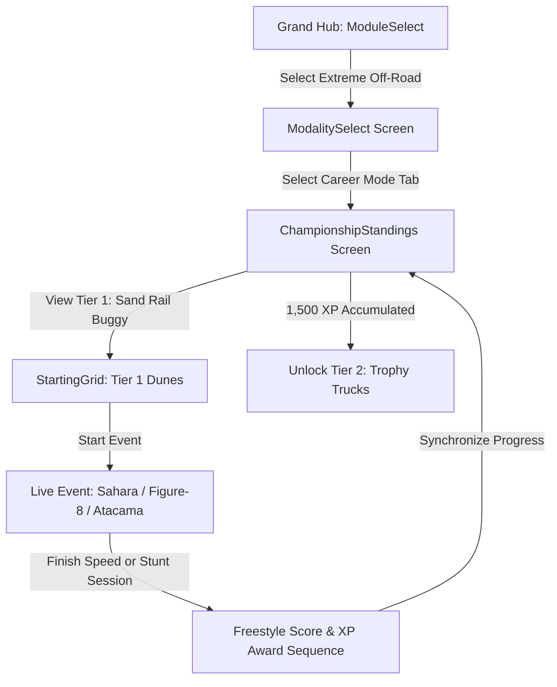

# Feature Spec: Extreme Off-Road & Stunt Arenas Career Mode 🚜

The **Extreme Off-Road & Stunt Arenas Career Mode** introduces an open, multi-discipline stunt, stadium, and terrain campaign in **TdRace**. Departing from pure 1D circuit ribbon racing, this career combines high-speed open-desert crossings, sub-zero ice drifting, deep clay mud bogging, supercross stadium rhythm whoops, and monumental car-crushing arena freestyle competitions.

---

## 🗺️ User Flow & Interface Design

### 1. Interface Navigation & Screen Flow
The Extreme Off-Road career integrates into `GameState::ModalitySelect` and `GameState::ChampionshipStandings`:



### 2. Visual & Audio Theming
- **Palette**: Baja Danger Orange (`Color::new(1.0, 0.40, 0.05, 1.0)`), Electric Cyan / Ice Blue (`Color::new(0.15, 0.85, 1.0, 1.0)`).
- **Freestyle Stunt HUD**: Dynamic popup juice FX: `+BIG AIR 2.4s (240 PTS)`, `+BARREL ROLL (1,500 PTS)`, `+CAR CRUSH x3 (900 PTS)`.
- **Sound Profile**: Unmuffled methanol supercharged V8 whine, hydraulic steering hiss, and bone-shaking suspension compression thuds upon landing.

---

## ⚙️ Backend Models & API Endpoints

### 1. SQLite Data Schema & Career Progress
Career state is persisted in SQLite via `ModuleCareerProgress` in [`crates/tdrace-app/src/profile/mod.rs`](../crates/tdrace-app/src/profile/mod.rs):

```rust
pub struct ModuleCareerProgress {
    pub profile_id: i64,
    pub module_id: String, // "extreme_offroad"
    pub xp: u64,
    pub level: u32,        // 1..=5
    pub unlocked_cars: Vec<String>,
    pub unlocked_tracks: Vec<String>,
    pub completed_events: Vec<String>,
    pub trophies_gold: u32,
    pub trophies_silver: u32,
    pub trophies_bronze: u32,
    pub updated_at: String,
}
```

### 2. Campaign Launch Endpoint & Session Struct
Implemented in [`crates/tdrace-app/src/game/mod.rs`](../crates/tdrace-app/src/game/mod.rs):
```rust
impl GameApp {
    /// Launches an Extreme Off-Road Career Championship Cup for the given tier (1..=5).
    pub fn start_extreme_offroad_career_tier(&mut self, tier: u32) {
        let (cup_name, track_ids, car_id) = match tier {
            1 => (
                "Dune Hopper Rookie Invitational (Tier 1)",
                vec!["sahara_dunes".to_string(), "dirt_figure_eight".to_string(), "atacama_sand_basin".to_string()],
                "sand_rail_buggy",
            ),
            2 => (
                "Baja 500 Trophy Truck Masters (Tier 2)",
                vec!["red_rock_canyon".to_string(), "mud_slough_arena".to_string(), "baja_500_scrub".to_string()],
                "trophy_truck_4x4",
            ),
            3 => (
                "Arctic Ice Glissade Championship (Tier 3)",
                vec!["arctic_frozen_lake".to_string(), "alpine_snow_ridge".to_string(), "rovaniemi_ice_ring".to_string()],
                "audi_quattro_ice",
            ),
            4 => (
                "Southern Mud Bogger Sludge Series (Tier 4)",
                vec!["supercross_stadium".to_string(), "gravel_quarry".to_string(), "louisiana_swamp".to_string()],
                "mega_truck_v8",
            ),
            _ => (
                "Monster Jam Freestyle Colosseum (Tier 5)",
                vec!["monster_colosseum".to_string(), "glacier_crest_pass".to_string(), "stunt_city_megastructure".to_string()],
                "grave_digger_spec",
            ),
        };
        // Initializes ChampionshipSession with Dual Speed & Freestyle rules
    }
}
```

---

## 🛡️ Security & Role-Based Access Controls (RBAC)

### 1. Career License Gating & Profile Integrity
- **Tier 1 (Sand Rail Buggy)**: Unlocked by default for all profiles (`xp >= 0`).
- **Tier 2 (Trophy Truck)**: Requires Career Level 2 (`xp >= 1,500`).
- **Tier 3 (Arctic Ice Racer)**: Requires Career Level 3 (`xp >= 3,500`).
- **Tier 4 (Mud Bogger V8)**: Requires Career Level 4 (`xp >= 6,500`).
- **Tier 5 (Crusher Monster Truck)**: Requires Career Level 5 (`xp >= 10,000`).
- **Dev Mode Bypass**: When `dev_mode: true` is configured, all tiers, tracks, and vehicles are unlocked for testing without modifying saved profile progress.

---

## 1. 5-Tier Vehicle Hierarchy & Prototypical Engineering Specs

```
                  EXTREME OFF-ROAD & STUNT SILHOUETTES (LATERAL 2D)
                  
    Tier 1 Sand Rail Buggy:
        Lightbar ──┐  Driver Cage
               /═══|═══\    Pennant ──┐
             =[  Chromoly  ]==_      ┌┴┐
              (O)          (O) [Flat-4]
              
    Tier 4 Mud Bogger V8:
              Snorkel ──┐
                   ___/‾‾‾‾|______
               ===[ High 4x4 Chassis ]===
                 (   O   )      (   O   )  [54" Tractor Paddles]

    Tier 5 Crusher Monster Truck:
                   ___/‾‾‾‾\___
               ===[ 1500 BHP V8 ]===
                 /                 \
                (     O       O     )  [66" Terra Tires + 4-Wheel Steer]
```

### 1.1 Tier 1: Sand Rail Buggy (Ultralight Sand Flotation)
* **Design Philosophy:** Chromoly tubular spaceframe buggy with rear-mounted turbo boxer engine and paddle tires. Ultra-low weight allows effortless skimming over fine desert sand without sinking.
* **Core Physics:**
  * Power: $300\,\text{BHP}$ ($224\,\text{kW}$) Turbo Flat-4.
  * Curb Weight ($m$): $590.0\,\text{kg}$ | Yaw Moment of Inertia ($I_z$): $720.0\,\text{kg}\cdot\text{m}^2$.
  * Layout: Pure Rear-Wheel Drive (`drive_bias: 0.0`), spool differential.
  * Top Speed ($v_{\text{max}}$): $55.5\,\text{m/s}$ ($\approx 200\,\text{km/h}$).
  * Tires: Rear paddle scoops ($B = 8.2$, $C = 1.35$, $D = 1.12$, Sand Drag attenuation: $-70\%$).
  * Suspension: Long-travel coilover ($550\,\text{mm}$ travel), soft jump compliance.
* **Prototypical Vehicles:**
  1. **Can-Am Maverick R Spec:** Modern tubular UTV silhouette, DCT dual-clutch transmission, razor-sharp sand agility.
  2. **Polaris RZR Pro R Tubular:** High-output 2.0L naturally aspirated 4-cylinder, balanced weight distribution.
  3. **Custom VW Sand Rail Buggy:** Classic rear air-cooled flat-four stinger exhaust, extreme rearward weight bias for wheelies.

### 1.2 Tier 2: Trophy Truck 4x4 / Baja Trophy Truck (Desert Whoop Eater)
* **Design Philosophy:** 800 BHP desert racing monoliths engineered to swallow three-foot whoops at full throttle. Features heavy 4WD systems, $30\,\text{inches}$ of wheel travel, and trailing-arm rear links.
* **Core Physics:**
  * Power: $800\,\text{BHP}$ ($596\,\text{kW}$) naturally aspirated $7.0\,\text{L}$ V8.
  * Curb Weight ($m$): $2,150.0\,\text{kg}$ | Yaw Moment of Inertia ($I_z$): $3,400.0\,\text{kg}\cdot\text{m}^2$.
  * Drive Layout: Full-time 4WD (`drive_bias: 0.45` front / $0.55$ rear).
  * Suspension: $760\,\text{mm}$ (30 inches) wheel travel, multi-stage bypass shock damping.
  * Whoops Speed Stability: Passing over rhythmic washboard obstacles triggers zero loss of forward traction.
  * Top Speed ($v_{\text{max}}$): $58.0\,\text{m/s}$ ($\approx 210\,\text{km/h}$).
* **Prototypical Vehicles:**
  1. **Bettantown Unlimited Trophy Truck:** Heavy tubular ladder frame, massive front bull bar, high-speed desert stability.
  2. **Geiser Bros AWD Trophy Truck:** Master of high-torque sand washes, seamless front-axle pulling power out of deep silt.
  3. **Mason Motorsport AWD Truck:** Low-drag carbon aerodynamic shell, extreme mid-corner steering responsiveness.

### 1.3 Tier 3: Arctic Ice Racer (Sub-Zero Studded Coupe)
* **Design Philosophy:** AWD competition coupes fitted with 400+ tungsten razor studs per tire. Engineered for precision pendulum drifting across mirror-smooth frozen lakes and snowbanks.
* **Core Physics:**
  * Power: $500\,\text{BHP}$ ($373\,\text{kW}$) Turbocharged inline-5 or boxer-4.
  * Curb Weight ($m$): $1,220.0\,\text{kg}$ | Yaw Moment of Inertia ($I_z$): $1,420.0\,\text{kg}\cdot\text{m}^2$.
  * Drive Layout: Symmetrical All-Wheel Drive with mechanical limited-slip differentials.
  * Ice Spike Grip: On `SurfaceType::Ice`, friction coefficient is boosted from default $\mu = 0.08$ to $\mu = 0.88$ by tungsten spikes; on bare asphalt, tires suffer $-25\%$ grip penalty.
  * Top Speed ($v_{\text{max}}$): $61.0\,\text{m/s}$ ($\approx 220\,\text{km/h}$).
* **Prototypical Vehicles:**
  1. **Audi Sport Quattro Ice Edition:** Short wheelbase, iconic Quattro differential lock, brutal power slides.
  2. **Subaru WRX STI Ice Racer:** Symmetrical AWD, DCCD active center diff, razor-accurate yaw placement.
  3. **Mitsubishi Lancer Evo Ice Spec:** Active Yaw Control (AYC), aggressive front canards and snow deflector flaps.

### 1.4 Tier 4: Mud Bogger V8 (High-Riser Sludge Monster)
* **Design Philosophy:** Heavily lifted 4x4 trucks equipped with tall agricultural chevron tractor tires, dual rooftop exhaust snorkels, and water-sealed ignition. Designed to claw through thick clay mud trenches where other cars immediately sink.
* **Core Physics:**
  * Power: $900\,\text{BHP}$ ($671\,\text{kW}$) Supercharged Big Block V8 ($9.4\,\text{L}$).
  * Curb Weight ($m$): $2,400.0\,\text{kg}$ | Yaw Moment of Inertia ($I_z$): $3,800.0\,\text{kg}\cdot\text{m}^2$.
  * Ground Clearance: $0.65\,\text{m}$ | Tires: 54-inch chevron directional mud paddles.
  * Mud Immersion Immunity: Normal `SurfaceType::Mud` viscous drag penalty is reduced by $80\%$.
  * Top Speed ($v_{\text{max}}$): $44.0\,\text{m/s}$ ($\approx 158\,\text{km/h}$).
* **Prototypical Vehicles:**
  1. **Mega Truck V8 Mud Slinger:** Tubular high-clearance subframe, massive front axle articulation.
  2. **Chevrolet K30 Custom Mud Bogger:** Heavy steel square-body shell, twin vertical chrome stack pipes emitting backfire flames.
  3. **Ford F-250 High Riser Mud Spec:** Heavy-duty planetary axles, unstoppable pulling torque in deep bayou clay.

### 1.5 Tier 5: Crusher Monster Truck (1500 BHP Colossus)
* **Design Philosophy:** 1,500 BHP supercharged alcohol-injected giants riding on 66-inch BKT terra tires and nitrogen charged coilovers. Features dual-axis 4-wheel hydraulic steering (4WS) for crab walking and tight donuts.
* **Core Physics:**
  * Power: $1,500\,\text{BHP}$ ($1,118\,\text{kW}$) Supercharged 540 ci Big Block on Methanol.
  * Curb Weight ($m$): $4,500.0\,\text{kg}$ | Yaw Moment of Inertia ($I_z$): $5,800.0\,\text{kg}\cdot\text{m}^2$.
  * Tires: 66" $\times$ 43" flotation terra tires ($m_{\text{wheel}} = 350\,\text{kg}$ each).
  * 4-Wheel Steering (4WS): Rear wheels steer independently (counter-phase for tight turning radius $\le 4.5\,\text{m}$; in-phase for high-speed crab walking).
  * Crushing Mechanics: Driving over crushed car obstacles causes zero deceleration and generates $+500\,\text{points}$ in Freestyle mode.
  * Top Speed ($v_{\text{max}}$): $42.0\,\text{m/s}$ ($\approx 151\,\text{km/h}$).
* **Prototypical Vehicles:**
  1. **Grave Digger Spec:** Classic 1950s panel van body, green neon tubular frame, legendary cemetery airbrush livery.
  2. **Max-D Monster Jam Truck:** Spiked futuristic SUV body, violent backflip kicker stability.
  3. **Bigfoot 1500 BHP Crusher:** The original blue monster, heavy planetary axles, unstoppable brute force.

---

## 2. 15-Venue Championship Calendar (3 per Tier)

```
              EXTREME OFF-ROAD & STUNT ARENAS 15-VENUE CALENDAR
              
[Tier 1: Sand Dunes & Figure-8 Dirt]
 ├─ Sahara Dune Crossing (Open Desert Crests & Descents)
 ├─ Dirt Figure Eight (High-Banked Berms & Crossover Jump)
 └─ [NUEVO] Atacama Sand Basin (High-Speed Desolation & Rolling Bowls)
 
[Tier 2: Open Desert & Slough Arenas]
 ├─ Red Rock Canyon (Gorge Washes & Rocky Switchbacks)
 ├─ Mud Slough Arena (Tight Clay Ruts & Deep Silt Beds)
 └─ [NUEVO] Baja 500 Desert Scrub (Open Scrubland & Whoops Sections)
 
[Tier 3: Sub-Zero Ice & Alpine Ridges]
 ├─ Arctic Frozen Lake (Zero-Friction Ice Sheet & Snow berms)
 ├─ Alpine Snow Ridge (Sub-Zero Hillclimb & Cliff Precipices)
 └─ [NUEVO] Rovaniemi Ice Ring (Finnish Groomed Ice & Night Floodlights)
 
[Tier 4: Supercross Stadiums & Deep Swamps]
 ├─ Supercross Stadium Arena (Indoor Triple Jumps & 14-Bump Whoops)
 ├─ Gravel Quarry Chasm (Industrial Conveyors & Vertical Drop-Ins)
 └─ [NUEVO] Louisiana Mud Swampland (Deep Bayou Sludge & Slippery Boardwalks)
 
[Tier 5: Colossal Arenas & Vertical Stunt Megastructures]
 ├─ Monster Colosseum (Demolition Car-Crush Pyramids & Launch Kickers)
 ├─ Glacier Crest Pass (Knife-Edge Glacier & Crevasse Gap Jumps)
 └─ [NUEVO] Stunt City Megastructure (360° Loop-the-Loop & Rooftop Aerials)
```

### 2.1 Tier 1 Venues: Sand Dunes & Figure-8 Dirt
1. **Sahara Dune Crossing:** Fast, undulating desert crossing with soft sand dunes and high-altitude drop-ins.
2. **Dirt Figure Eight:** High-intensity figure-8 short track featuring an elevated center crossover jump ramp.
3. **Atacama Sand Basin *(NUEVO)***:
   * **Location & Terrain:** Atacama Desert, Chile. Massive open desert bowl ($2,200\,\text{m}$ perimeter).
   * **Signature Challenges:** Ultra-fine sand waves, blinding salt flats, and sudden $15\,\text{m}$ rolling drops that demand throttle moderation to prevent nose-diving.

### 2.2 Tier 2 Venues: Open Desert & Slough Arenas
1. **Red Rock Canyon:** Twisting canyon course carved between sheer red sandstone cliffs.
2. **Mud Slough Arena:** Enclosed muddy basin filled with thick silt beds and water puddles.
3. **Baja 500 Desert Scrub *(NUEVO)***:
   * **Location & Terrain:** Ensenada to San Felipe, Mexico ($3,100\,\text{m}$ stage).
   * **Signature Challenges:** Punishing 200-meter washboard whoops section, jagged desert scrub, and narrow sand wash channels designed to test Trophy Truck suspension travel.

### 2.3 Tier 3 Venues: Sub-Zero Ice & Alpine Ridges
1. **Arctic Frozen Lake:** $240\,\text{m} \times 160\,\text{m}$ open sheet of polished blue ice ($\mu = 0.08$) with soft snow berm boundaries.
2. **Alpine Snow Ridge:** $1,850\,\text{m}$ point-to-point hillclimb ascending a treacherous alpine pass with unprotected cliff edges.
3. **Rovaniemi Ice Ring *(NUEVO)***:
   * **Location & Terrain:** Lapland, Finland ($1,250\,\text{m}$ circuit).
   * **Signature Challenges:** Groomed lake ice illuminated by night floodlights, bordered by compacted snow banks that reward high-angle Scandinavian flick entries.

### 2.4 Tier 4 Venues: Supercross Stadiums & Deep Swamps
1. **Supercross Stadium Arena:** Indoor football arena featuring a 6-lane rhythm track, double/triple jumps, and a 14-bump washboard section.
2. **Gravel Quarry Chasm:** Industrial excavation pit with vertical conveyor ramps and gravel runoffs.
3. **Louisiana Mud Swampland *(NUEVO)***:
   * **Location & Terrain:** Deep Louisiana Bayou ($1,420\,\text{m}$ twisting swamp loop).
   * **Signature Challenges:** Deep stagnant bayou water, thick clay sludge trenches, and narrow wooden boardwalk bridges with missing guardrails.

### 2.5 Tier 5 Venues: Colossal Arenas & Vertical Stunt Megastructures
1. **Monster Colosseum:** Enclosed $190\,\text{m} \times 140\,\text{m}$ arena with car-crush pyramids and massive metal launch ramps.
2. **Glacier Crest Pass:** Knife-edge glacial mountain ridge with bottomless crevasse gap jumps and zero safety walls.
3. **Stunt City Megastructure *(NUEVO)***:
   * **Location & Terrain:** Multi-tier urban stunt playground ($220\,\text{m} \times 170\,\text{m}$).
   * **Signature Challenges:** Full 360-degree vertical loop-the-loop stunt ramp, quarter-pipe wallrides mounted against skyscraper facades, and rooftop gap jumps with floating target rings.

---

## 3. Career Progression & Dual-Mode Scoring Engine

### 3.1 Career Progression & Unlock Schedule

| Career Level | Category | Tier Name | Required XP | Car Unlocks | Circuit Unlocks |
| :--- | :--- | :--- | :--- | :--- | :--- |
| **Level 1** | Sand Rail | **Dune Hopper Rookie** | $0\,\text{XP}$ | `sand_rail_buggy`, `polaris_rzr`, `vw_sand_rail` | `sahara_dunes`, `dirt_figure_eight`, `atacama_sand_basin` |
| **Level 2** | Trophy Truck | **Baja Desert Pro** | $1,500\,\text{XP}$ | `trophy_truck_4x4`, `geiser_awd_truck`, `mason_awd` | `red_rock_canyon`, `mud_slough_arena`, `baja_500_scrub` |
| **Level 3** | Ice Racer | **Arctic Ice Specialist** | $3,500\,\text{XP}$ | `audi_quattro_ice`, `wrx_sti_ice`, `lancer_evo_ice` | `arctic_frozen_lake`, `alpine_snow_ridge`, `rovaniemi_ice_ring` |
| **Level 4** | Mud Bogger | **Swamp Crawler Elite** | $6,500\,\text{XP}$ | `mega_truck_v8`, `chevy_k30_mud`, `f250_high_riser` | `supercross_stadium`, `gravel_quarry`, `louisiana_swamp` |
| **Level 5** | Monster Truck | **Freestyle World Titan** | $10,000\,\text{XP}$ | `grave_digger_spec`, `max_d_spec`, `bigfoot_crusher` | `monster_colosseum`, `glacier_crest_pass`, `stunt_city_megastructure` |

### 3.2 Dual-Mode Scoring System
Career events alternate between **Speed Circuit Races** and **Freestyle Stunt Arenas**:
* **Circuit Races:** Standard finishing position points ($25, 18, 15, 12, 10\dots$) with clean air jump bonuses.
* **Freestyle Stunt Scoring:**
  * **Big Air:** $100\,\text{pts/second}$ of hangtime above $2.0\,\text{m}$ elevation.
  * **Barrel Roll / Flip:** $1,500\,\text{pts}$ for complete $360^\circ$ rotation without landing inverted.
  * **Car Crush:** $+300\,\text{pts}$ per flattened obstacle vehicle.
  * **Target Ring Pass:** $+1,000\,\text{pts}$ for flying through suspended aerial holographic rings.
  * **Donuts & Cyclone:** $250\,\text{pts}$ per continuous $360^\circ$ rotation at full throttle.

---

## 🧪 Verification & Acceptance Criteria

### Automated Tests
- Command to run workspace unit tests: `cargo test --package tdrace-app --test profile_tests`
- Command to test terrain and arena bounds: `cargo test --package arcade-race-core`

### Manual Acceptance Criteria (Pseudo-Gherkin)

- **Scenario: Level 1 Player starts with Sand Rail Buggy on Dunes**
  - [ ] **Given** the player selects "extreme_offroad" career
  - [ ] **When** the career state initializes
  - [ ] **Then** Tier 1 is unlocked with 0 XP
  - [ ] **And** vehicles "sand_rail_buggy", "polaris_rzr", and "vw_sand_rail" are available
  - [ ] **And** circuits "sahara_dunes", "dirt_figure_eight", and "atacama_sand_basin" are unlocked

- **Scenario: Mud Bogger overcomes deep mud without losing momentum**
  - [ ] **Given** the player drives "mega_truck_v8" in "louisiana_swamp"
  - [ ] **When** the vehicle enters a deep clay mud zone (SurfaceType::Mud)
  - [ ] **Then** forward viscous drag penalty is reduced by 80% compared to standard GT cars
  - [ ] **And** forward momentum is sustained through the swamp channel

- **Scenario: Monster Truck unlocks at Level 5 with 4-Wheel Steering**
  - [ ] **Given** the player achieves 10,000 XP in the Extreme Off-Road module
  - [ ] **When** Level 5 is granted
  - [ ] **Then** "grave_digger_spec" is unlocked
  - [ ] **And** the vehicle responds to 4-wheel steering input
  - [ ] **And** "stunt_city_megastructure" and "monster_colosseum" become selectable

---

## 🔗 Traceability & Codebase Mapping

### Created/Modified Files
- `[ ]` `crates/tdrace-app/src/module/extreme_offroad.rs` -> Implements Extreme Off-Road module vehicles, themes, and tracks.
- `[ ]` `crates/tdrace-app/src/profile/mod.rs` -> Governs `ModuleCareerProgress` and unlock synchronization.
- `[ ]` `crates/tdrace-app/src/game/mod.rs` -> Launches `start_extreme_offroad_career_tier` campaign cups.
- `[ ]` `crates/wheelbase/src/tire/pacejka.rs` -> Implements tungsten ice spike friction and 66" terra tire slip.

### Verification Assertions
- `crates/tdrace-app/src/module/extreme_offroad.rs` references `specs/003_extreme_offroad_and_stunt_arenas_career_mode.md`.

### Beads Epic Mapping
- Governed by active parent Epic `tdrace-cxsz` (*Fulfill Spec 003: Extreme Off-Road & Stunt Arenas Career Mode*).
