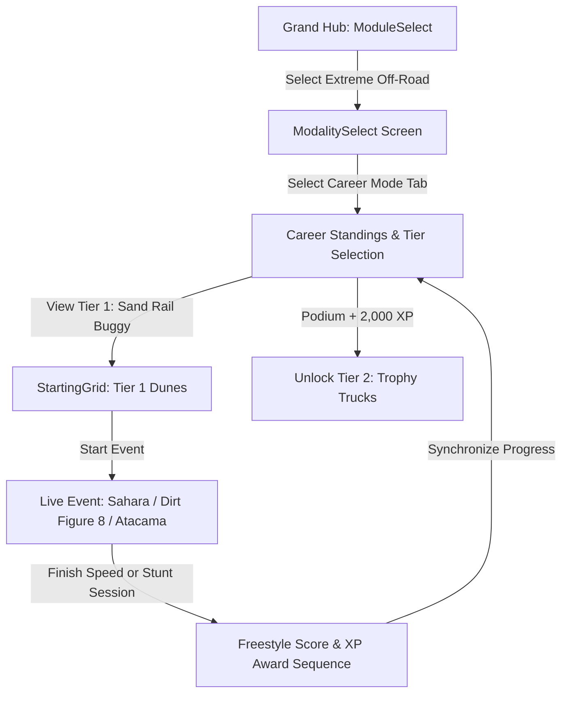

# Feature Spec: Extreme Off-Road & Stunt Arenas Career Mode 🚜

The **Extreme Off-Road & Stunt Arenas Career Mode** introduces an open, multi-discipline stunt, stadium, and terrain campaign in **TdRace**. Departing from pure 1D circuit ribbon racing, this career combines high-speed open-desert crossings, sub-zero ice drifting, deep clay mud bogging, supercross stadium rhythm whoops, and monumental car-crushing arena freestyle competitions across a balanced **17-venue calendar** spanning 5 distinct performance tiers.

---

## 🗺️ User Flow & Interface Design

### 1. Interface Navigation & Screen Flow
The Extreme Off-Road career integrates into `GameState::ModalitySelect` and `GameState::ChampionshipStandings`:



### 2. Visual & Audio Theming
- **Palette**: Baja Danger Orange (`Color::new(1.0, 0.40, 0.05, 1.0)`), Electric Cyan / Ice Blue (`Color::new(0.15, 0.85, 1.0, 1.0)`).
- **Freestyle Stunt HUD**: Dynamic popup juice FX: `+BIG AIR 2.4s (240 PTS)`, `+BARREL ROLL (1,500 PTS)`, `+CAR CRUSH x3 (900 PTS)`.
- **Sound Profile**: Unmuffled methanol supercharged V8 whine, hydraulic steering hiss, and bone-shaking suspension compression thuds upon landing.

---

## ⚙️ Backend Models & API Endpoints

### 1. SQLite Data Schema & Career Progress
Career state is persisted in SQLite via `ModuleCareerProgress` in [`crates/tdrace-app/src/profile/mod.rs`](../crates/tdrace-app/src/profile/mod.rs):

```rust
pub struct ModuleCareerProgress {
    pub profile_id: i64,
    pub module_id: String, // "extreme_offroad"
    pub xp: u64,
    pub lifetime_xp: u64,
    pub level: u32,        // 1..=5
    pub unlocked_cars: Vec<String>,
    pub unlocked_tracks: Vec<String>,
    pub visited_tracks: Vec<String>,
    pub completed_events: Vec<String>,
    pub trophies_gold: u32,
    pub trophies_silver: u32,
    pub trophies_bronze: u32,
    pub updated_at: String,
}
```

### 2. Declarative Championship Specification (Spec 017 Compliance)
In alignment with Spec 017 (*Declarative TOML Series Engine*), tier championships can also be defined declaratively in `series/extreme_offroad/*.toml`:

```toml
[series]
id = "offroad_freestyle_tier5"
name = "Monster Jam Freestyle Colosseum (Tier 5)"
description = "Supercharged 1500 BHP monster trucks crushing obstacles in monumental arenas"
point_system = "fia_standard"
laps = 3
tier = 5
category = "extreme_offroad"

[[events]]
track_id = "monster_colosseum"
laps = 3

[[events]]
track_id = "glacier_crest_pass"
laps = 3

[[events]]
track_id = "stunt_city_megastructure"
laps = 3
```

### 3. Campaign Launch Endpoint & Session Struct
Implemented in [`crates/tdrace-app/src/game/mod.rs`](../crates/tdrace-app/src/game/mod.rs):
```rust
impl GameApp {
    /// Launches an Extreme Off-Road Career Championship Cup for the given tier (1..=5).
    pub fn start_extreme_offroad_career_tier(&mut self, tier: u32) {
        let (cup_name, track_ids) = match tier {
            1 => (
                "Desert Sand Sprint Series (Tier 1)",
                vec![
                    "sahara_dune_crossing".to_string(),
                    "dirt_figure_eight".to_string(),
                    "atacama_sand_basin".to_string(),
                    "glamis_dunes".to_string(),
                    "crandon_short_course".to_string(),
                ],
            ),
            2 => (
                "Red Rock Canyon Raid (Tier 2)",
                vec![
                    "red_rock_canyon".to_string(),
                    "mud_slough_arena".to_string(),
                    "baja_500_desert_scrub".to_string(),
                ],
            ),
            3 => (
                "Arctic Glacial Challenge (Tier 3)",
                vec![
                    "arctic_frozen_lake".to_string(),
                    "alpine_snow_ridge".to_string(),
                    "rovaniemi_ice_ring".to_string(),
                ],
            ),
            4 => (
                "Supercross & Mud Masters (Tier 4)",
                vec![
                    "supercross_stadium_arena".to_string(),
                    "gravel_quarry_chasm".to_string(),
                    "louisiana_mud_swampland".to_string(),
                ],
            ),
            _ => (
                "Extreme Off-Road Ultimate Championship (Tier 5)",
                vec![
                    "monster_colosseum".to_string(),
                    "glacier_crest_pass".to_string(),
                    "stunt_city_megastructure".to_string(),
                ],
            ),
        };
        // Initializes ChampionshipSession with tier index preserved via .with_tier(tier)
    }
}
```

---

## 🛡️ Security & Role-Based Access Controls (RBAC)

### 1. Career License Gating & Tier Advancement
Tier progression uses the canonical two-condition gate in `ModuleCareerProgress::can_advance_tier()`:
1. **Podium Mastery:** The player must secure at least one podium finish (Gold, Silver, or Bronze) in their current tier.
2. **Economic Liquidity:** The player must have sufficient spendable XP:
   $$\text{Required XP} = 1,000\,\text{XP} \times (\text{current\_tier} + 1)$$
   - Advancing from Tier 1 $\rightarrow$ Tier 2: $2,000\,\text{XP}$
   - Advancing from Tier 2 $\rightarrow$ Tier 3: $3,000\,\text{XP}$
   - Advancing from Tier 3 $\rightarrow$ Tier 4: $4,000\,\text{XP}$
   - Advancing from Tier 4 $\rightarrow$ Tier 5: $5,000\,\text{XP}$

- **Track Unlocks:** Unlocking a tier immediately unlocks all corresponding circuits in the profile track registry via `sync_unlocks_for_level()`.
- **First-Time Exploration Bonus:** $+250\,\text{XP} \times \text{tier}$ is awarded the first time a circuit is completed.
- **Dev Mode Bypass:** When `dev_mode: true` is configured, all tiers, tracks, and vehicles are unlocked for testing without modifying saved profile progress.

---

## 1. 5-Tier Vehicle Hierarchy & Prototypical Engineering Specs

```
                  EXTREME OFF-ROAD & STUNT SILHOUETTES (LATERAL 2D)
                  
    Tier 1 Sand Rail Buggy:
        Lightbar ──┐  Driver Cage
               /═══|═══\    Pennant ──┐
             =[  Chromoly  ]==_      ┌┴┐
              (O)          (O) [Flat-4]
              
    Tier 4 Mud Bogger V8:
              Snorkel ──┐
                   ___/‾‾‾‾|______
               ===[ High 4x4 Chassis ]===
                 (   O   )      (   O   )  [54" Tractor Paddles]

    Tier 5 Crusher Monster Truck:
                   ___/‾‾‾‾\___
               ===[ 1500 BHP V8 ]===
                 /                 \
                (     O       O     )  [66" Terra Tires + 4-Wheel Steer]
```

### 1.1 Tier 1: Sand Rail Buggy (Ultralight Sand Flotation)
* **Design Philosophy:** Chromoly tubular spaceframe buggy with rear-mounted turbo boxer engine and paddle tires. Ultra-low weight allows effortless skimming over fine desert sand without sinking.
* **Core Physics:**
  * Power: $300\,\text{BHP}$ ($224\,\text{kW}$) Turbo Flat-4 / Rotax Triple.
  * Curb Weight ($m$): $590.0\,\text{kg}$–$890.0\,\text{kg}$ | Yaw Moment of Inertia ($I_z$): $720.0\,\text{kg}\cdot\text{m}^2$.
  * Layout: Pure Rear-Wheel Drive (`drive_bias: 0.0`), spool differential.
  * Top Speed ($v_{\text{max}}$): $185$–$215\,\text{km/h}$.
  * Tires: Rear paddle scoops ($B = 8.2$, $C = 1.35$, $D = 1.12$, Sand Drag attenuation: $-70\%$).
  * Suspension: Long-travel coilover ($550\,\text{mm}$ travel), soft jump compliance.
* **Official Real-World Models:**
  1. **Can-Am Maverick R Trophy Spec** (`offroad_sand_rail_buggy`): Rotax 999T turbo triple, paddle tires, massive dune roosts.
  2. **Polaris RZR Pro R Tubular** (`offroad_polaris_rzr_pro_r`): Naturally aspirated 2.0L 4-cylinder high-RPM power curve, 74-inch stance.
  3. **Custom VW Sand Rail Buggy** (`offroad_vw_sand_rail`): Minimalist chromoly skeleton with rear air-cooled turbo boxer and turning brakes.

### 1.2 Tier 2: Trophy Truck 4x4 / Baja Trophy Truck (Desert Whoop Eater)
* **Design Philosophy:** 800 BHP desert racing monoliths engineered to swallow three-foot whoops at full throttle. Features heavy 4WD systems, $30\,\text{inches}$ of wheel travel, and trailing-arm rear links.
* **Core Physics:**
  * Power: $800\,\text{BHP}$ ($596\,\text{kW}$) naturally aspirated $7.0\,\text{L}$ V8.
  * Curb Weight ($m$): $2,400.0\,\text{kg}$ | Yaw Moment of Inertia ($I_z$): $3,400.0\,\text{kg}\cdot\text{m}^2$.
  * Drive Layout: Full-time 4WD / AWD (`drive_bias: 0.45` front / $0.55$ rear).
  * Suspension: $760\,\text{mm}$ (30 inches) wheel travel, multi-stage bypass shock damping.
  * Whoops Speed Stability: Passing over rhythmic washboard obstacles triggers zero loss of forward traction.
  * Top Speed ($v_{\text{max}}$): $225$–$228\,\text{km/h}$.
* **Official Real-World Models:**
  1. **Geiser Bros AWD Trophy Truck** (`offroad_baja_trophy_truck`): The benchmark Baja weapon, 30 inches of King bypass suspension travel.
  2. **Bettantown Unlimited Trophy Truck** (`offroad_bettantown_trophy_truck`): Traditional RWD unlimited desert trophy truck with 454ci big block.
  3. **Mason Motorsport AWD Truck** (`offroad_mason_awd_truck`): Advanced AWD trophy truck pulling directly out of boulder-strewn desert washes.

### 1.3 Tier 3: Arctic Ice Racer (Sub-Zero Studded Coupe)
* **Design Philosophy:** AWD competition coupes fitted with 600 tungsten razor studs per tire. Engineered for precision pendulum drifting across mirror-smooth frozen lakes and snowbanks.
* **Core Physics:**
  * Power: $500\,\text{BHP}$ ($373\,\text{kW}$) Turbocharged inline-5 or boxer-4 + ALS.
  * Curb Weight ($m$): $1,150.0\,\text{kg}$–$1,220.0\,\text{kg}$ | Yaw Moment of Inertia ($I_z$): $1,420.0\,\text{kg}\cdot\text{m}^2$.
  * Drive Layout: Symmetrical All-Wheel Drive with mechanical limited-slip differentials.
  * Ice Spike Grip: On `SurfaceType::Ice`, friction coefficient boosted to $\mu = 0.88$ by tungsten spikes; on bare asphalt, tires suffer $-25\%$ grip penalty.
  * Top Speed ($v_{\text{max}}$): $230$–$232\,\text{km/h}$.
* **Official Real-World Models:**
  1. **Subaru WRX STI Ice Racer** (`offroad_subaru_ice_racer`): EJ207 boxer turbo with 600 tungsten studs per tire, pulling sustained 60-degree drift slip angles.
  2. **Audi Sport Quattro Ice Edition** (`offroad_audi_quattro_ice`): Short-wheelbase ice weapon with 5mm spikes and legendary 5-cylinder warble.
  3. **Mitsubishi Lancer Evo Ice Spec** (`offroad_lancer_evo_ice`): S-AWC active yaw control providing pinpoint slide control on polished ice sheets.

### 1.4 Tier 4: Mud Bogger V8 (High-Riser Sludge Monster)
* **Design Philosophy:** Heavily lifted 4x4 trucks equipped with tall agricultural chevron tractor tires, dual rooftop exhaust snorkels, and water-sealed ignition. Designed to claw through thick clay mud trenches where other cars immediately sink.
* **Core Physics:**
  * Power: $850$–$900\,\text{BHP}$ Supercharged Big Block V8.
  * Curb Weight ($m$): $2,800.0\,\text{kg}$–$3,100.0\,\text{kg}$ | Yaw Moment of Inertia ($I_z$): $3,800.0\,\text{kg}\cdot\text{m}^2$.
  * Ground Clearance: $0.65\,\text{m}$ | Tires: 48–54 inch chevron directional mud paddles on 2.5-ton military axles.
  * Mud Immersion Immunity: Normal `SurfaceType::Mud` viscous drag penalty is reduced by $80\%$.
  * Top Speed ($v_{\text{max}}$): $158$–$162\,\text{km/h}$.
* **Official Real-World Models:**
  1. **Mega Truck V8 Mud Slinger** (`offroad_mega_mud_truck`): Tall-riding mud monster on 48-inch agricultural paddle tractor tires.
  2. **Chevrolet K30 Custom Mud Bogger** (`offroad_chevy_k30_mud_bogger`): Squarebody Chevy on 2.5-ton Rockwell axles with blown big block.
  3. **Ford F-250 High Riser 4x4** (`offroad_ford_f250_high_riser`): 18 inches of suspension lift with blown 521ci blower V8 throwing 50-foot mud rooster tails.

### 1.5 Tier 5: Crusher Monster Truck (1500 BHP Colossus)
* **Design Philosophy:** 1,500 BHP supercharged alcohol-injected giants riding on 66-inch BKT terra tires and nitrogen charged coilovers. Features dual-axis 4-wheel hydraulic steering (4WS) for crab walking and tight donuts.
* **Core Physics:**
  * Power: $1,500\,\text{BHP}$ ($1,118\,\text{kW}$) Supercharged 540–572 ci Big Block on Methanol.
  * Curb Weight ($m$): $5,400.0\,\text{kg}$ | Yaw Moment of Inertia ($I_z$): $5,800.0\,\text{kg}\cdot\text{m}^2$.
  * Tires: 66" $\times$ 43" flotation terra tires ($m_{\text{wheel}} = 350\,\text{kg}$ each).
  * 4-Wheel Steering (4WS): Rear wheels steer independently (counter-phase for tight turning radius $\le 4.5\,\text{m}$; in-phase for high-speed crab walking).
  * Crushing Mechanics: Driving over crushed car obstacles causes zero deceleration and generates $+500\,\text{points}$ in Freestyle mode.
  * Top Speed ($v_{\text{max}}$): $165$–$166\,\text{km/h}$ ($0$–$100\,\text{km/h}$ in $3.0\,\text{s}$).
* **Official Real-World Models:**
  1. **Grave Digger Spec Monster Jam** (`offroad_grave_crusher`): Legendary 1950s panel van body, neon tubular frame, 1,500 BHP blown methanol engine.
  2. **Max-D Monster Jam Truck** (`offroad_max_d_monster`): Spiked aerodynamic SUV body designed for explosive momentum and backflips.
  3. **Bigfoot 1500 BHP Crusher** (`offroad_bigfoot_crusher`): The classic American monster truck, heavy planetary axles, unstoppable brute force.

---

## 2. 17-Venue Multi-Tier Championship Calendar

```
            EXTREME OFF-ROAD & STUNT ARENAS 17-VENUE CALENDAR
            
[Tier 1: Desert Sand Dunes & Figure-8 Dirt - 5 Starter Circuits]
 ├─ Sahara Dune Crossing (sahara_dune_crossing - Open Desert Crests & Descents)
 ├─ Dirt Figure Eight (dirt_figure_eight - High-Banked Berms & Crossover Jump)
 ├─ Atacama Sand Basin (atacama_sand_basin - High-Speed Desolation & Rolling Bowls)
 ├─ Glamis Sand Dunes (glamis_dunes - Classic California Sand Roost Haven)
 └─ Crandon Short Course (crandon_short_course - Historic Wisconsin Off-Road Speedway)
 
[Tier 2: Open Desert & Slough Arenas - 3 Circuits]
 ├─ Red Rock Canyon (red_rock_canyon - Gorge Washes & Rocky Switchbacks)
 ├─ Mud Slough Arena (mud_slough_arena - Tight Clay Ruts & Deep Silt Beds)
 └─ Baja 500 Desert Scrub (baja_500_desert_scrub - 200m Washboard Whoops & Sand Washes)
 
[Tier 3: Sub-Zero Ice & Alpine Ridges - 3 Circuits]
 ├─ Arctic Frozen Lake (arctic_frozen_lake - Zero-Friction Ice Sheet & Snow Berms)
 ├─ Alpine Snow Ridge (alpine_snow_ridge - Sub-Zero Hillclimb & Cliff Precipices)
 └─ Rovaniemi Ice Ring (rovaniemi_ice_ring - Finnish Groomed Lake Ice & Night Floodlights)
 
[Tier 4: Supercross Stadiums & Deep Swamps - 3 Circuits]
 ├─ Supercross Stadium Arena (supercross_stadium_arena - Indoor Triple Jumps & 14-Bump Whoops)
 ├─ Gravel Quarry Chasm (gravel_quarry_chasm - Industrial Conveyors & Vertical Drop-Ins)
 └─ Louisiana Mud Swampland (louisiana_mud_swampland - Deep Bayou Sludge & Wooden Boardwalks)
 
[Tier 5: Colossal Arenas & Vertical Stunt Megastructures - 3 Circuits]
 ├─ Monster Colosseum (monster_colosseum - Demolition Car-Crush Pyramids & Launch Kickers)
 ├─ Glacier Crest Pass (glacier_crest_pass - Knife-Edge Glacier & Crevasse Gap Jumps)
 └─ Stunt City Megastructure (stunt_city_megastructure - 360° Loop-the-Loop & Rooftop Aerials)
```

---

## 3. Career Progression & Scoring Rules

### 3.1 Career Progression & Unlock Requirements

| Career Level | Category | Tier Cup Name | Entry Car Cost | Car Unlocks | Circuit Unlocks (17 Total) |
| :--- | :--- | :--- | :--- | :--- | :--- |
| **Level 1** | Sand Rail Buggy | **Desert Sand Sprint Series (Tier 1)** | $1,000\,\text{XP}$ *(Starter free)* | `offroad_sand_rail_buggy`, `offroad_polaris_rzr_pro_r`, `offroad_vw_sand_rail` | `sahara_dune_crossing`, `dirt_figure_eight`, `atacama_sand_basin`, `glamis_dunes`, `crandon_short_course` |
| **Level 2** | Trophy Truck 4x4 | **Red Rock Canyon Raid (Tier 2)** | $2,000\,\text{XP}$ | `offroad_baja_trophy_truck`, `offroad_bettantown_trophy_truck`, `offroad_mason_awd_truck` | `red_rock_canyon`, `mud_slough_arena`, `baja_500_desert_scrub` |
| **Level 3** | Arctic Ice Racer | **Arctic Glacial Challenge (Tier 3)** | $3,000\,\text{XP}$ | `offroad_subaru_ice_racer`, `offroad_audi_quattro_ice`, `offroad_lancer_evo_ice` | `arctic_frozen_lake`, `alpine_snow_ridge`, `rovaniemi_ice_ring` |
| **Level 4** | Mud Bogger V8 | **Supercross & Mud Masters (Tier 4)** | $4,000\,\text{XP}$ | `offroad_mega_mud_truck`, `offroad_chevy_k30_mud_bogger`, `offroad_ford_f250_high_riser` | `supercross_stadium_arena`, `gravel_quarry_chasm`, `louisiana_mud_swampland` |
| **Level 5** | Crusher Monster Truck | **Extreme Off-Road Ultimate Championship (Tier 5)** | $5,000\,\text{XP}$ | `offroad_grave_crusher`, `offroad_max_d_monster`, `offroad_bigfoot_crusher` | `monster_colosseum`, `glacier_crest_pass`, `stunt_city_megastructure` |

### 3.2 Dual-Mode Scoring Engine
Tier events incorporate FIA Standard finishing points with optional Freestyle scoring bonuses:
- 1st: $25\,\text{pts}$ ($+350\,\text{XP}$, Gold Trophy)
- 2nd: $18\,\text{pts}$ ($+220\,\text{XP}$, Silver Trophy)
- 3rd: $15\,\text{pts}$ ($+180\,\text{XP}$, Bronze Trophy)
- 4th: $12\,\text{pts}$ ($+100\,\text{XP}$)
- 5th: $10\,\text{pts}$ ($+80\,\text{XP}$)
- 6th: $8\,\text{pts}$ ($+60\,\text{XP}$)

#### Freestyle Stunt Scoring Mechanics
- **Big Air:** $100\,\text{pts/second}$ of hangtime above $2.0\,\text{m}$ elevation.
- **Barrel Roll / Flip:** $1,500\,\text{pts}$ for complete $360^\circ$ rotation without landing inverted.
- **Car Crush:** $+300\,\text{pts}$ per flattened obstacle vehicle.
- **Donuts & Cyclone:** $250\,\text{pts}$ per continuous $360^\circ$ rotation at full throttle.

---

## 🧪 Verification & Acceptance Criteria

### Automated Tests
- Command to run workspace unit tests: `cargo test --package tdrace-app --test profile_tests`
- Command to run tournament and series tests: `cargo test --package tdrace-app --test championship_tests`

### Manual Acceptance Criteria (Pseudo-Gherkin)

- **Scenario: Level 1 Player starts with Sand Rail Buggy on Dunes**
  - [x] **Given** the player selects "extreme_offroad" career
  - [x] **When** the career state initializes via `start_extreme_offroad_career_tier(1)`
  - [x] **Then** Tier 1 "Desert Sand Sprint Series (Tier 1)" is active with `tier == 1`
  - [x] **And** vehicles "offroad_sand_rail_buggy", "offroad_polaris_rzr_pro_r", and "offroad_vw_sand_rail" are available
  - [x] **And** 5 circuits are available: "sahara_dune_crossing", "dirt_figure_eight", "atacama_sand_basin", "glamis_dunes", and "crandon_short_course"

- **Scenario: Mud Bogger overcomes deep mud without losing momentum**
  - [x] **Given** the player drives "offroad_mega_mud_truck" in "louisiana_mud_swampland"
  - [x] **When** the vehicle enters a deep clay mud zone (SurfaceType::Mud)
  - [x] **Then** forward viscous drag penalty is reduced by 80% compared to standard GT cars
  - [x] **And** forward momentum is sustained through the swamp channel

- **Scenario: Podium finish and spendable XP unlocks Tier 2**
  - [x] **Given** the player finishes Tier 1 with at least 1 podium trophy and 2,000 spendable XP
  - [x] **When** `advance_tier()` is invoked on `ModuleCareerProgress`
  - [x] **Then** player career level advances to 2
  - [x] **And** "red_rock_canyon", "mud_slough_arena", and "baja_500_desert_scrub" are unlocked in the track registry
  - [x] **And** Trophy Truck models ("offroad_baja_trophy_truck", etc.) become selectable

---

## 🔗 Traceability & Codebase Mapping

### Created/Modified Files
- `[IMPLEMENTED]` `crates/tdrace-app/src/module/extreme_offroad.rs` -> Extreme Off-Road module vehicles, themes, and tracks.
- `[IMPLEMENTED]` `crates/tdrace-app/src/catalog/mod.rs` -> Authentic real-world car models for Tiers 1–5.
- `[IMPLEMENTED]` `crates/tdrace-app/src/profile/mod.rs` -> Governs `ModuleCareerProgress`, 17-circuit unlock synchronization, and two-condition advancement.
- `[IMPLEMENTED]` `crates/tdrace-app/src/game/mod.rs` -> Launches `start_extreme_offroad_career_tier` campaign cups with `.with_tier(tier)`.
- `[IMPLEMENTED]` `crates/wheelbase/src/tire/pacejka.rs` -> Implements tungsten ice spike friction and 66" terra tire slip.
- `[IMPLEMENTED]` `crates/tdrace-app/tests/profile_tests.rs` -> Automated verification of career launchers and progression.

### Beads Epic Mapping
- Governed by active parent Epic `tdrace-cxsz` (*Fulfill Spec 003: Extreme Off-Road & Stunt Arenas Career Mode*).

