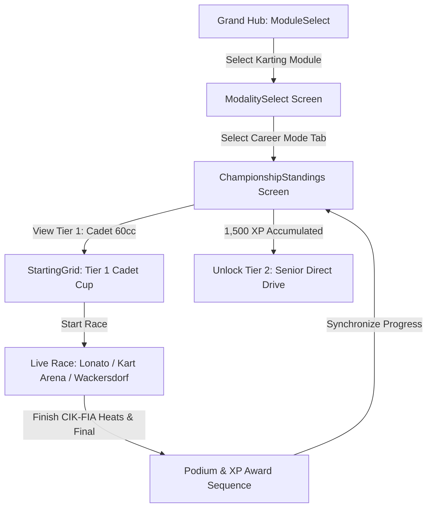

# Feature Spec: Karting World Cup Career Mode 🏎️

The **Karting World Cup Career Mode** establishes the foundational grassroots motorsport ladder in **TdRace**. Serving as the training crucible for all world-class circuit racers, this career tracks the journey of an aspiring driver from junior 60cc cadet karts through direct-drive senior karts, violent 6-speed KZ2 shifters, tuned novelty racing lawnmowers, and the ballistic 240 km/h 250cc Superkart division on full-sized Grand Prix tracks.

---

## 🗺️ User Flow & Interface Design

### 1. Interface Navigation & Screen Flow
The Karting career integrates into `GameState::ModalitySelect` and `GameState::ChampionshipStandings`:



### 2. Visual & Audio Theming
- **Palette**: Karting Racing Green (`Color::new(0.12, 0.78, 0.35, 1.0)`), Electric Yellow (`Color::new(1.0, 0.92, 0.15, 1.0)`).
- **Exposed Driver Rendering**: Dynamic 2D driver model leaning into corners to simulate chassis flex and body weight transfer.
- **Sound Profile**: High-pitched screaming 2-stroke 15,000 RPM acoustics (`EngineAudioProfile::kart_2stroke`) and rumbling V-Twin mower exhaust.

---

## ⚙️ Backend Models & API Endpoints

### 1. SQLite Data Schema & Career Progress
Career state is persisted in SQLite via `ModuleCareerProgress` in [`crates/tdrace-app/src/profile/mod.rs`](../crates/tdrace-app/src/profile/mod.rs):

```rust
pub struct ModuleCareerProgress {
    pub profile_id: i64,
    pub module_id: String, // "kart"
    pub xp: u64,
    pub level: u32,        // 1..=5
    pub unlocked_cars: Vec<String>,
    pub unlocked_tracks: Vec<String>,
    pub completed_events: Vec<String>,
    pub trophies_gold: u32,
    pub trophies_silver: u32,
    pub trophies_bronze: u32,
    pub updated_at: String,
}
```

### 2. Campaign Launch Endpoint & Session Struct
Implemented in [`crates/tdrace-app/src/game/mod.rs`](../crates/tdrace-app/src/game/mod.rs):
```rust
impl GameApp {
    /// Launches a Karting Career Championship Cup for the given tier (1..=5).
    pub fn start_kart_career_tier(&mut self, tier: u32) {
        let (cup_name, track_ids, car_id) = match tier {
            1 => (
                "Cadet 60cc Junior Invitational (Tier 1)",
                vec!["lonato".to_string(), "kart_arena".to_string(), "wackersdorf".to_string()],
                "crg_hero_60",
            ),
            2 => (
                "Senior 100cc Direct-Drive Masters (Tier 2)",
                vec!["sarno".to_string(), "drift_park".to_string(), "kristianstad".to_string()],
                "tony_401_ok",
            ),
            3 => (
                "KZ2 125cc Shifter European Cup (Tier 3)",
                vec!["genk".to_string(), "pfi".to_string(), "castelletto_7laghi".to_string()],
                "birel_kz2",
            ),
            4 => (
                "Racing Lawnmower Grand Prix (Tier 4)",
                vec!["zuera".to_string(), "franciacorta".to_string(), "ampfing".to_string()],
                "john_deere_spec",
            ),
            _ => (
                "Superkart 250cc World Series (Tier 5)",
                vec!["le_mans_karting".to_string(), "portimao_kart".to_string(), "silverstone_kart".to_string()],
                "anderson_cs250",
            ),
        };
        // Initializes ChampionshipSession with CIK-FIA Sprint Cup rules
    }
}
```

---

## 🛡️ Security & Role-Based Access Controls (RBAC)

### 1. Career License Gating & Profile Integrity
- **Tier 1 (Cadet 60cc)**: Unlocked by default for all profiles (`xp >= 0`).
- **Tier 2 (Senior 100cc Direct Drive)**: Requires Career Level 2 (`xp >= 1,500`).
- **Tier 3 (KZ2 Shifter 125cc)**: Requires Career Level 3 (`xp >= 3,500`).
- **Tier 4 (Racing Lawnmower)**: Requires Career Level 4 (`xp >= 6,500`).
- **Tier 5 (Superkart 250cc GP)**: Requires Career Level 5 (`xp >= 10,000`).
- **Dev Mode Bypass**: When `dev_mode: true` is configured, all tiers, tracks, and vehicles are unlocked for testing without modifying saved profile progress.

---

## 1. 5-Tier Vehicle Hierarchy & Prototypical Engineering Specs

```
                     KARTING VEHICLE SILHOUETTES (LATERAL 2D)
                     
    Tier 1-3 Sprint & Shifter Karts (60cc / 100cc / 125cc):
             Exposed Driver
                (•_•)
              ___| |____
          ===[ Tubular Chassis ]===
             (O)             (O)

    Tier 4 Racing Lawnmower (Mean Mower V2 / John Deere Spec):
              (•_•)   [Cutter Deck]
             /| |____/‾‾‾‾|____
          ===[ High-CG Hood    ]===
             (O)             (O)

    Tier 5 Superkart 250cc (Anderson CS250 / MS Kart):
             [Cockpit Fairing]     [High GT Rear Wing]
                (•_•)                 |‾|
           ____/_| |____\__________   |_|
        ==[ Low-Drag Ground Effects ]===
          (O)                     (O)
```

### 1.1 Tier 1: Cadet Kart 60cc / Junior Starter (Momentum Conservation)
* **Design Philosophy:** Entry-level tubular steel kart powered by a centrifugal clutch 60cc 2-stroke engine. With minimal power, any unnecessary steering scrub or sliding dramatically bleeds speed, teaching drivers the supreme value of smooth geometric racing lines.
* **Core Physics:**
  * Power: $10\,\text{BHP}$ ($7.5\,\text{kW}$) 60cc 2-stroke ($11,000\,\text{RPM}$).
  * Total Weight with Driver ($m$): $105.0\,\text{kg}$ | Polar Inertia ($I_z$): $68.0\,\text{kg}\cdot\text{m}^2$.
  * Drive Layout: Rear-Wheel Drive (`drive_bias: 0.0`), direct live axle (no differential).
  * Top Speed ($v_{\text{max}}$): $23.6\,\text{m/s}$ ($\approx 85\,\text{km/h}$).
  * Steering: $1:1$ direct ratio, steering lock: $0.48\,\text{rad}$ ($27.5^\circ$), ultra-fast $12.0\,\text{rad/s}$ response.
  * Chassis Flex: Solid chromoly tube frame; inside rear wheel lifts automatically during cornering via front caster geometry.
* **Prototypical Vehicles:**
  1. **CRG Hero 60cc:** Lightweight 28mm chassis tubing, predictable front-end turn-in bite.
  2. **Birel ART C28:** High rear-end stability, forgiving over apex curbs.
  3. **Tony Kart Neos:** Signature green OTK magnesium wheels, razor-precise line holding.

### 1.2 Tier 2: Senior Kart 100cc / Direct Drive (High-Rev Pure Direct)
* **Design Philosophy:** Purist 100cc single-gear direct drive kart reaching 110 km/h with no gearbox or clutch. High cornering speeds and extreme lateral grip require disciplined trail-braking and physical neck endurance.
* **Core Physics:**
  * Power: $30\,\text{BHP}$ ($22.4\,\text{kW}$) 100cc / 125cc OK direct-drive ($15,500\,\text{RPM}$).
  * Total Weight with Driver ($m$): $140.0\,\text{kg}$ | Polar Inertia ($I_z$): $95.0\,\text{kg}\cdot\text{m}^2$.
  * Top Speed ($v_{\text{max}}$): $30.5\,\text{m/s}$ ($\approx 110\,\text{km/h}$).
  * Braking: Single rear hydraulic ventilated disc brake; locks easily under panic braking.
  * Lateral Grip: Up to $2.6\,\text{G}$ on sticky CIK-FIA prime slick tires ($D = 1.32$).
* **Prototypical Vehicles:**
  1. **Tony Kart Racer 401 RR OK:** The global benchmark; perfect balance between chassis flex and lateral grip.
  2. **CRG KT2:** 30mm chassis tubing offering superior mid-corner bite on rubbered-in tracks.
  3. **Birel ART RY30:** Exceptional straight-line stability and compliance over harsh curb strikes.

### 1.3 Tier 3: Shifter Kart 125cc / 6-Speed KZ2 (The F1 of Karting)
* **Design Philosophy:** The undisputed pinnacle of sprint karting. 50 BHP 6-speed sequential gearbox, 4-wheel disc brakes with front hand-lever modulation, and standing starts that catapult the kart from $0$–$100\,\text{km/h}$ in under $3.0\,\text{seconds}$ with up to $3.5\,\text{G}$ lateral cornering loads.
* **Core Physics:**
  * Power: $50\,\text{BHP}$ ($37.3\,\text{kW}$) 125cc water-cooled 2-stroke ($14,500\,\text{RPM}$).
  * Total Weight with Driver ($m$): $175.0\,\text{kg}$ | Polar Inertia ($I_z$): $120.0\,\text{kg}\cdot\text{m}^2$.
  * Transmission: 6-speed sequential dogbox with manual clutch for standing grid starts.
  * Brakes: 4-wheel disc brakes (front and rear) allowing aggressive late-braking passes.
  * Top Speed ($v_{\text{max}}$): $38.9\,\text{m/s}$ ($\approx 140\,\text{km/h}$).
  * Acceleration: $0$–$100\,\text{km/h}$ in $2.9\,\text{s}$ ($F_{\text{drive,max}} = 4,200\,\text{N}$).
* **Prototypical Vehicles:**
  1. **Birel ART KZ2:** Championship-winning red chassis, explosive gear shifts, surgical front braking.
  2. **CRG Road Rebel KZ:** 32mm heavy-gauge frame engineered to handle brutal standing launches.
  3. **Tony Kart Racer KZ:** OTK magnesium components, optimal balance through high-speed esses.

### 1.4 Tier 4: Racing Lawnmower / Cortacésped Tuned (Novelty High-CG Brawler)
* **Design Philosophy:** Heavily tuned racing lawnmowers built for extreme lawnmower racing championships. High center of gravity, narrow track width, continuous power oversteer, and dramatic curb hopping deliver wild arcade fun.
* **Core Physics:**
  * Power: $40\,\text{BHP}$ ($29.8\,\text{kW}$) tuned $850\text{cc}$ V-Twin engine ($8,000\,\text{RPM}$).
  * Curb Weight ($m$): $210.0\,\text{kg}$ | Center of Gravity Height ($h_{\text{cg}}$): $0.58\,\text{m}$ (Significant body roll).
  * Wheelbase: $1.15\,\text{m}$ | Track Width: $0.85\,\text{m}$ (Narrow track creates lively tip-toe balance).
  * Handling Quirks: Power oversteer on corner exit; bumps and curbs cause hilarious pitch oscillations.
  * Top Speed ($v_{\text{max}}$): $33.3\,\text{m/s}$ ($\approx 120\,\text{km/h}$).
* **Prototypical Vehicles:**
  1. **John Deere Spec Racing Mower:** Classic green & yellow livery, steel cutting deck frame, robust curb tolerance.
  2. **Honda Mean Mower V2:** Lightweight CBR1000RR-inspired monster, screaming exhaust tone, explosive power slides.
  3. **Viking T6 Tuned:** High-torque Austrian V-Twin, wide rear turf slicks for maximum power drift angles.

### 1.5 Tier 5: Superkart 250cc / Twin-Cylinder GP (Ballistic Pocket Missile)
* **Design Philosophy:** Full-size Grand Prix karting monsters with complete fiberglass aerodynamic fairings, front nose wings, side air extractors, and giant rear dual-element wings. Designed to race on full-sized F1 circuits at speeds exceeding $240\,\text{km/h}$.
* **Core Physics:**
  * Power: $100\,\text{BHP}$ ($74.6\,\text{kW}$) 250cc twin-cylinder tandem 2-stroke ($13,500\,\text{RPM}$).
  * Total Weight with Driver ($m$): $230.0\,\text{kg}$ | Polar Inertia ($I_z$): $160.0\,\text{kg}\cdot\text{m}^2$.
  * Power-to-Weight Ratio: $435\,\text{BHP/tonne}$ ($0$–$100\,\text{km/h}$ in $2.4\,\text{s}$).
  * Aerodynamics: Full ground effects floor, front splitter, high rear wing ($C_L \cdot A = 1.65$, $C_d \cdot A = 0.42$).
  * Top Speed ($v_{\text{max}}$): $66.7\,\text{m/s}$ ($\approx 240\,\text{km/h}$).
* **Prototypical Vehicles:**
  1. **Anderson CS250:** Multi-time European Superkart champion chassis, supreme aerodynamic stability down GP straights.
  2. **MS Kart Superkart 250:** Advanced composite fairing, high downforce through high-speed sweepers.
  3. **VIPER 250 Twin:** Roaring bespoke twin-cylinder powerplant, relentless acceleration past $200\,\text{km/h}$.

---

## 2. 15-Venue Championship Calendar (3 per Tier)

```
                       KARTING WORLD CUP 15-VENUE CALENDAR
                       
[Tier 1: Junior Proving Grounds & Technical Chicanes]
 ├─ South Garda Karting (Lonato, Italy - The Mecca of Karting)
 ├─ Kart Arena International (Indoor/Outdoor High-G Switchbacks)
 └─ [NUEVO] Prokart Raceland Wackersdorf (Germany - Fast Curbs & Sweep)
 
[Tier 2: Speed Temples & Nordic Layouts]
 ├─ Circuito Internazionale Napoli (Sarno, Italy - Full-Throttle Straight)
 ├─ Drift Park Sprint (Short Continuous Hairpin Circuit)
 └─ [NUEVO] Kristianstad Karting Klubb (Sweden - Technical Nordic Flow)
 
[Tier 3: The FIA Champions Arena & Flyover Bridges]
 ├─ Karting Genk (Belgium - "Home of Champions" G-Curve Carousel)
 ├─ PF International / PFI (UK - Elevated Crossover Bridge & Underpass)
 └─ [NUEVO] 7 Laghi Kart / Castelletto (Italy - High-Speed Lakeside Sweepers)
 
[Tier 4: Long European Straights & Curb-Hopping Havens]
 ├─ Circuito Internacional de Zuera (Spain - 1.7 km Fast Slipstream Straight)
 ├─ Franciacorta Karting Track (Italy - Modern Complex Curves)
 └─ [NUEVO] Ampfing Outdoor Kartring (Germany - Tight Washboard Switchbacks)
 
[Tier 5: Grand Prix Cathedrals & High-Aero Arenas]
 ├─ Le Mans Karting International (France - The Circuit Alain Prost)
 ├─ Kartódromo Internacional do Algarve (Portimão, Portugal - Rollercoaster)
 └─ [NUEVO] Silverstone National Karting Circuit (UK - Stowe Corner Complex)
```

### 2.1 Tier 1 Venues: Junior Proving Grounds
1. **South Garda Karting (Lonato, Italy):** $1,200\,\text{m}$ legendary track. Curva del Paddock, Pettine hairpin, and Variante Nuova.
2. **Kart Arena International:** $950\,\text{m}$ high-rhythm technical circuit with continuous 180-degree hairpin turns.
3. **Prokart Raceland Wackersdorf *(NUEVO)***:
   * **Location & Country:** Wackersdorf, Bavaria, Germany ($1,190\,\text{m}$).
   * **Signature Challenges:** Fast, undulating layout with wide multi-apex sweepers and aggressive red-and-white curbs that reward momentum conservation.

### 2.2 Tier 2 Venues: Speed Temples & Nordic Layouts
1. **Circuito Internazionale Napoli (Sarno, Italy):** $1,550\,\text{m}$ "Temple of Speed" beneath Mount Vesuvius with a massive $300\,\text{m}$ full-throttle straight.
2. **Drift Park Sprint:** $880\,\text{m}$ short sprint course featuring wide-open corners designed for power slides.
3. **Kristianstad Karting Klubb *(NUEVO)***:
   * **Location & Country:** Kristianstad, Skåne, Sweden ($1,234\,\text{m}$).
   * **Signature Challenges:** FIA World Championship host venue with technical off-camber hairpins and a fast, rhythmic uphill-downhill esses complex.

### 2.3 Tier 3 Venues: FIA Champions Arena & Bridges
1. **Karting Genk (Belgium):** $1,360\,\text{m}$ "Home of Champions" where Max Verstappen developed his craft. Features the Europabocht and 3.0G G-Curve.
2. **PF International Kart Circuit (PFI, UK):** $1,382\,\text{m}$ Britain's premier FIA venue featuring the world-famous elevated flyover crossover bridge and tunnel.
3. **7 Laghi Kart / Castelletto *(NUEVO)***:
   * **Location & Country:** Castelletto di Branduzzo, Pavia, Italy ($1,256\,\text{m}$).
   * **Signature Challenges:** Lakeside circuit with extreme left-right transitions, high-speed blind chicane entries, and heavy braking zones testing 4-wheel KZ2 brakes.

### 2.4 Tier 4 Venues: Long Straights & Mower Curb Hopping
1. **Circuito Internacional de Zuera (Spain):** $1,700\,\text{m}$ the longest sprint kart track in Europe. Massive $350\,\text{m}$ straight creating violent slipstream slingshots.
2. **Franciacorta Karting Track (Italy):** $1,300\,\text{m}$ modern complex with aggressive curb-hopping opportunities.
3. **Ampfing Outdoor Kartring *(NUEVO)***:
   * **Location & Country:** Ampfing, Bavaria, Germany ($1,063\,\text{m}$).
   * **Signature Challenges:** Tight, banked concrete hairpins and corrugated curbing perfectly suited for the wild body roll and curb-skipping dynamics of the Racing Lawnmower.

### 2.5 Tier 5 Venues: Grand Prix Cathedrals & High-Aero Tracks
1. **Le Mans Karting International (France):** $1,384\,\text{m}$ the iconic Alain Prost circuit located right beside the 24 Hours of Le Mans Bugatti layout.
2. **Kartódromo Internacional do Algarve (Portimão, Portugal):** $1,531\,\text{m}$ "Rollercoaster" featuring radical elevation changes and high-downforce sweepers.
3. **Silverstone National Karting Circuit *(NUEVO)***:
   * **Location & Country:** Silverstone, Northamptonshire, UK ($1,450\,\text{m}$).
   * **Signature Challenges:** Situated at Stowe complex on the legendary F1 circuit; wide GP-grade tarmac allows the 100 BHP Superkart to reach top speeds of $240\,\text{km/h}$.

---

## 3. CIK-FIA Sprint Cup Tournament Rules & Career Progression

### 3.1 Career Progression & Unlock Schedule

| Career Level | Category | Tier Name | Required XP | Car Unlocks | Circuit Unlocks |
| :--- | :--- | :--- | :--- | :--- | :--- |
| **Level 1** | Cadet 60cc | **Junior Karting Novice** | $0\,\text{XP}$ | `crg_hero_60`, `birel_c28`, `tony_neos` | `lonato`, `kart_arena`, `wackersdorf` |
| **Level 2** | Senior 100cc | **Senior Direct-Drive Master** | $1,500\,\text{XP}$ | `tony_401_ok`, `crg_kt2`, `birel_ry30` | `sarno`, `drift_park`, `kristianstad` |
| **Level 3** | Shifter 125cc | **KZ2 Shifter Champion** | $3,500\,\text{XP}$ | `birel_kz2`, `crg_road_rebel`, `tony_kz` | `genk`, `pfi`, `castelletto_7laghi` |
| **Level 4** | Racing Mower | **Lawnmower GP Madman** | $6,500\,\text{XP}$ | `john_deere_spec`, `honda_mean_mower`, `viking_t6` | `zuera`, `franciacorta`, `ampfing` |
| **Level 5** | Superkart 250cc | **Ballistic Superkart Titan** | $10,000\,\text{XP}$ | `anderson_cs250`, `ms_kart_250`, `viper_250_twin` | `le_mans_karting`, `portimao_kart`, `silverstone_kart` |

### 3.2 CIK-FIA Sprint Tournament Format
1. **Timed Qualifying Session (10 mins):** Hot lap session setting the grid for Heats.
2. **Qualifying Heats (Heats A & B):** 8-lap intense sprint races with reverse grid elements.
3. **The Pre-Final (10 laps):** Establishes the starting grid for the Final.
4. **The Grand Final (15 laps):** Maximum championship points awarded ($25, 18, 15, 12, 10, 8, 6, 4, 2, 1$) plus fastest lap bonus ($+1\,\text{pt}$, $+50\,\text{XP}$).

---

## 🧪 Verification & Acceptance Criteria

### Automated Tests
- Command to run workspace unit tests: `cargo test --package tdrace-app --test profile_tests`
- Command to test kart physics: `cargo test --package wheelbase`

### Manual Acceptance Criteria (Pseudo-Gherkin)

- **Scenario: Junior driver starts Cadet 60cc Career**
  - [ ] **Given** the player selects the "kart" module with a fresh profile
  - [ ] **When** the player enters Career Mode
  - [ ] **Then** Tier 1 "Junior Karting Novice" is active with 0 XP
  - [ ] **And** cars "crg_hero_60", "birel_c28", and "tony_neos" are unlocked
  - [ ] **And** circuits "lonato", "kart_arena", and "wackersdorf" are playable

- **Scenario: Racing Lawnmower handles with high center of gravity roll**
  - [ ] **Given** the player selects "honda_mean_mower" at "ampfing"
  - [ ] **When** cornering at peak lateral load
  - [ ] **Then** the vehicle chassis tilts outward by up to 12 degrees
  - [ ] **And** hopping over track curbs induces playful pitch oscillations

- **Scenario: Level 5 Superkart hits 240 km/h with aerodynamic downforce**
  - [ ] **Given** the player unlocks Tier 5 at 10,000 XP
  - [ ] **When** driving "anderson_cs250" down the main straight at "silverstone_kart"
  - [ ] **Then** the top speed exceeds 230 km/h
  - [ ] **And** aerodynamic downforce keeps lateral grip above 3.0G in high-speed sweepers

---

## 🔗 Traceability & Codebase Mapping

### Created/Modified Files
- `[ ]` `crates/tdrace-app/src/module/kart.rs` -> Implements Karting module vehicles, themes, and tracks.
- `[ ]` `crates/tdrace-app/src/profile/mod.rs` -> Governs `ModuleCareerProgress` and unlock synchronization.
- `[ ]` `crates/tdrace-app/src/game/mod.rs` -> Launches `start_kart_career_tier` campaign cups.
- `[ ]` `crates/wheelbase/src/surface.rs` -> Implements zero-suspension direct 1:1 steering response.

### Verification Assertions
- `crates/tdrace-app/src/module/kart.rs` references `specs/004_karting_career_mode.md`.

### Beads Epic Mapping
- Governed by active parent Epic `tdrace-e09k` (*Fulfill Spec 004: Karting World Cup Career Mode*).
