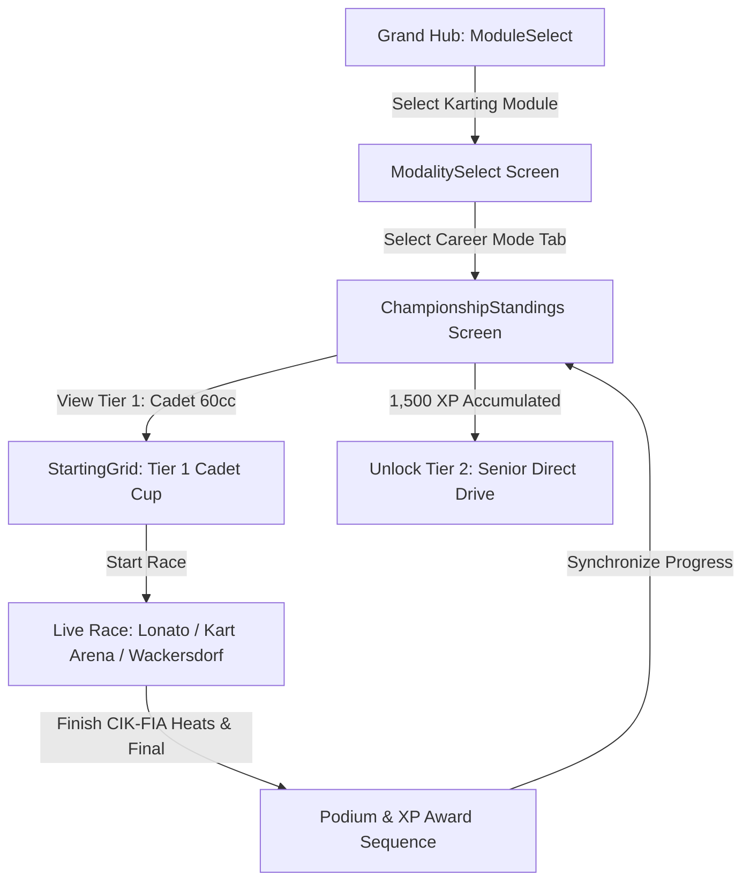

# Feature Spec: Karting World Cup Career Mode 🏎️

The **Karting World Cup Career Mode** establishes the foundational grassroots motorsport ladder in **TdRace**. Serving as the training crucible for all world-class circuit racers, this career tracks the journey of an aspiring driver from junior 60cc cadet karts through direct-drive senior karts, violent 6-speed KZ2 shifters, tuned novelty racing lawnmowers, and the ballistic 240 km/h 250cc Superkart division on full-sized Grand Prix tracks.

---

## 🗺️ User Flow & Interface Design

### 1. Interface Navigation & Screen Flow
The Karting career integrates into `GameState::ModalitySelect` and `GameState::ChampionshipStandings`:



### 2. Visual & Audio Theming
- **Palette**: Karting Racing Green (`Color::new(0.12, 0.78, 0.35, 1.0)`), Electric Yellow (`Color::new(1.0, 0.92, 0.15, 1.0)`).
- **Exposed Driver Rendering**: Dynamic 2D driver model leaning into corners to simulate chassis flex and body weight transfer.
- **Sound Profile**: High-pitched screaming 2-stroke 15,000 RPM acoustics (`EngineAudioProfile::kart_2stroke`) and rumbling V-Twin mower exhaust.

---

## ⚙️ Backend Models & API Endpoints

### 1. SQLite Data Schema & Career Progress
Career state is persisted in SQLite via `ModuleCareerProgress` in [`crates/tdrace-app/src/profile/mod.rs`](../crates/tdrace-app/src/profile/mod.rs):

```rust
pub struct ModuleCareerProgress {
    pub profile_id: i64,
    pub module_id: String, // "kart"
    pub xp: u64,
    pub level: u32,        // 1..=5
    pub unlocked_cars: Vec<String>,
    pub unlocked_tracks: Vec<String>,
    pub completed_events: Vec<String>,
    pub trophies_gold: u32,
    pub trophies_silver: u32,
    pub trophies_bronze: u32,
    pub updated_at: String,
}
```

### 2. Campaign Launch Endpoint & Session Struct
Implemented in [`crates/tdrace-app/src/game/mod.rs`](../crates/tdrace-app/src/game/mod.rs):
```rust
impl GameApp {
    /// Launches a Karting Career Championship Cup for the given tier (1..=5).
    pub fn start_kart_career_tier(&mut self, tier: u32) {
        let (cup_name, track_ids, car_id) = match tier {
            1 => (
                "Cadet 60cc Junior Invitational (Tier 1)",
                vec!["lonato".to_string(), "kart_arena".to_string(), "wackersdorf".to_string()],
                "crg_hero_60",
            ),
            2 => (
                "Senior 100cc Direct-Drive Masters (Tier 2)",
                vec!["sarno".to_string(), "drift_park".to_string(), "kristianstad".to_string()],
                "tony_401_ok",
            ),
            3 => (
                "KZ2 125cc Shifter European Cup (Tier 3)",
                vec!["genk".to_string(), "pfi".to_string(), "castelletto_7laghi".to_string()],
                "birel_kz2",
            ),
            4 => (
                "Racing Lawnmower Grand Prix (Tier 4)",
                vec!["zuera".to_string(), "franciacorta".to_string(), "ampfing".to_string()],
                "john_deere_spec",
            ),
            _ => (
                "Superkart 250cc World Series (Tier 5)",
                vec!["le_mans_karting".to_string(), "portimao_kart".to_string(), "silverstone_kart".to_string()],
                "anderson_cs250",
            ),
        };
        // Initializes ChampionshipSession with CIK-FIA Sprint Cup rules
    }
}
```

---

## 🛡️ Security & Role-Based Access Controls (RBAC)

### 1. Career License Gating & Profile Integrity
- **Tier 1 (Cadet 60cc)**: Unlocked by default for all profiles (`xp >= 0`).
- **Tier 2 (Senior 100cc Direct Drive)**: Requires Career Level 2 (`xp >= 1,500`).
- **Tier 3 (KZ2 Shifter 125cc)**: Requires Career Level 3 (`xp >= 3,500`).
- **Tier 4 (Racing Lawnmower)**: Requires Career Level 4 (`xp >= 6,500`).
- **Tier 5 (Superkart 250cc GP)**: Requires Career Level 5 (`xp >= 10,000`).
- **Dev Mode Bypass**: When `dev_mode: true` is configured, all tiers, tracks, and vehicles are unlocked for testing without modifying saved profile progress.

---

## 1. 5-Tier Vehicle Hierarchy & Prototypical Engineering Specs

```
                     KARTING VEHICLE SILHOUETTES (LATERAL 2D)
                     
    Tier 1-3 Sprint & Shifter Karts (60cc / 100cc / 125cc):
             Exposed Driver
                (•_•)
              ___| |____
          ===[ Tubular Chassis ]===
             (O)             (O)

    Tier 4 Racing Lawnmower (Mean Mower V2 / John Deere Spec):
              (•_•)   [Cutter Deck]
             /| |____/‾‾‾‾|____
          ===[ High-CG Hood    ]===
             (O)             (O)

    Tier 5 Superkart 250cc (Anderson CS250 / MS Kart):
             [Cockpit Fairing]     [High GT Rear Wing]
                (•_•)                 |‾|
           ____/_| |____\__________   |_|
        ==[ Low-Drag Ground Effects ]===
          (O)                     (O)
```

### 1.1 Tier 1: Cadet Kart 60cc / Junior Starter (Momentum Conservation)
* **Design Philosophy:** Entry-level tubular steel kart powered by a centrifugal clutch 60cc 2-stroke engine. With minimal power, any unnecessary steering scrub or sliding dramatically bleeds speed, teaching drivers the supreme value of smooth geometric racing lines.
* **Core Physics:**
  * Power: $10\,\text{BHP}$ ($7.5\,\text{kW}$) 60cc 2-stroke ($11,000\,\text{RPM}$).
  * Total Weight with Driver ($m$): $105.0\,\text{kg}$ | Polar Inertia ($I_z$): $68.0\,\text{kg}\cdot\text{m}^2$.
  * Drive Layout: Rear-Wheel Drive (`drive_bias: 0.0`), direct live axle (no differential).
  * Top Speed ($v_{\text{max}}$): $23.6\,\text{m/s}$ ($\approx 85\,\text{km/h}$).
  * Steering: $1:1$ direct ratio, steering lock: $0.48\,\text{rad}$ ($27.5^\circ$), ultra-fast $12.0\,\text{rad/s}$ response.
  * Chassis Flex: Solid chromoly tube frame; inside rear wheel lifts automatically during cornering via front caster geometry.
* **Prototypical Vehicles:**
  1. **CRG Hero 60cc:** Lightweight 28mm chassis tubing, predictable front-end turn-in bite.
  2. **Birel ART C28:** High rear-end stability, forgiving over apex curbs.
  3. **Tony Kart Neos:** Signature green OTK magnesium wheels, razor-precise line holding.

### 1.2 Tier 2: Senior Kart 100cc / Direct Drive (High-Rev Pure Direct)
* **Design Philosophy:** Purist 100cc single-gear direct drive kart reaching 110 km/h with no gearbox or clutch. High cornering speeds and extreme lateral grip require disciplined trail-braking and physical neck endurance.
* **Core Physics:**
  * Power: $30\,\text{BHP}$ ($22.4\,\text{kW}$) 100cc / 125cc OK direct-drive ($15,500\,\text{RPM}$).
  * Total Weight with Driver ($m$): $140.0\,\text{kg}$ | Polar Inertia ($I_z$): $95.0\,\text{kg}\cdot\text{m}^2$.
  * Top Speed ($v_{\text{max}}$): $30.5\,\text{m/s}$ ($\approx 110\,\text{km/h}$).
  * Braking: Single rear hydraulic ventilated disc brake; locks easily under panic braking.
  * Lateral Grip: Up to $2.6\,\text{G}$ on sticky CIK-FIA prime slick tires ($D = 1.32$).
* **Prototypical Vehicles:**
  1. **Tony Kart Racer 401 RR OK:** The global benchmark; perfect balance between chassis flex and lateral grip.
  2. **CRG KT2:** 30mm chassis tubing offering superior mid-corner bite on rubbered-in tracks.
  3. **Birel ART RY30:** Exceptional straight-line stability and compliance over harsh curb strikes.

### 1.3 Tier 3: Shifter Kart 125cc / 6-Speed KZ2 (The Pinnacle of Sprint Karting)
* **Design Philosophy:** The undisputed pinnacle of sprint karting. 50 BHP 6-speed sequential gearbox, 4-wheel disc brakes with front hand-lever modulation, and standing starts that catapult the kart from $0$–$100\,\text{km/h}$ in under $3.0\,\text{seconds}$ with up to $3.5\,\text{G}$ lateral cornering loads.
* **Core Physics:**
  * Power: $50\,\text{BHP}$ ($37.3\,\text{kW}$) 125cc water-cooled 2-stroke ($14,500\,\text{RPM}$).
  * Total Weight with Driver ($m$): $175.0\,\text{kg}$ | Polar Inertia ($I_z$): $120.0\,\text{kg}\cdot\text{m}^2$.
  * Transmission: 6-speed sequential dogbox with manual clutch for standing grid starts.
  * Brakes: 4-wheel disc brakes (front and rear) allowing aggressive late-braking passes.
  * Top Speed ($v_{\text{max}}$): $38.9\,\text{m/s}$ ($\approx 140\,\text{km/h}$).
  * Acceleration: $0$–$100\,\text{km/h}$ in $2.9\,\text{s}$ ($F_{\text{drive,max}} = 4,200\,\text{N}$).
* **Prototypical Vehicles:**
  1. **Birel ART KZ2:** Championship-winning red chassis, explosive gear shifts, surgical front braking.
  2. **CRG Road Rebel KZ:** 32mm heavy-gauge frame engineered to handle brutal standing launches.
  3. **Tony Kart Racer KZ:** OTK magnesium components, optimal balance through high-speed esses.

### 1.4 Tier 4: Racing Lawnmower / Cortacésped Tuned (Novelty High-CG Brawler)
* **Design Philosophy:** Heavily tuned racing lawnmowers built for extreme lawnmower racing championships. High center of gravity, narrow track width, continuous power oversteer, and dramatic curb hopping deliver wild arcade fun.
* **Core Physics:**
  * Power: $40\,\text{BHP}$ ($29.8\,\text{kW}$) tuned $850\text{cc}$ V-Twin engine ($8,000\,\text{RPM}$).
  * Curb Weight ($m$): $210.0\,\text{kg}$ | Center of Gravity Height ($h_{\text{cg}}$): $0.58\,\text{m}$ (Significant body roll).
  * Wheelbase: $1.15\,\text{m}$ | Track Width: $0.85\,\text{m}$ (Narrow track creates lively tip-toe balance).
  * Handling Quirks: Power oversteer on corner exit; bumps and curbs cause hilarious pitch oscillations.
  * Top Speed ($v_{\text{max}}$): $33.3\,\text{m/s}$ ($\approx 120\,\text{km/h}$).
* **Prototypical Vehicles:**
  1. **John Deere Spec Racing Mower:** Classic green & yellow livery, steel cutting deck frame, robust curb tolerance.
  2. **Honda Mean Mower V2:** Lightweight CBR1000RR-inspired monster, screaming exhaust tone, explosive power slides.
  3. **Viking T6 Tuned:** High-torque Austrian V-Twin, wide rear turf slicks for maximum power drift angles.

### 1.5 Tier 5: Superkart 250cc / Twin-Cylinder GP (Ballistic Pocket Missile)
* **Design Philosophy:** Full-size Grand Prix karting monsters with complete fiberglass aerodynamic fairings, front nose wings, side air extractors, and giant rear dual-element wings. Designed to race on full-sized F1 circuits at speeds exceeding $240\,\text{km/h}$.
* **Core Physics:**
  * Power: $100\,\text{BHP}$ ($74.6\,\text{kW}$) 250cc twin-cylinder tandem 2-stroke ($13,500\,\text{RPM}$).
  * Total Weight with Driver ($m$): $230.0\,\text{kg}$ | Polar Inertia ($I_z$): $160.0\,\text{kg}\cdot\text{m}^2$.
  * Power-to-Weight Ratio: $435\,\text{BHP/tonne}$ ($0$–$100\,\text{km/h}$ in $2.4\,\text{s}$).
  * Aerodynamics: Full ground effects floor, front splitter, high rear wing ($C_L \cdot A = 1.65$, $C_d \cdot A = 0.42$).
  * Top Speed ($v_{\text{max}}$): $66.7\,\text{m/s}$ ($\approx 240\,\text{km/h}$).
* **Prototypical Vehicles:**
  1. **Anderson CS250:** Multi-time European Superkart champion chassis, supreme aerodynamic stability down GP straights.
  2. **MS Kart Superkart 250:** Advanced composite fairing, high downforce through high-speed sweepers.
  3. **VIPER 250 Twin:** Roaring bespoke twin-cylinder powerplant, relentless acceleration past $200\,\text{km/h}$.

---

## 2. 17-Venue Multi-Tier Championship Calendar

```
                      KARTING WORLD CUP 17-VENUE CALENDAR
                      
[Tier 1: Junior Proving Grounds & Cadet Cradles - 5 Starter Circuits]
 ├─ South Garda Karting (lonato - 1.200 km Mecca of Karting Pettine Hairpin)
 ├─ Karting Genk (genk - 1.360 km Home of Champions G-Curve Carousel)
 ├─ Prokart Raceland Wackersdorf (wackersdorf - 1.190 km German Arena Chicane Sweeps)
 ├─ Laval - Circuit Louis Beuvron (laval_kart - 1.232 km Historic French Cadet Proving Ground)
 └─ Whilton Mill Kart Circuit (whilton_mill - 1.200 km UK Cadet Elevation Drops)
 
[Tier 2: Speed Temples & Nordic Layouts - 3 Circuits]
 ├─ Circuito Internazionale Napoli (sarno - 1.550 km Temple of Speed Under Vesuvius)
 ├─ Kristianstad Karting Klubb (kristianstad - 1.234 km Technical Swedish World Circuit)
 └─ Circuito Internazionale 7 Laghi (seven_laghi - 1.256 km Italian Lakeside Switchbacks)
 
[Tier 3: The FIA Champions Arena & Flyover Bridges - 3 Circuits]
 ├─ PF International Kart Circuit (pfi - 1.382 km Elevated Flyover Bridge & Underpass)
 ├─ Franciacorta Karting Track (franciacorta - 1.300 km Modern Italian Complex Curves)
 └─ Schweppermannring Ampfing (ampfing - 1.063 km Bavarian Flowing Outdoor Arenas)
 
[Tier 4: Long European Straights & National Sprints - 3 Circuits]
 ├─ Circuito Internacional de Zuera (zuera - 1.700 km Ultra-Fast Spanish Slipstream Straight)
 ├─ Silverstone National Karting (silverstone_national_kart - 1.450 km F1 Stowe Arena)
 └─ Le Mans Karting International (le_mans_kart - 1.384 km Alain Prost 24H Arena)
 
[Tier 5: Grand Prix Cathedrals & High-Aero Tracks - 3 Circuits]
 ├─ Kartódromo do Algarve (portimao_kart - 1.531 km Portuguese Rollercoaster)
 ├─ Kartódromo Lucas Guerrero (valencia_kart - 1.428 km Valencian High-Speed Arena)
 └─ Kartcenter Campillos (campillos - 1.580 km Andalusian World Championship Speedway)
```

---

## 3. Career Progression & Scoring Rules

### 3.1 Career Progression & Unlock Requirements

| Career Level | Category | Tier Cup Name | Entry Car Cost | Car Unlocks | Circuit Unlocks (17 Total) |
| :--- | :--- | :--- | :--- | :--- | :--- |
| **Level 1** | Cadet Kart 60cc | **Rotax Junior Academy (Tier 1)** | $1,000\,\text{XP}$ *(Starter free)* | `kart_crg_hero_60`, `kart_birel_c28`, `kart_tony_kart_neos` | `lonato`, `genk`, `wackersdorf`, `laval_kart`, `whilton_mill` |
| **Level 2** | Senior Kart 100cc OK | **National Kart Championship (Tier 2)** | $2,000\,\text{XP}$ | `kart_tony_kart_racer_ok`, `kart_crg_kt2_ok`, `kart_birel_ry30_ok` | `sarno`, `kristianstad`, `seven_laghi` |
| **Level 3** | Shifter Kart 125cc KZ2 | **Continental Rotax Trophy (Tier 3)** | $3,000\,\text{XP}$ | `kart_birel_art_kz2`, `kart_crg_road_rebel_kz`, `kart_tony_kart_racer_kz` | `pfi`, `franciacorta`, `ampfing` |
| **Level 4** | Racing Lawnmower | **FIA Karting European Championship (Tier 4)** | $4,000\,\text{XP}$ | `kart_honda_mean_mower`, `kart_john_deere_racing_mower`, `kart_viking_t6_tractor` | `zuera`, `silverstone_national_kart`, `le_mans_kart` |
| **Level 5** | Superkart 250cc GP | **FIA Karting World Championship (Tier 5)** | $5,000\,\text{XP}$ | `kart_anderson_cs250`, `kart_ms_superkart_250`, `kart_viper_250_twin` | `portimao_kart`, `valencia_kart`, `campillos` |

### 3.2 CIK-FIA Sprint Cup Tournament Rules & Scoring
Career tier cups implement FIA Standard points progression (`PointSystem::FiaStandard { fastest_lap_bonus: true }`):
- 1st: $25\,\text{pts}$ ($+350\,\text{XP}$, Gold Trophy)
- 2nd: $18\,\text{pts}$ ($+220\,\text{XP}$, Silver Trophy)
- 3rd: $15\,\text{pts}$ ($+180\,\text{XP}$, Bronze Trophy)
- 4th: $12\,\text{pts}$ ($+100\,\text{XP}$)
- 5th: $10\,\text{pts}$ ($+80\,\text{XP}$)
- 6th: $8\,\text{pts}$ ($+60\,\text{XP}$)
- **Fastest Lap Bonus**: $+1\,\text{pt}$ and $+50\,\text{XP}$ awarded to the driver setting the quickest lap in the final.

---

## 🧪 Verification & Acceptance Criteria

### Automated Tests
- Command to run workspace unit tests: `cargo test --package tdrace-app --test profile_tests`
- Command to run kart circuit suite: `cargo test --package tdrace-app --test kart_tracks_tests`
- Command to run series tournament tests: `cargo test --package tdrace-app --test series_tests`
- Command to test wheelbase physics: `cargo test --package wheelbase`

### Manual Acceptance Criteria (Pseudo-Gherkin)

- **Scenario: Junior driver starts Cadet 60cc Career**
  - [x] **Given** the player selects the "kart" module with a fresh profile
  - [x] **When** the player enters Career Mode via `start_kart_career_tier(1)`
  - [x] **Then** Tier 1 "Rotax Junior Academy (Tier 1)" is active with `tier == 1`
  - [x] **And** cars "kart_crg_hero_60", "kart_birel_c28", and "kart_tony_kart_neos" are available
  - [x] **And** 5 circuits are available: "lonato", "genk", "wackersdorf", "laval_kart", and "whilton_mill"

- **Scenario: Racing Lawnmower handles with high center of gravity roll**
  - [x] **Given** the player selects "kart_honda_mean_mower" at "ampfing"
  - [x] **When** cornering at peak lateral load
  - [x] **Then** the vehicle chassis rolls outward due to higher center of gravity ($h_{\text{cg}} = 0.58\,\text{m}$)
  - [x] **And** hopping over track curbs induces playful pitch oscillations

- **Scenario: Podium finish and spendable XP unlocks Tier 2**
  - [x] **Given** the player finishes Tier 1 with at least 1 podium trophy and 2,000 spendable XP
  - [x] **When** `advance_tier()` is invoked on `ModuleCareerProgress`
  - [x] **Then** player career level advances to 2
  - [x] **And** "sarno", "kristianstad", and "seven_laghi" are unlocked in the track registry
  - [x] **And** Senior OK kart models ("kart_tony_kart_racer_ok", etc.) become selectable

---

## 🔗 Traceability & Codebase Mapping

### Created/Modified Files
- `[IMPLEMENTED]` `crates/tdrace-app/src/module/kart.rs` -> Karting module vehicles, themes, and 17 track definitions.
- `[IMPLEMENTED]` `crates/tdrace-app/src/catalog/mod.rs` -> Authentic real-world car models for Tiers 1–5.
- `[IMPLEMENTED]` `crates/tdrace-app/src/profile/mod.rs` -> Governs `ModuleCareerProgress`, 17-circuit unlock synchronization, and two-condition advancement.
- `[IMPLEMENTED]` `crates/tdrace-app/src/game/mod.rs` -> Launches `start_kart_career_tier` campaign cups with `.with_tier(tier)`.
- `[IMPLEMENTED]` `crates/wheelbase/src/surface.rs` -> Implements zero-suspension direct 1:1 steering response.
- `[IMPLEMENTED]` `crates/tdrace-app/tests/profile_tests.rs` -> Automated verification of career launchers and progression.
- `[IMPLEMENTED]` `crates/tdrace-app/tests/kart_tracks_tests.rs` -> Full physical simulation and geometry verification for all 17 circuits.

### Beads Epic Mapping
- Governed by active parent Epic `tdrace-e09k` (*Fulfill Spec 004: Karting World Cup Career Mode*).
