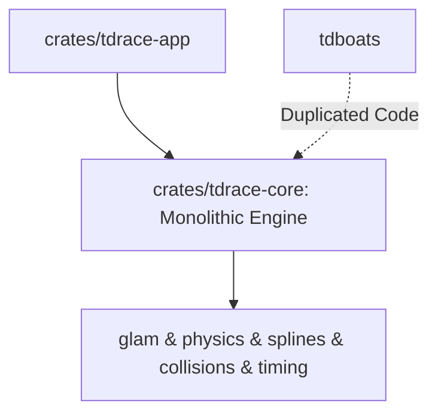
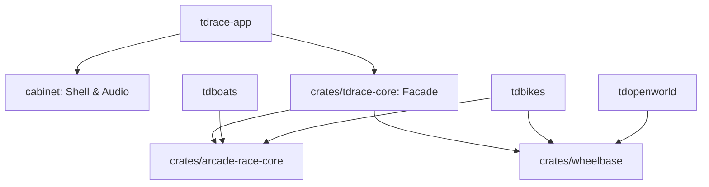

# Architecture Spec: Modular Motorsport Architecture (wheelbase & arcade-race-core) 🏗️

A comprehensive technical architecture establishing the extraction and modularization of two reusable, independent Rust engine crates from [`crates/tdrace-core`](../crates/tdrace-core):

1. **`wheelbase`**: A dedicated 2D/2.5D wheeled vehicle physics engine implementing 4-wheel (car/kart/truck) and 2-wheel (motorbike) Pacejka tire dynamics, dynamic weight transfer, chassis assists, and jump ballistics. Completely independent of tracks, splines, or circuit rules.
2. **`arcade-race-core`**: A course geometry, collision, timing, and perception engine implementing 2D continuous SAT OBB collision resolution, Catmull-Rom course splines, directional checkpoint gates, sector timing, racing LIDAR raycasting, and headless scanline rasterization. Completely independent of vehicle-specific propulsion models.

---

## 🗺️ Current vs. Proposed System Architecture

### 1. Current Architecture (Monolithic Core)
Prior to this architectural migration, [`crates/tdrace-core`](../crates/tdrace-core) contained tightly coupled domain logic combining vehicle physics, Catmull-Rom spline curves, SAT polygon collisions, timing gates, LIDAR perception, and software rendering in a single crate. This prevented reusability across other games in the arcade ecosystem (such as `tdboats`, `tdbikes`, or `tdopenworld`) and created artificial compile-time and testing dependencies.



### 2. Proposed Architecture (Modular Engine Suite)
The engine is decomposed into independent layers with clean dependency boundaries:



### Target Multi-Game Ecosystem Architecture

```
                                  ┌───────────────────────────────────────────────┐
                                  │                    cabinet                    │
                                  │   (2D Arcade Shell, Scaler, Audio, Gamepad)   │
                                  └───────────────────────┬───────────────────────┘
                                                          │
                                  ┌───────────────────────┴───────────────────────┐
                                  │               arcade-race-core                │
                                  │  • 2D Continuous SAT OBB & Wall Collisions    │
                                  │  • Catmull-Rom Splines & Course Ribbons       │
                                  │  • Directional Checkpoints & Sector Timing    │
                                  │  • 32-Beam Racing LIDAR Raycasting            │
                                  │  • Headless Software RGB Scanline Rasterizer  │
                                  └───────────────┬───────────────────────┬───────┘
                                                  │                       │
                                  ┌───────────────┴───────────┐           │
                                  │         wheelbase         │           │
                                  │ • Pacejka Tire Slip Model │           │
                                  │ • Dynamic Weight Transfer │           │
                                  │ • ABS, TCS, ESC Assists   │           │
                                  │ • 4-Wheel & 2-Wheel Bikes │           │
                                  │ • 2.5D Jump Ballistics    │           │
                                  │ • SurfaceSampler Trait    │           │
                                  └───────────┬───────────────┘           │
                                              │                           │
                                              ▼                           ▼
                 ┌────────────────────────────────────────┐  ┌────────────────────────────┐
                 │                tdrace                  │  │          tdboats           │
                 │      (Top-Down Arcade Motorsport)      │  │  (F1 Tunnel-Hull Hydrodyn) │
                 │ Uses: arcade-race-core + wheelbase     │  │ Uses: arcade-race-core +   │
                 │                                        │  │       hydrodynamics        │
                 └────────────────────────────────────────┘  └────────────────────────────┘
```

### Module 1: `crates/wheelbase` Layout
- `wheelbase::surface`: `SurfaceProperties` and `SurfaceSampler` trait. Decouples physics from any specific track ribbon or tilemap representation.
- `wheelbase::tire`: Pacejka '89 and '96 Magic Formula equations ($F_y = D \sin(C \arctan(B\alpha - E(B\alpha - \arctan(B\alpha))))$, longitudinal slip ratio, camber thrust).
- `wheelbase::dynamics`: Longitudinal pitch weight transfer ($\Delta F_{z,\text{long}} = \frac{m \cdot a_x \cdot h}{L}$), lateral roll weight transfer ($\Delta F_{z,\text{lat}} = \frac{m \cdot a_y \cdot h}{W}$), ABS, TCS, ESC assists, and 2.5D ballistic jumps.
- `wheelbase::vehicle`: 4-wheel double-track `Car` model, 2-wheel single-track `Motorbike` model with lean angle dynamics ($\tan \phi = \frac{v^2}{R \cdot g}$), wheelies, and stoppies.

### Module 2: `crates/arcade-race-core` Layout
- `arcade_race_core::collision`: Continuous Separating Axis Theorem (SAT) for oriented bounding boxes (`Obb2D`), segment barriers, and impulse resolution.
- `arcade_race_core::course`: Catmull-Rom splines with arc-length parameterization, variable ribbon widths, curb polygons, and surface zone annotations.
- `arcade_race_core::timing`: Directional checkpoint gates, sector split timing, personal best benchmarks, and anti-cheat traversal sequence validation.
- `arcade_race_core::perception`: 32-beam racing LIDAR raycasting against barriers and opponent OBBs.
- `arcade_race_core::rasterizer`: High-speed software RGB scanline rasterizer ($10,000+\,\text{FPS}$) for headless reinforcement learning observations.
- `arcade_race_core::bridge`: `CourseSurfaceBridge` adapter implementing `wheelbase::SurfaceSampler`.

---

## 🗄️ Database & Storage Migration Plan

### 1. Deterministic Replay Compatibility (`.tdr`)
- The binary replay format (`.tdr`) records time-indexed control frames (`VehicleControls`: throttle, steer, brake, handbrake) and verifies checksum hashes across simulation steps.
- **Zero-Regression Invariant**: Extracting `wheelbase` and `arcade-race-core` must produce mathematically identical floating-point state trajectories for all existing `.tdr` replay files.

### 2. Circuit JSON Serialization
- All track files in `tracks/**/*.json` are serialized using `serde`.
- `arcade-race-core` maintains strict backward compatibility for legacy single-spline tracks while enabling forward-compatible fields for multi-branch graphs.

### 3. Thin Facade Pattern for Downstream Stability
- [`crates/tdrace-core`](../crates/tdrace-core) is refactored into a thin facade re-exporting `wheelbase::*` and `arcade_race_core::*`.
- `crates/tdrace-app`, Python bindings (`crates/tdrace-py`), and external tools require zero refactoring of import paths.

---

## 🔑 Security, Compliance, & IAM Roles

### 1. Pure Math & Memory Safety Invariants
- Both `wheelbase` and `arcade-race-core` operate under `#![forbid(unsafe_code)]`.
- Zero network I/O, zero disk I/O, and zero platform-specific API calls inside the core simulation crates.

### 2. Dependency Minimization
- Permitted dependencies: `glam` (vector mathematics), optional `serde` / `serde_json` (feature-gated behind `serde`).
- No rendering dependencies (`macroquad`, `miniquad`, `wgpu`) are permitted inside `wheelbase` or `arcade-race-core`.

### 3. Deterministic Floating-Point Execution
- IEEE 754 floating-point operations maintain deterministic state across x86_64 and aarch64 architectures for identical input streams.

---

## 🛡️ Disaster Recovery, Monitoring, & Fallbacks

### 1. Physics State Sanitization & NaN Fallbacks
- In the event of a division by zero or extreme impulse collision:
  - Velocities, positions, and angular momentum are validated with `.is_finite()` guards every integration step.
  - If non-finite values occur, the chassis falls back safely to its previous valid timestep state without crashing the host game loop.

### 2. Performance Regressions Monitoring
- Continuous benchmarks ensure performance thresholds:
  - Pure physics step throughput: $\ge 4.0\text{M steps/sec}$.
  - Continuous SAT collision checks: $\ge 22.0\text{M checks/sec}$.
  - Software scanline rasterizer: $\ge 10,000\text{ frames/sec}$ in headless mode.

### 3. Rollback Safeguards
- If breaking API deviations are detected in external consumer crates, `crates/tdrace-core` facade re-exports can be pinned or rolled back independently without altering the standalone engines.

---

## 🧪 Verification & Acceptance Criteria

### Automated Tests
- Command to run wheelbase test suite: `cargo test -p wheelbase`
- Command to run arcade-race-core test suite: `cargo test -p arcade-race-core`
- Command to run workspace regression tests: `cargo test --workspace`
- Command to run simulation benchmarks: `cargo bench`

### Manual Acceptance Criteria (Pseudo-Gherkin)

- **Scenario: Standalone crate independence**
  - [x] **Given** the standalone engine crates `crates/wheelbase` and `crates/arcade-race-core`
  - [x] **When** `cargo check -p wheelbase --no-default-features` and `cargo check -p arcade-race-core --no-default-features` are executed
  - [x] **Then** both crates compile cleanly without any dependencies on each other or external rendering libraries

- **Scenario: Course surface bridge sampling**
  - [x] **Given** a circuit ribbon with asphalt center and grass runoff defined in `arcade-race-core`
  - [x] **When** bridged to `wheelbase::SurfaceSampler` via `CourseSurfaceBridge`
  - [x] **Then** sampling positions on the asphalt returns friction $1.0$, while off-track positions return friction $0.3$

- **Scenario: Continuous SAT collision detection**
  - [x] **Given** two high-velocity `Obb2D` vehicles on intersecting trajectories
  - [x] **When** evaluated by `arcade_race_core::collision::sat::collide_obb_obb`
  - [x] **Then** the collision contact normal and penetration depth are accurately computed without tunneling artifacts

---

## 🔗 Traceability & Codebase Mapping

### Created/Modified Crates
- `[x]` [`crates/wheelbase/src/lib.rs`](../crates/wheelbase/src/lib.rs) -> Standalone Pacejka vehicle dynamics engine.
- `[x]` [`crates/arcade-race-core/src/lib.rs`](../crates/arcade-race-core/src/lib.rs) -> Standalone course geometry, SAT collision, and timing engine.
- `[x]` [`crates/tdrace-core/src/lib.rs`](../crates/tdrace-core/src/lib.rs) -> Thin facade re-exporting `wheelbase` and `arcade-race-core`.

### Beads Epic Mapping
- Governed by completed Epic `tdrace-modular-racing-arch-gnj` (*Modular Racing Architecture: Extract wheelbase and arcade-race-core*).
