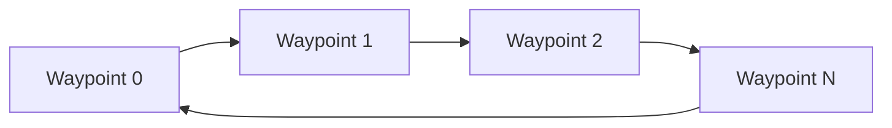
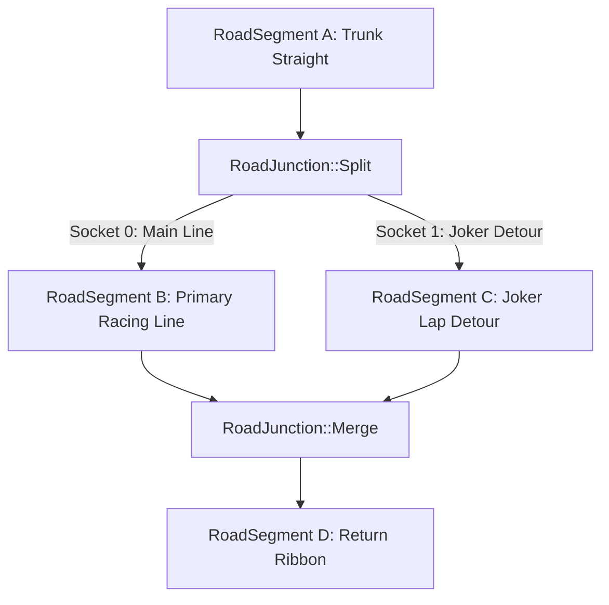

# Architecture Spec: Road Split Segments, Branching Splines & Alternative Circuit Layouts 🏗️

A comprehensive technical architecture introducing the **Directed Ribbon Graph (`TrackNetwork`)** in **TdRace**. This architecture replaces the legacy single-spline limitation with a flexible topological network capable of modeling road bifurcations, branching splines, Rallycross Joker Laps, pit lane loops, and multiple named track configurations within a single circuit definition.

---

## 🗺️ Current vs. Proposed System Architecture

### 1. Current Architecture (Single Monolithic Spline Ribbon)
Previously, circuits were modeled as a single linear sequence of waypoints defined by `TrackSpline` (`Vec<TrackWaypoint>`), which could only be a closed cyclic loop or an open point-to-point path:
- **No Branching or Splits**: Bifurcations or alternate racing lines could not exist.
- **Duplicated Circuit Files**: Alternate real-world configurations (e.g., Silverstone GP vs National vs International) required duplicating track files, even when sharing $70\%+$ of their asphalt ribbon.
- **No Joker Laps**: Rallycross circuits could not support the mandatory alternate Joker Lap detour.



### 2. Proposed Architecture (Directed Ribbon Graph: `TrackNetwork`)
Circuits transition to a directed topological graph where **Road Segments** (edges) connect at **Road Junctions** (nodes):



### Core Domain Model & Mathematical Primitives
- **`SplineSocket`**: Connection port guaranteeing $C^1$ positional and tangent continuity across connecting splines ($\Delta \theta < 10^{-4}\,\text{rad}$). Preceding "ghost" points ($P_{-1} = \text{socket.point} - \text{socket.tangent} \cdot \Delta d$) ensure derivative smoothness in Catmull-Rom evaluations.
- **`RoadJunction`**: Split junctions (1 ingress $\to N$ egress sockets with Hermite width expansion and gore apex crash attenuators), Merge junctions ($N$ ingress $\to 1$ egress socket), or Terminals.
- **`RoadSegment`**: Independent Catmull-Rom spline ribbon with arc-length parameterization, uniform samples, walls, and connection ports.
- **`TrackLayout`**: Named circuit walk specifying an ordered sequence of segment IDs (`"grand_prix"`, `"joker_lap"`, `"club"`).
- **`MultiRouteProgressTracker`**: Extended race timing tracking the active route context, branch checkpoints, and automatic Joker Lap detection.
- **`BotRouteStrategy`**: Strategic AI navigation supporting fixed layouts, planned/adaptive Joker laps, and dynamic traffic avoidance across junction horizons.

---

## 🗄️ Database & Storage Migration Plan

### 1. Backward-Compatible Track Schema (`Track`)
To ensure zero breakage for existing circuits (`tracks/classic/*.json`, `tracks/f1/*.json`, `tracks/rally/*.json`), the root `Track` struct preserves the legacy `spline` field alongside the new `network` graph:

```rust
#[derive(Debug, Clone, PartialEq, Serialize, Deserialize)]
pub struct Track {
    pub name: String,
    pub spline: TrackSpline, // Preserved for backward compatibility
    #[serde(default, skip_serializing_if = "Option::is_none")]
    pub network: Option<TrackNetwork>, // Advanced multi-branch graph
    pub geometry: TrackGeometry,
    pub checkpoints: Vec<Checkpoint>,
    pub grid_positions: Vec<SpawnPose>,
    pub default_surface: SurfaceType,
}
```

### 2. Transparent In-Memory Auto-Promotion
When loading any legacy track file without a `network` block:
- `Track::ensure_network()` automatically constructs a 1-segment cyclic `TrackNetwork` containing `track.spline.waypoints`.
- A default `TrackLayout` named `"main"` is synthesized.
- All downstream physics, AI, and rendering operate uniformly on `TrackNetwork` without requiring destructive batch migration of disk assets.

---

## 🔑 Security, Compliance, & IAM Roles

### 1. Anti-Cheat Race Timing & Sequence Validation
- Directional checkpoint gates validate normal vectors to prevent shortcuts or reverse driving across junction boundaries.
- The `MultiRouteProgressTracker` enforces mandatory checkpoint traversal sequences defined by the active `TrackLayout`.
- Any unapproved deviation or skipping of branch checkpoints invalidates the current lap time.

### 2. Geometry Validation Invariants
- `validate_track()` executes automated sanity checks:
  - Verifies $C^1$ tangent continuity across all connected sockets.
  - Verifies that all layouts form closed loops with a valid Start/Finish line.
  - Ensures no open gaps between segment boundary walls.

---

## 🛡️ Disaster Recovery, Monitoring, & Fallbacks

### 1. Route Resolution Fallback
- If a vehicle deviates from all recognized layouts during a chaotic collision:
  - The tracker falls back gracefully to the primary `"main"` layout based on nearest segment projection.
  - Ghost and lap timers enter an untimed "recovery" state rather than crashing the race simulation.

### 2. AI Navigation Horizon Safeguards
- If an AI bot reaches an unmapped junction socket:
  - The steering controller smoothly projects lookahead targets along the tangent of the current segment rather than producing NaN steering angles.

---

## 🧪 Verification & Acceptance Criteria

### Automated Tests
- Command to run track graph unit tests: `cargo test -p arcade-race-core track::network`
- Command to run checkpoint tracker tests: `cargo test -p arcade-race-core track::checkpoint`
- Command to run track editor tests: `cargo test -p tdrace-app editor`

### Manual Acceptance Criteria (Pseudo-Gherkin)

- **Scenario: C1 continuity across split socket**
  - [x] **Given** a road split junction connecting a trunk segment to two branch segments
  - [x] **When** waypoints are sampled across the socket seam
  - [x] **Then** the tangent angle divergence $\Delta \theta$ is strictly less than $10^{-4}$ radians with zero lateral acceleration spikes

- **Scenario: Dynamic Joker Lap detection**
  - [x] **Given** a Rallycross track with Main Line (`CP 2A`) and Joker Lap (`CP 2B`)
  - [x] **When** a vehicle enters the Joker branch and crosses `CP 2B`
  - [x] **Then** the tracker registers the Joker Lap as completed and updates the HUD display accordingly

- **Scenario: Backward compatibility for legacy tracks**
  - [x] **Given** a legacy track file serialized without a `network` block
  - [x] **When** parsed via `Track::from_json` and initialized with `ensure_network()`
  - [x] **Then** a 1-segment cyclic network is synthesized and all race laps complete without error

---

## 🔗 Traceability & Codebase Mapping

### Created/Modified Crates
- `[x]` [`crates/arcade-race-core/src/track/mod.rs`](../crates/arcade-race-core/src/track/mod.rs) -> `TrackNetwork`, `RoadSegment`, `RoadJunction`, and `SplineSocket`.
- `[x]` [`crates/arcade-race-core/src/track/checkpoint.rs`](../crates/arcade-race-core/src/track/checkpoint.rs) -> `MultiRouteProgressTracker` and branch gate validation.
- `[x]` [`crates/tdrace-app/src/editor/tools.rs`](../crates/tdrace-app/src/editor/tools.rs) -> Road split and branch extension track editor tooling.

### Beads Epic Mapping
- Governed by completed Epic `tdrace-road-split-branching-tracks-kjl6` (*Road Split Segments, Branching Splines & Alternative Circuit Layouts*).
