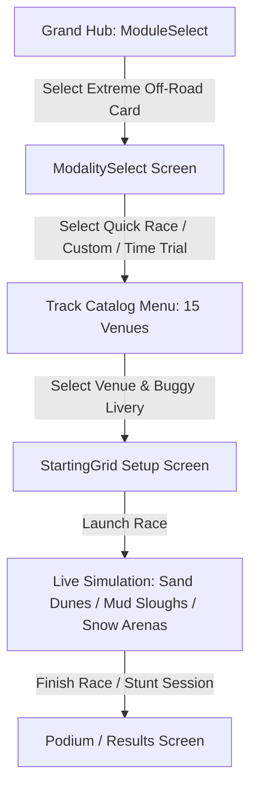

# Feature Spec: Extreme Off-Road & Stunt Arenas Module 🌟

A comprehensive gameplay and physics module expanding **TdRace** into extreme off-road terrain, rhythm whoops, big-air jump ballistics, and open stunt arenas. Centered on the hero vehicle—an ultralight $590\,\text{kg}$ chromoly spaceframe **Sand Rail Buggy** with a 300 BHP turbo boxer engine—this module breaks the 1D spline corridor paradigm with first-class support for bounded 2D arena fields and 15 diverse real-world inspired motorsport venues.

---

## 🗺️ User Flow & Interface Design

### 1. Interface Navigation & Screen Flow
The module is integrated as a premier card in the Grand Hub and Race Modality Selection:



### 2. Vehicle Visuals & 2.5D Rendering Pipeline
- **Hero Vehicle (`VehicleVisualType::SandRail`)**:
  - Multi-segment tubular chromoly roll cage rendered with metallic tubular shading.
  - High-profile knobby front tires and wide paddle rear sand tires with colored beadlock rings.
  - Visible rear-mounted flat-four boxer engine block with dual upswept exhaust stingers emitting overrun backfire flashes.
  - Flexible rear whip antenna deflecting backwards based on vehicle velocity ($-\mathbf{v} \cdot 0.04$) waving a fluorescent safety pennant.
  - Rooftop LED lightbar with 4 round off-road floodlights.
  - Visible animated driver figure with full-face off-road helmet, tinted goggles, and racing harness.
- **Audio Profile (`EngineAudioProfile::sand_rail_boxer`)**:
  - Raspy, high-revving 4-cylinder boxer engine with straight-cut dog-box transmission whine.
  - Overrun deceleration exhaust pops and distinct suspension compression thuds on jump landings.

### 3. Venue Catalog (15 Venues)
1. **Sahara Dune Crossing**: High-speed desert sprint circuit with progressive crest jumps ($2,150\,\text{m}$).
2. **Dirt Figure Eight**: Stadium cross-over circuit with twin $18^\circ$ clay berms ($850\,\text{m}$).
3. **Atacama Sand Basin**: Hyper-speed desert ring reaching $200\,\text{km/h}$ terminal velocity ($2,650\,\text{m}$).
4. **Red Rock Canyon**: Narrow technical gorge bounded by sheer vertical red rock cliffs ($1,580\,\text{m}$).
5. **Baja 500 Desert Scrub**: Open desert endurance course featuring 12-bump whoops rhythm sections ($3,100\,\text{m}$).
6. **Mud Slough Arena**: Enclosed $140\,\text{m} \times 105\,\text{m}$ mud bog arena with tractor tire barriers.
7. **Gravel Quarry Chasm**: 4-tier industrial terrace descent with $7\,\text{m}$ vertical cliff drops ($1,720\,\text{m}$).
8. **Louisiana Mud Swampland**: Bayou circuit weaving through moss cypress trees and deep water troughs ($1,420\,\text{m}$).
9. **Arctic Frozen Lake**: $240\,\text{m} \times 160\,\text{m}$ open ice expanse ($\mu=0.08$) with soft snowbank berms.
10. **Alpine Snow Ridge**: Point-to-point $12\%$ snow hillclimb with sub-zero black ice ($1,850\,\text{m}$).
11. **Rovaniemi Ice Ring**: Nordic ice circuit illuminated by night floodlights ($1,250\,\text{m}$).
12. **Glacier Crest Pass**: Knife-edge glacial ridge with bottomless crevasse gap jumps ($1,980\,\text{m}$).
13. **Supercross Stadium Arena**: Domed football stadium with Supercross triples and a 14-bump whoops section ($160\,\text{m} \times 115\,\text{m}$).
14. **Monster Colosseum**: Demolition stunt arena with central car-crush pyramid and $45^\circ$ monster kickers ($190\,\text{m} \times 140\,\text{m}$).
15. **Stunt City Megastructure**: Urban vertical stunt playground with loop-the-loop and skyscraper wallrides ($220\,\text{m} \times 170\,\text{m}$).

---

## ⚙️ Backend Models & API Endpoints

### 1. The Arena Spatial Topology (`TrackKind`)
Defined in [`crates/arcade-race-core/src/track/mod.rs`](../crates/arcade-race-core/src/track/mod.rs):

```rust
#[derive(Debug, Clone, PartialEq, Serialize, Deserialize)]
#[serde(rename_all = "snake_case")]
pub enum TrackKind {
    /// Traditional 1D continuous spline ribbon with extruded drivable width.
    Circuit,
    /// Bounded 2D open enclosure with fully playable interior floor.
    Arena {
        boundary_hull: Vec<Vec2>,
        floor_surface: SurfaceType,
        perimeter_barrier: BarrierType,
        nav_nodes: Vec<ArenaNavNode>,
    },
    /// Hybrid venue: Stadium bowl enclosing both a defined track and open infield.
    Hybrid {
        boundary_hull: Vec<Vec2>,
        floor_surface: SurfaceType,
        perimeter_barrier: BarrierType,
        mainline_spline: TrackSpline,
    },
}
```

### 2. Vehicle Dynamics & Long-Travel Suspension
Defined in [`crates/wheelbase/src/car.rs`](../crates/wheelbase/src/car.rs):

```rust
pub struct OffRoadSuspensionParams {
    pub spring_rate: f32, // 28,000 N/m (Soft compliance)
    pub rebound_damping: f32, // 3,400 N·s/m
    pub bump_stop_travel: f32, // 0.45 m
    pub landing_absorption_factor: f32, // 2.5x vs standard GT
}
```

- **Airborne Leveling**: Active gyroscopic pitch/roll stabilization ($\tau_{\text{level}} = -k_p \theta - k_d \omega$) dampens chassis oscillation before touchdown.
- **Landing Attenuation**: Vertical velocity impulse $v_z$ is attenuated by $65\%$, preventing catastrophic rebound bounce.

### 3. Surface Physics Multipliers: `Mud` & `Snow`
Defined in [`crates/wheelbase/src/surface.rs`](../crates/wheelbase/src/surface.rs):

| Surface | Friction ($\mu$) | Rolling Resistance | Surface Drag | Visual FX Particle Type |
|---|---|---|---|---|
| **Mud** | $0.52$ | $6.5\times$ | $3.2\times$ | Heavy Brown Mud Spray & Roost Plumes |
| **Snow** | $0.34$ | $3.0\times$ | $1.6\times$ | White Powder Snow Roost & Trenches |

### 4. Module Definition (`ExtremeOffRoadModule`)
Implemented in [`crates/tdrace-app/src/module/extreme_offroad.rs`](../crates/tdrace-app/src/module/extreme_offroad.rs) implementing `GameModule`.

---

## 🛡️ Security & Role-Based Access Controls (RBAC)

### 1. Arena Perimeter Boundary & Anti-Escape Invariants
- `validate_arena_rules` enforces that arena perimeter hulls are strictly closed ($N \ge 3$ vertices).
- Starting grid slots and spectator zones are mathematically checked via point-in-polygon tests to guarantee containment within the boundary hull.
- Continuous SAT collision resolution prevents high-speed vehicle tunneling through perimeter barriers.

### 2. Stunt Target Validation
- Mid-air stunt rings (`CheckpointKind::AerialRing`) require 3D spatial intersection ($z \ge 3.0\,\text{m}$) within a valid velocity envelope to prevent accidental triggers from ground-level driving.

---

## 🧪 Verification & Acceptance Criteria

### Automated Tests
- Command to run wheelbase off-road physics tests: `cargo test -p wheelbase`
- Command to run arena validation tests: `cargo test -p arcade-race-core track::validation`
- Command to run extreme off-road module tests: `cargo test -p tdrace-app module::extreme_offroad`

### Manual Acceptance Criteria (Pseudo-Gherkin)

- **Scenario: Sand Rail Buggy loose surface acceleration**
  - [x] **Given** the Sand Rail Buggy on deep sand or dirt terrain
  - [x] **When** full throttle is applied from a standstill
  - [x] **Then** paddle tire physics attenuate sand rolling resistance penalties and accelerate the vehicle cleanly with high-angle rooster plumes

- **Scenario: Long-travel suspension jump landing**
  - [x] **Given** the Sand Rail Buggy launching off a 45-degree mega-kicker with $z > 4.0\,\text{m}$
  - [x] **When** the vehicle touches down on the arena floor
  - [x] **Then** long-travel damping absorbs $65\%$ of vertical impulse without bounce oscillation or chassis flipping

- **Scenario: Arena boundary containment**
  - [x] **Given** a multi-car demolition or stunt session inside Mud Slough Arena
  - [x] **When** vehicles drift and collide near the perimeter tractor-tire wall
  - [x] **Then** SAT barrier collisions rebound vehicles back into the arena without clipping through vertices

---

## 🔗 Traceability & Codebase Mapping

### Created/Modified Crates
- `[x]` [`crates/wheelbase/src/surface.rs`](../crates/wheelbase/src/surface.rs) -> `SurfaceType::Mud` and `SurfaceType::Snow`.
- `[x]` [`crates/arcade-race-core/src/track/mod.rs`](../crates/arcade-race-core/src/track/mod.rs) -> `TrackKind::Arena` and `TrackKind::Hybrid`.
- `[x]` [`crates/tdrace-app/src/module/extreme_offroad.rs`](../crates/tdrace-app/src/module/extreme_offroad.rs) -> 15 track presets, Sand Rail Buggy definition, and module integration.
- `[x]` [`crates/tdrace-app/src/render/car.rs`](../crates/tdrace-app/src/render/car.rs) -> `VehicleVisualType::SandRail` procedural 2.5D rendering.

### Beads Epic Mapping
- Governed by completed Epic `tdrace-extreme-offroad-2ku0` (*Extreme Off-Road & Stunt Arenas Module*).
