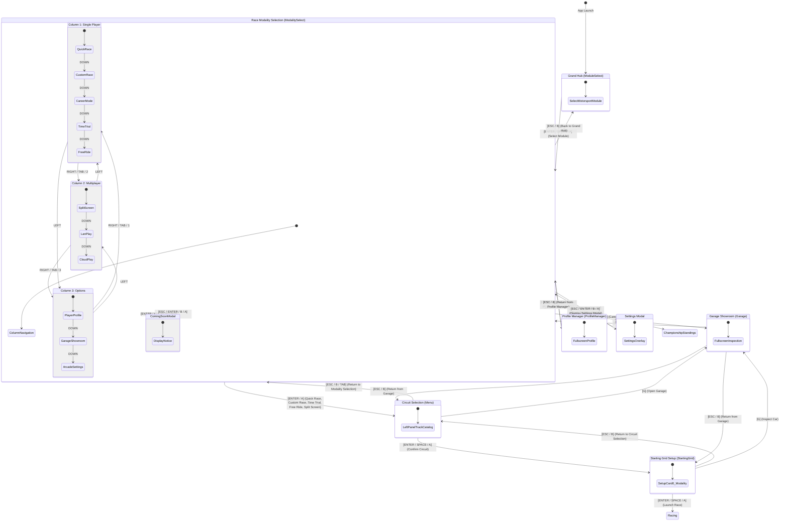

# Feature Spec: Race Modality Selection & Interface Flow Restructuring 🌟

An interface and screen architecture restructuring introducing a dedicated **Race Modality Selection (`GameState::ModalitySelect`)** stage between the **Grand Hub (`ModuleSelect`)** and **Circuit Selection (`Menu`)**. This replaces the legacy friction where players had to choose a circuit before deciding what kind of session to launch, providing clear categorization between Single Player and Multiplayer racing formats.

---

## 🗺️ User Flow & Interface Design

### 1. Navigation Flow & State Machine
The screen architecture separates session configuration from circuit selection:



### 2. 3-Column Modality & Options Architecture

#### Column 1: Single Player Modalities
1. **Quick Race (`ModalityItem::QuickRace`)**: Standard race using the track's official required category vehicle.
2. **Custom Race (`ModalityItem::CustomRace`)**: Unrestricted race with vehicle selection (eligible tier or below), custom bot count, and tuning.
3. **Career Mode (`ModalityItem::CareerMode`)**: Direct gateway into multi-tier championship progression.
4. **Time Trial (`ModalityItem::TimeTrial`)**: Solo session against the clock and ghost shadow.
5. **Free Ride (`ModalityItem::FreeRide`)**: Open practice session with no opponent pressure or lap timers.

#### Column 2: Multiplayer Modalities
1. **2P Split Screen (`ModalityItem::SplitScreen`)**: Local head-to-head split screen on a single display.
2. **LAN Multiplayer (`ModalityItem::LanPlay`)**: Local network matchmaking (*Coming Soon notice modal*).
3. **Cloud Online (`ModalityItem::CloudPlay`)**: Worldwide matchmaking and server lobbies (*Coming Soon notice modal*).

#### Column 3: Options (Player Profile, Garage Showroom & Settings)
1. **Player Profile (`ModalityItem::PlayerProfile`)**: Direct entry to `GameState::ProfileManager` with driver stats, career level, license rating, and profile configuration.
2. **Garage Showroom (`ModalityItem::Garage`)**: Fullscreen inspection (`GameState::Garage(GarageOrigin::ModalitySelect)`), 360° turntable, vehicle specs, and engine rev sampling.
3. **Settings (`ModalityItem::Settings`)**: Opens the modal dialog (`SettingsModal`) for audio, controls, display, and rendering options.

### 3. UI Design Tokens & Shortcuts
- **3 Balanced Columns**: Top tabs partitioned cleanly (`[ 1. SINGLE PLAYER ]`, `[ 2. MULTIPLAYER ]`, `[ 3. OPTIONS ]`).
- **Glass Cards**: Translucent glass cards with 1px border accents, category icon, title, description, and status tags (`OFFICIAL PRESET`, `CUSTOMIZABLE`, `CHAMPIONSHIP`, `SOLO`, `LOCAL`, `COMING SOON`, `PROFILE`, `SHOWROOM`, `SYSTEM`).
- **Direct Shortcuts**: Pressing `[1]`, `[2]`, `[3]` jumps directly between tabs; pressing `[P]`, `[G]`, or `[X]` provides instantaneous one-touch access to Player Profile, Garage, and Settings from any column.
- **Starting Grid Card 0 Refinement**: Card 0 prominently displays the active modality (e.g. `RACING MODALITY: QUICK RACE [PRESET]` or `RACING MODALITY: CUSTOM RACE [CUSTOMIZABLE]`), ensuring full session context before race start.

---

## ⚙️ Backend Models & API Endpoints

### 1. State Machine & Enum Definitions
Implemented in [`crates/tdrace-app/src/game/mod.rs`](../crates/tdrace-app/src/game/mod.rs):

```rust
#[derive(Debug, Clone, Copy, PartialEq, Eq)]
pub enum GameState {
    ModuleSelect,
    ModalitySelect, // Inserted stage
    Menu,
    ChampionshipStandings,
    StartingGrid,
    Racing,
    Podium,
    Garage,
}

#[derive(Debug, Clone, Copy, PartialEq, Eq)]
pub enum ModalityItem {
    QuickRace,
    CustomRace,
    CareerMode,
    TimeTrial,
    FreeRide,
    SplitScreen,
    LanPlay,
    CloudPlay,
    PlayerProfile,
    Garage,
    Settings,
}
```

### 2. Session Configuration Mapping
When a modality is selected, `AppRacingContext` is initialized with corresponding rules:
- `game_mode`: `StandardRace`, `ExperimentalRace`, `Career`, `TimeTrial`, `FreeRide`, or `SplitScreen`.
- `free_car_selection`: `false` for Quick Race; `true` for Custom/Trial/FreeRide.
- `num_bots`: Automatically configured based on modality (0 for solo, 3–7 for grids).

---

## 🛡️ Security & Role-Based Access Controls (RBAC)

### 1. Modality Gating & Coming Soon Modals
- Unimplemented multiplayer modes (`LanPlay`, `CloudPlay`) are protected behind informative modal gates that intercept input and prevent unhandled network state transitions.
- Career Mode options check profile progression to ensure valid tier data before launching championship views.

---

## 🧪 Verification & Acceptance Criteria

### Automated Tests
- Command to run UI navigation tests: `cargo test -p tdrace-app ui::modality_select`
- Command to run state machine flow tests: `cargo test -p tdrace-app game::tests`

### Manual Acceptance Criteria (Pseudo-Gherkin)

- **Scenario: Navigation from Grand Hub to Modality Selection**
  - [x] **Given** the player is in the Grand Hub (`GameState::ModuleSelect`)
  - [x] **When** they select a motorsport module and press `[ENTER]`
  - [x] **Then** the game transitions to `GameState::ModalitySelect` with the Single Player tab focused

- **Scenario: Tab switching between Single Player and Multiplayer**
  - [x] **Given** the player is in `GameState::ModalitySelect`
  - [x] **When** they press `[TAB]`, `[1]`, `[2]`, or controller bumper buttons
  - [x] **Then** the view toggles seamlessly between Single Player and Multiplayer modality cards

- **Scenario: Starting Grid Card 0 reflects chosen modality**
  - [x] **Given** the player launched a Quick Race from Modality Selection
  - [x] **When** they confirm a circuit and enter `GameState::StartingGrid`
  - [x] **Then** Card 0 displays `RACING MODALITY: QUICK RACE [PRESET]` and locks car selection to official track defaults

---

## 🔗 Traceability & Codebase Mapping

### Created/Modified Crates
- `[x]` [`crates/tdrace-app/src/game/mod.rs`](../crates/tdrace-app/src/game/mod.rs) -> State machine integration for `GameState::ModalitySelect`, screen rendering, and Starting Grid Card 0 modality reflection.
- `[x]` [`crates/tdrace-app/tests/modality_flow_tests.rs`](../crates/tdrace-app/tests/modality_flow_tests.rs) -> Integration test suite for modality navigation flow.

### Beads Epic Mapping
- Governed by completed Epic `tdrace-epic-modality-selection-flow-m5qh` (*Refactor: Modality selection screen between Grand Hub and Menu*).
