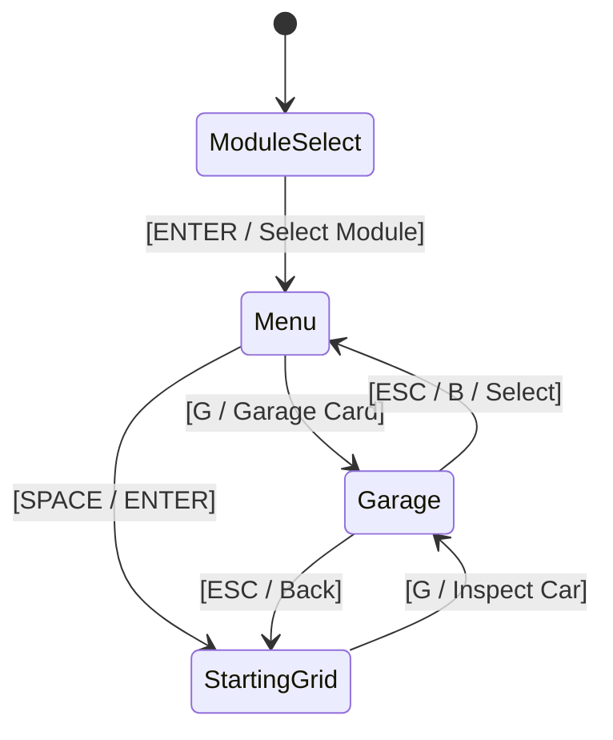

# Feature Spec: Real-World Vehicle Rosters, Physics Balance & Interactive Garage 🏎️🏛️

A comprehensive motorsport simulation expansion migrating **TdRace** from generic prototypical vehicle archetypes to **authentic, real-world motorsport models across all 5 game modules and 25 progression categories**. Accompanied by an intra-class Balance of Performance (BoP) mathematical calibration framework, dual-view 2D vector graphics (live top-down racing + high-fidelity lateral side-profile), and a dedicated **Interactive Garage & Showroom (`GameState::Garage`)**.

```
┌──────────────────────────────────────────────────────────────────────────────────────────────────┐
│                   MIGRATION: PROTOTYPICAL BENCHMARKS ➔ AUTHENTIC REAL-WORLD MODELS               │
├──────────────────────────────────────────────────────────────────────────────────────────────────┤
│                                                                                                  │
│   5 MOTORSPORT MODULES (5 Tiers Each = 25 Categories Total):                                     │
│   ┌──────────────────────────────────────────────────────────────────────────────────────────┐   │
│   │ 1. Gran Turismo & Endurance GT   : GT4 ➔ GT3 ➔ GT2 ➔ GT1 ➔ LMH/LMDh Hypercars            │   │
│   │ 2. NASCAR Stock Car Racing       : Street Stock ➔ Late Model ➔ ARCA ➔ Truck ➔ Trans-Am   │   │
│   │ 3. Rallycross & All-Terrain      : Rally Jr FWD ➔ WRC/RX ➔ Group B ➔ Raid T1+ ➔ SST Truck│   │
│   │ 4. Extreme Off-Road & Arenas     : Sand Rail ➔ Trophy Truck ➔ Arctic Ice ➔ Mud ➔ Monster │   │
│   │ 5. Karting & Micro-Racers        : 60cc Cadet ➔ 100cc OK ➔ 125cc KZ2 ➔ Lawnmower ➔ Super │   │
│   └──────────────────────────────────────────────────────────────────────────────────────────┘   │
│                                                                                                  │
│   DUAL-VIEW GRAPHICS & SHOWROOM SUITE:                                                           │
│   • Live Race Overhead 2D/2.5D : Model-specific silhouettes, splitters, dive planes, wings.     │
│   • High-Fidelity 2D Lateral   : Showroom side profile, brake heat glow, alloys, mirror floor.   │
│   • Interactive Garage         : History dossier, engineering specs, hex radar, rev sampler.     │
│                                                                                                  │
└──────────────────────────────────────────────────────────────────────────────────────────────────┘
```

---

## 🗺️ User Flow & Interface Design

### 1. The Interactive Garage & Showroom (`GameState::Garage`)
Accessible from the Grand Hub, Track Selection Menu (`[G]`), and Starting Grid (`[G]`):

```
┌──────────────────────────────────────────────────────────────────────────────────────────────────┐
│  GARAGE SHOWROOM  │  MODULE: GT WORLD CHALLENGE  [◄ 1..5 ►]  │  CATEGORY: FIA GT3 EVO  [◄ Q/E ►] │
├─────────────────────────────────────────────────────────────┬────────────────────────────────────┤
│                                                             │  SPECIFICATION TELEMETRY           │
│  [2D LATERAL VIEW (ACTIVE)]  [TOP-DOWN VIEW (TAB)]          │  Model:  Ferrari 296 GT3           │
│                                                             │  Engine: 3.0L 120° Twin-Turbo V6   │
│                  /‾‾‾‾‾‾‾‾\____                             │  Power:  600 BHP @ 8,000 RPM       │
│          _______/  Canopy  \   \____                        │  Torque: 712 Nm @ 5,500 RPM        │
│    __===[ Ferrari 296 GT3   \_______]====_  [Wing]          │  Weight: 1,265 kg (44% F / 56% R)  │
│   ( O )================================( O )                │  Top Speed: 301 km/h (83.6 m/s)    │
│                                                             │  0-100 km/h: 2.8s                  │
│   ~~~~~~~~~~~~~~~~~~~~~~~~~~~~~~~~~~~~~~~~~~                │  Aero:   Cl 2.20 / Cd 0.64         │
│   [Floor Mirror Reflection & Ambient Shadow]                │  Brakes: Carbon-Ceramic (22.2 kN)  │
│                                                             ├────────────────────────────────────┤
│  [SPACE: Rev Engine]  [L: Cycle Livery]  [I: Inspect Zoom]  │  PERFORMANCE RADAR (HEX)           │
│                                                             │  Speed:  ██████████░ 94%           │
│ ├────────────────────────────────────────────────────────────┤  Accel:  ██████████  96%           │
│  HISTORICAL DOSSIER & RACING PEDIGREE                       │  Grip:   █████████░  95%           │
│  Debuted in 2023 succeeding the 488 GT3. Powered by a revo- │  Drift:  █████░░░░░  52%           │
│  lutionary 120° Hot-V twin-turbo V6. Claimed overall vic-   │  Brake:  █████████░  93%           │
│  tory at the 2023 24 Hours of Nürburgring and 2024 24h of   │  Aero:   █████████░  94%           │
│  Daytona on its debut endurance season.                     ├────────────────────────────────────┤
│                                                             │  [ENTER] SELECT VEHICLE FOR RACE   │
└─────────────────────────────────────────────────────────────┴────────────────────────────────────┘
```

### 2. Dual-View Graphics & Visual Design Pipeline
Every car model features two synchronized procedural vector representations:

#### A. Model-Specific Top-Down Live Racing Renderer (`render/car.rs`)
Parametric model configuration (`ModelSilhouetteConfig`):
- **Nosecone & Front Fascia:** Specific taper ratio, front splitter blade length, and dive plane canard count.
- **Hood & Greenhouses:** Long muscular hood (BMW M4) vs short sloping nosecone (Ferrari 296, Porsche 911), cooling louvers, and roof scoops.
- **Side Profile:** Air intake pods (mid-engine Ferrari/Porsche), exhaust heat shields, and door numbers.
- **Rear Wings:** Exact wing types (SwanNeckGT, PedestalGT, DucktailBlade, HighMountTA1, OpenWheelBiPlane).

#### B. High-Fidelity 2D Lateral Showroom Renderer (`render/lateral.rs`)
Dedicated vector side-profile rendering in the Garage showroom:
- **Chassis Silhouette:** High-resolution Bézier contours matching real-world wheelbases, rooflines, and overhangs.
- **Wheels & Rims:** Multi-spoke alloy wheels, low-profile slick tires with white sidewall lettering.
- **Brakes & Heat Glow:** Slotted/drilled carbon-ceramic or steel rotors with multi-piston calipers. When the player revs or brakes in the showroom (`[SPACE]`), the rotors dynamically heat up from charcoal to an emissive radiant orange glow (`Color::new(1.0, 0.35, 0.05, glow)`).
- **Cabin Details:** Tinted glass, visible roll cage lattice, and driver helmet silhouette.
- **Showroom Stage FX:** Polished showroom floor mirror reflection with vertical blur and linear alpha falloff, plus ambient drop shadows.

### 3. Navigation State Machine Integration


* **Module Select:** Keys `1` to `5` jump directly across the 5 motorsport disciplines.
* **Category Navigation:** `Q` / `E` cycles through the 5 tiers within the active module.
* **Car Navigation:** `A` / `D` cycles authentic models within the tier.
* **Dual-View Toggle:** `Tab` toggles between 2D Lateral Profile and 360° Top-Down Turntable view.
* **Sound Stage Rev Sampler:** Holding `Space` revs the engine, moves the tachometer needle, emits exhaust backfires, and glows the brake calipers.

### 4. Fleet Gallery & Module Catalog Mode (`[C]` Toggle)
In addition to the single-car turntable inspection stage, the Garage includes an interactive **Fleet Gallery Grid** allowing players to browse and compare vehicles by motorsport module across the entire game:
- **Panoramic Fleet Matrix (`[C]` / `[F]`):** Toggles from the single-car hero stage into a multi-car gallery displaying 2D lateral silhouettes of cars organized by module.
- **Module-Specific Tabs (`1..5`, `Tab` / `Shift+Tab`, `Q` / `E`):**
  - `Module Tabs`: `[ GT ]`, `[ RALLY ]`, `[ KART ]`, `[ NASCAR ]`, `[ OFF-ROAD ]` (module-specific tabs only, with no generic "ALL" tab).
- **Navigation & Selection:**
  - `1`..=`5` directly selects module tabs; `Tab` / `Q` / `E` / Gamepad Bumpers cycle tabs.
  - Arrow keys / `WASD` navigate vehicle cards within the selected module.
  - Mouse clicks on tabs or cards directly focus and select cars.
  - `Enter` or confirming selection focuses the car on the central turntable stage for deep telemetry analysis, audio rev testing, and race selection.

---

## ⚙️ Backend Models & API Endpoints

### 1. Complete Vehicle Catalog by Module & Category

#### Module 1: Gran Turismo & Endurance GT
* **Tier 1: GT4 Clubsport (420 BHP, RWD / Ligero)**
  - *Focus:* Trajectory control, apex clipping, inertia management, low downforce.
  - *Models:*
    1. **Porsche 718 Cayman GT4 RS Clubsport:** 4.0L NA Flat-6, 500 BHP @ 9,000 RPM, 1,320 kg (44% F / 56% R). Mid-engine agility, sharp turn-in, slight trail-brake oversteer.
    2. **BMW M4 GT4 (G82):** 3.0L TwinPower Turbo I6, 450 BHP, 1,380 kg (51% F / 49% R). Heavy curb compliance, twin-turbo torque punch.
    3. **Aston Martin Vantage AMR GT4:** 4.0L Twin-Turbo V8, 470 BHP, 1,370 kg (50% F / 50% R). Neutral 50:50 balance, forgiving slide recovery.
    4. **Toyota GR Supra GT4 EVO:** 3.0L Twin-Scroll Turbo I6, 430 BHP, 1,300 kg (48% F / 52% R). Lightest GT4, sharp deceleration into chicanes.
  - *Tier Circuits (3):* Autodromo Nazionale Monza, Red Bull Ring, Nürburgring GP.

* **Tier 2: GT3 Evo / FIA GT3 (600 BHP, RWD / Medio)**
  - *Focus:* Aerodynamic cornering commitment, deep threshold braking, multi-map ABS/TC.
  - *Models:*
    1. **Porsche 911 GT3 R (992):** 4.2L NA Flat-6, 565 BHP @ 9,250 RPM, 1,250 kg (39% F / 61% R). High slow-corner traction, trail-braking pivot.
    2. **Ferrari 296 GT3:** 3.0L 120° Twin-Turbo V6, 600 BHP, 1,265 kg (44% F / 56% R). High downforce ($C_l \cdot A = 2.20$), zero turbo lag response.
    3. **Mercedes-AMG GT3 Evo:** 6.2L NA V8, 550 BHP, 1,285 kg (48% F / 52% R). Stable over kerbs, progressive V8 powerband.
    4. **Audi R8 LMS GT3 Evo II:** 5.2L NA V10, 585 BHP, 1,260 kg (43% F / 57% R). Screaming NA V10, mechanical mid-corner grip.
  - *Tier Circuits (3):* Silverstone GP, Circuit de Barcelona-Catalunya, Mount Panorama / Bathurst.

* **Tier 3: GT2 Biturbo / SRO GT2 (707 BHP, RWD / Medio)**
  - *Focus:* High-speed throttle discipline, turbo lag management, 325+ km/h terminal velocities.
  - *Models:*
    1. **Porsche 911 GT2 RS Clubsport:** 3.8L Twin-Turbo Flat-6, 700 BHP, 1,390 kg, 330 km/h.
    2. **Brabham BT62 GT2:** 5.4L NA V8, 700 BHP, 1,100 kg ultralight carbon monocoque.
    3. **Maserati MC20 GT2:** 3.0L Twin-Turbo Nettuno V6, 621 BHP, 1,360 kg carbon tub.
    4. **Audi R8 LMS GT2:** 5.2L NA V10, 640 BHP, 1,350 kg raw power.
  - *Tier Circuits (3):* Circuit de Spa-Francorchamps, Circuit Zandvoort, Portimão / Algarve.

* **Tier 4: GT1 Legend / 90s Le Mans GT1 (650 BHP, RWD / Ligero)**
  - *Focus:* Pure analog steering, violent boost surges, high-speed lateral bravery, zero assists.
  - *Models:*
    1. **Porsche 911 GT1-98:** 3.2L Twin-Turbo Flat-6, 550 BHP, 950 kg, 1998 Le Mans winner.
    2. **McLaren F1 GTR Longtail:** 6.0L BMW V12 NA, 600 BHP, 915 kg central cockpit.
    3. **Mercedes-Benz CLK GTR:** 6.0L AMG V12, 630 BHP, 1,000 kg FIA GT champion.
  - *Tier Circuits (3):* Suzuka Circuit, Interlagos / José Carlos Pace, Circuit de la Sarthe (Le Mans).

* **Tier 5: Hypercar Prototype / LMH & LMDh (800 BHP, Hybrid AWD/RWD / Pesado-Medio)**
  - *Focus:* Cornering velocities pulling $>3.8\,\text{G}$, hybrid boost deployment, precision.
  - *Models:*
    1. **Ferrari 499P LMH:** 3.0L Twin-Turbo V6 ICE + 200 kW front MGU, 1,030 kg, $C_l \cdot A = 3.15$.
    2. **Porsche 963 LMDh:** 4.6L Twin-Turbo V8 + Bosch Hybrid, 670 BHP, 1,030 kg, $C_l \cdot A = 3.05$.
    3. **Toyota GR010 Hybrid:** 3.5L Twin-Turbo V6 Hybrid, 1,040 kg, $C_l \cdot A = 3.20$.
    4. **Cadillac V-Series.R:** 5.5L NA DOHC V8 Hybrid, 670 BHP, 1,030 kg.
  - *Tier Circuits (3):* Circuit de Monaco, Madring Street Circuit, Marina Bay Street Circuit (Singapore).

---

#### Module 2: NASCAR Stock Car Racing
* **Tier 1: Street Stock V8 (450 BHP, RWD / Pesado)**
  - *Focus:* Heavy inertia control, throttle feathering on slick clay and bullrings, contact absorption.
  - *Models:* Chevrolet Monte Carlo Street Stock (1,450 kg), Ford Mustang Street Stock (1,420 kg), Dodge Dart Street Stock (1,460 kg).
  - *Tier Circuits (3):* Martinsville Speedway, Bristol Motor Speedway, Eldora Speedway (Dirt).

* **Tier 2: Late Model / Super Late Model (550 BHP, RWD / Ligero Tubular)**
  - *Focus:* Mid-corner roll speed, inside front tire lift, late-braking short-track passes.
  - *Models:* Late Model Stock Car (LMSC), Super Late Model Chevrolet Camaro (1,220 kg), Super Late Model Ford Mustang (1,220 kg).
  - *Tier Circuits (3):* Charlotte Motor Speedway, Darlington Raceway, Iowa Speedway.

* **Tier 3: ARCA Menards Series (650 BHP, RWD / Pesado Gen-6)**
  - *Focus:* Aerodynamic drafting wake induction, managing tire degradation, road courses.
  - *Models:* Chevrolet SS ARCA (396ci Ilmor, 1,450 kg), Toyota Camry ARCA, Ford Fusion ARCA.
  - *Tier Circuits (3):* Watkins Glen International, Sonoma Raceway, Road America.

* **Tier 4: NASCAR Craftsman Truck Series (700 BHP, RWD / Pesado Tubular Truck)**
  - *Focus:* Aerodynamic draft dependence, pack bump drafting, momentum preservation.
  - *Models:* Chevrolet Silverado RST (1,500 kg), Ford F-150 Truck (1,500 kg), Toyota Tundra TRD Pro (1,500 kg).
  - *Tier Circuits (3):* Richmond Raceway, Daytona International Speedway, Chicago Street Course.

* **Tier 5: Trans-Am TA1 (850 BHP, RWD / Spaceframe Ultraligero)**
  - *Focus:* Taming 850 NA horsepower, trail-braking massive carbon discs, side boom tubes.
  - *Models:* Chevrolet Corvette C7 TA1 (1,260 kg), Ford Mustang TA1 (1,260 kg), Dodge Challenger TA1 (1,270 kg).
  - *Tier Circuits (3):* Talladega Superspeedway, Indianapolis Motor Speedway, Circuit of the Americas (COTA).

---

#### Module 3: Rallycross & All-Terrain
* **Tier 1: Rally Junior FWD (210 BHP, FWD / Ligero)**
  - *Focus:* Scandinavian flicks, lift-off oversteer, inertia conservation on mixed gravel/tarmac.
  - *Models:* Peugeot 208 Rally4 (208 BHP, 1,080 kg), Ford Fiesta Rally4 (210 BHP), Renault Clio Rally4 (215 BHP).
  - *Tier Circuits (3):* Höljes Motorstadion, Lydden Hill, Mettet - Circuit Jules Tacheny.

* **Tier 2: WRC / RX Turbo Supercar (380 BHP, AWD / Medio)**
  - *Focus:* 0-100 km/h in $<2.5\,\text{s}$, aggressive anti-lag, full-throttle 4-wheel drifts.
  - *Models:* Hyundai i20 RX (1,240 kg, 50:50 AWD), Volkswagen Polo RX (1,240 kg), Audi S1 EKS RX (1,230 kg).
  - *Tier Circuits (3):* Lånkebanen / Hell RX, Circuit de Lohéac, Silverstone RX.

* **Tier 3: Group B Beast (550 BHP, AWD / Ligero-Medio)**
  - *Focus:* Violent turbo lag, massive boost onset, pendulum counter-steer, analog danger.
  - *Models:* Audi Sport Quattro S1 E2 (550 BHP, 1,090 kg), Peugeot 205 T16 EVO 2 (530 BHP, 910 kg), Lancia Delta S4 (550 BHP twin-charged, 890 kg).
  - *Tier Circuits (3):* Estering Buxtehude, Pista de Montalegre, Biķernieki / Riga RX.

* **Tier 4: All-Terrain Rally Raid T1+ (450 BHP, AWD / Pesado Reforzado)**
  - *Focus:* Absorbing dune impacts, rock ruts at 170 km/h, 350mm wheel travel.
  - *Models:* Toyota GR DKR Hilux T1+ (2,000 kg), Audi RS Q e-tron (2,100 kg), Prodrive Hunter T1+ (2,000 kg).
  - *Tier Circuits (3):* Nyirád Racing Center, Tykkimäen Moottorirata, Killarney International RX.

* **Tier 5: Stadium Super Truck / SST (650 BHP, RWD / Pesado)**
  - *Focus:* Dramatic body roll, 3-wheel cornering, metal ramp jumps.
  - *Models:* SST V8 Truck Standard Spec (LS3 V8, 1,350 kg), Robby Gordon Edition SST Spec (1,350 kg).
  - *Tier Circuits (3):* Barcelona-Catalunya RX Stadium, Circuit de Spa-Francorchamps RX, Yas Marina RX Arena.

---

#### Module 4: Extreme Off-Road & Stunt Arenas
* **Tier 1: Sand Rail Buggy / Buggy de Dunas (300 BHP, RWD / Ultraligero)**
  - *Focus:* Flotation over sand dunes, paddle tire rooster tails, jump dampening.
  - *Models:* Can-Am Maverick R Trophy Spec (850 kg), Polaris RZR Pro R Tubular (890 kg), Custom VW Sand Rail Buggy (590 kg).
  - *Tier Circuits (3):* Sahara Dune Crossing, Dirt Figure Eight, Atacama Sand Basin.

* **Tier 2: Trophy Truck 4x4 / Baja Trophy Truck (800 BHP, AWD/4WD / Pesado)**
  - *Focus:* Skimming desert whoops at 200 km/h, 30" suspension travel.
  - *Models:* Bettantown Unlimited Trophy Truck (2,400 kg), Geiser Bros AWD Trophy Truck (2,500 kg), Mason Motorsport AWD Truck (2,400 kg).
  - *Tier Circuits (3):* Red Rock Canyon, Mud Slough Arena, Baja 500 Desert Scrub.

* **Tier 3: Arctic Ice Racer / Prototipo de Hielo (500 BHP, AWD / Medio)**
  - *Focus:* 60° slip angle slides on polished ice with tungsten studs.
  - *Models:* Audi Sport Quattro Ice Edition (1,150 kg), Subaru WRX STI Ice Racer (1,220 kg), Mitsubishi Lancer Evo Ice Spec (1,200 kg).
  - *Tier Circuits (3):* Arctic Frozen Lake, Alpine Snow Ridge, Rovaniemi Ice Ring.

* **Tier 4: Mud Bogger V8 / Monstruo de Barro (900 BHP, 4x4 / Pesado)**
  - *Focus:* Churning through deep mud slurry with 48" tractor tires.
  - *Models:* Mega Truck V8 Mud Slinger (2,800 kg), Chevrolet K30 Custom Mud Bogger (2,900 kg), Ford F-250 High Riser (3,100 kg).
  - *Tier Circuits (3):* Supercross Stadium Arena, Gravel Quarry Chasm, Louisiana Mud Swampland.

* **Tier 5: Crusher Monster Truck / Monster Jam 1500 BHP (1500 BHP, 4x4 4WS / Superpesado)**
  - *Focus:* Crushing obstacles, mega-ramp launches, 66" tires, 4-wheel steering.
  - *Models:* Grave Digger Spec (5,400 kg), Max-D Monster Jam Truck (5,400 kg), Bigfoot 1500 BHP Crusher (5,400 kg).
  - *Tier Circuits (3):* Monster Colosseum, Glacier Crest Pass, Stunt City Megastructure.

---

#### Module 5: Karting & Micro-Racers
* **Tier 1: Cadet Kart 60cc / Junior Starter (10 BHP, RWD / Ultraligero)**
  - *Focus:* Momentum conservation, smooth wheel inputs, scrub drag avoidance.
  - *Models:* CRG Hero 60cc (110 kg w/ driver), Birel ART C28 (110 kg), Tony Kart Neos (110 kg).
  - *Tier Circuits (3):* South Garda Karting (Lonato), Kart Arena International, Prokart Raceland Wackersdorf.

* **Tier 2: Senior Kart 100cc / Direct Drive OK (30 BHP, RWD / Ultraligero)**
  - *Focus:* Direct drive 16,000 RPM, 110 km/h cornering commitment.
  - *Models:* Tony Kart Racer 401 RR OK (145 kg), CRG KT2 OK (145 kg), Birel ART RY30 (145 kg).
  - *Tier Circuits (3):* Circuito Internazionale Napoli (Sarno), Drift Park Sprint, Kristianstad Karting Klubb.

* **Tier 3: Shifter Kart 125cc / 6-Speed KZ2 (50 BHP, RWD / Ultraligero)**
  - *Focus:* 6-speed sequential, 0-100 in $<3.0\,\text{s}$, 3.5G lateral cornering grip.
  - *Models:* Birel ART KZ2 (175 kg w/ driver), CRG Road Rebel KZ (175 kg), Tony Kart Racer KZ (175 kg).
  - *Tier Circuits (3):* Karting Genk, PF International (PFI), 7 Laghi Kart / Castelletto.

* **Tier 4: Racing Lawnmower / Cortacésped Tuned (40 BHP, RWD / Ligero)**
  - *Focus:* Narrow track width, comedic lift-off oversteer, curb hopping.
  - *Models:* John Deere Spec Racing Mower (190 kg), Honda Mean Mower V2 (200 kg), Viking T6 Racing Tractor (195 kg).
  - *Tier Circuits (3):* Circuito Internacional de Zuera, Franciacorta Karting Track, Ampfing Outdoor Kartring.

* **Tier 5: Superkart 250cc / Twin-Cylinder GP (100 BHP, RWD / Ligero)**
  - *Focus:* 245+ km/h on Grand Prix circuits, full carbon aero fairings.
  - *Models:* Anderson CS250 (220 kg, 245 km/h), MS Kart Superkart 250 (220 kg), VIPER 250 Twin (225 kg).
  - *Tier Circuits (3):* Le Mans Karting International, Kartódromo Internacional do Algarve (Portimão), Silverstone National Karting.

---

### 2. Physics Parameter Matrix & `CarConfig` Levers

Each authentic model is parameterized in `wheelbase`:
- **Mass ($m$) & Inertia ($I_z$):** Real-world dry weight plus driver, calculating polar moment of inertia based on engine location (Front, Mid, Rear).
- **Center of Gravity Bias ($l_f, l_r$):** Percentage distribution between front and rear axles.
- **Engine Force ($F_{\text{drive}}$):** Calibrated from BHP and torque curves to provide authentic acceleration profiles.
- **Downforce ($C_l \cdot A$) vs Drag ($C_d \cdot A$):** Aerodynamic downforce scaling with $v^2$.
- **Braking Deceleration ($F_{\text{brake}}$) & Bias:** Front-to-rear hydraulic distribution ($58\%-62\%$).
- **Pacejka Tire Slip Model:** Stiffness ($B$), Shape ($C$), Peak Grip ($D$), Curvature ($E$), and Drift Friction.

---

### 3. Balance of Performance (BoP) Parity Framework
To ensure competitive parity within every 4-car category on standard benchmark circuits:

$$\Delta T_{\text{lap}} \approx \frac{\partial T}{\partial m} \cdot \Delta m + \frac{\partial T}{\partial F_{\text{eng}}} \cdot \Delta F_{\text{eng}} + \frac{\partial T}{\partial C_l} \cdot \Delta C_l$$

Target: All cars in a given category must achieve lap times within a **$\pm 0.35\,\text{s}$ parity envelope** under AI baseline hot-laps on Monza and Spa.

#### Asymmetric Strengths Tuning Principle
- **Rear-Engine (Porsche 911):** $+5\%$ slow-corner exit traction, sharp trail-braking pivot, twitchier rear if unsettled.
- **Mid-Engine (Ferrari 296, Cayman GT4):** Lowest polar inertia, razor-sharp turn-in, higher mid-corner steady-state lateral G.
- **Front-Engine (BMW M4, Aston Martin):** Highest stability over rumble strips and curbs, explosive straight-line torque, requiring trail-braking to manage understeer.

## 🛡️ Security & Role-Based Access Controls (RBAC)

### 1. Career Progression & Vehicle Gating
- **Tier 1 Unlocked by Default:** Every player begins with immediate access to Tier 1 vehicles (GT4 Clubsport, Street Stock, Rally Junior, Sand Rail, 60cc Cadet Karts).
- **Tier 2–5 XP & Trophy Gating:** Higher tiers require accumulating Module Career XP and completing championship events, displaying progression lock indicators in the Garage.

### 2. Category-Based Race Eligibility Rule
- **Race Category Requirement:** Instead of defining a single fixed prototypical car, every race defines the **Required Category (Tier 1..=5)**.
- **Eligibility Ceiling:** The player may select **any car within that required category or below it**, but **never a car from a superior category**:
  $$\text{Selectable} \iff \text{car.tier} \le \text{race.required\_tier} \lor \text{dev\_mode}$$
  *Example:* In a Tier 2 (FIA GT3) race, the player can choose any GT3 car or any Tier 1 (GT4) car, but Tier 3 (GT2), Tier 4 (GT1), and Tier 5 (Hypercar) are strictly disabled.
- **Dev Mode Bypass:** In `dev_mode: true`, all category ceilings and lock gates are bypassed, unlocking every vehicle across all categories unconditionally.
- **Multi-Model AI Grids:** Opponent AI cars are randomly or deterministically drawn from models belonging to the required race category, producing realistic single-class endurance grids.

---

## 🧪 Verification & Acceptance Criteria

### Automated Tests
- Command to run vehicle physics deterministic regression: `cargo test -p wheelbase car::tests`
- Command to run garage UI navigation tests: `cargo test -p tdrace-app ui::garage`
- Command to run BoP benchmark simulation: `cargo test -p tdrace-app bop::parity`

### Manual Acceptance Criteria (Pseudo-Gherkin)

- **Scenario: Full 5-module category and car navigation in garage**
  - [x] **Given** the player is in `GameState::Garage`
  - [x] **When** the player presses keys `1` through `5`
  - [x] **Then** the garage switches active module between GT, NASCAR, Rallycross, Extreme Off-Road, and Karting
  - [x] **When** the player presses `[Q]` or `[E]`
  - [x] **Then** the category cycles through the 5 tiers of that module
  - [x] **When** the player presses `[A]` or `[D]`
  - [x] **Then** the vehicle cycles through the authentic real-world models defined in this specification

- **Scenario: Dual-view inspection and turntable rotation**
  - [x] **Given** the player is inspecting a car in the Garage
  - [x] **When** the view mode is set to 2D Lateral View
  - [x] **Then** the car displays detailed side contours, spoke alloy rims, brake calipers, and polished floor reflections
  - [x] **When** the player presses `[TAB]`
  - [x] **Then** the view toggles to overhead Top-Down turntable view
  - [x] **When** the player holds `[LEFT]` or `[RIGHT]`
  - [x] **Then** the car rotates smoothly through 360 degrees

- **Scenario: Engine rev sampler and brake rotor heat glow**
  - [x] **Given** the player is in the Garage Showroom
  - [x] **When** the player holds `[SPACE]` (or Gamepad Right Trigger)
  - [x] **Then** the engine audio revs dynamically to its authentic redline
  - [x] **And** the tachometer animates, exhaust backfire sparks emit, and the brake rotors visually heat up to an emissive orange glow

- **Scenario: Balance of Performance parity in same category**
  - [x] **Given** a 4-car simulation in any category (e.g. GT4, GT3, Late Model, WRC Supercar)
  - [x] **When** driven across standard benchmark circuits
  - [x] **Then** lap times remain within a $\pm 0.35\,\text{s}$ BoP parity window
  - [x] **And** telemetry confirms distinct mechanical handling personalities (F/R weight bias, turn-in vs exit traction)

---

## 🔗 Traceability & Codebase Mapping

### Crates & Files Affected
- `[x]` [`crates/wheelbase/src/config.rs`](../crates/wheelbase/src/config.rs) — Parameter definitions for real-world car models and BoP adjustments.
- `[x]` `crates/tdrace-app/src/catalog/` — Master vehicle catalog split by module (`gt.rs`, `nascar.rs`, `rally.rs`, `offroad.rs`, `kart.rs`).
- `[x]` `crates/tdrace-app/src/render/lateral.rs` — 2D lateral side-profile vector renderer.
- `[x]` `crates/tdrace-app/src/render/car.rs` — Model-specific top-down silhouette rendering.
- `[x]` `crates/tdrace-app/src/ui/garage.rs` — `GameState::Garage` interactive showroom screen.
- `[x]` [`docs/engineering/screens_and_navigation.md`](../docs/engineering/screens_and_navigation.md) — Screen navigation architecture and shortcuts.
- `[x]` [`BACKLOG.md`](../BACKLOG.md) — Product backlog item 2.5.
