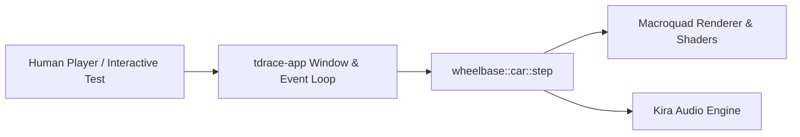

# Architecture Spec: Systematic Computational Simulation of Surface-Car Dynamics & Experimental Playground 🔬

A purely computational, headless simulation, path tracking, and experimental playground suite designed to measure, evaluate, and quantify the physical impact of varying surface characteristics, turn geometries, and boundary obstacle interactions on vehicle dynamics in **TdRace**. Operating without graphical rendering or audio dependencies, this framework provides reproducible telemetry and standardized test protocols for acceleration, braking, cornering limits, closed-loop path execution, and wall contact collisions across all supported surface types, track obstacles, and diverse vehicle archetypes.

---

## 🗺️ Current vs. Proposed System Architecture

### 1. Current Architecture (Visual & Playtesting-Coupled Physics Verification)
Historically, vehicle handling and collision behaviors in `wheelbase` were verified primarily through interactive graphical race loops in `tdrace-app` or targeted unit tests with static single-frame assertions:
* **Coupled to Viewport & Audio**: Validating handling requires running Macroquad windows and Kira audio backends.
* **Low Simulation Throughput**: Playtesting runs at real-time 60 Hz wall-clock rate; simulating hours of dynamic surface wear, multi-surface transitions, or wall contact scraping sweeps is prohibitively slow.
* **No Standardized Empirical Baselines**: There was no automated framework to systematically test and assert how altering rolling resistance, Pacejka tire curves, or obstacle restitution parameters impacts cornering lines, apex speed retention, or wall-riding exploits.



### 2. Proposed Architecture (Headless Pure Computational Harness & Experimental Playground)
The expanded architecture introduces a dedicated headless simulation runner (`wheelbase::sim::SimulationRunner`), closed-loop path tracking (`wheelbase::sim::circuit::run_path_simulation`), and a modular experimental playground (`wheelbase::sim::playground`) executing pure memory-to-memory physics iterations:
* **Zero Dependencies on UI/Audio**: Stripped of graphics, window contexts, and sound threads.
* **Hyper-Speed Execution**: Runs at $>100,000$ simulation steps per second, allowing multi-surface, multi-turn, and obstacle-collision batteries to execute thousands of physical seconds in under $500\,\text{ms}$.
* **Closed-Loop Path & Circuit Following**: Parametric reference trajectories (`SimPath`, `SimPathPoint`) driven by Stanley cross-track controllers and curvature-adaptive analytical braking curves ($v_{\text{target}}(s) = \min(v_{\text{top}}, \sqrt{v_{\text{apex}}^2 + 2 a_{\text{brake}} d})$).
* **Varied Experimental Playground**: Dynamic sector layouts combining heterogeneous surfaces, extreme turn geometries, and boundary obstacles (walls, guardrails, tire barriers, tree canopies, trunks, and grandstands).
* **Automated Comparative Reporting**: Outputs normalized Markdown comparison matrices, machine-readable JSON telemetry, and CSV time-series data.

```mermaid
flowchart TD
    subgraph Config ["Test Matrix & Playground Definition"]
        A[Vehicle Archetypes: GT, Stock TA1, Rally, Sand Rail Buggy, Kart]
        B[Surface Matrix: 12 Surface Types + Transitions]
        C[Turn Types: Hairpins, Sweepers, Chicanes, Banked, Off-Camber]
        D[Obstacles & Boundaries: Walls, Guardrails, Trees, Buildings]
    end

    subgraph Harness ["Headless Simulation & Playground Harness"]
        E[SimulationRunner & Fixed Loop: dt = 1/120s]
        F[Closed-Loop Path Follower: Stanley Steering + Analytical Braking]
        G[Parametric SimPath & SimPlayground Generator]
        H[Contact & Impact Solver: Wall Scrapes, Deflections, Foliage Drag]
    end

    subgraph CorePhysics ["wheelbase & arcade-race-core Physics Engine"]
        I[Chassis Mass, Inertia & Center of Gravity]
        J[Dynamic Weight Transfer: Pitch, Roll, Aero Downforce]
        K[Pacejka Combined Slip Friction Ellipse]
        L[SAT Convex Polygon Obstacle Collisions & Impulse Response]
        M[ABS, TCS, ESC Driver Assist Controllers]
    end

    subgraph Telemetry ["Telemetry Collector & Metrics Analyzer"]
        N[High-Frequency Telemetry Buffer: 120 Hz]
        O[Dynamic Metrics: t100, d_stop, a_y_max, RMS Cross-Track Error]
        P[Collision Metrics: Impulse J, Speed Retention, Wall-Ride Index]
    end

    subgraph Output ["Reports & Exporters"]
        Q[Markdown Summary Matrices]
        R[JSON Telemetry Dumps]
        S[CSV Time-Series Trajectories]
    end

    Config --> Harness
    Harness --> CorePhysics
    CorePhysics --> Telemetry
    Telemetry --> Output
```



---

## 🏟️ The Varied Experimental Playground Architecture (`SimPlayground`)

To enable systematic experiments on complex handling phenomena, edge-case regressions, and wall-riding physics exploits, the simulation harness incorporates a configurable **Experimental Playground**:

```
                              EXPERIMENTAL PLAYGROUND ARCHITECTURE
  
       [Sector 1: High-Speed Straight] ────► [Sector 2: 180° Hairpin] ────► [Sector 3: S-Chicane]
          Surface: Asphalt/Concrete              Surface: Dirt/Gravel             Surface: Packed Sand
          Boundaries: Flush Armco Guardrail      Boundaries: Tire Wall            Boundaries: Open Runoff
                           │                                                          │
                           ▼                                                          ▼
       [Sector 6: Mud Bog & Whoops] ◄──── [Sector 5: Banked Sweeper] ◄──── [Sector 4: Urban Concrete]
          Obstacles: Tree Trunks & Soft Canopy   Geometry: 18° Superelevation     Obstacles: Grandstand / Parapet
          Surface: Deep Mud                      Surface: Ice / Packed Snow       Boundaries: Concrete Wall
```

### 1. Parametric Turn Types & Geometries
The playground supports programmatic generation of standard and adversarial corner geometries:
1. **Hairpin Turns ($180^\circ$, $R = 10\,\text{m} - 25\,\text{m}$)**: Tests maximum steering lock, low-speed yaw response, and traction recovery out of deep apexes.
2. **Sweeping High-Speed Arcs ($R = 80\,\text{m} - 200\,\text{m}$)**: Tests aerodynamic downforce balance, tire lateral saturation limits, and high-speed understeer gradients.
3. **Decreasing-Radius Spiral Turns (Euler Clothoids)**: Progressively tightens curvature, evaluating dynamic lift-off weight transfer and snap-oversteer thresholds.
4. **Square $90^\circ$ Street & Intersection Corners**: Sharp transient turn-in with minimal run-up, measuring lateral inertia transfer.
5. **S-Chicanes (Rapid Directional Reversals)**: Quick alternating transitions ($\pm 45^\circ$), testing chassis roll oscillation, damper settling rate, and curb-hopping stability.
6. **Superelevated / Banked Curves ($5^\circ - 32^\circ$)**: Incorporates cross-slope gravitational components ($g \cdot \sin\theta_{\text{bank}}$) into normal force ($F_z$), testing centripetal assistance and bottom-out compression.
7. **Off-Camber / Reverse-Banked Turns**: Slopes away from the apex, starving the outside tires of normal load and inducing sudden lateral breakaway.

### 2. Obstacle & Boundary Wall-Contact Exploration
The playground models distinct boundary types and tracks the kinetic and frictional effects of vehicle collisions:

| Obstacle / Wall Type | Material Properties | Restitution ($e$) | Wall Friction ($\mu_{\text{wall}}$) | Physical Interaction Behavior |
| :--- | :--- | :---: | :---: | :--- |
| **Rigid Concrete Barrier** | Solid masonry / jersey barrier | $0.12 - 0.18$ | $0.55$ | Inelastic impact; high scraping friction rapidly scrubs vehicle speed; glances deflect vehicle at narrow angles ($<15^\circ$). |
| **Armco Steel Guardrail** | Corrugated steel on posts | $0.20 - 0.25$ | $0.35$ | Progressive kinetic deflection; lower scraping friction allows guided sliding at shallow angles. |
| **Tire Bundles / Energy Absorbers** | Bound rubber tire stacks | $0.05 - 0.10$ | $0.70$ | High non-linear damping; absorbs massive kinetic energy, preventing rebounds but inducing high yaw rotation if clipped off-center. |
| **Stone Parapet** | Rough hewn granite / bridge wall | $0.10$ | $0.65$ | Extreme scraping friction; aggressive velocity loss, potential chassis snagging. |
| **Soft Tree Canopy** | Dense deciduous / pine foliage | $0.00$ | $0.00$ | **Non-solid foliage interaction**: Generates proportional viscous aerodynamic drag ($F_{\text{canopy}} = -C_{\text{canopy}} \cdot v^2$) and speed bleed without rigid chassis halting. |
| **Hard Tree Trunk** | Solid cylinder ($R = 0.25\,\text{m} - 0.60\,\text{m}$) | $0.15$ | $0.45$ | **Solid obstacle collision**: SAT convex polygon collision producing immediate normal restitution impulse and chassis rotation. |
| **Grandstand / Building Perimeter** | Solid rectangular structure | $0.12$ | $0.50$ | Rigid boundary; corners induce sharp pivot impulses, flush walls produce longitudinal scraping drag. |

### 3. Wall Contact Effects & Anti-Wall-Riding Verification
The simulation evaluates boundary interactions across two distinct regimes:
* **Shallow Grazing ($0^\circ < \theta_{\text{impact}} \le 20^\circ$)**: Vehicle side scrapes along the barrier. The solver applies normal repulsion and tangential friction:
  $$F_{\text{scrape}} = -\mu_{\text{wall}} \cdot |F_{\text{normal}}| \cdot \hat{v}_{\text{tangent}}$$
  The harness measures whether continuous wall scraping produces an exploitative speed advantage ("wall-riding" on ovals/sweepers) versus clean apex navigation.
* **Oblique / Acute Impact ($20^\circ < \theta_{\text{impact}} \le 90^\circ$)**: SAT collision resolution resolves penetration depth, calculates instantaneous linear momentum transfer ($\Delta \vec{p} = \vec{J}$), and angular impulse ($\Delta \omega = (\vec{r} \times \vec{J}) / I_z$), tracking post-impact yaw stability and heading deflection.

---

## 📊 Standardized Test Protocols

### Protocol A: Longitudinal Acceleration & Traction Benchmark
Measures the vehicle's ability to transmit engine power to the ground under friction limitations.
* **Initial State**: Vehicle at complete rest ($\vec{v} = 0$, $\omega = 0$, $\vec{p} = 0$, steer = $0^\circ$).
* **Control Input**: Throttle $= 1.0$, Steering $= 0.0$, Brake $= 0.0$, Handbrake $=$ false.
* **Termination Conditions**: Vehicle reaches $160\,\text{km/h}$ ($44.44\,\text{m/s}$), passes $400\,\text{m}$, or reaches timeout ($30.0\,\text{s}$).
* **Measured Metrics**:
  * **$t_{50}$, $t_{100}$, $t_{160}$**: Split elapsed times to milestone speeds.
  * **$t_{400\text{m}}$**: Quarter-mile elapsed time and terminal trap speed ($v_{400\text{m}}$).
  * **$a_{x,\max}$**: Peak instantaneous longitudinal acceleration in $g$.
  * **Wheelspin Loss Index ($\Omega_{\text{spin}}$)**: Integrated slip ratio penalty.
  * **$v_{\text{terminal}}$**: Steady-state equilibrium velocity where tire thrust equals rolling and aerodynamic drag.

---

### Protocol B: Longitudinal Braking & Deceleration Benchmark
Measures braking effectiveness, tire adhesion limits, and ABS anti-lock behavior.
* **Phase 1 (Run-up)**: Vehicle accelerated to stabilized test speed ($v_0 = 100.0\,\text{km/h} \pm 0.1\,\text{km/h}$ or $160.0\,\text{km/h}$).
* **Phase 2 (Emergency Braking)**: Throttle set to $0.0$, Brake set to $1.0$.
* **Termination Condition**: Vehicle speed drops below $0.05\,\text{m/s}$.
* **Measured Metrics**:
  * **Stopping Distance ($d_{\text{stop}}$)** and **Stopping Time ($t_{\text{stop}}$)**.
  * **Average Deceleration ($\bar{a}_{\text{brake}}$)** and **Peak Deceleration ($a_{\text{brake},\max}$)**.
  * **Lockup Duration ($t_{\text{lock}}$)**: Cumulative time tires operate at $|\sigma| \ge 0.95$.
  * **ABS Efficiency**: Ratio of achieved deceleration versus Coulomb friction limit ($\mu \cdot g$).

---

### Protocol C: Steady-State Skidpad & Cornering Limit Benchmark
Quantifies lateral grip, maximum cornering force, and understeer/oversteer characteristics.
* **Test Setup**: Constant-radius circle ($R = 30.0\,\text{m}$, standard SAE skidpad).
* **Control Loop**: Closed-loop PID lateral controller maintains circular radius $R$ while ramping longitudinal target speed by $+0.5\,\text{km/h}$ per second.
* **Termination Condition**: Trajectory departure (lateral error $> 2.5\,\text{m}$) or spinout (sideslip $\beta > 45^\circ$).
* **Measured Metrics**:
  * **Peak Lateral Acceleration ($a_{y,\max}$)** in $g$.
  * **Critical Cornering Speed ($v_{\text{crit}}$)** in $\text{km/h}$.
  * **Sideslip Angle at Limit ($\beta_{\text{crit}}$)**.
  * **Understeer Gradient ($K_{\text{us}}$)** ($\text{deg}/g$).

---

### Protocol D: Transient Step-Steer & Slalom Benchmark
Evaluates directional responsiveness, transient weight transfer, and pendulum recovery.
* **Test Setup**: Straight course, constant velocity $v_0 = 80\,\text{km/h}$.
* **Control Input**: Step steering input of $25^\circ$ applied within $50\,\text{ms}$, held for $2.0\,\text{s}$, followed by immediate counter-steer to $-25^\circ$.
* **Measured Metrics**:
  * **Yaw Response Delay ($t_{\text{yaw}, 90\%}$)**: Time to reach $90\%$ of steady-state yaw rate.
  * **Peak Yaw Rate ($\dot{\psi}_{\max}$)** in $\text{deg/s}$.
  * **Yaw Damping Ratio ($\zeta$)**: Rate of decay of oscillatory yaw motion.
  * **Vehicle Recovery Status**: `Stable`, `Drifting`, or `Spun`.

---

### Protocol E: Coast-Down & Passive Drag Benchmark
Separates mechanical rolling resistance ($C_{\text{rr}}$) from aerodynamic drag ($C_{\text{d}}$) across terrain.
* **Initial State**: Vehicle coasting at $v_0 = 120\,\text{km/h}$ with Throttle $= 0$, Brake $= 0$.
* **Termination Condition**: Vehicle reaches standstill ($v < 0.05\,\text{m/s}$).
* **Measured Metrics**: Coasting distance ($d_{\text{coast}}$), deceleration curve, and force decomposition:
  $$F_{\text{resist}}(v) = F_{\text{rolling}}(F_z) + F_{\text{surface\_drag}}(v) + F_{\text{aero}}(v^2)$$

---

### Protocol F: Closed-Loop Dynamic Path & Circuit Tracking
Measures closed-loop path execution along continuous reference splines and multi-turn circuits.
* **Test Setup**: Parametric `SimPath` consisting of discrete waypoints resampled at $1.0\,\text{m}$ resolution, providing tangent $\hat{t}$, normal $\hat{n}$, and local curvature $\kappa$.
* **Control Loop**:
  * **Longitudinal**: Adaptive braking lookahead:
    $$v_{\text{allowable}}(s) = \sqrt{v_{\text{apex}}^2 + 2 \cdot a_{\text{brake}} \cdot d(s, s_{\text{apex}})}$$
  * **Lateral**: Stanley cross-track controller blending heading error $\theta_e$ and cross-track error $e_{\text{ct}}$:
    $$\delta(t) = \theta_e + \arctan\left(\frac{k_{\text{stanley}} \cdot e_{\text{ct}}}{v_x + \epsilon}\right)$$
* **Termination Condition**: Full path completed ($>98\%$ distance) or vehicle stuck / off-course for $>5.0\,\text{s}$.
* **Measured Metrics**:
  * **Completion Percentage**: Fraction of path length navigated ($0.0\% - 100.0\%$).
  * **Lap / Course Time ($T_{\text{lap}}$)**: Elapsed seconds from start to finish.
  * **Average & Peak Speeds ($v_{\text{avg}}, v_{\text{peak}}$)** in $\text{km/h}$.
  * **RMS & Peak Cross-Track Error ($e_{\text{rms}}, e_{\max}$)** in meters.
  * **Tire Slip Angle Distribution**: Mean and peak slip angles for front and rear axles.

---

### Protocol G: Obstacle & Boundary Wall-Contact Dynamics
Evaluates kinetic energy dissipation, deflection dynamics, and scraping friction during wall contact.
* **Test Setup**: Vehicle propelled at target velocity ($v_0 \in \{40, 80, 120, 160\}\,\text{km/h}$) toward a flat boundary wall at varying impact angles ($\theta_{\text{impact}} \in \{5^\circ, 15^\circ, 30^\circ, 45^\circ, 90^\circ\}$).
* **Measured Metrics**:
  * **Speed Retention Ratio**: $v_{\text{exit}} / v_{\text{entry}}$ following contact.
  * **Rebound Deflection Angle ($\theta_{\text{rebound}}$)**: Angle of departure trajectory relative to wall plane.
  * **Peak Impact Impulse ($J_{\max}$)** in $\text{N}\cdot\text{s}$.
  * **Induced Yaw Rate ($\dot{\psi}_{\text{impact}}$)**: Rotational kick induced by offset impact point relative to vehicle center of gravity.
  * **Wall-Riding Advantage Index ($I_{\text{wall\_ride}}$)**: Ratio of corner exit velocity achieved by riding the outside wall versus executing clean racing line without contact:
    $$I_{\text{wall\_ride}} = \frac{v_{\text{exit, wall}}}{v_{\text{exit, clean}}}$$
    * $I_{\text{wall\_ride}} < 0.85$: Wall contact is punitive (realistic motorsport behavior).
    * $I_{\text{wall\_ride}} \ge 1.00$: Exploit detected (scraping wall is faster than braking).

---

### Protocol H: Multi-Surface Varied Playground Gauntlet
Measures dynamic stability and chassis response across abrupt surface transitions.
* **Test Setup**: A composite course featuring alternating surface sectors (e.g. Asphalt $\to$ Dirt $\to$ Deep Sand $\to$ Mud Bog $\to$ Ice Patch $\to$ Concrete).
* **Measured Metrics**:
  * **Transition Shock Deceleration**: Peak longitudinal $g$-spike when transitioning from low-resistance to high-resistance terrain.
  * **Chassis Settling Time ($t_{\text{settle}}$)**: Time required for suspension pitch and yaw rate to dampen within $5\%$ of steady-state after crossing surface boundaries.
  * **Split-$\mu$ Yaw Disturbance**: Peak yaw deflection when left and right wheels traverse different surface materials simultaneously.

---

## 🔬 The 12-Surface Baseline Parameters

| # | Surface Type | Base Friction ($\mu$) | Rolling Resistance ($C_{\text{rr}}$) | Surface Drag ($C_{\text{drag}}$) | Target Dynamic Behavior |
| :- | :--- | :-: | :-: | :-: | :--- |
| 1 | **`Asphalt`** | $1.00$ | $1.0\times$ | $1.00\times$ | Baseline dry pavement; maximum grip, minimum rolling resistance. |
| 2 | **`Concrete`** | $0.95$ | $1.05\times$ | $1.00\times$ | Poured solid pavement; high grip, low rolling drag for grandstands and aprons. |
| 3 | **`Curb`** | $0.88$ | $1.3\times$ | $1.05\times$ | Apex kerb; high grip with mild drag, chassis vibration. |
| 4 | **`Dirt`** | $0.78$ | $1.2\times$ | $1.10\times$ | Compacted clay/dirt; progressive slip, high drift controllability. |
| 5 | **`Gravel`** | $0.70$ | $2.5\times$ | $1.25\times$ | Loose stone gravel; moderate displacement drag, reduced traction. |
| 6 | **`Mud`** | $0.52$ | $6.5\times$ | $3.20\times$ | Viscous bog; heavy deceleration drag, power-sapping immersion. |
| 7 | **`Grass`** | $0.45$ | $18.0\times$ | $2.20\times$ | Turf runoff; severe rolling resistance, rapid speed bleed off-track. |
| 8 | **`Snow`** | $0.34$ | $3.0\times$ | $1.60\times$ | Winter conditions; low friction, gentle breakaway, long braking. |
| 9 | **`Sand`** | $0.30$ | $30.0\times$ | $4.50\times$ | Runaway arrestor bed / gravel trap; extreme deceleration, traps standard cars. |
| 10 | **`Water`** | $0.22$ | $3.5\times$ | $2.00\times$ | Standing puddle; hydroplaning hazard, low lateral grip, viscous drag. |
| 11 | **`Oil`** | $0.12$ | $0.8\times$ | $0.95\times$ | Slick hazard; near-zero friction, instant spinout, low rolling drag. |
| 12 | **`Ice`** | $0.08$ | $0.4\times$ | $0.90\times$ | Glacial sheet; near-frictionless, negligible steering authority. |

*(Note: Playable desert sand ribbons, terrain-specific tire adaptations, and surface bifurcation are formalized in [Spec 025](025_terrain_surface_bifurcation_and_category_tier_gating.md)).*

---

## 🗄️ Database & Storage Migration Plan

### 1. Zero Runtime Database Migration
The simulation harness operates strictly in-memory during testing sessions or CI benchmarking runs and requires no migration of existing track schemas or saved game databases.

### 2. File-Based Telemetry Serialization
* Benchmark outputs serialize under `target/simulation_reports/` or `benches/results/`:
  * `playground_benchmark_<timestamp>.json`: Complete structured metrics matrix.
  * `playground_telemetry_<protocol>_<surface>.csv`: High-frequency $120\,\text{Hz}$ time-series data.
  * `playground_summary_<timestamp>.md`: Human-readable Markdown comparative tables.

---

## 🔑 Security, Compliance, & IAM Roles

### 1. Sandboxed Computational Execution
* Pure mathematical execution without system calls, network sockets, or external process execution.
* Sanitizes NaN and Inf floating-point numbers across Pacejka trigonometric calculations, square roots, and division-by-zero clamps.

### 2. CI Regression Gate Integration
* Benchmark tests run in CI pipelines to enforce physics invariance:
  * Fails build if any surface breaks the validated friction/braking hierarchy.
  * Fails build if wall-riding exploits exceed $I_{\text{wall\_ride}} \ge 0.95$.
  * Guarantees physics tuning commits do not break vehicle determinism.

---

## 🛡️ Disaster Recovery, Monitoring, & Fallbacks

### 1. Infinite Loop & Stalling Safeguards
* All test protocols enforce a strict timeout constraint (`max_duration_sec`, defaulting to $30.0\,\text{s}$ simulated time, or $3,600$ iterations at $120\,\text{Hz}$).
* Path simulation terminates with `PathSimulationStatus::StuckInSand` or `Timeout` if vehicle forward progress drops below $0.05\,\text{m/s}$ for $>2.0\,\text{s}$ under full throttle.

### 2. Numerical Stability Fallbacks
* If dynamic weight transfer produces negative normal loads ($F_z < 0$), load is clamped to a positive floor ($0.05 \cdot F_{z,\text{static}}$).
* Penetration resolution clamps maximum separation velocity to prevent explosive physics pop-outs during high-speed wall impacts.

---

## 🧪 Verification & Acceptance Criteria

### Automated Tests
* Run full simulation suite: `cargo test -p wheelbase sim`
* Run path tracking & sand evaluation tests: `cargo test -p tdrace-core --test sand_simulation_evaluation_tests`
* Execute benchmark suite: `cargo bench -p wheelbase --bench surface_dynamics`

### Manual Acceptance Criteria (Pseudo-Gherkin)

- **Scenario: Standing start acceleration across all 12 surface types**
  - [x] **Given** the wheelbase physics engine is initialized without graphics or audio backends
  - [x] **And** all 12 surface types are configured with validated friction, rolling resistance, and drag multipliers
  - [x] **When** the headless simulation executes Protocol A (Acceleration) for a baseline stock car on each surface
  - [x] **Then** the recorded 0-100 km/h acceleration times must strictly observe the hierarchy:
    ```
    Asphalt < Concrete < Curb < Dirt < Gravel < Mud < Grass < Snow < Sand < Water < Oil < Ice
    ```
  - [x] **And** the wheelspin loss index on Ice must be at least 4.0x greater than on Asphalt
  - [x] **And** the simulation must complete 12 benchmark runs in under 500 milliseconds of wall-clock time

- **Scenario: Closed-loop path following on dynamic straight-with-turns and circuit**
  - [x] **Given** a dynamically generated `SimPath` containing sequential 90° corners and chicanes
  - [x] **When** the headless path tracking simulation runs a sports car on Asphalt and Dirt
  - [x] **Then** the car must achieve a completion percentage $\ge 95\%$
  - [x] **And** the RMS cross-track error must remain below $2.5\,\text{meters}$
  - [x] **And** peak lateral acceleration must exceed $0.85g$ on Asphalt and $0.65g$ on Dirt
  - [x] **When** the same path simulation runs on original Sand ($RR = 30.0\times$)
  - [x] **Then** the simulation must flag `PathSimulationStatus::StuckInSand` with forward speed under $2.0\,\text{km/h}$

- **Scenario: Wall contact scraping friction and anti-wall-riding verification**
  - [x] **Given** a vehicle entering a $40\,\text{m}$ radius curve at $100\,\text{km/h}$ bordered by a rigid concrete barrier
  - [x] **When** the vehicle intentionally scrapes the outside wall throughout the turn
  - [x] **Then** tangential wall friction must reduce exit velocity by at least $25\%$ compared to a clean racing line
  - [x] **And** the wall-riding index $I_{\text{wall\_ride}}$ must be strictly less than $0.80$
  - [x] **And** normal collision impulses must produce realistic heading deflection without chassis penetration

- **Scenario: Track scenery collision differentiation (canopy vs trunk)**
  - [x] **Given** a vehicle traveling at $100\,\text{km/h}$ traversing a forested track edge
  - [x] **When** the vehicle passes through a soft tree canopy zone
  - [x] **Then** the vehicle must experience continuous viscous deceleration without instantaneous stopping or chassis rebound
  - [x] **When** the vehicle collides with the solid tree trunk core
  - [x] **Then** the SAT collision solver must generate an instantaneous rigid body impact impulse, halting vehicle momentum

---

## 🔗 Traceability & Codebase Mapping

### Target Crates & Modules
- `crates/wheelbase/src/sim/mod.rs` -> Headless simulation harness and re-exports.
- `crates/wheelbase/src/sim/circuit.rs` -> Parametric `SimPath`, Stanley path follower, and closed-loop circuit tracking.
- `crates/wheelbase/src/sim/protocols.rs` -> Standardized automotive dynamic protocols (A through E).
- `crates/wheelbase/src/sim/report.rs` -> Comparative markdown report generator and data export.
- `crates/tdrace-core/tests/sand_simulation_evaluation_tests.rs` -> Empirical telemetry test suite validating forces, steering, and circuits.

### Beads Issue Tracking
- Tracked via Beads Issue: `tdrace-sim-harness-expansion`.
