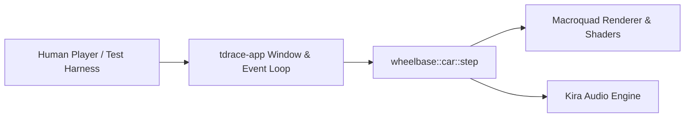
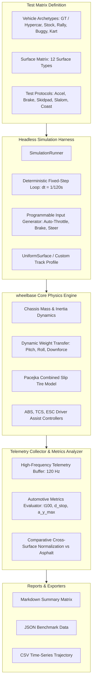

# Architecture Spec: Systematic Computational Simulation of Surface-Car Dynamics 🔬

A purely computational, headless simulation and benchmarking suite designed to measure, evaluate, and quantify the exact physical impact of varying surface characteristics on vehicle dynamics in **TdRace**. Operating without graphical rendering or audio dependencies, this framework provides reproducible telemetry and standardized test protocols for acceleration, braking, and cornering performance across all 12 supported surface types (including Concrete) and diverse vehicle archetypes.

---

## 🗺️ Current vs. Proposed System Architecture

### 1. Current Architecture (Visual & Playtesting-Coupled Physics Verification)
Currently, vehicle dynamics in `wheelbase` are verified primarily through interactive graphical race loops in `tdrace-app` or targeted unit tests with static single-frame assertions:
* **Coupled to Viewport & Audio**: Validating handling requires running Macroquad windows and Kira audio backends.
* **Low Simulation Throughput**: Playtesting runs at real-time 60 Hz wall-clock rate; simulating hours of dynamic surface wear or comparative matrix sweeps is prohibitively slow.
* **No Standardized Empirical Baselines**: There is no automated framework to systematically test and assert how altering rolling resistance or tire Pacejka parameters impacts acceleration, braking distances, or apex cornering limits across all 12 surfaces.



### 2. Proposed Architecture (Headless Pure Computational Simulation Harness)
The proposed architecture introduces a dedicated headless simulation runner (`wheelbase::sim::SimulationRunner`) that executes pure memory-to-memory physics iterations:
* **Zero Dependencies on UI/Audio**: Stripped of graphics, window contexts, and sound threads.
* **Hyper-Speed Execution**: Runs at $>100,000$ simulation steps per second, allowing a full multi-surface, multi-vehicle automotive test battery (thousands of physics seconds) to finish in under $500\,\text{ms}$.
* **Standardized Automotive Testing Protocols**: Programmatic scripts for standing starts ($0 \to 100\,\text{km/h}$), quarter-mile pulls, threshold and ABS braking, constant-radius skidpads ($R = 30\,\text{m}$), and transient step-steer slalom maneuvers.
* **Automated Comparative Reporting**: Outputs normalized Markdown comparison matrices (relative to Asphalt $100\%$), machine-readable JSON telemetry, and CSV time-series data.



---

## 📊 Standardized Test Protocols

### Protocol A: Longitudinal Acceleration & Traction Benchmark
Measures the vehicle's ability to transmit engine power to the ground under friction limitations.
* **Initial State**: Vehicle at complete rest ($\vec{v} = 0$, $\omega = 0$, $\vec{p} = 0$, steer = $0^\circ$).
* **Control Input**: Throttle $= 1.0$, Steering $= 0.0$, Brake $= 0.0$, Handbrake $=$ false.
* **Termination Conditions**: Vehicle reaches $160\,\text{km/h}$ ($44.44\,\text{m/s}$), passes $400\,\text{m}$, or reaches timeout ($30.0\,\text{s}$).
* **Measured Metrics**:
  * **$t_{50}$**: Time from standstill to $50\,\text{km/h}$ ($13.89\,\text{m/s}$).
  * **$t_{100}$**: Time from standstill to $100\,\text{km/h}$ ($27.78\,\text{m/s}$).
  * **$t_{160}$**: Time from standstill to $160\,\text{km/h}$ ($44.44\,\text{m/s}$).
  * **$t_{400\text{m}}$**: Quarter-mile elapsed time and terminal trap speed ($v_{400\text{m}}$).
  * **$a_{x,\max}$**: Peak instantaneous longitudinal acceleration in $g$ ($1\,g = 9.81\,\text{m/s}^2$).
  * **Wheelspin Loss Index ($\Omega_{\text{spin}}$)**: Integrated slip ratio penalty:
    $$\Omega_{\text{spin}} = \int_0^T \max\left(0, \frac{|\sigma_{\text{rear}}| - 0.15}{0.85}\right) dt$$
  * **$v_{\text{terminal}}$**: Steady-state equilibrium velocity where total tire thrust equals aerodynamic and surface drag.

---

### Protocol B: Longitudinal Braking & Deceleration Benchmark
Measures braking effectiveness, tire adhesion limits, and ABS anti-lock behavior.
* **Phase 1 (Run-up)**: Vehicle accelerated to a stabilized test speed ($v_0 = 100.0\,\text{km/h} \pm 0.1\,\text{km/h}$ or $160.0\,\text{km/h}$).
* **Phase 2 (Emergency Braking)**: Throttle abruptly set to $0.0$, Brake set to $1.0$.
* **Termination Condition**: Vehicle speed drops below $0.05\,\text{m/s}$.
* **Measured Metrics**:
  * **Stopping Distance ($d_{\text{stop}}$)**: Total distance traveled from brake onset to complete stop in meters.
  * **Stopping Time ($t_{\text{stop}}$)**: Elapsed time from brake application to standstill in seconds.
  * **Average Braking Deceleration ($\bar{a}_{\text{brake}}$)**: Mean deceleration in $g$:
    $$\bar{a}_{\text{brake}} = \frac{v_0^2}{2 \cdot d_{\text{stop}} \cdot 9.81}$$
  * **Peak Braking Deceleration ($a_{\text{brake},\max}$)**: Maximum deceleration captured over a moving $100\,\text{ms}$ window.
  * **Lockup Duration ($t_{\text{lock}}$)**: Cumulative time tires operate at $|\sigma| \ge 0.95$ (indicating skidding rubber/plowing).
  * **ABS Pulse Efficiency**: Ratio of actual deceleration achieved versus theoretical Coulomb friction limit ($\mu \cdot g$).

---

### Protocol C: Steady-State Skidpad & Cornering Limit Benchmark
Quantifies lateral grip, maximum cornering force, and understeer/oversteer characteristics.
* **Test Setup**: Constant-radius circle ($R = 30.0\,\text{m}$, representing standard SAE skidpad geometry).
* **Control Loop**: Closed-loop PID lateral controller maintains circular trajectory along radius $R$ while slowly ramping longitudinal target speed by $+0.5\,\text{km/h}$ per second ($0.139\,\text{m/s}^2$).
* **Termination Condition**: The vehicle can no longer maintain the circular radius (lateral position error exceeds $+2.5\,\text{m}$, indicating terminal understeer plow) or sideslip angle exceeds $45^\circ$ (spinout).
* **Measured Metrics**:
  * **Peak Lateral Acceleration ($a_{y,\max}$)**: Maximum sustained lateral acceleration in $g$:
    $$a_y = \frac{v^2}{R \cdot 9.81}$$
  * **Critical Cornering Speed ($v_{\text{crit}}$)**: Maximum speed achieved before trajectory departure ($\text{km/h}$).
  * **Sideslip Angle at Limit ($\beta_{\text{crit}}$)**: Chassis angle relative to trajectory tangent at maximum lateral load:
    $$\beta = \arctan\left(\frac{v_{\text{lat}}}{v_{\text{long}}}\right)$$
  * **Understeer Gradient ($K_{\text{us}}$)**: Slope of steering angle demand vs lateral acceleration ($\text{deg}/g$):
    $$K_{\text{us}} = \frac{d\delta}{da_y} - \frac{L}{R}$$
    * $K_{\text{us}} > 0$: Understeer (front loses grip first; common on Sand/Mud).
    * $K_{\text{us}} < 0$: Oversteer (rear breaks loose; prevalent on Oil/Ice).

---

### Protocol D: Transient Step-Steer & Slalom Benchmark
Evaluates directional responsiveness, transient weight transfer, and pendulum recovery.
* **Test Setup**: Straight course, constant velocity $v_0 = 80\,\text{km/h}$.
* **Control Input**: Step steering input of $25^\circ$ applied within $50\,\text{ms}$ and held for $2.0\,\text{s}$, followed by immediate counter-steer to $-25^\circ$.
* **Measured Metrics**:
  * **Yaw Response Delay ($t_{\text{yaw}, 90\%}$)**: Time required to achieve $90\%$ of steady-state yaw velocity.
  * **Peak Yaw Rate ($\dot{\psi}_{\max}$)**: Maximum angular velocity ($\text{deg/s}$).
  * **Yaw Damping Ratio ($\zeta$)**: Rate of decay of oscillatory yaw motion following return to center.
  * **Vehicle Recovery Status**: Categorized as `Stable` (recovers heading), `Drifting` (sustained controllable slip), or `Spun` (spinout beyond recovery).

---

### Protocol E: Coast-Down & Passive Drag Benchmark
Separates the contribution of mechanical rolling resistance ($C_{\text{rr}}$) from aerodynamic drag ($C_{\text{d}}$) across terrain.
* **Initial State**: Vehicle coasting at $v_0 = 120\,\text{km/h}$ with Throttle $= 0$, Brake $= 0$.
* **Termination Condition**: Vehicle reaches standstill ($v < 0.05\,\text{m/s}$).
* **Measured Metrics**: Coasting distance ($d_{\text{coast}}$), deceleration curve, and effective resistance force decomposition:
  $$F_{\text{resist}}(v) = F_{\text{rolling}}(F_z) + F_{\text{surface\_drag}}(v) + F_{\text{aero}}(v^2)$$

---

## 🔬 The 12-Surface Test Matrix

The simulation harness evaluates every protocol across all 12 supported surfaces defined in [`SurfaceType`](../crates/wheelbase/src/surface.rs):

| # | Surface Type | Base Friction ($\mu$) | Rolling Resistance ($C_{\text{rr}}$) | Surface Drag ($C_{\text{drag}}$) | Expected Dynamic Behavior |
| :- | :--- | :-: | :-: | :-: | :--- |
| 1 | **`Asphalt`** | $1.00$ | $1.0\times$ | $1.00\times$ | Baseline dry benchmark; maximum grip, minimal drag. |
| 2 | **`Concrete`** | $0.95$ | $1.05\times$ | $1.00\times$ | Poured solid pavement; high grip with low rolling drag for grandstands and aprons. |
| 3 | **`Curb`** | $0.88$ | $1.3\times$ | $1.05\times$ | Apex kerb; slight micro-vibration, high grip with mild drag. |
| 4 | **`Dirt`** | $0.78$ | $1.2\times$ | $1.10\times$ | Compacted rally clay; progressive slip angle, high drifting controllability. |
| 5 | **`Gravel`** | $0.70$ | $2.5\times$ | $1.25\times$ | Loose stone gravel; loose displacement, moderate rolling resistance. |
| 6 | **`Mud`** | $0.52$ | $6.5\times$ | $3.20\times$ | Viscous bog; heavy deceleration drag, power-sapping immersion. |
| 7 | **`Grass`** | $0.45$ | $18.0\times$ | $2.20\times$ | Turf runoff; severe rolling resistance, rapid speed bleed off-track. |
| 8 | **`Snow`** | $0.34$ | $3.0\times$ | $1.60\times$ | Low-friction winter rallying; gentle breakaway, long braking distances. |
| 9 | **`Sand`** | $0.30$ | $30.0\times$ | $4.50\times$ | Arrestor bed; catastrophic rolling resistance, extreme deceleration. |
| 10 | **`Water`** | $0.22$ | $3.5\times$ | $2.00\times$ | Hydroplaning hazard; low traction, high viscous resistance. |
| 11 | **`Oil`** | $0.12$ | $0.8\times$ | $0.95\times$ | Low surface friction; instant spinout, zero rolling drag. |
| 12 | **`Ice`** | $0.08$ | $0.4\times$ | $0.90\times$ | Near-frictionless; negligible braking authority, near-infinite glide. |

---

## 🗄️ Database & Storage Migration Plan

### 1. Zero Runtime Database Migration
The simulation harness operates strictly in-memory during testing sessions or CI benchmarking runs and requires no migration of existing track schemas or saved game databases.

### 2. File-Based Telemetry Serialization (`benches/results/`)
* Benchmark outputs are serialized to disk under `target/simulation_reports/` or `benches/results/`:
  * `surface_benchmark_<timestamp>.json`: Complete structured metrics matrix.
  * `surface_telemetry_<protocol>_<surface>.csv`: High-frequency $120\,\text{Hz}$ time-series data for telemetry graphing.
  * `surface_summary_<timestamp>.md`: Human-readable Markdown comparative tables.

---

## 🔑 Security, Compliance, & IAM Roles

### 1. Sandboxed Computational Execution
* Pure mathematical execution without system calls, network access, or external process execution.
* Sanitizes NaN and Inf floating-point numbers across Pacejka slip and trigonometric calculations to prevent division-by-zero crashes.

### 2. CI Regression Gate Integration
* Benchmark tests run in CI pipelines to enforce physics invariance:
  * Fails build if any surface breaks the validated friction/braking hierarchy.
  * Guarantees physics tuning commits do not inadvertently make Ice faster than Grass or break vehicle determinism.

---

## 🛡️ Disaster Recovery, Monitoring, & Fallbacks

### 1. Infinite Loop & Runaway Safeguards
* All test protocols enforce a strict timeout constraint (`max_duration_sec`, defaulting to $30.0\,\text{s}$ simulated time, or $3,600$ iterations at $120\,\text{Hz}$).
* If an impossible test condition occurs (e.g. vehicle spinning infinitely on zero-friction Ice without moving forward), the test terminates cleanly and records a `Timeout` status rather than hanging the test process.

### 2. Numerical Stability Fallbacks
* If dynamic weight transfer or low normal load ($F_z < 0$) causes negative vertical tire force, the solver clamps loads to a minimum positive floor ($0.05 \cdot F_{z,\text{static}}$) to prevent irrational Pacejka forces.

---

## 🧪 Verification & Acceptance Criteria

### Automated Tests
* Command to run full surface simulation tests: `cargo test -p wheelbase sim`
* Command to execute benchmark suite and generate reports: `cargo bench -p wheelbase --bench surface_dynamics`

### Manual Acceptance Criteria (Pseudo-Gherkin)

- **Scenario: Standing start acceleration across all 12 surface types**
  - [x] **Given** the wheelbase physics engine is initialized without graphics or audio backends
  - [x] **And** all 12 surface types are configured with validated friction, rolling resistance, and drag multipliers
  - [x] **When** the headless simulation executes Protocol A (Acceleration) for a baseline stock car on each surface
  - [x] **Then** the recorded 0-100 km/h acceleration times must strictly observe the hierarchy:
    ```
    Asphalt < Concrete < Curb < Dirt < Gravel < Mud < Grass < Snow < Sand < Water < Oil < Ice
    ```
  - [x] **And** the wheelspin loss index on Ice must be at least 4.0x greater than on Asphalt
  - [x] **And** the simulation must complete 12 benchmark runs in under 500 milliseconds of wall-clock time

- **Scenario: Straight-line emergency braking distance from 100 km/h**
  - [x] **Given** a vehicle stabilized at 100.0 km/h on a uniform test surface
  - [x] **When** 100% service brake is applied until vehicle speed drops below 0.05 m/s
  - [x] **Then** the stopping distance must scale inversely with the surface friction coefficient mu
  - [x] **And** stopping distance on Asphalt must be less than 40.0 meters
  - [x] **And** stopping distance on Ice must exceed 300.0 meters
  - [x] **And** the average braking deceleration must be recorded without NaN or infinite floating point artifacts

- **Scenario: Steady-state skidpad cornering limit evaluation**
  - [x] **Given** a vehicle commanded along a 30-meter radius circular skidpad
  - [x] **When** vehicle speed is incrementally ramped until trajectory deviation exceeds 2.5 meters
  - [x] **Then** the maximum lateral acceleration a_y_max on Asphalt must exceed 1.05g
  - [x] **And** the maximum lateral acceleration on Gravel must measure between 0.75g and 0.90g
  - [x] **And** the maximum lateral acceleration on Ice must be below 0.15g
  - [x] **And** the telemetry log must capture slip angles for all 4 individual wheels

- **Scenario: Telemetry export and cross-surface comparative reporting**
  - [x] **When** the comparative surface benchmark suite is triggered via cargo benchmark or CLI command
  - [x] **Then** it must output a structured JSON telemetry dump containing time-series wheel states
  - [x] **And** it must generate a Markdown comparison table normalized against the Asphalt baseline
  - [x] **And** all results must be bit-for-bit deterministic across consecutive runs with the same configuration

---

## 🔗 Traceability & Codebase Mapping

### Target Crates & Modules
- `crates/wheelbase/src/sim/mod.rs` -> Headless simulation runner and telemetry buffer.
- `crates/wheelbase/src/sim/protocols.rs` -> Standardized automotive protocols (Accel, Brake, Skidpad, Slalom, Coast).
- `crates/wheelbase/src/sim/report.rs` -> Comparative surface matrix formatter and CSV/JSON exporters.
- `benches/surface_dynamics.rs` -> Cargo benchmark integration.

### Beads Issue Tracking
- Tracked via upcoming Beads Epic: `tdrace-surface-car-interaction-simulation-sim1`.
