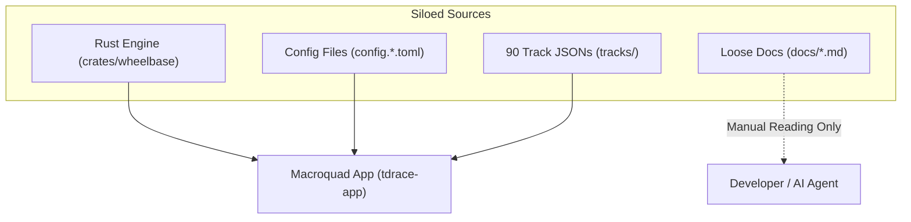
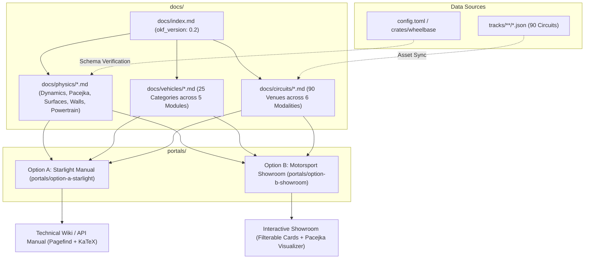

# Architecture Spec: Game Asset Catalogue & Technical Reference Portals 🏎️📚

A unified, single-source-of-truth knowledge graph and dual-portal frontend architecture designed to catalogue all vehicle assets, 90 circuits, and mathematical simulation mechanics in **TdRace**. Operating over structured Markdown adhering to **Google's Open Knowledge Format (OKF v0.2)**, this system serves both human engineers and autonomous AI agents while delivering two distinct presentation tiers: **Option A (Astro + Starlight Engineering Reference)** and **Option B (Custom Astro + Tailwind/M3 Motorsport Showroom & Physics Lab)**.

---

## 🗺️ Current vs. Proposed System Architecture

### 1. Current Architecture (Fragmented Code & Markdown Silos)
Currently, project knowledge, asset descriptions, and physics parameters are scattered across disparate sources:
* **Physics Levers**: Hardcoded across Rust structs in `crates/wheelbase/src/config.rs` and `config.toml` without web-accessible interactive references.
* **Track Catalog**: 90 JSON files under `tracks/` with no visual directory, surface breakdown, or sector analysis.
* **Documentation Drift**: Loose markdown files in `docs/` lack strict frontmatter schemas, making programmatic agent ingestion and build validation impossible.
* **No Unified Viewer**: Developers and players must run the Macroquad binary to inspect vehicle statistics or circuit properties.

### 2. Proposed Architecture (Single-Source OKF Knowledge Graph + Dual Astro Portals)
The proposed architecture establishes a canonical, schema-validated OKF v0.2 documentation repository under `docs/` that directly cross-references game data, powering two distinct static web applications via Bun:

---

## 🗄️ Database & Storage Migration Plan

### 1. Zero-Downtime Knowledge Graph Refactoring
Refactoring loose documentation into a canonical OKF v0.2 graph follows a progressive, lossless migration path:
- **Phase 1 (Backfill & Structuring)**: Existing documents (`surface_and_wall_specifications.md`, `vehicle_roster_expansion_ideas.md`) are decomposed and enriched with YAML frontmatter conforming to OKF v0.2 in `docs/physics/`, `docs/vehicles/`, and `docs/circuits/`.
- **Phase 2 (Dual Content Exposure)**: Both Astro web portals ingest `docs/` via symlinked or relative content collection mounting.
- **Phase 3 (Deprecation & Archival)**: Legacy unformatted markdown files in `docs/` are replaced with strict OKF versions, accompanied by an updated `docs/index.md` progressive disclosure index.

### 2. Schema Enforcement & Content Collections
- Frontmatter schemas are strictly enforced at build time via Zod (`z.object({ type: z.string(), title: z.string(), ... })`).
- Asset JSON files from `tracks/` and TOML vehicle physics presets are parsed at build time without requiring external relational database backends.

---

## 🔑 Security, Compliance, & IAM Roles

### 1. Static Asset Safety & Client-Side Sandboxing
- Both web portals are compiled to 100% static HTML, CSS, and client-side JavaScript bundles, completely eliminating server-side attack surfaces, SSR injection, and database authentication overhead.
- Interactive physics visualizers run strictly in isolated client-side Canvas and SVG elements with zero telemetry tracking or third-party runtime analytics.

### 2. OKF v0.2 Specification Compliance
- Frontmatter integrity is verified on every build to prevent schema regressions.
- Content cross-references use verified relative markdown links (pointing to local `.md` targets) to guarantee link integrity for offline documentation reading and autonomous AI agent traversal.

---

## 🛡️ Disaster Recovery, Monitoring, & Fallbacks

### 1. Build Verification & Rollback
- Static builds are executed inside `portals/` with Bun (`bun run build`). If any markdown file contains invalid YAML frontmatter or unresolvable imports, the build halts with a non-zero exit code, preventing corrupted deployments.
- Reverting to any previous documentation state is guaranteed by Git commit history with zero distributed database migration rollbacks required.

### 2. Continuous Health Checks
- `keel doctor` and `keel validate` monitor workspace OKF alignment.
- Python verification harness `scripts/verify_okf.py` runs as a pre-commit health check to detect broken relative links and unclosed frontmatter blocks.

---

## 🔗 Traceability & Codebase Mapping

| Component | Target Location | Purpose |
| :--- | :--- | :--- |
| **OKF Knowledge Base** | `docs/` | Single source of truth for assets, physics, and circuits |
| **OKF Validator** | `scripts/verify_okf.py` | Python automated verification of frontmatter and links |
| **Option A (Starlight)** | `portals/option-a-starlight/` | Technical documentation and engineering manual |
| **Option B (Showroom)** | `portals/option-b-showroom/` | Interactive visual catalog and physics lab |
| **Root Workspace** | `portals/package.json` | Bun workspace orchestrating dev and build commands |

---

## 🧪 Verification & Acceptance Criteria

### Manual Acceptance Criteria (Pseudo-Gherkin)

- **Scenario: Canonical OKF v0.2 Knowledge Base Validation**
  - [x] **Given** the `docs/` directory containing physics, vehicle, and circuit markdown files
  - [x] **When** `python3 scripts/verify_okf.py` executes
  - [x] **Then** all files contain valid OKF frontmatter (`type`, `title`, `description`, `status`)
  - [x] **And** `docs/index.md` specifies `okf_version: "0.2"`
  - [x] **And** zero relative markdown cross-links are broken.

- **Scenario: Option A (Starlight) Build & Math Rendering**
  - [x] **Given** the `portals/option-a-starlight` package
  - [x] **When** running `bun run build`
  - [x] **Then** the build completes with zero errors
  - [x] **And** Pagefind generates the client-side search index
  - [x] **And** KaTeX correctly compiles the Pacejka '96 formula into rendered HTML math.

- **Scenario: Option B (Showroom) Build & Interactive Physics Lab**
  - [x] **Given** the `portals/option-b-showroom` package
  - [x] **When** running `bun run build`
  - [x] **Then** the build completes with zero errors
  - [x] **And** the vehicle catalog renders cards for all 5 motorsport modules
  - [x] **And** the interactive Pacejka slip-angle curve visualizer recalculates lateral force when sliders are adjusted.

- **Scenario: Zero Content Duplication & Coexistence**
  - [x] **Given** both Option A and Option B portals
  - [x] **When** updating an asset or physics description in `docs/`
  - [x] **Then** both applications reflect the updated content without modifying portal source code.
