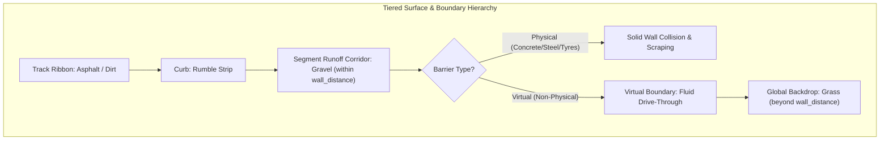

# Feature Spec: Segment Runoff Terrain and Virtual Track Boundaries 🏎️🪨

A comprehensive architectural, physics, and rendering specification enabling track designers and procedural circuit generators to define localized off-track terrain (e.g. gravel traps, tarmac runoff strips, sand verges, or dirt shoulders) as direct properties of track segments between the ribbon edge and perimeter barriers. Additionally introduces non-physical **Virtual Barriers** (`BarrierType::Virtual`)—invisible geometric boundary lines that delimit surface transitions without physically impeding, deflecting, or damaging vehicles—allowing fluid transitions between localized segment runoffs and the global circuit backdrop (e.g. Grass).

---

## 🗺️ User Flow & Interface Design

### 1. In-Game Cenital (Top-Down) Experience & Surface Transitions
In top-down racing view, vehicle departures from the asphalt track ribbon now exhibit authentic tiered environmental reactions:
- **Asphalt to Curb Transition**: Sliding off-line hits the rumble strip (`SurfaceType::Curb`) with subtle chassis vibration.
- **Curb to Runoff Corridor**: Slipping past the curb enters the segment's defined runoff corridor (e.g. `SurfaceType::Gravel`, `Sand`, or `Dirt`), causing immediate tire roost debris particles, increased rolling resistance, and realistic loss of grip ($\mu = 0.70$).
- **Fluid Transition into Backdrop**: If bounded by a **Virtual Barrier**, the vehicle crosses the boundary line without suffering collision damage or stopping impulses, transitioning smoothly into the global outfield terrain (`default_surface`, e.g. `Grass`). If bounded by a physical barrier (`Concrete`, `Steel`, `TireWall`), standard impact and wall-scrape dynamics occur.



### 2. Circuit Authoring & Editor Flow
Track designers and OSM circuit reconstruction tools configure runoff corridors directly per waypoint:
- In the track editor or JSON definitions, designers configure:
  - `left_runoff_surface` / `right_runoff_surface`: `Gravel`, `Sand`, `Dirt`, `Asphalt`, or `None`.
  - `left_wall_distance` / `right_wall_distance`: Width of the runoff strip in meters.
  - `wall_type`: Set to `Virtual` for open fields, or `TireWall` / `Concrete` / `Steel` for enclosed tracks.
- No manual drawing of complex polygon meshes is required; the game automatically synthesizes both the physical simulation boundaries and the visual mesh.

---

## ⚙️ Backend Models & API Endpoints

### 1. Virtual Barrier Classification (`crates/arcade-race-core/src/track/geometry.rs`)

Extend `BarrierType` with the `Virtual` variant and add the `is_physical()` capability query:

```rust
/// Physical classification of track barriers and walls.
#[derive(Debug, Clone, Copy, PartialEq, Eq, Hash, Serialize, Deserialize)]
pub enum BarrierType {
    /// Rigid concrete wall (high restitution, low-to-moderate sliding friction).
    Concrete,
    /// Steel barrier (medium restitution, deformable, moderate friction & bodywork snagging).
    Steel,
    /// Energy-absorbing tire stack barrier (low restitution, high rubber friction).
    TireWall,
    /// Low track-edge curb wall.
    CurbWall,
    /// Virtual non-physical boundary delimiter (zero collision, delimits surface transition zones).
    Virtual,
}

impl BarrierType {
    /// Whether this barrier possesses physical collidable geometry.
    #[inline]
    pub const fn is_physical(self) -> bool {
        !matches!(self, Self::Virtual)
    }

    pub const fn name(self) -> &'static str {
        match self {
            Self::Concrete => "Concrete",
            Self::Steel => "Steel",
            Self::TireWall => "Rubber Tyres",
            Self::CurbWall => "Curb Wall",
            Self::Virtual => "Virtual Boundary",
        }
    }

    pub const fn default_restitution(self) -> f32 {
        match self {
            Self::Concrete => 0.65,
            Self::Steel => 0.42,
            Self::TireWall => 0.18,
            Self::CurbWall => 0.30,
            Self::Virtual => 0.0,
        }
    }

    pub const fn default_friction(self) -> f32 {
        match self {
            Self::Concrete => 0.32,
            Self::Steel => 0.45,
            Self::TireWall => 0.80,
            Self::CurbWall => 0.40,
            Self::Virtual => 0.0,
        }
    }

    pub const fn scraping_deceleration(self) -> f32 {
        match self {
            Self::Concrete => 9.0,
            Self::Steel => 14.0,
            Self::TireWall => 24.0,
            Self::CurbWall => 7.0,
            Self::Virtual => 0.0,
        }
    }

    pub const fn snag_torque_factor(self) -> f32 {
        match self {
            Self::Concrete => 0.12,
            Self::Steel => 0.25,
            Self::TireWall => 0.45,
            Self::CurbWall => 0.10,
            Self::Virtual => 0.0,
        }
    }

    pub const fn energy_absorption_factor(self) -> f32 {
        match self {
            Self::Concrete => 0.10,
            Self::Steel => 0.40,
            Self::TireWall => 0.75,
            Self::CurbWall => 0.25,
            Self::Virtual => 1.0,
        }
    }
}
```

Add convenience helper to `WallBarrier`:

```rust
impl WallBarrier {
    /// Returns true if this wall has physical collision geometry.
    #[inline]
    pub fn is_physical(&self) -> bool {
        self.barrier_type.is_physical()
    }
}
```

### 2. Track Waypoint & Spline Sample Schema (`crates/arcade-race-core/src/track/spline.rs`)

Extend `TrackWaypoint` and `SplineSample` with optional per-side runoff surface properties:

```rust
pub struct TrackWaypoint {
    // ... existing fields ...
    
    /// Optional surface type override for the left corridor between track/curb and left wall (e.g. Gravel).
    #[serde(default, skip_serializing_if = "Option::is_none")]
    pub left_runoff_surface: Option<SurfaceType>,

    /// Optional surface type override for the right corridor between track/curb and right wall (e.g. Gravel).
    #[serde(default, skip_serializing_if = "Option::is_none")]
    pub right_runoff_surface: Option<SurfaceType>,
}

impl TrackWaypoint {
    /// Sets identical runoff surface for both left and right track corridors.
    pub const fn with_runoff_surface(mut self, surface: SurfaceType) -> Self {
        self.left_runoff_surface = Some(surface);
        self.right_runoff_surface = Some(surface);
        self
    }

    /// Sets distinct runoff surfaces for left and right track corridors.
    pub const fn with_runoff_surfaces(
        mut self,
        left: Option<SurfaceType>,
        right: Option<SurfaceType>,
    ) -> Self {
        self.left_runoff_surface = left;
        self.right_runoff_surface = right;
        self
    }
}
```

Propagate onto `SplineSample`:

```rust
pub struct SplineSample {
    // ... existing fields ...
    #[serde(default, skip_serializing_if = "Option::is_none")]
    pub left_runoff_surface: Option<SurfaceType>,
    #[serde(default, skip_serializing_if = "Option::is_none")]
    pub right_runoff_surface: Option<SurfaceType>,
}
```

During spline resampling and arc-length interpolation in `TrackSpline::new` and `TrackSpline::sample_at_distance`:
- Nearest-neighbor midpoint sampling (`t < 0.5`) is used for discrete enum fields `left_runoff_surface` and `right_runoff_surface`, maintaining consistency with `wall_type` and curb attributes.

---

## 🏎️ Physics & Simulation Integration

### 1. Surface Sampling Precedence Pipeline (`crates/arcade-race-core/src/track/mod.rs`)

Update `Track::sample_surface` and `Track::sample_surface_near`:
When a point is projected onto the centerline spline, the updated surface evaluation sequence is:

1. **Jump Ramps**: Elevated ramp triggers (`geometry.jump_ramps`).
2. **Above-Track Hazards**: Water puddles, oil slicks, dynamic mud overlays (`SurfaceLayer::AboveTrack`).
3. **Drivable Ribbon**:
   - `if proj.is_on_track` $\to$ return `proj.base_surface` (Asphalt, Dirt, etc.).
   - `if proj.is_on_curb` $\to$ return `SurfaceType::Curb`.
4. **Segment Runoff Corridor** *(NEW)*:
   - Check if point is laterally positioned between the track/curb edge and the active barrier boundary:
     - **Left Side (`proj.lateral_offset < -half_w`)**:
       - Lateral distance: $d_{\text{lat}} = -\text{proj.lateral\_offset}$.
       - Corridor limit: $d_{\text{limit}} = \text{half\_w} + s_0.\text{left\_wall\_distance.unwrap\_or}(D_{\text{default}})$.
       - If $d_{\text{lat}} \le d_{\text{limit}}$ and $s_0.\text{left\_runoff\_surface.is\_some()}$:
         - Return `s0.left_runoff_surface.unwrap()`.
     - **Right Side (`proj.lateral_offset > half_w`)**:
       - Lateral distance: $d_{\text{lat}} = \text{proj.lateral\_offset}$.
       - Corridor limit: $d_{\text{limit}} = \text{half\_w} + s_0.\text{right\_wall\_distance.unwrap\_or}(D_{\text{default}})$.
       - If $d_{\text{lat}} \le d_{\text{limit}}$ and $s_0.\text{right\_runoff\_surface.is\_some()}$:
         - Return `s0.right_runoff_surface.unwrap()`.
      - **Corridor Fallback**: If `left_runoff_surface` or `right_runoff_surface` is not explicitly customized, `Track::default_runoff_surface()` determines the discipline corridor material:
        - **GT & Rallycross Circuits** (`CarCategory::Gt`, `CarCategory::Rally`, or modules `gt`/`rally`/`classic`): `SurfaceType::Gravel`.
        - **Kart Circuits** (`CarCategory::Kart` or module `kart`): `SurfaceType::Concrete`.
        - **Pure Dirt or Mud Circuits** (`default_surface == Dirt | Mud` or pure dirt/mud ribbons): `SurfaceType::Dirt`.
        - **Sandy Circuits** (`default_surface == Sand` or sand desert/dune venues): `SurfaceType::Sand`.
        - **Snow or Icy Circuits** (`default_surface == Snow | Ice` or arctic/glacier venues): `SurfaceType::Snow`.
5. **Arena / Hybrid Floor Polygons**: Enclosed stadium floor polygon.
6. **Below-Track Custom Zones**: Hand-placed `SurfaceZone` instances (`SurfaceLayer::BelowTrack`, e.g. dedicated hairpin sand traps or paved asphalt aprons).
7. **Grandstand Aprons**: Concrete bleacher foundations.
8. **Global Default Backdrop**: Fallback `self.default_surface` (e.g. `SurfaceType::Grass`).

### 2. Collision Resolution Bypass (`crates/arcade-race-core/src/collision/wall.rs`)

In `resolve_car_wall_collision`:

```rust
pub fn resolve_car_wall_collision(
    car: &mut Car,
    wall: &WallBarrier,
) -> Option<WallCollisionEvent> {
    // Immediately bypass non-physical virtual boundaries
    if !wall.barrier_type.is_physical() {
        return None;
    }
    // ... continue standard SAT & OBB collision detection for physical walls ...
}
```

### 3. LIDAR & AI Sensor Filtering (`crates/arcade-race-core/src/lidar/mod.rs` & `tdrace-py/src/engine.rs`)

AI drivers, sensor sweeps, and reinforcement learning observation vectors query environmental obstacles:
- Raycasting functions and spatial candidate searches filter walls by `wall.barrier_type.is_physical()`.
- AI steering agents treat virtual boundaries as traversable terrain limits rather than impenetrable obstacles.

---

## 🎨 Cenital Rendering Pipeline (`crates/tdrace-app/src/render/`)

### 1. Segment Runoff Ribbon Pass (`render/track.rs`)
Introduce `render_runoff_pass(spline: &TrackSpline, elevated: bool, view_bounds: Option<(Vec2, Vec2)>)`:
- Executes during `render_ground_track_culled` right before curbs and track surface quads.
- Traverses consecutive spline samples $s_0$ and $s_1$:
  - If $s_0.\text{left\_runoff\_surface}$ is defined:
    - Inner edge $0$: $p_{0,\text{inner}} = s_0.\text{point} + s_0.\text{normal} \cdot (w_0/2 + \text{curb\_extra}_0)$.
    - Outer edge $0$: $p_{0,\text{outer}} = s_0.\text{point} + s_0.\text{normal} \cdot (w_0/2 + d_{\text{wall},0})$.
    - Inner edge $1$: $p_{1,\text{inner}} = s_1.\text{point} + s_1.\text{normal} \cdot (w_1/2 + \text{curb\_extra}_1)$.
    - Outer edge $1$: $p_{1,\text{outer}} = s_1.\text{point} + s_1.\text{normal} \cdot (w_1/2 + d_{\text{wall},1})$.
    - Draw quad $(p_{0,\text{inner}}, p_{1,\text{inner}}, p_{1,\text{outer}}, p_{0,\text{outer}})$ using palette colors for the specified surface (e.g., `Palette::GRAVEL`, `Palette::SAND`).
  - If $s_0.\text{right\_runoff\_surface}$ is defined:
    - Calculate corresponding mirrored right corridor quad and draw using surface colors.

### 2. Barrier Body and Shadow Filtering (`render/barrier.rs`)
In `render_ground_barriers_and_obstacles_culled`:
- Filter wall iterations with `.filter(|w| w.is_physical() && !w.is_bridge)`.
- Prevents 2.5D drop shadows, extruded concrete/steel body strokes, and tire stack sprites from rendering over virtual boundaries.
---

## 🛡️ Security & Role-Based Access Controls (RBAC)

### 1. Memory Safety & Geometric Bound Constraints
- **Finite Scalar Validation**: All lateral offset calculations, corridor bounds, and spline projection distances are asserted to be finite (`f32::is_finite()`).
- **Defensive Polygon Generation**: The runoff ribbon mesh generator rejects inverted or degenerate quads when $d_{\text{wall}} \le w_{\text{curb}}$.
- **Deserialization Sanitization**: Track validation rules (`TrackValidationError`) prevent negative wall distances or non-existent surface enum variants from corrupted JSON input.

### 2. Deterministic Simulation Invariance
- **Zero-Impulse Guarantee**: Virtual barrier bypass occurs at the broad-phase entrance of `resolve_car_wall_collision`, guaranteeing zero contact impulses, zero energy dissipation, and zero floating-point accumulation on vehicle states.
- **Cross-Platform Reproducibility**: Runoff surface queries operate deterministically across headless simulation threads and graphical game loops.

---

## 🧪 Verification & Acceptance Criteria

### Automated Tests
- `cargo test -p arcade-race-core`: Verify spline interpolation, `BarrierType::is_physical()`, and `TrackWaypoint` serialization.
- `cargo test -p tdrace-core`: Verify multi-surface sampling in corridor between track and wall, smooth pass-through collision test on virtual barriers, and LIDAR raycast transparency.
- `cargo test -p tdrace-app`: Verify render cull and surface palette mappings for new runoff quads.

### Manual Acceptance Criteria (Pseudo-Gherkin)

- **Scenario: Vehicle encounters gravel runoff corridor before barrier**
  - [x] **Given** a circuit with `default_surface = Grass`, track ribbon surface `Asphalt`, and a curve with `left_runoff_surface = Some(Gravel)` extending 8.0 meters to a tire barrier
  - [x] **When** a car slides off the asphalt track across the left rumble curb
  - [x] **Then** the wheels sample `SurfaceType::Gravel` while lateral distance is within 8.0 meters of the track edge
  - [x] **And** tire friction reflects gravel dynamics ($\mu = 0.70$) and emits gravel stone roost particles

- **Scenario: Vehicle drives through virtual boundary without collision**
  - [x] **Given** a track segment with `left_wall_distance = Some(6.0)`, `wall_type = Some(BarrierType::Virtual)`, and `left_runoff_surface = Some(Gravel)`
  - [x] **When** a vehicle drives past the 6.0-meter mark crossing the virtual barrier line
  - [x] **Then** the car suffers no deceleration impulse, damage energy, or yaw deflection from wall collision
  - [x] **And** as the car crosses the virtual line, wheel surface samples transition smoothly from `Gravel` to `Grass`

- **Scenario: Virtual barrier is ignored by AI LIDAR sensors**
  - [x] **Given** an autonomous AI vehicle equipped with multi-ray LIDAR sensors
  - [x] **When** LIDAR rays cross a `BarrierType::Virtual` boundary line
  - [x] **Then** the rays do not register an obstacle hit at the virtual boundary
  - [x] **And** continue projecting until hitting an external physical wall, obstacle, or maximum range

- **Scenario: Track backward compatibility with existing JSON files**
  - [x] **Given** existing track JSON files that omit `left_runoff_surface` or `right_runoff_surface`
  - [x] **When** loaded via `Track::from_json` or `Track::load_from_file`
  - [x] **Then** deserialization succeeds with fields defaulting to `None`
  - [x] **And** surface sampling behaves identically to previous releases

---

## 🔗 Traceability & Codebase Mapping

### Modified Files
- `[x]` `crates/arcade-race-core/src/track/geometry.rs` -> Defines `BarrierType::Virtual`, `is_physical()`, and default dynamics properties.
- `[x]` `crates/arcade-race-core/src/track/spline.rs` -> Adds `left_runoff_surface` and `right_runoff_surface` to `TrackWaypoint` and `SplineSample`.
- `[x]` `crates/arcade-race-core/src/track/mod.rs` -> Updates `sample_surface` and `sample_surface_near` with segment corridor runoff evaluation.
- `[x]` `crates/arcade-race-core/src/collision/wall.rs` -> Bypasses collision checks for `!wall.barrier_type.is_physical()`.
- `[x]` `crates/arcade-race-core/src/lidar/mod.rs` -> Filters candidate walls to physical barriers only.
- `[x]` `crates/tdrace-py/src/engine.rs` -> Filters candidate walls in python simulation environment.
- `[x]` `crates/arcade-race-core/src/track/presets.rs` -> Updates wall generation and preset tracks to take advantage of segment runoff and virtual walls.
- `[x]` `crates/tdrace-app/src/render/track.rs` -> Implements `render_runoff_pass` to visually render the runoff ribbon quads.
- `[x]` `crates/tdrace-app/src/render/barrier.rs` -> Filters out `Virtual` barriers from physical wall body and shadow passes.
- `[x]` `crates/arcade-race-core/src/track/validation.rs` -> Validates runoff surface properties and virtual boundary consistency.

### Verification Test Suites
- `[x]` `crates/tdrace-core/tests/surface_tests.rs` -> Unit test covering segment runoff sampling and transition to default surface.
- `[x]` `crates/arcade-race-core/src/collision/wall.rs` -> Unit test confirming virtual barrier collision transparency.

