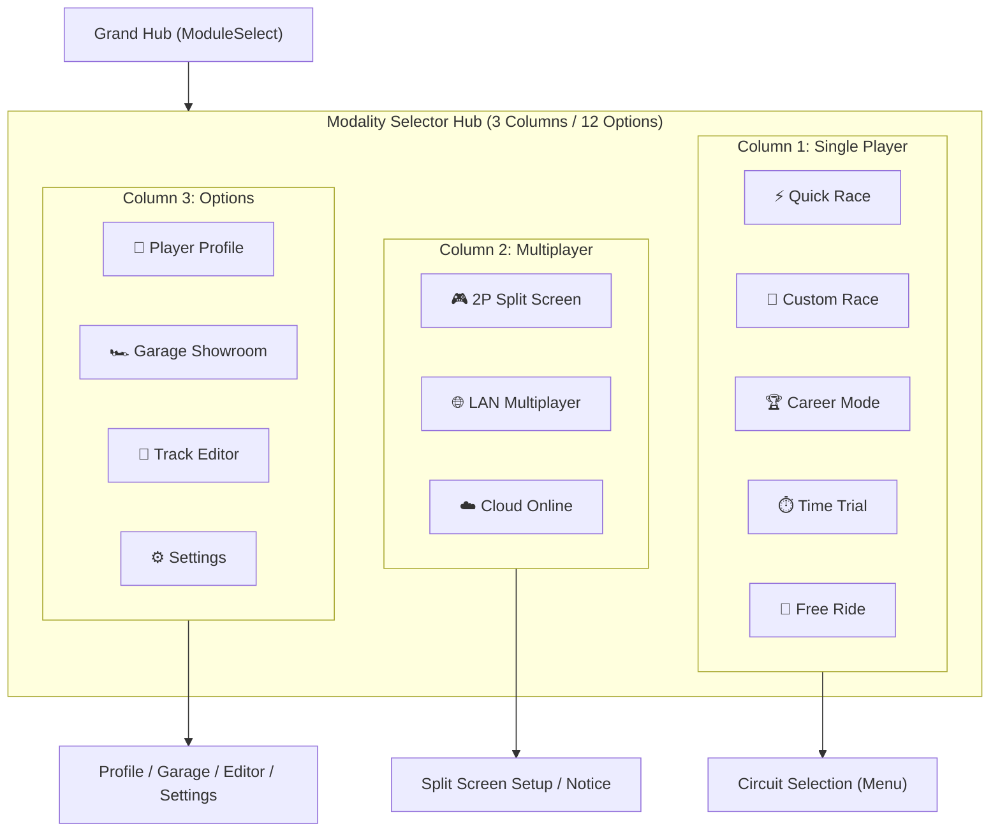

# Feature Spec: Modality Selector Hub Visual Iconography & Emblems 🎨

A cohesive visual iconography design system and texture rendering pipeline introducing bespoke, high-DPI vector emblems for all 12 race modality options within the **Race Modality Selection Hub (`GameState::ModalitySelect`)**. This eliminates text-heavy cards and provides immediate visual recognition across Single Player, Multiplayer, and Options menus, aligning with the visual polish of the Grand Hub module cards.

---

## 🗺️ User Flow & Interface Design

### 1. Navigation Flow & Modality Hub Context
The Race Modality Selection stage (`GameState::ModalitySelect`) acts as the primary session configurator between the Grand Hub (`ModuleSelect`) and Circuit Selection (`Menu`).



### 2. Card Layout & Emblem Placement
In the modality selection menu, each card transitions from a plain text block to an illuminated glass card with a dedicated emblem badge:
- **Badge Anchor (`icon_cx`, `icon_cy`)**: Centered vertically at `curr_y + card_h * 0.5`, positioned at `card_x + scaler.s(44.0)`.
- **Badge Dimensions**: Scaled dynamically (`dim = scaler.s(40.0)` for Single Player cards, `dim = scaler.s(48.0)` for Multiplayer and Options cards).
- **Text Area Offset (`text_x`)**: Content (category tag, modality title, description) aligns cleanly starting at `card_x + scaler.s(76.0)`.
- **Active Focus Indicator**: When a modality item is focused (`is_selected`), a radial glow halo matches the item's accent color (`accent.with_alpha(0.35)`), reinforcing focus alongside the 2.4px glass border and left accent bar.

### 3. Visual Iconography Design System

All 12 emblems are built upon a unified **Cyber-Chassis Shield** base:
- **Base Geometry**: 128x128 rounded rectangle shield (`rx="24"`) rendered in deep carbon-slate gradient (`#0D131F` to `#06080D`).
- **Inner Rim Accent**: Dashed or solid 1.2px border keyed to the item's signature neon accent color.
- **Lighting & Drop Shadows**: Multi-layered SVG drop shadows (`flood-color="#000000"` stdDev 4 + neon glow stdDev 5-6).

#### Column 1: Single Player Modalities
- **Quick Race (`QuickRace`)** (`#33D9FF`): Double lightning bolt cutting across dual motion chevrons, checkered speed bar at bottom base, speed glint spark.
- **Custom Race (`CustomRace`)** (`#FFD133`): Crossed mechanic wrench and tuning caliper layered over horizontal telemetry sliders and background partial cogwheel.
- **Career Mode (`CareerMode`)** (`#33FF66`): Multi-tier victory trophy cup with dual curved handles, flanked by laurel wreath leaves and victory star.
- **Time Trial (`TimeTrial`)** (`#FF33CC`): High-precision split-second chronometer dial with top crown, subdial, trailing dashed ghost PB arc, and sweeping second needle.
- **Free Ride (`FreeRide`)** (`#59BFFF`): Winding serpentine tarmac highway ribbon curving into an open horizon with radiant rising sun rays and mountain silhouetting.

#### Column 2: Multiplayer Modalities
- **2P Split Screen (`SplitScreen`)** (`#FF801A`): Dual vertically split arcade monitor with central glowing divider bar, showing 1P and 2P cars racing neck-and-neck with pedestal stand.
- **LAN Multiplayer (`LanPlay`)** (`#99A6BF`): Central router/switch with status LEDs, branching ethernet bus lines connecting to three local arcade client stations, Wi-Fi arcs.
- **Cloud Online (`CloudPlay`)** (`#99A6BF`): Wireframe planetary globe with orbital high-speed racing trajectory, cloud infrastructure node, and global beacon points.

#### Column 3: Options
- **Player Profile (`PlayerProfile`)** (`#33D9FF`): Aerodynamic full-face racing helmet in profile with dark tinted visor, reflection glint, and 3-star license ranking insignia.
- **Garage Showroom (`Garage`)** (`#FFD133`): Circular rotating turntable pedestal with 360° rotation arrow, dual overhead studio spotlights illuminating a sleek GT supercar silhouette.
- **Track Editor (`TrackEditor`)** (`#33FF66`): CAD drafting grid blueprint with editable Bezier spline curve, keyframe tangent nodes, and precision drafting compass.
- **Settings (`Settings`)** (`#FF33CC`): Precision beveled 8-tooth mechanical gearwheel interlaced with vertical audio/telemetry equalizer sliders and tuning knobs.

---

## ⚙️ Backend Models & API Endpoints

### 1. Data Structures & Texture Cache
Implemented in [`crates/tdrace-app/src/ui/menu.rs`](../crates/tdrace-app/src/ui/menu.rs):

```rust
pub enum ModalityItem {
    QuickRace,
    CustomRace,
    CareerMode,
    TimeTrial,
    FreeRide,
    SplitScreen,
    LanPlay,
    CloudPlay,
    PlayerProfile,
    Garage,
    TrackEditor,
    Settings,
}

/// Lazily decodes and caches the 12 modality emblem textures.
pub fn get_modality_icon_texture(item: ModalityItem) -> Texture2D {
    // Thread-safe mutex-guarded Texture2D cache per ModalityItem
}

/// Renders a modality emblem with glow halo at given center coordinates.
pub fn draw_modality_icon(
    item: ModalityItem,
    cx: f32,
    cy: f32,
    dim: f32,
    is_sel: bool,
    accent: Color,
) {
    let tex = get_modality_icon_texture(item);
    if is_sel {
        draw_circle(cx, cy, dim * 0.55, accent.with_alpha(0.35));
    }
    draw_texture_ex(
        &tex,
        cx - dim * 0.5,
        cy - dim * 0.5,
        Palette::WHITE,
        DrawTextureParams {
            dest_size: Some(macroquad::math::Vec2::new(dim, dim)),
            ..Default::default()
        },
    );
}
```

### 2. Asset Pipeline Integration
- Raw vector SVGs reside in `assets/icons/modalities/*.svg`.
- Pre-rasterized 128x128 PNG textures reside in `assets/icons/modalities/*-128.png`.
- Compiled directly into binary via `include_bytes!` to prevent filesystem runtime I/O delays during navigation.

---

## 🛡️ Security & Role-Based Access Controls (RBAC)

### 1. Visual Integrity & Fallback Rendering
- Texture loading handles malformed byte decoding gracefully with fallback error logs or procedural shape fallbacks.
- Unimplemented modalities (`LanPlay`, `CloudPlay`) maintain clear visual separation through muted steel accent colors and locked badge overlays, preventing user confusion regarding network availability.

---

## 🧪 Verification & Acceptance Criteria

### Automated Tests
- Command to validate specification OKF compliance: `keel validate`
- Command to run system health diagnostics: `keel doctor`
- Command to compile and run UI modality tests: `cargo test -p tdrace-app ui::modality_select`
- Command to verify asset integrity: `cargo test -p tdrace-app tests::render_tests`

### Manual Acceptance Criteria (Pseudo-Gherkin)

- **Scenario: Modality emblems render on Single Player cards**
  - [x] **Given** the player navigates to `GameState::ModalitySelect` on the Single Player tab
  - [x] **When** the menu renders the 5 modality cards
  - [x] **Then** each card displays its corresponding emblem (`QuickRace`, `CustomRace`, `CareerMode`, `TimeTrial`, `FreeRide`) vertically centered on the left
  - [x] **And** the text block begins to the right of the emblem without visual overlap

- **Scenario: Modality emblems render on Multiplayer and Options cards**
  - [x] **Given** the player switches tabs to Multiplayer or Options (`[2]`, `[3]`, or `[TAB]`)
  - [x] **When** the cards render on screen
  - [x] **Then** Multiplayer cards display Split Screen, LAN, and Cloud emblems alongside their status tags
  - [x] **And** Options cards display Profile, Garage, Track Editor, and Settings emblems

- **Scenario: Active card selection glow highlight**
  - [x] **Given** a modality card is selected or hovered
  - [x] **When** the card is drawn
  - [x] **Then** a radial glowing halo matching the modality's signature accent color is rendered behind the emblem badge
  - [x] **And** the left accent bar and outer glass border illuminate in the same signature color

- **Scenario: Responsive display scaling**
  - [x] **Given** the game runs on varying display resolutions (1280x720, 1920x1080, 3840x2160)
  - [x] **When** `UiScaler` scales the UI dimensions
  - [x] **Then** the emblem badges scale proportionately without pixelation or clipping card boundaries

---

## 🔗 Traceability & Codebase Mapping

### Created Assets
- `assets/icons/modalities/quick_race.svg` & `quick_race-128.png`
- `assets/icons/modalities/custom_race.svg` & `custom_race-128.png`
- `assets/icons/modalities/career_mode.svg` & `career_mode-128.png`
- `assets/icons/modalities/time_trial.svg` & `time_trial-128.png`
- `assets/icons/modalities/free_ride.svg` & `free_ride-128.png`
- `assets/icons/modalities/split_screen.svg` & `split_screen-128.png`
- `assets/icons/modalities/lan_play.svg` & `lan_play-128.png`
- `assets/icons/modalities/cloud_play.svg` & `cloud_play-128.png`
- `assets/icons/modalities/player_profile.svg` & `player_profile-128.png`
- `assets/icons/modalities/garage.svg` & `garage-128.png`
- `assets/icons/modalities/track_editor.svg` & `track_editor-128.png`
- `assets/icons/modalities/settings.svg` & `settings-128.png`

### Modified Crates
- [`crates/tdrace-app/src/ui/menu.rs`](../crates/tdrace-app/src/ui/menu.rs) -> Texture cache and `render_modality_select_screen` emblem rendering.
- [`crates/tdrace-app/tests/render_tests.rs`](../crates/tdrace-app/tests/render_tests.rs) -> Modality asset and format integrity tests.
- [`crates/tdrace-app/tests/modality_flow_tests.rs`](../crates/tdrace-app/tests/modality_flow_tests.rs) -> UI test coverage for modality icons and card layout.

### Beads Epic Mapping
- Governed by Epic `tdrace-spec-015-modality-icons-fxat` (*Fulfill Spec 015: Modality Selector Hub Visual Iconography & Emblems*).
