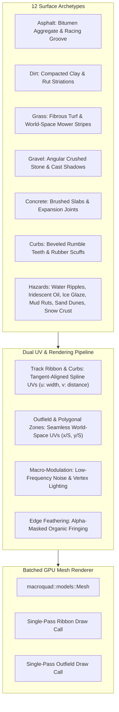
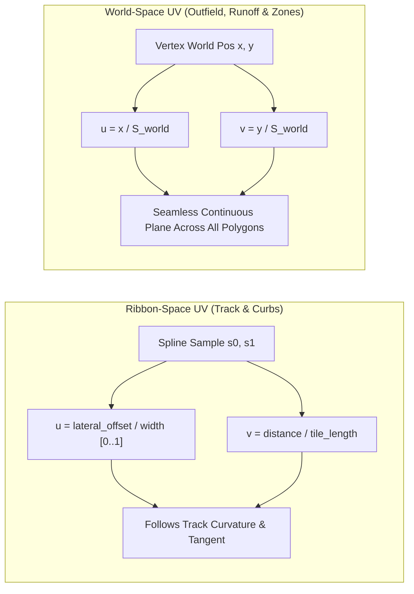

# Feature Spec: Surface Textures & Environmental Materials 🏁🌿🪨

A comprehensive rendering, asset pipeline, and material specification introducing tactile, high-fidelity textured surfaces across all 12 terrain types in **TdRace**. Moving beyond flat-shaded vector polygons, this architecture provides authentic aggregate detail (asphalt bitumen, loose gravel scree, fibrous grass, compacted dirt ruts, viscous mud, and iridescent oil) engineered specifically for **cenital (top-down / bird's-eye) perspective**, with seamless world-space tiling, track-aligned spline ribbon UV mapping, multi-frequency macro-modulation to eliminate repetitive tiling grids, and zero-overhead fallback guarantees for headless simulations.

---

## 🗺️ User Flow & Interface Design

### 1. In-Game Cenital (Top-Down) Visual Aesthetics

#### Art Direction Standard: Authentic Motorsport Physical Fidelity & Micro-Texture
In accordance with user approval, the visual design strictly follows **authentic motorsport physical fidelity and micro-texture**. Rather than cartoonish or exaggerated arcade motifs, all surface materials are calibrated to realistic motorsport scales, natural daylight values, and authentic physical wear patterns that elevate the game's top-down presentation:

In cenital racing view, tracks transform from sterile single-color polygons into rich, tactile motorsport environments:

* **Asphalt (`SurfaceType::Asphalt`)**:
  * Dense bitumen matrix embedded with fine crushed mineral aggregate (granite and basalt mineral flecks).
  * Dynamic racing line rubbering: darker, slicker texture along the optimal apex trajectory where tire rubber has been deposited.
  * Longitudinal pavement seams along multi-lane straightaways and subtle edge aggregate loss near curb borders.
* **Dirt (`SurfaceType::Dirt`)**:
  * Compacted loam and clay with visible wheel rut striations running parallel to the spline tangent.
  * Natural moisture gradients across banked berms: darker moist soil in the low drainage groove transitioning to lighter, sun-baked dry crust on the high cushion.
* **Grass (`SurfaceType::Grass`)**:
  * Top-down turf canopy with fibrous blade clusters, organic clover/thatch patches, and subtle alternating lawn-mower stripe bands ($4\,\text{m}$ pitch) in world space.
* **Gravel (`SurfaceType::Gravel`)**:
  * Coarse loose angular crushed stone ($15-40\,\text{mm}$ simulated scale) with directional micro-shadows, varied slate and limestone hues, and churned tire displacement furrows in runoff traps.
* **Sand (`SurfaceType::Sand`)**:
  * Wind-rippled dune contours with subtle crest highlights, loose silica grain, and warm golden-tan shading.
* **Mud (`SurfaceType::Mud`)**:
  * Heavy viscous churned earth with deep slick tire ruts, glossy wet specular highlights, and dark peat pools.
* **Snow (`SurfaceType::Snow`)**:
  * Micro-crystalline powder snow with cold-sky ambient blue tinting, compressed tire track grooves, and subtle sparkling specular highlights.
* **Ice (`SurfaceType::Ice`)**:
  * Semi-translucent frozen glaze with internal hairline fracture patterns, cloudy trapped air bubbles, and directional specular sheen.
* **Water / Puddles (`SurfaceType::Water`)**:
  * Reflective fluid body with subtle animated wind ripple caustics, soft feathered shorelines where water laps onto asphalt or dirt, and translucent depth darkening.
* **Oil Slick (`SurfaceType::Oil`)**:
  * Dark viscous asphalt-penetrating puddle with iridescent thin-film rainbow interference fringes (Newton ring spectrum shimmer) along thin spread margins.
* **Concrete (`SurfaceType::Concrete`)**:
  * Light gray industrial brushed slabs with transverse expansion joint seams, formwork tie holes, and dark tire scrub marks under heavy braking zones.
* **Curb (`SurfaceType::Curb`)**:
  * High-visibility alternating red-and-white (or yellow-and-black) painted beveled concrete teeth with bevel drop-shadow relief, paint chipping, and black rubber scuff streaks from apex clipping.



### 2. Track Editor & Visual Customization Flow
In the circuit authoring interface and track editor:
* Designers assign surface types per segment, runoff corridor, and custom polygonal zone.
* The editor visualizer immediately reflects texture tiling, previewing racing line rubbering, runoff gravel margins, and curb bevels in real time without requiring texture baking.
* A texture preview inspector allows toggling texture debug overlays (UV grid lines, mipmap level coloration, and normal relief).

---

## ⚙️ Backend Models & API Endpoints

### 1. Surface Material Entities & Registry (`crates/tdrace-app/src/render/surface_material.rs`)

The material system is centralized in a singleton cache avoiding duplicate GPU texture allocations:

```rust
/// Physical and visual material properties for a surface type.
pub struct SurfaceMaterial {
    pub surface_type: SurfaceType,
    pub texture: Texture2D,
    pub tile_scale_meters: f32,
    pub base_tint: Color,
    pub roughness: f32,
    pub has_macro_modulation: bool,
}

pub struct SurfaceMaterialRegistry {
    materials: HashMap<SurfaceType, SurfaceMaterial>,
    curb_texture: Option<Texture2D>,
    fringe_mask: Option<Texture2D>,
    noise_texture: Option<Texture2D>,
    quality: SurfaceTextureQuality,
}
```

### 2. Dual UV Coordinate Mapping System

To eliminate texture stretching, seam mismatches, and unnatural distortion across curved tracks and vast outfields, the engine implements two complementary UV mapping regimes:

#### A. Spline Ribbon-Space UV Mapping (Track Ribbon, Curbs, Bridge Decks)
For geometry constructed along the track spine (asphalt ribbon, dirt track, rumble curbs, and bridge structures):
* **Lateral Axis ($u$)**: Mapped across the track width from left edge ($u = 0.0$) to right edge ($u = 1.0$).
* **Longitudinal Axis ($v$)**: Mapped along spline arc length:
  $$v = \frac{\text{sample.distance}}{\lambda_{\text{tile}}}$$
  where $\lambda_{\text{tile}}$ is the nominal physical repetition length of the surface texture (e.g. $4.0\,\text{m}$ for asphalt, $2.0\,\text{m}$ for dirt ruts, $1.5\,\text{m}$ for curbs).
* **Advantage**: Textures naturally bend and flow around tight hairpins, sweeping chicanes, and high-speed banked ovals without distortion. Aggregate grain, lane stripes, and tire ruts follow the natural driving direction.

#### B. Seamless World-Space UV Mapping (Outfield Backdrops, Runoffs, Hazard Zones)
For outfield terrain, irregular polygon runoff zones, and hazard overlays:
* **Planar World Coordinates**:
  $$u = \frac{x_{\text{world}}}{S_{\text{world}}}, \quad v = \frac{y_{\text{world}}}{S_{\text{world}}}$$
  where $S_{\text{world}}$ is the world-space tile scale (e.g. $8.0\,\text{m}$ for grass turf, $6.0\,\text{m}$ for gravel traps, $10.0\,\text{m}$ for sand dunes).
* **Advantage**: Outfield terrain, gravel traps spanning multiple segments, and freeform hazard zones share a continuous coordinate frame. No seams or misalignment occur at segment junctions or polygon boundaries when the camera pans or rotates.



### 3. Multi-Frequency Macro-Modulation & Repetition Breaking

Repetitive tiling grids ("checkerboard artifact") destroy visual immersion on long racing circuits. To prevent this, the material system applies a multi-frequency modulation pass:

* **High-Frequency Micro Texture**: $256 \times 256$ or $512 \times 512$ tileable albedo map capturing fine surface grain ($1 - 4\,\text{m}$ spatial frequency).
* **Low-Frequency Macro Modulation**: A continuous perlin/simplex value field ($32 - 64\,\text{m}$ spatial frequency) modulates surface luminance and tint via vertex colors:
  $$C_{\text{final}} = C_{\text{texture}} \cdot \left(1.0 + \Delta_{\text{macro}}(x, y) \cdot 0.18\right) \cdot C_{\text{vertex\_lighting}}$$
* **Hybrid Racing Line Rubbering Architecture**:
  * **Phase 1 (Static Apex Groove Baseline)**: Pre-computed at track load time along corner entries, apex clipping points, and corner exits based on spline curvature and optimal trajectory. Directly modulates vertex colors ($\rho_{\text{rubber}} \in [0.0, 0.40]$) with **zero per-frame CPU overhead**:
    $$C_{\text{asphalt}} = C_{\text{asphalt}} \cdot (1.0 - \rho_{\text{rubber}}) + C_{\text{rubber}} \cdot \rho_{\text{rubber}}$$
    Produces an authentic dark, slick rubber streak along corner entries and apex clipping points from Lap 1.
  * **Phase 2 (Dynamic Track Evolution Hook)**: Structured with per-segment wear state hooks where tire slip ($|\vec{v}_{\text{slip}}| \cdot F_{\text{load}}$) dynamically increments $\Delta \rho_{\text{rubber}}$, allowing multi-lap races to organically darken the line, generate brake lockup patches, and push rubber marbles off-line over extended sessions.

### 4. Organic Edge Feathering & Transitional Fringing

To replace sharp geometric razor borders between differing surface types (e.g. asphalt track edge meeting grass, or gravel trap meeting outfield terrain):
* **Fringe Quad Strip**: An outer transition band ($0.4 - 0.8\,\text{m}$ wide) generated along segment runoff boundaries.
* **Alpha-Masked Noise Feathering**: Uses an edge fringe alpha mask containing jagged organic clump patterns.
* **Result**:
  * Grass organically encroaches onto the edges of gravel and dirt tracks.
  * Gravel stones scatter irregularly into the grass outfield rather than terminating in a hard straight vector line.
  * Water puddle perimeters exhibit natural organic pooling contours.

### 5. GPU Mesh Batching Pipeline (`macroquad::models::Mesh`)

Rather than issuing hundreds of individual quad draw calls (`draw_quad`), the renderer compiles visible track segments into batched GPU meshes:

```rust
pub struct SurfaceBatchMesh {
    pub mesh: macroquad::models::Mesh,
    pub surface: SurfaceType,
    pub is_world_space: bool,
}
```

* **Frustum / View-Bounds Culling**: Only segments intersecting the active camera viewport (`is_segment_in_view`) are evaluated.
* **Vertex Structure**:
  ```rust
  Vertex {
      position: Vec3::new(pt.x, pt.y, z_layer),
      uv: Vec2::new(u, v),
      color: vertex_color,
  }
  ```
* **Single Draw Call Per Surface Layer**: All asphalt ribbon segments are merged into one `Mesh` and rendered with `draw_mesh(&asphalt_mesh)`. Runoff corridors, curbs, and outfield backdrops are each dispatched in single batched calls, cutting draw call count from $>600$ to $<10$ per frame.

### 6. Procedural Synthetic Fallback Generator

To preserve robust development workflows, headless testing, and resilience against missing asset files:
* If asset files are not found on disk (e.g. running from an alternate working directory or test sandbox), `SurfaceMaterialRegistry` automatically synthesizes procedural pixel textures in memory:
  * **Asphalt**: High-frequency value noise ($1 \times 1\,\text{px}$) with random mineral specks ($\sim 5\%$ light gray/white flecks).
  * **Dirt**: Directional anisotropic noise along the Y axis simulating wheel ruts with reddish-brown color jitter.
  * **Grass**: Multi-octave green blade noise with subtle diagonal thatch pattern.
  * **Gravel**: Cellular Voronoi pebble generation with darkened border crevices.
  * **Concrete**: Medium gray base with fine horizontal brush scratch lines and dark expansion joint seam.
  * **Curbs**: High-contrast red and white alternating bands with beveled vertical gradient.
* **Zero Failure Guarantee**: The game will never crash, panic, or display missing-texture magenta artifacts due to texture loading.

---

## 🛡️ Security & Role-Based Access Controls (RBAC)

### 1. Memory Safety, Bounded VRAM & Buffer Overflow Prevention
* **Texture Dimension Sanity**: Texture asset loaders strictly validate image dimensions ($\max 1024 \times 1024\,\text{px}$, 8-bit RGBA) before allocating GPU handles, guarding against decompression bombs or out-of-memory crashes.
* **Bounded Mesh Allocation**: Vertex and index buffers for spline mesh batching enforce strict capacity caps based on active track segment count.
* **VRAM Budget**: Total surface texture memory footprint is strictly constrained to $< 16\,\text{MB}$, ensuring rock-solid stability in 32-bit WebAssembly environments and mobile GPUs.

### 2. Deterministic Physics Invariance & Headless Decoupling
* **Decoupled Physics Execution**: Physics calculations in `crates/wheelbase` (`friction_coefficient`, `rolling_resistance_multiplier`, `step()`) operate with zero dependency on textures, shaders, or GPU states.
* **Headless Simulation Guarantee**: Benchmarks and headless testing harnesses (`wheelbase::sim::SimulationRunner`) run at $> 100,000\,\text{steps/sec}$ without allocating or querying graphical assets.
* **Settings Access Control**: Surface texture quality options are localized to client-side graphics settings (`GameState::Settings`) and never alter underlying collision boundaries or vehicle handling.

---

## 🎛️ Settings, Quality Levels & Platform Scalability

### 1. Graphics Quality Profiles (`SurfaceTextureQuality`)
Added to the game settings menu (`GameState::Settings`) and configuration file:

| Quality Level | Texture Resolution | UV Mapping | Macro-Modulation | Edge Feathering | Draw Calls | Target Hardware |
| :--- | :--- | :--- | :--- | :--- | :--- | :--- |
| **Off (Flat)** | None (Solid Color) | None | None | None | Batched / Primitives | Very low-end / Retro |
| **Standard** | $256 \times 256$ Linear | Dual Ribbon & World | Disabled | Disabled | Batched Mesh | Integrated GPUs / WebAssembly |
| **High (Default)** | $512 \times 512$ Mipmapped | Dual Ribbon & World | Enabled ($32\,\text{m}$) | Enabled | Batched Mesh | Modern Desktop / Laptops |

### 2. Headless Physics Invariance & WebAssembly Safety
* **Headless Decoupling**: Physics calculation in `crates/wheelbase` (`friction_coefficient`, `rolling_resistance_multiplier`, `step()`) operates entirely independently of `tdrace-app` rendering. Textures are never initialized in headless simulation runners (`wheelbase::sim::SimulationRunner`), sustaining $>100,000\,\text{steps/sec}$ throughput.
* **VRAM Budget**: Complete surface material pack occupies $< 16\,\text{MB}$ of VRAM, comfortably fitting within WebAssembly 32-bit memory boundaries and low-spec mobile GPUs.
* **Frame Time Impact**: Batched mesh rendering targets $< 0.8\,\text{ms}$ per frame at $1080\text{p} @ 60\,\text{FPS}$, representing a performance *improvement* over hundreds of individual unbatched primitive calls.

---

## 🧪 Verification & Acceptance Criteria

### Automated Tests
- Command to run codebase tests: `cargo test -p tdrace-app`
- Command to run core simulation tests: `cargo test -p tdrace-core`
- Command to verify headless physics independence: `cargo test -p wheelbase`

### Manual Acceptance Criteria (Pseudo-Gherkin)

- **Scenario: Spline ribbon texture curvature alignment**
  - [ ] **Given** an asphalt or dirt track with sharp curved corners
  - [ ] **When** the track ribbon is rendered on screen
  - [ ] **Then** the surface texture must follow the tangent direction of the track spline without angular pinching or sliding
  - [ ] **And** the texture repetition must remain consistent along the arc length regardless of corner radius

- **Scenario: Outfield grass seamless world-space continuity**
  - [ ] **Given** a circuit with an expansive grass outfield backdrop and separate grass runoff zones
  - [ ] **When** the camera pans across the circuit following a moving car
  - [ ] **Then** the grass texture must tile seamlessly across all outfield polygons and zone boundaries
  - [ ] **And** no texture seams or shearing must appear at segment junctions

- **Scenario: Procedural fallback on missing asset files**
  - [ ] **Given** the game binary launched in an environment where `assets/textures/surfaces/` is missing or inaccessible
  - [ ] **When** the track materials are initialized
  - [ ] **Then** the engine must automatically synthesize procedural memory textures for all 12 surface types
  - [ ] **And** the game must render without panicking or displaying magenta missing-texture placeholders

- **Scenario: Graphics settings quality toggle**
  - [ ] **Given** the game running in `GameState::Settings`
  - [ ] **When** the player switches `SurfaceTextureQuality` between `Off`, `Standard`, and `High`
  - [ ] **Then** the track rendering must immediately switch between flat vector colors and textured materials
  - [ ] **And** frame rate must remain $\ge 60\,\text{FPS}$ across all quality levels

- **Scenario: Macro-modulation repetition breaking on long straights**
  - [ ] **Given** a straight track ribbon exceeding $400\,\text{m}$ in length
  - [ ] **When** rendered at `High` quality
  - [ ] **Then** low-frequency luminance modulation must prevent visible repeating tile patterns along the asphalt surface

- **Scenario: Banked curve gradient and lighting modulation**
  - [ ] **Given** an oval or banked circuit segment with bank angle $> 10^\circ$
  - [ ] **When** the textured asphalt or dirt ribbon is rendered
  - [ ] **Then** the banking gradient shading and rim shadow must modulate the surface texture rather than obscuring it with solid flat color

- **Scenario: Headless simulation performance independence**
  - [ ] **Given** the headless simulation harness (`wheelbase::sim::SimulationRunner`)
  - [ ] **When** executing standard acceleration and braking test protocols
  - [ ] **Then** simulation execution must complete with zero texture dependencies or graphics initializations
  - [ ] **And** throughput must exceed $100,000$ simulation steps per second

---

## 🔗 Traceability & Codebase Mapping

### Created/Modified Files
- `[NEW]` `specs/016_surface_textures_and_environmental_materials.md` -> Formal specification document.
- `[NEW]` `crates/tdrace-app/src/render/surface_material.rs` -> Material data structures, texture registry, procedural synthetic fallbacks, and UV utilities.
- `[MODIFY]` `crates/tdrace-app/src/render/track.rs` -> Integration of batched textured meshes into `render_surface_pass`, `render_runoff_pass`, and `render_curbs_pass`.
- `[MODIFY]` `crates/tdrace-app/src/render/mod.rs` -> Module exports for surface materials.
- `[MODIFY]` `crates/tdrace-app/src/render/color.rs` -> Surface tinting, macro-modulation color palettes, and roughness factors.
- `[MODIFY]` `crates/tdrace-app/src/ui/settings.rs` -> `SurfaceTextureQuality` setting option and serialization.
- `[MODIFY]` `crates/tdrace-app/tests/render_tests.rs` -> Unit tests verifying texture registration, procedural generation, and UV calculations.
- `[NEW]` `assets/textures/surfaces/` -> Standardized tileable surface texture asset files.
- `[MODIFY]` `specs/constitution/ROADMAP.md` -> Milestone linkage under Phase 4.
