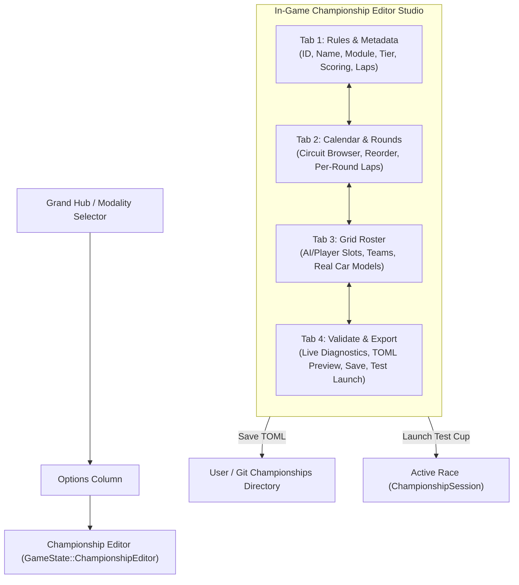

# Feature Spec: Declarative Series Format & In-Game Series Studio 🏆📜🛠️

A declarative, human-readable data format (TOML) and interactive visual authoring environment enabling developers and players to define, customize, validate, export, and compete in multi-round racing series across all motorsport modules (**GT World Challenge**, **NASCAR**, **Rallycross**, **Karting**, **Extreme Off-Road**, and **Classic Arcade**).

### 🏷️ Motorsport Taxonomy & Terminology
To maintain clear domain semantics across the codebase and user interface:
- **`Series`** (Generic Term): The generic engine, data structure, module, and container for any multi-round competition (`SeriesDefinition`, `SeriesSession`, `SeriesManager`, `SeriesEditor`, `series/` folder).
- **`Championship`** (Specific Event): Formal multi-tier career progression events (e.g., GT World Challenge Tier 1–5, NASCAR Cup Series).
- **`Cup`** (Specific Event): Bite-sized, custom, or standalone community/player multi-race events (e.g., Clubman Sprint Cup, Grassroots Cup).
- Full backwards-compatibility is maintained via Serde aliases (`#[serde(alias = "championship", alias = "cup")]`), storage aliases, and public type re-exports (`pub type Championship* = Series*`, `pub use series as tournament;`).

---

## 🎯 Executive Summary & Context

Prior to this specification, championships, series, and career cups in **TdRace** were hardcoded into Rust imperative functions (`start_gt_championship`, `start_nascar_career_tier`, `start_rally_career_tier`, etc.) within `crates/tdrace-app/src/game/mod.rs`. Modifying track calendars, tweaking lap counts, altering scoring systems, rebalancing AI driver rosters, or introducing custom community cups required modifying and recompiling Rust source code.

This specification introduces:
1. **Declarative Series Data Format (TOML)**: A clean, human-readable schema specifying metadata, regulations, point systems, multi-circuit calendars, and driver/car rosters. Supports `[series]`, `[championship]`, and `[cup]` table headers interchangeably.
2. **Series File Discovery & Storage Engine (`SeriesManager`)**: Dual directory resolution scanning repository presets (`series/{module}/`), user-authored creations (`$XDG_DATA_HOME/tdrace/series/`), and standalone embedded compile-time presets.
3. **In-Game / Developer Series Studio (`GameState::SeriesEditor`)**: A full-screen interactive CAD-style cup authoring studio featuring tabbed metadata configuration, visual circuit picking with length/surface previews, vehicle roster grid management with vehicle catalog integration, real-time schema validation, syntax-highlighted TOML export, and instant "Launch Test Cup" race simulation.
4. **Modality Hub Integration**: Seamless access via **Modality Selector Hub (`GameState::ModalitySelect`)** under Options column ("Series Editor"), developer hotkeys, and Track Manager cross-linking.

---

## 🗺️ User Flow & Interface Design

### 1. Navigation Flow



### 2. Editor Studio Tab Layout

The Championship Editor runs in full screen using `UiScaler` responsive dimensions:
* **Header Bar**:
  * Title badge: `CHAMPIONSHIP STUDIO • [DEV WORKBENCH]`.
  * Navigation Tabs:
    * `[ 1. RULES & INFO ]`
    * `[ 2. CALENDAR & ROUNDS ]`
    * `[ 3. DRIVER GRID ]`
    * `[ 4. VALIDATE & EXPORT ]`
  * Active Championship Slug: `id: gt4_clubman_sprint.toml`.
* **Tab 1: Rules & Metadata**:
  * **Championship ID**: System slug (e.g. `gt4_clubman_sprint`).
  * **Display Title**: Rich title (e.g. `GT4 Clubman Sprint Cup (Tier 1)`).
  * **Description**: Multi-line summary blurb.
  * **Motorsport Module**: Cycle selector (`GT World Challenge`, `NASCAR`, `Rally Cross`, `Karting`, `Extreme Off-Road`, `Classic Arcade`).
  * **Career Tier**: Cycle selector (`Tier 1` through `Tier 5`, or `Open / Custom`).
  * **Default Laps**: Integer stepper ($1 \dots 50$ laps).
  * **Point System**: Cycle selector (`FIA Standard (25-18-15...)`, `MotoGP (25-20-16...)`, `NASCAR Cup (40-35-34...)`, `Classic Arcade (10-6-4...)`, `Custom Matrix`).
  * **Fastest Lap Bonus**: Boolean toggle ($+1$ pt for top-10 in FIA; $+10$ pts stage bonus in NASCAR).
  * **Clean Race Bonus**: Boolean toggle for incident-free race bonus.
* **Tab 2: Calendar & Rounds**:
  * Visual ordered round list ($1 \dots N$ rounds).
  * Round card displaying:
    * Round number badge (`ROUND 01`).
    * Circuit ID and Title.
    * Surface breakdown (Asphalt %, Dirt %, etc.).
    * Lap count override (defaults to global laps, editable per round).
    * Up / Down reordering buttons.
    * Delete round button.
  * **Add Round Button**: Opens modal circuit browser filtered by selected module or all tracks.
* **Tab 3: Driver Grid**:
  * Grid roster table with columns: `Pos`, `Role (Player/AI)`, `Driver Name`, `Team Name`, `Car Model`, `Country`, `Actions`.
  * **Car Model Selector**: Integrated with vehicle catalog (`crate::catalog`), filtered by championship module and tier with preview of BHP, weight, and drivetrain.
  * **Quick Action: 'Autofill Module Grid'**: One-click generation of authentic bot drivers, teams, and homologated car models matching the chosen module and tier.
* **Tab 4: Validate, Export & Test**:
  * **Diagnostic Validator Panel**:
    * Green checkmarks for passing requirements.
    * Yellow warning badges for non-critical advisories (e.g. fewer than 4 rounds).
    * Red error badges for blockers (e.g. missing track ID, zero player slots, duplicate driver IDs).
  * **TOML Source Code Preview**: Syntax-formatted view of generated TOML document.
  * **Action Buttons**:
    * `[ SAVE TO USER CUPS ]`: Saves to `<user_data_dir>/championships/<id>.toml`.
    * `[ SAVE TO REPO PRESETS ]` (Dev Mode only): Saves to `championships/<module>/<id>.toml`.
    * `[ LAUNCH TEST CUP ]`: Converts directly into a `ChampionshipSession` and boots immediately into Round 1!

---

## 📄 Declarative TOML Schema Specification

```toml
# ==============================================================================
# TdRace Championship Specification Schema v1.0
# ==============================================================================

[championship]
id = "gt4_clubman_sprint"
name = "GT4 Clubman Sprint Cup (Tier 1)"
description = "Entry-level sprint cup featuring homologated GT4 sports cars across European circuits."
module_id = "gt"            # "gt", "nascar", "rally", "kart", "extreme_offroad", "classic"
tier = 1                    # 1..=5 (0 for open / non-career)
laps_per_round = 4          # Default laps per round (1..=50)
bot_count = 7               # Number of AI opponents (optional, defaults to drivers.len() - 1)
ai_difficulty = "standard"   # "novice", "standard", "pro", "legend"
icon = "trophy"             # Optional emblem identifier

[scoring]
system = "fia"              # "fia", "motogp", "arcade", "nascar", "custom"
fastest_lap_bonus = true     # +1 pt inside top 10 (FIA) or +10 stage win (NASCAR)
stage_win_bonus = false     # NASCAR stage win points
clean_race_bonus = false    # Clean race incident-free bonus
custom_points = []          # Points array if system = "custom"

[[rounds]]
order = 1
track_id = "monza"
name = "Autodromo Nazionale Monza"
laps = 4

[[rounds]]
order = 2
track_id = "spa"
name = "Circuit de Spa-Francorchamps"
laps = 4

[[rounds]]
order = 3
track_id = "silverstone"
name = "Silverstone Circuit"
laps = 4

[[rounds]]
order = 4
track_id = "classic_grand_prix"
name = "Autodromo di Modena"
laps = 5

[[drivers]]
id = "player"
name = "Player"
team = "Apex GT Racing"
is_player = true
car_model_id = "gt_toyota_supra_gt4"
country = "ESP"
livery_idx = 0

[[drivers]]
id = "max_hunter"
name = "Max Hunter"
team = "Red Bull GT"
car_model_id = "gt_porsche_718_cayman_gt4_rs"
country = "NED"
ai_character = "aggressive"
livery_idx = 1

[[drivers]]
id = "charles_laurent"
name = "Charles Laurent"
team = "Scuderia GT"
car_model_id = "gt_bmw_m4_gt4_g82"
country = "MCO"
ai_character = "smooth"
livery_idx = 2

[[drivers]]
id = "lewis_vance"
name = "Lewis Vance"
team = "Scuderia GT"
car_model_id = "gt_mercedes_amg_gt4"
country = "GBR"
ai_character = "strategic"
livery_idx = 3
```

---

## ⚙️ Backend Models & API Endpoints

### 1. Serde Data Types (`series::format`)

```rust
#[derive(Debug, Clone, PartialEq, Serialize, Deserialize)]
pub struct SeriesMeta {
    pub id: String,
    pub name: String,
    #[serde(default)]
    pub description: String,
    #[serde(default = "default_module")]
    pub module_id: String,
    #[serde(default = "default_tier")]
    pub tier: u32,
    #[serde(default = "default_laps")]
    pub laps_per_round: u32,
    #[serde(default)]
    pub bot_count: Option<usize>,
    #[serde(default)]
    pub ai_difficulty: Option<String>,
    #[serde(default)]
    pub icon: Option<String>,
}

pub type ChampionshipMeta = SeriesMeta;

#[derive(Debug, Clone, PartialEq, Serialize, Deserialize)]
pub struct ScoringConfig {
    #[serde(default = "default_scoring_system")]
    pub system: String,
    #[serde(default)]
    pub fastest_lap_bonus: bool,
    #[serde(default)]
    pub stage_win_bonus: bool,
    #[serde(default)]
    pub clean_race_bonus: bool,
    #[serde(default)]
    pub custom_points: Vec<u32>,
}

#[derive(Debug, Clone, PartialEq, Serialize, Deserialize)]
pub struct RoundConfig {
    #[serde(default)]
    pub order: usize,
    pub track_id: String,
    #[serde(default)]
    pub name: Option<String>,
    #[serde(default)]
    pub laps: Option<u32>,
    #[serde(default)]
    pub weather: Option<String>,
}

#[derive(Debug, Clone, PartialEq, Serialize, Deserialize)]
pub struct DriverConfig {
    pub id: String,
    pub name: String,
    pub team: String,
    #[serde(default)]
    pub is_player: bool,
    #[serde(default)]
    pub car_model_id: Option<String>,
    #[serde(default)]
    pub country: Option<String>,
    #[serde(default)]
    pub ai_character: Option<String>,
    #[serde(default)]
    pub livery_idx: Option<u8>,
}

#[derive(Debug, Clone, PartialEq, Serialize, Deserialize)]
pub struct SeriesDefinition {
    #[serde(alias = "championship", alias = "cup")]
    pub series: SeriesMeta,
    #[serde(default)]
    pub scoring: ScoringConfig,
    pub rounds: Vec<RoundConfig>,
    pub drivers: Vec<DriverConfig>,
}

pub type ChampionshipDefinition = SeriesDefinition;
```

### 2. Runtime Conversion & Session Bridging

`SeriesDefinition` provides direct lossless conversion to and from `SeriesSession` (aliased as `ChampionshipSession`):
* `pub fn to_session(&self) -> SeriesSession`:
  * Maps `scoring` to `PointSystem`.
  * Extracts ordered `track_ids`.
  * Populates `SeriesStandingEntry` for each driver in `drivers`.
  * Sets `laps_per_round`.
* `pub fn from_session(session: &SeriesSession, module_id: &str, tier: u32) -> Self`:
  * Recovers a structured definition from an active runtime session.

---

## 🛡️ Security & Role-Based Access Controls (RBAC)

### 1. Storage Isolation & Sandboxing
* **Automated Test Isolation**: When running tests (`is_test_environment()`), championship saving routes exclusively to a sandboxed temporary directory (`<temp_dir>/tdrace_test_sandbox/championships/`), strictly preventing contamination or corruption of live user championships.
* **Path Traversal Prevention**: Championship identifiers (`id`) are validated using strict alphanumeric, hyphen, and underscore tokens (`^[a-zA-Z0-9_-]+$`). File paths strictly prevent directory traversal attacks (`../` or absolute path escapes).
* **Safe TOML Parsing**: Deserialization of TOML content strictly enforces memory limits and structural bounds ($\le 128$ rounds, $\le 64$ drivers) to prevent resource exhaustion or recursive parsing panics.

### 2. Developer vs Player Permission Gates
* **Preset Write Protection**: Only execution with `is_dev_mode() == true` can write directly to repository presets (`championships/{module}/`). Standard player sessions are restricted to writing user-level custom cups (`$XDG_DATA_HOME/tdrace/championships/`).

---

## 🧪 Verification & Acceptance Criteria

### Automated Tests
- Command: `cargo test -p tdrace-app --test championship_tests`
- Command: `cargo test -p tdrace-app tournament`

### Manual Acceptance Criteria (Pseudo-Gherkin)

- **Scenario: Parse valid declarative championship TOML file**
  - [x] **Given** a valid TOML document defining `[championship]`, `[scoring]`, `[[rounds]]`, and `[[drivers]]`
  - [x] **When** parsed via `ChampionshipDefinition::from_toml(content)`
  - [x] **Then** deserialization succeeds without error
  - [x] **And** `rounds` contains all declared circuit IDs in specified order
  - [x] **And** `drivers` contains the player slot and all AI drivers with team and car model mappings

- **Scenario: Round-trip serialization invariance**
  - [x] **Given** an in-memory `ChampionshipDefinition`
  - [x] **When** serialized to TOML via `to_toml()` and then deserialized back via `from_toml()`
  - [x] **Then** the resulting struct equals the original struct exactly

- **Scenario: Schema validation catches missing tracks and invalid driver counts**
  - [x] **Given** a `ChampionshipDefinition` with 0 rounds or 1 driver
  - [x] **When** `def.validate(&track_manager)` is invoked
  - [x] **Then** validation fails returning descriptive error strings
  - [x] **And** no invalid championship can be started or saved

- **Scenario: Conversion into playable ChampionshipSession**
  - [x] **Given** a validated `ChampionshipDefinition`
  - [x] **When** `def.to_session()` is called
  - [x] **Then** a `ChampionshipSession` is returned with matching track count, point system, and standings table
  - [x] **And** submitting round results awards points according to the declared scoring system

- **Scenario: Championship Editor UI navigation and live test launch**
  - [x] **Given** the user in `GameState::ChampionshipEditor`
  - [x] **When** the user modifies track order and clicks "Launch Test Cup"
  - [x] **Then** the game immediately transitions to the active championship with the configured calendar
  - [x] **And** the first circuit loads with the authored AI grid

---

## 🔗 Traceability & Codebase Mapping

### Created/Modified Files
- `[NEW]` `specs/017_declarative_championship_format_and_editor.md` -> Formal specification document.
- `[NEW]` `crates/tdrace-app/src/series/format.rs` -> Declarative TOML structs, Serde attributes, validation, and conversion methods.
- `[NEW]` `crates/tdrace-app/src/series/manager.rs` -> `SeriesManager` file scanner, directory resolver, cache, and save/load engine.
- `[MODIFY]` `crates/tdrace-app/src/series/mod.rs` -> Re-export `format` and `manager` modules, session runtime, and backwards-compatible aliases.
- `[MODIFY]` `crates/tdrace-app/src/lib.rs` -> Export `pub mod series;` and backwards-compatible `pub use series as tournament;`.
- `[MODIFY]` `crates/tdrace-app/src/storage.rs` -> `resolve_user_series_dir()` and `resolve_git_series_dir()`.
- `[NEW]` `crates/tdrace-app/src/ui/series_editor.rs` -> Full-screen interactive Series Studio editor UI.
- `[MODIFY]` `crates/tdrace-app/src/ui/menu.rs` -> Add `ModalityItem::SeriesEditor` to Options column and modal dispatch.
- `[MODIFY]` `crates/tdrace-app/src/game/mod.rs` -> Integrate `GameState::SeriesEditor`, hotkeys, and test cup launcher.
- `[NEW]` `series/gt/gt4_clubman_sprint.toml` -> Built-in GT Tier 1 preset.
- `[NEW]` `series/nascar/nascar_cup_tier5.toml` -> Built-in NASCAR Tier 5 preset.
- `[NEW]` `series/rally/rally_world_cup.toml` -> Built-in Rallycross preset.
- `[NEW]` `series/kart/kart_world_cup.toml` -> Built-in Karting preset.
- `[NEW]` `series/extreme_offroad/extreme_offroad_cup.toml` -> Built-in Extreme Offroad preset.
- `[NEW]` `crates/tdrace-app/tests/series_tests.rs` -> Comprehensive unit test suite for TOML serialization, validation, and session bridging.
- `[MODIFY]` `specs/index.md` -> Registered Spec 017.
- `[MODIFY]` `specs/constitution/ROADMAP.md` -> Milestone registration.
