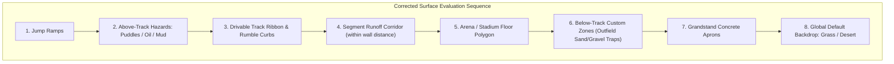

# Feature Spec: Surface Tire Marks and Runoff Terrain Dynamics 🏎️🪨🌿

A comprehensive architectural, physics, and visual effects specification resolving the surface query precedence inversion between segment runoff corridors and below-track terrain zones. Furthermore, introduces an authentic multi-surface tire marking pipeline, deformable terrain rutting/furrowing dynamics, expanded stone/mud/snow particle roost systems, and dynamic tire dirt contamination transfer across all 12 motorsport surface archetypes in **TdRace**.

---

## 🗺️ User Flow & Interface Design

### 1. In-Game Cenital (Top-Down) Experience & Surface Transitions
In top-down racing view, vehicle departure from the asphalt track ribbon into runoff corridors and off-track terrain exhibits physically consistent visual and dynamic feedback:
- **Runoff Corridor Entry**: When a vehicle runs wide at the apex or exit of a corner into a segment runoff corridor (e.g. `SurfaceType::Gravel`), the wheels immediately sample the runoff corridor's designated surface material ($\mu = 0.70$, rolling resistance $2.5$), ignoring any underlying background terrain patch (e.g. BelowTrack sand trap).
- **Surface-Distinct Tire Marks**:
  - On **Asphalt** and **Concrete**: Tires leave high-contrast carbon black rubber marks only when actively slipping, sliding, or braking hard.
  - On **Gravel**: Tires carve rough, slate-grey displacement furrows with jagged ragged edges and scattered pebbles, throwing high-velocity crushed stone roost particles.
  - On **Sand**: Tires excavate warm tan dune trenches revealing darker moist sub-sand.
  - On **Mud**: Deep, viscous, dark peat ruts are gouged into the earth with heavy muck splatter.
  - On **Snow**: Wheels pack down cool blue-shadowed ruts in the powder snow with crystalline roost plumes.
  - On **Grass**: Rolling leaves bruised turf ribbons; heavy sliding tears through sod to expose raw dark topsoil.
- **Tire Dirt Contamination Transfer**: When a vehicle recovers from gravel, mud, sand, or dirt and rejoins the asphalt circuit, the contaminated tires deposit fading dirty tracks onto the clean pavement for 10–15 meters until the tread is scrubbed clean, accompanied by a slight initial grip deficit.



---

## ⚙️ Backend Models & API Endpoints

### 1. Surface Classification Extensions (`crates/wheelbase/src/surface.rs`)

Extend `SurfaceType` with tactile classification capabilities:

```rust
impl SurfaceType {
    /// Whether this surface is a loose or deformable terrain where tires physically
    /// displace and indent material rather than depositing vulcanized rubber.
    #[inline]
    pub const fn is_loose_deformable(self) -> bool {
        matches!(
            self,
            Self::Gravel | Self::Sand | Self::Dirt | Self::Mud | Self::Snow
        )
    }

    /// Whether this surface is a rigid, non-deformable pavement where marks
    /// result purely from friction rubber transfer.
    #[inline]
    pub const fn is_rigid_pavement(self) -> bool {
        matches!(self, Self::Asphalt | Self::Concrete | Self::Curb)
    }

    /// Whether rolling tires leave visible depression ruts without requiring wheel slip.
    #[inline]
    pub const fn leaves_rolling_rut(self) -> bool {
        matches!(
            self,
            Self::Gravel | Self::Sand | Self::Dirt | Self::Mud | Self::Snow | Self::Grass
        )
    }
}
```

### 2. Tire Contamination State (`crates/wheelbase/src/tire.rs` & `car.rs`)

Extend `WheelTelemetry` with surface contamination tracking:

```rust
pub struct WheelTelemetry {
    // ... existing fields ...
    /// Dynamic surface contamination level [0.0 = clean rubber, 1.0 = heavily coated].
    pub dirt_contamination: f32,
    /// Surface type that coated the tire tread.
    pub dirt_surface: SurfaceType,
}
```

During each simulation step (`Car::step_per_wheel`):
- If the wheel is in contact with loose deformable terrain (`surf.is_loose_deformable()` or `surf == SurfaceType::Grass`):
  $$\Delta C = 3.5 \cdot dt \implies C_{t+1} = \min(1.0, C_t + \Delta C)$$
  and `dirt_surface` is updated to the current surface.
- If the wheel is in contact with rigid pavement (`surf.is_rigid_pavement()`):
  $$\Delta C = -0.08 \cdot \frac{\|\vec{v}_{\text{wheel}}\|}{10.0} \cdot dt \implies C_{t+1} = \max(0.0, C_t + \Delta C)$$
- When contaminated ($C > 0.02$) on pavement, available tire grip is temporarily adjusted:
  $$\mu_{\text{eff}} = \mu_{\text{asphalt}} \cdot (1.0 - 0.25 \cdot C)$$

---

## 🏎️ Physics & Surface Precedence Realignment

### 1. Surface Sampling Pipeline (`crates/arcade-race-core/src/track/mod.rs`)

Align both `Track::sample_surface` and `Track::sample_surface_near` with the visual draw order:

1. **Jump Ramps**: Elevated ramp triggers.
2. **Above-Track Hazards**: Water puddles, oil slicks, dynamic mud overlays (`SurfaceLayer::AboveTrack`).
3. **Drivable Ribbon**:
   - `if proj.is_on_track` $\to$ return `proj.base_surface`.
   - `if proj.is_on_curb` $\to$ return `SurfaceType::Curb`.
4. **Segment Runoff Corridor** *(Corrected Position)*:
   - Evaluated laterally between track/curb edge and active barrier boundary:
     - Left side: if $-w_{\text{track}}/2 - d_{\text{left\_wall}} \le \text{offset} < -w_{\text{track}}/2$ and `left_runoff_surface.is_some()`.
     - Right side: if $w_{\text{track}}/2 < \text{offset} \le w_{\text{track}}/2 + d_{\text{right\_wall}}$ and `right_runoff_surface.is_some()`.
     - Fallback: `self.default_runoff_surface()`.
5. **Arena / Hybrid Floor Polygons**: Enclosed stadium floor geometry.
6. **Below-Track Custom Zones**: Hand-placed `SurfaceZone` instances (`SurfaceLayer::BelowTrack`, e.g. outfield sand traps outside barrier).
7. **Grandstand Aprons**: Concrete bleacher foundations.
8. **Global Default Backdrop**: Fallback `self.default_surface` (e.g. `Grass`).

---

## 🎨 Visual Effects & Skidmark Pipeline (`crates/tdrace-app/src/fx/`)

### 1. Multi-Surface Skidmark & Furrow Generation (`fx/skidmarks.rs`)

Update `SkidmarkBuffer::update_for_cars`:
1. **Trigger Criteria**:
   - For rigid pavements (`Asphalt`, `Concrete`, `Curb`):
     - Active only under wheel slip ($I_{\text{skid}} > 0.025 \lor |\sigma_{\text{slip}}| > 0.10 \lor |\alpha_{\text{slip}}| > 0.07$).
   - For deformable terrains (`Gravel`, `Sand`, `Dirt`, `Mud`, `Snow`, `Grass`):
     - Continuous rolling mark when car speed $> 1.5\,\text{m/s}$.
     - Skid intensity modulates furrow depth, width, and alpha ($I_{\text{skid}} \in [0.0, 1.0]$).
   - For pavements with tire dirt contamination ($C > 0.05$):
     - Continuous fading dirty track transfer tinted by `dirt_surface`.
2. **Surface Coloration & Alpha Calibration**:
   - `Asphalt`: `Color::new(0.03, 0.03, 0.04, alpha)` (Deep carbon black).
   - `Concrete`: `Color::new(0.04, 0.04, 0.05, alpha * 0.95)` (High-contrast charcoal).
   - `Curb`: `Color::new(0.05, 0.05, 0.06, alpha * 0.85)` (Scuff black).
   - `Gravel`: `Color::new(0.30, 0.28, 0.26, alpha * 0.90)` (Dark slate furrow bed) with ragged jagged jitter.
   - `Sand`: `Color::new(0.68, 0.56, 0.32, alpha * 0.85)` (Warm shadowed dune rut).
   - `Dirt`: `Color::new(0.24, 0.14, 0.07, alpha * 0.90)` (Compacted moist clay).
   - `Mud`: `Color::new(0.18, 0.12, 0.06, alpha * 0.95)` (Deep dark viscous peat).
   - `Grass`: `Color::new(0.16, 0.22, 0.10, alpha * 0.85)` (Crushed blades / exposed loam).
   - `Snow`: `Color::new(0.68, 0.74, 0.82, alpha * 0.80)` (Cool blue-shadowed powder rut).
   - `Ice`: `Color::new(0.92, 0.96, 1.00, alpha * 0.45)` (Frosted white claw scratch).
   - `Water`: `Color::new(0.40, 0.70, 0.90, alpha * 0.35)` (Translucent wake).
   - `Oil`: `Color::new(0.14, 0.11, 0.18, alpha * 0.65)` (Dark sheared film).

### 2. Particle Roost Overhaul (`fx/mod.rs` & `fx/particles.rs`)

1. In `EffectsManager::update`:
   - Replace restrictive `Grass | Sand | Dirt` check with `surf.produces_debris_particles()`.
   - Ensure `Gravel`, `Mud`, and `Snow` emit roost particles alongside existing surfaces.
2. In `ParticleSystem::emit_dirt_roost`:
   - Calibrate `SurfaceType::Gravel` with distinct angular particle ejection, higher velocity spread, and dual-tone slate coloration (`Palette::GRAVEL` and `Palette::GRAVEL_DARK`).
   - Calibrate `SurfaceType::Mud` with viscous droplet spread and dark brown coloration (`Palette::MUD` and `Palette::MUD_DARK`).
   - Calibrate `SurfaceType::Snow` with powder drift and light blue-white coloration (`Palette::SNOW` and `Palette::SNOW_EDGE`).

---

## 🛡️ Security & Role-Based Access Controls (RBAC)

### 1. Memory Safety & Buffer Stability
- **Fixed & Unbounded Ring Buffer Protection**: All skidmark quad generation and vertex arrays enforce strict vertex bounds checking before batch dispatch to prevent buffer overflow.
- **Finite Scalar & NaN Guards**: Slip angles, slip ratios, tire contamination levels, and vertex coordinates are validated with `.is_finite()` and clamped within $[0.0, 1.0]$.
- **Zero-Allocation Physics Loop**: Wheel contamination updates and surface queries require zero dynamic heap allocations per frame, preserving headless simulation throughput ($\ge 4.0\text{M steps/sec}$).

### 2. Deterministic Simulation Invariance
- **Decoupled Graphics from Physics**: Visual skidmark generation remains strictly visual; tire telemetry contamination decay and grip modulation operate deterministically across headless simulation threads and graphical game loops.

---

## 🧪 Verification & Acceptance Criteria

### Automated Tests
- `cargo test -p arcade-race-core`: Verify that points inside segment runoff corridors evaluate to the corridor surface even when intersecting underlying below-track zones.
- `cargo test -p wheelbase`: Verify surface taxonomy methods (`is_loose_deformable`, `is_rigid_pavement`, `leaves_rolling_rut`) and tire contamination physics step.
- `cargo test -p tdrace-app`: Verify skidmark generation across all 12 surfaces, persistent buffer stability, and particle roost emission coverage.

### Manual Acceptance Criteria (Pseudo-Gherkin)

- **Scenario: Hairpin gravel runoff overrides underlying sand trap**
  - [x] **Given** the `Classic Grand Prix` circuit with a 10-meter `Gravel` runoff corridor on the hairpin and an underlying `Hairpin Sand Trap` BelowTrack zone
  - [x] **When** a car drives through the grey runoff corridor within the 10-meter boundary
  - [x] **Then** all wheels sample `SurfaceType::Gravel`
  - [x] **And** the vehicle handling reflects gravel physics ($\mu = 0.70$, rolling resistance $2.5$)
  - [x] **And** tire tracks left in the corridor are slate-grey gravel displacement furrows rather than yellow sand marks
  - [x] **And** the tires throw angular crushed stone particles

- **Scenario: Tire marks differentiate across all 12 surfaces**
  - [x] **Given** a vehicle driving across various track surfaces
  - [x] **When** the vehicle slides on `Snow`, `Mud`, `Gravel`, `Sand`, or `Ice`
  - [x] **Then** each surface produces visually distinct marks matching its physical composition (e.g. blue-grey snow ruts, dark muck furrows, slate stone trenches, white frosted ice scratches)
  - [x] **And** none of these deformable surfaces fall back to black asphalt rubber skidmarks

- **Scenario: Off-track tire dirt contamination transfers to asphalt**
  - [x] **Given** a vehicle driving through a gravel trap or dirt shoulder
  - [x] **When** the vehicle steers back onto the dry asphalt racing ribbon
  - [x] **Then** the wheels deposit fading dusty tracks onto the asphalt for 10–15 meters
  - [x] **And** available tire grip is slightly reduced until the contamination level decays to zero

---

## 🔗 Traceability & Codebase Mapping

### Modified Files
- `[x]` `crates/arcade-race-core/src/track/mod.rs` -> Realiged surface query precedence so runoff corridors evaluate before BelowTrack zones.
- `[x]` `crates/arcade-race-core/src/track/presets.rs` -> Presets alignment with unified runoff and zone layering.
- `[x]` `crates/wheelbase/src/surface.rs` -> Added `is_loose_deformable`, `is_rigid_pavement`, and `leaves_rolling_rut`.
- `[x]` `crates/wheelbase/src/tire.rs` -> Added `dirt_contamination` and `dirt_surface` to `WheelTelemetry`.
- `[x]` `crates/wheelbase/src/car.rs` -> Added dynamic tire contamination accumulation and scrubbing in `step_per_wheel`.
- `[x]` `crates/tdrace-app/src/fx/skidmarks.rs` -> Overhauled skidmark generator with 12-surface styling, rolling ruts, and contamination transfer.
- `[x]` `crates/tdrace-app/src/fx/mod.rs` -> Enabled debris particle generation for `Gravel`, `Mud`, and `Snow`.
- `[x]` `crates/tdrace-app/src/fx/particles.rs` -> Fine-tuned gravel, mud, and snow roost particles.

### Verification Test Suites
- `[x]` `crates/arcade-race-core/src/track/mod.rs` -> Unit test `test_runoff_precedence_over_below_track_zones`.
- `[x]` `crates/wheelbase/src/surface.rs` -> Unit test `test_surface_taxonomy_and_properties`.
- `[x]` `crates/tdrace-app/tests/fx_tests.rs` -> Unit tests for multi-surface skidmarks and particle emission.
