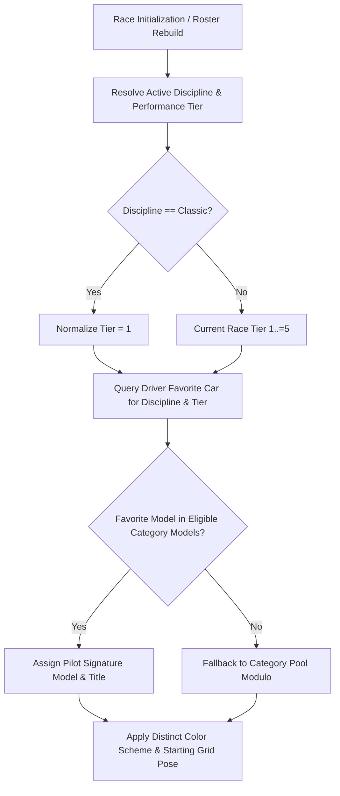

# Feature Spec 020: Per-Discipline and Per-Tier Driver Favorite Cars & 12-Pilot Rosters 🏎️🏆

A comprehensive architectural and gameplay specification establishing authentic signature vehicle mappings for every AI driver across motorsport disciplines and performance tiers in **TdRace**. Replaces legacy uniform spec grid assignments and round-robin modulo vehicle allocation with driver-personality-driven vehicle selection. Furthermore, expands the active driver roster across all 6 motorsport disciplines to **12 unique pilots per discipline (72 drivers total)** without cross-module name collisions.

---

## 🎯 Objectives & Design Philosophy

1. **Character-Driven Vehicle Affinity**: Rather than forcing AI opponents into identical spec clones or naive index modulo round-robins, each driver character has signature favorite vehicles defined per motorsport discipline (GT, NASCAR, Rally, Kart, Extreme Off-Road, Classic) and performance tier (Tiers 1–5).
2. **Classic Module Tier 1 Normalization**: As the Classic module has no multi-tier career ladder, all vehicles in the Classic module are strictly designated as **Tier 1**. Any request for `"classic"` at any tier automatically normalizes to Tier 1.
3. **12 Pilots Per Discipline Standard**: Standardizes all 6 motorsport modules to maintain 12 uniquely styled, fully operationalized pilot personalities (`BotProfile` and `DriverStats`) with custom team liveries.
4. **Preserved Backwards Compatibility**: Retains `preferred_car: CarChoice` on `DriverCharacter` as a fallback archetype so legacy screens, tests, and non-authentic race sessions continue operating without regression.

---

## 🗺️ User Flow & Interface Design

When the player initiates a race, championship round, or custom race:
1. **Discipline & Tier Resolution**: The race session determines the active discipline (`"gt"`, `"nascar"`, `"rally"`, `"kart"`, `"extreme_offroad"`, or `"classic"`) and active tier ($1..=5$, clamped to 1 for `"classic"`).
2. **Signature Vehicle Assignment**:
   - For each opponent on the starting grid, the game queries `character.favorite_car_for_discipline_and_tier(discipline, tier)`.
   - If the pilot has an authentic favorite vehicle belonging to the active race category/tier pool, the pilot is assigned that exact model.
   - If unmapped or in an open multi-tier contest, it falls back gracefully to eligible category models.
3. **Visual & Identity Diversity**:
   - The starting grid presentation displays authentic vehicle model names (e.g. *"Ferrari 296 GT3"*, *"Porsche 911 GT3 R"*, *"Mercedes-AMG GT3 Evo"* rather than uniform spec names).
   - Livery color separation algorithms guarantee high-contrast distinction between all 12 competitors.



---

## 📋 Comprehensive 72-Pilot Registry (12 Per Discipline)

### 1. Core / Classic Roster (12 Pilots)
*Used for Classic Arcade mode, Hall of Fame benchmarks, and global fallback sampling.*

| ID | Name & Nickname | Signature Classic Car (T1) | GT T1–T5 Favorites |
| :--- | :--- | :--- | :--- |
| `silvia_tanaka` | **Silvia Tanaka** *"Apex Tanaka"* | `classic_gt` | `gt_porsche_718_gt4`, `gt_porsche_911_gt3r`, `gt_maserati_mc20_gt2`, `gt_porsche_911_gt1_98`, `gt_porsche_963` |
| `marco_rossi` | **Marco Rossi** *"Thunder Rossi"* | `classic_rally` | `gt_bmw_m4_gt4`, `gt_ferrari_296_gt3`, `gt_porsche_911_gt2_rs`, `gt_mercedes_clk_gtr`, `gt_ferrari_499p` |
| `kenji_sato` | **Kenji Sato** *"Drift King Kenji"* | `classic_gt` | `gt_toyota_supra_gt4`, `gt_amg_gt3_evo`, `gt_brabham_bt62_gt2`, `gt_nissan_r390_gt1`, `gt_toyota_gr010` |
| `elena_frost` | **Elena Frost** *"Viper Frost"* | `classic_gt` | `gt_aston_vantage_gt4`, `gt_audi_r8_gt3_evo2`, `gt_audi_r8_gt2`, `gt_mclaren_f1_gtr_lt`, `gt_porsche_963` |
| `jax_reed` | **Jax Reed** *"Oversteer Reed"* | `classic_offroad` | `gt_bmw_m4_gt4`, `gt_amg_gt3_evo`, `gt_porsche_911_gt2_rs`, `gt_porsche_911_gt1_98`, `gt_cadillac_v_series_r` |
| `leo_bianchi` | **Leo Bianchi** *"Pocket Rocket Leo"* | `classic_kart` | `gt_porsche_718_gt4`, `gt_ferrari_296_gt3`, `gt_maserati_mc20_gt2`, `gt_mclaren_f1_gtr_lt`, `gt_ferrari_499p` |
| `viktor_sterling` | **Viktor Sterling** *"The Wall Sterling"* | `classic_nascar` | `gt_aston_vantage_gt4`, `gt_audi_r8_gt3_evo2`, `gt_brabham_bt62_gt2`, `gt_mercedes_clk_gtr`, `gt_cadillac_v_series_r` |
| `maya_lin` | **Maya Lin** *"Phoenix Lin"* | `classic_gt` | `gt_toyota_supra_gt4`, `gt_porsche_911_gt3r`, `gt_porsche_911_gt2_rs`, `gt_nissan_r390_gt1`, `gt_toyota_gr010` |
| `damon_clark` | **Damon Clark** *"The Ghost"* | `classic_gt` | `gt_porsche_718_gt4`, `gt_amg_gt3_evo`, `gt_maserati_mc20_gt2`, `gt_mercedes_clk_gtr`, `gt_porsche_963` |
| `chloe_laurent` | **Chloe Laurent** *"The Dynamo"* | `classic_rally` | `gt_aston_vantage_gt4`, `gt_ferrari_296_gt3`, `gt_porsche_911_gt2_rs`, `gt_mclaren_f1_gtr_lt`, `gt_ferrari_499p` |
| `hiroshi_takahashi` | **Hiroshi Takahashi** *"Tarmac Samurai"* | `classic_gt` | `gt_toyota_supra_gt4`, `gt_audi_r8_gt3_evo2`, `gt_brabham_bt62_gt2`, `gt_nissan_r390_gt1`, `gt_toyota_gr010` |
| `zane_holland` | **Zane Holland** *"Thunderbolt"* | `classic_offroad` | `gt_bmw_m4_gt4`, `gt_porsche_911_gt3r`, `gt_audi_r8_gt2`, `gt_porsche_911_gt1_98`, `gt_cadillac_v_series_r` |

---

### 2. GT World Challenge Roster (12 Pilots)

| ID | Name & Nickname | T1 (GT4) | T2 (GT3) | T3 (GT2) | T4 (GT1) | T5 (Hypercar) |
| :--- | :--- | :--- | :--- | :--- | :--- | :--- |
| `max_hunter` | **Max Hunter** *"The Dominator"* | `gt_porsche_718_gt4` | `gt_porsche_911_gt3r` | `gt_porsche_911_gt2_rs` | `gt_porsche_911_gt1_98` | `gt_porsche_963` |
| `charles_laurent` | **Charles Laurent** *"The Qualifying King"* | `gt_aston_vantage_gt4` | `gt_ferrari_296_gt3` | `gt_maserati_mc20_gt2` | `gt_mclaren_f1_gtr_lt` | `gt_ferrari_499p` |
| `lewis_vance` | **Lewis Vance** *"The Master"* | `gt_bmw_m4_gt4` | `gt_amg_gt3_evo` | `gt_brabham_bt62_gt2` | `gt_mercedes_clk_gtr` | `gt_cadillac_v_series_r` |
| `fernando_toro` | **Fernando Toro** *"El Matador"* | `gt_toyota_supra_gt4` | `gt_audi_r8_gt3_evo2` | `gt_audi_r8_gt2` | `gt_nissan_r390_gt1` | `gt_toyota_gr010` |
| `george_speed` | **George Speed** *"The Silver Bullet"* | `gt_bmw_m4_gt4` | `gt_amg_gt3_evo` | `gt_brabham_bt62_gt2` | `gt_mercedes_clk_gtr` | `gt_porsche_963` |
| `lando_vance` | **Lando Vance** *"Papaya Prodigy"* | `gt_porsche_718_gt4` | `gt_ferrari_296_gt3` | `gt_maserati_mc20_gt2` | `gt_mclaren_f1_gtr_lt` | `gt_ferrari_499p` |
| `oscar_rocket` | **Oscar Rocket** *"Melbourne Missile"* | `gt_toyota_supra_gt4` | `gt_porsche_911_gt3r` | `gt_audi_r8_gt2` | `gt_porsche_911_gt1_98` | `gt_toyota_gr010` |
| `carlos_sainzfield` | **Carlos Sainzfield** *"Smooth Operator"* | `gt_aston_vantage_gt4` | `gt_ferrari_296_gt3` | `gt_maserati_mc20_gt2` | `gt_mclaren_f1_gtr_lt` | `gt_ferrari_499p` |
| `pierre_gaslyfield` | **Pierre Gaslyfield** *"The Underdog"* | `gt_porsche_718_gt4` | `gt_audi_r8_gt3_evo2` | `gt_audi_r8_gt2` | `gt_nissan_r390_gt1` | `gt_cadillac_v_series_r` |
| `esteban_connor` | **Esteban Connor** *"The Sentinel"* | `gt_bmw_m4_gt4` | `gt_amg_gt3_evo` | `gt_porsche_911_gt2_rs` | `gt_mercedes_clk_gtr` | `gt_porsche_963` |
| `alexander_albonfield` | **Alexander Albonfield** *"Apex Hunter"* | `gt_toyota_supra_gt4` | `gt_porsche_911_gt3r` | `gt_brabham_bt62_gt2` | `gt_porsche_911_gt1_98` | `gt_toyota_gr010` |
| `nico_hulkenstorm` | **Nico Hulkenstorm** *"The Hulk"* | `gt_aston_vantage_gt4` | `gt_audi_r8_gt3_evo2` | `gt_porsche_911_gt2_rs` | `gt_mercedes_clk_gtr` | `gt_cadillac_v_series_r` |

---

### 3. NASCAR Cup Series Roster (12 Pilots)

| ID | Name & Nickname | T1 (Street Stock) | T2 (Late Model) | T3 (ARCA) | T4 (Trucks) | T5 (Trans-Am TA1) |
| :--- | :--- | :--- | :--- | :--- | :--- | :--- |
| `dale_vance` | **Dale 'The Intimidator' Vance** | `nascar_monte_carlo_ss` | `nascar_super_late_model` | `nascar_arca_chevy_ss` | `nascar_silverado_truck` | `nascar_challenger_ta1` |
| `chase_gordon` | **Chase 'Rainbow' Gordon** | `nascar_monte_carlo_ss` | `nascar_super_late_model` | `nascar_arca_chevy_ss` | `nascar_silverado_truck` | `nascar_corvette_ta1` |
| `richard_pettyfield` | **Richard 'The King' Pettyfield** | `nascar_dodge_dart_street_stock` | `nascar_late_model_stock_car` | `nascar_toyota_camry_arca` | `nascar_tundra_truck` | `nascar_challenger_ta1` |
| `rowdy_busch` | **Rowdy 'Wild Thing' Busch** | `nascar_mustang_street_stock` | `nascar_mustang_super_late_model` | `nascar_toyota_camry_arca` | `nascar_tundra_truck` | `nascar_mustang_ta1` |
| `jimmie_johnson` | **Jimmie 'Seven-Time' Johnson** | `nascar_monte_carlo_ss` | `nascar_super_late_model` | `nascar_arca_chevy_ss` | `nascar_silverado_truck` | `nascar_corvette_ta1` |
| `tony_stewart` | **Tony 'Smoke' Stewart** | `nascar_dodge_dart_street_stock` | `nascar_late_model_stock_car` | `nascar_ford_fusion_arca` | `nascar_f150_truck` | `nascar_challenger_ta1` |
| `bobby_allison` | **Bobby 'Alabama' Allison** | `nascar_monte_carlo_ss` | `nascar_late_model_stock_car` | `nascar_ford_fusion_arca` | `nascar_f150_truck` | `nascar_mustang_ta1` |
| `bubba_wallace` | **Bubba 'The Rocket' Wallace** | `nascar_toyota_camry_arca` | `nascar_super_late_model` | `nascar_toyota_camry_arca` | `nascar_tundra_truck` | `nascar_mustang_ta1` |
| `joey_logano` | **Joey 'Sliced Bread' Logano** | `nascar_mustang_street_stock` | `nascar_mustang_super_late_model` | `nascar_ford_fusion_arca` | `nascar_f150_truck` | `nascar_mustang_ta1` |
| `bill_elliott` | **Bill 'Awesome Bill' Elliott** | `nascar_mustang_street_stock` | `nascar_mustang_super_late_model` | `nascar_ford_fusion_arca` | `nascar_f150_truck` | `nascar_corvette_ta1` |
| `cale_yarborough` | **Cale 'The Iron Man' Yarborough** | `nascar_dodge_dart_street_stock` | `nascar_late_model_stock_car` | `nascar_arca_chevy_ss` | `nascar_silverado_truck` | `nascar_challenger_ta1` |
| `rusty_wallace` | **Rusty 'Thunder' Wallace** | `nascar_dodge_dart_street_stock` | `nascar_super_late_model` | `nascar_ford_fusion_arca` | `nascar_f150_truck` | `nascar_mustang_ta1` |

---

### 4. Rallycross & All-Terrain Roster (12 Pilots)

| ID | Name & Nickname | T1 (Junior RX) | T2 (WRC Supercars) | T3 (Group B) | T4 (Raid T1+) | T5 (Stadium Super Trucks) |
| :--- | :--- | :--- | :--- | :--- | :--- | :--- |
| `johan_vance` | **Johan Vance** *"Ice Master"* | `rally_polo_rx` | `rally_polo_rx` | `rally_audi_sport_quattro_s1` | `rally_audi_rs_q_etron` | `rally_sst_super_truck` |
| `mattias_storm` | **Mattias Storm** *"Stormy"* | `rally_audi_s1_rx` | `rally_audi_s1_rx` | `rally_audi_sport_quattro_s1` | `rally_audi_rs_q_etron` | `rally_sst_robby_gordon` |
| `timmy_hansenfield` | **Timmy Hansenfield** *"Apex Predator"* | `rally_peugeot_208_rally4` | `rally_peugeot_208_rally4` | `rally_peugeot_205_t16` | `rally_toyota_hilux_t1_plus` | `rally_sst_traxxas_edition` |
| `kevin_hansenfield` | **Kevin Hansenfield** *"Young Gun"* | `rally_peugeot_208_rally4` | `rally_hyundai_i20_rx` | `rally_peugeot_205_t16` | `rally_toyota_hilux_t1_plus` | `rally_sst_traxxas_edition` |
| `niclas_gron` | **Niclas Gron** *"Flying Finn"* | `rally_hyundai_i20_rx` | `rally_hyundai_i20_rx` | `rally_lancia_delta_s4` | `rally_prodrive_hunter_t1` | `rally_sst_super_truck` |
| `anton_mark` | **Anton Mark** *"The Hammer"* | `rally_clio_rally4` | `rally_polo_rx` | `rally_audi_sport_quattro_s1` | `rally_audi_rs_q_etron` | `rally_sst_robby_gordon` |
| `timo_scheider` | **Timo Scheider** *"The Veteran"* | `rally_fiesta_rally4` | `rally_audi_s1_rx` | `rally_lancia_delta_s4` | `rally_prodrive_hunter_t1` | `rally_sst_super_truck` |
| `sebastien_loebfield` | **Sebastien Loebfield** *"The Maestro"* | `rally_peugeot_208_rally4` | `rally_hyundai_i20_rx` | `rally_peugeot_205_t16` | `rally_prodrive_hunter_t1` | `rally_sst_traxxas_edition` |
| `petter_solbergfield` | **Petter Solbergfield** *"Hollywood"* | `rally_fiesta_rally4` | `rally_polo_rx` | `rally_audi_sport_quattro_s1` | `rally_toyota_hilux_t1_plus` | `rally_sst_robby_gordon` |
| `ken_blaster` | **Ken Blaster** *"Gymkhana King"* | `rally_fiesta_rally4` | `rally_fiesta_rally4` | `rally_lancia_delta_s4` | `rally_audi_rs_q_etron` | `rally_sst_super_truck` |
| `andreas_bakkerud` | **Andreas Bakkerud** *"Baby Blue"* | `rally_clio_rally4` | `rally_audi_s1_rx` | `rally_lancia_delta_s4` | `rally_toyota_hilux_t1_plus` | `rally_sst_traxxas_edition` |
| `reinis_nitissfield` | **Reinis Nitissfield** *"Baltic Bullet"* | `rally_clio_rally4` | `rally_hyundai_i20_rx` | `rally_peugeot_205_t16` | `rally_prodrive_hunter_t1` | `rally_sst_robby_gordon` |

---

### 5. Karting World Cup Roster (12 Pilots)

| ID | Name & Nickname | T1 (Cadet 60cc) | T2 (Senior 100cc) | T3 (Shifter 125cc) | T4 (Mowers) | T5 (Superkart 250cc) |
| :--- | :--- | :--- | :--- | :--- | :--- | :--- |
| `marco_armani` | **Marco Armani** *"Apex Predator"* | `kart_tony_kart_neos` | `kart_tony_kart_racer_ok` | `kart_tony_kart_racer_kz` | `kart_honda_mean_mower` | `kart_anderson_cs250` |
| `lucas_vance` | **Lucas Vance** *"The Professor"* | `kart_crg_hero_60` | `kart_crg_kt2_ok` | `kart_crg_road_rebel_kz` | `kart_john_deere_racing_mower` | `kart_ms_superkart_250` |
| `alex_rossi` | **Alex Rossi** *"Rocket Rossi"* | `kart_birel_c28` | `kart_birel_ry30_ok` | `kart_birel_art_kz2` | `kart_viking_t6_tractor` | `kart_viper_250_twin` |
| `sofia_lind` | **Sofia Lind** *"The Metronome"* | `kart_tony_kart_neos` | `kart_tony_kart_racer_ok` | `kart_tony_kart_racer_kz` | `kart_honda_mean_mower` | `kart_anderson_cs250` |
| `finn_korhonen` | **Finn Korhonen** *"Flying Finn"* | `kart_crg_hero_60` | `kart_crg_kt2_ok` | `kart_crg_road_rebel_kz` | `kart_john_deere_racing_mower` | `kart_ms_superkart_250` |
| `leo_dupont` | **Leo Dupont** *"Le Chasseur"* | `kart_birel_c28` | `kart_birel_ry30_ok` | `kart_birel_art_kz2` | `kart_viking_t6_tractor` | `kart_viper_250_twin` |
| `mateo_silva` | **Mateo Silva** *"El Pistolero"* | `kart_tony_kart_neos` | `kart_crg_kt2_ok` | `kart_tony_kart_racer_kz` | `kart_honda_mean_mower` | `kart_anderson_cs250` |
| `dante_moretti` | **Dante Moretti** *"Il Prodigio"* | `kart_birel_c28` | `kart_tony_kart_racer_ok` | `kart_birel_art_kz2` | `kart_viking_t6_tractor` | `kart_viper_250_twin` |
| `marta_santos` | **Marta Santos** *"Valkyrie"* | `kart_crg_hero_60` | `kart_birel_ry30_ok` | `kart_crg_road_rebel_kz` | `kart_john_deere_racing_mower` | `kart_ms_superkart_250` |
| `kenzo_yamamoto` | **Kenzo Yamamoto** *"Tarmac Whisperer"* | `kart_tony_kart_neos` | `kart_tony_kart_racer_ok` | `kart_tony_kart_racer_kz` | `kart_honda_mean_mower` | `kart_anderson_cs250` |
| `liam_callaghan` | **Liam Callaghan** *"The Shamrock"* | `kart_birel_c28` | `kart_crg_kt2_ok` | `kart_birel_art_kz2` | `kart_viking_t6_tractor` | `kart_viper_250_twin` |
| `charlie_webb` | **Charlie Webb** *"Pocket Rocket"* | `kart_crg_hero_60` | `kart_birel_ry30_ok` | `kart_crg_road_rebel_kz` | `kart_john_deere_racing_mower` | `kart_ms_superkart_250` |

---

### 6. Extreme Off-Road Roster (12 Pilots)

| ID | Name & Nickname | T1 (Sand Rails) | T2 (Trophy Trucks) | T3 (Ice Racers) | T4 (Mud Boggers) | T5 (Monster Trucks) |
| :--- | :--- | :--- | :--- | :--- | :--- | :--- |
| `wyatt_cole` | **Wyatt Cole** *"Dust Devil"* | `offroad_sand_rail_buggy` | `offroad_baja_trophy_truck` | `offroad_subaru_ice_racer` | `offroad_mega_mud_truck` | `offroad_grave_crusher` |
| `jaxson_rivera` | **Jaxson Rivera** *"Baja King"* | `offroad_polaris_rzr_pro_r` | `offroad_bettantown_trophy_truck` | `offroad_lancer_evo_ice` | `offroad_chevy_k30_mud_bogger` | `offroad_max_d_monster` |
| `astrid_lindholm` | **Astrid Lindholm** *"Ice Queen"* | `offroad_vw_sand_rail` | `offroad_mason_awd_truck` | `offroad_audi_quattro_ice` | `offroad_ford_f250_high_riser` | `offroad_bigfoot_crusher` |
| `bubba_beauregard` | **Bubba Beauregard** *"Mud Slinger"* | `offroad_sand_rail_buggy` | `offroad_baja_trophy_truck` | `offroad_subaru_ice_racer` | `offroad_mega_mud_truck` | `offroad_grave_crusher` |
| `travis_mcgrath` | **Travis McGrath** *"Nitro"* | `offroad_polaris_rzr_pro_r` | `offroad_bettantown_trophy_truck` | `offroad_lancer_evo_ice` | `offroad_chevy_k30_mud_bogger` | `offroad_max_d_monster` |
| `roxie_vance` | **Roxie Vance** *"Rock Hound"* | `offroad_vw_sand_rail` | `offroad_mason_awd_truck` | `offroad_audi_quattro_ice` | `offroad_ford_f250_high_riser` | `offroad_bigfoot_crusher` |
| `sven_lindqvist` | **Sven Lindqvist** *"Blizzard"* | `offroad_sand_rail_buggy` | `offroad_baja_trophy_truck` | `offroad_audi_quattro_ice` | `offroad_mega_mud_truck` | `offroad_grave_crusher` |
| `cruz_morales` | **Cruz Morales** *"Chasm Jumper"* | `offroad_polaris_rzr_pro_r` | `offroad_bettantown_trophy_truck` | `offroad_lancer_evo_ice` | `offroad_chevy_k30_mud_bogger` | `offroad_max_d_monster` |
| `dakota_black` | **Dakota Black** *"Canyon Hawg"* | `offroad_vw_sand_rail` | `offroad_mason_awd_truck` | `offroad_subaru_ice_racer` | `offroad_mega_mud_truck` | `offroad_bigfoot_crusher` |
| `colton_haze` | **Colton Haze** *"Sandstorm"* | `offroad_sand_rail_buggy` | `offroad_baja_trophy_truck` | `offroad_lancer_evo_ice` | `offroad_chevy_k30_mud_bogger` | `offroad_grave_crusher` |
| `elise_roux` | **Elise Roux** *"Alpine Lynx"* | `offroad_polaris_rzr_pro_r` | `offroad_mason_awd_truck` | `offroad_audi_quattro_ice` | `offroad_ford_f250_high_riser` | `offroad_max_d_monster` |
| `diego_valdez` | **Diego Valdez** *"Trophy King"* | `offroad_vw_sand_rail` | `offroad_bettantown_trophy_truck` | `offroad_subaru_ice_racer` | `offroad_mega_mud_truck` | `offroad_bigfoot_crusher` |

---

## ⚙️ Backend Models & API Endpoints

### 1. `DriverFavoriteCar` Definition (`crates/tdrace-app/src/ai/driver.rs`)

```rust
/// Association between a motorsport discipline, performance tier (1..=5), and authentic car model ID.
#[derive(Debug, Clone, Copy, PartialEq, Eq)]
pub struct DriverFavoriteCar {
    pub discipline: &'static str,
    pub tier: u8,
    pub model_id: &'static str,
}
```

### 2. `DriverCharacter` Extensions

```rust
pub struct DriverCharacter {
    pub id: &'static str,
    pub name: &'static str,
    pub alias: &'static str,
    pub bio: &'static str,
    pub preferred_car: CarChoice,
    pub color_scheme: CarColorScheme,
    pub profile: BotProfile,
    pub stats: DriverStats,
    pub favorite_cars: &'static [DriverFavoriteCar],
}

impl DriverCharacter {
    /// Returns the signature vehicle model ID for a specific discipline and tier.
    /// If discipline is "classic", tier is strictly normalized to Tier 1.
    pub fn favorite_car_for_discipline_and_tier(&self, discipline: &str, tier: u8) -> Option<&'static str>;

    /// Resolves the full RealCarModel definition from the authentic vehicle catalog.
    pub fn favorite_model_for_discipline_and_tier(&self, discipline: &str, tier: u8) -> Option<&'static RealCarModel>;

    /// Returns the appropriate CarChoice archetype enum matching the favorite vehicle.
    pub fn effective_car_choice_for_discipline_and_tier(&self, discipline: &str, tier: u8) -> CarChoice;
}
```

---

## 🛡️ Security & Role-Based Access Controls (RBAC)

### 1. Static Catalog Immutability & Memory Safety
- All driver definitions, bot profiles, and vehicle rosters are compiled as immutable `&'static` constants in the Rust binary and WASM bundle.
- No runtime heap mutations or dynamically injected script strings are evaluated during driver selection or roster assembly.

### 2. Deterministic Input Clamping & Out-of-Bounds Guards
- Queries for discipline and performance tier are sanitized and normalized (`normalize_discipline`).
- For `"classic"`, any tier parameter is clamped strictly to `1`, preventing out-of-bounds array lookups or invalid career state transitions.
- Unmatched driver lookups or unrecognized disciplines fall back safely to category vehicle pools via deterministic modulo selection without panicking.

---

## 🧪 Verification & Acceptance Criteria

### Manual Acceptance Criteria (Pseudo-Gherkin)

### Scenario: Classic module normalizes all tier requests to Tier 1
- **Given** any driver character with a classic favorite car
- **When** querying `favorite_car_for_discipline_and_tier("classic", tier)` for any tier (1, 2, or 5)
- **Then** the resolved car is always the pilot's Tier 1 classic vehicle
- **And** all classic vehicle models have `tier == 1`

### Scenario: Roster scale and naming integrity across all disciplines
- **Given** the 6 motorsport game modules
- **When** querying `drivers()` on each module and `DriverCharacter::all()`
- **Then** each discipline roster contains exactly 12 drivers
- **And** all 72 driver IDs are unique without cross-module duplication
- **And** every driver within a module possesses a distinct color scheme

### Scenario: Authentic starting grid vehicle assignment
- **Given** a race session in GT World Challenge at Tier 1 (GT4 Clubsport)
- **When** the starting grid participants are built via `rebuild_roster_participants()`
- **Then** each bot participant is assigned their signature favorite GT4 vehicle
- **And** the starting grid contains diverse vehicles rather than a single uniform spec car
- **And** all vehicles on the grid belong to the GT4 performance tier

### Scenario: Multi-tier career progression car switching
- **Given** an AI opponent competing across multiple tiers of the same discipline
- **When** the race switches from Tier 1 to Tier 2 (e.g. GT4 to GT3)
- **Then** the driver participant dynamically switches to their signature vehicle for Tier 2

---

## 🔗 Traceability & Codebase Mapping

### Modified Files
- `[ ]` `crates/tdrace-app/src/ai/driver.rs` -> Added `DriverFavoriteCar`, lookup methods, and 12-pilot core roster.
- `[ ]` `crates/tdrace-app/src/module/classic.rs` -> Updated classic module to use 12-pilot roster.
- `[ ]` `crates/tdrace-app/src/module/gt.rs` -> Expanded GT roster to 12 pilots and mapped favorite cars T1–T5.
- `[ ]` `crates/tdrace-app/src/module/nascar.rs` -> Mapped favorite cars T1–T5 across all 12 NASCAR drivers.
- `[ ]` `crates/tdrace-app/src/module/rally.rs` -> Expanded Rally roster to 12 pilots and mapped favorite cars T1–T5.
- `[ ]` `crates/tdrace-app/src/module/kart.rs` -> Expanded Kart roster to 12 pilots and mapped favorite cars T1–T5.
- `[ ]` `crates/tdrace-app/src/module/extreme_offroad.rs` -> Expanded Off-Road roster to 12 pilots and mapped favorite cars T1–T5.
- `[ ]` `crates/tdrace-app/src/game/mod.rs` -> Integrated signature car resolution into `rebuild_roster_participants`.
- `[ ]` `crates/tdrace-app/src/ui/driver_card.rs` -> Displayed signature favorite car on driver dossier cards.
- `[ ]` `specs/index.md` -> Registered Spec 020 in index table.
- `[ ]` `specs/constitution/ROADMAP.md` -> Linked Spec 020 in Phase 2 roadmap.
- `[ ]` `crates/tdrace-app/tests/driver_favorite_cars_tests.rs` -> Dedicated test suite validating 72 pilots and tier mappings.
