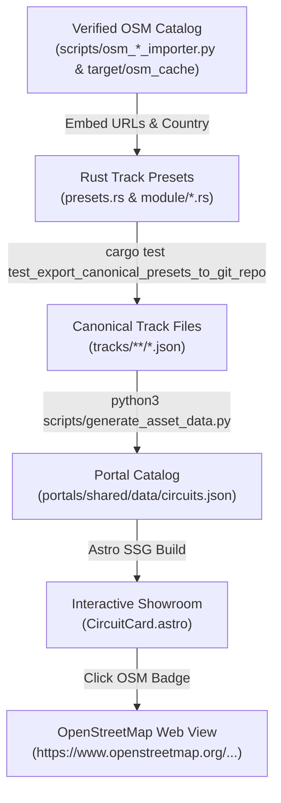

# Feature Spec 021: Authentic OpenStreetMap References and Circuit Provenance 🗺️🏁

A comprehensive architectural and data specification establishing authentic **OpenStreetMap (OSM)** and **Wikipedia** provenance across all real-world motorsport circuits in **TdRace**. Fixes erroneous references currently displayed in the Showroom (e.g. Bahrain pointing to a basilica in Brazil, COTA yielding 404, and Montreal pointing to an industrial parcel), resolves missing URLs across 68 real-world venues, and builds an end-to-end pipeline ensuring metadata persists through Rust presets, canonical JSON track exports, and web catalog portals.

---

## 🎯 Objectives & Design Philosophy

1. **Fix Inaccurate Showroom References**:
   - Correct Bahrain International Circuit: Replace Brazilian cathedral (`relation/3089108`) with authentic Bahrain Grand Prix Circuit (`relation/284538`).
   - Correct Circuit of the Americas (COTA): Replace broken 404 link (`relation/2387140`) with authentic COTA relation (`relation/6537729`).
   - Correct Circuit Gilles Villeneuve (Montreal): Replace generic industrial landuse (`relation/1126305`) with authentic Circuit Gilles Villeneuve relation (`relation/284595`).
2. **Comprehensive 100% Real-World Coverage**:
   - Supply authentic, verified OSM relation/way URLs for all **71 real-world motorsport circuits** across 5 modules:
     - **GT World Challenge & Endurance**: 18 circuits.
     - **Karting World Cup**: 17 circuits.
     - **Rallycross & All-Terrain**: 17 circuits.
     - **NASCAR Cup Series & Trans-Am**: 17 circuits.
     - **Extreme Off-Road**: 2 real-world circuits (Crandon International Off-Road and Glamis Imperial Sand Dunes).
3. **Fictional / Inspired Distinction**:
   - Classic fantasy tracks (e.g., `classic_grand_prix`, `drift_park`, `figure_eight`) and inspired off-road tracks (e.g., `alpine_snow_ridge`, `arctic_frozen_lake`) intentionally retain `osm_url: None` and `wikipedia_url: None` with `is_inspired: true` where applicable.
4. **Resilient Pipeline Persistence**:
   - Store `osm_url`, `wikipedia_url`, `country_code`, and `country_name` directly within the Rust preset definitions in `crates/arcade-race-core/src/track/presets.rs` and `crates/tdrace-app/src/module/*.rs`.
   - Ensure the canonical track export tool (`test_export_canonical_presets_to_git_repo`) serializes these fields to `tracks/**/*.json`.
   - Update `scripts/generate_asset_data.py` to ingest the verified references and write clean records into `portals/shared/data/circuits.json`.
   - Ensure `portals/option-b-showroom` reliably renders clickable `OSM ↗` and `Wikipedia ↗` badges on every real-world track card.

---

## 🗺️ User Flow & Interface Design

When a player or developer navigates the showroom web catalog (`portals/option-b-showroom`):
1. **Catalog Exploration**: The user views the circuit grid filtered by motorsport category (All, GT, NASCAR, Rallycross, Karting, Off-Road, Classic).
2. **Provenance Badges**: For real-world circuits, the card renders provenance metadata including a country flag code, an authentic `OSM ↗` button, and an optional `Wiki ↗` link.
3. **Interactive OSM Inspection**: Clicking `OSM ↗` opens OpenStreetMap centered on the exact raceway relation or way in an external tab, confirming geometry fidelity.
4. **Fictional & Classic Fallback**: For fantasy tracks (`classic_*`) and inspired off-road stunt arenas, the card displays `Inspired` or `Classic` badges and cleanly suppresses OSM buttons without rendering broken or null links.



---

## 📋 Comprehensive 71 Real-World Circuit Provenance Registry

### 1. GT World Challenge & Endurance (18 Circuits)
All 18 circuits surveyed from OpenStreetMap via `scripts/osm_f1_importer.py`:

| ID | Circuit Name | Country | Verified OSM URL | Verified Wikipedia URL |
| :--- | :--- | :---: | :--- | :--- |
| `monza` | Monza Autodromo Nazionale | IT | [`relation/284565`](https://www.openstreetmap.org/relation/284565) | [`Monza_Circuit`](https://en.wikipedia.org/wiki/Monza_Circuit) |
| `spa` | Circuit de Spa-Francorchamps | BE | [`relation/284560`](https://www.openstreetmap.org/relation/284560) | [`Circuit_de_Spa-Francorchamps`](https://en.wikipedia.org/wiki/Circuit_de_Spa-Francorchamps) |
| `silverstone` | Silverstone Grand Prix Circuit | GB | [`relation/51160`](https://www.openstreetmap.org/relation/51160) | [`Silverstone_Circuit`](https://en.wikipedia.org/wiki/Silverstone_Circuit) |
| `monaco` | Circuit de Monaco | MC | [`relation/148194`](https://www.openstreetmap.org/relation/148194) | [`Circuit_de_Monaco`](https://en.wikipedia.org/wiki/Circuit_de_Monaco) |
| `suzuka` | Suzuka International Racing Course | JP | [`relation/284570`](https://www.openstreetmap.org/relation/284570) | [`Suzuka_International_Racing_Course`](https://en.wikipedia.org/wiki/Suzuka_International_Racing_Course) |
| `interlagos` | Autódromo José Carlos Pace | BR | [`relation/6781071`](https://www.openstreetmap.org/relation/6781071) | [`Interlagos_Circuit`](https://en.wikipedia.org/wiki/Interlagos_Circuit) |
| `montreal` | Circuit Gilles Villeneuve | CA | [`relation/284595`](https://www.openstreetmap.org/relation/284595) | [`Circuit_Gilles_Villeneuve`](https://en.wikipedia.org/wiki/Circuit_Gilles_Villeneuve) |
| `red_bull_ring` | Red Bull Ring (Spielberg) | AT | [`relation/5309181`](https://www.openstreetmap.org/relation/5309181) | [`Red_Bull_Ring`](https://en.wikipedia.org/wiki/Red_Bull_Ring) |
| `catalunya` | Circuit de Barcelona-Catalunya | ES | [`way/831804327`](https://www.openstreetmap.org/way/831804327) | [`Circuit_de_Barcelona-Catalunya`](https://en.wikipedia.org/wiki/Circuit_de_Barcelona-Catalunya) |
| `zandvoort` | Circuit Zandvoort | NL | [`relation/13545573`](https://www.openstreetmap.org/relation/13545573) | [`Circuit_Zandvoort`](https://en.wikipedia.org/wiki/Circuit_Zandvoort) |
| `bahrain` | Bahrain International Circuit | BH | [`relation/284538`](https://www.openstreetmap.org/relation/284538) | [`Bahrain_International_Circuit`](https://en.wikipedia.org/wiki/Bahrain_International_Circuit) |
| `marina_bay` | Marina Bay Street Circuit | SG | [`relation/421263`](https://www.openstreetmap.org/relation/421263) | [`Marina_Bay_Street_Circuit`](https://en.wikipedia.org/wiki/Marina_Bay_Street_Circuit) |
| `cota` | Circuit of the Americas (COTA) | US | [`relation/6537729`](https://www.openstreetmap.org/relation/6537729) | [`Circuit_of_the_Americas`](https://en.wikipedia.org/wiki/Circuit_of_the_Americas) |
| `madring` | MadRing Circuito de Madrid | ES | [`relation/18813472`](https://www.openstreetmap.org/relation/18813472) | [`Spanish_Grand_Prix`](https://en.wikipedia.org/wiki/Spanish_Grand_Prix) |
| `nurburgring_gp`| Nürburgring Grand Prix-Strecke | DE | [`relation/38567`](https://www.openstreetmap.org/relation/38567) | [`Nürburgring`](https://en.wikipedia.org/wiki/N%C3%BCrburgring) |
| `bathurst` | Mount Panorama (Bathurst) | AU | [`relation/6942508`](https://www.openstreetmap.org/relation/6942508) | [`Mount_Panorama_Circuit`](https://en.wikipedia.org/wiki/Mount_Panorama_Circuit) |
| `portimao_gp` | Autódromo Internacional do Algarve| PT | [`relation/7509968`](https://www.openstreetmap.org/relation/7509968) | [`Algarve_International_Circuit`](https://en.wikipedia.org/wiki/Algarve_International_Circuit) |
| `le_mans_sarthe`| Circuit de la Sarthe (Le Mans) | FR | [`relation/2126739`](https://www.openstreetmap.org/relation/2126739) | [`Circuit_de_la_Sarthe`](https://en.wikipedia.org/wiki/Circuit_de_la_Sarthe) |

### 2. Karting World Cup (17 Circuits)
Surveyed via `scripts/osm_kart_importer.py` and `target/osm_cache/`:

| ID | Circuit Name | Country | Verified OSM URL | Verified Wikipedia URL |
| :--- | :--- | :---: | :--- | :--- |
| `lonato` | South Garda Karting (Lonato) | IT | [`way/75490872`](https://www.openstreetmap.org/way/75490872) | [`Lonato_del_Garda`](https://en.wikipedia.org/wiki/Lonato_del_Garda) |
| `sarno` | Circuito Internazionale Napoli (Sarno)| IT | [`way/643206090`](https://www.openstreetmap.org/way/643206090) | [`Sarno`](https://en.wikipedia.org/wiki/Sarno) |
| `genk` | Karting Genk (Home of Champions) | BE | [`way/67660672`](https://www.openstreetmap.org/way/67660672) | [`Genk`](https://en.wikipedia.org/wiki/Genk) |
| `pfi` | PF International Kart Circuit (PFI) | GB | [`way/1208588289`](https://www.openstreetmap.org/way/1208588289) | [`PF_International`](https://en.wikipedia.org/wiki/PF_International) |
| `zuera` | Circuito Internacional de Zuera | ES | [`way/490212650`](https://www.openstreetmap.org/way/490212650) | [`Zuera`](https://en.wikipedia.org/wiki/Zuera) |
| `le_mans_kart` | Le Mans Karting International | FR | [`way/482284812`](https://www.openstreetmap.org/way/482284812) | [`Circuit_de_la_Sarthe`](https://en.wikipedia.org/wiki/Circuit_de_la_Sarthe) |
| `portimao_kart`| Kartódromo Internacional do Algarve | PT | [`way/363049742`](https://www.openstreetmap.org/way/363049742) | [`Algarve_International_Circuit`](https://en.wikipedia.org/wiki/Algarve_International_Circuit) |
| `franciacorta` | Franciacorta Karting Track | IT | [`way/1474753177`](https://www.openstreetmap.org/way/1474753177) | [`Castrezzato`](https://en.wikipedia.org/wiki/Castrezzato) |
| `wackersdorf` | Prokart Raceland Wackersdorf | DE | [`way/156019609`](https://www.openstreetmap.org/way/156019609) | [`Wackersdorf`](https://en.wikipedia.org/wiki/Wackersdorf) |
| `kristianstad` | Kristianstad Karting (Åsum Ring) | SE | [`way/87888593`](https://www.openstreetmap.org/way/87888593) | [`Kristianstad`](https://en.wikipedia.org/wiki/Kristianstad) |
| `seven_laghi` | Circuito 7 Laghi (Castelletto) | IT | [`way/80905675`](https://www.openstreetmap.org/way/80905675) | [`Castelletto_di_Branduzzo`](https://en.wikipedia.org/wiki/Castelletto_di_Branduzzo) |
| `ampfing` | Schweppermannring Ampfing | DE | [`way/110580562`](https://www.openstreetmap.org/way/110580562) | [`Ampfing`](https://en.wikipedia.org/wiki/Ampfing) |
| `silverstone_national_kart` | Silverstone National Kart Circuit | GB | [`way/1240237936`](https://www.openstreetmap.org/way/1240237936) | [`Silverstone_Circuit`](https://en.wikipedia.org/wiki/Silverstone_Circuit) |
| `laval_kart` | Circuit Beausoleil (Laval Kart) | FR | [`way/183330357`](https://www.openstreetmap.org/way/183330357) | [`Laval,_Mayenne`](https://en.wikipedia.org/wiki/Laval,_Mayenne) |
| `whilton_mill` | Whilton Mill Kart Circuit | GB | [`way/149913876`](https://www.openstreetmap.org/way/149913876) | [`Whilton`](https://en.wikipedia.org/wiki/Whilton) |
| `campillos` | Kartcenter Campillos | ES | [`way/420385347`](https://www.openstreetmap.org/way/420385347) | [`Campillos`](https://en.wikipedia.org/wiki/Campillos) |
| `valencia_kart`| Kartódromo Lucas Guerrero | ES | [`way/751513226`](https://www.openstreetmap.org/way/751513226) | [`Chiva,_Spain`](https://en.wikipedia.org/wiki/Chiva,_Spain) |

### 3. Rallycross & All-Terrain (17 Circuits)
Surveyed via `scripts/osm_track_importer.py` and `target/osm_cache/`:

| ID | Circuit Name | Country | Verified OSM URL | Verified Wikipedia URL |
| :--- | :--- | :---: | :--- | :--- |
| `holjes_rx` | Höljes Motorstadion (World RX Sweden) | SE | [`way/599300791`](https://www.openstreetmap.org/way/599300791) | [`Höljes_Motorstadion`](https://en.wikipedia.org/wiki/H%C3%B6ljes_Motorstadion) |
| `lydden_hill` | Lydden Hill Circuit (World RX Great Britain) | GB | [`way/234347787`](https://www.openstreetmap.org/way/234347787) | [`Lydden_Hill_Race_Circuit`](https://en.wikipedia.org/wiki/Lydden_Hill_Race_Circuit) |
| `hell_rx` | Lånkebanen (World RX Norway) | NO | [`way/1069390970`](https://www.openstreetmap.org/way/1069390970) | [`Lånkebanen`](https://en.wikipedia.org/wiki/L%C3%A5nkebanen) |
| `loheac_rx` | Circuit de Lohéac (World RX France) | FR | [`way/787615501`](https://www.openstreetmap.org/way/787615501) | [`Circuit_de_Lohéac`](https://fr.wikipedia.org/wiki/Circuit_de_Loh%C3%A9ac) |
| `estering_rx` | Estering Buxtehude (World RX Germany) | DE | [`way/24855696`](https://www.openstreetmap.org/way/24855696) | [`Estering`](https://en.wikipedia.org/wiki/Estering) |
| `montalegre_rx`| Pista de Montalegre (World RX Portugal) | PT | [`way/305257997`](https://www.openstreetmap.org/way/305257997) | [`Pista_Automóvel_de_Montalegre`](https://en.wikipedia.org/wiki/Pista_Autom%C3%B3vel_de_Montalegre) |
| `nyirad_rx` | Nyirád Racing Center (Euro RX Hungary) | HU | [`way/172413355`](https://www.openstreetmap.org/way/172413355) | [`Nyirád_Racing_Center`](https://en.wikipedia.org/wiki/Nyir%C3%A1d_Racing_Center) |
| `kouvola_rx` | Tykkimäen Moottorirata (World RX Finland) | FI | [`way/149713976`](https://www.openstreetmap.org/way/149713976) | [`Kouvola`](https://en.wikipedia.org/wiki/Kouvola) |
| `catalunya_rx` | Barcelona-Catalunya RX (World RX Spain) | ES | [`way/831804327`](https://www.openstreetmap.org/way/831804327) | [`Circuit_de_Barcelona-Catalunya`](https://en.wikipedia.org/wiki/Circuit_de_Barcelona-Catalunya) |
| `mettet_rx` | Circuit Jules Tacheny Mettet (World RX Belgium)| BE | [`way/178384323`](https://www.openstreetmap.org/way/178384323) | [`Circuit_Jules_Tacheny_Mettet`](https://en.wikipedia.org/wiki/Circuit_Jules_Tacheny_Mettet) |
| `silverstone_rx`| Silverstone RX Arena (World RX GB) | GB | [`way/169851260`](https://www.openstreetmap.org/way/169851260) | [`Silverstone_Circuit`](https://en.wikipedia.org/wiki/Silverstone_Circuit) |
| `riga_rx` | Biķernieku Trase (World RX Latvia) | LV | [`way/256784387`](https://www.openstreetmap.org/way/256784387) | [`Biķernieki_Complex_Sports_Base`](https://en.wikipedia.org/wiki/Bi%C4%B7ernieki_Complex_Sports_Base) |
| `killarney_rx` | Killarney International (World RX South Africa) | ZA | [`way/42125321`](https://www.openstreetmap.org/way/42125321) | [`Killarney_Motor_Racing_Complex`](https://en.wikipedia.org/wiki/Killarney_Motor_Racing_Complex) |
| `yas_marina_rx`| Yas Marina RX Arena (World RX Abu Dhabi)| AE | [`way/1083519983`](https://www.openstreetmap.org/way/1083519983) | [`Yas_Marina_Circuit`](https://en.wikipedia.org/wiki/Yas_Marina_Circuit) |
| `blyton_rx` | Blyton Park Driving Centre RX | GB | [`way/129241665`](https://www.openstreetmap.org/way/129241665) | [`Blyton_Park`](https://en.wikipedia.org/wiki/Blyton) |
| `dreux_rx` | Circuit Pro'Pulsion (Dreux RX France) | FR | [`way/297738878`](https://www.openstreetmap.org/way/297738878) | [`Dreux`](https://en.wikipedia.org/wiki/Dreux) |
| `essay_rx` | Circuit des Ducs (Essay RX France) | FR | [`way/788873788`](https://www.openstreetmap.org/way/788873788) | [`Essay,_Orne`](https://en.wikipedia.org/wiki/Essay,_Orne) |

### 4. NASCAR Cup Series & Trans-Am (17 Circuits)
Surveyed via `scripts/osm_nascar_importer.py` and `target/osm_cache/`:

| ID | Circuit Name | Country | Verified OSM URL | Verified Wikipedia URL |
| :--- | :--- | :---: | :--- | :--- |
| `bowman_gray` | Bowman Gray Stadium (The Madhouse) | US | [`way/914237156`](https://www.openstreetmap.org/way/914237156) | [`Bowman_Gray_Stadium`](https://en.wikipedia.org/wiki/Bowman_Gray_Stadium) |
| `bristol` | Bristol Motor Speedway | US | [`way/116589129`](https://www.openstreetmap.org/way/116589129) | [`Bristol_Motor_Speedway`](https://en.wikipedia.org/wiki/Bristol_Motor_Speedway) |
| `charlotte` | Charlotte Motor Speedway | US | [`relation/21242750`](https://www.openstreetmap.org/relation/21242750) | [`Charlotte_Motor_Speedway`](https://en.wikipedia.org/wiki/Charlotte_Motor_Speedway) |
| `chicago` | Chicago Street Course | US | [`relation/16546690`](https://www.openstreetmap.org/relation/16546690) | [`Chicago_Street_Course`](https://en.wikipedia.org/wiki/Chicago_Street_Course) |
| `darlington` | Darlington Raceway | US | [`way/104277971`](https://www.openstreetmap.org/way/104277971) | [`Darlington_Raceway`](https://en.wikipedia.org/wiki/Darlington_Raceway) |
| `daytona` | Daytona International Speedway | US | [`way/352074880`](https://www.openstreetmap.org/way/352074880) | [`Daytona_International_Speedway`](https://en.wikipedia.org/wiki/Daytona_International_Speedway) |
| `eldora` | Eldora Speedway | US | [`way/608397609`](https://www.openstreetmap.org/way/608397609) | [`Eldora_Speedway`](https://en.wikipedia.org/wiki/Eldora_Speedway) |
| `indianapolis` | Indianapolis Motor Speedway | US | [`way/589668075`](https://www.openstreetmap.org/way/589668075) | [`Indianapolis_Motor_Speedway`](https://en.wikipedia.org/wiki/Indianapolis_Motor_Speedway) |
| `iowa` | Iowa Speedway | US | [`way/119238784`](https://www.openstreetmap.org/way/119238784) | [`Iowa_Speedway`](https://en.wikipedia.org/wiki/Iowa_Speedway) |
| `irp_oval` | Lucas Oil Indianapolis Raceway Park | US | [`way/123830268`](https://www.openstreetmap.org/way/123830268) | [`Lucas_Oil_Indianapolis_Raceway_Park`](https://en.wikipedia.org/wiki/Lucas_Oil_Indianapolis_Raceway_Park) |
| `martinsville` | Martinsville Speedway | US | [`relation/6497929`](https://www.openstreetmap.org/relation/6497929) | [`Martinsville_Speedway`](https://en.wikipedia.org/wiki/Martinsville_Speedway) |
| `north_wilkesboro`| North Wilkesboro Speedway | US | [`way/18928710`](https://www.openstreetmap.org/way/18928710) | [`North_Wilkesboro_Speedway`](https://en.wikipedia.org/wiki/North_Wilkesboro_Speedway) |
| `phoenix` | Phoenix Raceway | US | [`way/29333335`](https://www.openstreetmap.org/way/29333335) | [`Phoenix_Raceway`](https://en.wikipedia.org/wiki/Phoenix_Raceway) |
| `pocono` | Pocono Raceway | US | [`way/109767460`](https://www.openstreetmap.org/way/109767460) | [`Pocono_Raceway`](https://en.wikipedia.org/wiki/Pocono_Raceway) |
| `road_america` | Road America | US | [`relation/6432758`](https://www.openstreetmap.org/relation/6432758) | [`Road_America`](https://en.wikipedia.org/wiki/Road_America) |
| `talladega` | Talladega Superspeedway | US | [`way/405961241`](https://www.openstreetmap.org/way/405961241) | [`Talladega_Superspeedway`](https://en.wikipedia.org/wiki/Talladega_Superspeedway) |
| `watkins_glen` | Watkins Glen International | US | [`way/702671615`](https://www.openstreetmap.org/way/702671615) | [`Watkins_Glen_International`](https://en.wikipedia.org/wiki/Watkins_Glen_International) |

### 5. Real-World Extreme Off-Road (2 Circuits)
Surveyed via `target/osm_cache/`:

| ID | Circuit Name | Country | Verified OSM URL | Verified Wikipedia URL |
| :--- | :--- | :---: | :--- | :--- |
| `crandon_short_course` | Crandon International Off-Road | US | [`way/291856211`](https://www.openstreetmap.org/way/291856211) | [`Crandon_International_Off-Road_Raceway`](https://en.wikipedia.org/wiki/Crandon_International_Off-Road_Raceway) |
| `glamis_dunes` | Glamis Imperial Sand Dunes | US | [`relation/6152825`](https://www.openstreetmap.org/relation/6152825) | [`Algodones_Dunes`](https://en.wikipedia.org/wiki/Algodones_Dunes) |

## ⚙️ Backend Models & API Endpoints

### 1. Rust Track Preset Data Structures
In `crates/arcade-race-core/src/track/mod.rs` and `presets.rs`:
```rust
#[derive(Clone, Debug, Serialize, Deserialize)]
pub struct Track {
    pub name: String,
    pub description: String,
    pub country_code: Option<String>,
    pub country_name: Option<String>,
    pub osm_url: Option<String>,
    pub wikipedia_url: Option<String>,
    // geometry, segments, obstacles...
}

impl Track {
    pub fn with_provenance(
        mut self,
        country_code: &str,
        country_name: &str,
        osm_url: Option<&str>,
        wikipedia_url: Option<&str>,
    ) -> Self {
        self.country_code = Some(country_code.to_string());
        self.country_name = Some(country_name.to_string());
        self.osm_url = osm_url.map(|s| s.to_string());
        self.wikipedia_url = wikipedia_url.map(|s| s.to_string());
        self
    }
}
```

### 2. Canonical Track JSON Schema
Exported by `crates/tdrace-app/tests/track_manager_tests.rs` into `tracks/{module}/{id}.json`:
```json
{
  "name": "Bahrain International Circuit",
  "country_code": "BH",
  "country_name": "Bahrain",
  "osm_url": "https://www.openstreetmap.org/relation/284538",
  "wikipedia_url": "https://en.wikipedia.org/wiki/Bahrain_International_Circuit"
}
```

### 3. Portal Asset Data Model
In `portals/shared/data/circuits.json` consumed by Astro showroom:
```typescript
export interface CircuitMetadata {
  id: string;
  name: string;
  category: string;
  country_code: string | null;
  country_name: string | null;
  osm_url: string | null;
  wikipedia_url: string | null;
  is_inspired: boolean;
  length_m: number;
}
```

---

## 🛡️ Security & Role-Based Access Controls (RBAC)

### 1. Static Provenance Immutability & Memory Safety
- All provenance URLs (`osm_url`, `wikipedia_url`) are defined at build time as static, trusted strings within Rust presets or canonical track JSON files.
- No user-supplied input or runtime untrusted requests can alter track provenance metadata or inject arbitrary protocols.

### 2. External Navigation Security & Sanitization
- All generated external URLs strictly adhere to HTTPS protocols targeting official domains (`https://www.openstreetmap.org/` and `https://en.wikipedia.org/`).
- Showroom UI elements (`CircuitCard.astro`) open external links using `target="_blank"` and `rel="noopener noreferrer"`, mitigating reverse tab-nabbing attacks.

### 3. Graceful Null Handling & Defensiveness
- For fictional, classic, or unmapped tracks, `osm_url` and `wikipedia_url` evaluate cleanly to `None` / `null`.
- The Astro UI conditionally checks for presence before rendering anchor tags, eliminating broken links or `href="null"` rendering bugs.

---

## 🧪 Verification & Acceptance Criteria

### Automated Tests
- Verification suite validating metadata completeness and HTTP integrity:
  ```bash
  python3 scripts/verify_circuit_urls.py
  ```
- Regression test ensuring 100% of real tracks exported from Rust presets contain `osm_url` and `wikipedia_url`:
  ```bash
  cargo test -p tdrace-app --test track_manager_tests test_export_canonical_presets_to_git_repo -- --ignored
  ```
- Workspace unit and integration tests:
  ```bash
  cargo test --workspace --exclude tdrace-py
  ```
- Asset pipeline generation:
  ```bash
  python3 scripts/generate_asset_data.py
  ```

### Manual Acceptance Criteria (Pseudo-Gherkin)

- **Scenario: Real-world GT circuit displays authentic OSM link in Showroom**
  - [x] **Given** the user navigates to the Showroom Circuits catalog (`/circuits`)
  - [x] **When** they inspect the CircuitCard for Bahrain, COTA, or Monza
  - [x] **Then** the card displays a green `OSM ↗` button pointing to the authentic relation on `openstreetmap.org`
  - [x] **And** clicking the link opens the exact raceway in OpenStreetMap rather than a 404 or cathedral

- **Scenario: Real-world Kart and Rallycross circuits display authentic OSM links**
  - [x] **Given** the user filters circuits by `"kart"` or `"rally"` in the Showroom
  - [x] **When** they view any of the 17 real-world kart venues or 17 World RX venues
  - [x] **Then** each real circuit card displays an authentic `OSM ↗` reference URL linking to its surveyed way/relation

- **Scenario: Fictional and Inspired circuits omit OSM URLs**
  - [x] **Given** the user views a Classic track (e.g. `classic_grand_prix`, `drift_park`) or an inspired stunt arena (e.g. `monster_colosseum`)
  - [x] **When** the card renders in the Showroom
  - [x] **Then** no broken or placeholder OSM button is displayed
  - [x] **And** `is_inspired` or `classic` badges are preserved

- **Scenario: Canonical preset export preserves OSM metadata on disk**
  - [x] **Given** a developer runs `test_export_canonical_presets_to_git_repo`
  - [x] **When** canonical presets are regenerated into `tracks/**/*.json`
  - [x] **Then** every real-world track JSON file retains `osm_url` and `wikipedia_url` without being stripped to `null`

---

## 🔗 Traceability & Codebase Mapping

### Modified Files
- `[x]` `crates/arcade-race-core/src/track/mod.rs` -> Ensures Track struct and builder methods support provenance fields.
- `[x]` `crates/arcade-race-core/src/track/provenance.rs` -> Master registry of 71 verified real circuit provenance records.
- `[x]` `crates/tdrace-app/src/module/gt.rs` -> Populates reference URLs across GT module presets (18 tracks).
- `[x]` `crates/tdrace-app/src/module/kart.rs` -> Populates reference URLs across Kart module presets.
- `[x]` `crates/tdrace-app/src/module/nascar.rs` -> Populates reference URLs across NASCAR module presets.
- `[x]` `crates/tdrace-app/src/module/rally.rs` -> Populates reference URLs across Rally module presets.
- `[x]` `crates/tdrace-app/src/module/extreme_offroad.rs` -> Populates reference URLs for Crandon and Glamis.
- `[x]` `crates/tdrace-app/tests/track_manager_tests.rs` -> Ensures canonical export test preserves metadata and asserts 100% presence on real tracks.
- `[x]` `tracks/**/*.json` -> Synchronized track files containing authentic `osm_url` and `wikipedia_url`.
- `[x]` `scripts/generate_asset_data.py` -> Ingests track metadata into portal database.
- `[x]` `portals/shared/data/circuits.json` -> Canonical database consumed by web Showroom.
- `[x]` `specs/constitution/ROADMAP.md` -> Tracks Spec 021 milestone.
- `[x]` `specs/index.md` -> Progressive index of specifications.
