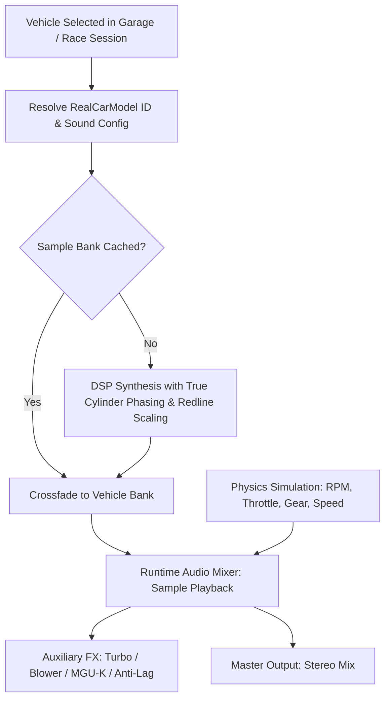

# Feature Spec 022: Per-Vehicle Engine Sound Banks, Discrete Acoustic Modeling, and Physical Synthesis 🔊🏎️

A comprehensive architectural and audio synthesis specification establishing authentic, physical engine sound models for **every individual vehicle model** across all five motorsport disciplines in **TdRace**. Replaces coarse tier-level grouping with **per-vehicle powertrain acoustic differentiation**, resolves multi-cylinder DSP phase cancellation, ensures robust session-wide audio dispatch, and dynamically adapts pitch-scaling to real vehicle redlines.

---

## 🎯 Objectives & Design Philosophy

1. **Per-Vehicle Acoustic Identity**: Every vehicle model in the catalog possesses a unique acoustic identity matching its real-world powertrain (`engine_desc`), cylinder layout (I-4, I-5, Flat-4, Flat-6, V6, V8, V10, V12, 2-Stroke Single/Twin), induction type (NA, Turbo, Supercharger, Hybrid), and redline. Vehicles within the same category (e.g. Porsche Cayman Flat-6 vs Aston Martin Vantage V8 vs BMW M4 I-6 in GT4) must have distinct, instantly recognizable acoustic signatures.
2. **Constructive Multi-Cylinder DSP Synthesis**: Eliminates destructive phase cancellation in multi-cylinder combustion synthesis. Ensures that summing combustion pulses across $N$ cylinders ($N \in \{1..12\}$) preserves rich, distinct harmonic spectra without canceling primary combustion energy to zero.
3. **Powertrain-Aware Adaptive RPM Scaling**: Replaces fixed 1,200 / 4,500 / 8,000 RPM sample points with adaptive sample anchors scaled to each vehicle's physical idle and redline (from 7,000 RPM lawnmowers and pushrod V8s to 15,000 RPM KZ shifter karts and 13,000 RPM CrossCar superbikes).
4. **Universal Race Session Audio Dispatch**: Fixes race session dispatch so that the player's selected vehicle model is accurately resolved and activated across all modalities (Garage Showroom, Quick Race, Career Mode, Custom Championship, Time Trial, and Split Screen), preventing silent fallback to generic Tier 1 defaults.
5. **Enhanced Induction & Exhaust FX**:
   - **Wastegate Sneeze & Turbo Flutter**: Scaled to boost pressure and cylinder displacement.
   - **Anti-Lag System (ALS) Overrun**: Distinct gunshot pop patterns tailored to rally, GT2, and RX1 beasts.
   - **Roots Supercharger Blower Whine**: Prominent gear whine scaling strictly with crank RPM on monster trucks and blower setups.
   - **High-Voltage MGU-K Inverter Whine**: Frequency-variable inverter squeal on Le Mans Hypercars during acceleration and regenerative braking.
6. **Classic Discipline Mapping**: Preserves legacy mapping where Classic Arcade vehicles map to their dedicated Tier 1 discipline configurations.
7. **Zero Asset Bloat**: All vehicle sound banks remain 100% procedurally synthesized in memory via mathematical DSP algorithms, maintaining zero disk asset overhead.

---

## 🗺️ User Flow & Interface Design

When the player selects a car in the Garage Showroom, enters a Quick Race, or launches Career Mode:
1. **Vehicle Audio Profile Resolution**:
   - The session queries `car.sound_config()` directly from `RealCarModel`.
   - The audio engine receives the exact vehicle ID and its specific DSP acoustic configuration.
2. **Dynamic Sound Bank Generation & Caching**:
   - If the vehicle's sample bank is cached in memory, the mixer crossfades immediately.
   - If not cached, the DSP synthesizer generates the 5 steady-state loops tailored to that vehicle's physical RPM range in $< 15\text{ ms}$.
3. **Live Telemetry & Harmonic Modulation**:
   - The engine mixer modulates pitch and load-dependent gains across the vehicle's specific RPM bounds, triggering shift cuts and auxiliary FX on throttle transients.



---

## 📋 Vehicle Powertrain Differentiation Matrix

Every vehicle in the catalog receives tailored acoustic parameters matching its real-world specification:

### 1. Gran Turismo & Endurance GT (`gt`)

| Vehicle Model | Powertrain / Layout | Cyl | Idle / Redline | Induction & Sound Character |
| :--- | :--- | :--- | :--- | :--- |
| **Porsche 718 Cayman GT4** | 4.0L NA Flat-6 | 6 | 900 / 9,000 | Screaming high-rev boxer rasp, dry induction howl |
| **BMW M4 GT4** | 3.0L Twin-Turbo I-6 | 6 | 850 / 7,600 | Metallic inline-6 howl, pronounced twin-turbo spool |
| **Aston Martin Vantage GT4** | 4.0L Twin-Turbo V8 | 8 | 800 / 7,200 | Deep AMG cross-plane V8 rumble, heavy low-frequency punch |
| **Toyota GR Supra GT4** | 3.0L Single-Turbo I-6 | 6 | 850 / 7,500 | Throaty B58 inline-6 bark, turbo blow-off sneeze |
| **Porsche 911 GT3 R** | 4.2L NA Flat-6 | 6 | 1,000 / 9,400 | Piercing 9,400 RPM flat-6 wail, straight-cut transaxle gear chatter |
| **Ferrari 296 GT3** | 3.0L 120° Twin-Turbo V6 | 6 | 1,050 / 8,500 | High-frequency "piccolo V12" 120° V6 roar, aggressive turbo spool |
| **Mercedes-AMG GT3 Evo** | 6.2L NA M159 V8 | 8 | 900 / 8,200 | Thunderous naturally aspirated 6.2L big-block V8 roar |
| **Audi R8 LMS GT3 Evo II** | 5.2L NA V10 | 10 | 1,100 / 8,800 | Unmistakable syncopated 10-cylinder acoustic scream |
| **Porsche 911 GT2 RS Clubsport** | 3.8L Twin-Turbo Flat-6 | 6 | 900 / 7,500 | 700 BHP pressurized boxer thrum, massive wastegate chuff |
| **Brabham BT62 GT2** | 5.4L NA Quad-Cam V8 | 8 | 1,000 / 8,200 | Ultra-crisp naturally aspirated Australian V8 howl |
| **Maserati MC20 GT2** | 3.0L Nettuno Twin-Turbo V6 | 6 | 950 / 7,800 | Pre-chamber combustion rasp, razor-sharp twin-turbo bark |
| **Audi R8 LMS GT2** | 5.2L NA V10 | 10 | 1,100 / 8,500 | 640 BHP uncorked V10 wail with crackling overrun |
| **McLaren F1 GTR Longtail** | 6.0L BMW S70/2 NA V12 | 12 | 1,100 / 8,600 | Legendary visceral 60° V12 wail, pure analog perfection |
| **Mercedes-Benz CLK GTR** | 6.9L AMG M120 NA V12 | 12 | 1,000 / 8,200 | Booming 6.9L endurance V12 roar, straight-cut gearbox whine |
| **Porsche 911 GT1-98** | 3.2L Twin-Turbo Flat-6 | 6 | 1,050 / 8,000 | Classic Le Mans twin-turbo boxer whistle and chuff |
| **Nissan R390 GT1** | 3.5L Twin-Turbo VRH35L V8 | 8 | 1,000 / 7,800 | Group C derived twin-turbo V8, deep crossover tone |
| **Ferrari 499P** | 3.0L Twin-Turbo V6 + MGU-K | 6 | 1,200 / 9,000 | Le Mans winning V6 blend with screaming electric front motor |
| **Porsche 963** | 4.6L Twin-Turbo V8 + MGU-K | 8 | 1,100 / 8,600 | 918-derived twin-turbo V8 with hybrid regeneration whine |
| **Toyota GR010 Hybrid** | 3.5L Twin-Turbo V6 + MGU-K | 6 | 1,200 / 8,800 | High-voltage inverter whine blending with sharp turbo V6 |
| **Cadillac V-Series.R** | 5.5L NA LMC55R DOHC V8 | 8 | 1,050 / 8,800 | Atmospheric cross-plane V8 scream, violent hybrid pit launches |

---

## ⚙️ Backend Models & API Endpoints

### 1. Constructive Multi-Cylinder DSP Synthesis
To eliminate destructive phase cancellation across symmetric cylinder configurations:
- Individual cylinder firings are modeled as asymmetric non-linear pulses with true harmonic dispersion:
  $$\text{combustion}(t) = \sum_{c=0}^{N-1} P\left(t \cdot f_{\text{cycle}} + \phi_c + \delta_c\right)$$
- An asymmetric pulse generator $P(\theta)$ with exponential compression rise and non-linear expansion decay prevents harmonic cancellation at higher cylinder counts.
- Firing interval jitter ($\delta_c \approx 0.005$) and cylinder-specific volume imbalance introduce authentic mechanical lumpiness and rich harmonic retention.

### 2. Vehicle-Specific Audio Profile Resolution
```rust
impl RealCarModel {
    /// Generates the precise procedural sound configuration for this car model.
    pub fn sound_config(&self) -> EngineSoundConfig;
}
```

### 3. Session Audio Resolution Guarantee
In `crates/tdrace-app/src/game/mod.rs`:
```rust
pub fn resolve_active_sound_config(&self) -> EngineSoundConfig;
```
Ensures that regardless of entry modality (Quick Race, Career, Time Trial, Garage, Split-Screen), the active car's specific sound config is loaded into the mixer without falling back to discipline generic defaults.

---

## 🛡️ Security & Role-Based Access Controls (RBAC)

### 1. DSP Synthesis Memory & Execution Bounds
- All generated audio buffers have deterministic, bounded allocations ($T_{\text{loop}} = 0.35\text{ s}$ to $0.65\text{ s}$) matching exact integer engine cycles at standard sample rate (44,100 Hz).
- No heap allocations or dynamic vector growth occur on active audio callback threads.

### 2. Signal Integrity, NaN Guards, and Soft Clipping
- Floating-point sample generation strictly enforces IEEE-754 validation (guarding against NaN and $\pm\infty$).
- Polynomial soft-saturation (`soft_saturate`) guarantees output peaks strictly bounded in $[-1.0, 1.0]$ without audible digital wrap-around clipping.

### 3. Graceful Fallback Strategy
- Unknown vehicle IDs or unmapped models gracefully resolve to the discipline archetype baseline without unhandled panics or silent crashes.

---

## 🧪 Verification & Acceptance Criteria

### Manual Acceptance Criteria (Pseudo-Gherkin)

### Scenario: Vehicles within the same category possess audibly distinct sound signatures
- [x] **Given** the 4 vehicles in GT Tier 1 (Porsche 718 Flat-6, BMW M4 I-6, Aston Martin Vantage V8, Toyota Supra I-6)
- [x] **When** synthesizing their steady-state sample banks
- [x] **Then** each vehicle produces a distinct frequency spectrum matching its cylinder count and engine configuration
- [x] **And** cross-correlation between any two vehicle sample buffers within the category is $< 0.85$

### Scenario: Multi-cylinder DSP synthesis eliminates destructive phase cancellation
- [x] **Given** engine configurations with 5, 6, 8, 10, and 12 cylinders
- [x] **When** executing the combustion pulse synthesis loop
- [x] **Then** the combustion component amplitude is $> 0.35$ across all cylinder counts
- [x] **And** no cylinder configuration results in near-zero fundamental or harmonic erasure

### Scenario: Race session resolves player vehicle audio across all modalities
- [x] **Given** the player starts a race in Quick Race, Career Mode, Custom Championship, or Time Trial
- [x] **When** the starting grid initializes and the engine starts
- [x] **Then** the audio mixer activates the exact sound configuration of the player's selected vehicle model
- [x] **And** the audio engine does not fall back to generic discipline Tier 1 defaults

### Scenario: Adaptive RPM scaling respects true vehicle redline limits
- [x] **Given** vehicles with varied redline limits (e.g. 7,200 RPM Mower vs 9,400 RPM GT3 vs 14,000 RPM 2-Stroke Kart vs 13,000 RPM Superbike)
- [x] **When** evaluating engine audio playback across the RPM band
- [x] **Then** pitch modulation scales proportionally to each vehicle's true redline rather than fixed 8,000 RPM bounds

### Scenario: Classic arcade vehicles preserve Stage 1 Tier 1 discipline mapping
- [x] **Given** the Classic Arcade vehicles (`"classic_gt"`, `"classic_nascar"`, `"classic_offroad"`, `"classic_kart"`, `"classic_rally"`)
- [x] **When** querying their audio profiles
- [x] **Then** they preserve their baseline discipline sound configurations

---

## 🔗 Traceability & Codebase Mapping

### Files to Modify
- `[x]` `crates/cabinet/src/audio/dsp.rs` -> Redesign `combustion_pulse` to eliminate destructive phase cancellation across multi-cylinder configurations.
- `[x]` `crates/tdrace-app/src/audio/sfx.rs` -> Add vehicle-specific tuning capabilities and individual model presets to `EngineSoundConfig`.
- `[x]` `crates/tdrace-app/src/audio/samples.rs` -> Update `generate_steady_engine_loop` with adaptive RPM scaling and non-linear pulse summation.
- `[x]` `crates/tdrace-app/src/catalog/mod.rs` -> Implement `RealCarModel::sound_config(&self)` providing tailored acoustics for all car models.
- `[x]` `crates/tdrace-app/src/game/mod.rs` -> Fix `resolve_active_sound_type` / sound dispatch across all game modes.
- `[x]` `crates/tdrace-app/src/audio/manager.rs` -> Support vehicle-specific sound config loading and update fallback SoundBank.
- `[x]` `crates/tdrace-app/tests/audio_tier_tests.rs` -> Update tests to verify per-vehicle acoustic differentiation and constructive multi-cylinder synthesis.
