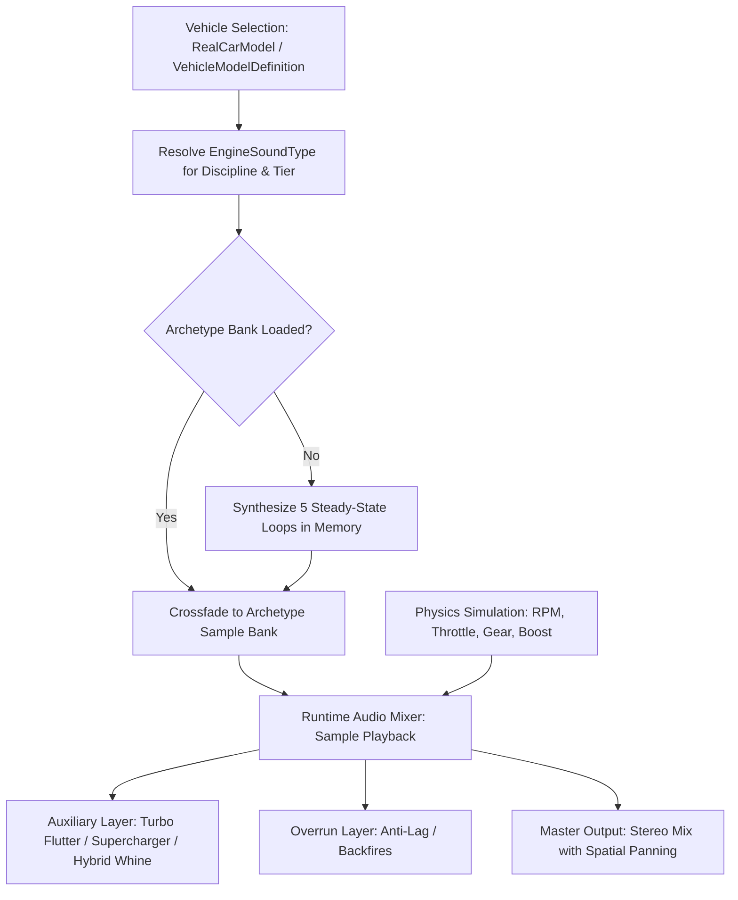

# Feature Spec 022: Per-Tier Engine Sound Banks and Physical Synthesis 🔊🏎️

A comprehensive architectural and audio synthesis specification establishing authentic, physical engine sound banks for every vehicle tier across all five motorsport disciplines in **TdRace**. Builds on Stage 1's vehicle-aware audio resolution, replacing the single shared sound profile per discipline with **25 distinct motorsport sound archetypes** (5 tiers $\times$ 5 disciplines), complete with tailored harmonic synthesis, forced induction artifacts (turbo flutter, supercharger blower whine, anti-lag overrun pops), electric MGU-K hybrid motor whine, and sequential shifter ignition cuts.

---

## 🎯 Objectives & Design Philosophy

1. **Acoustic Progression Across Tiers**: Just as visual fidelity and vehicle handling parameters differentiate each tier, vehicle audio must reflect the true mechanical evolution of motorsport—from grassroots intake grunts to screaming 15,000 RPM prototypes and 1,500 BHP blown methanol monsters.
2. **25 Authentic Physical Archetypes**: Every tier across GT, NASCAR, Rally, Karting, and Extreme Off-Road receives a dedicated `EngineSoundType` with unique harmonic frequency ratios, cylinder counts, and idle/redline bounds.
3. **Physical Induction & Exhaust Artifacts**:
   - **Turbo Flutter & Wastegate Sneeze**: Rally2, Supercar RX1, and GT2 biturbo feature pressure relief oscillations on throttle release.
   - **Anti-Lag System (ALS) Explosions**: Supercar RX1, Group B, and Rally2 trigger violent combustion pops on deceleration overrun.
   - **Blower Supercharger Whine**: Monster trucks feature high-pitched gear-driven Roots blower whine scaling proportionally with engine speed.
   - **Electric MGU-K Hybrid Whine**: Le Mans Hypercar prototypes blend high-voltage inverter whine during initial acceleration and regenerative braking.
   - **Ignition-Cut Sequential Pops**: KZ Shifter karts and sequential race boxes produce crisp 15ms ignition interruption cracks on upshifts.
4. **Classic Tier 1 Discipline Normalization**: Preserves Stage 1's mapping where Classic Arcade vehicles map to the Tier 1 sound archetype of their respective motorsport discipline.
5. **Real-Time Synthesis & Zero Assets**: All 25 sound banks remain 100% procedurally synthesized in memory at startup via DSP algorithms, preserving zero external binary asset bloat and sub-millisecond switching.

---

## 🗺️ User Flow & Interface Design

When the player selects a car in the Garage Showroom or enters a race:
1. **Model & Tier Audio Dispatch**:
   - The session queries `car.sound_type()` from `RealCarModel` (or `VehicleModelDefinition.effective_audio_profile()`).
   - The audio manager checks if the active `ArchetypeSampleBank` matches the required `EngineSoundType`.
2. **Seamless Sound Bank Transition**:
   - If switching cars (e.g. browsing the Garage or advancing to a higher career tier), the audio mixer crossfades smoothly to the new archetype bank without clicks, pops, or audio thread blocking.
3. **Dynamic RPM & Load Modulation**:
   - The engine audio layer evaluates real-time engine telemetry (RPM, throttle load, boost pressure, clutch slip, and speed) and blends the 5 steady-state sample points (Idle, Mid-On, Mid-Off, High-On, High-Off) with auxiliary FX layers (turbo flutter, blower whine, gear chatter).



---

## 📋 Comprehensive 25-Archetype Audio Matrix (5 Tiers $\times$ 5 Disciplines)

### 1. Gran Turismo & Endurance GT (`gt`)

| Tier | Category Name | Archetype ID | Cyl / Layout | RPM Range | Key Acoustic Profile |
| :--- | :--- | :--- | :--- | :--- | :--- |
| **T1** | GT4 Clubsport | `Gt4Clubsport` | 6-Cyl / Flat-6 & V8 | 900 – 7,800 | Crisp production-based sport exhaust, moderate intake resonance, clean mechanical rasp. |
| **T2** | GT3 Evo | `Gt3HighRev` | High-Rev V8 / Flat-6 | 1,000 – 9,000 | Flat-plane screaming V8 / 9,000 RPM flat-6 howl, straight-cut transaxle gear whine, snappy throttle blips. |
| **T3** | GT2 Biturbo | `Gt2Biturbo` | Twin-Turbo V6 / V8 | 900 – 7,500 | 700+ BHP heavy forced induction, deep twin-turbo spool, high manifold pressure roar, wastegate chuff. |
| **T4** | GT1 Legend | `Gt1V12Analogue` | Naturally Aspirated V12 | 1,100 – 10,200 | Raw 90s screaming 6.0L V12 / high-boost analog monster, deafening high-pitched wail, zero electronic assists. |
| **T5** | LMH Hypercar | `HypercarV6Hybrid` | Turbo V6 + MGU-K | 1,200 – 9,200 | High-strung twin-turbo V6 engine blended with high-frequency electric motor inverter whine on throttle tip-in and regen braking. |

---

### 2. NASCAR & Stock Car Racing (`nascar`)

| Tier | Category Name | Archetype ID | Cyl / Layout | RPM Range | Key Acoustic Profile |
| :--- | :--- | :--- | :--- | :--- | :--- |
| **T1** | Street Stock | `LateModelV8` | Small-Block V8 (350 cu in) | 800 – 6,500 | Deep low-end idle cam lope, heavy iron-block rumble, wet dual-exhaust burble. |
| **T2** | ARCA Spec Racer | `ArcaSpecV8` | Spec V8 (396 cu in) | 850 – 7,500 | Raspy side-exit collector bark, mechanical pushrod clatter, aggressive mid-range rasp. |
| **T3** | Craftsman Trucks | `SuperTruckV8` | Pushrod V8 (358 cu in) | 900 – 8,000 | Booming pickup truck bed acoustic resonance, heavy low-frequency torque punch. |
| **T4** | Xfinity Series | `XfinityV8` | High-Comp V8 (358 cu in) | 950 – 8,600 | Screaming crossover X-pipe exhaust howl, ear-splitting 8,500 RPM oval banking scream. |
| **T5** | Cup Next-Gen / TA1 | `NascarV8` | 850 BHP Pushrod V8 | 900 – 9,300 | Open boom-tube split side pipes, thunderous full-throttle roar, violent deceleration backfires. |

---

### 3. Rallycross & All-Terrain World Cup (`rally`)

| Tier | Category Name | Archetype ID | Cyl / Layout | RPM Range | Key Acoustic Profile |
| :--- | :--- | :--- | :--- | :--- | :--- |
| **T1** | CrossCar Junior | `CrossCarMotorcycle` | 750cc 4-Cylinder Bike | 2,200 – 13,000 | Screaming motorcycle superbike engine, ultra-fast rev acceleration, sequential dog-box tooth whine. |
| **T2** | Super1600 FWD | `Super1600Atmo` | Naturally Aspirated 1.6L | 1,100 – 9,200 | Screaming high-compression 1.6L intake bark, carbon airbox roar, close-ratio gear whine. |
| **T3** | Rally2 / R5 AWD | `Rally2Turbo` | 1.6L Turbo + Restrictor | 1,200 – 8,000 | Punchy 32mm restrictor turbo chuff, responsive anti-lag system pops, all-wheel drive differential whine. |
| **T4** | Supercar RX1 | `SupercarRx1` | 600 BHP 2.0L Turbo | 1,300 – 8,500 | 600 BHP explosive launch, violent machine-gun 2-step anti-lag firecracker explosions, gravel-shredding bark. |
| **T5** | Group B Beast | `GroupBInline5` | 2.1L Turbo Inline-5 | 1,100 – 8,800 | Legendary 5-cylinder off-beat syncopated warble, aggressive external wastegate screech, twincharged blower whine. |

---

### 4. Grassroots Karting World Cup (`kart`)

| Tier | Category Name | Archetype ID | Cyl / Layout | RPM Range | Key Acoustic Profile |
| :--- | :--- | :--- | :--- | :--- | :--- |
| **T1** | 60cc Cadet | `KartCadet60` | 60cc 2-Stroke Single | 2,000 – 9,800 | Gentle ring-a-ding centrifugal clutch buzz, high-pitched mechanical putt, kid kart tone. |
| **T2** | Racing Mower | `RacingMowerV2` | 4-Stroke V-Twin Thumper | 1,000 – 7,200 | Straight-pipe unbaffled mower thumper, comical yet menacing lawnmower raspy chug. |
| **T3** | 125cc Rotax MAX | `Kart125cc` | 125cc 2-Stroke Single | 2,500 – 14,000 | Crisp expansion chamber bite, rapid 14,000 RPM powerband screaming resonance. |
| **T4** | 125cc KZ Shifter | `KartShifterKZ` | 125cc 6-Speed Shifter | 2,800 – 15,200 | 6-speed sequential gearbox with sharp ignition-cut upshift bangs, metallic 2-stroke sting. |
| **T5** | 250cc Superkart | `Superkart250Twin` | 250cc Twin-Cylinder 2-Stroke | 3,000 – 16,000 | Twin-cylinder GP racing engine howl, aerodynamic cockpit resonance, banshee wail at 240 km/h. |

---

### 5. Extreme Off-Road & Stunt Arenas (`extreme_offroad`)

| Tier | Category Name | Archetype ID | Cyl / Layout | RPM Range | Key Acoustic Profile |
| :--- | :--- | :--- | :--- | :--- | :--- |
| **T1** | Pro Buggy | `SandRailBoxer` | 2.5L Turbo Flat-4 Boxer | 950 – 7,400 | Raspy off-beat boxer thrum, turbo flutter on overrun, blow-off valve hiss. |
| **T2** | Pro Lite | `ProLiteV6` | 4.0L Race V6 | 1,000 – 8,000 | Naturally aspirated high-displacement V6 desert rasp, sharp throttle response. |
| **T3** | Ultra4 Bouncer | `Ultra4V8` | 7.0L Big Block LS V8 | 850 – 7,200 | Uncorked tubular zoomie headers, violent low-end torque chop, raw open-chassis mechanical clatter. |
| **T4** | Pro4 Stadium Truck | `Pro4UnlimitedV8` | 900 BHP 4WD Race V8 | 1,100 – 9,000 | 900 BHP naturally aspirated oval/short-course screamer, extreme RPM oscillations over rhythm whoops. |
| **T5** | Monster Truck | `MonsterTruckBlower` | 1,500 BHP Methanol V8 | 1,200 – 8,200 | 540 cu in methanol big block with massive screaming Roots supercharger blower whine, earth-shaking roar. |

---

## ⚙️ Backend Models & API Endpoints

### 1. `EngineSoundType` Archetype Enum (`crates/tdrace-app/src/audio/manager.rs`)

```rust
/// Vehicle engine audio synthesis archetype across all 25 motorsport tiers.
#[derive(Debug, Clone, Copy, PartialEq, Eq, Hash, Serialize, Deserialize)]
pub enum EngineSoundType {
    Generic,
    // Gran Turismo & Endurance GT (T1–T5)
    Gt4Clubsport,
    Gt3HighRev,
    Gt2Biturbo,
    Gt1V12Analogue,
    HypercarV6Hybrid,
    // NASCAR & Stock Car Racing (T1–T5)
    LateModelV8,
    ArcaSpecV8,
    SuperTruckV8,
    XfinityV8,
    NascarV8,
    // Rallycross & All-Terrain (T1–T5)
    CrossCarMotorcycle,
    Super1600Atmo,
    Rally2Turbo,
    SupercarRx1,
    GroupBInline5,
    // Grassroots Karting (T1–T5)
    KartCadet60,
    RacingMowerV2,
    Kart125cc,
    KartShifterKZ,
    Superkart250Twin,
    // Extreme Off-Road (T1–T5)
    SandRailBoxer,
    ProLiteV6,
    Ultra4V8,
    Pro4UnlimitedV8,
    MonsterTruckBlower,
    // Legacy Alias
    SportGT,
}
```

### 2. `EngineSoundConfig` Synthesis Parameters (`crates/tdrace-app/src/audio/sfx.rs`)

```rust
pub struct EngineSoundConfig {
    pub base_freq: f32,
    pub harmonic_multipliers: [f32; 6],
    pub harmonic_weights: [f32; 6],
    pub saturation: f32,
    pub duty_cycle: f32,
    pub noise_mix: f32,
    pub has_turbo_flutter: bool,
    pub has_blower_whine: bool,
    pub has_hybrid_whine: bool,
    pub has_anti_lag_pops: bool,
}
```

### 3. Real Car Model & Module Sound Resolution

```rust
impl RealCarModel {
    /// Dispatches the exact EngineSoundType based on module_id and performance tier.
    pub fn sound_type(&self) -> EngineSoundType;
}

impl VehicleModelDefinition {
    /// Audio profile attached to this vehicle definition, falling back to module defaults.
    pub fn effective_audio_profile(&self, default_profile: EngineAudioProfile) -> EngineAudioProfile;
}
```

---

## 🛡️ Security & Role-Based Access Controls (RBAC)

### 1. Static DSP Waveform Generation & Memory Bounding
- All sample buffers are allocated with pre-calculated, fixed buffer sizes ($T_{\text{loop}} = 1.0\text{ s}$ to $2.0\text{ s}$) based on sample rate (44,100 Hz).
- No dynamic reallocation occurs on audio callback threads; audio synthesis executes strictly at startup or background initialization.

### 2. Audio Math Safety & NaN / Clipping Prevention
- Soft saturation transfer functions ($f(x) = \tanh(x)$ or polynomial cubic clipper) guarantee sample outputs strictly clamped in $[-1.0, 1.0]$.
- Denormal prevention and zero-division guards on all biquad filter calculations.

### 3. Graceful Module & Tier Fallback
- Any unmapped discipline or out-of-bounds tier automatically falls back to `EngineSoundType::Generic` or the module baseline without panicking.

---

## 🧪 Verification & Acceptance Criteria

### Manual Acceptance Criteria (Pseudo-Gherkin)

### Scenario: All 25 motorsport tiers resolve unique, tier-appropriate engine sound archetypes
- [x] **Given** the 5 motorsport disciplines (`"gt"`, `"nascar"`, `"rally"`, `"kart"`, `"extreme_offroad"`)
- [x] **When** querying `sound_type()` on all 25 categories and vehicles across Tiers 1 through 5
- [x] **Then** each tier within a discipline returns its dedicated `EngineSoundType`
- [x] **And** no two tiers within the same discipline share the exact same sound archetype

### Scenario: Classic arcade vehicles preserve Stage 1 Tier 1 discipline mapping
- [x] **Given** the Classic Arcade module vehicles (`"classic_gt"`, `"classic_nascar"`, `"classic_offroad"`, `"classic_kart"`, `"classic_rally"`)
- [x] **When** querying their audio profiles or `sound_type()`
- [x] **Then** `classic_gt` maps to `EngineSoundType::Gt4Clubsport`
- [x] **And** `classic_nascar` maps to `EngineSoundType::LateModelV8`
- [x] **And** `classic_offroad` maps to `EngineSoundType::SandRailBoxer`
- [x] **And** `classic_kart` maps to `EngineSoundType::KartCadet60`
- [x] **And** `classic_rally` maps to `EngineSoundType::CrossCarMotorcycle`

### Scenario: DSP synthesis produces valid, click-free audio buffers for all 25 archetypes
- [x] **Given** all 25 variants of `EngineSoundType`
- [x] **When** generating the `ArchetypeSampleBank` for each archetype at standard sample rate (44,100 Hz)
- [x] **Then** all 5 sample points (Idle, Mid-On, Mid-Off, High-On, High-Off) contain valid non-empty WAV buffers
- [x] **And** no samples contain NaN, infinity, or DC bias $> 0.05$
- [x] **And** peak amplitude remains safely bounded within $[-1.0, 1.0]$ without hard clipping distortion

### Scenario: Dynamic vehicle switching in garage showroom crossfades sound banks smoothly
- [x] **Given** the player is in the Garage Showroom
- [x] **When** the player cycles vehicles across different tiers or disciplines
- [x] **Then** `resolve_active_sound_type()` resolves the specific vehicle's sound archetype
- [x] **And** the audio engine crossfades to the new archetype sample bank without audio thread stalls or clicks

---

## 🔗 Traceability & Codebase Mapping

### Modified Files
- `[x]` `crates/tdrace-app/src/audio/manager.rs` -> Expand `EngineSoundType` enum to 25 variants, update archetype mappings.
- `[x]` `crates/tdrace-app/src/audio/sfx.rs` -> Add 25 customized `EngineSoundConfig` presets with tuned harmonics and envelopes.
- `[x]` `crates/tdrace-app/src/audio/samples.rs` -> Expand `ArchetypeSampleBank::generate` to support all 25 sound archetypes with turbo, blower, and hybrid modulation.
- `[x]` `crates/tdrace-app/src/module/mod.rs` -> Add profile constructors for all 25 tier profiles on `EngineAudioProfile`.
- `[x]` `crates/tdrace-app/src/module/gt.rs` -> Assign tier-specific `EngineAudioProfile` across Tiers 1–5.
- `[x]` `crates/tdrace-app/src/module/nascar.rs` -> Assign tier-specific `EngineAudioProfile` across Tiers 1–5.
- `[x]` `crates/tdrace-app/src/module/rally.rs` -> Assign tier-specific `EngineAudioProfile` across Tiers 1–5.
- `[x]` `crates/tdrace-app/src/module/kart.rs` -> Assign tier-specific `EngineAudioProfile` across Tiers 1–5.
- `[x]` `crates/tdrace-app/src/module/extreme_offroad.rs` -> Assign tier-specific `EngineAudioProfile` across Tiers 1–5.
- `[x]` `crates/tdrace-app/src/module/classic.rs` -> Update classic fantasy car audio profiles to map to discipline Tier 1 archetypes.
- `[x]` `crates/tdrace-app/src/catalog/mod.rs` -> Update `RealCarModel::sound_type()` to dispatch per module and tier.
- `[x]` `crates/tdrace-app/src/ui/menu.rs` -> Update `CarChoice::sound_type()` to map archetype choices accurately.
- `[x]` `crates/tdrace-app/tests/audio_tests.rs` -> Update and expand audio test assertions.
- `[x]` `crates/tdrace-app/tests/audio_tier_tests.rs` -> New dedicated regression suite verifying 25-tier audio matrix synthesis and dispatch.
- `[x]` `specs/index.md` -> Register Spec 022 in the specifications index.
- `[x]` `specs/constitution/ROADMAP.md` -> Link Spec 022 under Phase 2 in the product roadmap.
