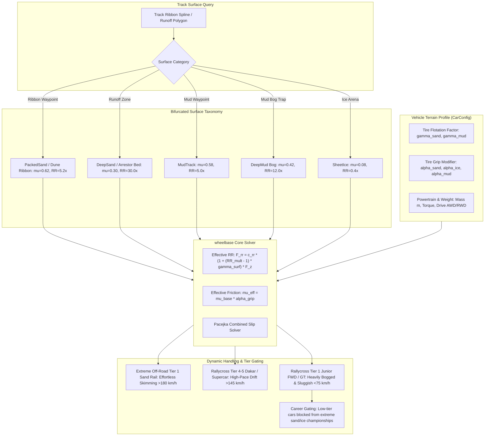

# Architecture Spec: Terrain Surface Bifurcation, Vehicle Terrain Interaction, and Category-Tier Gating 🏜️❄️🚜

A physics architecture and gameplay calibration specification that resolves off-road surface dynamics in **TdRace**. Building on empirical findings from the headless simulation harness ([Spec 010](010_surface_car_interaction_simulation.md)), this specification bifurcates soft terrain into drivable track ribbons versus punitive off-track traps, establishes vehicle-specific terrain interaction coefficients (tire flotation, paddle thrust, and ice stud penetration), and enforces career discipline and tier gating so that extreme surfaces can only be effectively contested by appropriately engineered machinery.

---

## 🔬 1. Problem Statement & Empirical Simulation Evidence

### 1.1 The Original Sand Dilemma
In [Spec 010](010_surface_car_interaction_simulation.md), `SurfaceType::Sand` was originally configured with:
* Friction $\mu = 0.30$
* Rolling Resistance Multiplier $RR_{\text{mult}} = 30.0\times$
* Surface Drag Multiplier $C_{\text{drag}} = 4.5\times$

This was engineered strictly as an **off-track emergency arrestor bed** (analogous to an F1 gravel trap designed to stop runaway cars at $200\,\text{km/h}$). However, multiple official game circuits (`sahara_dune_crossing`, `glamis_sand_dunes`, `atacama_sand_basin`, and `baja_500_desert_scrub`) designated `SurfaceType::Sand` as the **primary drivable track ribbon**.

### 1.2 Mathematical & Empirical Failure Modes
As proven by the empirical simulation suite (`sand_simulation_evaluation_tests`):
1. **Force Deficit**: For a standard sports car ($1,050\,\text{kg}$), the rolling drag on sand is:
   $$F_{\text{rr}} = 0.015 \times 30.0 \times (1,050 \times 9.81) \approx \mathbf{4,635\,\text{N}}$$
   The maximum forward traction deliverable by the driven rear wheels before wheelspin is capped at:
   $$F_{x,\max} = \mu \cdot F_{z,\text{rear}} = 0.30 \times 4,720\,\text{N} \approx \mathbf{1,416\,\text{N}}$$
   Net longitudinal force is permanently negative ($-3,219\,\text{N}$). Cars reach a terminal crawl of only $1.1\,\text{km/h}$ ($0.31\,\text{m/s}$) from a standing start.
2. **Steering Authority Starvation**: Under the Pacejka combined slip friction circle:
   $$\sqrt{F_x^2 + F_y^2} \le \mu \cdot F_z$$
   The massive longitudinal drag force ($F_x \approx 737\,\text{N}$) consumes almost the entire grip circle ($\mu \cdot F_{z,\text{front}} \approx 834\,\text{N}$), leaving less than $390\,\text{N}$ of lateral force. Under full steering lock at $40\,\text{km/h}$, lateral acceleration collapses to **$0.05g$** (vs $0.70g$ on asphalt), and 1-second heading turn drops from $31.0^\circ$ to **$1.9^\circ$** (a $94\%$ loss of turning capability).

---

## 🗺️ Current vs. Proposed System Architecture

### 1. Current Architecture (Monolithic Surfaces & Generic Tire Models)
* **Single Surface Trait**: `SurfaceType::Sand` represents both the drivable racing surface on desert tracks and the runaway gravel/sand trap.
* **Uniform Resistance Scaling**: All vehicles, from 160 BHP front-wheel-drive hatchbacks to 800 BHP desert trophy trucks and 590 kg paddle-tire buggies, experience identical rolling resistance multiplier penalties ($30.0\times$) and friction ($\mu = 0.30$).
* **No Vehicle Terrain Differentiation**: A Sand Rail Buggy with massive paddle tires and high flotation sinks into sand identically to an F1/GT car with slick road tires.

### 2. Proposed Architecture (Bifurcated Surfaces & Vehicle-Terrain Interaction Modifiers)
To allow authentic desert racing, mud bogging, and ice drifting while maintaining punitive off-track runoff zones, the system introduces two architectural pillars:
1. **Surface Bifurcation**: Splitting soft surfaces into **Drivable Racing Ribbons** (e.g. `PackedSand`, `MudTrack`, `PackedSnow`) and **Off-Track Arrestor Beds / Traps** (e.g. `DeepSand`, `DeepMud`, `SheetIce`).
2. **Vehicle Terrain Interaction Factors**: Parameterizing how vehicle mass, suspension clearance, and specialized tire treads (paddle tires, mud lugs, tungsten studs) modulate rolling resistance and available friction.



---

## 📐 Mathematical Model: Terrain-Vehicle Interaction

### 1. Effective Rolling Resistance Equation
The effective rolling resistance coefficient $C_{\text{rr, eff}}$ experienced by a wheel is scaled by the vehicle's terrain flotation coefficient $\gamma_{\text{surface}} \in [0.15, 1.00]$:

$$C_{\text{rr, eff}} = c_{\text{rr, base}} \times \left(1.0 + (RR_{\text{multiplier}} - 1.0) \cdot \gamma_{\text{surface}}\right)$$

* When $\gamma_{\text{surface}} = 1.00$ (Standard road tires, low clearance): The vehicle suffers $100\%$ of the surface's rolling drag.
* When $\gamma_{\text{surface}} = 0.30$ (Sand paddle tires, lightweight buggy): Rolling resistance increase is attenuated by $70\%$, allowing the vehicle to plane/skim across the loose surface.

### 2. Effective Friction & Lateral Adhesion Equation
The effective friction coefficient $\mu_{\text{eff}}$ available to the tire is modulated by the specialized tread bite factor $\alpha_{\text{grip}} \ge 0.50$:

$$\mu_{\text{eff}} = \mu_{\text{surface}} \cdot \alpha_{\text{grip}}$$

* **Arctic Ice Racers with Tungsten Studs**: On `SheetIce` ($\mu_{\text{base}} = 0.08$), 600 tungsten studs per tire provide $\alpha_{\text{ice}} = 8.125 \implies \mu_{\text{eff}} = \mathbf{0.65}$. This transforms ice from an uncontrollable spin into a crisp, high-speed pendulum drift.
* **Standard Street Radial Tires on Ice**: $\alpha_{\text{ice}} = 1.00 \implies \mu_{\text{eff}} = \mathbf{0.08}$.

---

## 🏜️ Bifurcated Surface Parameters & Baseline Calibration

The surface taxonomy in [`SurfaceType`](../crates/wheelbase/src/surface.rs) is expanded and calibrated:

| Surface Type | Identifier | Base $\mu$ | Base $RR_{\text{mult}}$ | Surface Drag | Intended Role & Placement |
| :--- | :--- | :---: | :---: | :---: | :--- |
| **Packed Sand / Dune** | `PackedSand` | **$0.62$** | **$5.2\times$** | $2.10\times$ | **Drivable track ribbon** for desert circuits (Sahara, Glamis, Atacama). Tuned so standard rally cars lose $50\%$ pace, but buggies/raid trucks thrive. |
| **Deep Sand / Gravel Trap** | `DeepSand` | **$0.30$** | **$30.0\times$** | $4.50\times$ | **Off-track runoff / arrestor bed**. Stops runaway cars rapidly. |
| **Mud Track** | `MudTrack` | **$0.58$** | **$5.0\times$** | $2.50\times$ | **Drivable mud ribbon** for wet rallycross and stadium whoops. |
| **Deep Mud Bog** | `DeepMud` | **$0.40$** | **$14.0\times$** | $5.00\times$ | **Off-track swamp hazard & extreme bog arena**. Severe speed bleed. |
| **Packed Snow** | `PackedSnow` | **$0.48$** | **$2.2\times$** | $1.40\times$ | **Drivable winter ribbon** for Alpine and Scandinavian courses. |
| **Deep Snowbank** | `DeepSnow` | **$0.28$** | **$12.0\times$** | $3.80\times$ | **Snowbank runoff barrier**. Decelerates vehicle gently upon contact. |
| **Sheet Ice** | `SheetIce` | **$0.08$** | **$0.4\times$** | $0.90\times$ | **Glacial mirror sheet**. Only playable with studded competition tires. |

---

## 🏎️ Vehicle Category & Tier Terrain Interaction Matrix

To ensure that different motorsport tiers and categories feel physically differentiated and progression-gated:

```
                            TERRAIN CAPABILITY HIERARCHY
                            
   Extreme Off-Road Tier 1 (Sand Rail Buggy)   ──►  Master of Packed & Deep Sand
   Extreme Off-Road Tier 3 (Arctic Ice Racer)  ──►  Master of Sheet Ice
   Extreme Off-Road Tier 4 (Mud Bogger V8)     ──►  Master of Deep Mud Bogs
   Rallycross Tier 4-5 (Dakar Raid / Supercar) ──►  Competitive on Sand & Mud
   Rallycross Tier 1 (Junior FWD Hatch)        ──►  Plows & Bogs on Sand / Mud
   Asphalt Categories (GT, NASCAR TA1, Kart)   ──►  Severely Trapped (< 50 km/h)
```

### Category & Tier Interaction Coefficients

| Vehicle Category / Tier | Archetype Model | Weight ($m$) | Sand Flotation ($\gamma_{\text{sand}}$) | Mud Flotation ($\gamma_{\text{mud}}$) | Ice Stud Grip ($\alpha_{\text{ice}}$) | Sand Performance Verdict |
| :--- | :--- | :---: | :---: | :---: | :---: | :--- |
| **Asphalt GT / Supercar** | Ferrari 488 GT3 | $1,260\,\text{kg}$ | $1.00$ | $1.00$ | $1.00$ ($\mu=0.08$) | **Unplayable**: Sinks into sand, zero traction on ice. |
| **NASCAR / Trans-Am TA1** | TA1 Spaceframe V8 | $1,260\,\text{kg}$ | $1.00$ | $1.00$ | $1.00$ ($\mu=0.08$) | **Unplayable**: Heavy rear wheelspin, excessive sinkage. |
| **Karting (All Tiers)** | 125cc Shifter Kart | $180\,\text{kg}$ | $1.00$ | $1.00$ | $0.80$ ($\mu=0.06$) | **Unplayable**: Low ground clearance, grounds out. |
| **Rally Tier 1: Junior FWD** | Peugeot 208 Rally4 | $1,080\,\text{kg}$ | **$1.00$** | **$0.95$** | $1.50$ ($\mu=0.12$) | **Severely Penalized**: FWD thrust ($1,800\,\text{N}$) fails against $850\,\text{N}$ drag. Top speed $<75\,\text{km/h}$, terminal understeer. |
| **Rally Tier 2: Prod AWD** | Subaru WRX STI NR4 | $1,320\,\text{kg}$ | **$0.80$** | **$0.80$** | $2.50$ ($\mu=0.20$) | **Handicapped**: AWD pulls through, but sluggish ($<110\,\text{km/h}$). |
| **Rally Tier 3: Group B** | Audi Sport Quattro S1 | $1,090\,\text{kg}$ | **$0.70$** | **$0.70$** | $3.50$ ($\mu=0.28$) | **Volatile**: 550 BHP overcomes drag, but twitchy short wheelbase. |
| **Rally Tier 4: Dakar Raid** | Peugeot 3008 DKR | $1,580\,\text{kg}$ | **$0.48$** | **$0.50$** | $3.00$ ($\mu=0.24$) | **Effective**: 35" tires and long-travel suspension cruise at $>155\,\text{km/h}$. |
| **Rally Tier 5: Supercar RX** | VW Polo R RX 600 BHP | $1,300\,\text{kg}$ | **$0.42$** | **$0.45$** | $4.00$ ($\mu=0.32$) | **Competitive**: Extreme power and wide knobby tires drift at $>165\,\text{km/h}$. |
| **Extreme Off-Road Tier 1** | Sand Rail Buggy / UTV | $590\,\text{kg}$ | **$0.30$** | **$0.65$** | $1.50$ ($\mu=0.12$) | **Dominant**: Ultralight flotation + rear paddle tires skims dunes at $>190\,\text{km/h}$. |
| **Extreme Off-Road Tier 2** | Baja Trophy Truck 4x4 | $2,400\,\text{kg}$ | **$0.38$** | **$0.48$** | $2.50$ ($\mu=0.20$) | **Dominant**: 800 BHP + 30" wheel travel eats desert washboards at $>210\,\text{km/h}$. |
| **Extreme Off-Road Tier 3** | Arctic Ice Racer Coupe | $1,180\,\text{kg}$ | $0.85$ | $0.85$ | **$8.125$** ($\mu=\mathbf{0.65}$) | **Dominant on Ice**: 600 tungsten razor studs slice into ice for pinpoint control. |
| **Extreme Off-Road Tier 4** | Mud Bogger V8 | $1,850\,\text{kg}$ | $0.50$ | **$0.25$** | $2.00$ ($\mu=0.16$) | **Dominant on Mud**: 54" tractor chevron paddles walk through waist-deep bogs at $>120\,\text{km/h}$. |
| **Extreme Off-Road Tier 5** | Crusher Monster Truck | $4,500\,\text{kg}$ | **$0.32$** | **$0.28$** | $3.00$ ($\mu=0.24$) | **All-Terrain Monster**: 66" Terra tires roll over all soft surfaces without impedance. |

---

## 🔬 Simulation Research & Benchmark Validation Envelopes

The headless simulation harness evaluates vehicle performance on `PackedSand` against quantitative acceptance envelopes:

### 1. Packed Sand Standing Start ($0 \to 100\,\text{km/h}$) Simulation Envelope
* **Extreme Off-Road Tier 1 (Sand Rail Buggy, 590 kg, paddle tires)**:
  * $0 \to 50\,\text{km/h}$: $<1.8\,\text{s}$
  * $0 \to 100\,\text{km/h}$: $<3.9\,\text{s}$
  * Quarter-Mile Trap Speed: $>165\,\text{km/h}$
  * Terminal Velocity: $\ge 190\,\text{km/h}$
* **Rallycross Tier 5 (Supercar RX / Stadium Truck, 600 BHP, knobby tires)**:
  * $0 \to 50\,\text{km/h}$: $<2.2\,\text{s}$
  * $0 \to 100\,\text{km/h}$: $<4.8\,\text{s}$
  * Terminal Velocity: $\ge 165\,\text{km/h}$
* **Rallycross Tier 1 (Junior FWD Hatchback, 160 BHP, standard rally tires)**:
  * $0 \to 50\,\text{km/h}$: $>4.5\,\text{s}$
  * $0 \to 100\,\text{km/h}$: $>16.0\,\text{s}$ (or fails to reach $100\,\text{km/h}$)
  * Terminal Velocity: $\le 85\,\text{km/h}$
  * Net Acceleration Handicap vs Sand Rail: $\ge 70\%$ slower.
* **Asphalt GT / Stock TA1 (Standard road tires)**:
  * Trapped in wheelspin, fails to exceed $45\,\text{km/h}$.

### 2. Packed Sand Steady-State Cornering ($R = 30\,\text{m}$ Skidpad)
* **Sand Rail Buggy**:
  * Peak Lateral Accel: $a_{y,\max} \ge 0.68g$
  * Critical Cornering Speed: $v_{\text{crit}} \ge 50\,\text{km/h}$
  * Steering Authority: Crisp turn-in with controllable throttle-oversteer pendulum.
* **Rallycross Tier 1 (Junior FWD)**:
  * Peak Lateral Accel: $a_{y,\max} \le 0.32g$
  * Critical Cornering Speed: $v_{\text{crit}} \le 28\,\text{km/h}$
  * Dynamic Behavior: Severe terminal understeer plow ($K_{\text{us}} > 4.5\,\text{deg}/g$).

### 3. Arctic Sheet Ice Benchmark ($R = 40\,\text{m}$ Circle)
* **Arctic Ice Racer (Extreme Off-Road Tier 3, Studded)**:
  * $a_{y,\max} \ge 0.60g$
  * Critical Cornering Speed: $\ge 55\,\text{km/h}$
  * Braking Distance ($100 \to 0\,\text{km/h}$): $\le 65\,\text{m}$
* **Standard Sports Car / Rally Tier 1 (Non-Studded)**:
  * $a_{y,\max} \le 0.08g$
  * Braking Distance ($100 \to 0\,\text{km/h}$): $\ge 350\,\text{m}$
  * Directional Control: Instant zero-yaw authority spinout.

---

## 🎮 Career Discipline & Tier Gating Rules

To prevent unplayable career progression and preserve authentic motorsport progression, tracks are gated by surface composition:

### 1. Track Surface Gating Matrix

```
┌─────────────────────────────────┬─────────────────────────────────────────────────────────────┐
│ Dominant Ribbon Surface         │ Eligible Career Disciplines & Minimum Required Tiers        │
├─────────────────────────────────┼─────────────────────────────────────────────────────────────┤
│ PackedSand (Sahara, Glamis,     │ Extreme Off-Road: Tier 1+ (Sand Rails, Trophy Trucks)       │
│ Atacama, Baja 500)              │ Rallycross: Tier 4+ (Dakar Rally Raid, Stadium Trucks)     │
│                                 │ BLOCKED: Rallycross Tier 1-3, NASCAR, GT, Karting           │
├─────────────────────────────────┼─────────────────────────────────────────────────────────────┤
│ DeepMud (Louisiana Swamp,       │ Extreme Off-Road: Tier 4+ (Mud Boggers, Monster Trucks)     │
│ Mud Slough Arena)               │ BLOCKED: All other disciplines & tiers                      │
├─────────────────────────────────┼─────────────────────────────────────────────────────────────┤
│ SheetIce (Arctic Frozen Lake,   │ Extreme Off-Road: Tier 3 (Arctic Ice Racers)                │
│ Rovaniemi Ice Ring)             │ BLOCKED: All non-studded vehicle tiers                      │
├─────────────────────────────────┼─────────────────────────────────────────────────────────────┤
│ PackedSnow (Alpine Ridge,       │ Rallycross: Tier 2+ (AWD Rally)                             │
│ Glacier Crest Pass)             │ Extreme Off-Road: Tier 2+                                   │
└─────────────────────────────────┴─────────────────────────────────────────────────────────────┘
```

### 2. Custom & Quick Race Incompatibility Advisory
If a player in `Quick Race` or `Custom Championship` selects a vehicle whose surface flotation or tire grip coefficient yields a severe mismatch on the selected track's primary surface (e.g. attempting to race an 850 BHP NASCAR TA1 or a Kart at `Glamis Sand Dunes`):
1. **Visual Advisory Badge**: Renders a warning on the starting grid card:
   `⚠️ SURFACE WARNING: Vehicle has severe rolling drag handicap on Sand dunes.`
2. **AI Balancing**: AI opponents automatically equip appropriate category vehicles matching the track discipline to avoid AI grid pileups in the sand.

---

## 🗄️ Database & Storage Migration Plan

### 1. Track Preset & JSON Spline Updates
1. **Update Ribbon Surfaces**: In presets and `tracks/*.json` for `sahara_dune_crossing`, `glamis_sand_dunes`, `atacama_sand_basin`, and `baja_500_desert_scrub`:
   * Change ribbon waypoint surfaces from `"Sand"` to `"PackedSand"`.
   * Keep off-track runoff corridor terrain as `"DeepSand"`.
2. **Update Winter & Mud Circuits**:
   * `arctic_frozen_lake`, `rovaniemi_ice_ring` designated `"SheetIce"`.
   * `alpine_snow_ridge` designated `"PackedSnow"`.
   * `louisiana_mud_swampland`, `mud_slough_arena` designated `"MudTrack"` for ribbon, `"DeepMud"` for runoff.

### 2. Vehicle Config Schema Extension
In [`crates/wheelbase/src/config.rs`](../crates/wheelbase/src/config.rs), add `TerrainInteractionConfig`:
```rust
#[derive(Debug, Clone, Copy, PartialEq, Serialize, Deserialize)]
pub struct TerrainInteractionConfig {
    pub sand_flotation: f32, // Default 1.0 (no reduction), 0.30 for Sand Rail
    pub mud_flotation: f32,  // Default 1.0, 0.25 for Mud Bogger
    pub ice_grip_multiplier: f32, // Default 1.0, 8.125 for Studded Ice Racer
}
```

---

## 🔑 Security, Compliance, & IAM Roles

### 1. Deterministic Computational Execution
* Pure mathematical execution without external network calls or dynamic memory reallocation during the physics tick.
* Sanitizes division by zero when computing slip angles and flotation scalars.

### 2. Physical Invariance & Safety Clamping
* Flotation factor $\gamma$ is clamped strictly to $[0.10, 1.00]$ to prevent zero or negative rolling resistance anomalies.
* Grip multiplier $\alpha$ is clamped to $[0.50, 10.00]$ to avoid unphysical infinite traction explosions.

---

## 🛡️ Disaster Recovery, Monitoring, & Fallbacks

### 1. Backward Compatibility & Track Fallback
* Legacy tracks referencing `"Sand"` continue to resolve seamlessly in `SurfaceType::from_str`:
  * If context is a track ribbon waypoint $\implies$ defaults to `PackedSand`.
  * If context is an off-track runoff polygon $\implies$ defaults to `DeepSand`.

### 2. AI Stalling & Bogging Watchdogs
* In offline and career modes, if an AI racer remains bogged below $5\,\text{km/h}$ on a soft surface for more than $3.0\,\text{seconds}$, the AI recovery controller applies a progressive flotation boost to prevent persistent track-blocking bottlenecks.

---

## 🧪 Verification & Acceptance Criteria

### Automated Tests
* Execute terrain interaction test suite: `cargo test -p wheelbase terrain_interaction`
* Run cross-category sand benchmark: `cargo test -p tdrace-core --test sand_simulation_evaluation_tests`
* Validate surface gating consistency: `cargo test -p tdrace-app career_tier_surface_gating`

### Manual Acceptance Criteria (Pseudo-Gherkin)

- **Scenario: Sand Rail Buggy vs Rally Junior FWD on Packed Sand ribbon**
  - [ ] **Given** a reference track segment configured with `SurfaceType::PackedSand` ($\mu=0.62, RR=5.2\times$)
  - [ ] **When** a Tier 1 Sand Rail Buggy ($\gamma_{\text{sand}} = 0.30$) executes a 0-100 km/h sprint
  - [ ] **Then** the buggy must achieve 100 km/h in under 4.0 seconds
  - [ ] **And** reach a peak terminal velocity $\ge 185\,\text{km/h}$
  - [ ] **When** a Rallycross Tier 1 Junior FWD car ($\gamma_{\text{sand}} = 1.00$) executes the same sprint
  - [ ] **Then** the FWD car must take over 15.0 seconds to reach 100 km/h (or top out below 85 km/h)
  - [ ] **And** the FWD car must experience at least 3.0x greater rolling resistance force than the buggy

- **Scenario: Off-track Deep Sand runaway arrestor trap behavior**
  - [ ] **Given** a vehicle traveling at 150 km/h leaving the track ribbon into `SurfaceType::DeepSand` ($RR=30.0\times$)
  - [ ] **When** the vehicle enters the deep sand runoff bed
  - [ ] **Then** opposing deceleration force must exceed $4,000\,\text{N}$
  - [ ] **And** the vehicle must be brought to a complete halt ($<1\,\text{km/h}$) within 25.0 meters

- **Scenario: Arctic Ice Racer with tungsten studs on Sheet Ice**
  - [ ] **Given** a circular skidpad on `SurfaceType::SheetIce` ($\mu=0.08$)
  - [ ] **When** an Extreme Off-Road Tier 3 Arctic Ice Racer equipped with studs ($\alpha_{\text{ice}} = 8.125$) corners at 50 km/h
  - [ ] **Then** effective tire grip $\mu_{\text{eff}}$ must measure $\ge 0.60$
  - [ ] **And** lateral acceleration must exceed $0.55g$ without uncontrolled spinning
  - [ ] **When** a standard sports car enters the same ice circle at 50 km/h
  - [ ] **Then** lateral acceleration must not exceed $0.10g$ and the car must depart the trajectory

- **Scenario: Career championship track surface eligibility gating**
  - [ ] **Given** the Rallycross World Cup Career mode
  - [ ] **When** loading the calendar for Tier 1 (Grassroots Junior FWD)
  - [ ] **Then** no circuit in the calendar may have a primary surface of `PackedSand`, `DeepMud`, or `SheetIce`
  - [ ] **When** loading Tier 4 (Dakar Rally Raid) or Tier 5 (Stadium Super Trucks)
  - [ ] **Then** desert circuits with `PackedSand` are fully unlocked and playable

---

## 🔗 Traceability & Codebase Mapping

### Target Crates & Modules
- `crates/wheelbase/src/surface.rs` -> Add `SurfaceType::PackedSand`, `DeepSand`, `MudTrack`, `DeepMud`, `PackedSnow`, `SheetIce`.
- `crates/wheelbase/src/config.rs` -> Add `TerrainInteractionConfig` to `CarConfig` with per-archetype presets.
- `crates/wheelbase/src/car.rs` -> Integrate terrain flotation factor $\gamma$ into rolling resistance solver and $\alpha$ into Pacejka $\mu$.
- `crates/tdrace-core/src/track/presets/` -> Update desert circuits (`sahara`, `glamis`, `atacama`, `baja`) to use `PackedSand`.
- `crates/tdrace-app/src/game/mod.rs` -> Surface incompatibility advisory and career calendar tier gating.

### Beads Issue Tracking
- Tracked via Beads Epic: `tdrace-surface-bifurcation-tier-gating-sbt1`.
