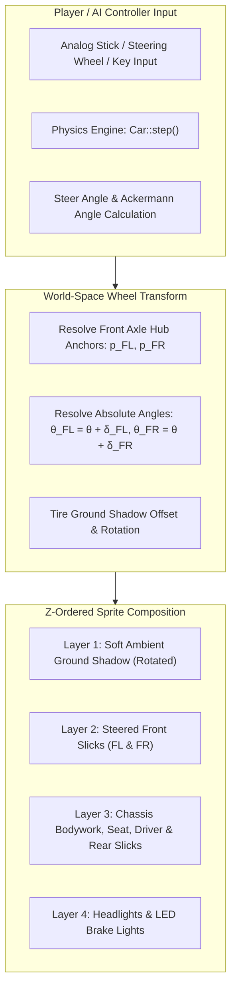
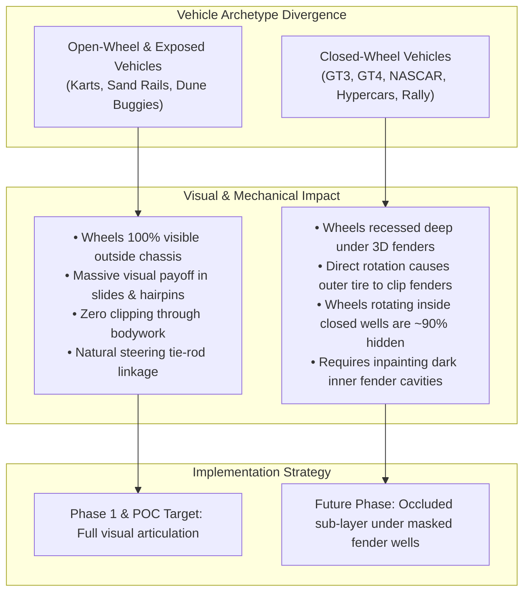

# Feature Spec: Top-Down Pre-Baked Vehicle Wheel Steering Animations 🏎️💨🛞

A comprehensive architectural, rendering, and asset pipeline specification introducing dynamic wheel steering animations to pre-baked, high-resolution 2D top-down vehicle textures in **TdRace**. 

While procedural vehicles in the engine already calculate and display dynamic Ackermann steering angles, vehicles rendered using high-resolution 2D top-down PNG textures currently render as static monolithic bitmaps with wheels locked straight at $0^\circ$. This specification resolves that visual regression through a **Multi-Layer Sprite Decomposition** architecture, establishing a single-vehicle Proof of Concept (POC) on the open-wheel `classic_kart`, while laying down clean abstraction gates for future rollout across exposed-wheel buggies and closed-wheel GT/rally machinery.

---

## 🗺️ User Flow & Interface Design

### 1. In-Race Cenital (Top-Down) Dynamic Steering Feedback
In cenital (top-down / bird's-eye) racing view, vehicle steering transforms from static sliding tiles into articulated mechanical racecraft:



* **Straight-Line Tracking ($\text{steer\_angle} = 0^\circ$):** Front wheels align parallel to vehicle heading $\hat{\mathbf{f}}$, perfectly matching the chassis centerline with zero jitter.
* **Cornering & Turn-In ($\text{steer\_angle} \ne 0^\circ$):** Front wheels visibly deflect into the corner. Inner tire turns at a sharper angle than the outer tire according to authentic Ackermann geometry ($\lvert\delta_{\text{inner}}\rvert > \lvert\delta_{\text{outer}}\rvert$).
* **Slide & Counter-Steer Dynamics:** When drifting or counter-steering through a power slide, the front wheels visibly point into the counter-steer direction while the car body slides sideways, giving immediate, intuitive visual feedback on vehicle yaw rate and traction limit.
* **Airborne Jumps & Ramps:** As elevation lift $z_{\text{lift}}$ increases, front wheel ground shadows expand and fade synchronously with chassis drop shadows, preserving 2.5D spatial depth.

### 2. Garage & Showroom Turntable Interaction
* In the 3D/2.5D Garage and Showroom (`GameState::Garage`), the vehicle displays its lateral 1024px render for livery inspection.
* When inspecting top-down views or toggling test steering in the garage, wheel rotation reflects real-time stick inputs.

---

## 🧭 Executive Summary & Feasibility Challenge

### 1. The Core Architectural Challenge
In top-down 2D motorsport gaming, vehicle realism depends on conveying tire grip, slip angles, and chassis attitude. However, animating steering on pre-baked 2D bitmaps introduces a fundamental visual and geometric divergence between vehicle archetypes:



### 2. Evaluated Technical Approaches & Trade-off Matrix

| Technical Approach | Animation Fluidity | Memory / Asset Footprint | Authoring Complexity | Verdict |
| :--- | :--- | :--- | :--- | :--- |
| **A. Multi-Frame Sprite Sheets**<br>(e.g., $-20^\circ, -10^\circ, 0^\circ, +10^\circ, +20^\circ$ baked) | Stepped / jerky on analog sticks ($5-9$ discrete frames) | **Extremely Poor**<br>$\sim 500\%$ bloat (85 cars $\times 7$ frames $= \sim 600$ textures, $> 120\,\text{MB}$) | Massive (manual or automated generation of hundreds of unique renders) | **REJECTED** |
| **B. 2D Mesh Deformation / Vertex Skinning**<br>(Rigid quad warp) | Continuous 60/120 FPS | Low (single texture) | High (requires skeletal bone mesh weights in 2D engine; warps rigid rims) | **REJECTED** |
| **C. Multi-Layer Sprite Decomposition**<br>(Chassis base + detached wheel sprites) | **Continuous 60/120 FPS**<br>(Exact physical Ackermann angle) | **Minimal**<br>(1 chassis layer + 1 shared or archetype wheel sprite, $< 200\,\text{KB}$) | Low for open-wheel;<br>Moderate for closed-wheel inpainting | **SELECTED** |

### 3. Proof of Concept (POC) Vehicle Selection: `classic_kart`
Rather than attempting a complex closed-wheel GT car where rotating wheels clip through fenders or are hidden, the POC targets **`classic_kart`** (Arcade Sprint Kart):
1. **100% Exposed Slicks:** Front wheels are entirely exposed ahead of side pods and beside the front fairing. Steering deflection is immediately readable.
2. **Programmatic Asset Pipeline:** `classic_kart` is generated natively in [generate_classic_fantasy_sprites.py](../scripts/generate_classic_fantasy_sprites.py) via Pillow. We can programmatically split the chassis from the front steer slicks with pixel-perfect anchor alignment, eliminating manual Photoshop raster cleanup.
3. **High Physics Dynamism:** Go-karts exhibit high steering sensitivity, quick directional transitions, and aggressive drift angles, providing the ideal testbed for visual and tactile steering feedback.

---

## ⚙️ Backend Models & API Endpoints

### 1. Mathematical & Physical Geometry Model

#### Dynamic Ackermann Angle Resolution
At any simulation tick, the steering geometry resolves differential inner/outer steer angles based on vehicle wheelbase ($L = l_f + l_r$) and front track width ($W_f = 2 \cdot w_f$):

$$\delta_{\text{Ackermann}} = \text{compute\_ackermann\_angles}(\delta_{\text{steer}})$$

Given current chassis orientation angle $\theta_{\text{car}}$, unit forward vector $\hat{\mathbf{f}}$, and unit right vector $\hat{\mathbf{r}}$:

$$\hat{\mathbf{f}} = \begin{pmatrix} \cos\theta_{\text{car}} \\ \sin\theta_{\text{car}} \end{pmatrix}, \quad \hat{\mathbf{r}} = \begin{pmatrix} \sin\theta_{\text{car}} \\ -\cos\theta_{\text{car}} \end{pmatrix}$$

#### World-Space Wheel Hub Anchor Coordinates
Front-left (FL) and front-right (FR) wheel hubs are positioned relative to the dynamic `chassis_center` (which includes body roll, squat/dive, and jump elevation lift):

$$\mathbf{p}_{\text{FL}} = \mathbf{p}_{\text{chassis}} + \hat{\mathbf{f}} \cdot l_f - \hat{\mathbf{r}} \cdot w_f$$

$$\mathbf{p}_{\text{FR}} = \mathbf{p}_{\text{chassis}} + \hat{\mathbf{f}} \cdot l_f + \hat{\mathbf{r}} \cdot w_f$$

#### Absolute Wheel World Orientations
Each front wheel pivots around its individual hub center:

$$\theta_{\text{FL}} = \theta_{\text{car}} + \delta_{\text{FL}}$$

$$\theta_{\text{FR}} = \theta_{\text{car}} + \delta_{\text{FR}}$$

### 2. Wheel Metadata & Asset Registry (`crates/tdrace-app/src/render/vehicle_assets.rs`)

Introduce declarative metadata specifying whether a vehicle model uses modular steered wheels:

```rust
/// Configuration for vehicles utilizing modular steered wheel rendering.
#[derive(Debug, Clone, Copy, PartialEq)]
pub struct SteeredWheelConfig {
    /// Relative path identifier or key for the wheel texture (e.g. "kart_slick").
    pub wheel_texture_id: &'static str,
    /// Distance from vehicle CG to front wheel axle (meters).
    pub front_axle_offset: f32,
    /// Half of the front track width (meters).
    pub half_track_width: f32,
    /// Rendered dimensions of the individual wheel [width (thickness), height (diameter)] (meters).
    pub wheel_size: glam::Vec2,
    /// Z-layering mode relative to the chassis body.
    pub layering: WheelLayerMode,
}

#[derive(Debug, Clone, Copy, PartialEq, Eq)]
pub enum WheelLayerMode {
    /// Wheels render beneath the chassis body (ideal for closed GT/NASCAR/Rally).
    UnderChassis,
    /// Wheels render above or alongside the chassis body (ideal for open karts/buggies).
    OverChassis,
}
```

A lookup table associates vehicle model IDs with their wheel configuration:

```rust
/// Returns the steered wheel configuration for a model, if modular wheel animation is enabled.
pub fn get_steered_wheel_config(model_id: &str) -> Option<SteeredWheelConfig> {
    match model_id {
        "classic_kart" => Some(SteeredWheelConfig {
            wheel_texture_id: "kart_slick_front",
            front_axle_offset: 0.41,
            half_track_width: 0.39,
            wheel_size: glam::Vec2::new(0.20, 0.28),
            layering: WheelLayerMode::OverChassis,
        }),
        "classic_gt" => Some(SteeredWheelConfig {
            wheel_texture_id: "gt_slick_front",
            front_axle_offset: 0.75,
            half_track_width: 0.48,
            wheel_size: glam::Vec2::new(0.24, 0.48),
            layering: WheelLayerMode::UnderChassis,
        }),
        "classic_nascar" => Some(SteeredWheelConfig {
            wheel_texture_id: "nascar_wheel_front",
            front_axle_offset: 0.66,
            half_track_width: 0.51,
            wheel_size: glam::Vec2::new(0.26, 0.50),
            layering: WheelLayerMode::UnderChassis,
        }),
        "classic_offroad" => Some(SteeredWheelConfig {
            wheel_texture_id: "offroad_wheel_front",
            front_axle_offset: 0.68,
            half_track_width: 0.54,
            wheel_size: glam::Vec2::new(0.24, 0.48),
            layering: WheelLayerMode::OverChassis,
        }),
        "classic_rally" => Some(SteeredWheelConfig {
            wheel_texture_id: "rally_wheel_front",
            front_axle_offset: 0.73,
            half_track_width: 0.41,
            wheel_size: glam::Vec2::new(0.24, 0.46),
            layering: WheelLayerMode::UnderChassis,
        }),
        _ => None, // Non-classic vehicles continue using monolithic sprite rendering
    }
}
```

### 3. Dedicated Wheel Texture Retrieval & Caching
Wheel textures are loaded, tinted if necessary, and cached in a thread-safe mutex map:

```rust
static WHEEL_TEXTURE_CACHE: std::sync::Mutex<Option<std::collections::HashMap<String, macroquad::texture::Texture2D>>> = std::sync::Mutex::new(None);

/// Retrieves or loads a standalone high-resolution top-down wheel texture.
pub fn get_wheel_texture(wheel_id: &str) -> Option<macroquad::texture::Texture2D> {
    let mut guard = WHEEL_TEXTURE_CACHE.lock().unwrap_or_else(|e| e.into_inner());
    let map = guard.get_or_insert_with(std::collections::HashMap::new);
    if let Some(tex) = map.get(wheel_id) {
        return Some(tex.clone());
    }

    let rel_path = format!("textures/vehicles/topdown/wheels/{}.png", wheel_id);
    let bytes = find_asset_file(&rel_path)?;
    let base_img = macroquad::texture::Image::from_file_with_format(&bytes, None).ok()?;
    let texture = macroquad::texture::Texture2D::from_image(&base_img);
    map.insert(wheel_id.to_string(), texture.clone());
    Some(texture)
}
```

### 4. Top-Down Vehicle Render Integration (`crates/tdrace-app/src/render/car.rs`)

Enhance [render/car.rs](../crates/tdrace-app/src/render/car.rs) to execute steered wheel rendering:

```rust
/// Context passed to top-down sprite rendering when steered wheel animation is enabled.
pub struct SteeredWheelRenderContext<'a> {
    pub config: SteeredWheelConfig,
    pub wheel_texture: &'a macroquad::texture::Texture2D,
    pub steer_fl: f32,
    pub steer_fr: f32,
}

pub fn render_steered_wheels(
    chassis_center: glam::Vec2,
    angle: f32,
    fwd: glam::Vec2,
    right: glam::Vec2,
    ctx: &SteeredWheelRenderContext,
) {
    let p_fl = chassis_center + fwd * ctx.config.front_axle_offset - right * ctx.config.half_track_width;
    let p_fr = chassis_center + fwd * ctx.config.front_axle_offset + right * ctx.config.half_track_width;

    let ang_fl = angle + ctx.steer_fl;
    let ang_fr = angle + ctx.steer_fr;

    // 1. Render soft ground shadow beneath each steered wheel
    let shadow_offset = glam::Vec2::new(0.04, 0.05);
    render_wheel_shadow(p_fl + shadow_offset, ang_fl, ctx.config.wheel_size);
    render_wheel_shadow(p_fr + shadow_offset, ang_fr, ctx.config.wheel_size);

    // 2. Render Left and Right Front Wheels
    draw_steered_wheel(ctx.wheel_texture, p_fl, ang_fl, ctx.config.wheel_size);
    draw_steered_wheel(ctx.wheel_texture, p_fr, ang_fr, ctx.config.wheel_size);
}
```

---

## 🛡️ Security & Role-Based Access Controls (RBAC)

### 1. Memory Safety & Texture Allocation Guardrails
* **Texture Dimension Sanity:** Wheel textures loaded by `get_wheel_texture` enforce strict dimension validation ($\max 256 \times 256\,\text{px}$, 8-bit RGBA) to guard against unbounded GPU memory allocations.
* **Deterministic Lifetime:** All textures are retained in thread-safe static caches (`WHEEL_TEXTURE_CACHE`) avoiding runtime GPU allocations per tick.
* **Thread Safety:** All texture caches utilize `std::sync::Mutex` with poison-recovery (`unwrap_or_else(|e| e.into_inner())`) to ensure crash immunity across worker threads.

### 2. Headless Simulation Invariance & Multi-Tier Sandbox
* **Zero Graphics Dependency in Simulation:** Physics stepping in `crates/wheelbase` and `crates/tdrace-core` remains strictly isolated from graphics and macroquad texture handles. Simulation runs headless at $> 100,000\,\text{steps/sec}$ with zero graphics calls.
* **Client-Side Rendering Isolation:** Wheel visual deflection is an aesthetic presentation layer governed by `CarState.steer_angle`. Alterations to wheel rendering never influence vehicle collision boundaries (OBB SAT collision quads) or tire grip dynamics.

---

## 🎨 Asset Decomposition Pipeline (POC: `classic_kart`)

### 1. Generator Update in `scripts/generate_classic_fantasy_sprites.py`
In `generate_classic_kart()`, the top-down generation logic is split:

```python
# 1. Save Chassis Base Sprite (assets/textures/vehicles/topdown/classic/classic_kart.png)
# Generates: rear slicks, rear axle, side pods, nosecone, seat, driver, engine, steering wheel.
# Excludes: front steer slicks (draw_td.rounded_rectangle for front wheels removed).

# 2. Save Standalone Wheel Sprite (assets/textures/vehicles/topdown/wheels/kart_slick_front.png)
# High-resolution (128x256) top-down kart slick:
# - Deep black vulcanized rubber tread with feathered outer bevel
# - Dark graphite alloy hub / rim center (gold anodized cap)
# - Orientated facing forward (+X direction or standard vertical)
```

### 2. Zero Legacy Regression Guarantee
For all 84 other vehicle models (`gt_porsche_911_gt3r`, `nascar_monte_carlo_ss`, `rally_peugeot_208_rally4`, etc.):
* `get_steered_wheel_config(m_id)` returns `None`.
* The renderer executes the existing monolithic single-pass draw call.
* Existing visual tests in [render_tests.rs](../crates/tdrace-app/tests/render_tests.rs) pass completely unmodified.

---

## 🎛️ Performance, Memory & Headless Invariance

1. **Draw Call & GPU Overhead:**
   * Adding two front wheel quads increases primitive counts by 2 quads (4 triangles) per vehicle.
   * `macroquad` batches 2D textured quads sharing textures automatically. For an 8-car kart race, rendering adds $< 0.02\,\text{ms}$ of GPU time at $1080\text{p} @ 60\,\text{FPS}$.
2. **VRAM Footprint:**
   * The shared `kart_slick_front.png` ($128 \times 256$ RGBA) consumes $\approx 131\,\text{KB}$ of uncompressed VRAM.
   * Eliminates the multi-frame sprite sheet alternative which would have consumed $> 20\,\text{MB}$ per vehicle module.
3. **Headless Simulation Invariance:**
   * Physics computation in `crates/wheelbase` and `crates/tdrace-core` remains 100% decoupled from texture loading and graphics contexts.
   * Headless benchmark throughput sustains $> 100,000\,\text{steps/sec}$.

---

## 🧪 Verification & Acceptance Criteria

### Automated Tests
- Command to run app rendering and asset tests: `cargo test -p tdrace-app --test render_tests`
- Command to run core simulation tests: `cargo test -p tdrace-core`
- Command to run headless physics benchmark: `cargo test -p wheelbase`

### Acceptance Criteria (Pseudo-Gherkin)

- **Scenario: Dynamic wheel steering visual deflection across classic cars under steering input**
  - [x] **Given** a race session active with any classic vehicle model (`classic_kart`, `classic_gt`, `classic_nascar`, `classic_offroad`, `classic_rally`)
  - [x] **When** the player or AI applies a full left steering input ($\text{steer\_angle} > 0$)
  - [x] **Then** the front-left and front-right wheels must visibly rotate counter-clockwise relative to the vehicle heading
  - [x] **And** the inner wheel must exhibit a larger steering deflection angle than the outer wheel according to Ackermann geometry ($\lvert\delta_{\text{FL}}\rvert > \lvert\delta_{\text{FR}}\rvert$)
  - [x] **And** the vehicle chassis bodywork and rear wheels must remain fixed relative to the vehicle centerline

- **Scenario: Symmetrical steering return to center**
  - [x] **Given** any classic car moving straight with zero steering input ($\text{steer\_angle} = 0.0$)
  - [x] **When** top-down car rendering is executed
  - [x] **Then** both front wheels must align exactly parallel to the vehicle forward vector ($\hat{\mathbf{f}}$)
  - [x] **And** no offset jitter or rotational drift must be observed

- **Scenario: Steered wheel ground shadow alignment**
  - [x] **Given** dynamic shadows enabled in game settings
  - [x] **When** front wheels rotate to steer angle $\delta$
  - [x] **Then** the directional ambient ground shadow underneath each front wheel must rotate synchronously with the tire angle
  - [x] **And** the shadow must scale gracefully with jump elevation lift without detaching from ground plane projection

- **Scenario: Legacy monolithic sprite fallback guarantee**
  - [x] **Given** a vehicle model without a modular wheel configuration (e.g. `"gt_porsche_911_gt3r"`, `"nascar_camaro_zl1"`)
  - [x] **When** the top-down vehicle sprite is rendered
  - [x] **Then** the engine must render the monolithic pre-baked sprite without attempting to load or draw detached wheel assets
  - [x] **And** zero missing texture warnings or rendering artifacts must occur

- **Scenario: Standalone wheel texture asset integrity**
  - [x] **Given** the asset directory `assets/textures/vehicles/topdown/wheels/`
  - [x] **When** standalone wheel assets (`kart_slick_front.png`, `gt_slick_front.png`, `nascar_wheel_front.png`, `offroad_wheel_front.png`, `rally_wheel_front.png`) are read by asset validation tests
  - [x] **Then** all files must exist, contain a valid PNG header, have dimensions $128 \times 256$, and feature transparent background margins ($A = 0$) with opaque hub centers ($A = 255$)

- **Scenario: Dual sprite separation for showroom vs in-game chassis across classic cars**
  - [x] **Given** any classic vehicle model (`classic_kart`, `classic_gt`, `classic_nascar`, `classic_offroad`, `classic_rally`)
  - [x] **When** asset loading is performed for the showroom or garage turntable via `get_vehicle_topdown_texture`
  - [x] **Then** the canonical sprite `assets/textures/vehicles/topdown/classic/<id>.png` must be loaded, preserving authentic pre-baked front wheels
  - [x] **When** in-game race rendering requests the chassis via `get_vehicle_topdown_chassis_texture`
  - [x] **Then** the isolated chassis sprite `assets/textures/vehicles/topdown/classic/<id>_chassis.png` must be loaded with front wheel areas transparently cleared for dynamic steered wheel animation

- **Scenario: Colorway tinting consistency on decomposed vehicles**
  - [x] **Given** a custom colorway applied to any classic vehicle in the garage
  - [x] **When** `apply_vehicle_tint` generates runtime textures
  - [x] **Then** the chassis bodywork must reflect the custom primary color
  - [x] **And** transparent wheel well cutouts must remain untouched

---

## 🔗 Traceability & Codebase Mapping

### Created / Modified Files

| Action | Path | Purpose |
| :--- | :--- | :--- |
| `[MODIFY]` | `specs/026_topdown_wheel_steering_animations.md` | Formal specification contract expanded to classic module cars. |
| `[NEW]` | `assets/textures/vehicles/topdown/wheels/kart_slick_front.png` | Decomposed high-res top-down kart slick tire asset ($128 \times 256$). |
| `[NEW]` | `assets/textures/vehicles/topdown/wheels/gt_slick_front.png` | Decomposed high-res top-down GT racing slick asset ($128 \times 256$). |
| `[NEW]` | `assets/textures/vehicles/topdown/wheels/nascar_wheel_front.png` | Decomposed high-res top-down NASCAR steel wheel asset ($128 \times 256$). |
| `[NEW]` | `assets/textures/vehicles/topdown/wheels/offroad_wheel_front.png` | Decomposed high-res top-down sand rail steering tire asset ($128 \times 256$). |
| `[NEW]` | `assets/textures/vehicles/topdown/wheels/rally_wheel_front.png` | Decomposed high-res top-down rally competition wheel asset ($128 \times 256$). |
| `[NEW]` | `assets/textures/vehicles/topdown/classic/classic_kart_chassis.png` | In-game chassis-only sprite with front wheels removed for modular wheel animation. |
| `[NEW]` | `assets/textures/vehicles/topdown/classic/classic_gt_chassis.png` | In-game chassis-only sprite with front wheels cleared for UnderChassis steering animation. |
| `[NEW]` | `assets/textures/vehicles/topdown/classic/classic_nascar_chassis.png` | In-game chassis-only sprite with front wheels cleared for UnderChassis steering animation. |
| `[NEW]` | `assets/textures/vehicles/topdown/classic/classic_offroad_chassis.png` | In-game chassis-only sprite with front wheels removed for OverChassis steering animation. |
| `[NEW]` | `assets/textures/vehicles/topdown/classic/classic_rally_chassis.png` | In-game chassis-only sprite with front wheels cleared for UnderChassis steering animation. |
| `[MODIFY]` | `scripts/generate_classic_fantasy_sprites.py` | Standalone wheel generators and chassis decomposition routines. |
| `[MODIFY]` | `crates/tdrace-app/src/render/vehicle_assets.rs` | Implements `SteeredWheelConfig` and wheel texture caching for all classic module cars. |
| `[MODIFY]` | `crates/tdrace-app/src/render/car.rs` | Integrates `get_vehicle_topdown_chassis_texture` and `render_steered_wheels` into top-down race rendering. |
| `[MODIFY]` | `crates/tdrace-app/tests/render_tests.rs` | Unit and integration tests for dual sprites, wheel asset presence, Ackermann deflection, and legacy fallback. |
| `[MODIFY]` | `specs/index.md` | Progressive disclosure catalog registration. |
