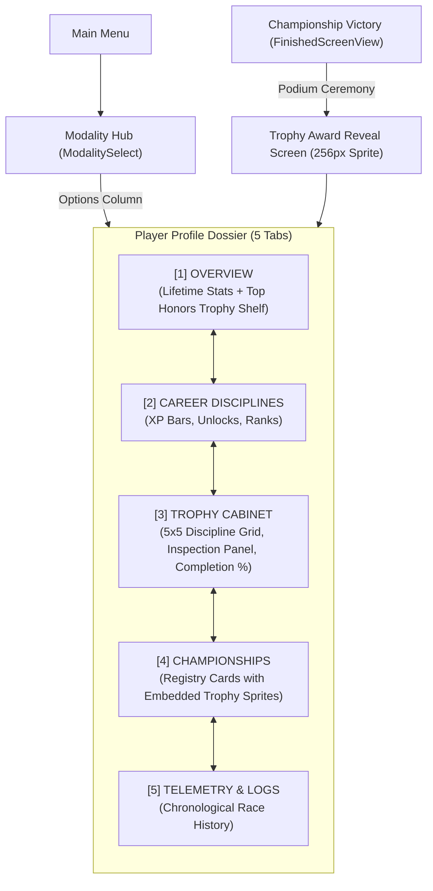

# Feature Spec: Championship Trophy Badges & Player Profile Trophy Cabinet 🏆⭐

A unified vector iconography architecture and player progression display system introducing bespoke championship podium badges (**1st Place Gold**, **2nd Place Silver**, and **3rd Place Bronze**) across all 5 career performance tiers (**Tiers 1–5**, symbolized by $1 \dots 5$ summit stars) and all 5 motorsport disciplines (**GT World Challenge**, **Karting World Cup**, **Rallycross & All-Terrain**, **NASCAR Cup Series**, and **Extreme Off-Road & Stunt**). Furthermore, introduces a dedicated **Trophy Cabinet (`[3] TROPHY CABINET`)** in the **Player Profile (`GameState::ProfileManager`)**, providing an interactive motorsport trophy room with locked silhouettes, telemetry provenance, and podium showcase shelves.

---

## 🎯 Executive Summary & Context

Prior to this specification:
1. Championship finishes in **TdRace** only incremented generic integer counters (`trophies_gold`, `trophies_silver`, `trophies_bronze`) in `ModuleCareerProgress` and `profile_module_progress` without preserving which championship was conquered, the vehicle model driven, points amassed, or the date of victory.
2. In the user interface (`career_hub.rs`, `profile_ui.rs`, and `hall_of_fame.rs`), tournament honors were rendered as plain text or standard Unicode emoji characters (`🏆 GOLD`, `🥈 SILVER`, `🥉 BRONZE`), lacking visual weight, resolution scaling, and motorsport discipline identity.
3. Players had no dedicated space in their profile to inspect their cumulative motorsport collection, admire won silverware, or survey unearned championships across the career ladders.

This specification delivers:
1. **Podium Badges for 1st, 2nd, and 3rd Positions**: Full-featured vector badges rendered in radiant **24K Grand Prix Gold** (1st Place), **Sterling Silver & Chrome** (2nd Place), and **Burnished Bronze & Copper** (3rd Place).
2. **Simplified, Clean Tier Star Representation**: Championship tiers (Tiers 1–5) are indicated uniformly by the number of stars crowning the trophy summit ($1 \dots 5$ stars), establishing an immediately readable visual language.
3. **Bespoke Motorsport Discipline Motifs**: Rather than a generic cup with recolors, each discipline features authentic mechanical, aerodynamic, and cultural elements (GT aero spoilers, Kart rumble curbs & 2-stroke tuned pipes, Rally knobby treads & coilovers, NASCAR high-banked ovals & eagle wings, Extreme Off-Road roll cages & beadlocks).
4. **Player Profile Trophy Cabinet (`[3] TROPHY CABINET`)**: A full-screen motorsport showcase room featuring a $5 \times 5$ discipline-by-tier collection grid, locked carbon silhouettes, inspection panel with historical telemetry provenance, and an Overview shelf.
5. **Persistent Championship Awards Schema (`profile_championship_awards`)**: SQLite storage recording championship ID, discipline, tier, podium standing, points, vehicle driven, and timestamp.

---

## 🗺️ User Flow & Interface Design

### 1. Navigation Flow



---

### 2. Player Profile Trophy Cabinet Wireframe (`[3] TROPHY CABINET`)

```
┌────────────────────────────────────────────────────────────────────────────────────────────────────────┐
│ [FLAG] RACER ONE — "Apex Legend"                              [◄ Q / E ► Switch Driver]  [LIVERY]      │
│ Level 18 Global Driver • 64,800 Lifetime XP • ESP • 14 Trophies Won (9 Gold / 3 Silver / 2 Bronze)     │
├────────────────────────────────────────────────────────────────────────────────────────────────────────┤
│ [1] OVERVIEW  │ [2] CAREER DISCIPLINES │ [3] TROPHY CABINET (ACTIVE) │ [4] CHAMPIONSHIPS │ [5] LOGS    │
├────────────────────────────────────────────────────────────────────────────────────────────────────────┤
│  CABINET COLLECTION: 14/25 EARNED (56%)  •  🏆 9 GOLD  •  🥈 3 SILVER  •  🥉 2 BRONZE                  │
├───────────────────────────────────────────────────────┬────────────────────────────────────────────────┤
│  MOTORSPORT DISCIPLINE GRID (5x5 TIERS)               │  TROPHY INSPECTION & PROVENANCE                │
│                                                       │                                                │
│  DISCIPLINE      T1 (★)  T2 (★★) T3 (★★★) T4(4★) T5(5★)│  ┌──────────────────────────────────────────┐ │
│  ──────────      ──────  ──────  ──────  ──────  ──────│  │                                          │ │
│  GT Challenge    [GOLD]  [GOLD]  [SILV]  [GOLD]  [LOCK]│  │        [ 256px ILLUMINATED SPRITE ]       │ │
│  Karting Cup     [GOLD]  [SILV]  [BRNZ]  [LOCK]  [LOCK]│  │                                          │ │
│  Rallycross      [GOLD]  [GOLD]  [GOLD]  [LOCK]  [LOCK]│  └──────────────────────────────────────────┘ │
│  NASCAR Series   [GOLD]  [BRNZ]  [LOCK]  [LOCK]  [LOCK]│  CHAMPIONSHIP: GT2 Power Masters (Tier 3)     │
│  Extreme Offroad [GOLD]  [LOCK]  [LOCK]  [LOCK]  [LOCK]│  DISCIPLINE:   GT World Challenge             │
│                                                       │  HONOR:        🏆 1ST PLACE [GOLD CHAMPION]   │
│  Navigation: [▲ / ▼] Discipline  •  [◄ / ►] Tier Slot │  POINTS:       118 PTS (3/3 Rounds Won)       │
│  [ENTER] Inspect Full Telemetry  •  [R] Replay Intro  │  CAR MODEL:    Ferrari 296 GT3 (Apex Racing)  │
│  Legend: [GOLD]=1st [SILV]=2nd [BRNZ]=3rd [LOCK]=Lock │  ACHIEVED:     2026-09-22 18:45 • Best: 1:19.4│
└───────────────────────────────────────────────────────┴────────────────────────────────────────────────┘
```

#### Cabinet Display States:
1. **Earned Trophy Slot**:
   - Renders the authentic discipline trophy badge in full color matching the player's highest finish (Gold 1st, Silver 2nd, Bronze 3rd).
   - The tier stars ($1 \dots 5$) on the summit glow brightly with drop-shadow illumination.
   - When focused, a 2.4px neon cyan glass border and radial halo pulse around the card.
2. **Locked Trophy Slot**:
   - Renders a semi-transparent dark carbon-fiber silhouette (`opacity: 0.28`) with an etched golden padlock icon (`🔒`) and dashed border.
   - The inspection panel indicates the unlock condition: *"LOCKED: Compete in and podium at Tier X of this discipline to claim this trophy."*

---

### 3. Secondary Integration Areas

#### A. Overview Tab Showcase Shelf (`[1] OVERVIEW`)
The bottom of the Overview tab replaces plain text counters with a horizontal **"Top Honors Shelf"** rendering the player's 3 highest-tier gold trophies on illuminated stepped pedestals:
```
┌────────────────────────────────────────────────────────────────────────┐
│ 🏆 TOP HONORS SHOWCASE                                [ENTER: Cabinet] │
│                                                                        │
│       ┌──────────────┐      ┌──────────────┐      ┌──────────────┐     │
│       │  [T5 GOLD]   │      │  [T4 GOLD]   │      │  [T3 GOLD]   │     │
│       │ NASCAR Cup   │      │ GT1 Heritage │      │ Group B Rally│     │
│       └──────────────┘      └──────────────┘      └──────────────┘     │
│         ★★★★★ (Apex)           ★★★★ (Tier 4)          ★★★ (Tier 3)     │
└────────────────────────────────────────────────────────────────────────┘
```

#### B. Championship Registry Cards (`[4] CHAMPIONSHIPS`)
In the championship list, replace the text `CHAMPION [GOLD 🏆]` with the actual rendered 64px trophy sprite:
- Positioned on the right side of each tournament card next to the round completion bar.
- Shows the exact earned metal (Gold, Silver, Bronze) and the tier stars.

---

## 🎨 Trophy Badge Visual Design Architecture

### 1. Matrix Dimensions & Composition
Every trophy is authored as an SVG master (`viewBox="0 0 512 512"`) with companion rendered 128×128 and 256×256 RGBA PNGs.

```
Total Trophy Badges = 5 Disciplines × 5 Tiers × 3 Podium Finishes = 75 Unique Sprite Variants
```

### 2. Podium Position Finish System (1st, 2nd, 3rd)

| Finish Position | Metallic Material | Primary Hex Palette | Laurel Leaves & Details | Pedestal Plaque |
| :--- | :--- | :--- | :--- | :--- |
| **1st Place (Gold)** | **24K Grand Prix Gold** | `#FFFDF0`, `#FDE047`, `#EAB308`, `#A16207` | Full imperial Roman laurel wreath framing goblet; golden sunburst reflections. | Polished gold plate with black beveled typography. |
| **2nd Place (Silver)** | **Sterling Silver & Chrome** | `#FFFFFF`, `#E2E8F0`, `#94A3B8`, `#475569` | Sleek silver laurel branch hints; clean cool-slate specular reflections. | Brushed chrome plate with deep navy typography. |
| **3rd Place (Bronze)** | **Burnished Bronze & Copper** | `#FFE8DB`, `#F2B78E`, `#D4824C`, `#642E0E` | Rugged bronze laurel pinstripes; warm copper cast shadows. | Antique copper plate with dark umber typography. |

---

### 3. Tier Star Architecture ($1 \dots 5$ Stars on Summit)

Tiers are depicted simply and directly by the **number of five-pointed victory stars** floating gracefully above the trophy cup summit:

```
Tier 1:  [       ★       ]   (1 Star — Clubman / Grassroots entry)
Tier 2:  [     ★   ★     ]   (2 Stars — Challenger / National level)
Tier 3:  [   ★   ★   ★   ]   (3 Stars — Pro / Continental Masters)
Tier 4:  [ ★   ★   ★   ★ ]   (4 Stars — Premier / International Heritage)
Tier 5:  [   ★★ ★ ★★     ]   (5 Stars — Arched Apex World Championship Crown)
```

- **Star Aesthetics**:
  - Gold finish: Stars rendered in `#FDE047` with `#FFFFFF` inner specular core and amber glow halo.
  - Silver finish: Stars rendered in `#FFFFFF` with `#CBD5E1` core and cyan-tinted halo.
  - Bronze finish: Stars rendered in `#F2B78E` with `#D4824C` core and warm bronze halo.
- **Center Apex Scaling**: In Tier 3, 4, and 5, the center star(s) scale up slightly ($1.15\times$ to $1.35\times$) with subtle lens flare, reinforcing pinnacle status.

---

### 4. Motorsport Discipline Bespoke DNA

Each motorsport module has authentic visual motifs integrated into its shield, handles, stem, and medallion:

```
┌────────────────────────────────────────────────────────────────────────┐
│                        MOTORSPORT DISCIPLINE DNA                       │
├─────────────────┬─────────────────┬──────────────────┬─────────────────┤
│ DISCIPLINE      │ HANDLES         │ STEM / PILLARS   │ SHIELD & ACCENT │
├─────────────────┼─────────────────┼──────────────────┼─────────────────┤
│ GT Challenge    │ Aerodynamic GT  │ Fluted diffuser  │ Checkered weave │
│ (gt)            │ wing endplates  │ with aero rings  │ + GT Cyan wing  │
├─────────────────┼─────────────────┼──────────────────┼─────────────────┤
│ Karting World   │ Tuned 2-stroke  │ 3-spoke kart     │ Alternating red │
│ (kart)          │ exhaust pipes   │ steering wheel   │ / white curbs   │
├─────────────────┼─────────────────┼──────────────────┼─────────────────┤
│ Rallycross      │ Knobby rubber   │ Helical spring   │ Mud roost + twin│
│ (rally)         │ tire treads     │ coilover shock   │ rally stripes   │
├─────────────────┼─────────────────┼──────────────────┼─────────────────┤
│ NASCAR Cup      │ Swept eagle     │ Banked tri-oval  │ Superspeedway   │
│ (nascar)        │ aerodynamic wing│ speedway bowl    │ stars & stripes │
├─────────────────┼─────────────────┼──────────────────┼─────────────────┤
│ Extreme Off-Road│ 4130 roll-cage  │ Dual remote coilo│ Armored plate + │
│ (extreme_offroad│ truss tubing    │ ver reservoirs   │ hazard chevrons │
└─────────────────┴─────────────────┴──────────────────┴─────────────────┘
```

---

## ⚙️ Backend Models & API Endpoints

### 1. SQLite Table: `profile_championship_awards`

In `crates/tdrace-app/src/db/mod.rs`, create the persistent awards ledger:

```sql
CREATE TABLE IF NOT EXISTS profile_championship_awards (
    profile_id INTEGER NOT NULL,
    championship_id TEXT NOT NULL,
    module_id TEXT NOT NULL,
    tier INTEGER NOT NULL,
    position INTEGER NOT NULL, -- 1 = Gold, 2 = Silver, 3 = Bronze
    points INTEGER NOT NULL,
    car_model_id TEXT NOT NULL,
    achieved_at TEXT NOT NULL,
    PRIMARY KEY (profile_id, championship_id),
    FOREIGN KEY(profile_id) REFERENCES player_profiles(id) ON DELETE CASCADE
);

CREATE INDEX IF NOT EXISTS idx_champ_awards_profile 
    ON profile_championship_awards(profile_id, module_id, tier);
```

### 2. Rust Data Structures & API Contracts

In `crates/tdrace-app/src/profile/mod.rs`:

```rust
/// Represents an authentic championship trophy won by a player profile.
#[derive(Debug, Clone, PartialEq, Serialize, Deserialize)]
pub struct ChampionshipAward {
    pub profile_id: i64,
    pub championship_id: String,
    pub module_id: String,
    pub tier: u32,
    pub position: u32, // 1 = Gold, 2 = Silver, 3 = Bronze
    pub points: u32,
    pub car_model_id: String,
    pub achieved_at: String,
}

impl ChampionshipAward {
    /// Returns the trophy metallic tier enum (Gold, Silver, Bronze).
    pub fn metallic_tier(&self) -> TrophyMetal {
        match self.position {
            1 => TrophyMetal::Gold,
            2 => TrophyMetal::Silver,
            3 => TrophyMetal::Bronze,
            _ => TrophyMetal::Bronze,
        }
    }
}

#[derive(Debug, Clone, Copy, PartialEq, Eq, Hash, Serialize, Deserialize)]
pub enum TrophyMetal {
    Gold,
    Silver,
    Bronze,
}

impl TrophyMetal {
    pub fn as_str(&self) -> &'static str {
        match self {
            Self::Gold => "gold",
            Self::Silver => "silver",
            Self::Bronze => "bronze",
        }
    }
}
```

### 3. Record & Upgrade Award Logic

When a championship session completes (`crates/tdrace-app/src/game/mod.rs`):

```rust
if champ.is_completed {
    if let Some(pos) = champ.standings.iter().position(|s| s.driver_id == "player") {
        let finish_pos = (pos + 1) as u32;
        if finish_pos <= 3 {
            let award = ChampionshipAward {
                profile_id: self.active_profile_id,
                championship_id: champ.series.id.clone(),
                module_id: champ.series.module_id.clone(),
                tier: champ.series.tier,
                position: finish_pos,
                points: champ.standings[pos].total_points,
                car_model_id: self.player_car_model_id.clone(),
                achieved_at: chrono::Utc::now().to_rfc3339(),
            };
            
            // Record award: upgrades existing if new finish position is superior
            if let Some(db) = &self.hof_db {
                let _ = db.save_championship_award(&award);
            }
            self.refresh_profile_awards();
        }
    }
}
```

### 4. File Organization
Stored in [`assets/icons/trophies/`](../assets/icons/trophies):

```
assets/icons/trophies/
├── {module}_t{tier}_{metal}.svg          # Master 512x512 vector
├── {module}_t{tier}_{metal}-128.png      # 128x128 RGBA UI sprite
├── {module}_t{tier}_{metal}-256.png      # 256x256 RGBA High-DPI sprite
└── trophy_locked-128.png                 # Frosted silhouette placeholder
```

Examples:
- `gt_t1_gold.svg`, `gt_t1_silver.svg`, `gt_t1_bronze.svg`
- `gt_t2_gold.svg` … `gt_t5_gold.svg`
- `kart_t3_gold.svg`, `kart_t3_silver.svg`, `kart_t3_bronze.svg`
- `rally_t3_gold.svg`, `nascar_t5_diamond.svg`, `extreme_t4_platinum.svg`

---

## 🛡️ Security & Role-Based Access Controls (RBAC)

### 1. SQLite Transaction Isolation & Profile Cascade
- Championship award records in `profile_championship_awards` strictly enforce Foreign Key constraints referencing `player_profiles(id) ON DELETE CASCADE`. Deleting a driver profile automatically purges all associated award silverware without orphaned records.
- All award persistence mutations use SQLite parameterized queries to eliminate any SQL injection vector.

### 2. Immutability & Anti-Tamper Verification
- Award submissions validate championship completion state and verify that the points recorded match verified round finishes stored in the championship session history.
- Trophy textures and SVG assets are compiled into the binary distribution via `include_bytes!` or loaded from read-only package paths, preventing malicious dynamic code execution or external SVG script tag injection.

---

## 🧪 Verification & Acceptance Criteria

### Manual Acceptance Criteria (Pseudo-Gherkin)

### Scenario: Player earns 1st place in a Tier 3 Rallycross championship
- **Given** the player is competing in "rally_group_b_masters" (Tier 3)
- **When** the player completes all scheduled rounds and places 1st in total standings
- **Then** a 1st Place Gold award is registered in "profile_championship_awards"
- **And** the awarded badge has "rally" knobby tire handles and coilover stem
- **And** the badge summit displays exactly 3 victory stars
- **And** the player's lifetime "trophies_gold" count increments by 1

### Scenario: Upgrading an existing championship award
- **Given** the player previously earned a 2nd Place Silver badge in "gt4_clubman_sprint"
- **When** the player re-enters "gt4_clubman_sprint" and finishes 1st
- **Then** the award in "profile_championship_awards" is upgraded from Silver to Gold
- **And** the Trophy Cabinet displays the Gold badge for GT Tier 1
- **And** the winning car model and timestamp are updated to the latest victory

### Scenario: Navigating the Trophy Cabinet in Player Profile
- **Given** the player opens the Player Profile screen
- **When** the player switches to Tab "[3] TROPHY CABINET"
- **Then** a 5x5 grid of motorsport disciplines and tiers is rendered
- **And** earned trophies display their full-color Gold, Silver, or Bronze badges with tier stars
- **And** unearned trophies display a dark carbon locked silhouette with a lock icon
- **And** navigating the cursor to any trophy populates the right-hand Inspection Panel
- **And** the Inspection Panel displays championship title, tier, finish honor, car model, and points

### Scenario: Overview tab Top Honors shelf rendering
- **Given** the player has won 4 Gold trophies across various disciplines and tiers
- **When** the player views Tab "[1] OVERVIEW" of the Player Profile
- **Then** the top 3 highest-tier gold trophies are rendered on illuminated showcase pedestals
- **And** selecting "Open Cabinet" switches the view directly to Tab "[3] TROPHY CABINET"

### Scenario: Championship Registry cards reflect authentic trophy badges
- **Given** the player views Tab "[4] CHAMPIONSHIPS" in Player Profile
- **When** a championship card represents a tournament the player completed on the podium
- **Then** the card renders the authentic 64px trophy badge sprite matching the discipline and tier
- **And** the generic text string "CHAMPION [GOLD 🏆]" is replaced by the visual badge

---

## 🔗 Traceability & Codebase Mapping

### Modified Files & Components
- `[ ]` `assets/icons/trophies/` -> Master vector SVGs and generated 128px / 256px PNGs across 5 disciplines, 5 tiers, and 3 podium positions.
- `[ ]` `crates/tdrace-app/src/db/mod.rs` -> Add `profile_championship_awards` table, migrations, and CRUD operations.
- `[ ]` `crates/tdrace-app/src/profile/mod.rs` -> Add `ChampionshipAward` struct, `TrophyMetal` enum, and profile querying helpers.
- `[ ]` `crates/tdrace-app/src/game/mod.rs` -> Record authentic `ChampionshipAward` upon championship completion and trigger award reveal.
- `[ ]` `crates/tdrace-app/src/ui/profile_ui.rs` -> Introduce Tab `[3] TROPHY CABINET`, Top Honors shelf in Overview tab, and embedded trophy sprites in championship cards.
- `[ ]` `crates/tdrace-app/src/render/trophy_textures.rs` -> Trophy texture decoding and cache manager.
- `[ ]` `specs/index.md` -> Register Spec 027 in specification index table.
- `[ ]` `specs/constitution/ROADMAP.md` -> Link Spec 027 in Phase 5 roadmap.
- `[ ]` `crates/tdrace-app/tests/profile_tests.rs` -> Unit tests for championship award persistence, upgrades, and trophy queries.
