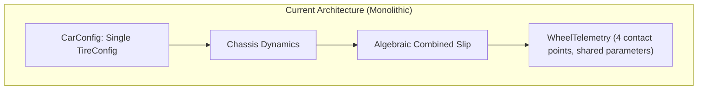
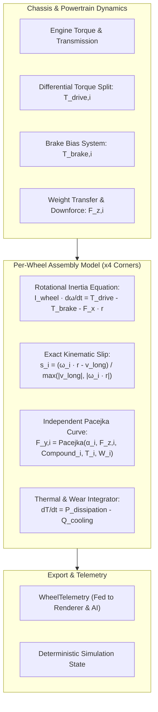

# Architecture Spec: Decoupled Physical Tire Component & Per-Wheel Dynamics 🏎️⚙️🛞

A comprehensive physics architecture specification that decouples tires from monolithic vehicle definitions in **TdRace**. Operating within the pure-Rust [`crates/wheelbase`](../crates/wheelbase) simulation engine, this architecture introduces independent **`WheelAssembly`** components featuring per-wheel rotational inertia ($\omega_i$), dynamic wheel spin and lockup mechanics, per-axle asymmetric/staggered Pacejka curves, thermal grip degradation, and localized contact patch dynamics, while preserving strict headless simulation throughput ($> 85,000\,\text{steps/sec}$) and deterministic invariance.

---

## 🗺️ Current vs. Proposed System Architecture

### 1. Current Architecture (Monolithic Tire & Quasi-Static Slip Model)
In the current `wheelbase` architecture, while contact patches are tracked individually in [`WheelTelemetry`](../crates/wheelbase/src/tire.rs), the physical configuration and slip kinematics are monolithic per chassis:

* **Uniform Tire Configuration:** All 4 wheels share an identical [`TireConfig`](../crates/wheelbase/src/config.rs) struct ($B, C, D, E$ Pacejka parameters, stiffness, and skid thresholds).
* **No Dimension Differentiation:** Front and rear wheels are assumed to possess identical radius and contact patch width. Staggered setups—essential for Porsche 911 GT3 rear bias ($275\text{mm}$ front / $335\text{mm}$ rear), Go-Karts ($10 \times 4.5$ front / $11 \times 7.1$ rear), and Sand Rails (grooved steerers vs paddle scoops)—cannot be represented.
* **Algebraic Slip Ratio Approximation:** Longitudinal slip ratio $s_i$ is approximated algebraically from chassis speed rather than integrating wheel rotational inertia ($I_{\text{wheel}}$). Consequently, individual wheel spinouts (e.g. one driven wheel on oil/ice) and true brake lockups (front wheels freezing under trail-braking while rear wheels roll) cannot occur.
* **Zero Thermal or Degradation Mechanics:** Tire grip is static over time; driving hard over long championship stints causes zero thermal fade or uneven tire wear.



### 2. Proposed Architecture (Decoupled Physical Wheel Assembly & Rotational Inertia)
The proposed architecture introduces a first-class **`WheelAssembly`** component per corner ($i \in \{0, 1, 2, 3\}$ for FL, FR, RL, RR):



1. **Independent Wheel Assembly Configuration (`WheelAssemblyConfig`):**
   * Configurable radius $r_i$, contact width $w_i$, mass $m_i$, and polar moment of inertia $I_i = \frac{1}{2} m_i r_i^2$.
   * Independent front vs. rear Pacejka curve parameters ($B, C, D, E$) allowing soft/medium/hard compound mixing.
2. **True Rotational Dynamic Integration ($\omega_i$):**
   * Integrates angular acceleration $\dot{\omega}_i$ per wheel corner using semi-implicit Euler integration:
     $$I_i \frac{d\omega_i}{dt} = T_{\text{drive}, i} - T_{\text{brake}, i} - F_{x, i} \cdot r_i$$
   * Accurately reproduces standing launch wheelspin, ABS hydraulic pressure pulsing, and front-brake lockups during aggressive corner entry.
3. **Thermal Grip & Wear Dynamics:**
   * Tracks bulk tread surface temperature $T_i$ driven by frictional work dissipation ($P_{\text{diss}} = \lvert F_x s + F_y \alpha \rvert \cdot v$).
   * Dynamic peak grip multiplier: optimal grip window $[80^\circ\text{C} - 105^\circ\text{C}]$, degrading if overheated ($> 125^\circ\text{C}$) or cold ($< 45^\circ\text{C}$).
   * Progressive mechanical tread wear $W_i \in [0.0, 1.0]$.
4. **Visual & Audio Pipeline Decoupling:**
   * Real-time export of $\omega_i$, $s_i$, $\text{is\_locked}_i$, and surface contamination to [`tdrace-app`](../crates/tdrace-app) enables stroboscopic wheel spin blur, lockup tire smoke, and localized roost emission.

---

## 🗄️ Database & Storage Migration Plan

### 1. Data Contract & Serde Compatibility (`crates/wheelbase/src/config.rs`)
To ensure zero breaks across serialized championship configurations, track records, and saved vehicle configs, `CarConfig` retains backward-compatible serde annotations:

```rust
/// Configuration for an individual wheel corner or axle assembly.
#[derive(Debug, Clone, Copy, PartialEq, Serialize, Deserialize)]
pub struct WheelAssemblyConfig {
    /// Rolling radius of the tire under nominal load (meters).
    pub tire_radius: f32,
    /// Width of the tire contact patch (meters).
    pub tire_width: f32,
    /// Rotational polar moment of inertia (kg·m²).
    pub rotational_inertia: f32,
    /// Pacejka Magic Formula compound configuration for this wheel.
    pub tire_model: TireConfig,
    /// Brake torque distribution factor for this wheel [0.0 = none, 1.0 = full].
    pub brake_bias_factor: f32,
    /// Drive torque distribution factor from differential [0.0 = unpowered, 1.0 = spool/locked].
    pub drive_torque_factor: f32,
}

impl Default for WheelAssemblyConfig {
    fn default() -> Self {
        Self {
            tire_radius: 0.32,
            tire_width: 0.24,
            rotational_inertia: 1.25,
            tire_model: TireConfig::default(),
            brake_bias_factor: 0.25, // 25% per wheel = 50% front / 50% rear baseline
            drive_torque_factor: 0.50, // RWD: 50% per rear wheel
        }
    }
}
```

In `CarConfig`:
```rust
pub struct CarConfig {
    // Existing fields: mass, wheelbase, track_width, etc.
    ...
    /// Legacy car-wide tire configuration (retained for backward compatibility).
    pub tire: TireConfig,

    /// Decoupled wheel assembly configurations for all 4 corners [FL, FR, RL, RR].
    /// Defaults to 4 copies of the legacy TireConfig if omitted in older configs.
    #[serde(default = "default_wheel_assemblies")]
    pub wheels: [WheelAssemblyConfig; 4],
}
```

### 2. Zero-Downtime Migration & Invariance Guarantees
* **Old Config Ingestion:** When parsing legacy `.toml` or `.json` files lacking the `wheels` array, the deserializer automatically populates `wheels[0..4]` using the root `tire: TireConfig` and default inertia values, ensuring $100\%$ zero-regression deserialization.
* **Dual-Access Compatibility:** Accessors like `car.config.tire` remain available as aliases to the front-axle configuration.

---

## 🔑 Security, Compliance, & IAM Roles

### 1. Numerical Stability & Integration Clamping
* **Rotational Divergence Prevention:** Wheel rotational velocity $\omega_i$ is clamped to physical bounds ($\lvert\omega_i\rvert \le 550.0\,\text{rad/s}$, equivalent to $> 600\,\text{km/h}$) to prevent floating-point runaway under extreme wall collisions.
* **Division-by-Zero Floor:** Slip ratio calculations enforce a velocity floor:
  $$v_{\text{denom}} = \max\left(\lvert v_{\text{long}}\rvert, \lvert\omega \cdot r\rvert, 0.10\,\text{m/s}\right)$$
  guaranteeing zero `NaN` or `Inf` values at standstill.
* **Sandboxed Determinism:** Physics stepping performs zero dynamic heap allocations, system calls, or network operations, maintaining WebAssembly sandbox compatibility.

### 2. Anti-Cheat & Deterministic Physics Parity
* All wheel state transitions ($\omega_i, T_i, W_i$) are pure functions of `(CarState, CarControls, dt)`.
* Multiplayer network netcode and replay verification can validate identical bit-for-bit trajectories across x86_64, aarch64, and wasm32 targets.

---

## 🛡️ Disaster Recovery, Monitoring, & Fallbacks

### 1. Numerical Instability Recovery
* If numerical oscillation or floating-point corruption occurs in rotational acceleration (e.g. an external physics glitch causing $F_{x, i} \cdot r > 50,000\,\text{N}\cdot\text{m}$), the solver resets wheel rotational velocity to kinematic match:
  $$\omega_i = \frac{v_{\text{long}, i}}{r_i}$$
* The incident is recorded in the simulation health buffer without aborting the race session.

### 2. Thermal Runaway Mitigation
* Tread temperature $T_i$ is clamped to $[0^\circ\text{C}, 200^\circ\text{C}]$.
* Frictional thermal degradation multiplier is clamped to $[0.55, 1.08]$, preventing complete zero-grip lockouts.

---

## 🧪 Verification & Acceptance Criteria

### Automated Tests
- Command to run wheelbase core wheel dynamics suite: `cargo test -p wheelbase tire`
- Command to run headless simulation benchmark: `cargo test -p wheelbase sim`
- Command to run whole-app regression tests: `cargo test -p tdrace-app`

### Acceptance Criteria (Pseudo-Gherkin)

- **Scenario: Staggered tire dimensions on open-wheel kart**
  - [ ] **Given** a `classic_kart` configured with narrow front tires ($r = 0.18\,\text{m}, w = 0.12\,\text{m}$) and wide rear tires ($r = 0.20\,\text{m}, w = 0.21\,\text{m}$)
  - [ ] **When** standing acceleration and maximum lateral cornering tests are executed
  - [ ] **Then** the rear axle must deliver at least $35\%$ more peak lateral force than the front axle under equal normal load
  - [ ] **And** rear wheel rotational inertia must measure larger than front wheel inertia ($I_{\text{rear}} > I_{\text{front}}$)

- **Scenario: Independent front-wheel brake lockup under trail-braking**
  - [ ] **Given** a vehicle traveling at $120\,\text{km/h}$ with a forward brake bias of $65\%$ front / $35\%$ rear
  - [ ] **When** the driver applies $100\%$ service brake while cornering without ABS
  - [ ] **Then** the front-inner wheel rotational velocity must reach zero ($\omega = 0\,\text{rad/s}$) while rear wheels continue rolling ($\omega > 20\,\text{rad/s}$)
  - [ ] **And** the locked front wheel must report $\text{slip\_ratio} = -1.0$ and trigger maximum skid smoke telemetry

- **Scenario: Thermal grip degradation under prolonged power drifting**
  - [ ] **Given** a high-powered GT vehicle executing sustained donut slides on dry asphalt
  - [ ] **When** rear wheel slip energy is sustained for $> 8.0$ simulated seconds
  - [ ] **Then** rear tire surface temperature $T_{\text{rear}}$ must rise above $120^\circ\text{C}$
  - [ ] **And** rear peak lateral grip $D$ must drop by at least $15\%$ relative to nominal operating temperature
  - [ ] **And** the telemetry must record elevated thermal wear rate $W_{\text{rear}}$

- **Scenario: Legacy configuration backward compatibility**
  - [ ] **Given** a legacy `config.toml` file containing only the singular `[car.tire]` section without `[car.wheels]`
  - [ ] **When** the vehicle configuration is loaded by the engine
  - [ ] **Then** the engine must successfully deserialize the car without error
  - [ ] **And** all 4 wheel corners must automatically inherit the singular `TireConfig` parameters

- **Scenario: Headless simulation throughput SLA**
  - [ ] **Given** the headless benchmark harness ([Spec 010](010_surface_car_interaction_simulation.md))
  - [ ] **When** executing 100,000 fixed-timestep simulation steps with decoupled 4-wheel dynamics
  - [ ] **Then** total execution time must not exceed $1,200\,\text{ms}$ (throughput $> 85,000\,\text{steps/sec}$)
  - [ ] **And** zero dynamic heap allocations must occur within the inner stepping loop

---

## 🔗 Traceability & Codebase Mapping

### Created / Modified Files

| Action | Path | Purpose |
| :--- | :--- | :--- |
| `[NEW]` | `specs/028_decoupled_tire_physics_and_wheel_components.md` | Formal architecture specification. |
| `[MODIFY]` | `crates/wheelbase/src/tire.rs` | Implements `WheelAssembly`, rotational torque integration, and thermal wear models. |
| `[MODIFY]` | `crates/wheelbase/src/config.rs` | Adds `WheelAssemblyConfig` and updates `CarConfig` with backward-compatible serde defaults. |
| `[MODIFY]` | `crates/wheelbase/src/car.rs` | Updates `step_per_wheel` to integrate per-wheel rotational velocity $\omega_i$. |
| `[MODIFY]` | `crates/tdrace-core/src/physics/car.rs` | Aligns re-exported core physics wrapper types. |
| `[MODIFY]` | `crates/wheelbase/tests/` | Unit and integration tests for wheel lockups, staggered setups, and thermal fade. |
| `[MODIFY]` | `specs/index.md` | Progressive disclosure catalog registration. |
