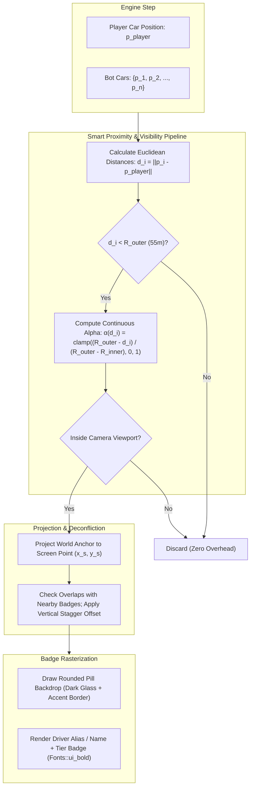

# Feature Spec: Floating Bot Names and Dynamic Proximity Nameplates 🏷️🏎️💨

A comprehensive visual, UI, and input specification introducing **dynamic in-race floating bot nameplates** hovering over opponent vehicles in **TdRace**.

Following the introduction of authentic 72-driver AI character rosters, distinct driving styles, and experience quality tiers (Specs [020](020_driver_favorite_cars_per_discipline_and_tier.md), [023](023_orthogonal_ai_driving_styles_and_quality_tiers.md), and [024](024_crossmodule_ai_character_rosters_and_dynamic_tier_assignment.md)), opponent vehicles currently appear anonymous during active racing. While the player can inspect opponent names in the pre-race Starting Grid and the post-race Results screen, active wheel-to-wheel battles lack immediate diegetic feedback about who the player is drafting, blocking, or overtaking.

This specification introduces high-legibility, arcade-style floating nameplates anchored above AI bot cars with a **smart, simplified approach**:
1. **Viewport-Only Culling**: Only opponent cars currently visible within the active camera screen viewport are rendered.
2. **Strict Maximum 5 Racers Cap**: If more than 5 opponent cars are inside the viewport, only the 5 closest to the player car are shown (never displaying more than 5 names simultaneously).
3. **Distance Priority Sorting**: Visible candidates are sorted by distance to the player car ascending, ensuring the closest active opponents always receive display priority.
4. **Anti-Crowding & Collision Deconfliction**: Dense packs (e.g. grid starts and tight hairpins) dynamically stagger nameplate altitudes to prevent overlapping text illegibility.
5. **Instant Alt Key Toggle**: Players can instantly enable or disable nameplates on demand using the `LeftAlt` or `RightAlt` key with audio feedback and toast notifications, backed by persistent configuration.

---

## 🗺️ User Flow & Interface Design

### 1. In-Race Wheel-to-Wheel Tactical Engagement
During active race states (`GameState::Racing`, `GameState::Countdown`, and `GameState::StartingGrid`):



* **Clear Track ($d > 55\,\text{m}$):** Distant bot cars render cleanly without floating nameplates, preserving pristine track scenery and eliminating screen clutter.
* **Closing In ($25\,\text{m} < d \le 55\,\text{m}$):** As the player approaches an opponent, the bot's nameplate smoothly fades in ($\alpha: 0.0 \to 1.0$), signaling tactical engagement.
* **Wheel-to-Wheel Pack ($d \le 25\,\text{m}$):** In close combat, the nameplate renders at $100\%$ target opacity. If multiple cars are abreast, badges vertically deconflict to ensure all driver names remain legible.
* **Airborne & Jumps:** Nameplate altitude accounts for dynamic vehicle elevation ($z_{\text{elev}}$), floating naturally with the vehicle without clipping into the roof or remaining stuck to the ground plane.

### 2. Nameplate Badge Visual Hierarchy
Each floating nameplate is rendered as an arcade glassmorphism pill badge:

```
┌────────────────────────────────────────────────────────┐
│  [T3]  AXEL VORTEX                   ▲ +0.4s   [#12]   │  <- Championship / Rival Badge
└────────────────────────────────────────────────────────┘
┌──────────────────────────────────────┐
│  [T2]  VORTEX                        │  <- Standard Arcade Casual Badge
└──────────────────────────────────────┘
```

* **Pill Container:** Dark translucent background (`rgba(16, 20, 28, 0.82 * α)`) with $1\,\text{px}$ contrasting border tinted with the car's primary or secondary livery accent color.
* **Tier Indicator (Optional/Compact):** A mini badge displaying driver tier (`T1` through `T5`), color-coded to tier authority (e.g. Bronze T1, Silver T2, Gold T3, Platinum T4, Diamond T5).
* **Driver Name / Alias:** Rendered using embedded `Fonts::ui_bold` (size $\approx 13\,\text{px}$ on screen), utilizing `character.alias` in casual races or `character.name` in Championship mode.
* **Drop Shadow:** Crisp $1\,\text{px}$ drop shadow ensuring contrast against snow, sand, bright asphalt, and tire smoke.

### 3. Keyboard Toggle Interaction (Alt Key)
* **Toggle Input:** Pressing `KeyCode::LeftAlt` or `KeyCode::RightAlt` during gameplay immediately toggles the nameplate overlay state (`on` $\leftrightarrow$ `off`).
* **Audio Cue:** Plays standard UI feedback sound (`SfxType::UiMove`).
* **Visual HUD Toast:** Displays a sleek HUD notification card at screen top-center:
  * `[ALT] BOT NAMEPLATES: ON` (tinted `Palette::NEON_CYAN`)
  * `[ALT] BOT NAMEPLATES: OFF` (tinted `Palette::UI_TEXT_MUTED`)
* **In-World Feedback:** Spawns a lightweight drift-popup style confirmation above the player car: `"[ALT] NAMES: ON"` or `"[ALT] NAMES: OFF"`.
* **Persistence:** The user's preference is saved in `DisplayConfig::bot_nameplates` and restored across game launches.

---

## ⚙️ Backend Models & API Endpoints

### 1. Mathematical Formulation & Proximity Models

#### Distance Metric and Continuous Alpha Falloff
Let $\mathbf{p}_{\text{player}} \in \mathbb{R}^2$ be the 2D world position of the player's vehicle, and $\mathbf{p}_i \in \mathbb{R}^2$ be the position of opponent bot car $i$.

The Euclidean distance between vehicles is:
$$d_i = \|\mathbf{p}_i - \mathbf{p}_{\text{player}}\| = \sqrt{(x_i - x_{\text{player}})^2 + (y_i - y_{\text{player}})^2}$$

The proximity alpha multiplier $\alpha_{\text{prox}}(d_i) \in [0.0, 1.0]$ is computed using a two-threshold piecewise linear envelope:
$$\alpha_{\text{prox}}(d_i) = \begin{cases}
1.0 & \text{if } d_i \le R_{\text{inner}} \\
\dfrac{R_{\text{outer}} - d_i}{R_{\text{outer}} - R_{\text{inner}}} & \text{if } R_{\text{inner}} < d_i < R_{\text{outer}} \\
0.0 & \text{if } d_i \ge R_{\text{outer}}
\end{cases}$$

**Calibration Constants:**
* $R_{\text{inner}} = 25.0\,\text{m}$ (Full opacity boundary, equivalent to $\approx 5$ car lengths)
* $R_{\text{outer}} = 55.0\,\text{m}$ (Zero opacity cutoff boundary, equivalent to $\approx 11$ car lengths)

#### World Anchor and Screen Projection
To guarantee that the nameplate floats above the car roof regardless of vehicle heading $\theta_i$, jump ramps, or camera zoom:

$$\mathbf{p}_{\text{anchor}, i} = \mathbf{p}_i + \begin{pmatrix} 0 \\ h_{\text{clearance}} + z_{\text{elev}, i} \end{pmatrix}$$
where:
* $h_{\text{clearance}} = 2.4\,\text{m}$ ensures the badge floats above standard car chassis height and roof beacons.
* $z_{\text{elev}, i}$ is the vehicle's dynamic jump/ramp elevation.

The world anchor is projected to 2D window screen space $(x_{s, i}, y_{s, i})$ using `camera.world_to_screen_with_viewport()`:
$$\mathbf{s}_i = \mathbf{C}_{\text{camera}}(\mathbf{p}_{\text{anchor}, i})$$

#### Viewport Frustum Culling
Before performing badge dimension measurement or text layout:
$$\text{visible}_i = (x_{\text{min}} - M \le x_{s, i} \le x_{\text{max}} + M) \land (y_{\text{min}} - M \le y_{s, i} \le y_{\text{max}} + M)$$
where $[x_{\text{min}}, x_{\text{max}}] \times [y_{\text{min}}, y_{\text{max}}]$ represents the active viewport bounds and $M = 40.0\,\text{px}$ is a safety margin preventing badge clipping at screen edges.

#### Anti-Crowding Deconfliction (Smart Stacking)
When multiple bot cars cluster tightly, screen positions $\mathbf{s}_i$ and $\mathbf{s}_j$ may collide horizontally:
$$|\Delta x_{ij}| = |x_{s, i} - x_{s, j}| < W_{\text{threshold}} \quad (75.0\,\text{px})$$
$$|\Delta y_{ij}| = |y_{s, i} - y_{s, j}| < H_{\text{threshold}} \quad (24.0\,\text{px})$$

**Resolution Algorithm:**
1. Sort candidate visible badges in ascending order of distance to player ($d_i$). The closer car is given foreground priority.
2. For any subsequent badge $j$ that overlaps with an already-placed badge $i$, elevate $y_{s, j}$ upward by stack offset:
   $$y_{s, j}' = y_{s, j} - H_{\text{stack}} \quad (H_{\text{stack}} = 20.0\,\text{px})$$
3. A maximum of 2 stack levels is allowed; if a third vehicle collides, its alpha is smoothly dimmed to avoid obscuring the primary racing line.

### 2. Rust Data Structures & In-Game Interfaces

#### Visibility Options Extension (`crates/tdrace-app/src/render/marker.rs`)
```rust
/// Runtime toggle flags for player car visibility and HUD driving aids.
#[derive(Debug, Clone, Copy, PartialEq, Eq)]
pub struct PlayerVisibilityOptions {
    pub overhead_chevron: bool,
    pub ground_aura: bool,
    pub adaptive_visibility: bool,
    pub roof_beacon: bool,
    pub curve_helper: bool,
    pub curve_color_scheme: CurveColorScheme,
    /// Option 6: Dynamic in-race floating bot nameplates (toggled via Alt key).
    pub bot_nameplates: bool,
}

impl Default for PlayerVisibilityOptions {
    fn default() -> Self {
        Self {
            overhead_chevron: true,
            ground_aura: true,
            adaptive_visibility: true,
            roof_beacon: true,
            curve_helper: true,
            curve_color_scheme: CurveColorScheme::Traffic,
            bot_nameplates: true,
        }
    }
}
```

#### Nameplate Rendering API
```rust
/// Runtime metadata for an in-race vehicle floating nameplate.
#[derive(Debug, Clone)]
pub struct VehicleNameplateItem<'a> {
    pub car_idx: usize,
    pub name: &'a str,
    pub tier_label: Option<&'a str>,
    pub accent_color: Color,
    pub position: Vec2,
    pub elevation: f32,
    pub distance_to_player: f32,
}

/// Renders floating bot nameplates in screen space using smart proximity and culling.
pub fn render_floating_bot_nameplates(
    fonts: &Fonts,
    camera: &RaceCamera,
    viewport_rect: Option<(f32, f32, f32, f32)>,
    nameplates: &[VehicleNameplateItem],
    master_alpha: f32,
);
```

#### Configuration Schema (`crates/tdrace-app/src/config/mod.rs`)
```rust
#[derive(Debug, Clone, Serialize, Deserialize)]
pub struct DisplayConfig {
    // ... existing display fields ...
    #[serde(default = "default_true")]
    pub bot_nameplates: bool,
}
```

---

## 🛡️ Security & Role-Based Access Controls (RBAC)

### 1. Memory Safety & Allocation Bounds
* **Zero Runtime Heap Allocation in Tight Loop:** Nameplate candidate buffers utilize pre-allocated stack vectors or reusable `Vec<VehicleNameplateItem>` capacity capped at the maximum grid participant count ($\le 24$ vehicles).
* **Glyph Cache Stability:** Driver names originate from statically known driver rosters ([Specs 020/024](024_crossmodule_ai_character_rosters_and_dynamic_tier_assignment.md)) or sanitized profile aliases, containing only printable ASCII/UTF-8 alphanumeric characters. All font glyphs are pre-rasterized by `Fonts::ui_bold`, preventing runtime glyph texture cache thrashing.

### 2. Headless Simulation Decoupling & Thread Isolation
* **Zero Simulation Side Effects:** The entire nameplate pipeline is strictly a client-side presentation overlay. Physics simulation in `crates/wheelbase` and `crates/tdrace-core` has zero knowledge of, or dependency on, nameplate rendering or toggles. Headless simulation benchmarks maintain uninterrupted throughput ($> 4.0\text{M steps/sec}$).
* **Determinism Invariance:** AI decision-making (steering, throttle, braking, tactical aggression) is never influenced by nameplate visibility, proximity culling, or Alt key toggle states.

---

## 🧪 Verification & Acceptance Criteria

### Automated Tests
- Command to run app visibility and rendering tests: `cargo test -p tdrace-app --test visibility_aids_tests`
- Command to run nameplate unit and integration tests: `cargo test -p tdrace-app --test bot_nameplates_tests`
- Command to run headless core suite: `cargo test -p tdrace-core`

### Manual Acceptance Criteria (Pseudo-Gherkin)

- **Scenario: Maximum five visible nameplates limit in viewport**
  - [x] **Given** a race active with 8 opponent bot cars situated within the camera viewport
  - [x] **When** `deconflict_nameplates` processes candidate vehicles
  - [x] **Then** exactly 5 bot nameplates must be rendered
  - [x] **And** the 5 rendered must strictly correspond to the 5 closest vehicles to the player car
  - [x] **And** no more than 5 nameplates are ever rendered simultaneously

- **Scenario: Frustum culling for off-screen opponent cars**
  - [x] **Given** an opponent bot outside the visible screen viewport
  - [x] **When** nameplate screen culling runs
  - [x] **Then** the off-screen bot must be culled before rasterization

- **Scenario: Full opacity within inner proximity zone**
  - [x] **Given** a race active with opponent bot cars on track
  - [x] **When** an opponent bot is within close drafting distance $d = 15\,\text{m} \le R_{\text{inner}}$
  - [x] **Then** the bot's nameplate must be rendered at full configured opacity ($\alpha_{\text{prox}} = 1.0$)
  - [x] **And** the text must match the driver's character alias

- **Scenario: Continuous linear alpha falloff in transition zone**
  - [x] **Given** an opponent bot at distance $d = 40\,\text{m}$ between $R_{\text{inner}} = 25\,\text{m}$ and $R_{\text{outer}} = 55\,\text{m}$
  - [x] **When** `compute_proximity_alpha` is evaluated
  - [x] **Then** the resulting alpha multiplier must be exactly $\frac{55 - 40}{55 - 25} = 0.50 \pm 0.01$
  - [x] **And** the badge backdrop and text opacity must scale proportionally

- **Scenario: Alt key toggles nameplate visibility on and off**
  - [x] **Given** the race session is actively running with `bot_nameplates` enabled (`true`)
  - [x] **When** the user presses `KeyCode::LeftAlt` or `KeyCode::RightAlt`
  - [x] **Then** `visibility_options.bot_nameplates` must toggle to `false`
  - [x] **And** an audio SFX (`SfxType::UiMove`) must play
  - [x] **And** a HUD toast notification `[ALT] BOT NAMEPLATES: OFF` must be registered
  - [x] **When** the user presses Alt a second time
  - [x] **Then** `visibility_options.bot_nameplates` must toggle back to `true`
  - [x] **And** a HUD toast notification `[ALT] BOT NAMEPLATES: ON` must be registered

- **Scenario: Anti-crowding vertical stacking deconfliction**
  - [x] **Given** two opponent bot cars traveling side-by-side whose projected screen badge anchors are within $30\,\text{px}$ horizontally
  - [x] **When** the nameplate rendering pipeline processes the candidates
  - [x] **Then** the car further from the player must have its nameplate vertically nudged upward by $H_{\text{stack}} = 20\,\text{px}$
  - [x] **And** both driver names must remain completely unobstructed without text collision

- **Scenario: Frustum culling for off-screen opponent cars**
  - [x] **Given** an opponent bot within $20\,\text{m}$ of the player but positioned behind the camera outside the visible screen viewport
  - [x] **When** nameplate screen culling runs
  - [x] **Then** the off-screen bot must be culled before rasterization

- **Scenario: Split-screen independent player reference**
  - [x] **Given** a 2-player split screen match
  - [x] **When** nameplates are evaluated for Player 1's viewport
  - [x] **Then** proximity distances must be measured relative to Player 1's car position
  - [x] **And** when evaluated for Player 2's viewport, proximity must be measured relative to Player 2's car position

---

## 🔗 Traceability & Codebase Mapping

### Created / Modified Files

| Action | Path | Purpose |
| :--- | :--- | :--- |
| `[NEW]` | `specs/029_floating_bot_names_and_dynamic_proximity_nameplates.md` | Formal specification contract. |
| `[NEW]` | `crates/tdrace-app/tests/bot_nameplates_tests.rs` | Comprehensive unit and integration test suite for proximity math, alpha scaling, deconfliction, and Alt toggle. |
| `[MODIFY]` | `crates/tdrace-app/src/render/marker.rs` | Implements `VehicleNameplateItem`, `compute_proximity_alpha`, anti-crowding deconfliction, and `render_floating_bot_nameplates`. |
| `[MODIFY]` | `crates/tdrace-app/src/render/mod.rs` | Re-exports nameplate items and renderer. |
| `[MODIFY]` | `crates/tdrace-app/src/game/mod.rs` | Hooks Alt key input toggle, toast notifications, and wires nameplate drawing into the in-race render loop. |
| `[MODIFY]` | `crates/tdrace-app/src/config/mod.rs` | Adds `bot_nameplates` toggle field to `DisplayConfig` with serde default. |
| `[MODIFY]` | `specs/constitution/ROADMAP.md` | Milestone registration under Phase 2. |
| `[MODIFY]` | `specs/index.md` | Progressive disclosure catalog registration. |
