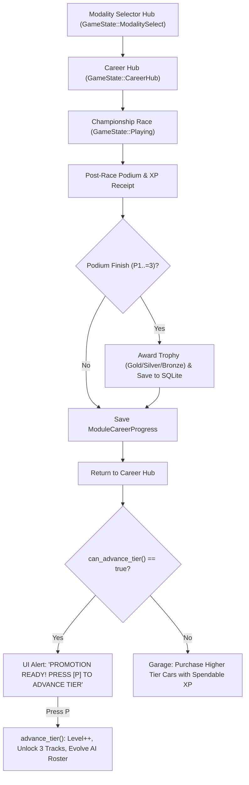

# Feature Spec 030: Career System Wiki Reference and Progression Mechanics 🏆📚

A unified technical specification and public knowledge base documentation suite establishing the formal reference for **TdRace**'s 5-tier career progression architecture. Published to the **Astro Starlight Engineering Reference Portal** (`portals/option-a-starlight`) under the OKF v0.2 Knowledge Graph (`docs/career/index.md`), this document codifies tournament scoring models, mathematical XP award formulas, tier promotion criteria, vehicle acquisition economics, discipline starter cars, circuit calendars, and dynamic AI roster evolution.

---

## 🎯 Executive Summary & Context

Prior to this specification, career progression rules, scoring systems, and tier advancement gates were implemented across Rust engine modules ([`profile`](../crates/tdrace-app/src/profile/mod.rs), [`series`](../crates/tdrace-app/src/series/mod.rs), and [`game`](../crates/tdrace-app/src/game/mod.rs)) and scattered across individual modality specs (`001`, `002`, `003`, `004`, `013`, `017`, `020`, `024`, `027`). However, the central technical wiki portal ([`docs/`](../docs/index.md)) lacked a dedicated, exhaustive reference for developers and players detailing how points are earned, how tiers are unlocked, and how vehicles are acquired.

This specification:
1. **Establishes Single Source of Truth**: Documents all career mechanics in an OKF v0.2-compliant document (`docs/career/index.md`).
2. **Standardizes Scoring Systems**: Codifies FIA Standard, MotoGP, Classic Arcade, and NASCAR Cup championship points formulas.
3. **Formalizes XP Economy**: Details distance-based lap XP, race completion bonuses, and first-time exploration incentives.
4. **Documents Tier Promotion Gates**: Details the strict two-condition advancement gate (Championship Podium + Spendable XP Target) and promotion mechanics.
5. **Catalogs Vehicle Acquisition**: Formulates car pricing ($1,000 \times \text{tier}\,\text{XP}$), free starter vehicles, and wallet transactions.
6. **Integrates with Astro Starlight Portal**: Adds a dedicated "Career & Progression" sidebar navigation item and updates the Master Knowledge Graph index (`docs/index.md`).

---

## 🗺️ User Flow & Interface Design

### 1. In-Game Career Navigation Flow
In the game application, drivers interact with the career progression lifecycle across three primary UI state machines:



### 2. Documentation Portal User Flow
On the web technical reference portal (`portals/option-a-starlight`):
- **Entry Route**: `/career/` (rendered from `docs/career/index.md`).
- **Sidebar Integration**: Displayed in Starlight navigation between *Vehicle Rosters* and *Circuit Directory*.
- **Search Integration**: Fully indexed by Pagefind with direct queries for `points`, `tier`, `XP`, `starter cars`, and `promotion`.

---

## ⚙️ Backend Models & API Endpoints

### 1. Rust Domain Models & Database Schemas

#### A. Persistent Career Progress Schema (`profile_module_progress` SQLite table)
Stored and queried via `HallOfFameDb` in `crates/tdrace-app/src/db/mod.rs`:

```rust
pub struct ModuleCareerProgress {
    pub profile_id: i64,
    pub module_id: String,           // "gt", "nascar", "rally", "kart", "extreme_offroad"
    pub xp: u64,                     // Spendable wallet balance
    pub lifetime_xp: u64,            // Cumulative career experience points
    pub level: u32,                  // Current tier (1..=5)
    pub unlocked_cars: Vec<String>,
    pub unlocked_tracks: Vec<String>,
    pub visited_tracks: Vec<String>,
    pub completed_events: Vec<String>,
    pub trophies_gold: u32,
    pub trophies_silver: u32,
    pub trophies_bronze: u32,
    pub career_rivals: Vec<CareerRivalEntry>,
    pub active_championship: Option<ChampionshipSession>,
}
```

#### B. Championship Scoring Matrix (`PointSystem` in `crates/tdrace-app/src/series/mod.rs`)

```rust
pub enum PointSystem {
    FiaStandard { fastest_lap_bonus: bool },
    MotoGp,
    ClassicArcade,
    NascarCup { stage_win_bonus: bool },
    Custom(Vec<u32>),
}
```

### 2. Core Progression Formulas

1. **Vehicle Purchasing Cost**:
   $$\text{car\_cost}(\text{tier}) = \text{tier} \times 1,000\,\text{XP}$$
2. **First-Time Circuit Exploration Bonus**:
   $$\text{first\_time\_bonus}(\text{tier}) = \text{round\_to\_10}(\text{tier} \times 250\,\text{XP})$$
3. **Metric Distance-Based Lap XP**:
   $$\text{per\_lap\_xp} = \text{round\_to\_10}\left(\frac{\text{track\_length\_in\_meters}}{10.0}\right)$$
4. **Promotion Eligibility Condition**:
   $$\text{can\_advance\_tier} = (\text{trophies\_gold} + \text{trophies\_silver} + \text{trophies\_bronze} > 0) \;\land\; (\text{xp} \ge \text{car\_cost}(\text{level} + 1))$$

---

## 🛡️ Security & Role-Based Access Controls (RBAC)

### 1. Client Sandboxing & Static Portal Delivery
- The documentation wiki is deployed as a 100% pre-rendered static site via Astro Starlight with zero server-side attack surface or dynamic code execution.
- Mathematical equations render via KaTeX compile-time plugins (`remark-math` and `rehype-katex`), eliminating runtime eval risks.

### 2. In-Game Career Integrity & Developer Mode Gating
- Progression state is validated locally against SQLite constraints (`profile_id` foreign keys, non-null integers).
- **Anti-Cheat Lap Verification**: Checkpoint trackers require passing $\ge 70\%$ of sequential checkpoints before registering valid laps or XP awards.
- **Developer Mode Bypass (`--dev`)**: Allows developers to test higher-tier vehicles and circuits without modifying persistent career balances.

---

## 🧪 Verification & Acceptance Criteria

### Automated Tests
- `keel validate`: Validates OKF v0.2 frontmatter, link integrity, and Pseudo-Gherkin criteria.
- `keel doctor`: Confirms workspace diagnostics and tracker synchronization.
- `bun run build` (in `portals/option-a-starlight`): Compiles static documentation portal with zero errors.
- `cargo test -p tdrace-app --test profile_tests`: Verifies all career progression tests pass.

### Manual Acceptance Criteria (Pseudo-Gherkin)

- **Scenario: Wiki documentation portal builds successfully with Career section**
  - [x] **Given** the technical reference portal configuration in `portals/option-a-starlight/astro.config.mjs`
  - [x] **When** building the portal with `bun run build`
  - [x] **Then** the build completes with exit code 0 and outputs static route `/career/index.html`
  - [x] **And** Pagefind search indexes the Career & Progression documentation

- **Scenario: Progression formulas match codebase implementation**
  - [x] **Given** the career reference documentation in `docs/career/index.md`
  - [x] **When** reviewing the points, XP, and car cost formulas
  - [x] **Then** the car cost formula is explicitly specified as $1,000 \times \text{tier}\,\text{XP}$
  - [x] **And** the first-time exploration bonus formula is explicitly specified as $\text{round\_to\_10}(\text{tier} \times 250\,\text{XP})$
  - [x] **And** the dual tier advancement conditions require at least 1 podium and sufficient spendable XP

- **Scenario: Circuit unlock schedules match sync_unlocks_for_level**
  - [x] **Given** the circuit directory tables across GT, NASCAR, Rally, Kart, and Extreme Off-Road
  - [x] **When** cross-referenced with `ModuleCareerProgress::sync_unlocks_for_level`
  - [x] **Then** all 5 starter circuits and 12 tier-unlocked circuits per discipline are accurately catalogued

---

## 🔗 Traceability & Codebase Mapping

### Created/Modified Files
- `[x]` `specs/030_career_system_wiki_reference_and_progression_mechanics.md` -> Formal Keel specification.
- `[x]` `specs/constitution/ROADMAP.md` -> Registered under Phase 5 roadmap.
- `[x]` `specs/index.md` -> Synchronized progressive disclosure index.
- `[ ]` `docs/career/index.md` -> Canonical OKF v0.2 Career & Progression reference guide.
- `[ ]` `docs/index.md` -> Master Knowledge Graph index linking career reference.
- `[ ]` `portals/option-a-starlight/astro.config.mjs` -> Sidebar configuration for Career section.
