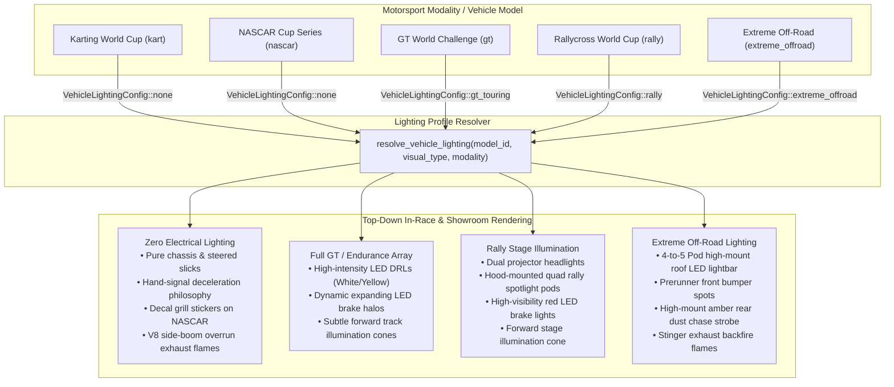

# Feature Spec: Modality-Realistic Vehicle Lighting Architecture 🏎️💡🏁

A comprehensive rendering, asset configuration, and visual realism specification that introduces **Modality-Governed Vehicle Lighting** in **TdRace**.

Currently, the engine's top-down rendering pipeline unconditionally invokes `render_car_lights(...)` across all vehicles, drawing modern projector LED headlights and glowing red brake lights uniformly—even on open-cockpit sprint go-karts and NASCAR stock cars. In real motorsport, lighting configurations diverge radically by discipline: sprint karts and stock cars possess zero electrical road illumination, while GT endurance and rally machinery rely on intense projector arrays, auxiliary spotlight pods, and high-visibility brake halos. Furthermore, extreme off-road trophy trucks and sand rails utilize multi-pod rooftop LED lightbars and high-mount amber dust chase strobes for zero-visibility desert and blizzard competition.

This specification establishes a declarative `VehicleLightingConfig` architecture, resolves lighting rules per motorsport modality, eliminates unauthentic lights from karts and stock cars, implements full projector and auxiliary beam illumination for GT and rally, and equips extreme all-terrain vehicles with authentic rooftop lightbars and rear dust safety lighting.

---

## 🗺️ User Flow & Interface Design

### 1. In-Race Cenital (Top-Down) Dynamic Lighting Feedback
In cenital (top-down / bird's-eye) racing view, vehicle lighting transforms from a generic copy-pasted overlay into an authentic reflection of motorsport rules:



* **Karting World Cup (`kart`):**
  * When driving the `classic_kart`, 125cc shifter karts, or racing mowers, vehicles appear completely authentic: bare tubular chassis, exposed front slicks with dynamic Ackermann steering, driver helmet/torso, and side pods.
  * No artificial white projector discs on the front nosecone; no red circles on the rear axle.
  * Night races (such as Lonato or Bahrain Karting Circuit) rely entirely on high-output trackside floodlights.
* **NASCAR Cup & Trans-Am TA1 (`nascar`):**
  * Stock cars render with authentic sheetmetal / carbon composite bodies, sponsor plates, and aero spoilers. Front headlights are visual graphic decals/stickers baked into the livery texture, not active electrical light emitters.
  * Braking does not illuminate rear red light circles (matching authentic stock car short-track and superspeedway rules).
  * Deceleration and high-speed throttle liftoff trigger the 850 BHP V8 boom-tube exhaust overrun flame licking out from the right side sill, maintaining authentic mechanical spectacle.
* **GT World Challenge & Endurance (`gt`):**
  * Front projector headlights and Daytime Running Lights (DRLs) stay permanently illuminated throughout the race, casting a subtle soft-white forward ambient cone on the asphalt.
  * Taillights glow with a deep ruby running ring, flashing into high-luminance red discs with a surrounding alpha bloom halo upon braking (`is_braking = true`).
* **Rallycross & All-Terrain (`rally`):**
  * Hatchback and coupe bodies feature dual high-output headlights plus a front hood/grill quad-pod spotlight bar for twilight and dark forest stages.
  * Rear high-mount brake lights flash sharply when braking into hairpins and gravel slides.
* **Extreme Off-Road & Stunt Arenas (`extreme_offroad`):**
  * Sand rail buggies, Trophy Trucks, and Mud Swampers feature high-intensity rooftop LED lightbars (4 to 5 pods emitting warm-white illumination cores with ambient bloom).
  * Rear roll-cage stanchions feature an authentic high-mount amber/red dust chase light, ensuring trailing competitors can track vehicles through dense dust plumes and snow roost.

### 2. Garage & Showroom Presentation
* In the Showroom and Vehicle Inspection screen, vehicle lighting reflects its track state:
  * GT and Rally vehicles display active DRLs and headlight lenses under the studio spotlight.
  * Karts and NASCAR vehicles display their clean aero surfaces and sticker decals without artificial illuminated halos.
  * Extreme Off-Road vehicles display their distinctive roof-mounted lightbars with individual brushed aluminum pod casings.

---

## 🧭 Motorsport Philosophy & Physical Matrix

| Modality / Category | Real-World Motorsport Precedent | Headlights / DRL | Brake / Taillights | Auxiliary Roof / Hood Pods | Rear Dust / Safety Light | Track Light Cone |
| :--- | :--- | :---: | :---: | :---: | :---: | :---: |
| **Karting (`kart`)** | CIK-FIA / Superkart: No alternator/battery, stripped down, daylight/floodlit tracks. Hand signals for braking. | ❌ None | ❌ None | ❌ None | ❌ None | ❌ None |
| **NASCAR (`nascar`)** | NASCAR Cup / TA1: Headlights are vinyl decals/stickers; tracks fully floodlit; no brake lights in dry races. | ❌ None (Decal only) | ❌ None | ❌ None | ❌ None | ❌ None |
| **GT / Touring (`gt`)** | FIA GT3 / SRO / IMSA / WEC: 24h endurance, DRLs mandatory, high-intensity LED projectors, high-beam flashing. | ✔️ Projector LED (White/Yellow) | ✔️ Dynamic Bloom LED | ❌ None | ❌ None | ✔️ Forward Cone ($12^\circ$, $14\,\text{m}$) |
| **Rally (`rally`)** | WRC / World RX: Mixed surface, twilight gravel stages, hood-mounted auxiliary night light pods. | ✔️ Projector LED | ✔️ Dynamic Bloom LED | ✔️ Quad Hood Pods | ❌ None | ✔️ Forward Cone ($18^\circ$, $16\,\text{m}$) |
| **Extreme Off-Road (`extreme_offroad`)** | Baja 1000 / Dakar / Ultra4: Pitch-black desert, dust storms, SCORE-mandated amber rear chase lights, rooftop lightbars. | ✔️ Prerunner Spots | ✔️ Dynamic Bloom LED | ✔️ 4-Pod Roof Lightbar | ✔️ Amber Dust Chase Strobe | ✔️ Wide Flood Cone ($28^\circ$, $18\,\text{m}$) |

---

## ⚙️ Backend Models & API Endpoints

### 1. Data Model: `VehicleLightingConfig`
Defined in `crates/tdrace-app/src/render/lighting.rs`:

```rust
use macroquad::color::Color;
use serde::{Deserialize, Serialize};

/// Lighting configuration and emitter profile for a vehicle model or archetype.
#[derive(Debug, Clone, Copy, PartialEq, Serialize, Deserialize)]
pub struct VehicleLightingConfig {
    /// Enables front projector headlights / daytime running lights (DRL).
    pub has_headlights: bool,
    /// Enables functional rear red taillights and reactive brake lights.
    pub has_brake_lights: bool,
    /// Enables high-intensity 4-to-5 pod roof-mounted off-road lightbar.
    pub has_roof_lightbar: bool,
    /// Enables hood-mounted auxiliary rally spotlight pods.
    pub has_rally_pods: bool,
    /// Enables high-mount rear amber dust chase strobe for off-road/desert racing.
    pub has_dust_chase_light: bool,
    /// Core color of the front headlights (e.g. Pure White for GT3, Selective Yellow for GTE/LMGT3).
    pub headlight_color: Color,
    /// Enables forward track surface light cone projection onto the 2D racing surface.
    pub project_track_beams: bool,
    /// Angular beam spread half-angle in radians (e.g. 0.15 rad for GT, 0.28 rad for Off-Road).
    pub beam_spread_rad: f32,
    /// Forward reach of the illuminated track cone in world meters (e.g. 10.0m - 18.0m).
    pub beam_range_m: f32,
}

impl Default for VehicleLightingConfig {
    fn default() -> Self {
        Self::gt_touring()
    }
}

impl VehicleLightingConfig {
    /// Zero electrical lighting: used for Karts and NASCAR Cup stock cars.
    pub const fn none() -> Self {
        Self {
            has_headlights: false,
            has_brake_lights: false,
            has_roof_lightbar: false,
            has_rally_pods: false,
            has_dust_chase_light: false,
            headlight_color: Color::new(1.0, 1.0, 1.0, 0.0),
            project_track_beams: false,
            beam_spread_rad: 0.0,
            beam_range_m: 0.0,
        }
    }

    /// Full GT3 / Touring car lighting: high-intensity LED projectors, DRL, responsive brake lights.
    pub fn gt_touring() -> Self {
        Self {
            has_headlights: true,
            has_brake_lights: true,
            has_roof_lightbar: false,
            has_rally_pods: false,
            has_dust_chase_light: false,
            headlight_color: Color::new(0.95, 0.98, 1.0, 0.95),
            project_track_beams: true,
            beam_spread_rad: 0.18,
            beam_range_m: 14.0,
        }
    }

    /// WRC / Rallycross lighting: headlights, reactive brake lights, hood light pods, forward beam.
    pub fn rally() -> Self {
        Self {
            has_headlights: true,
            has_brake_lights: true,
            has_roof_lightbar: false,
            has_rally_pods: true,
            has_dust_chase_light: false,
            headlight_color: Color::new(1.0, 0.98, 0.90, 0.95),
            project_track_beams: true,
            beam_spread_rad: 0.24,
            beam_range_m: 16.0,
        }
    }

    /// Extreme Off-Road lighting: roof lightbar, prerunner spots, brake lights, rear dust chase light.
    pub fn extreme_offroad() -> Self {
        Self {
            has_headlights: true,
            has_brake_lights: true,
            has_roof_lightbar: true,
            has_rally_pods: false,
            has_dust_chase_light: true,
            headlight_color: Color::new(1.0, 0.95, 0.82, 0.98),
            project_track_beams: true,
            beam_spread_rad: 0.32,
            beam_range_m: 18.0,
        }
    }
}
```

### 2. Resolution Function & Internal API
In `crates/tdrace-app/src/render/lighting.rs`:

```rust
use crate::module::VehicleVisualType;

/// Resolves the effective lighting configuration for any vehicle based on model ID, visual type, and modality.
pub fn resolve_vehicle_lighting(
    model_id: Option<&str>,
    visual_type: VehicleVisualType,
) -> VehicleLightingConfig {
    // 1. Model ID prefix resolution
    if let Some(m_id) = model_id {
        if m_id.starts_with("kart") || m_id.starts_with("classic_kart") {
            return VehicleLightingConfig::none();
        }
        if m_id.starts_with("nascar") || m_id.starts_with("classic_nascar") {
            return VehicleLightingConfig::none();
        }
        if m_id.starts_with("rally") || m_id.starts_with("classic_rally") {
            return VehicleLightingConfig::rally();
        }
        if m_id.starts_with("offroad") || m_id.starts_with("classic_offroad") || m_id.contains("baja") || m_id.contains("sand_rail") {
            return VehicleLightingConfig::extreme_offroad();
        }
        if m_id.starts_with("gt") || m_id.starts_with("classic_gt") {
            return VehicleLightingConfig::gt_touring();
        }
    }

    // 2. Procedural archetype fallback
    match visual_type {
        VehicleVisualType::GoKart { .. } => VehicleLightingConfig::none(),
        VehicleVisualType::StockCar { .. } => VehicleLightingConfig::none(),
        VehicleVisualType::OpenWheel { .. } => VehicleLightingConfig::none(),
        VehicleVisualType::RallyHatch { .. } => VehicleLightingConfig::rally(),
        VehicleVisualType::SandRail { .. } => VehicleLightingConfig::extreme_offroad(),
        VehicleVisualType::TouringGT { .. } => VehicleLightingConfig::gt_touring(),
    }
}
```

### 3. Rendering Pipeline Integration: `render_car_lights`
In `crates/tdrace-app/src/render/car.rs`:

```rust
/// Renders vehicle lighting based on the resolved modality lighting profile.
pub fn render_car_lights(
    pos: Vec2,
    fwd: Vec2,
    right: Vec2,
    half_len: f32,
    half_w: f32,
    is_braking: bool,
    cfg: &VehicleLightingConfig,
) {
    // 1. Forward Track Illumination Cone
    if cfg.project_track_beams {
        render_headlight_track_beams(pos, fwd, right, half_len, half_w, cfg);
    }

    // 2. Projector LED Headlights
    if cfg.has_headlights {
        let light_w = half_w * 0.55;
        let head_l = pos + fwd * (half_len - 0.05) - right * light_w;
        let head_r = pos + fwd * (half_len - 0.05) + right * light_w;

        let glow_col = Color::new(cfg.headlight_color.r, cfg.headlight_color.g, cfg.headlight_color.b, 0.35);
        draw_circle(head_l.x, head_l.y, 0.20, glow_col);
        draw_circle(head_r.x, head_r.y, 0.20, glow_col);
        draw_circle(head_l.x, head_l.y, 0.12, Color::new(1.0, 1.0, 1.0, 0.95));
        draw_circle(head_r.x, head_r.y, 0.12, Color::new(1.0, 1.0, 1.0, 0.95));
    }

    // 3. Auxiliary Rally Hood Spotlight Pods
    if cfg.has_rally_pods {
        render_rally_hood_pods(pos, fwd, right, half_len, half_w);
    }

    // 4. Tail / LED Brake Lights
    if cfg.has_brake_lights {
        let tail_l = pos - fwd * (half_len - 0.05) - right * (half_w * 0.65);
        let tail_r = pos - fwd * (half_len - 0.05) + right * (half_w * 0.65);

        if is_braking {
            draw_circle(tail_l.x, tail_l.y, 0.28, Color::new(1.0, 0.15, 0.15, 0.45));
            draw_circle(tail_r.x, tail_r.y, 0.28, Color::new(1.0, 0.15, 0.15, 0.45));
            draw_circle(tail_l.x, tail_l.y, 0.18, Color::new(1.0, 0.20, 0.20, 1.0));
            draw_circle(tail_r.x, tail_r.y, 0.18, Color::new(1.0, 0.20, 0.20, 1.0));
        } else {
            draw_circle(tail_l.x, tail_l.y, 0.11, Color::new(0.60, 0.08, 0.08, 0.85));
            draw_circle(tail_r.x, tail_r.y, 0.11, Color::new(0.60, 0.08, 0.08, 0.85));
        }
    }

    // 5. High-Mount Amber Dust Chase Strobe (SCORE / Baja Off-Road)
    if cfg.has_dust_chase_light {
        let chase_pos = pos - fwd * (half_len * 0.60);
        let strobe_alpha = 0.85 + (pos.x * 20.0 + pos.y * 20.0).sin().abs() * 0.15;
        draw_circle(chase_pos.x, chase_pos.y, 0.12, Color::new(1.0, 0.65, 0.0, strobe_alpha * 0.40));
        draw_circle(chase_pos.x, chase_pos.y, 0.07, Color::new(1.0, 0.75, 0.1, strobe_alpha));
    }
}
```

---

## 🛡️ Security & Role-Based Access Controls (RBAC)

### 1. Memory Safety & Texture Allocation Guardrails
* All lighting math operates on pure floating-point primitives (`Vec2`, `f32`, `Color`) without heap allocations in the inner rendering loop.
* Geometry calculations use deterministic, clamped trigonometric offsets to prevent NaN propagation or out-of-bounds rendering spikes during physics anomalies.

### 2. Headless Simulation Invariance & Multi-Tier Sandbox
* Headless execution (`tdrace-core`, `wheelbase`) is strictly decoupled from `macroquad` rendering contexts. `VehicleLightingConfig` resides exclusively in the client-side presentation layer.
* Server-side tournament verification, headless benchmarks, and AI model evaluation run at $\ge 4.0\,\text{M steps/sec}$ without graphics dependencies.

---

## 🎛️ Performance, Memory & Headless Invariance

1. **Primitive Count & GPU Cost:**
   * **Karts & NASCAR:** Eliminates 8 circle draw calls per vehicle (4 headlight circles + 4 brake light circles). For an 8-car kart or NASCAR race, this eliminates 64 draw calls per frame, improving rendering throughput.
   * **GT / Rally / Off-Road:** Light cones add 4 triangles (2 quads) per vehicle when enabled. Combined batching under `macroquad` results in $< 0.03\,\text{ms}$ GPU overhead at $1080\text{p} @ 60\,\text{FPS}$.
2. **Headless Simulation Invariance:**
   * Physics execution in `crates/wheelbase` and `crates/tdrace-core` contains zero lighting or color logic.
   * Simulation benchmark speeds remain invariant at $\ge 4.0\,\text{M steps/sec}$.

---

## 🧪 Verification & Acceptance Criteria

### Automated Tests
- Command to run app rendering and asset tests: `cargo test -p tdrace-app --test render_tests`
- Command to run lighting unit tests: `cargo test -p tdrace-app test_vehicle_lighting`
- Command to run headless physics benchmark: `cargo test -p wheelbase`

### Acceptance Criteria (Pseudo-Gherkin)

- **Scenario: Kart vehicles render zero electrical lights**
  - [x] **Given** an active race session featuring vehicle model `"classic_kart"` or category `"kart"`
  - [x] **When** top-down car rendering is evaluated during full acceleration or heavy braking
  - [x] **Then** the engine must not draw front headlight circles or glow halos
  - [x] **And** the engine must not draw rear taillight or brake light circles
  - [x] **And** the vehicle must display only its chassis, exposed driver, and steered wheels

- **Scenario: NASCAR stock cars render zero electrical headlights or brake lights**
  - [x] **Given** an active race session featuring vehicle model `"nascar_cup_chevrolet_camaro"` or category `"nascar"`
  - [x] **When** top-down vehicle rendering is evaluated during high speed and braking into an oval corner
  - [x] **Then** no front projector headlight discs or glow halos must be drawn on the front nose
  - [x] **And** no rear red brake light circles must be drawn on the rear bumper
  - [x] **And** front headlights must remain purely cosmetic decals baked into the livery texture

- **Scenario: NASCAR side exhaust overrun combustion flames remain active**
  - [x] **Given** a NASCAR vehicle decelerating with $\text{acceleration\_local.x} < -0.6$ and $\text{speed} > 5.0\,\text{m/s}$
  - [x] **When** `render_stock_car_body` executes
  - [x] **Then** the boom-tube side exhaust flame plume and sparks must continue to render on the right sill
  - [x] **And** mechanical flames must not be suppressed by the electrical lighting config

- **Scenario: GT vehicles render high-intensity headlights and dynamic brake lights**
  - [x] **Given** a GT vehicle model (e.g. `"gt_porsche_911_gt3r"`) in race mode
  - [x] **When** vehicle cruising with `is_braking = false`
  - [x] **Then** dual white projector headlights must be drawn with core and outer glow
  - [x] **And** dual rear red taillights must render at cruising intensity ($R=0.60, A=0.85$)
  - [x] **When** the driver applies brakes (`is_braking = true`)
  - [x] **Then** the rear brake lights must expand in radius and render with bright red bloom halo ($A=0.45$) and intense red core ($A=1.0$)

- **Scenario: Rally vehicles render auxiliary hood spotlight pods**
  - [x] **Given** a rallycross vehicle model (e.g. `"rally_peugeot_208_rally4"`) or `VehicleVisualType::RallyHatch`
  - [x] **When** `render_car_lights` executes with `VehicleLightingConfig::rally()`
  - [x] **Then** dual headlights and rear brake lights must be rendered
  - [x] **And** hood-mounted auxiliary quad spotlight pods must be drawn on the front fascia

- **Scenario: Extreme Off-Road vehicles render roof lightbar and rear dust chase light**
  - [x] **Given** an extreme off-road vehicle (e.g. `"classic_offroad"` or `VehicleVisualType::SandRail`)
  - [x] **When** top-down vehicle rendering executes
  - [x] **Then** the 4-pod rooftop LED lightbar must render with warm bloom
  - [x] **And** the high-mount rear amber dust chase strobe must be rendered along the rear roll cage

- **Scenario: Forward track light beam projection for GT, Rally, and Off-Road**
  - [x] **Given** a vehicle with `project_track_beams: true`
  - [x] **When** the vehicle moves across the track
  - [x] **Then** semi-transparent forward light cones must be projected onto the ground plane along the forward vector
  - [x] **And** light cones must be disabled when `project_track_beams: false` (Karts and NASCAR)

---

## 🔗 Traceability & Codebase Mapping

### Created / Modified Files

| Action | Path | Purpose |
| :--- | :--- | :--- |
| `[NEW]` | `specs/031_modality_realistic_vehicle_lighting.md` | Formal specification contract. |
| `[NEW]` | `crates/tdrace-app/src/render/lighting.rs` | Defines `VehicleLightingConfig`, preset constructors, and track beam math. |
| `[MODIFY]` | `crates/tdrace-app/src/render/mod.rs` | Exports `lighting` module. |
| `[MODIFY]` | `crates/tdrace-app/src/render/car.rs` | Refactors `render_car_lights` to accept `VehicleLightingConfig`, wires lighting config into `render_vehicle_topdown_sprite` and procedural archetypes. |
| `[MODIFY]` | `crates/tdrace-app/src/module/mod.rs` | Adds optional `lighting_config` field and category-level default resolution. |
| `[MODIFY]` | `crates/tdrace-app/tests/render_tests.rs` | Unit and integration test assertions for modality-specific lighting activation and suppression. |
| `[MODIFY]` | `specs/constitution/ROADMAP.md` | Registers milestone checklist item. |
| `[MODIFY]` | `specs/index.md` | Progressive disclosure catalog registration. |
