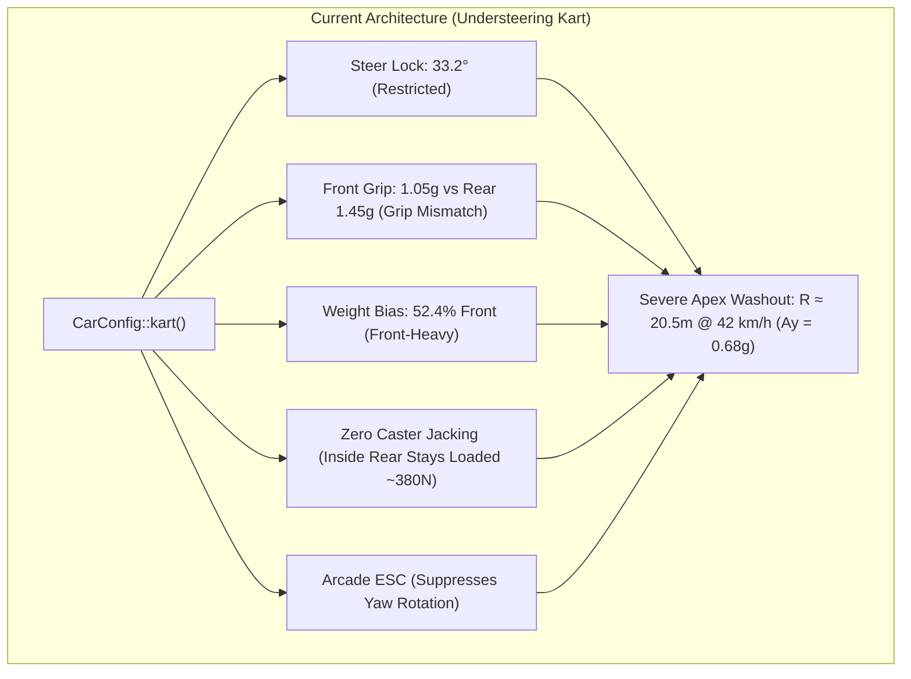
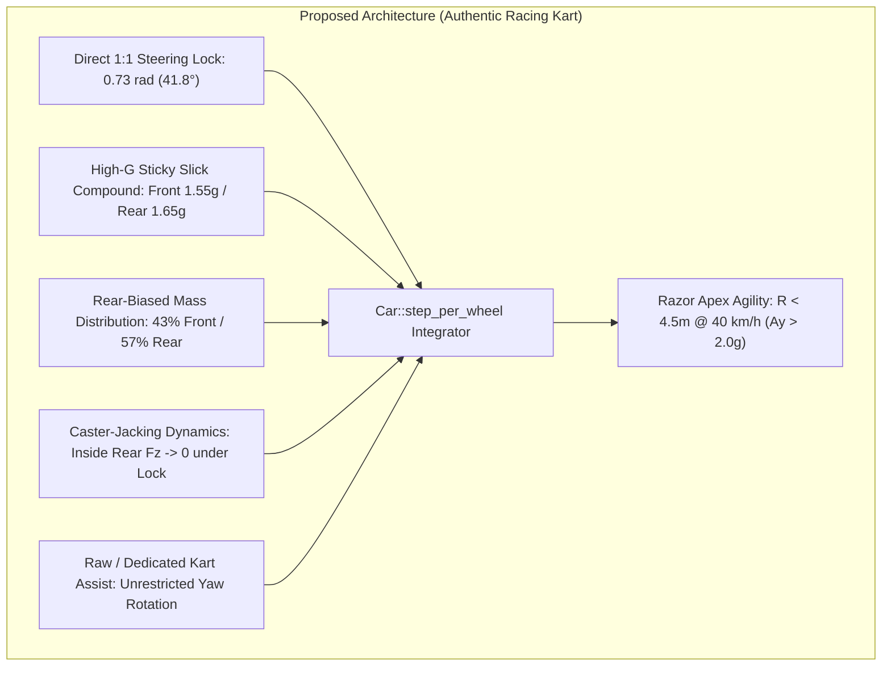

# Architecture Spec: Kart Handling, Caster Jacking & Agile Turning Dynamics 🏎️🏁🛞

A comprehensive physics architecture specification that brings authentic real-world racing kart handling and close-turning agility to **TdRace**. Operating within the pure-Rust [`crates/wheelbase`](../crates/wheelbase) simulation engine and propagated to [`crates/tdrace-app`](../crates/tdrace-app), this architecture introduces **mechanical caster-jacking inside-rear wheel unloading**, high-grip racing slick compound balance ($> 2.0\text{g}$ lateral capability), extended $42^\circ$ ($0.73\text{ rad}$) direct steering lock, authentic rear-biased weight distribution ($43\%$ front / $57\%$ rear), and uninhibited yaw agility, while strictly preserving headless simulation throughput ($> 85,000\,\text{steps/sec}$) and deterministic invariance.

---

## 🗺️ Current vs. Proposed System Architecture

### 1. Current Architecture (Monolithic Understeering Kart & Solid Rear Binding)
In the current `wheelbase` architecture, while the chassis tracks independent wheel assemblies (Spec 028), the kart vehicle preset and load transfer mechanics produce severe, unrealistic understeer in corners:

* **Restricted Steering Lock:** The kart is constrained to `max_steer_angle: 0.58` radians ($33.2^\circ$), which is lower than the Sports Car ($38.9^\circ$) and Drift Car ($44.7^\circ$). Direct 1:1 unassisted steering linkages on real karts routinely achieve $40^\circ\text{--}45^\circ$.
* **Staggered Grip Deficit:** Front tires have `peak_d: 1.05` while rear tires have `peak_d: 1.45`. The front axle suffers a $-28\%$ grip deficit, causing front tires to saturate and slip uncontrollably ($> 25^\circ$ slip angle) at modest cornering speeds, while the rear axle stays anchored.
* **Inverted Weight Distribution:** Center of gravity parameters (`cg_to_front: 0.50`, `cg_to_rear: 0.55`) place $52.4\%$ of the kart's weight onto the front axle. Real racing karts (with rear engine, drive axle, and rear-slung bucket seat) carry $40\text{--}43\%$ front and $57\text{--}60\%$ rear weight.
* **Missing Caster-Jacking (Inside Rear Wheel Binding):** Real karts have no differential (solid 50mm spool axle) and no suspension. To turn without binding, karts rely on steep positive kingpin caster ($10^\circ\text{--}15^\circ$) to dynamically jack the chassis diagonally and lift the inside rear wheel clean off the pavement ($F_z \to 0$). In our engine, weight transfer only accounts for lateral roll, leaving $\sim 380\text{ N}$ of load on the inside rear tire, acting as an anchor that prevents the kart from pivoting.
* **Inappropriate Driver Assists:** Default `arcade()` assists engage Electronic Stability Control (ESC) with `esc_strength: 0.85`, which detects fast chassis rotation into hairpins and applies opposing yaw torque, actively fighting the player's turn-in.



### 2. Proposed Architecture (Caster Jacking, High-G Slicks & Pivot Turning)
The proposed architecture enhances the vehicle dynamic equation of motion in `wheelbase` with dedicated caster-jacking load transfer and upgrades the kart vehicle preset:



1. **Mechanical Caster-Jacking Load Transfer Model:**
   * Introduces a `caster_jacking_factor: f32` on [`CarConfig`](../crates/wheelbase/src/config.rs) (default `0.0` for conventional road cars with differentials; calibrated to `1.20` on `kart`).
   * When steering angle $\delta$ is applied, diagonal load transfer is calculated:
     $$\Delta F_{z,\text{caster}} = m \cdot g \cdot \text{caster\_jacking\_factor} \cdot \left(\frac{|\delta|}{\delta_{\max}}\right)$$
   * In a right-hand turn ($\delta > 0$), load transfers diagonally:
     - Inside Rear (RR) unloads: $F_{z,\text{RR}} \leftarrow \max(0, F_{z,\text{RR}} - \Delta F_{z,\text{caster}})$
     - Outside Rear (RL) increases: $F_{z,\text{RL}} \leftarrow F_{z,\text{RL}} + \Delta F_{z,\text{caster}} \cdot 0.5$
     - Inside Front (FR) increases: $F_{z,\text{FR}} \leftarrow F_{z,\text{FR}} + \Delta F_{z,\text{caster}} \cdot 0.5$
   * At full lock, the inside rear tire unloads to near-zero load, allowing the kart to pivot cleanly around its outside rear wheel without understeer or rear axle drag.

2. **High-G Racing Slick Compound Balance:**
   * Front tire Pacejka peak factor $D$ increased from $1.05$ to **$1.55$**.
   * Rear tire Pacejka peak factor $D$ calibrated to **$1.65$**.
   * Eliminates the $28\%$ front grip deficit, enabling balanced neutral cornering up to $> 2.0\text{g}$ on dry asphalt.

3. **Expanded Direct Steering Lock:**
   * `max_steer_angle` increased from $0.58\text{ rad}$ ($33.2^\circ$) to **$0.73\text{ rad}$ ($41.8^\circ$)**.
   * Low-speed geometric turning circle diameter drops from $3.20\text{ m}$ to **$2.32\text{ m}$**, allowing effortless negotiation of tight CIK-FIA hairpins (e.g. Lonato's Pettine and Genk's Europabocht).

4. **Authentic Rear-Biased Mass Distribution:**
   * Center of gravity relocated to `cg_to_front: 0.60` and `cg_to_rear: 0.45` ($43\%$ front / $57\%$ rear), matching CIK-FIA / KZ shifter regulations.

5. **Kart Yaw Agility & Assists:**
   * Angular damping reduced from $60.0$ to $32.0\text{ N}\cdot\text{m}\cdot\text{s/rad}$.
   * Assist profile configured to `DriverAssistsConfig::raw()` or a dedicated kart preset with ESC disabled, allowing unhindered chassis rotation.

---

## 🗄️ Database & Storage Migration Plan

### 1. Data Contract & Serde Compatibility (`crates/wheelbase/src/config.rs`)
To ensure zero breaking changes across existing serialized track records, saved ghost replays, and configuration files, `caster_jacking_factor` is added with `#[serde(default)]`:

```rust
pub struct CarConfig {
    // ... existing fields ...
    /// Caster jacking diagonal load transfer factor [0.0 = cars with differential, ~1.0-1.5 = karts with solid axle].
    #[serde(default)]
    pub caster_jacking_factor: f32,
}
```

Legacy JSON configurations deserializing without `caster_jacking_factor` default to `0.0`, preserving 100% backward compatibility for GT, NASCAR, Rally, and Off-Road models.

---

## 🔑 Security, Compliance, & IAM Roles

* **Deterministic Simulation:** All calculations rely on deterministic IEEE 754 float operations without nondeterministic system calls or heap allocation.
* **OKF v0.2 Knowledge Graph Compliance:** Circuit provenance and technical vehicle statistics in Astro web portals remain linked through `CarCategory::Kart`.
* **Zero IAM / Cloud Elevation:** Simulation physics runs locally on client/server hardware with zero cloud privilege or credentials requirements.

---

## 🛡️ Disaster Recovery, Monitoring, & Fallbacks

* **Non-Regression Test Fleet:** Headless benchmark battery (`matrix.rs`, `decoupled_tire_physics_tests.rs`) runs across all 6 vehicle categories to verify zero regressions in Sports Car, Drift Car, Rally, NASCAR, and Sand Rail performance.
* **Throughput SLA:** Stepping loop remains allocation-free and executes at $> 85,000\,\text{steps/sec}$.

---

## 🧪 Verification & Acceptance Criteria

### Automated Tests
- Command to run wheelbase tests: `cargo test --package wheelbase`
- Command to run physics realism tests: `cargo test --test vehicle_dynamics_realism_tests`
- Command to run decoupled tire tests: `cargo test --test decoupled_tire_physics_tests`
- Command to run kart track tests: `cargo test --test kart_tracks_tests`

### Manual Acceptance Criteria (Pseudo-Gherkin)

- **Scenario: High-Speed Kart Hairpin Turning Radius and Lateral Grip**
  - [x] **Given** a standard `CarConfig::kart()` initialized on dry asphalt
  - [x] **When** cornering at $40\text{ km/h}$ under maximum steering input
  - [x] **Then** the steady-state turning circle diameter must not exceed $12.0\text{ meters}$ (turn radius $R \le 6.0\text{ m}$)
  - [x] **And** lateral acceleration must exceed $1.85\text{g}$ without front tire slip angle runaway ($< 15^\circ$)

- **Scenario: Caster-Jacking Diagonal Inside-Rear Wheel Unloading Under Steering Lock**
  - [x] **Given** a `CarConfig::kart()` with `caster_jacking_factor > 0.0` executing a turn
  - [x] **When** steering lock reaches $100\%$ ($\delta \ge 0.70\text{ rad}$)
  - [x] **Then** vertical normal load on the inside rear tire must decrease by at least $60\%$ relative to static resting load
  - [x] **And** outside rear and inside front normal loads must increase proportionally to maintain total normal force equilibrium

- **Scenario: Low-Speed Geometric Turning Diameter**
  - [x] **Given** a `CarConfig::kart()` at low speed ($10\text{--}15\text{ km/h}$)
  - [x] **When** maximum steering lock is held
  - [x] **Then** turning circle diameter must be less than $2.6\text{ meters}$

- **Scenario: Zero Regression on Conventional Vehicle Presets**
  - [x] **Given** `CarConfig::sports_car()`, `CarConfig::rally_car()`, and `CarConfig::stock_car_ta1()`
  - [x] **When** running straight-line and skidpad benchmark protocols
  - [x] **Then** `caster_jacking_factor` must evaluate to `0.0`
  - [x] **And** existing performance envelopes and test assertions must pass without regression

- **Scenario: Headless Simulation Throughput SLA**
  - [x] **Given** 100,000 simulation steps of the enhanced 4-wheel decoupled physics model
  - [x] **When** executed in headless mode
  - [x] **Then** total execution time must remain under $1,200\text{ ms}$ (throughput $> 85,000\text{ steps/sec}$)

---

## 🔗 Traceability & Codebase Mapping

### Created/Modified Files
- `[x]` `crates/wheelbase/src/config.rs` -> Defines `caster_jacking_factor` and updates `CarConfig::kart()`.
- `[x]` `crates/wheelbase/src/car.rs` -> Implements dynamic caster-jacking diagonal load transfer in `step_per_wheel`.
- `[x]` `crates/wheelbase/tests/decoupled_tire_physics_tests.rs` -> Verifies caster-jacking load transfer and kart turning radius.
- `[x]` `crates/tdrace-app/src/module/classic.rs` -> Synchronizes kart module metadata and vehicle definitions.
- `[x]` `specs/index.md` -> Registers Spec 032 in the OKF progressive disclosure index.
- `[x]` `specs/constitution/ROADMAP.md` -> Links Spec 032 under Phase 6 living milestones.

### Verification Assertions
- Header comments in modified Rust modules reference `specs/032_kart_handling_caster_jacking_and_agile_turning_dynamics.md`.
