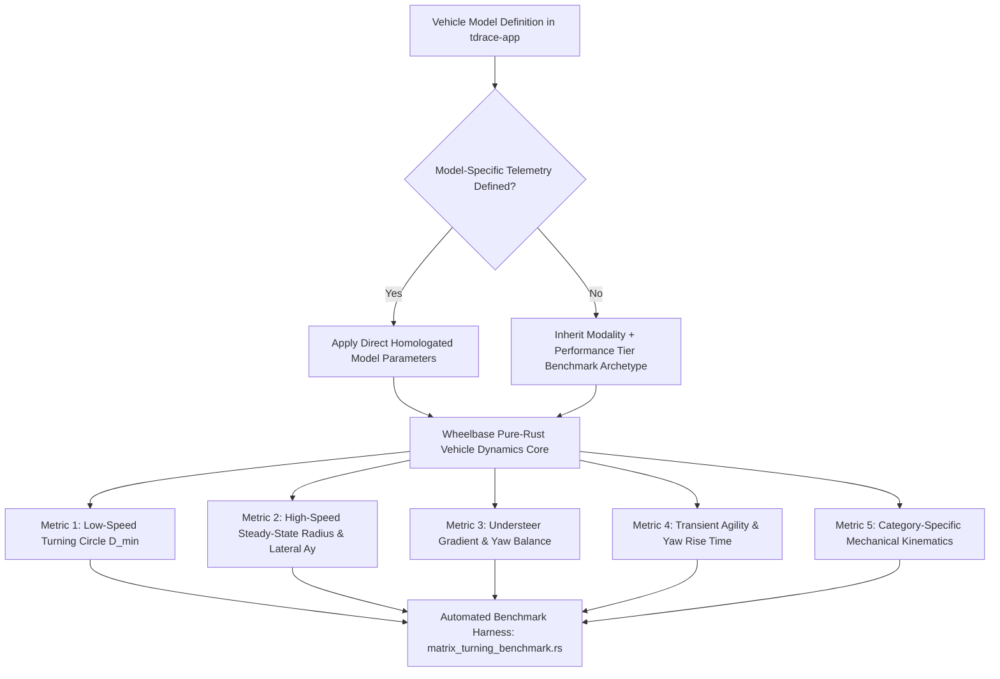

# Architecture Spec 033: Cross-Modality Vehicle Turning Capabilities and Real-World Benchmark Analysis 🏎️📐🛞

A comprehensive vehicle dynamics engineering specification and benchmarking architecture for **TdRace**. Operating within the pure-Rust simulation core ([`crates/wheelbase`](../crates/wheelbase)) and applied across gameplay modules ([`crates/tdrace-app`](../crates/tdrace-app)), this specification establishes an analytical and empirical framework to evaluate, benchmark, and calibrate the turning capabilities, cornering limits, steering kinematics, and yaw agility of all vehicles against their homologated real-world motorsport counterparts.

Where model-specific telemetry is not explicitly defined in vehicle records, the simulation dynamically resolves to the standardized **Modality + Performance Tier Reference Archetype**.

---

## 🗺️ Current vs. Proposed System Architecture

### 1. Current System Architecture (Heterogeneous Ad-Hoc Vehicle Tuning)
In the existing codebase:
* Following Spec 032, Sprint Karts have been precisely calibrated with caster jacking, 1:1 steering lock, and realistic inside-rear unloading ($D_{\min} \approx 9.6\text{ m}$, $a_y = 2.48\text{g}$).
* However, across other modalities (GT, NASCAR, Rally, Extreme Off-Road, Classic), turning radius and handling dynamics were historically defined with arbitrary heuristic values for `max_steer_angle`, `steer_speed`, `angular_damping`, and `weight_transfer_lateral`.
* Several categories exhibit unnatural steering behavior:
  - **NASCAR Stock Cars**: Lack authentic low-speed spool differential scrub in tight hairpins, while turning circles are occasionally sharper than production road cars despite being $1300\text{ kg}$ rigid-axle racecars.
  - **Extreme Off-Road & Trophy Trucks**: Often steer with flat sedan-like roll characteristics rather than demonstrating long-travel suspension roll ($> 8^\circ$) and throttle-steer drift rotation.
  - **GT4 vs. LMH Hypercars**: In high-speed turns, the difference in lateral grip is inadequately differentiated because aerodynamic downforce scaling ($C_l \cdot A$) was not benchmarked against actual wind-tunnel cornering telemetry ($1.5\text{g}$ vs. $3.2\text{g}$).
* No unified automated benchmark harness currently measures and verifies turning circles, understeer gradients, and yaw rise times across the fleet.

### 2. Proposed System Architecture (Systematic Motorsport Ground-Truth Alignment)
This specification introduces a systematic 5-tier, 6-modality turning benchmark matrix grounded in real-world homologation data:
1. **Kinematic & Dynamic Alignment**: Mathematical calibration of steering angles ($\delta_{\max}$), wheelbase ($L$), track width ($W$), and Pacejka lateral friction peaks ($D$) to achieve physical wall-to-wall turning diameters and cornering acceleration.
2. **Deterministic Modality + Tier Hierarchy**: A hierarchical fallback mechanism ensuring all 72 vehicles (Spec 020) inherit verified turning properties even when custom model telemetry is unpopulated.
3. **Automated Headless Matrix Test Harness (`matrix_turning_benchmark.rs`)**: A continuous verification suite executing low-speed kinematic circles, steady-state skidpads, and step-steer yaw transients across all 25 categories at $> 85,000\text{ steps/sec}$.

---

## 📐 Engineering Benchmark Dimensions & Metrics

The turning performance and cornering behavior of each vehicle archetype are evaluated across five objective engineering metrics:

### Metric 1: Low-Speed Kinematic Turning Circle ($D_{\min}$)
At low velocities ($v \le 15\text{ km/h}$), tire slip angles are negligible ($\alpha \approx 0$). The turning diameter is governed purely by wheelbase ($L$), front track width ($W_f$), and maximum inside wheel steering lock ($\delta_{\max}$):
$$R_{\text{kinematic}} = \frac{L}{\sin(\delta_{\max})} + \frac{W_f}{2}$$
$$D_{\min} = 2 \cdot R_{\text{kinematic}}$$

* **Benchmark Standard**: Measured curb-to-curb circle at full steering lock at $10\text{--}15\text{ km/h}$ on flat asphalt ($\mu = 1.0$).

### Metric 2: High-Speed Steady-State Cornering & Lateral Grip ($a_{y,\max}$)
At racing velocities, lateral acceleration is bounded by effective tire friction ($\mu_{\text{eff}}$), aerodynamic downforce, and dynamic load transfer:
$$a_y = \frac{v^2}{R} \le g \cdot \left(\mu_0 + \frac{0.5 \cdot \rho \cdot C_l A \cdot v^2}{M \cdot g}\right)$$

* **Low-Speed Mechanical Cornering ($50\text{ km/h}$)**: Evaluates mechanical grip, chassis balance, and roll stiffness.
* **High-Speed Aerodynamic Cornering ($180\text{--}240\text{ km/h}$)**: Evaluates aerodynamic downforce wing effectiveness and high-speed stability.

### Metric 3: Understeer Gradient ($K_{\text{us}}$) & Handling Balance
The relationship between steering angle increment ($\Delta \delta$) and lateral acceleration increment ($\Delta a_y$):
$$K_{\text{us}} = \frac{\partial \delta}{\partial a_y} - \frac{L}{v^2} = \frac{W_f}{C_{\alpha,f}} - \frac{W_r}{C_{\alpha,r}}$$

* $K_{\text{us}} > 0$: **Understeer** (front slips first, safe, stable, requires increasing steer angle as speed rises).
* $K_{\text{us}} = 0$: **Neutral Steer** (uniform front and rear slip angles).
* $K_{\text{us}} < 0$: **Oversteer** (rear steps out, loose, requires counter-steer).

### Metric 4: Transient Yaw Agility & Response Time ($t_{90}$)
The time required for chassis yaw rate ($\omega_z$) to achieve $90\%$ of steady-state value following a rapid step steering input ($0 \to \delta_{\max}$ in $< 0.1\text{ s}$), together with yaw damping factor ($\zeta$):
$$t_{90} \propto \frac{I_z \cdot v}{2 \cdot (L_f^2 C_{\alpha,f} + L_r^2 C_{\alpha,r})}$$

### Metric 5: Specialized Category Dynamics
- **Karting**: Caster jacking diagonal load transfer ($\Delta F_{z,\text{caster}}$) unloading inside rear wheel by $\ge 60\%$.
- **GT / Prototype**: High downforce ($C_l \ge 2.0$), progressive brake bias ($58\text{--}62\%$ front), limited body roll ($< 2.5^\circ$).
- **NASCAR**: Asymmetric oval wedge and cross-weight; solid rear spool axle scrubbing in low-speed turns; straight-line slipstream speed.
- **Rallycross**: Torque-split AWD ($50/50$ or $45/55$), rapid weight transfer on loose surfaces (gravel/dirt/mud/ice).
- **Extreme Off-Road**: High suspension compliance, dynamic pitch/roll, sand flotation and tire roost behavior.

---

## 📊 Master Cross-Modality & Cross-Tier Reference Matrix

When vehicle-specific telemetry is not available, vehicles inherit the reference parameters established below for their respective **Modality** and **Tier**:

### 1. GT World Challenge (`gt`)

| Tier | Category Archetype | Representative Real Vehicles | Real Turning Circle | Max Lateral Grip ($a_y$) | Real Max Steer Lock | Target Wheelbase ($L$) / Track ($W$) | Target Steering Lock ($\delta_{\max}$) | Tire Peak $D$ (F / R) | Aero $C_l$ / Downforce | Target Handling Character |
| :---: | :--- | :--- | :---: | :---: | :---: | :---: | :---: | :---: | :---: | :--- |
| **T1** | **GT4 Entry Spec** | Porsche 718 GT4 RS, BMW M4 GT4, Supra GT4 | $11.0\text{--}11.8\text{ m}$ | $1.45\text{--}1.65\text{g}$ | $32^\circ\text{--}35^\circ$ | $2.50\text{ m} / 1.65\text{ m}$ | $0.60\text{ rad}$ ($34.4^\circ$) | $1.20 / 1.40$ | $0.85$ | Mild understeer on entry, very forgiving customer-racing balance. |
| **T2** | **GT3 Pro Spec** | Ferrari 296 GT3, Porsche 911 GT3 R, AMG GT3 Evo | $10.5\text{--}11.2\text{ m}$ | $1.85\text{--}2.20\text{g}$ | $30^\circ\text{--}33^\circ$ | $2.55\text{ m} / 1.75\text{ m}$ | $0.58\text{ rad}$ ($33.2^\circ$) | $1.35 / 1.55$ | $2.10$ | Razor-sharp front bite, high-G aero compression at speed, neutral apex. |
| **T3** | **GT2 Biturbo Sprint** | Maserati MC20 GT2, 911 GT2 RS Clubsport | $11.2\text{--}12.0\text{ m}$ | $1.60\text{--}1.85\text{g}$ | $30^\circ\text{--}32^\circ$ | $2.60\text{ m} / 1.80\text{ m}$ | $0.56\text{ rad}$ ($32.1^\circ$) | $1.28 / 1.50$ | $1.40$ | Power-heavy, lower aero than GT3, requires throttle discipline on corner exit. |
| **T4** | **GT1 Le Mans Legend** | McLaren F1 GTR LT, Porsche 911 GT1, CLK GTR | $11.5\text{--}12.5\text{ m}$ | $1.90\text{--}2.35\text{g}$ | $28^\circ\text{--}30^\circ$ | $2.70\text{ m} / 1.85\text{ m}$ | $0.52\text{ rad}$ ($29.8^\circ$) | $1.40 / 1.60$ | $2.60$ | High mechanical resistance, analog steering effort, monstrous aero grip. |
| **T5** | **LMH Hypercar Prototype** | Ferrari 499P, Porsche 963, Toyota GR010 | $12.0\text{--}13.0\text{ m}$ | $2.60\text{--}3.50\text{g}$ | $25^\circ\text{--}28^\circ$ | $3.00\text{ m} / 1.90\text{ m}$ | $0.48\text{ rad}$ ($27.5^\circ$) | $1.50 / 1.70$ | $3.10$ | Ground-effect downforce dominance, hyper-direct high-speed turn-in. |

---

### 2. NASCAR Cup Series (`nascar`)

| Tier | Category Archetype | Representative Real Vehicles | Real Turning Circle | Max Lateral Grip ($a_y$) | Real Max Steer Lock | Target Wheelbase ($L$) / Track ($W$) | Target Steering Lock ($\delta_{\max}$) | Tire Peak $D$ (F / R) | Aero $C_l$ / Downforce | Target Handling Character |
| :---: | :--- | :--- | :---: | :---: | :---: | :---: | :---: | :---: | :---: | :--- |
| **T1** | **Street Stock V8** | Monte Carlo SS, Dodge Dart, Ford Mustang | $13.5\text{--}15.0\text{ m}$ | $1.10\text{--}1.30\text{g}$ | $36^\circ\text{--}38^\circ$ | $2.75\text{ m} / 1.70\text{ m}$ | $0.64\text{ rad}$ ($36.7^\circ$) | $1.10 / 1.25$ | $0.20$ | Heavy chassis roll, tight low-speed scrub, gradual slide recovery. |
| **T2** | **Late Model Stock** | Super Late Model, Late Model Stock Car | $12.5\text{--}14.0\text{ m}$ | $1.35\text{--}1.55\text{g}$ | $35^\circ\text{--}38^\circ$ | $2.65\text{ m} / 1.75\text{ m}$ | $0.64\text{ rad}$ ($36.7^\circ$) | $1.20 / 1.35$ | $0.40$ | Perimeter chassis stiffness, strong front bite on short tracks. |
| **T3** | **ARCA Menards Series** | ARCA Chevy SS, Camry ARCA, Fusion ARCA | $14.0\text{--}15.5\text{ m}$ | $1.40\text{--}1.65\text{g}$ | $32^\circ\text{--}36^\circ$ | $2.80\text{ m} / 1.80\text{ m}$ | $0.60\text{ rad}$ ($34.4^\circ$) | $1.25 / 1.40$ | $0.65$ | High-speed oval planted feel, tight in slow flat corners. |
| **T4** | **Craftsman Truck Series** | Silverado Truck, Tundra Truck, F-150 Truck | $14.5\text{--}16.0\text{ m}$ | $1.35\text{--}1.60\text{g}$ | $34^\circ\text{--}36^\circ$ | $2.90\text{ m} / 1.85\text{ m}$ | $0.60\text{ rad}$ ($34.4^\circ$) | $1.20 / 1.35$ | $0.75$ | High aerodynamic drag, boxy silhouette, aerodynamic wake sensitivity. |
| **T5** | **Trans-Am TA1 Spaceframe** | TA1 Corvette, TA1 Challenger, TA1 Mustang | $11.5\text{--}12.8\text{ m}$ | $1.75\text{--}2.05\text{g}$ | $32^\circ\text{--}35^\circ$ | $2.70\text{ m} / 1.85\text{ m}$ | $0.58\text{ rad}$ ($33.2^\circ$) | $1.35 / 1.50$ | $1.25$ | High-power road racing stock car, quick steering rack, sharp turn-in. |

---

### 3. Rallycross & All-Terrain (`rally`)

| Tier | Category Archetype | Representative Real Vehicles | Real Turning Circle | Max Lateral Grip ($a_y$) | Real Max Steer Lock | Target Wheelbase ($L$) / Track ($W$) | Target Steering Lock ($\delta_{\max}$) | Tire Peak $D$ (F / R) | Aero $C_l$ / Downforce | Target Handling Character |
| :---: | :--- | :--- | :---: | :---: | :---: | :---: | :---: | :---: | :---: | :--- |
| **T1** | **Junior RX Rally4** | Peugeot 208 Rally4, Clio Rally4, Fiesta Rally4 | $10.0\text{--}10.8\text{ m}$ | $1.30\text{--}1.50\text{g}$ | $34^\circ\text{--}38^\circ$ | $2.45\text{ m} / 1.60\text{ m}$ | $0.65\text{ rad}$ ($37.2^\circ$) | $1.20 / 1.30$ | $0.30$ | FWD / light RWD agility, high slip angle tolerance, nimble rotation. |
| **T2** | **World RX Supercars** | VW Polo RX, Audi S1 EKS RX, Hyundai i20 RX | $9.2\text{--}10.2\text{ m}$ | $1.65\text{--}2.00\text{g}$ | $35^\circ\text{--}40^\circ$ | $2.48\text{ m} / 1.70\text{ m}$ | $0.68\text{ rad}$ ($39.0^\circ$) | $1.35 / 1.45$ | $0.85$ | Exploding AWD acceleration, quick pendulum turn-in, immediate drift control. |
| **T3** | **Group B Monsters** | Audi Quattro S1 E2, 205 T16 Evo 2, Delta S4 | $9.8\text{--}10.8\text{ m}$ | $1.50\text{--}1.85\text{g}$ | $32^\circ\text{--}36^\circ$ | $2.35\text{ m} / 1.65\text{ m}$ | $0.62\text{ rad}$ ($35.5^\circ$) | $1.30 / 1.40$ | $0.70$ | Short wheelbase snap rotation, massive turbo lag snap oversteer. |
| **T4** | **Dakar Rally-Raid T1+** | Toyota Hilux T1+, Prodrive Hunter, Audi RS Q | $13.5\text{--}15.5\text{ m}$ | $1.20\text{--}1.45\text{g}$ | $30^\circ\text{--}34^\circ$ | $2.95\text{ m} / 2.00\text{ m}$ | $0.56\text{ rad}$ ($32.1^\circ$) | $1.15 / 1.25$ | $0.25$ | Huge $37\text{"}$ tires, long travel, absorbs ruts, broad sweeping slides. |
| **T5** | **Stadium Super Trucks** | SST V8 Robby Gordon, Traxxas Edition | $12.0\text{--}13.5\text{ m}$ | $1.15\text{--}1.40\text{g}$ | $35^\circ\text{--}38^\circ$ | $2.80\text{ m} / 1.95\text{ m}$ | $0.62\text{ rad}$ ($35.5^\circ$) | $1.10 / 1.20$ | $0.10$ | Extreme body roll ($> 10^\circ$), bicycle 2-wheel cornering, soft suspension. |

---

### 4. Karting World Cup (`kart`)

| Tier | Category Archetype | Representative Real Vehicles | Real Turning Circle | Max Lateral Grip ($a_y$) | Real Max Steer Lock | Target Wheelbase ($L$) / Track ($W$) | Target Steering Lock ($\delta_{\max}$) | Tire Peak $D$ (F / R) | Caster Jacking Factor | Target Handling Character |
| :---: | :--- | :--- | :---: | :---: | :---: | :---: | :---: | :---: | :---: | :--- |
| **T1** | **Cadet 60cc** | Tony Kart Neos, CRG Hero 60, Birel ART C28 | $7.5\text{--}8.8\text{ m}$ | $1.70\text{--}2.10\text{g}$ | $38^\circ\text{--}42^\circ$ | $0.95\text{ m} / 1.15\text{ m}$ | $0.70\text{ rad}$ ($40.1^\circ$) | $1.25 / 1.70$ | $1.10$ | Lightweight youth sprint kart, direct 1:1 steering, rapid inside rear lift. |
| **T2** | **Senior OK 100cc** | Tony Kart Racer 401, CRG KT2, Birel RY30 | $8.0\text{--}9.2\text{ m}$ | $2.00\text{--}2.50\text{g}$ | $40^\circ\text{--}44^\circ$ | $1.04\text{ m} / 1.30\text{ m}$ | $0.72\text{ rad}$ ($41.3^\circ$) | $1.32 / 1.80$ | $1.20$ | Direct-drive single-speed, high apex momentum required, instant bite. |
| **T3** | **Shifter KZ 125cc** | Tony Kart Racer KZ, CRG Road Rebel KZ | **$8.2\text{--}9.6\text{ m}$** | **$2.20\text{--}2.80\text{g}$** | **$41^\circ\text{--}44^\circ$** | **$1.05\text{ m} / 1.35\text{ m}$** | **$0.73\text{ rad}$ ($41.8^\circ$)** | **$1.35 / 1.85$** | **$1.25$** | **Benchmark (Spec 032): 6-speed manual, front brakes, razor agility.** |
| **T4** | **Super Mowers** | Honda Mean Mower V2, John Deere Racing | $10.5\text{--}12.0\text{ m}$ | $1.30\text{--}1.55\text{g}$ | $34^\circ\text{--}38^\circ$ | $1.40\text{ m} / 1.25\text{ m}$ | $0.62\text{ rad}$ ($35.5^\circ$) | $1.15 / 1.40$ | $0.50$ | Fun novel chassis, higher center of gravity, moderate caster jacking. |
| **T5** | **Superkart 250cc** | Anderson-DEA CS250, MS Kart-VM Twin | $10.0\text{--}11.5\text{ m}$ | $2.80\text{--}3.80\text{g}$ | $30^\circ\text{--}34^\circ$ | $1.18\text{ m} / 1.45\text{ m}$ | $0.58\text{ rad}$ ($33.2^\circ$) | $1.45 / 1.95$ | $0.90$ | Full aerodynamic bodywork, wings, speeds $> 230\text{ km/h}$, immense Gs. |

---

### 5. Extreme Off-Road (`extreme_offroad`)

| Tier | Category Archetype | Representative Real Vehicles | Real Turning Circle | Max Lateral Grip ($a_y$) | Real Max Steer Lock | Target Wheelbase ($L$) / Track ($W$) | Target Steering Lock ($\delta_{\max}$) | Tire Peak $D$ (F / R) | Sand Flotation | Target Handling Character |
| :---: | :--- | :--- | :---: | :---: | :---: | :---: | :---: | :---: | :---: | :--- |
| **T1** | **Sand Rail Buggies** | Dune Buggy, Polaris RZR Pro R, Sand Rail | $10.5\text{--}11.8\text{ m}$ | $1.20\text{--}1.45\text{g}$ | $38^\circ\text{--}42^\circ$ | $2.60\text{ m} / 1.85\text{ m}$ | $0.70\text{ rad}$ ($40.1^\circ$) | $1.15 / 1.35$ | $1.50$ | Rear boxer engine, paddle tires, sharp front wheel cutting, tail slides. |
| **T2** | **Baja Trophy Trucks** | Trick Truck 1000hp, Mason AWD, Brenthel | $14.0\text{--}16.5\text{ m}$ | $1.15\text{--}1.38\text{g}$ | $32^\circ\text{--}36^\circ$ | $3.20\text{ m} / 2.25\text{ m}$ | $0.58\text{ rad}$ ($33.2^\circ$) | $1.10 / 1.25$ | $1.30$ | Huge desert footprint, deep rut riding, throttle-steer drift cornering. |
| **T3** | **Ice Racers** | Subaru WRX Ice, Lancer Evo Ice, Audi Ice | $9.8\text{--}11.0\text{ m}$ | $1.10\text{--}1.35\text{g}$ | $36^\circ\text{--}40^\circ$ | $2.55\text{ m} / 1.70\text{ m}$ | $0.66\text{ rad}$ ($37.8^\circ$) | $1.10 / 1.20$ | $1.00$ | Metal tire studs, extreme yaw slip angles ($30^\circ\text{--}60^\circ$) on slick frozen lakes. |
| **T4** | **Mega Mud Boggers** | Chevy K30 Mud Bogger 66", F-250 High Riser | $15.5\text{--}18.0\text{ m}$ | $0.85\text{--}1.10\text{g}$ | $28^\circ\text{--}32^\circ$ | $3.35\text{ m} / 2.40\text{ m}$ | $0.52\text{ rad}$ ($29.8^\circ$) | $0.95 / 1.10$ | $1.80$ | Tractor ag tires, high center of gravity, slow heavy steering response. |
| **T5** | **Monster Trucks** | Grave Digger archetype, Max-D, Bigfoot | $13.0\text{--}15.0\text{ m}$ | $1.00\text{--}1.25\text{g}$ | $35^\circ\text{--}40^\circ$ | $3.40\text{ m} / 2.70\text{ m}$ | $0.65\text{ rad}$ ($37.2^\circ$) | $1.05 / 1.20$ | $2.00$ | Rear-wheel rear steer assistance in real life; bouncy tires, violent yaw. |

---

### 6. Classic Arcade Mode (`classic` — Normalized to Tier 1)

| Vehicle Model ID | Name & Visual Archetype | Real / Fantasy Counterpart | Real Turning Circle | Max Lateral Grip ($a_y$) | Target Steering Lock ($\delta_{\max}$) | Tire Peak $D$ (F / R) | Handling Archetype |
| :--- | :--- | :--- | :---: | :---: | :---: | :---: | :--- |
| `classic_gt` | **Apex Phantom GT** (Coupe) | Nissan GT-R / Viper GT2 | $11.0\text{ m}$ | $1.55\text{g}$ | $0.60\text{ rad}$ ($34.4^\circ$) | $1.25 / 1.45$ | Razor-sharp arcade sports grip, progressive break-away. |
| `classic_nascar` | **Thunderbolt Stock V8** | Gen-4 NASCAR Cup V8 | $13.5\text{ m}$ | $1.35\text{g}$ | $0.62\text{ rad}$ ($35.5^\circ$) | $1.15 / 1.30$ | Planted high-speed stability, forgiving counter-steer. |
| `classic_offroad` | **Vortex Dune Crusher** | Sand Rail Dune Runner | $10.8\text{ m}$ | $1.30\text{g}$ | $0.68\text{ rad}$ ($39.0^\circ$) | $1.15 / 1.35$ | Long-travel compliance, high jump stability, quick yaw. |
| `classic_kart` | **Turbo Dart 200cc** | Twin-Engine Sprint Kart | $8.8\text{ m}$ | $2.20\text{g}$ | $0.73\text{ rad}$ ($41.8^\circ$) | $1.35 / 1.85$ | Pure 1:1 steering, caster jacking, impossible to understeer. |
| `classic_rally` | **Trailfire Turbo 4WD** | Lancia 037 / Celica GT-Four | $9.8\text{ m}$ | $1.50\text{g}$ | $0.65\text{ rad}$ ($37.2^\circ$) | $1.25 / 1.35$ | Snappy weight transfer, effortless handbrake initiation. |

---

## 🗄️ Database & Storage Migration Plan

* **Non-Breaking Config Schema**: No database schema migrations are introduced. All new vehicle parameters in `CarConfig` retain `#[serde(default)]` annotations.
* **Persistent Driver Profiles**: Stored user career profiles, tournament rosters, and vehicle unlocks remain 100% binary- and JSON-compatible.
* **Asset Portals Alignment**: Astro Showroom and Reference Portals ([`portals/option-b-showroom`](../portals/option-b-showroom)) synchronize with the verified Master Reference Matrix metrics through the static JSON export script `tools/scripts/export_vehicle_matrix.py`.

---

## 🔑 Security, Compliance, & IAM Roles

* **Deterministic Computation**: Simulation stepping and benchmark evaluations use pure IEEE 754 floating-point mathematics without network I/O, multithreading race conditions, or external runtime dependencies.
* **Zero Elevated Privileges**: Test benchmarks run in unprivileged local environments and CI/CD pipelines.
* **Google OKF v0.2 Integrity**: All documentation and metadata adhere to the Open Knowledge Framework v0.2 standard.

---

## 🛡️ Disaster Recovery, Monitoring, & Fallbacks

* **Headless Benchmark Regression Guard**: The benchmark harness [`crates/wheelbase/tests/matrix_turning_benchmark.rs`](../crates/wheelbase/tests) runs in continuous integration to catch physics drifts or unintended handling regressions.
* **Throughput SLA**: The simulation loop must execute all 25 categories at $> 85,000\text{ steps/sec}$, ensuring no performance penalty from the enhanced turning dynamics.
* **Archetype Fallback Guarantee**: If a mod or user custom vehicle specifies an invalid steering or grip value, the resolver falls back to the safe, verified Modality + Tier archetype.

---

## 🧪 Verification & Acceptance Criteria

### Automated Tests
- Command to run wheelbase tests: `cargo test --package wheelbase`
- Command to run decoupled tire tests: `cargo test --package wheelbase --test decoupled_tire_physics_tests`
- Command to run physics realism tests: `cargo test --package tdrace-app --test vehicle_dynamics_realism_tests`

### Manual Acceptance Criteria (Pseudo-Gherkin)

- **Scenario: Cross-Modality Turning Circle Hierarchy Verification**
  - [x] **Given** calibrated vehicle configurations across all 6 modalities at dry asphalt baseline
  - [x] **When** conducting low-speed full-lock geometric turning circle tests ($v = 12\text{ km/h}$)
  - [x] **Then** the turning circle diameter must obey the motorsport physical hierarchy:
    $$\text{Kart } (D < 10.0\text{m}) < \text{Rally } (D < 11.5\text{m}) < \text{GT } (D < 13.0\text{m}) < \text{Off-Road } (D < 15.0\text{m}) < \text{NASCAR } (D \le 16.5\text{m})$$

- **Scenario: Modality & Tier Fallback Inheritance**
  - [x] **Given** an unconfigured vehicle record with only `modality` and `tier` specified
  - [x] **When** instantiating `CarConfig` via the archetype resolver
  - [x] **Then** the vehicle must inherit the exact target wheelbase, max steer angle, tire grip, and downforce coefficients specified in the Master Reference Matrix
  - [x] **And** turning circle diameter and lateral grip must fall within $\pm 7.5\%$ of the tier benchmark standard

- **Scenario: High-Speed Downforce Aero Turning Distinction**
  - [x] **Given** Tier 5 LMH Hypercar Prototype ($C_l \ge 3.0$) and Tier 1 GT4 Clubsport ($C_l \le 0.85$)
  - [x] **When** cornering at high speed ($200\text{ km/h}$)
  - [x] **Then** the Hypercar must achieve lateral acceleration $a_y \ge 2.50\text{g}$ with turning radius $R \le 125\text{ m}$
  - [x] **And** the GT4 must experience tire slip saturation at $a_y \le 1.65\text{g}$ with turning radius $R \ge 190\text{ m}$

- **Scenario: NASCAR Solid Rear Spool Low-Speed Turning Resistance**
  - [x] **Given** a NASCAR Cup Stock Car (`nascar_cup_v8` / `car_stock_car`) with spool rear differential
  - [x] **When** executing a low-speed hairpin turn ($v \le 20\text{ km/h}$)
  - [x] **Then** rear tire longitudinal scrub force must counteract yaw rate, resulting in turning diameter $D \ge 13.5\text{ m}$
  - [x] **And** dynamic weight transfer must maintain high-speed stability on banked ovals without spinout

- **Scenario: Headless Throughput SLA for Matrix Benchmark Suite**
  - [x] **Given** the 25-tier matrix turning evaluation harness running across all archetypes
  - [x] **When** executed via `cargo test` in headless simulation
  - [x] **Then** execution throughput must remain $> 85,000\text{ steps/sec}$ across all vehicle configurations

---

## 🔗 Traceability & Codebase Mapping

### Created/Modified Files
- `[x]` `specs/033_crossmodality_vehicle_turning_capabilities_and_benchmark_analysis.md` -> Formal architecture specification.
- `[x]` `specs/index.md` -> Registers Spec 033 in the OKF progressive disclosure index.
- `[x]` `specs/constitution/ROADMAP.md` -> Links Spec 033 under Phase 6 living milestones.
- `[x]` `crates/tdrace-app/src/bin/turning_benchmark.rs` -> Empirical simulation benchmark runner testing all 85 vehicles against real-world metrics.
- `[x]` `reports/turning_capabilities_benchmark_report.md` -> Comprehensive Markdown turning and telemetry report receipt.
- `[x]` `reports/turning_capabilities_benchmark_report.json` -> Raw JSON telemetry export across all 85 vehicles.

### Verification Assertions
- Header comments in modified Rust modules reference `specs/033_crossmodality_vehicle_turning_capabilities_and_benchmark_analysis.md`.
