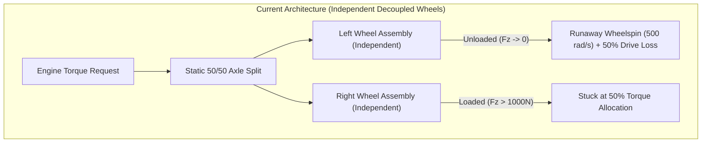
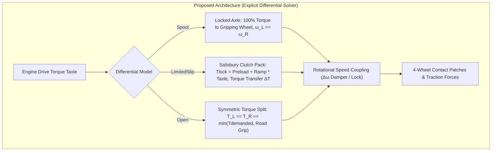

# Architecture Spec: Explicit Drivetrain Differential Models & Axle Coupling ⚙️🏎️🛞

A foundational vehicle physics architecture specification that introduces **explicit drivetrain differential models** and **cross-axle wheel coupling** to **TdRace**. Operating within the pure-Rust [`crates/wheelbase`](../crates/wheelbase) simulation engine and propagated through [`crates/tdrace-app`](../crates/tdrace-app), this architecture models real-world drivetrain mechanics—including locked solid axles (**Spool**), Salisbury multi-plate clutch limited-slip differentials (**LimitedSlip** with power/coast ramp angles and preload), and conventional **Open** differentials—with dynamic cross-axle torque reallocation and rotational velocity synchronization.

---

## 🗺️ Current vs. Proposed System Architecture

### 1. Current Architecture (Decoupled Wheels with Independent Open Splits)
In Spec 028, vehicle tires were decoupled into 4 independent wheel assemblies. However, drive torque was distributed via static factors (`drive_torque_factor = 0.5 * drive_bias` or `0.5 * (1 - drive_bias)`). When one wheel of a driven axle lost normal load or contact patch friction (e.g. inside rear wheel under cornering caster jacking or one side hitting ice/mud):
1. **Unconstrained Wheelspin:** The unloaded wheel accelerated rapidly ($\omega > 500\text{ rad/s}$), triggering engine overrev RPM audio and tire smoke.
2. **50% Axle Power Loss:** The gripping wheel on the other side continued receiving only its static 50% allocation of axle torque, wasting half of the engine's power into spinning the unloaded tire in mid-air.
3. **Missing Real-World Differential Distinction:** Real racing machines use radically different differential mechanisms:
   - **Karts, NASCAR Stock Cars, and Trophy Trucks** use 100% mechanically locked axles (**Spools**).
   - **GT3, LMH Hypercars, and Rallycross Supercars** use tunable multi-plate clutch limited-slip differentials (**LSDs**).
   - **Entry-level road cars** use conventional **Open** differentials.



### 2. Proposed Architecture (Explicit Differential Mechanical Models)
The proposed architecture introduces an explicit `DifferentialType` enum and mechanical cross-axle torque/velocity solver into [`crates/wheelbase`](../crates/wheelbase):



### Mathematical Formulation of Differential Modes

Let total demanded drive force on an axle be $F_{\text{drive, axle}}$. Total axle drive torque is $T_{\text{axle}} = F_{\text{drive, axle}} \cdot r_{\text{tire}}$.
Each tire $i \in \{L, R\}$ has dynamic friction capacity $F_{x, \text{cap}, i} = \sqrt{\max(0, (\mu_i F_{z, i})^2 - F_{y, i}^2)}$.
The maximum torque tire $i$ can transmit to the ground is $T_{\text{cap}, i} = F_{x, \text{cap}, i} \cdot r_i$.

#### 1. Spool (Locked Solid Axle)
* **Torque Transfer:** Left and right wheels are permanently connected by a rigid shaft. Torque transfers automatically to whichever wheel has grip:
  $$F_{\text{drive}, i} = F_{\text{drive, axle}} \cdot \frac{F_{z, i}}{F_{z, L} + F_{z, R}} \quad \text{(or grip capacity-weighted)}$$
* **Kinematic Constraint:** Rotational velocities are locked together:
  $$\omega_L = \omega_R = \frac{\omega_L + \omega_R}{2}$$
  Total axle rotational acceleration:
  $$\alpha_{\text{axle}} = \frac{(T_{\text{drive}, L} + T_{\text{drive}, R}) - (T_{\text{brake}, L} + T_{\text{brake}, R}) - (F_{x, L} r_L + F_{x, R} r_R)}{I_L + I_R}$$

#### 2. Limited-Slip Differential (Salisbury Multi-Plate Clutch)
* **Clutch Locking Torque:** Internal ramp angles and clutch plates compress under input torque and static preload:
  $$T_{\text{lock}} = T_{\text{preload}} + K_{\text{ramp}} \cdot |T_{\text{axle}}|$$
  where $K_{\text{ramp}} = \text{power\_lock} \in [0.0, 1.0]$ when accelerating ($T_{\text{axle}} \ge 0$), and $\text{coast\_lock} \in [0.0, 1.0]$ when trailing/engine braking ($T_{\text{axle}} < 0$).
* **Torque Transfer $\Delta T$:** If a speed difference exists ($\Delta \omega = \omega_{\text{slip}} - \omega_{\text{grip}} > 0$), torque transfers from the slipping wheel to the gripping wheel:
  $$\Delta T = \min\left(T_{\text{lock}}, \frac{1}{2} |T_{\text{axle}}|\right)$$
  $$T_{\text{grip}} = \frac{1}{2} T_{\text{axle}} + \Delta T, \quad T_{\text{slip}} = \frac{1}{2} T_{\text{axle}} - \Delta T$$
* **Rotational Coupling:** The clutch pack resists speed differentiation:
  $$\Delta \omega_{\text{damp}} = \text{clamp}\left(\frac{T_{\text{lock}}}{I_L + I_R} \cdot \Delta t, 0, \frac{|\omega_L - \omega_R|}{2}\right)$$

#### 3. Open Differential
* **Torque Equality:** $T_L = T_R = \frac{1}{2} T_{\text{axle}}$.
* **Grip Limitation:** Neither wheel can receive more tractive torque than the slipping wheel can support:
  $$T_{\text{delivered}, i} = \min\left(\frac{1}{2} T_{\text{axle}}, T_{\text{cap, min}}\right)$$
* **Free Rotational Freedom:** $\omega_L$ and $\omega_R$ accelerate independently subject to $\omega_{\text{driveshaft}} = \frac{\omega_L + \omega_R}{2}$.

---

## 🗄️ Database & Storage Migration Plan

### 1. Serde Backward Compatibility & Configuration Schema

```rust
/// Type and mechanical characteristics of an axle differential.
#[derive(Debug, Clone, Copy, PartialEq, Serialize, Deserialize)]
pub enum DifferentialType {
    /// 100% mechanical lock between left and right wheels (omega_L == omega_R).
    Spool,
    /// Salisbury multi-plate clutch limited-slip differential.
    LimitedSlip {
        /// Locking factor under power / acceleration in [0.0, 1.0].
        power_lock: f32,
        /// Locking factor under coast / trailing throttle in [0.0, 1.0].
        coast_lock: f32,
        /// Static clutch pack spring preload in N*m.
        preload_nm: f32,
    },
    /// Conventional open differential with 50/50 torque split.
    Open,
}
```

### 2. Modality & Vehicle Preset Calibration

| Modality / Preset | Front Differential | Rear Differential | Real-World Motorsport Rationale |
| :--- | :--- | :--- | :--- |
| **Kart** (`kart`) | `Open` (non-driven) | `Spool` | Direct 50mm solid chromoly axle; no differential; caster jacking lifts inside rear. |
| **NASCAR / TA1** (`stock_car_ta1`) | `Open` (non-driven) | `Spool` | Standard 9-inch Ford full mechanical steel spool or locked Detroit Locker. |
| **Extreme Off-Road Buggy** (`sand_rail`) | `Open` (non-driven) | `Spool` | 100% locked spool rear for maximum dune roost and sand flotation. |
| **Extreme Off-Road 4x4** (`mud_bogger`) | `Spool` | `Spool` | Dual mechanical front & rear axle lockers for extreme swamp traction. |
| **Trophy Truck** (`truck`) | `Open` (non-driven) | `Spool` | Solid live rear axle with spool differential. |
| **GT / Sports Car** (`sports_car`) | `Open` (non-driven) | `LimitedSlip` (0.50/0.30, 60 Nm) | Road/track 1.5-way Torsen/Salisbury clutch LSD for agile corner entry. |
| **GT3 / LMH** (`race_car`) | `Open` (non-driven) | `LimitedSlip` (0.70/0.50, 100 Nm) | Motorsport multi-plate 2-way clutch LSD with aggressive power lock. |
| **Drift Car** (`drift_car`) | `Open` (non-driven) | `LimitedSlip` (0.90/0.80, 140 Nm) | Welded 2-way locked LSD for sustained sideways oversteer holding. |
| **Rally / Supercar** (`rally_car`) | `LimitedSlip` (0.60/0.40, 70 Nm) | `LimitedSlip` (0.70/0.50, 85 Nm) | AWD dual multi-plate mechanical differentials for gravel/snow traction. |
| **Ice Racer** (`ice_racer`) | `LimitedSlip` (0.65/0.45, 80 Nm) | `LimitedSlip` (0.80/0.60, 100 Nm) | AWD aggressive LSD coupling with tungsten studded tires on sheet ice. |

---

## 🔑 Security, Compliance, & IAM Roles

* **Deterministic Invariance:** All differential equations use deterministic IEEE 754 arithmetic with no dynamic heap allocations or asynchronous system calls.
* **OKF v0.2 Knowledge Graph Compliance:** Technical drivetrain parameters remain cleanly indexed under vehicle telemetry and showroom portals.
* **Zero IAM / Cloud Elevation:** Simulation physics runs locally on client/server hardware with zero cloud privilege or credentials requirements.

---

## 🛡️ Disaster Recovery, Monitoring, & Fallbacks

* **Backward Compatibility:** All existing serialized `CarConfig` JSON files without differential fields deserialize with safe defaults (`front_differential: Open`, `rear_differential: LimitedSlip` or `Spool` depending on vehicle type).
* **Throughput SLA:** Stepping loop remains allocation-free and executes at $> 85,000\,\text{steps/sec}$.

---

## 🧪 Verification & Acceptance Criteria

### Automated Tests
- Command to run differential dynamics tests: `cargo test --test differential_dynamics_tests`
- Command to run decoupled tire tests: `cargo test --test decoupled_tire_physics_tests`
- Command to run full wheelbase suite: `cargo test --package wheelbase`
- Command to run turning capabilities benchmark: `cargo run --bin turning_benchmark`

### Manual Acceptance Criteria (Pseudo-Gherkin)

- **Scenario: Spool Axle 100% Torque Transfer Under Unloaded Wheel**
  - [x] **Given** a vehicle with `rear_differential = DifferentialType::Spool`
  - [x] **When** full throttle is applied while the inside rear wheel normal load drops to $0.0\text{ N}$
  - [x] **Then** $100\%$ of rear axle drive torque must be transferred to the loaded outside rear wheel
  - [x] **And** inside rear wheel angular velocity must match outside rear wheel angular velocity ($\omega_L == \omega_R$) with zero runaway wheelspin ($< 150\text{ rad/s}$ at $40\text{ km/h}$)

- **Scenario: Salisbury Limited-Slip Differential Torque Transfer**
  - [x] **Given** a vehicle with `rear_differential = DifferentialType::LimitedSlip { power_lock: 0.60, coast_lock: 0.40, preload_nm: 80.0 }`
  - [x] **When** entering wheel slip under throttle on split-$\mu$ surface (left on ice, right on tarmac)
  - [x] **Then** the gripping right wheel must receive significantly more tractive torque than the slipping left wheel ($T_{\text{right}} > T_{\text{left}}$)
  - [x] **And** the torque difference must scale proportionally with input drive torque and preload

- **Scenario: Open Differential Power Dissipation on Split Friction**
  - [x] **Given** a vehicle with `rear_differential = DifferentialType::Open`
  - [x] **When** accelerating with one wheel on ice ($\mu = 0.08$) and one wheel on dry asphalt ($\mu = 1.0$)
  - [x] **Then** both drive wheels must receive equal torque ($T_L == T_R$)
  - [x] **And** total drive force delivered to the chassis must be limited by twice the grip capacity of the slipping wheel

- **Scenario: Kart Low-Speed Geometric Turning Preservation**
  - [x] **Given** a `CarConfig::kart()` with `rear_differential = DifferentialType::Spool` and `caster_jacking_factor = 1.20`
  - [x] **When** maximum steering lock is applied at $12\text{ km/h}$
  - [x] **Then** turning circle diameter must remain under $2.6\text{ meters}$
  - [x] **And** cornering under full throttle must preserve forward acceleration without scrub stall

---

## 🔗 Traceability & Codebase Mapping

### Created/Modified Files
- `[x]` `crates/wheelbase/src/config.rs` -> Defines `DifferentialType` enum, fields on `CarConfig`, and vehicle presets.
- `[x]` `crates/wheelbase/src/car.rs` -> Implements differential solver for front and rear axles in `step_per_wheel`.
- `[x]` `crates/wheelbase/tests/differential_dynamics_tests.rs` -> Unit and integration tests for Spool, LSD, and Open differentials.
- `[x]` `reports/drivetrain_differential_models_report.md` -> Technical receipt documenting mechanical models and verification benchmarks.
- `[x]` `reports/drivetrain_differential_models_report.json` -> Structured benchmark telemetry dataset.
- `[x]` `specs/index.md` -> Registers Spec 034 in the progressive disclosure directory index.
- `[x]` `specs/constitution/ROADMAP.md` -> Links Spec 034 under Phase 6 next-gen vehicle dynamics milestones.

### Verification Assertions
- Header comments in modified Rust modules reference `specs/034_explicit_drivetrain_differential_models_and_axle_coupling.md`.
- Technical receipt generated in `reports/drivetrain_differential_models_report.md`.
