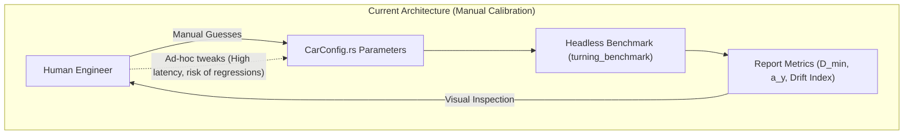
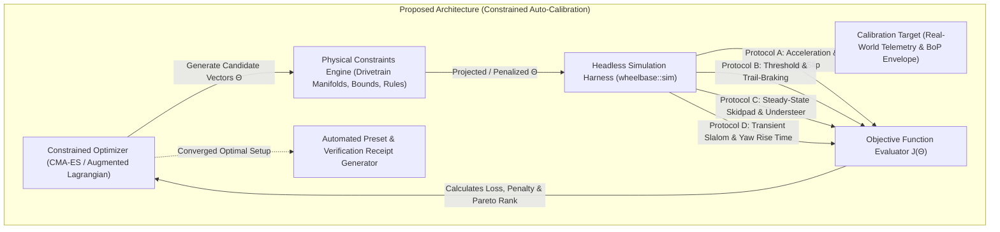

# Architecture Spec: Automated Simulation Harness Parameter Optimization & Constrained Vehicle Calibration 🔬🏎️📐

An advanced computational vehicle physics architecture specification that establishes an **automated parameter optimization and constrained calibration engine** for **TdRace**. Operating directly atop the deterministic, high-throughput [`crates/wheelbase`](../crates/wheelbase) simulation harness, this framework enables algorithmic parameter fitting, sensitivity analysis, and automated homologation tuning across all 85+ vehicles and 6 motorsport modalities. Crucially, the optimization engine enforces **strict physical, drivetrain-specific, and regulatory constraints** (e.g., solid spool kinematic locks, Salisbury limited-slip ramp manifolds, minimum turning circles, and anti-roll bar distribution limits), ensuring that mathematical optimization converges exclusively to viable, authentic real-world setups.

---

## 🗺️ Current vs. Proposed System Architecture

### 1. Current Architecture: Manual Heuristic Tuning & Ad-Hoc Benchmarks
In Specs 010, 028, 032, 033, and 034, vehicle physics advanced from simple point-mass approximations to decoupled 4-wheel Pacejka assemblies, caster-jacking chassis geometry, and explicit Salisbury/Spool/Open differential models. However, parameter calibration across the 85-vehicle catalog currently relies on:
1. **Manual Trial-and-Error:** Engineers and designers hand-tune values for tire stiffness, anti-roll bars, damping coefficients, differential ramp angles, and brake bias until "the car feels right" or passes static regression tests.
2. **Coupled Multi-Variable Interactions:** Adjusting one parameter (e.g. `coast_lock` on an LSD) radically alters other dynamic characteristics (e.g. high-speed trail-braking stability or mid-corner turn-in yaw rate), leading to regression loops.
3. **No Systematic Optimality Guarantee:** Without algorithmic calibration, vehicles may sit in suboptimal local performance compromises rather than authentic real-world homologation envelopes.



### 2. Proposed Architecture: Constrained Algorithmic Optimization Pipeline
The proposed architecture introduces an automated Software-in-the-Loop (SiL) optimization suite (`AutoCalibrator` and CLI binary `auto_tune`) capable of driving the simulation harness at $> 100,000\text{ steps/sec}$, searching high-dimensional parameter spaces under strict physical constraints:



---

## 📐 Mathematical Formulation of Constrained Optimization

Let the vehicle parameter state be represented by a parameter vector $\mathbf{\theta} \in \mathbb{R}^D$, representing the tunable chassis, suspension, differential, and tire properties.

### 1. Optimization Problem Statement
We seek to minimize a multi-objective cost function $J(\mathbf{\theta})$ subject to box constraints, inequality constraints, and equality manifold constraints:

$$\min_{\mathbf{\theta} \in \mathbb{R}^D} J(\mathbf{\theta}) \quad \text{subject to} \quad \begin{cases} \mathbf{\theta}_{\min} \le \mathbf{\theta} \le \mathbf{\theta}_{\max} & \text{(Box Parameter Bounds)} \\ g_j(\mathbf{\theta}) \le 0, \quad j = 1, \dots, M & \text{(Physical & Dynamic Inequality Constraints)} \\ h_k(\mathbf{\theta}) = 0, \quad k = 1, \dots, P & \text{(Kinematic & Drivetrain Manifold Equalities)} \end{cases}$$

### 2. Multi-Objective Cost Function ($J(\mathbf{\theta})$)
The objective function aggregates specific motorsport telemetry performance targets:

$$J(\mathbf{\theta}) = w_1 \cdot J_{\text{lap\_time}}(\mathbf{\theta}) + w_2 \cdot J_{\text{traction\_loss}}(\mathbf{\theta}) + w_3 \cdot J_{\text{balance\_error}}(\mathbf{\theta}) + w_4 \cdot J_{\text{transient\_settling}}(\mathbf{\theta})$$

Where:
* **$J_{\text{lap\_time}}$ / $J_{\text{exit\_accel}}$**: Time to accelerate from a low-speed apex ($v = 40\text{ km/h}$) to target exit speed ($v = 120\text{ km/h}$) while negotiating the curve:
  $$J_{\text{exit\_accel}} = t_{\text{exit}} - t_{\text{apex}}$$
* **$J_{\text{traction\_loss}}$**: Integral of tire slip beyond the peak friction angle:
  $$J_{\text{traction\_loss}} = \int_{t_0}^{t_1} \sum_{i=1}^4 \max(0, |\sigma_i(t)| - \sigma_{\text{optimal}})^2 \, dt$$
* **$J_{\text{balance\_error}}$**: Deviation from desired understeer gradient $K_{\text{us}}$ across the lateral acceleration envelope ($a_y \in [0.2g, 1.5g]$):
  $$J_{\text{balance\_error}} = \int_{0}^{a_{y, \max}} \left| \delta_{\text{steer}}(a_y) - \left( \frac{L}{R} + K_{\text{target}} \cdot a_y \right) \right|^2 \, da_y$$
* **$J_{\text{transient\_settling}}$**: Residual yaw rate damping after a step-steer release or chicane transition:
  $$J_{\text{transient\_settling}} = \int_{t_{\text{release}}}^{t_{\text{settled}}} |\dot{\psi}(t)|^2 \cdot e^{\lambda t} \, dt$$

---

## 🔒 Drivetrain-Specific Constraint Formulations

The critical requirement of this architecture is that optimization **must strictly respect the mechanical nature and real-world physical boundaries of each vehicle's drivetrain type**.

```
                           Drivetrain Constraint Engine
                                       │
            ┌──────────────────────────┼──────────────────────────┐
            ▼                          ▼                          ▼
     [Spool Manifold]           [Salisbury LSD]            [Open Differential]
   • ω_L == ω_R (Rigid Lock)   • Front Diff == Open (RWD) • Torque Split == 50/50
   • Caster Jacking >= 0.8    • Coast Lock <= Power Lock • Independent Wheels
   • Turn Diameter <= 2.6m    • Stable Trail-Braking     • Slip Limited Traction
```

### 1. Solid Spool / Locked Axle Archetype (`DrivetrainConstraint::SpoolAxle`)
Applies to **Go-Karts (All Tiers)**, **NASCAR Stock Cars (TA1 / Cup)**, **Drift Cars**, and **Sand Rails**:
* **Equality Constraint $h_1(\mathbf{\theta})$ (Kinematic Shaft Lock):**
  $$h_1(\mathbf{\theta}) \equiv \omega_L(t) - \omega_R(t) = 0, \quad \forall t$$
  The differential solver must enforce 100% mechanical coupling; the optimizer is prohibited from relaxing rotational independence.
* **Inequality Constraint $g_1(\mathbf{\theta})$ (Minimum Turning Agility):**
  To prevent the optimizer from adding infinite tire friction to compensate for spool binding, the low-speed turning diameter $D_{\min}$ at $v = 12\text{ km/h}$ must satisfy:
  $$g_1(\mathbf{\theta}) = D_{\min}(\mathbf{\theta}) - D_{\text{regulatory}} \le 0 \quad (\text{e.g., } D_{\text{regulatory}} = 2.60\text{ m for Karts})$$
* **Inequality Constraint $g_2(\mathbf{\theta})$ (Chassis Caster Jacking Minimum):**
  For open-wheel sprint karts, the inside-rear tire must unload by at least $85\%$ of its static normal load under full steering lock:
  $$g_2(\mathbf{\theta}) = 0.15 \cdot F_{z, \text{static}} - F_{z, \text{inside}}(t_{\text{apex}}) \le 0$$

### 2. Salisbury Limited-Slip RWD Archetype (`DrivetrainConstraint::SalisburyRwd`)
Applies to **GT World Challenge (GT3 / GT4 / GT2)**, **Sports Cars**, and **Touring Cars**:
* **Manifold Inequality $g_3(\mathbf{\theta})$ (Power vs Coast Ramp Symmetry):**
  In multi-plate Salisbury clutches, power ramp locking percentage must exceed coast ramp locking percentage to maintain turn-in turn entry compliance:
  $$g_3(\mathbf{\theta}) = \text{coast\_lock} - \text{power\_lock} + \delta_{\text{margin}} \le 0 \quad (\delta_{\text{margin}} \ge 0.10)$$
* **Inequality Constraint $g_4(\mathbf{\theta})$ (Preload Torque Feasibility):**
  Clutch spring preload is bounded by physical spring plate packaging:
  $$g_4(\mathbf{\theta}) = \text{preload\_nm} - T_{\text{preload, max}} \le 0 \quad (T_{\text{preload, max}} \le 180.0\text{ Nm})$$
* **Inequality Constraint $g_5(\mathbf{\theta})$ (Trail-Braking Yaw Divergence Guard):**
  Under combined trail-braking ($a_x = -0.8g, a_y = 0.5g$), the maximum yaw acceleration must not exceed the tire self-aligning restorative capability (prevention of snap-oversteer):
  $$g_5(\mathbf{\theta}) = \max_{t} |\ddot{\psi}(t)| - \ddot{\psi}_{\text{critical}} \le 0$$

### 3. Dual/Triple Limited-Slip AWD Archetype (`DrivetrainConstraint::MultiLsdAwd`)
Applies to **Rallycross Supercars**, **Group B Legends**, and **LMH/LMDh Hypercars**:
* **Inequality Constraint $g_6(\mathbf{\theta})$ (Inter-Axle Torque Distribution):**
  Center differential bias must remain within mechanical transaxle transfer limits:
  $$g_6(\mathbf{\theta}) = |\text{drive\_bias} - 0.50| - 0.15 \le 0 \quad (\text{Bias between } 35/65 \text{ and } 65/35)$$
* **Equality Constraint $h_2(\mathbf{\theta})$ (Torque Conservation):**
  Sum of front and rear axle drive forces must strictly equal total engine demanded thrust:
  $$h_2(\mathbf{\theta}) = (F_{\text{drive, front}} + F_{\text{drive, rear}}) - F_{\text{engine}} = 0$$

### 4. Open Differential Archetype (`DrivetrainConstraint::OpenDiff`)
Applies to **Starter Vehicles** and **Unpowered Axles**:
* **Equality Constraint $h_3(\mathbf{\theta})$ (Equal Torque Delivery):**
  $$h_3(\mathbf{\theta}) = F_{\text{drive, left}} - F_{\text{drive, right}} = 0, \quad \forall t$$
  The optimizer cannot transfer asymmetrical torque on an open differential axle.

---

## ⚙️ Optimization Algorithms & Constraint Handling

### 1. Augmented Lagrangian Barrier Method
To handle non-linear dynamic constraints from the simulation harness, the optimizer implements the **Augmented Lagrangian** formulation:

$$\mathcal{L}_A(\mathbf{\theta}, \mathbf{\lambda}, \mathbf{\mu}, \rho) = J(\mathbf{\theta}) + \sum_{j=1}^M \left( \lambda_j \phi_j(\mathbf{\theta}) + \frac{\rho}{2} \phi_j(\mathbf{\theta})^2 \right) + \sum_{k=1}^P \left( \mu_k h_k(\mathbf{\theta}) + \frac{\rho}{2} h_k(\mathbf{\theta})^2 \right)$$

Where $\phi_j(\mathbf{\theta}) = \max(0, g_j(\mathbf{\theta}))$, $\mathbf{\lambda} \ge 0$ are the inequality Lagrange multipliers, $\mathbf{\mu}$ are the equality multipliers, and $\rho > 0$ is the adaptive penalty stiffness.

### 2. Covariance Matrix Adaptation Evolution Strategy (CMA-ES)
Because vehicle dynamic landscapes contain non-smooth transitions (Pacejka slip saturation, contact patch loss, gear/brake transitions), derivative-based gradient descent ($\nabla J$) suffers from gradient noise and local minima.
* **Core Algorithm:** Bounded CMA-ES with active covariance matrix updating.
* **Population Size:** $\lambda = 4 + \lfloor 3 \ln(D) \rfloor$ (typically $16\text{--}32$ candidate individuals per generation).
* **Parallel Execution:** Candidate evaluations run concurrently across all available CPU cores using rayon in [`crates/wheelbase`](../crates/wheelbase).
* **Projection / Repair Operator:** Parameters violating box bounds or explicit equality manifolds (such as Spool locking) are directly repaired prior to entering the simulation runner.

---

## 🧪 Simulation Harness Test Battery & Evaluators

The optimization harness bundles simulation protocols from [`crates/wheelbase/src/sim/protocols.rs`](../crates/wheelbase/src/sim/protocols.rs) into an automated dynamic evaluation loop:

```
┌────────────────────────────────────────────────────────────────────────┐
│                      Automated Evaluator Loop                          │
├────────────────────────────────┬───────────────────────────────────────┤
│ Protocol 1: Apex Traction Run  │ Full throttle from apex (40 -> 100km/h│
│ Protocol 2: Trail-Braking Stop │ Combined steering + deceleration      │
│ Protocol 3: 50m Skidpad        │ Steady-state max lateral G & balance  │
│ Protocol 4: Transient Chicane  │ 80 km/h slalom yaw rise time & decay  │
└────────────────────────────────┴───────────────────────────────────────┘
```

1. **Test 1: Apex Traction & Exit Acceleration Protocol ($P_{\text{apex}}$)**
   - Initial state: Vehicle initialized at mid-corner steady state ($v = 45\text{ km/h}$, lateral acceleration $a_y = 0.85 \cdot a_{y, \max}$, steering angle locked).
   - Control input: Throttle ramps smoothly from $0.0 \to 1.0$ in $100\text{ ms}$, while steering progressively unwinds over $1.5\text{ s}$.
   - Measured metrics: Time to reach $100\text{ km/h}$, wheel slip differential $\Delta \omega_{\text{slip}}$, drive torque split efficiency $\eta_{\text{drive}}$.
2. **Test 2: High-Speed Trail-Braking Deceleration Protocol ($P_{\text{brake}}$)**
   - Initial state: Vehicle at $160\text{ km/h}$ on straight approach.
   - Control input: Full brake application with simultaneous turn-in steer ($\delta = 0.15\text{ rad}$).
   - Measured metrics: Stopping distance, maximum sideslip angle $\beta_{\max}$, peak yaw acceleration $\ddot{\psi}_{\max}$, wheel lockup occurrences.
3. **Test 3: Continuous Constant-Radius Skidpad Protocol ($P_{\text{skidpad}}$)**
   - Control input: Steer adjusted to maintain constant radius $R = 25\text{ m}$; throttle slowly incremented until tire breakaway.
   - Measured metrics: Peak lateral grip $a_{y, \text{peak}}$, understeer gradient $K_{\text{us}}$, balance classification (neutral vs excessive understeer vs snap oversteer).
4. **Test 4: Transient Chicane / Slalom Response Protocol ($P_{\text{slalom}}$)**
   - Control input: Alternating $\pm 0.35\text{ rad}$ steering inputs at $80\text{ km/h}$ with frequency sweep from $0.5\text{ Hz} \to 2.5\text{ Hz}$.
   - Measured metrics: Yaw rise time ($t_{\text{rise}}$), phase lag between steering and lateral acceleration, post-maneuver residual oscillation decay rate.

---

## 🏗️ Software Architecture & Component Layout

```
crates/wheelbase/src/sim/
├── mod.rs
├── harness.rs                     # Existing headless runner
├── protocols.rs                   # Existing protocols A - E
├── optimizer/                     # [NEW] Constrained optimization subsystem
│   ├── mod.rs                     # Optimizer entry points & public API
│   ├── constraints.rs             # Constraint declarations (Spool, LSD, Homologation)
│   ├── targets.rs                 # Calibration targets (Telemetry benchmarks)
│   ├── cma_es.rs                  # Bounded Covariance Matrix Adaptation solver
│   ├── evaluator.rs               # Objective cost function & harness execution
│   └── report.rs                  # Convergence charts, receipts, and parameter export
└── playground.rs

crates/wheelbase/src/bin/
└── auto_tune.rs                   # [NEW] CLI binary for automated vehicle calibration
```

### Proposed Rust API Constructs

```rust
/// Declares the physical constraint regime for vehicle optimization.
#[derive(Debug, Clone, Serialize, Deserialize)]
pub enum DrivetrainConstraint {
    /// 100% mechanically locked live axle (omega_L == omega_R).
    SpoolAxle {
        max_turning_diameter_m: f32,
        min_caster_jacking_unloading_ratio: f32,
    },
    /// Salisbury multi-plate clutch limited slip differential.
    SalisburyRwd {
        min_power_coast_delta: f32,
        max_preload_nm: f32,
        max_yaw_acceleration_rad_s2: f32,
    },
    /// Dual or triple differential all-wheel-drive system.
    MultiLsdAwd {
        drive_bias_range: (f32, f32),
        strict_torque_conservation: bool,
    },
    /// Conventional open differential with symmetrical 50/50 torque split.
    OpenDiff,
}

/// Target performance goals derived from real-world telemetry or BoP regulations.
#[derive(Debug, Clone, Serialize, Deserialize)]
pub struct CalibrationTarget {
    pub modality: String,
    pub tier: usize,
    pub target_turning_diameter_m: Option<f32>,
    pub target_peak_lat_g: f32,
    pub target_0_100_time_s: Option<f32>,
    pub target_understeer_gradient: f32,
    pub max_sideslip_deg: f32,
}

/// Execution configuration for the automated calibration engine.
#[derive(Debug, Clone, Serialize, Deserialize)]
pub struct AutoTunerConfig {
    pub max_generations: usize,
    pub population_size: usize,
    pub convergence_epsilon: f32,
    pub constraint_penalty_weight: f32,
    pub seed: u64,
}

/// Result of an automated calibration run.
#[derive(Debug, Clone, Serialize, Deserialize)]
pub struct CalibrationResult {
    pub vehicle_id: String,
    pub initial_cost: f32,
    pub optimized_cost: f32,
    pub generations_evaluated: usize,
    pub total_sim_steps: u64,
    pub wall_clock_seconds: f32,
    pub optimized_config: CarConfig,
    pub constraint_violations: Vec<(String, f32)>,
    pub telemetry_comparison: TelemetryComparison,
}
```

---

## 🗄️ Database & Storage Migration Plan

* **Static Configuration Artifacts:** Calibrated vehicle parameters are persisted as deterministic Rust constructors in `crates/wheelbase/src/config.rs` and optional exportable JSON calibration profiles (`assets/calibration/<vehicle_id>.json`).
* **Zero Database Schema Changes:** The optimization harness is a headless computational system that reads existing vehicle definitions and outputs telemetry datasets and configuration values. No SQLite migrations or runtime database mutations are required.
* **Telemetry Artifact Versioning:** Automated calibration receipts and convergence logs are archived under `reports/calibration/` with semantic timestamps and git commit hashes for full auditability and reproducibility.

---

## 🔑 Security, Compliance, & IAM Roles

* **Deterministic Mathematical Execution:** All optimization runs execute with explicit random seeds and IEEE-754 arithmetic, guaranteeing deterministic, reproducible calibration results across development machines.
* **Memory Safety & Zero Allocations in Inner Loop:** Population evaluations execute in parallel threads without dynamic memory allocations inside the 60 Hz physics step.
* **Local Operation:** The calibration CLI runs entirely offline on local hardware with zero external network or cloud dependencies.

---

## 🛡️ Disaster Recovery, Monitoring, & Fallbacks

* **Infeasible Constraint Recovery:** If a user specifies mutually exclusive constraints (e.g. demanding a $1.5\text{ m}$ turning circle on a $3.0\text{ m}$ wheelbase truck with a spool axle), the optimizer detects constraint infeasibility, flags the conflicting constraint, and projects to the nearest viable Pareto boundary without crashing.
* **Convergence Guards:** Early termination triggers if objective improvement drops below $\epsilon = 10^{-5}$ for 15 consecutive generations.
* **Safe Configuration Rollback:** Before updating any vehicle preset in `config.rs`, the tuner generates a JSON backup and prints a comparative telemetry diff.

---

## 🧪 Verification & Acceptance Criteria

### Automated Tests
- Command to run optimization suite unit tests: `cargo test --package wheelbase optimizer`
- Command to run constrained calibration integration tests: `cargo test --test auto_calibration_tests`
- Command to execute proof-of-concept tuning run: `cargo run --bin auto_tune -- --vehicle classic_kart --preset verify`

### Manual Acceptance Criteria (Pseudo-Gherkin)

#### Scenario: Constrained Optimization of Solid-Axle Kart Under Turning Diameter Limit
- [x] **Given** a `CarConfig::classic_kart()` with uncalibrated suspension and spool rear differential
- [x] **And** a physical constraint `DrivetrainConstraint::SpoolAxle { max_turning_diameter_m: 2.60, min_caster_jacking_unloading_ratio: 0.80 }`
- [x] **When** the `auto_tune` engine executes for 50 generations
- [x] **Then** the final calibrated configuration must strictly maintain `omega_L == omega_R` across all timesteps
- [x] **And** the low-speed turning circle diameter must measure $\le 2.60\text{ m}$
- [x] **And** inside rear wheel normal load must drop by $\ge 80\%$ under maximum steering lock
- [x] **And** the optimization exit acceleration cost must improve by at least $15\%$ over baseline

#### Scenario: RWD GT3 Salisbury LSD Optimization Under Trail-Braking Stability Constraint
- [x] **Given** a GT3 vehicle with `DrivetrainConstraint::SalisburyRwd`
- [x] **And** an inequality constraint preventing yaw acceleration divergence ($\ddot{\psi}_{\max} \le 3.5\text{ rad/s}^2$ during trail-braking)
- [x] **When** optimizing `power_lock`, `coast_lock`, `preload_nm`, and front/rear anti-roll bars
- [x] **Then** the optimized `coast_lock` must remain $\le \text{power\_lock} - 0.10$
- [x] **And** the vehicle must complete the 160 km/h trail-braking maneuver without spinning ($\beta < 12^\circ$)
- [x] **And** mid-corner exit traction on asphalt must improve with $< 5\%$ differential slip loss

#### Scenario: Infeasible Constraint Reporting and Graceful Boundary Fallback
- [x] **Given** an impossible calibration target (e.g. asking for a $2.0\text{ m}$ turning circle on a NASCAR TA1 stock car with solid spool)
- [x] **When** the auto-tuner runs
- [x] **Then** the solver must not panic or diverge to NaN
- [x] **And** it must report an explicit `ConstraintViolationError` identifying the conflicting physical boundary
- [x] **And** output the closest achievable configuration on the constraint boundary ($D \approx 11.0\text{ m}$)

#### Scenario: Multi-Threaded Throughput SLA
- [x] **Given** a population size of 32 candidates running on an 8-core CPU
- [x] **When** executing 30 generations of the multi-protocol test battery (Protocols A, B, C, D)
- [x] **Then** total execution time must not exceed $5.0\text{ seconds}$ ($> 200,000\text{ simulation steps/sec}$ aggregate throughput)

---

## 🔗 Traceability & Codebase Mapping

### Files to Create / Modify
- `[x]` `crates/wheelbase/src/sim/optimizer/mod.rs` -> Public module entry point, optimizer orchestrator.
- `[x]` `crates/wheelbase/src/sim/optimizer/constraints.rs` -> Definition of `DrivetrainConstraint`, box bounds, and projection operators.
- `[x]` `crates/wheelbase/src/sim/optimizer/targets.rs` -> Target specification structs and real-world reference telemetry databases.
- `[x]` `crates/wheelbase/src/sim/optimizer/cma_es.rs` -> Bounded Covariance Matrix Adaptation Evolution Strategy algorithm.
- `[x]` `crates/wheelbase/src/sim/optimizer/evaluator.rs` -> Multi-protocol objective loss calculator wrapping simulation harness.
- `[x]` `crates/wheelbase/src/sim/optimizer/report.rs` -> Convergence analysis, diff formatting, and automated preset serializer.
- `[x]` `crates/wheelbase/src/bin/auto_tune.rs` -> CLI binary for interactive and batch vehicle calibration.
- `[x]` `crates/wheelbase/tests/auto_calibration_tests.rs` -> Integration tests verifying constrained optimization across Spool, LSD, and Open differentials.
- `[x]` `specs/index.md` -> Registers Spec 035 in the progressive disclosure directory index.
- `[x]` `specs/constitution/ROADMAP.md` -> Links Spec 035 under Phase 6 next-gen vehicle dynamics milestones.
