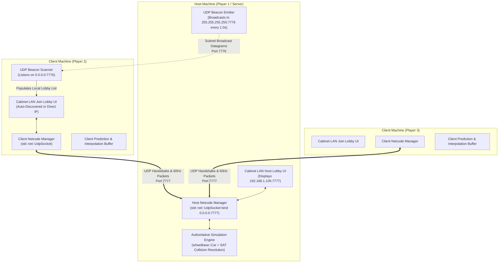

# Feature Spec: Local Network LAN Multiplayer & Cabinet Arcade Lobby 🌐🏎️

A zero-configuration, retro-inspired local area network (LAN) multiplayer architecture and reusable arcade lobby system for **TdRace** and the **Cabinet** arcade platform. This specification delivers the classic 1990s/2000s PC LAN gaming experience: one machine instantiates and hosts the session, prominently displays its local IP address, broadcasts discovery beacons across the local subnet, and waits in a synchronized lobby room while other players seamlessly join via auto-discovery or direct IP entry.

---

## 🎯 Executive Summary & Context

### 1. The Heritage LAN Experience
Classic PC multiplayer games (such as *Doom*, *Quake*, *Unreal Tournament*, *StarCraft*, *Age of Empires*, and early *Need for Speed* titles) provided an immediate, frictionless social gaming loop:
- **No external accounts, no cloud relays, and no third-party servers required**: Games ran entirely within the local physical network (living room, office, dorm, or LAN party).
- **Host & Share**: One player hosts the game. The application queries the operating system for its local IPv4 address (e.g. `192.168.1.105`) and renders it in clear, prominent lettering on screen.
- **Auto-Discovery & Direct Connect**: Nearby computers scanning the network immediately detect the broadcast beacon. If subnet broadcasting is filtered (e.g., enterprise Wi-Fi or access point isolation), players can manually type the Host's IP address and port into a direct connect prompt.
- **The Lobby Waiting Room**: Players gather in a common staging room where names, vehicle liveries, and readiness are synchronized in real-time. Once the host triggers the launch, all machines perform a synchronized 3-2-1 countdown and transition onto the starting grid simultaneously.

### 2. Current State in TdRace
- In `specs/008_modality_selection_and_menu_flow.md` and `crates/tdrace-app/src/game/mod.rs`, the modality menu features a dedicated `ModalityItem::LanPlay` option under the Multiplayer column.
- Currently, selecting `LanPlay` opens a temporary `ModalityModal::LanComingSoon` dialog.
- Core physics (`crates/wheelbase`) and track spline mathematics (`crates/arcade-race-core`) are already decoupled, deterministic, and headless-ready.
- The `cabinet` platform provides modular UI, screen stack navigation, player profiles, and design tokens, but lacks a dedicated networking and session lobby subsystem (`cabinet::net`).

### 3. The Need for `cabinet::net`
While low-level Rust libraries exist for raw socket transport (such as `std::net::UdpSocket` or `renet`), **no existing off-the-shelf Rust library provides the cohesive arcade game shell experience**: local IP resolution, UDP beacon discovery, direct IP input widgets, player slot allocation, ready-check synchronization, and synchronized grid countdowns. Housing this within `crates/cabinet` gives TdRace—and any future game built on Cabinet—an instant, batteries-included LAN multiplayer framework.

---

## 🔬 Rust Networking Ecosystem Analysis

An exhaustive review of the Rust ecosystem was conducted to evaluate existing libraries versus custom platform development in `cabinet`:

| Technology / Crate | Type / Role | Strengths | Limitations for LAN Arcade Use | Suitability for TdRace & Cabinet |
| :--- | :--- | :--- | :--- | :--- |
| **`std::net::UdpSocket`** (Rust Standard Library) | Low-level Datagram Transport | Zero dependencies; non-blocking mode (`set_nonblocking(true)`); native cross-platform support (Linux, Windows, macOS); instant compilation; zero async overhead. | Does not provide automatic packet sequencing, retransmission, or high-level lobby state machines. | **Primary Low-Level Transport**. LAN environments have $<2\text{ms}$ latency and negligible packet drop. Raw non-blocking UDP is optimal for local 60 Hz tick streaming and broadcast beacons. |
| **`renet` + `renet_netcode`** | Game Transport Protocol | Established Bevy/Rust gamedev transport; virtual connection handshake; reliable ordered / unreliable channels; cryptographically signed connection tokens. | Heavier abstraction; adds external dependencies; does not provide LAN beacon discovery or UI/lobby presentation. | **Alternative / Upstream Protocol**. Excellent for WAN/Cloud netcode, but overly complex for pure local subnet socket binding. |
| **`laminar`** | Semi-Reliable UDP Protocol | Developed by the Amethyst team; configurable reliability per virtual channel. | Maintenance has slowed; lacks modern serde integration and active community fixes. | **Not Recommended**. Superseded by `renet` and modern standard library patterns. |
| **`matchbox` / WebRTC** | P2P Signaling & Channels | Seamless WebAssembly (WASM) browser cross-play; reliable and unreliable data channels. | Requires an external signaling server (HTTP/WebSocket) to exchange SDP offers/answers, violating the zero-server local LAN requirement. | **Not Suitable for Offline LAN**. Useful only if browser-to-native cross-play over the internet is prioritized later. |
| **`mdns-sd` / `zeroconf`** | Multicast DNS Service Discovery | Industry standard service discovery (Apple Bonjour, Avahi). | Incurs complex C-library bindings, external system daemon requirements, or heavy async runtimes. Often fails across varying Linux distributions. | **Not Recommended**. Simple raw UDP subnet broadcast beacons (`255.255.255.255`) achieve the same goal with zero dependencies and 100% portability. |
| **`local-ip-address`** | Network Interface Scanner | Small, dedicated utility to query the active non-loopback local IPv4 address across OS adapters. | Adds a small third-party crate. | **Recommended Optional Utility**, or implementable in ~25 lines of native `std::net` UDP socket inspection. |

### Architectural Conclusion
1. **Network Engine**: Use non-blocking `std::net::UdpSocket` from the Rust standard library for both the discovery beacon (broadcast) and the game session datagram channel. This guarantees **zero external transport dependencies**, rapid compilation, and maximum determinism in the game loop.
2. **Platform Shell**: Create **`cabinet::net`** to supply the complete arcade lobby abstraction: local IP detection, periodic beacon broadcasting, peer scanning, connection state machines, direct IP input widgets, and lobby synchronization.
3. **Game Layer**: `tdrace-app` implements the authoritative game session runner, consuming `cabinet::net` for session orchestration and streaming vehicle kinematics between `wheelbase::Car` instances.

---

## 🏛️ System Architecture & Network Topology

LAN multiplayer operates as an **Authoritative Host-Client Architecture**:
- The hosting game client acts as both **Player 1** and the **Authoritative Session Server**.
- Connecting machines act as **Client Peers (Players 2..N)**, sampling local inputs, streaming them to the Host, and interpolating received authoritative world state.



### Port Assignments & Discovery Mechanics
- **Discovery Broadcast Port (`UDP 7776`)**: Dedicated discovery channel. The Host sends periodic advertisement packets to `255.255.255.255:7776`. All listening clients bind to `7776` with `SO_REUSEADDR / SO_BROADCAST` to aggregate available games.
- **Game Session Port (`UDP 7777`)**: Dedicated bidirectional game communication channel. If port `7777` is occupied by another process on the host, the engine automatically attempts sequential fallback ports (`7778..7785`) and advertises the chosen port in its beacon.

---

## 🗺️ User Flow & Interface Design

### 1. Navigation Flow & State Transitions

```mermaid
stateDiagram-v2
    [*] --> ModalitySelect: Navigate Menu

    state ModalitySelect {
        [*] --> FocusLanOption
        FocusLanOption --> LanHub: [ENTER on LAN Play]
    }

    state LanHub {
        [*] --> SelectHostOrJoin
        SelectHostOrJoin --> HostConfig: Choose "[1] HOST LAN GAME"
        SelectHostOrJoin --> JoinBrowser: Choose "[2] JOIN LAN GAME"
        SelectHostOrJoin --> ModalitySelect: Choose "[3] BACK" / [ESC]
    }

    state HostConfig {
        [*] --> SelectTrackAndRules
        SelectTrackAndRules --> HostLobby: [ENTER / Start Lobby]
        SelectTrackAndRules --> LanHub: [ESC / Cancel]
    }

    state JoinBrowser {
        [*] --> ScanningNetwork
        ScanningNetwork --> LobbyRoom: Select Found Host / [ENTER]
        ScanningNetwork --> DirectIpEntry: Press [TAB] / "Direct IP"
        DirectIpEntry --> LobbyRoom: Enter Valid IP & Connect
        JoinBrowser --> LanHub: [ESC / Cancel]
    }

    state LobbyRoom {
        [*] --> WaitingForReady
        WaitingForReady --> VehicleLiveryPicker: Change Car/Color
        WaitingForReady --> SynchronizedCountdown: Host presses "START RACE"
        LobbyRoom --> LanHub: [ESC / Leave Room]
    }

    state SynchronizedCountdown {
        [*] --> GridCountdown: 3-2-1
    }

    SynchronizedCountdown --> ActiveLanRace: Launch onto Track
```

---

### 2. UI Wireframes

#### Wireframe 1: Modality Hub LAN Selection
```
┌────────────────────────────────────────────────────────────────────────────────────────────────────────┐
│ RACE MODALITY SECTOR                                                           [PROFILE: MARIO] [ESP]  │
├────────────────────────────────────────────────────────────────────────────────────────────────────────┤
│   [ SINGLE PLAYER ]               [ MULTIPLAYER ]                     [ OPTIONS ]                      │
│                                                                                                        │
│   • Quick Race                    • Split Screen (2-4 Players)        • Player Profile & Dossier       │
│   • Custom Grand Prix           ► • Local LAN Play (PC / Network)     • Garage & Vehicle Showroom      │
│   • Motorsport Career             • Cloud Battle (Online Relay)       • Arcade Settings & Display      │
│   • Time Trial Hotlap                                                                                  │
├────────────────────────────────────────────────────────────────────────────────────────────────────────┤
│  DESCRIPTION: Host or join zero-lag races over your local Wi-Fi or Ethernet network. Old-school LAN!   │
│  [▲ / ▼] Navigate  •  [ENTER / A] Select Mode  •  [ESC / B] Return to Grand Hub                        │
└────────────────────────────────────────────────────────────────────────────────────────────────────────┘
```

#### Wireframe 2: Host Waiting Room Lobby (`GameState::LanHostLobby`)
```
┌────────────────────────────────────────────────────────────────────────────────────────────────────────┐
│ 🌐 LAN MULTIPLAYER HOST — "MARIO'S GRAND PRIX"                                  ROOM STATUS: IN LOBBY │
├────────────────────────────────────────────────────────────────────────────────────────────────────────┤
│  HOST IP ADDRESS: 192.168.1.105:7777                     [C] COPY IP TO CLIPBOARD • BROADCAST ACTIVE   │
│  TRACK: Circuit de Spa-Francorchamps (GT3)   •   LAPS: 5 LAPS   •   COLLISIONS: FULL SAT (SOLID BODY) │
├───────────────────────────────────────────────────────┬────────────────────────────────────────────────┤
│  CONNECTED DRIVERS (3 / 8 SLOTS FILLED)               │  HOST RACE CONTROLS & SETTINGS                 │
│                                                       │                                                │
│  SLOT 1 [HOST]:  MARIO [ESP]                          │  [1] TRACK: Spa-Francorchamps [CHANGE]         │
│  • Vehicle: Ferrari 296 GT3 (Scuderia Red)            │  [2] DISCIPLINE: GT World Challenge            │
│  • Status:  READY ⭐                                  │  [3] LAPS: 5 Laps                              │
│  • Latency: Host (0 ms)                               │  [4] AI FILL: OFF (3 Human Racers)             │
│                                                       │  [5] COLLISION: Solid Body (SAT)               │
│  SLOT 2:         ALEX [FRA]                           │                                                │
│  • Vehicle: Porsche 911 GT3 R (Viper Green)           │  ┌──────────────────────────────────────────┐ │
│  • Status:  READY ⭐                                  │  │                                          │ │
│  • Latency: 1.2 ms                                    │  │          [ START RACE ] [ENTER]          │ │
│                                                       │  │                                          │ │
│  SLOT 3:         KENJI [JPN]                          │  └──────────────────────────────────────────┘ │
│  • Vehicle: BMW M4 GT3 (Matte Black)                  │  (Enabled when all connected drivers are ready)│
│  • Status:  SELECTING CAR...                          │                                                │
│  • Latency: 2.1 ms                                    │  [C] Change My Car / Livery                    │
│                                                       │  [ESC] Disband Room & Exit                     │
│  SLOT 4..8:      [ OPEN SLOT - WAITING FOR RACER... ] │                                                │
└───────────────────────────────────────────────────────┴────────────────────────────────────────────────┘
```

#### Wireframe 3: Join LAN Game & Server Browser (`GameState::LanJoinBrowser`)
```
┌────────────────────────────────────────────────────────────────────────────────────────────────────────┐
│ 🔍 JOIN LOCAL LAN GAME — SEARCHING LOCAL SUBNET (PORT 7776)...                         [R] REFRESH LIST│
├────────────────────────────────────────────────────────────────────────────────────────────────────────┤
│  FOUND LOCAL GAMES ON YOUR NETWORK:                                                                    │
│                                                                                                        │
│  HOST NAME           ROOM TITLE            TRACK NAME           DRIVERS   DISCIPLINE   PING    ACTION  │
│  ──────────────────  ────────────────────  ───────────────────  ───────   ──────────   ─────   ──────  │
│  Mario (192.168.1.105) Mario's Grand Prix    Spa-Francorchamps    3 / 8     GT3 Pro      1 ms    [JOIN]  │
│  Luigi (192.168.1.112) Karting Madness       Lonato South Garda   2 / 6     125cc Shifter2 ms    [JOIN]  │
│                                                                                                        │
│  Select game with [▲ / ▼] and press [ENTER] to join lobby.                                             │
├────────────────────────────────────────────────────────────────────────────────────────────────────────┤
│  CAN'T FIND YOUR FRIEND'S HOST? USE DIRECT IP CONNECT:                                                 │
│                                                                                                        │
│  ENTER HOST IP:PORT: [ 192.168.1.105 : 7777 ]                                     [ CONNECT VIA IP ]  │
│                                                                                                        │
│  [1] [2] [3]   [4] [5] [6]   [7] [8] [9]   [ . ] [0] [⌫ BACK]   [PASTE FROM CLIPBOARD]                 │
├────────────────────────────────────────────────────────────────────────────────────────────────────────┤
│  [ENTER] Connect to Selected Game  •  [TAB] Jump to Direct IP Entry  •  [ESC] Back to Modality Select  │
└────────────────────────────────────────────────────────────────────────────────────────────────────────┘
```

---

## ⚙️ Backend Models & API Endpoints

While TdRace is a native, offline-capable Rust arcade title without remote HTTP cloud dependencies, the networking layer defines concrete Rust struct models, serialization contracts, and stateful socket API controllers.

### 1. Protocol Models & Structs

Implemented in `crates/cabinet/src/net/protocol.rs`:

```rust
pub const MAGIC_BYTES: [u8; 4] = [0x54, 0x44, 0x4C, 0x4E]; // "TDLN"
pub const PROTOCOL_VERSION: u8 = 1;
pub const DEFAULT_BEACON_PORT: u16 = 7776;
pub const DEFAULT_GAME_PORT: u16 = 7777;

#[derive(Debug, Clone, Serialize, Deserialize)]
pub struct LanBeacon {
    pub magic: [u8; 4],
    pub protocol_version: u8,
    pub server_name: String,
    pub host_player_name: String,
    pub game_port: u16,
    pub track_id: String,
    pub discipline: String,
    pub current_players: u8,
    pub max_players: u8,
    pub is_locked: bool,
}

#[derive(Debug, Clone, Serialize, Deserialize)]
pub enum LobbyPacket {
    JoinRequest {
        protocol_version: u8,
        player_name: String,
        country_code: String,
        car_model_id: String,
        color_scheme_id: String,
    },
    JoinResponse {
        result: JoinResult,
        room_name: String,
        track_id: String,
        laps: u8,
        slots: Vec<LobbySlot>,
    },
    StateSync {
        track_id: String,
        laps: u8,
        collision_mode: LanCollisionMode,
        slots: Vec<LobbySlot>,
    },
    ClientSlotUpdate {
        slot_id: u8,
        car_model_id: String,
        color_scheme_id: String,
        is_ready: bool,
    },
    LaunchCountdown {
        starts_in_millis: u32,
        grid_positions: Vec<u8>,
    },
    Ping { timestamp_ms: u64 },
    Pong { timestamp_ms: u64 },
}

#[derive(Debug, Clone, Copy, PartialEq, Eq, Serialize, Deserialize)]
pub enum JoinResult {
    Accepted { slot_id: u8 },
    RejectedFull,
    RejectedVersionMismatch,
    RejectedGameInProgress,
}

#[derive(Debug, Clone, Copy, PartialEq, Eq, Serialize, Deserialize)]
pub enum LanCollisionMode {
    FullSatSolid,
    GhostPassing,
    VergeOnly,
}

#[derive(Debug, Clone, Serialize, Deserialize)]
pub struct LobbySlot {
    pub slot_id: u8,
    pub player_name: String,
    pub country_code: String,
    pub car_model_id: String,
    pub color_scheme_id: String,
    pub is_ready: bool,
    pub is_host: bool,
    pub ping_ms: u16,
}

#[derive(Debug, Clone, Serialize, Deserialize)]
pub struct ClientInputPacket {
    pub sequence_num: u32,
    pub slot_id: u8,
    pub steering: f32,    // -1.0 .. 1.0
    pub throttle: f32,    // 0.0 .. 1.0
    pub brake: f32,       // 0.0 .. 1.0
    pub handbrake: bool,
}

#[derive(Debug, Clone, Serialize, Deserialize)]
pub struct WorldSnapshotPacket {
    pub tick: u32,
    pub session_elapsed_sec: f32,
    pub cars: Vec<CarStateSnapshot>,
}

#[derive(Debug, Clone, Serialize, Deserialize)]
pub struct CarStateSnapshot {
    pub slot_id: u8,
    pub pos_x: f32,
    pub pos_y: f32,
    pub velocity_x: f32,
    pub velocity_y: f32,
    pub heading_rad: f32,
    pub angular_velocity: f32,
    pub steer_angle_rad: f32,
    pub current_lap: u16,
    pub checkpoint_idx: u16,
    pub best_lap_time_ms: Option<u32>,
    pub last_lap_time_ms: Option<u32>,
    pub is_finished: bool,
}
```

### 2. Networking Engine Rust API Signatures

#### `cabinet::net::LanHost` API
Manages the authoritative server socket, beacon thread, and client slots:
```rust
impl LanHost {
    /// Binds the host server to local port (default: 7777) and starts beacon broadcaster on 7776.
    pub fn bind(server_name: &str, host_player: LobbySlot, port: u16, max_players: u8) -> Result<Self, NetError>;

    /// Pumps non-blocking UDP packets, updating slot states, processing inputs, and dropping timed-out clients.
    pub fn update(&mut self, dt: f32) -> Vec<HostEvent>;

    /// Broadcasts authoritative world snapshot to all connected clients at 60 Hz.
    pub fn broadcast_snapshot(&mut self, snapshot: &WorldSnapshotPacket) -> Result<(), NetError>;

    /// Triggers synchronized game launch countdown across all peers.
    pub fn start_countdown(&mut self, countdown_ms: u32) -> Result<(), NetError>;

    /// Returns the detected local primary IPv4 address.
    pub fn local_ip(&self) -> std::net::Ipv4Addr;
}
```

#### `cabinet::net::LanClient` API
Manages client connection, discovery scanning, and input streaming:
```rust
impl LanClient {
    /// Binds a local ephemeral client socket and connects to the specified host address.
    pub fn connect(host_addr: std::net::SocketAddr, player_profile: &PlayerProfile) -> Result<Self, NetError>;

    /// Listens passively on discovery port 7776 for active LAN beacons on the local subnet.
    pub fn poll_discovered_hosts(&mut self) -> &[DiscoveredHost];

    /// Pumps received snapshots, lobby updates, and calculates round-trip latency (ping).
    pub fn update(&mut self, dt: f32) -> Vec<ClientEvent>;

    /// Streams current 60 Hz input frame to the authoritative host.
    pub fn send_input(&mut self, input: ClientInputPacket) -> Result<(), NetError>;
}
```

---

## 🛡️ Security & Role-Based Access Controls (RBAC)

Even in offline local area networks, arcade software must defend against malformed packets, packet floods, and client state tampering.

### 1. Packet Sanitization & MTU Defense
- **Magic Byte Validation**: All datagrams must begin with the 4-byte signature `b"TDLN"`. Datagrams missing this header are dropped immediately before entering the serde deserializer.
- **Strict Size Bounds**: UDP datagrams are capped at a maximum buffer size of `1,400 bytes` (safely below the standard Ethernet MTU of 1,500 bytes). This prevents IP fragmentation and buffer overflow vulnerabilities.
- **String Sanitization**: Driver names and room titles are strictly clamped to a maximum of 24 characters, sanitized against control sequences or terminal escape injections, and trimmed of whitespace.

### 2. Role-Based Permissions (Host vs Client RBAC)
The architecture strictly enforces role boundaries between the session Host and connected Clients:

| Capability / Action | Host (Player 1) | Client (Players 2..8) | Enforcement Mechanism |
| :--- | :--- | :--- | :--- |
| **Track & Rule Selection** | Authorized | Denied | Host-authoritative `StateSync` packet. Client cannot alter track or laps. |
| **Launch Race Countdown** | Authorized | Denied | Only Host `LaunchCountdown` is honored. Client countdown packets are ignored. |
| **Kick / Evict Player** | Authorized | Denied | Host can close client slots; evicted clients receive `DisconnectNotice`. |
| **Vehicle / Livery Picker** | Own Car Only | Own Car Only | Client packets can only modify their own `slot_id`. Host discards updates to foreign slots. |
| **Physics Simulation** | Authoritative | Prediction Only | Host computes all collisions and rigid-body dynamics; client positions are overwritten by authoritative `WorldSnapshotPacket`. |

### 3. Rate Limiting & Denial of Service Protection
- The host socket implements a per-IP sliding window rate limiter: any remote IP sending $>120$ datagrams per second is temporarily throttled.
- Heartbeat timeouts: Clients that do not transmit inputs or pings within 3.0 seconds are flagged as dropped and pruned from the slot table.

---

## ⚡ In-Race Netcode & Kinematic Synchronization

Local network gameplay offers near-ideal networking conditions ($<2\text{ms}$ RTT, $0\%$ drop rate on wired Ethernet, $<0.1\%$ on modern Wi-Fi). The netcode architecture is designed to exploit these characteristics without the over-engineering of complex WAN rollback algorithms:

### 1. Client-Side Input & Dead Reckoning
- **Client Prediction**: Clients apply their own steering and acceleration inputs immediately to their local `wheelbase::Car` instance, eliminating input lag for the driver.
- **Snapshot Streaming**: The Host evaluates the full physics step for all vehicles at 60 Hz and broadcasts authoritative `WorldSnapshotPacket` datagrams.
- **Hermite Cubic Spline Interpolation**: Clients maintain a tiny 3-snapshot buffer ($\approx 33\text{ms}$ or 2 ticks). For opponent vehicles, the client interpolates position and heading using Hermite tangents derived from reported velocities:
  $$\mathbf{P}(t) = (2\tau^3 - 3\tau^2 + 1)\mathbf{P}_0 + (\tau^3 - 2\tau^2 + \tau)\mathbf{V}_0 \Delta t + (-2\tau^3 + 3\tau^2)\mathbf{P}_1 + (\tau^3 - \tau^2)\mathbf{V}_1 \Delta t$$
  where $\tau = \frac{t - t_0}{t_1 - t_0}$. This yields completely smooth, jitter-free opponent motion.

### 2. Collision Resolution & Arbitration
- **Host Authoritative SAT**: The Host executes the Separating Axis Theorem (SAT) collision detection across all vehicle oriented bounding boxes (OBBs) and barriers.
- When two cars collide, the Host calculates the elastic collision impulse and broadcasts the resulting corrected velocity and angular spin vectors in the next tick snapshot.
- The client smoothly blends any minor position correction over 3 frames ($\le 50\text{ms}$), preventing sudden snaps.

### 3. Disconnection & Drop Handling
- If a client fails to transmit inputs for 3.0 seconds (180 ticks), the Host marks the slot as disconnected.
- The disconnected player's vehicle can either:
  1. Coast smoothly to a stop along the track verge with hazard lights flashing, or
  2. Seamlessly transition to an AI bot matching the driver's favorite style and tier (leveraging Spec 024 Dynamic AI Tiering), ensuring the race continues uninterrupted for remaining players.

---

## 🧪 Verification & Acceptance Criteria

### Automated Tests
- Command to run Cabinet networking tests:
  ```bash
  cargo test -p cabinet --test net_tests
  ```
- Command to run TdRace LAN integration tests:
  ```bash
  cargo test -p tdrace-app --test lan_integration_tests
  ```

### Manual Acceptance Criteria (Pseudo-Gherkin)

#### Scenario: Host creates a LAN session and displays local IP
- [ ] **Given** the player navigates to the Multiplayer section of Modality Select
- [ ] **When** the player selects "Local LAN Play" and chooses "Host Game"
- [ ] **Then** the engine binds a non-blocking UDP socket on port `7777`
- [ ] **And** the host resolves its local IPv4 address (e.g. `192.168.1.X`)
- [ ] **And** the Host Waiting Room screen displays `HOST IP: 192.168.1.X:7777` in prominent typography
- [ ] **And** the UDP beacon broadcaster begins transmitting advertisements to `255.255.255.255:7776` once per second

#### Scenario: Client auto-discovers active LAN host via UDP beacon
- [ ] **Given** a Host is active and broadcasting on the local subnet
- [ ] **When** a second machine opens the "Join LAN Game" screen
- [ ] **Then** the client listens on UDP port `7776`
- [ ] **And** the host room appears in the server browser table within 1.5 seconds
- [ ] **And** the entry displays the host's driver name, room title, track name, and current player count

#### Scenario: Client connects via Direct IP entry
- [ ] **Given** a Host is running on `192.168.1.50:7777`
- [ ] **And** automatic subnet broadcasting is blocked by network AP isolation
- [ ] **When** the client selects the "Direct IP Connect" input field
- [ ] **And** enters `192.168.1.50:7777` and presses [Connect]
- [ ] **Then** the client sends a `LobbyPacket::JoinRequest` directly to `192.168.1.50:7777`
- [ ] **And** the Host registers the client in an available slot and responds with `JoinResponse::Accepted`
- [ ] **And** both screens update to show the joined player in Slot 2

#### Scenario: Real-time lobby customization and ready synchronization
- [ ] **Given** two players are in the LAN waiting room lobby
- [ ] **When** Client 2 selects a different car model or livery color
- [ ] **Then** Client 2 transmits a `ClientSlotUpdate` packet
- [ ] **And** the Host UI updates Slot 2 to render the newly chosen vehicle and livery in real-time
- [ ] **When** Client 2 toggles the "READY" state
- [ ] **Then** the Host's "START RACE" button activates

#### Scenario: Synchronized grid launch and countdown
- [ ] **Given** all connected players in the lobby are marked "READY"
- [ ] **When** the Host presses [ENTER] on "START RACE"
- [ ] **Then** the Host broadcasts `LobbyPacket::LaunchCountdown { starts_in_millis: 3000 }`
- [ ] **And** all connected game instances transition into the starting grid scene
- [ ] **And** the 3-2-1 countdown begins synchronously across all screens

#### Scenario: Smooth in-race vehicle synchronization
- [ ] **Given** a 2-player LAN race is active
- [ ] **When** Client 2 steers and accelerates down the track
- [ ] **Then** Client 2 transmits `ClientInputPacket` at 60 Hz to the Host
- [ ] **And** the Host simulates the car and broadcasts `WorldSnapshotPacket` to all peers
- [ ] **And** Client 1 and Client 2 render opponent cars smoothly without visible stutter or rubber-banding

---

## 🔗 Traceability & Codebase Mapping

### Crate Dependencies (`Cargo.toml`)
- `crates/cabinet/Cargo.toml`:
  - Add optional feature `"net"` (enabled by default) exposing `cabinet::net`.
  - Depend on `std::net` (standard library, 0 new external crates required for base transport).
  - Optional: add `local-ip-address = "0.6"` for robust multi-OS adapter enumeration if standard library inspection proves insufficient on specific platforms.

### Files to Create / Modify

#### 1. Cabinet Platform (`crates/cabinet`)
- `[ ]` `crates/cabinet/src/lib.rs` -> Export `pub mod net;` and convenient top-level networking structs.
- `[ ]` `crates/cabinet/src/net/mod.rs` -> Top-level networking types, errors, and configuration.
- `[ ]` `crates/cabinet/src/net/ip.rs` -> `LocalIpResolver` for local IPv4 discovery and formatting.
- `[ ]` `crates/cabinet/src/net/beacon.rs` -> `LanBeaconBroadcaster` and `LanBeaconScanner` using non-blocking UDP broadcast.
- `[ ]` `crates/cabinet/src/net/protocol.rs` -> Serialization protocols, packet schemas, and magic byte validations.
- `[ ]` `crates/cabinet/src/net/host.rs` -> `LanHost` managing client connections, slot table, and game ticks.
- `[ ]` `crates/cabinet/src/net/client.rs` -> `LanClient` managing socket connections, handshake, and packet buffering.
- `[ ]` `crates/cabinet/src/net/ui/ip_keypad.rs` -> 2D arcade virtual numeric pad widget for gamepad IP entry.
- `[ ]` `crates/cabinet/src/net/ui/host_screen.rs` -> Reusable Host Waiting Room Screen with IP banner and slot table.
- `[ ]` `crates/cabinet/src/net/ui/join_screen.rs` -> Reusable Server Browser and Direct IP connection screen.
- `[ ]` `crates/cabinet/tests/net_tests.rs` -> Automated loopback tests for beacon discovery, slot joins, and state sync.

#### 2. TdRace Game App (`crates/tdrace-app`)
- `[ ]` `crates/tdrace-app/src/game/mod.rs`:
  - Replace `ModalityModal::LanComingSoon` on `ModalityItem::LanPlay` with state transition to `GameState::LanHub`.
  - Add LAN game loop hooks to stream local player inputs to Host and apply received `WorldSnapshotPacket` states.
- `[ ]` `crates/tdrace-app/src/ui/lan_ui.rs` -> TdRace-specific styling and track preview integration for the LAN lobby.
- `[ ]` `crates/tdrace-app/src/render/nameplate.rs` -> Extend `FloatingBotNames` (from Spec 029) to render human player nameplates with latency/ping indicators.
- `[ ]` `crates/tdrace-app/tests/lan_integration_tests.rs` -> End-to-end integration test simulating two in-process game instances racing over local loopback UDP.

#### 3. Documentation & Governance
- `[ ]` `specs/index.md` -> Register Spec 036 in the technical specifications index table.
- `[ ]` `specs/constitution/ROADMAP.md` -> Link Spec 036 under Phase 5 / Backlog Milestones.
- `[ ]` `BACKLOG.md` -> Update Section 2.8 ("Networked Multiplayer Racing") marking the LAN spec as drafted.
