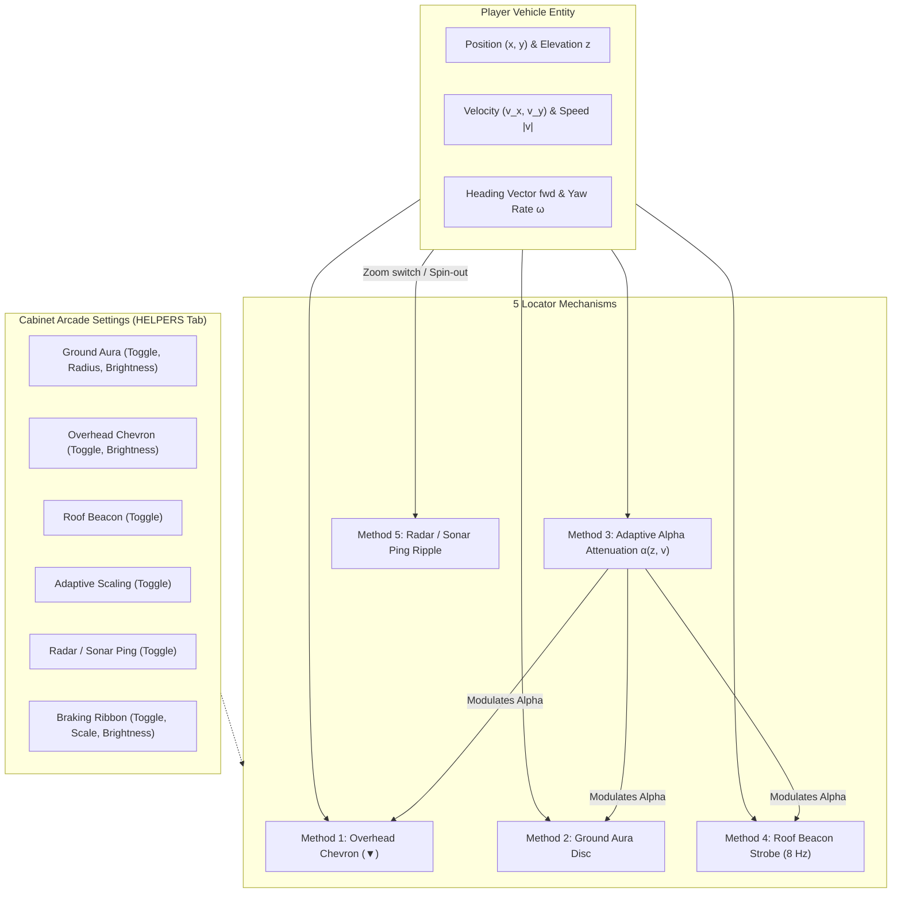

# Feature Spec: Player Car Visibility Aids, Locator Mechanisms, and Helpers Settings Architecture 🏎️✨📡

A formal engineering, rendering, and UI specification codifying all **five player car locator mechanisms** in **TdRace**, their mathematical formulations, visual behaviors, auto-trigger telemetry rules, and their unified configuration within the **Cabinet Arcade Settings Modal (`HELPERS` tab)**.

---

## 🗺️ User Flow & Interface Design

### 1. Navigation Flow & Tactical Engagement
In fast-paced top-down and 2.5D arcade motorsport games, maintaining instantaneous visual contact with the player's own vehicle is vital to gameplay fluency. In dense starting grids, multi-car collisions, high-speed drifts, and wide-angle dynamic camera zooms (e.g. Overview mode), human peripheral vision can momentarily lose track of the player car.



### 2. Detailed Breakdown of the Five Locator Methods

#### Method 1: Zoom-Invariant Overhead Inverted Chevron (`▼`)
- **Visual Design**: An inverted neon triangle pointing down directly toward the vehicle roof cell.
- **Screen Dimension Invariance**: Rendered in world coordinates but scaled inversely by camera zoom $Z$:
  $$W_{\text{half}} = \frac{9.0}{Z},\quad H = \frac{13.0}{Z},\quad \text{stroke} = \max\left(\frac{1.5}{Z}, 0.05\right)$$
- **Anchor Offset & Bobbing**: Clearance of $2.2\,\text{m}$ above vehicle center plus a constant $16.0\,\text{px}$ screen buffer and rhythmic sinusoidal bobbing:
  $$y_{\text{anchor}} = y_{\text{car}} + z_{\text{elevation}} + 2.2 + \frac{16.0 + 3.0 \cdot \sin(6.0 \cdot t)}{Z}$$
- **Styling**: Drop shadow offset by $(+0.12, -0.12)$, secondary team neon color (boosted if luminance $< 0.60$), high-contrast dark perimeter outline, and a crisp white internal highlight bar ($0.55 \cdot W_{\text{half}}$).

#### Method 2: Luminous Ground Aura / Underglow Disc
- **Visual Design**: Concentric triple-tier radial ground aura cast onto the track surface underneath the car chassis.
- **Zoom-Compensated Footprint**: Base radius $R_{\text{base}} = 2.4\,\text{m}$, clamped to never shrink below $15.0$ screen pixels:
  $$R_{\text{aura}} = \max\left(2.4, \frac{15.0}{Z}\right) \cdot r_{\text{scale}}$$
- **Layering & Opacity**:
  1. *Outer Halo*: Radius $R_{\text{aura}}$, opacity $0.32 \cdot \alpha_{\text{adaptive}} \cdot \beta_{\text{brightness}}$.
  2. *Mid Glow*: Radius $0.68 \cdot R_{\text{aura}}$, opacity $0.52 \cdot \alpha_{\text{adaptive}} \cdot \beta_{\text{brightness}}$.
  3. *Inner Core*: Radius $0.38 \cdot R_{\text{aura}}$, opacity $0.75 \cdot \alpha_{\text{adaptive}} \cdot \beta_{\text{brightness}}$.
  4. *Crisp Edge Ring*: Perimeter stroke $\max(2.0/Z, 0.06)$ defining the outer boundary.
- **Purpose**: Provides peripheral vision cues during sustained slides without drawing eyes away from the apex.

#### Method 3: Context-Aware Adaptive Visibility Scaling
- **Philosophy**: Aids should be crisp and prominent when navigating complex overviews or stopped, but subtle and non-distracting during high-speed technical driving.
- **Zoom Factor**: Fades linearly from full prominence ($1.0$) at overview zoom ($Z \le 6.0$) to subtle footprint ($0.15$) at close zoom ($Z \ge 18.0$):
  $$\alpha_{\text{zoom}} = \operatorname{clamp}\left(\frac{18.0 - Z}{18.0 - 6.0}, 0.15, 1.0\right)$$
- **Low-Speed Boost & Breathing Pulse**: When vehicle speed $v < 8.0\,\text{m/s}$, visibility is amplified:
  $$t_{\text{slow}} = \frac{8.0 - v}{8.0},\quad \alpha_{\text{speed}} = t_{\text{slow}} \cdot 0.35 + \sin(5.0 \cdot t) \cdot 0.15 \cdot t_{\text{slow}}$$
  $$\alpha_{\text{adaptive}} = \operatorname{clamp}(\alpha_{\text{zoom}} + \alpha_{\text{speed}}, 0.15, 1.0)$$

#### Method 4: High-Visibility Roof Beacon Strobe
- **Visual Design**: Diegetic day-glo fluorescent yellow strobe positioned at the vehicle roll-hoop / T-cam cell.
- **Minimum Screen Dot Size**: Base radius $0.22\,\text{m}$, clamped to at least $4.0$ screen pixels:
  $$R_{\text{beacon}} = \max\left(0.22, \frac{4.0}{Z}\right)$$
- **8 Hz Strobe Pulse**:
  $$p(t) = \left(0.5 + 0.5 \cdot \sin(8.0 \cdot t)\right)^{1.5}$$
  - Outer Pulsing Halo ($1.8 \cdot R_{\text{beacon}}$): Yellow-amber with alpha $(0.25 + 0.35 \cdot p(t)) \cdot \alpha_{\text{adaptive}}$.
  - Fluorescent Yellow Core: Day-glo RGBA `(1.0, 0.92, 0.20, 0.95)`.
  - Inner Flash Highlight: White spark highlight with alpha $(0.70 + 0.30 \cdot p(t))$.
  - Protective Perimeter Ring: Dark outline preventing washout against bright track surfaces.

#### Method 5: Radar / Sonar Ping Shockwave Ripple
- **Visual Design**: An animated dual-shockwave ripple emanating outward from the vehicle chassis.
- **Shockwave Dynamics**: Duration $T_{\text{max}} = 0.75\,\text{s}$. Progress parameter $p = 1.0 - (t_{\text{rem}} / T_{\text{max}})$.
  - Max wave radius $R_{\text{shock}} = \max(12.0\,\text{m}, 65.0/Z)$.
  - *Primary Wave*: Radius $r_1 = 0.5 + p \cdot R_{\text{shock}}$, alpha $\alpha_1 = (1.0 - p)^{1.6}$, neon cyan `(0.20, 0.90, 1.0)`.
  - *Glow Ring*: Ambient halo stroke behind the primary wave with alpha $0.20 \cdot \alpha_1$.
  - *Secondary Echo Wave*: Triggers at $p > 0.18$, expanding to $0.75 \cdot R_{\text{shock}}$ in golden yellow `(1.0, 0.85, 0.20)` with alpha $\alpha_2 = (1.0 - p_{\text{delayed}})^{1.8}$.
- **Trigger Strategy (No Hotkey)**:
  1. *Camera Zoom Shift*: Triggered whenever the player toggles camera zoom levels.
  2. *Spin-Out & Collision Disorientation*: Triggered automatically if car yaw rate $|\omega| > 4.5\,\text{rad/s}$ or lateral slip $|v_y| > 8.0\,\text{m/s}$ (with a 3.0s cooldown).
  3. *Stationary Overview*: Triggered when stopped ($v < 2.0\,\text{m/s}$) in Static Overview camera mode.
  4. *Settings Controlled*: Enabled/disabled entirely within the Arcade Settings Modal `HELPERS` tab. **No keyboard shortcut or hotkey is bound to this mechanism.**

---

## ⚙️ Backend Models & API Endpoints

### 1. Cabinet Helpers Settings State Model
In `crates/cabinet/src/state/settings.rs`, the persistent state is encapsulated in `HelpersSettingsState`:

```rust
#[derive(Debug, Clone, PartialEq)]
pub struct HelpersSettingsState {
    pub ground_aura: bool,
    pub ground_aura_radius_ratio: f32,
    pub ground_aura_brightness: f32,
    pub overhead_chevron: bool,
    pub overhead_chevron_brightness: f32,
    pub roof_beacon: bool,
    pub adaptive_visibility: bool,
    pub radar_sonar_ping: bool,
    pub braking_ribbon: bool,
    pub braking_ribbon_brightness: f32,
    pub braking_ribbon_scale: f32,
}
```

### 2. Player Visibility Options in tdrace-app
In `crates/tdrace-app/src/render/marker.rs`, runtime options match the cabinet settings model:

```rust
#[derive(Debug, Clone, Copy, PartialEq, Eq)]
pub struct PlayerVisibilityOptions {
    pub overhead_chevron: bool,
    pub ground_aura: bool,
    pub adaptive_visibility: bool,
    pub roof_beacon: bool,
    pub sonar_ping: bool,
    pub curve_helper: bool,
    pub curve_color_scheme: CurveColorScheme,
    pub bot_nameplates: bool,
}
```

### 3. Settings Modal Tab Navigation Specification
In `ArcadeSettingsModal`:
- Tab Bar: `["AUDIO", "CONTROLS", "DISPLAY", "GAMEPLAY", "HELPERS"]`
- NavGrid2D structure: Column 4 houses 11 item rows (10 widgets + bottom button row).
- Dirty detection: Evaluated against `SettingsSnapshot` fields (`aura_idx`, `aura_ratio`, `chevron_idx`, `beacon_idx`, `adaptive_idx`, `radar_ping_idx`, `ribbon_idx`).

---

## 🛡️ Security & Role-Based Access Controls (RBAC)

### 1. Visual Accessibility & Non-Intrusiveness
- All visibility aids operate in client screen/world space with zero mutation to physics simulation state or competitive telemetry.
- In split-screen multiplayer modes, visibility aids are isolated per-player viewport so Player 1's indicators do not obscure Player 2's line of sight.

### 2. Safe State Deserialization & Defaults Guard
- Missing fields in user configuration fallback cleanly to safe defaults (`true` for all locators, `1.0x` for scaling multipliers).
- Clamped slider boundaries prevent NaN or negative dimension panics during shader and circle drawing routines.

---

## 🧪 Verification & Acceptance Criteria

### Automated Tests
- Command to validate specification OKF compliance: `keel validate`
- Command to run system health diagnostics: `keel doctor`
- Command to compile and run cabinet settings tests: `cargo test -p cabinet --test cabinet_integration_tests`
- Command to verify visibility aid rendering and math: `cargo test -p tdrace-app --test visibility_aids_tests`

### Acceptance Criteria (Pseudo-Gherkin)

- **Scenario: Radar/Sonar Ping shockwave rendering dynamics**
  - [x] **Given** `visibility_options.sonar_ping` is enabled
  - [x] **When** a sonar ping is triggered with timer $t_{\text{rem}} = 0.75\,\text{s}$
  - [x] **Then** `render_player_sonar_ping` must draw an expanding primary circle of radius $0.5 + p \cdot R_{\text{shock}}$
  - [x] **And** when progress $p > 0.18$, a secondary delayed echo circle must be rendered
  - [x] **And** when $t_{\text{rem}} \le 0.0\,\text{s}$, zero draw calls must be issued

- **Scenario: Absence of dedicated hotkey for Radar/Sonar Ping**
  - [x] **Given** an active race session in `GameState::Racing`
  - [x] **When** any numeric key or alphanumeric key is pressed
  - [x] **Then** no hotkey shall toggle or manually fire the sonar ping
  - [x] **And** sonar ping toggle remains exclusively governed by the Settings Modal

- **Scenario: Automatic trigger on camera zoom cycle**
  - [x] **Given** `visibility_options.sonar_ping` is enabled
  - [x] **When** the player cycles the race camera zoom level (`Tab` or camera key)
  - [x] **Then** `sonar_ping_timer` must be reset to $0.75\,\text{s}$
  - [x] **And** `sonar_ping_origin` must match the player car's active world coordinate

- **Scenario: Automatic trigger on vehicle spin-out with cooldown**
  - [x] **Given** `visibility_options.sonar_ping` is enabled and `sonar_ping_cooldown <= 0.0`
  - [x] **When** the player vehicle experiences an angular velocity $|\omega| > 4.5\,\text{rad/s}$
  - [x] **Then** a sonar ping must be triggered at the car's position
  - [x] **And** `sonar_ping_cooldown` must be set to $3.0\,\text{s}$ to prevent visual strobing

- **Scenario: Arcade Settings Modal HELPERS tab persistence**
  - [x] **Given** `ArcadeSettingsModal` is opened
  - [x] **When** the user navigates to the `HELPERS` tab and toggles `RADAR / SONAR PING` to `Disabled`
  - [x] **And** saves and exits the modal
  - [x] **Then** `visibility_options.sonar_ping` in `RaceSession` must be `false`
  - [x] **And** subsequent camera zoom changes must not trigger a sonar shockwave

---

## 🔗 Traceability & Codebase Mapping

### Created / Modified Files

| Action | Path | Description |
| :--- | :--- | :--- |
| `[NEW]` | `specs/037_player_car_visibility_aids_and_locator_mechanisms.md` | Formal specification contract for all 5 locator methods. |
| `[MODIFY]` | `specs/index.md` | Catalog registration under Technical Specifications. |
| `[MODIFY]` | `crates/cabinet/src/state/settings.rs` | Adds `radar_sonar_ping` to `HelpersSettingsState`, `SettingsSnapshot`, and `ArcadeSettingsModal` `HELPERS` tab. |
| `[MODIFY]` | `crates/tdrace-app/src/render/marker.rs` | Restores `render_player_sonar_ping` and adds `sonar_ping: bool` to `PlayerVisibilityOptions`. |
| `[MODIFY]` | `crates/tdrace-app/src/render/mod.rs` | Re-exports `render_player_sonar_ping`. |
| `[MODIFY]` | `crates/tdrace-app/src/game/mod.rs` | Wires helpers modal sync, auto-ping triggers, and world-space shockwave rendering without hotkeys. |
| `[MODIFY]` | `crates/tdrace-app/tests/visibility_aids_tests.rs` | Validates all 5 methods and settings persistence. |
| `[MODIFY]` | `crates/cabinet/tests/cabinet_integration_tests.rs` | Tests `ArcadeSettingsModal` `HELPERS` tab navigation and restore defaults. |

### Beads Epic Mapping
- Governed by Epic `tdrace-player-helpers-settings-yaxr` (*Fulfill Spec 037: Player Car Visibility Aids & Locator Settings in ArcadeSettingsModal*).
