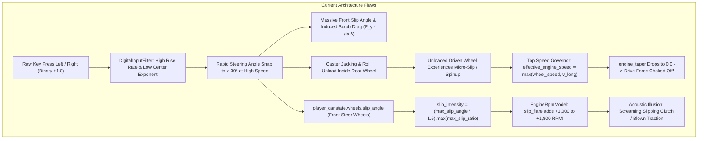
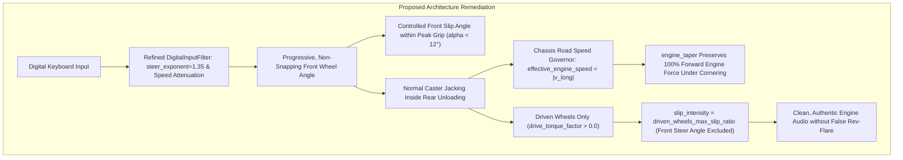

# Architecture Spec: Keyboard Steering Signal Smoothing, Drivetrain Power Governor Decoupling, and Audio RPM Telemetry Isolation 🏎️🎛️🔊

A formal engineering, physics, and input architecture specification eliminating vehicle hesitation, power loss, and auditory artifacts during keyboard-controlled turning across **TdRace**.

---

## 🗺️ Current vs. Proposed System Architecture

### 1. Current Architecture & Problem Diagnosis
Following the introduction of independent 4-wheel assemblies (`Spec 028`), caster jacking (`Spec 032`), and explicit differential models (`Spec 034`), players operating vehicles with digital keyboard controls—particularly lightweight, high-agility vehicles like the **Sprint Kart** in the **Classic Module**—reported sudden power loss, severe deceleration, and screaming engine revolutions upon initiating minor steering inputs.

Three compounding root causes were identified across the input, drivetrain physics, and audio synthesis pipelines:



### 2. Proposed Architecture
The proposed architecture decouples chassis road speed from wheel spin in the power governor, isolates engine audio rev-flare strictly to driven wheel slip, and refines keyboard digital steering filters:



---

## 📦 Technology & Component Selection

| Component | Layer / Module | Current Behavior | Proposed Corrective Specification |
| :--- | :--- | :--- | :--- |
| `DigitalInputFilter` | `crates/cabinet/src/input/filter.rs` | Rapid steering rise rate without sufficient soft center deadband. | Default `steer_exponent = 1.35` for gentle micro-corrections, balanced rise rate (`6.0`), and speed-sensitive scaling. |
| `effective_engine_speed` | `crates/wheelbase/src/car.rs` | Takes `v_long.abs().max(max_driven_wheel_linear_speed)`. | Evaluated strictly against chassis longitudinal speed `v_long.abs()`. Momentary wheelspin no longer triggers speed governor choke. |
| `slip_intensity` | `crates/tdrace-app/src/game/mod.rs` | `(max_slip_angle * 1.5).max(max_slip_ratio)`. | Computes max longitudinal `slip_ratio` strictly across driven wheels (`drive_torque_factor > 0.0`). Unpowered front steer angles are excluded. |
| `car_classic_kart` | `crates/tdrace-app/src/module/classic.rs` | Overrides `max_steer_angle = 0.73` rad (~41.8°). | Aligns with calibrated FIA benchmark `max_steer_angle = 0.65` rad (~37.2°), preserving `Spool` differential and `caster_jacking_factor = 1.25`. |

---

## 📐 Detailed Design & Data Contracts

### 1. Digital Keyboard Steering Smoothing (`cabinet::input::filter`)
Digital keys provide binary states (0 or 1). To enable subtle trajectory micro-corrections on straights and high-speed sweepers without twitching into tire slide saturation, the input filter applies a power curve:
$$\text{curved\_steer} = \text{sgn}(s) \cdot |s|^\gamma$$
- Default $\gamma = 1.35$ in `DigitalInputConfig` (softening a 30% keyboard tap down to ~19% effective steer angle).
- High-speed steering attenuation factor:
$$\text{speed\_scale} = \max\left(\frac{1}{1 + v_{\text{mps}} \cdot k_{\text{speed}}},\; \text{limit}_{\min}\right)$$

### 2. Drivetrain Power Governor Decoupling (`wheelbase::car::Car`)
In `wheelbase/src/car.rs`, top-speed engine taper must evaluate against vehicle road velocity:
$$\text{effective\_engine\_speed} = |v_{\text{long}}|$$
$$\text{speed\_ratio} = \frac{\text{effective\_engine\_speed}}{v_{\text{top}}}$$
$$\text{engine\_taper} = \begin{cases} 1.0 & \text{if } \text{speed\_ratio} < 0.90 \\ \left(1.0 - \frac{\text{speed\_ratio} - 0.90}{0.10}\right) & \text{otherwise} \end{cases}$$

### 3. Audio Engine RPM Telemetry Isolation (`tdrace-app::game::RaceSession`)
In `tdrace-app/src/game/mod.rs`:
```rust
let driven_wheel_slip_ratio = player_car.state.wheel_assemblies.iter()
    .zip(player_car.state.wheels.iter())
    .filter(|(assembly, _)| assembly.config.drive_torque_factor > 0.0)
    .map(|(_, telemetry)| telemetry.slip_ratio.abs())
    .fold(0.0f32, f32::max);
let slip_intensity = driven_wheel_slip_ratio;
```

---

## 🗄️ Database & Storage Migration Plan

### 1. Zero Database Schema Mutations
This architectural remediation affects runtime in-memory input filtering, physics stepping, and audio telemetry dispatch. It requires:
* Zero changes to persistent SQLite records (`tdrace_records.db`).
* Zero breaking changes to `GameConfig` or `CarConfig` serde schemas.
* Full backward compatibility with existing TOML configurations (`config.toml`, `config.*.toml`).


---

## 🔑 Security, Compliance, & IAM Roles

* **Deterministic Invariance:** All steering and drivetrain calculations remain 100% deterministic IEEE 754 arithmetic with no dynamic allocations or thread locks.
* **Backward Compatibility:** All existing input bindings and gamepad profiles remain unaffected. Gamepad analog sticks bypass digital keyboard smoothing curves.
* **OKF v0.2 Knowledge Graph Compliance:** Specifications and code changes cleanly adhere to OKF v0.2 frontmatter schemas and Keel SDD lifecycle gates.

---

## 🛡️ Disaster Recovery, Monitoring, & Fallbacks

* **Gamepad Isolation:** Gamepad analog inputs are polled directly from hardware axes without passing through the digital keyboard ramp, preserving authentic analog granularity.
* **Throughput SLA:** Stepping loop remains allocation-free and executes at $> 85,000\,\text{steps/sec}$.

---

## 🧪 Verification & Acceptance Criteria

### Automated Tests
- Command to validate specification OKF compliance: `keel validate`
- Command to verify digital input smoothing and progressive tap: `cargo test -p tdrace-app --test input_smoothing_tests`
- Command to verify differential torque transfer and spool lock: `cargo test -p wheelbase --test differential_dynamics_tests`
- Command to verify kart cornering stability under keyboard control: `cargo test -p tdrace-app --test kart_steering_stability_tests`

### Manual Acceptance Criteria (Pseudo-Gherkin)

- **Scenario: Digital keyboard steering progressive tap response**
  - [ ] **Given** a vehicle driven via keyboard with `DigitalInputFilter`
  - [ ] **When** a steering key is tapped for 66 ms (4 frames at 60 Hz)
  - [ ] **Then** the filtered steering value must be between 0.15 and 0.45
  - [ ] **And** must not snap instantaneously to 1.0 full lock

- **Scenario: Top-speed governor does not choke engine during inside wheel unloading**
  - [ ] **Given** a competition kart with `DifferentialType::Spool` and `caster_jacking_factor > 1.0`
  - [ ] **When** turning sharply at 20 m/s (~72 km/h) under full throttle
  - [ ] **And** the inside rear wheel unloads and exhibits rotational speed $\omega \cdot r > v_{\text{long}}$
  - [ ] **Then** the engine tractive drive force must not be choked to zero by `engine_taper`
  - [ ] **And** forward acceleration must remain positive on asphalt

- **Scenario: Front steering slip angle does not induce engine audio rev flare**
  - [ ] **Given** a rear-wheel-drive vehicle executing a turn on high-grip asphalt
  - [ ] **When** the front steer wheels exhibit lateral slip angle $\alpha > 0.20\,\text{rad}$ while driven rear wheels maintain grip ($s_{\text{ratio}} < 0.10$)
  - [ ] **Then** `slip_intensity` fed to `EngineRpmModel` must remain below 0.15
  - [ ] **And** no audible engine rev flare ($> 500\,\text{RPM}$) shall occur

- **Scenario: Classic Sprint Kart steering lock alignment**
  - [ ] **Given** the active game module is `"classic"`
  - [ ] **When** `ClassicGameModule::car_classic_kart()` is instantiated
  - [ ] **Then** `max_steer_angle` must be $\le 0.65\,\text{rad}$
  - [ ] **And** `rear_differential` must be `DifferentialType::Spool`

---

## 🔗 Traceability & Codebase Mapping

### Created/Modified Files

| Action | Path | Description |
| :--- | :--- | :--- |
| `[NEW]` | `specs/038_keyboard_steering_smoothing_and_drivetrain_telemetry_isolation.md` | Formal architecture specification contract. |
| `[MODIFY]` | `specs/index.md` | Catalog registration under Technical Specifications. |
| `[MODIFY]` | `specs/constitution/ROADMAP.md` | Milestone tracking under Phase 6. |
| `[MODIFY]` | `crates/cabinet/src/input/filter.rs` | Ensure default steering rise/return rates and exponent allow progressive key modulation. |
| `[MODIFY]` | `crates/wheelbase/src/car.rs` | Decouple top-speed governor `effective_engine_speed` from transient wheelspin linear speed. |
| `[MODIFY]` | `crates/tdrace-app/src/game/mod.rs` | Isolate audio RPM rev flare to driven-wheel longitudinal slip ratio. |
| `[MODIFY]` | `crates/tdrace-app/src/module/classic.rs` | Align `car_classic_kart` steering lock with calibrated FIA benchmark (0.65 rad). |
| `[NEW]` | `crates/tdrace-app/tests/kart_steering_stability_tests.rs` | Integration test suite verifying keyboard steering stability, engine rev isolation, and drive continuity. |

---

## 📜 RDD Verification Receipt

A durable verification receipt will be recorded upon implementation via:
```bash
keel receipt 038 --cmd "cargo test -p tdrace-app --test kart_steering_stability_tests && cargo test -p tdrace-app --test input_smoothing_tests"
```
